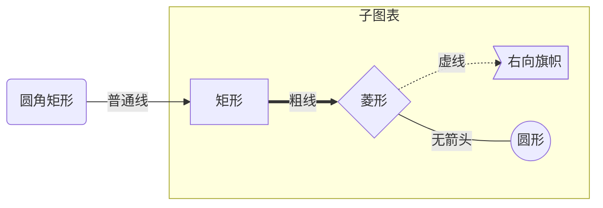

### 一 流程图
#### 1. 图表方向
Mermaid 支持多种图表的方向，语法如下：（其中“方向描述”参考下列表格）
```
graph 方向描述
    图表中的其他语句...
```
| 方向描述 |   含义   |
| :-----: | :-----: |
|   TB    | 从上到下 |
|   BT    | 从下到上 |
|   RL    | 从右到左 |
|   LR    | 从左到右 |

#### 2. 节点定义
即流程图中每个文本块，包括开始、结束、处理、判断等。Mermaid 中每个节点都有一个 id，以及节点的文字。
 表述 | 说明
 :-: | :-:
 id[文字] | 矩形节点
 id(文字) | 圆角矩形节点
 id((文字)) | 圆形节点
 id>文字] | 右向旗帜状节点
 id{文字} | 菱形节点

**【注意】：** 如果节点的文字中包含标点符号，需要时用双引号包裹起来。另外如果希望在文字中使用换行，请使用 `<br \>`

#### 3. 节点间的连线
 表述 | 说明  
 :-: | :-:  
 > | 添加尾部箭头
 -- | 单线
 --text-- | 单线上加文字
 - | 不添加尾部箭头
 == | 粗线
 ==text== | 粗线加文字
 -.- | 虚线
 -.text.- | 虚线加文字  

#### 4. 子图表
```
subgraph 子图表名称
    子图表中的描述语句...
end
```
**【举个例子】：**  
```
graph LR
    id1(圆角矩形)--普通线-->id2[矩形]
    subgraph 子图表
        id2==粗线==>id3{菱形}
        id3-.虚线.->id4>右向旗帜]
        id3--无箭头---id5((圆形))
    end
```



### 二 序列图


### 三 甘特图

