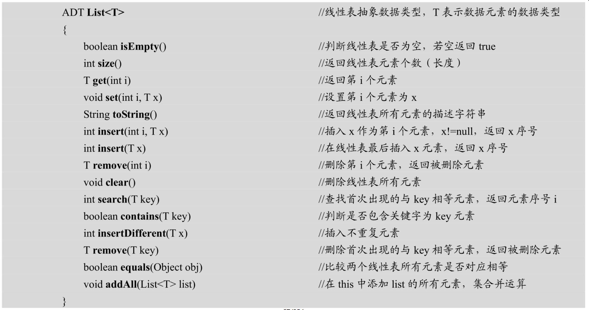
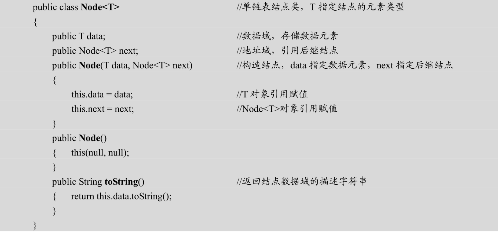
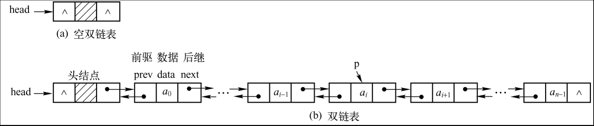
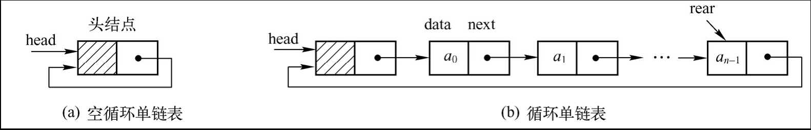
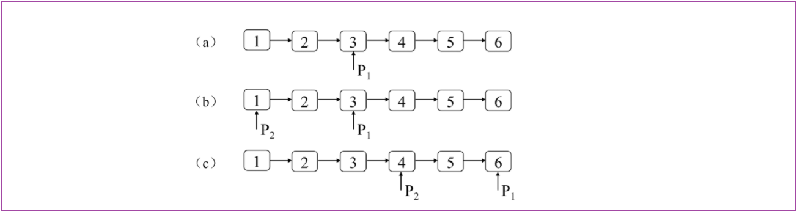

#  一 线性表的定义

## 1. 定义和特点

由 `n（n≥0）`个数据特性相同的元素构成的有限序列称为**线性表（Linear List）**，线性表中元素的个数`n（n≥0）`定义为线性表的长度，n=0时称为空表。n 是线性表的元素个数，称为线性表长度（Length）

对于非空的线性表或线性结构，其特点是：
（1）存在唯一的一个被称作“第一个”的数据元素；
（2）存在唯一的一个被称作“最后一个”的数据元素；
（3）除第一个之外，结构中的每个数据元素均只有一个**前驱（Predecessor）** 
（4）除最后一个之外，结构中的每个数据元素均只有一个**后继（Successor）** 


## 2. 抽象数据类型




# 二 顺序表示和实现

## 1. 顺序存储表示

线性表的顺序表示指的是用一组地址连续的存储单元依次存储线性表的数据元素，这种表示也称作线性表的顺序存储结构或顺序映像。通常，称这种存储结构的线性表为**顺序表（Sequential List）**，其特点是：

- <font color=red>逻辑上相邻的数据元素，其物理次序也是相邻的</font> . 

- 由此，只要确定了存储线性表的起始位置，线性表中任一数据元素都可随机存取，所以线性表的顺序存储结构是一种随机存取的存储结构。

- 由于高级程序设计语言中的数组类型也有随机存取的特性，因此，<font color=red>通常都用数组来描述数据结构中的顺序存储结构</font> . 

  线性表的长度可变，所需最大存储空间随问题不同而不同，更像一个动态数组（Java中的ArrayList）


## 2. 顺序表的实现


# 三 链式表示和实现

线性表的链式存储结构是用若干地址分散的存储单元存储数据元素，逻辑上相邻的数据元素在物理位置上不一定相邻，因此，必须采用附加信息表示数据元素之间的顺序关系。存储一个数据元素的存储单元称为结点（Node），一个结点至少包含以下两部分：

```java
node(data, address)
```

其中，数据域存储数据元素；地址域（也称为链）存储前驱或后继元素地址。


一个结点表示一个数据元素，通过结点中的地址域将结点链接起来，结点间的链接关系体现了线性表中数据元素间的顺序关系。

采用链式存储结构表示的线性表称为**线性链表（Linked List）**，一条线性链表必须使用一个头指针记住元素a0的结点地址。


## 1. 单链表

每个结点只有一个地址域的线性链表称为**单链表（Singly Linked List）** ，声明单链表结点类 `Node<T>` 如下



`Node<T>` 是自引用的类，它的成员变量next的数据类型是`Node<T>`类自己。**自引用的类（Self-referential Class）**指一个类声明包含引用当前类实例的成员变量。


```java
package cn.itdrizzle.linkedlist;

import java.util.Objects;

/**
 * @Classname SingleLinkedList
 * @Description 基于链表实现的线性表
 * @Date 2022/3/2 13:43
 * @Author idrizzle
 */
public class SingleLinkedList<E> {
    protected Node head;
    protected int size;

    /***
     * 根据 value 创建节点并插入链表末尾
     * @param value  待插入的数据
     * @author itdrizzle
     * @date 2022/3/2 15:13
     */
    public void append(E value) {
        final Node newNode = new Node(value);
        // 当表头节点为为空。此时新添加的节点成为链表中唯一的节点，也就是链表的头节点
        if (this.isEmpty()) {
            head = newNode;
            size++;
            return;
        }

        Node node = head;
        while (node.next != null) {
            node = node.next;
        }
        node.next = newNode;
        size++;
    }

    /***
     * 根据 value 创建节点并插入链表末尾 (使用哨兵节点)
     * @param value 待插入的数据
     * @author itdrizzle
     * @date 2022/3/2 15:43
     */
    public void appendByDummy(E value) {
        // 在头结点之前定义一个哨兵节点
        Node dummy = new Node(null);
        dummy.next = head;

        Node node = dummy;
        while (node.next != null) {
            node = node.next;
        }
        node.next = new Node(value);
        size++;
        head = dummy.next;
    }

    /***
     * 删除第一个值为 target 的节点
     * @param target  指定值
     * @author itdrizzle
     * @date 2022/3/2 15:40
     */
    public void remove(E target) {
        // 链表为空的情形
        if (this.isEmpty()) {
            return;
        }
        // 删除头结点（第一个结点）的情形, 需要注意传入的target可能为空
        if (Objects.equals(target, head.data)) {
            head = head.next;
            size--;
            return;
        }

        Node node = head;
        while (node.next != null) {
            if (Objects.equals(target, node.next.data)) {
                node.next = node.next.next;
                size--;
                break;
            }
            node = node.next;
        }
    }

    /***
     * 删除第一个值为 target 的节点（使用哨兵节点的方式可以不用考虑边界情形）
     * @param target 删除的数据
     * @author itdrizzle
     * @date 2022/3/2 15:51
     */
    public void removeByDummy(E target) {
        Node dummy = new Node(null);
        dummy.next = this.head;

        Node node = dummy;
        while (node.next != null) {
            if (Objects.equals(node.next.data, target)) {
                node.next = node.next.next;
                size--;
                break;
            }
            node = node.next;
        }
        // 重新给head赋值，否则删除的数据在第一个时会出错（删不掉）
        this.head = dummy.next;
    }

    /***
     * 删除指定下标的元素
     * @param index 下标
     * @author itdrizzle
     * @date 2022/3/2 20:10
     */
    public void removeByIndex(int index) {
        // 下标不合法
        if (checkIndex(index)) {
            throw new IndexOutOfBoundsException("下标越界！");
        }

        // 设置一个哨兵节点(欲删除下标对应的节点，需要将目标节点的前一个节点指向目标节点的后一个节点)
        Node dummy = new Node(null, head);
        // node作为移动的指针（当前节点）
        Node node = dummy;
        // 记录目标节点的前一个
        Node before = head;
        for (int i = 0; i <= index; i++) {
            // 标记目标节点的前一个
            if (i == index) {
                before = node;
            }
            node = node.next;
        }
        // 因为多设置了一个节点，因此 此时node正好表示目标节点（循环体内是目标节点的前一个，循环后指向了下一个）
        before.next = node.next;
        size--;
        // 下标为0时，删除的是头结点，所以需要重新赋值
        head = dummy.next;
    }

    /***
     * 判断目标数据是否存在 （即根据内容查找）
     * @param target 目标数据
     * @author itdrizzle
     * @date 2022/3/2 16:20
     * @return {@link boolean}
     */
    public boolean contains(E target) {
        Node dummy = new Node(null);
        dummy.next = this.head;

        while (dummy.next != null) {
            if (Objects.equals(target, dummy.next.data)) {
                return true;
            }
            dummy = dummy.next;
        }
        return false;
    }

    /***
     * 根据下标返回链表对应位置的数据
     * @param index 下标
     * @author itdrizzle
     * @date 2022/3/2 16:35
     * @return {@link E}
     */
    public E getByIndex(int index) {
        // 下标不合法
        if (checkIndex(index)) {
            throw new IndexOutOfBoundsException("下标越界！");
        }

        Node node = head;
        for (int i = 0; i < index; i++) {
            node = node.next;
        }
        return node.data;
    }

    /***
     * 将 oldValue 所在节点的值 替换为 newValue
     * @param oldValue 被替换的值
     * @param newValue  新的值
     * @author itdrizzle
     * @date 2022/3/2 16:49
     * @return {@link boolean}
     */
    public boolean replace(E oldValue, E newValue) {
        Node dummy = new Node(null, head);

        while (dummy.next != null) {
            if (Objects.equals(oldValue, dummy.next.data)) {
                dummy.next.data = newValue;
                return true;
            }
            dummy = dummy.next;
        }
        return false;
    }

    /***
     * 将链表指定下标位置的值替换为新的值
     * @param index 下标
     * @param newValue  新的数据
     * @author itdrizzle
     * @date 2022/3/2 16:59
     */
    public void replaceByIndex(int index, E newValue) {
        if (checkIndex(index)) {
            throw new IndexOutOfBoundsException("下标越界！");
        }

        Node node = head;
        for (int i = 0; i < index; i++) {
            node = node.next;
        }
        node.data = newValue;
    }


    /***
     * 判断链表是否为空
     * @author itdrizzle
     * @date 2022/3/2 16:31
     * @return {@link boolean}
     */
    public boolean isEmpty() {
        return size == 0;
    }

    /**
     * 链表的长度
     * @author itdrizzle
     * @date 2022/3/4 8:16
     * @return {@link int}
     */
    public int size(){
        return size;
    }

    /***
     * 判断下标是否合法（即在 0 ~ size 的范围内）
     * @param index 下标
     * @author itdrizzle
     * @date 2022/3/2 16:31
     * @return {@link boolean} true表示下标越界
     */
    private boolean checkIndex(int index) {
        return index < 0 || index >= size;
    }

    @Override
    public String toString() {
        return "SingleLinkedList{" +
                "head=" + head +
                ", size=" + size +
                '}';
    }

    class Node {
        E data;
        Node next;

        public Node(E data) {
            this.data = data;
        }

        public Node(E data, Node next) {
            this.data = data;
            this.next = next;
        }

        @Override
        public String toString() {
            return "Node{" +
                    "data=" + data +
                    '}';
        }
    }
}
```


## 2. 双向链表

双链表（Doubly Linked List）是每个结点有两个地址域的线性链表，两个地址域分别指向前驱结点和后继结点




```java
package cn.itdrizzle.linkedlist.dblinkedlist;

import java.util.Objects;

/**
 * @Classname SingleDBLinkedList
 * @Description 基于双向链表实现的线性表
 * @Date 2022/3/3 18:48
 * @Author idrizzle
 */
public class SingleDBLinkedList<E> {
    private int size;
    private Node head;
    private Node end;

    /***
     * 向链表中添加数据（追加）
     * @param element 添加的数据
     * @author itdrizzle
     * @date 2022/3/3 19:07
     */
    public void add(E element){
        // 链表为空时，新添加的结点既是头结点又是尾结点
        if(isEmpty()){
            head = new Node(element);
            end = head;
            size++;
            return;
        }

        // 向尾部添加数据
        Node newNode = new Node(element);
        newNode.prev = end;
        end.next = newNode;
        end = newNode;
        size++;
    }

    /**
     * 删除指定下标的元素
     * @param index 下标
     * @param element  待删除元素
     * @author itdrizzle
     * @date 2022/3/3 20:12
     */
    public void add(int index, E element) {
        checkIndex(index);

        // index == 0 时，在链表前面添加一个元素
        if (index == 0) {
            addToHead(element);
            return;
        }

        // index == size 时，即在链表尾部添加一个元素
        if (index == size) {
            add(element);
            return;
        }

        // 在链表中间插入的情形
        addToMiddle(index, element);
    }

    /**
     * 单独处理在链表中间添加元素的情形
     * @author itdrizzle
     * @date 2022/3/3 20:01
     */
    private void addToMiddle(int index, E element) {
        Node current = head;

        // 待删除元素距离头部较近时
        if (index < size / 2) {
            // 移动到待删除元素的前一个
            for (int i = 1; i < index; i++) {
                current = current.next;
            }
        } else {
            // 待删除元素距离尾部较近时
            current = end;
            for (int i = size; i > index; i--) {
                current = current.prev;
            }
        }
        // 此时不论从头部还是尾部开始，current都指向待删除元素的前一个
        final Node newNode = new Node(element, current, current.next);
        current.next = newNode;
        newNode.next.prev = newNode;
        size++;
    }

    /***
     * 向链表前面添加一个元素
     * @param element 添加的元素
     * @author itdrizzle
     * @date 2022/3/3 19:47
     */
    public void addToHead(E element){
        // 链表为空时
        if (isEmpty()) {
            head = new Node(element);
            end = head;
        }else {
            final Node newNode = new Node(element);
            newNode.next = head;
            head.prev = newNode;

            head = newNode;
        }
        size++;
    }


    /**
     * 删除第一个值为 element 的节点
     * @param element 待删除的元素
     * @author itdrizzle
     * @date 2022/3/3 19:47
     */
    public void remove(E element){
        if (isEmpty()) {
            throw new RuntimeException("linkedList is empty");
        }

        // 删除的元素存储在头结点时
        if ((element == null && head.value == null) || (element != null && element.equals(head.value))) {
            // 链表仅有一个节点时
            if (size == 1){
                head = null;
                end = null;
            }else {
                head = head.next;
                head.prev = null;
            }
            size--;
            return;
        }

        // 运行到次, 表示不是删除头结点, 接着查找要删除结点的位置, 再删除即可
        Node current = head;
        while (current.next != null && !Objects.equals(element, current.next.value)){
            current = current.next;
        }
        // 还得看看 下一个元素（待删除元素）存不存在，因为有可能是current.next == null 而运行到这里的
        if (current.next == null){
            return;
        }

        // 此时current指向待删除节点的前一个，且待删除元素一定存在，但可能是最后一个
        Node removeNode = current.next;
        if (removeNode.next != null){
            // 删除的是中间节点
            removeNode.prev.next = removeNode.next;
            removeNode.next.prev = removeNode.prev;
        }else {
            // 删除的是尾结点
            end = end.prev;
            end.next = null;
        }
        size--;
    }

    /**
     * 删除指定下标的节点
     * @param index 下标
     * @author itdrizzle
     * @date 2022/3/3 21:04
     */
    public E remove(int index){
        // 检查下标
        try {
            checkIndexForSearch(index);
        } catch (Exception e) {
            e.printStackTrace();
            return null;
        }
        // 判断链表是否为空
        if (isEmpty()) return null;

        // index == 0 时
        E result = head.value;
        if (index == 0) {
            // 当链表中只有一个元素时
            if (size == 1) {
                head = null;
                end = null;
            } else {
                head = head.next;
                head.prev = null;
            }
            size--;
            return result;
        }

        // index == size - 1 时，删除链表最后一个元素
        if (index == size - 1) {
            result = end.value;
            end = end.prev;
            end.next = null;
            size--;
            return result;
        }

        // 在链表中间删除元素的情形
        Node current = head;
        if (index < size / 2) {
            for (int i = 1; i < index; i++) {
                current = current.next;
            }
        } else {
            current = end;
            for (int i = size; i > index; i--) {
                current = current.prev;
            }
        }
        // current指向目标节点的前一个
        Node removeNode = current.next;
        result = removeNode.value;

        removeNode.next.prev = removeNode.prev;
        removeNode.prev.next = removeNode.next;
        size--;
        return result;
    }

    /**
     * 判断所给的元素是否存在（即根据内容查找）
     * @param element 查找的元素
     * @author itdrizzle
     * @date 2022/3/3 20:17
     * @return {@link boolean} 存在返回true,否则返回false
     */
    public boolean contains(E element) {
        if (isEmpty()) {
            return false;
        }

        // 在首部设置一个虚节点，开始寻找目标节点
        Node current = new Node(null, null, head);
        while (current.next != null && !Objects.equals(element, current.next.value)) {
            current = current.next;
        }
        if (current.next != null) {
            // 此时表示已经找到了目标节点，current指向其前一个元素
            return true;
        }
        return false;
    }

    /**
     * 查找下标对应的元素
     * @param index 下标
     * @author itdrizzle
     * @date 2022/3/3 20:27
     * @return {@link E} 若存在返回对应元素，不存在返回null
     */
    public E get(int index){
        // 检查下标范围
        try {
            checkIndexForSearch(index);
        } catch (RuntimeException e) {
            return null;
        }

        // 链表为空时直接返回null
        if (isEmpty()) return null;
        // 处理边界情况
        if (index == 0) return head.value;
        if (index == size - 1) return end.value;

        Node current = head;
        // 若下标靠近头部则从前面开始寻找
        if (index < size / 2) {
            for (int i = 1; i < index; i++) {
                current = current.next;
            }
        } else {
            // 从尾部开始查找
            current = end;
            for (int i = size; i > index; i--) {
                current = current.prev;
            }
        }
        return current.next.value;
    }

    /**
     * 用新的元素替换旧的元素
     * @param oldValue 旧的元素
     * @param newValue 新的元素
     * @author itdrizzle
     * @date 2022/3/3 20:40
     */
    public boolean set(E oldValue, E newValue){
        if (isEmpty()) {
            return false;
        }

        // 在首部设置一个虚节点，开始寻找目标节点
        Node current = new Node(null, null, head);
        while (current.next != null && !Objects.equals(oldValue, current.next.value)) {
            current = current.next;
        }
        if (current.next != null) {
            // 此时表示已经找到了目标节点，current指向其前一个元素
            current.next.value = newValue;
            return true;
        }
        return false;
    }

    /**
     * 将指定下标的值替换为新数据
     * @param index 下标
     * @param newValue  新的数据
     * @author itdrizzle
     * @date 2022/3/3 20:45
     */
    public boolean set(int index, E newValue) {
        // 检查下标范围
        try {
            checkIndexForSearch(index);
        } catch (RuntimeException e) {
            return false;
        }

        // 链表为空时直接返回
        if (isEmpty()) return false;

        // 处理边界情况
        if (index == 0) {
            head.value = newValue;
            return true;
        }
        if (index == size -1) {
            end.value = newValue;
            return true;
        }

        // 当index在链表中间时
        Node current = head;
        // 若下标靠近头部则从前面开始寻找
        if (index < size / 2) {
            for (int i = 1; i < index; i++) {
                current = current.next;
            }
        } else {
            // 从尾部开始查找
            current = end;
            for (int i = size; i > index; i--) {
                current = current.prev;
            }
        }
        current.next.value = newValue;
        return true;
    }

    /**
     * 检查下标范围是否合法（添加时使用）
     * @param index 下标
     * @author itdrizzle
     * @date 2022/3/3 19:02
     */
    private void checkIndex(int index) {
        if (index < 0 || index > size) {
            throw new IndexOutOfBoundsException("Index out of Bounds");
        }
    }

    /**
     * 检查下标范围是否合法（查询和删除时使用）
     * @param index 下标
     * @author itdrizzle
     * @date 2022/3/3 19:02
     */
    private void checkIndexForSearch(int index) {
        if (index < 0 || index >= size) {
            throw new IndexOutOfBoundsException("Index out of Bounds");
        }
    }

    /***
     * 链表的长度
     * @author itdrizzle
     * @date 2022/3/3 18:55
     * @return {@link int} 链表的长度
     */
    public int size() {
        return size;
    }

    /**
     * 判断链表是否为空
     *
     * @return {@link boolean}
     * @author itdrizzle
     * @date 2022/3/3 18:54
     */
    public boolean isEmpty() {
        return size == 0;
    }

    private class Node {
        E value;
        Node prev;
        Node next;

        public Node(E value) {
            this.value = value;
        }

        public Node(E value, Node prev, Node next) {
            this.value = value;
            this.prev = prev;
            this.next = next;
        }

        @Override
        public String toString() {
            return "Node{" +
                    "value=" + value +
                    '}';
        }
    }
}
```


## 3. 循环链表

**循环单链表（Circular Singly Linked List）**指，其最后一个结点的next域指向head，成为环形结构，如图所示：



① 设head指向头结点，head.next=head

② 设rear指向单链表最后一个结点，rear.next=head，则构成循环单链表。

其他操作算法与单链表基本相同，判断条件不同。


如果双链表最后一个结点的next链指向头结点，头结点的prev链指向最后一个结点，则构成**循环双链表（Circular Doubly Linked List）**：


# 四 栈和队列


# 五 相关算法


## 1. 数组相关算法


## 2. 链表相关算法

和数组相比，链表更适合用来存储一个大小动态变化的数据集。如果需要在一个数据集中频繁地添加新的数据并且不需要考虑数据的顺序，那么可以用链表来实现这个数据集。链表中的插入操作可以用 `O（1）`的时间来实现


### 1) 哨兵节点

哨兵节点是为了简化处理链表边界条件而引入的附加链表节点。哨兵节点通常位于链表的头部，它的值没有任何意义。在一个有哨兵节点的链表中，从第2个节点开始才真正保存有意义的信息。


**用哨兵节点简化链表插入操作**：

链表的一个基本操作是在链表的尾部添加一个节点。由于通常只有一个指向单向链表头节点的指针，因此需要遍历链表中的节点直至到达链表的尾部，然后在尾部添加一个节点。可以用如下所示的Java代码实现这个过程：

```java
/***
     * 根据 value 创建节点并插入链表末尾
     * @param value  待插入的数据
     * @author itdrizzle
     * @date 2022/3/2 15:13
     */
    public void append(E value) {
        final Node<E> newNode = new Node<>(value);
        // 当表头节点为为空。此时新添加的节点成为链表中唯一的节点，也就是链表的头节点
        if (this.isEmpty()) {
            head = newNode;
            size++;
            return;
        }

        Node<E> node = head;
        while (node.next != null) {
            node = node.next;
        }
        node.next = newNode;
        size++;
    }
```


还有另外一种方法可以在链表的尾部添加一个节点。首先创建一个哨兵节点，并把该节点当作链表的头节点，然后把原始的链表添加在哨兵节点的后面。当完成添加操作之后，再返回链表真正的头节点，也就是哨兵节点的下一个节点。

```java
/***
     * 根据 value 创建节点并插入链表末尾 (使用哨兵节点)
     * @param value 待插入的数据
     * @author itdrizzle
     * @date 2022/3/2 15:43
     */
    public void appendByDummy(E value) {
        // 在头结点之前定义一个哨兵节点
        Node<E> dummy = new Node<>(null);
        dummy.next = head;

        Node<E> node = dummy;
        while (node.next != null) {
            node = node.next;
        }
        node.next = new Node<>(value);
        size++;
        this.head = dummy.next; // 注意需要重新赋值（否则在空链表时添加不了元素）
    }
```


**用哨兵节点简化链表删除操作**：

通常为了删除一个节点，应该找到被删除节点的前一个节点，然后把该节点的next指针指向它下一个节点的下一个节点，这样下一个节点没有被其他节点引用，也就相当于被删除了。

```java
/***
     * 删除第一个值为 target 的节点
     * @param target  指定值
     * @author itdrizzle
     * @date 2022/3/2 15:40
     */
    public void remove(E target) {
        // 链表为空的情形
        if (this.isEmpty()) {
            return;
        }
        // 删除头结点（第一个结点）的情形, 需要注意传入的target可能为空
        if ((target == null && head.data == null) || (target != null && target.equals(head.data))) {
            head = head.next;
            size--;
            return;
        }

        Node<E> node = head;
        while (node.next != null) {
            if ((target == null && node.next.data == null) || (target != null && target.equals(node.next.data))) {
                node.next = node.next.next;
                size--;
                break;
            }
            node = node.next;
        }
    }
```


如果在链表的最前面添加一个哨兵节点作为头节点，那么链表就不为空，并且链表的头节点无论如何都不会被删除。因此，也可以用哨兵节点来简化从链表中删除节点的代码逻辑：

```java
 /***
     * 删除第一个值为 target 的节点（使用哨兵节点的方式可以不用考虑边界情形）
     * @param target 删除的数据
     * @author itdrizzle
     * @date 2022/3/2 15:51
     */
    public void removeByDummy(E target) {
        Node<E> dummy = new Node<>(null);
        dummy.next = this.head;

        Node<E> node = dummy;
        while (node.next != null) {
            if ((target == null && node.next.data == null) || (target != null && target.equals(node.next.data))) {
                node.next = node.next.next;
                size--;
                break;
            }
            node = node.next;
        }
        // 重新给head赋值，否则删除的数据在第一个时会出错（删不掉）
        this.head = dummy.next;
    }
```


输入的链表为空，或者操作可能会产生新的头节点，这些都是平时特别容易忽视的地方。如果合理应用哨兵节点，就不再需要单独处理这些特殊的输入，从而杜绝由于忘记处理这些特殊输入而出现Bug的可能性。

<br/>


### 2) 双指针

所谓双指针是指利用两个指针来解决与链表相关的面试题，这是一种常用思路（根据两个指针不同的移动方式细分成两种不同的方法）

- 第1种方法是**前后双指针**，即一个指针在链表中提前朝着指向下一个节点的指针移动若干步，然后移动第2个指针。前后双指针的经典应用是查找链表的倒数第k个节点。先让第1个指针从链表的头节点开始朝着指向下一个节点的指针先移动k-1步，然后让第2个指针指向链表的头节点，再让两个指针以相同的速度一起移动，当第1个指针到达链表的尾节点时第2个指针正好指向倒数第k个节点。

- 第2种方法是**快慢双指针**，即两个指针在链表中移动的速度不一样，通常是快的指针朝着指向下一个节点的指针一次移动两步，慢的指针一次只移动一步。采用这种方法，在一个没有环的链表中，当快的指针到达链表尾节点的时候慢的指针正好指向链表的中间节点。


**删除倒数第k个节点**：

如果给定一个链表，请问如何删除链表中的倒数第k个节点？

以在有6个节点的链表中找倒数第3个节点为例：



> - 首先用第1个指针P1从头节点开始向前走2步到达第3个节点，如图所示
> - 然后初始化第2个指针P2，让它指向链表的头节点，
> - 最后让两个指针同时向前遍历，当指针P1到达链表的尾节点时指针P2刚好指向倒数第3个节点


```java
/**
     * 删除链表的倒数第 n个元素
     * @param n 倒数第几个元素
     * @author itdrizzle
     * @date 2022/3/4 8:34
     */
    public void removeNthFromEnd(int n) {
        if (this.isEmpty()) {
            return;
        }

        if (n < 0 || n > this.size()) {
            return;
        }

        /* 要删除倒数第 n 个，需要先找到他前面的一个，即先查询到 倒数的第 n+1 个
         * (如果要查询倒数第n个，前一个指针只需要先移动n-1次，
         * 但此时新增了一个哨兵节点，并且需要查询的是倒数第 n + 1 个，故次数需要再加2
         */
        final Node dummy = new Node(null, head);
        Node front = dummy;
        Node back = dummy;
        for (int i = 0; i <= n; i++) { // 循环 n + 1 次
            front = front.next;
        }

        while (front != null) {
            front = front.next;
            back = back.next;
        }

        // 此时 back 指向 倒数的 n+1 个，接着直接删除 倒数第n个即可
        back.next = back.next.next;
        size--;

        head = dummy.next;
    }
```


**链表中环的入口节点**：


### 3) 反转链表


### 4) 双向链表


### 5) 循环链表


