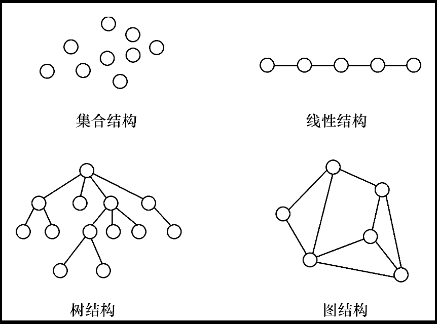
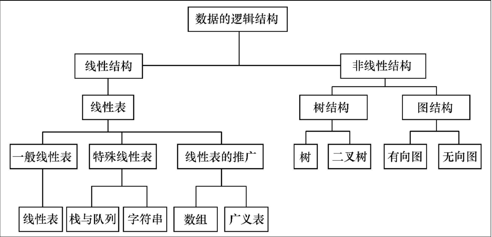

<h1> Introduction </h1>

早期的计算机主要用于数值计算，现在，计算机主要用于非数值计算，包括处理字符、表格和图像等具有一定结构的数据。这些数据内容存在着某种联系，只有分清楚数据的内在联系，合理地组织数据，才能对它们进行有效的处理，设计出高效的算法。如何合理地组织数据、高效地处理数据，这就是“数据结构”主要研究的问题。

随着大型程序和大规模文件系统的出现，结构化程序设计成为程序设计方法学的主要研究方向，人们普遍认为程序设计的实质就是对所处理的问题选择一种好的数据结构，并在此结构基础上施加一种好的算法，著名科学家Wirth教授的《算法+数据结构=程序》正是这种观点的集中体现。

#  一 基本概念和术语
## 1. Data
数据（Data）是客观事物的符号表示，是所有能输入到计算机中并被计算机程序处理的符号的总称。如
- 数学计算中用到的整数和实数
- 文本编辑中用到的字符串
- 多媒体程序处理的图形、图像、声音及动画等通过特殊编码定义后的数据


## 2. Data Element
数据元素（Data Element）是数据的基本单位，在计算机中通常作为一个整体进行考虑和处理。在有些情况下，数据元素也称为元素、记录等。数据元素用于完整地描述一个对象，如一名学生记录，树中棋盘的一个格局（状态），以及图中的一个顶点等。


## 3. Data Item
数据项（Data Item）是组成数据元素的、有独立含义的、不可分割的最小单位。例如，学生基本信息表中的学号、姓名、性别等都是数据项。


##  4. Data Object
数据对象（Data Object）是性质相同的数据元素的集合，是数据的一个子集。例如：
- 整数数据对象是集合 $N={0，±1，±2，…}$
- 字母字符数据对象是集合  C = {‘A’，‘B’，…，‘Z’，‘a’，‘b’，…，‘z’}
- 学生基本信息表也可以是一个数据对象。

由此可以看出，不论数据元素集合是无限集（如整数集），或是有限集（如字母字符集），还是由多个数据项组成的复合数据元素（如学生表）的集合，只要集合内元素的性质均相同，都可称之为一个数据对象。


## 5. Data Structure
数据结构（Data Structure）是相互之间存在一种或多种特定关系的数据元素的集合。换句话说，数据结构是带“结构”的数据元素的集合，“结构”就是指数据元素之间存在的关系。数据结构包括逻辑结构和存储结构两个层次。


##  6. 逻辑结构
数据的逻辑结构是从逻辑关系上描述数据，它与数据的存储无关，是独立于计算机的。因此，数据的逻辑结构可以看作是从具体问题抽象出来的数学模型。数据的逻辑结构有两个要素：一是数据元素；二是关系。数据元素的含义如前所述，关系是指数据元素间的逻辑关系。根据数据元素之间关系的不同特性，通常有四类基本结构，如图所示：（它们的复杂程度依次递进）




1. 集合结构：数据元素之间除了“属于同一集合”的关系外，别无其他关系。

2. 线性结构：数据元素之间存在一对一的关系。

3. 树结构：数据元素之间存在一对多的关系。

4. 图结构或网状结构：数据元素之间存在多对多的关系。

   




集合结构、树结构和图结构都属于非线性结构。


## 7. 存储结构
数据对象在计算机中的存储表示称为数据的存储结构，也称为物理结构。把数据对象存储到计算机时，通常要求既要存储各数据元素的数据，又要存储数据元素之间的逻辑关系，数据元素在计算机内用一个结点来表示。

数据元素在计算机中有两种基本的存储结构，分别是顺序存储结构和链式存储结构。

- 顺序存储结构：借助元素在存储器中的相对位置来表示数据元素之间的逻辑关系，通常借助程序设计语言的数组类型来描述。

- 链式存储结构：顺序存储结构要求所有的元素依次存放在一片连续的存储空间中，而链式存储结构，无需占用一整块存储空间。但为了表示结点之间的关系，需要给每个结点附加指针字段，用于存放后继元素的存储地址。所以链式存储结构通常借助于程序设计语言的指针类型来描述。

  


## 8. Data Type
数据类型（Data Type）是高级程序设计语言中的一个基本概念，前面提到过顺序存储结构可以借助程序设计语言的数组类型描述，链式存储结构可以借助指针类型描述，所以数据类型和数据结构的概念密切相关。
一方面，在程序设计语言中，每一个数据都属于某种数据类型。类型明显或隐含地规定了数据的取值范围、存储方式以及允许进行的运算，数据类型是一个值的集合和定义在这个值集上的一组操作的总称。


## 9. Abstract Data Type
抽象就是抽取出实际问题的本质。在计算机中使用二进制数来表示数据，在汇编语言中则可给出各种数据的十进制表示，它们是二进制数据的抽象，使用者在编程时可以直接使用，不必考虑实现细节。在高级语言中，则给出更高一级的数据抽象，出现了数据类型，如整型、实型、字符型等，可以进一步利用这些类型构造出线性表、栈、队列、树、图等复杂的抽象数据类型。

**抽象数据类型（Abstract Data Type，ADT）**：一般指由用户定义的、表示应用问题的数学模型，以及定义在这个模型上的一组操作的总称，具体包括三部分：数据对象、数据对象上关系的集合以及对数据对象的基本操作的集合。

```
抽象数据类型的定义格式如下：
ADT 抽象数据类型名{
   数据对象：〈数据对象的定义〉
   数据关系：〈数据关系的定义〉
   基本操作：〈基本操作的定义〉
}ADT 抽象数据类型名
```

运用抽象数据类型描述数据结构，有助于在设计一个软件系统时，不必首先考虑其中包含的数据对象，以及操作在不同处理器中的表示和实现细节，而是在构成软件系统的每个相对独立的模块上定义一组数据和相应的操作，把这些数据的表示和操作细节留在模块内部解决，在更高的层次上进行软件的分析和设计，从而提高软件的整体性能和利用率。

抽象数据类型的概念与面向对象方法的思想是一致的。抽象数据类型独立于具体实现，将数据和操作封装在一起，使得用户程序只能通过抽象数据类型定义的某些操作来访问其中的数据，从而实现了信息隐藏。在C++中，我们可以用类的声明表示抽象数据类型，用类的实现来实现抽象数据类型。因此，C++中实现的类相当于数据的存储结构及其在存储结构上实现的对数据的操作。


# 二 算法与算法分析

算法（Algorithm）是为了解决某类问题而规定的一个有限长的操作序列。

## 1. 五个重要特性
一个算法必须满足以下五个重要特性：

- **有穷性**：一个算法必须总是在执行有穷步后结束，且每一步都必须在有穷时间内完成。
- **确定性**：对于每种情况下所应执行的操作，在算法中都有确切的规定，不会产生二义性，使算法的执行者或阅读者都能明确其含义及如何执行。
- **可行性**：算法中的所有操作都可以通过已经实现的基本操作运算执行有限次来实现。
- **输入**：一个算法有零个或多个输入。当用函数描述算法时，输入往往是通过形参表示的，在它们被调用时，从主调函数获得输入值。
- **输出**：一个算法有一个或多个输出，它们是算法进行信息加工后得到的结果，无输出的算法没有任何意义。当用函数描述算法时，输出多用返回值或引用类型的形参表示。


## 2. 评价算法优劣
一个算法的优劣应该从以下几方面来评价：

- **正确性**：在合理的数据输入下，能够在有限的运行时间内得到正确的结果。
- **可读性**：一个好的算法，首先应便于人们理解和相互交流，其次才是机器可执行性。可读性强的算法有助于人们对算法的理解，而难懂的算法易于隐藏错误，且难于调试和修改。
- **健壮性**：当输入的数据非法时，好的算法能适当地做出正确反应或进行相应处理，而不会产生一些莫名其妙的输出结果。
- **高效性**：高效性包括时间和空间两个方面。时间高效是指算法设计合理，执行效率高，可以用时间复杂度来度量；空间高效是指算法占用存储容量合理，可以用空间复杂度来度量。时间复杂度和空间复杂度是衡量算法的两个主要指标。

算法效率分析的目的是看算法实际是否可行，并在同一问题存在多个算法时，可进行**时间和空间**性能上的比较，以便从中挑选出较优算法。衡量算法效率的方法主要有两类：

- **事后统计法**：需要先将算法实现，然后测算其时间和空间开销

  这种方法的缺陷很显然，一是必须把算法转换成可执行的程序，二是时空开销的测算结果依赖于计算机的软硬件等环境因素，这容易掩盖算法本身的优劣。

- **事前分析估算法**：我们通常采用事前分析估算法，通过计算算法的渐近复杂度来衡量算法的效率。


## 3. 时间空间复杂度
- **问题规模**：不考虑计算机的软硬件等环境因素，影响算法时间代价的最主要因素是问题规模。问题规模是算法求解问题输入量的多少，是问题大小的本质表示，一般用整数n表示。

  问题规模n对不同的问题含义不同，例如，在排序运算中n为参加排序的记录数，在矩阵运算中n为矩阵的阶数，在多项式运算中n为多项式的项数，在集合运算中n为集合中元素的个数，在树的有关运算中n为树的结点个数，在图的有关运算中n为图的顶点数或边数。

  显然，n越大算法的执行时间越长。一个算法的执行时间大致上等于其所有语句执行时间的总和，而语句的执行时间则为该条语句的重复执行次数和执行一次所需时间的乘积。

  

- **语句频度（Frequency Count）**：一条语句的重复执行次数称作语句频度。

  由于语句的执行要由源程序经编译程序翻译成目标代码，目标代码经装配再执行，因此语句执行一次实际所需的具体时间是与机器的软、硬件环境（如机器速度、编译程序质量等）密切相关的。

  

  所以，**所谓的算法分析并非精确统计算法实际执行所需时间，而是针对算法中语句的执行次数做出估计**，从中得到算法执行时间的信息。设每条语句执行一次所需的时间均是单位时间，则一个算法的执行时间可用该算法中所有语句频度之和来度量。

```c
// [例]求两个n阶矩阵的乘积算法:
for(i = 1;i <= n;i++)                           // 频度为 n + 1
    for(j = 1;j <= n;j++)                       // 频度为 n * (n + 1)
    {
        C[i][j]=0;                              // 频度为 n^2
        for(k = 1;k <= n;k++)                   // 频度为 n^2 * (n + 1)
        	C[i][j]=C[i][j]+A[i][k]*B[k][j];    // 频度为 n^3
    }
}
```


该算法中所有语句频度之和，是矩阵阶数n的函数，用$f(n)$表示之。换句话说，上例算法的执行时间与f(n)成正比：
$$
f(n)=2n^3+3n^2+2n+12
$$
对于较简单的算法，可以直接计算出算法中所有语句的频度，但对于稍微复杂一些的算法，则通常是比较困难的，即便能够给出，也可能是个非常复杂的函数。因此，为了客观地反映一个算法的执行时间，可以只用算法中的`基本语句`的执行次数来度量算法的工作量。

所谓`基本语句`指的是**算法中重复执行次数和算法的执行时间成正比的语句**，它对算法运行时间的贡献最大。通常，算法的执行时间是随问题规模增长而增长的，因此对算法的评价通常只需考虑其随问题规模增长的趋势。这种情况下，我们只需要考虑当问题规模充分大时，算法中基本语句的执行次数在渐近意义下的阶。

如上例中矩阵的乘积算法，当n趋向无穷大时，显然有即当n充分大时，$f(n)$ 和 $n^3$ 之比是一个不等于零的常数。即$f(n)$ 和 $n^3$ 是同阶的，或者说$f(n)$ 和 $n^3$ 的数量级（Order of Magnitude）相同。在这里，我们用 “O” 来表示数量级，记作：
$$
T(n)=O(f(n))=O(n^3)
$$
由此我们可以给出下述**算法的时间复杂度定义**：

一般情况下，算法中基本语句重复执行的次数是问题规模n的某个函数f(n)，算法的时间量度记作：
$$
T(n)=O(f(n))
$$
它表示随问题规模 $n$ 的增大，算法执行时间的增长率和$f(n)$的增长率相同，称做算法的**渐近时间复杂度**，简称**时间复杂度（Time Complexity）**。


**分析算法时间复杂度的基本方法**为：找出所有语句中语句频度最大的那条语句作为**基本语句**，计算基本语句的频度得到问题规模 n 的某个函数$f(n)$，取其数量级用符号 “O” 表示即可。具体计算数量级时，可以遵循以下定理：
$$
若f(n)=a_mn^m+a_{m-1}n^{m-1}+…+a_1n+a_0是一个m次多项式，则T(n)=O(n^m)
$$
在计算算法时间复杂度时，可以忽略所有低次幂项和最高次幂的系数，这样可以简化算法分析，也体现出了增长率的含义。


- 最好时间复杂度：算法在最好情况下的时间复杂度为最好时间复杂度，指的是算法计算量可能达到的最小值；

- 最坏时间复杂度：算法在最坏情况下的时间复杂度为最坏时间复杂度，指的是算法计算量可能达到的最大值；

- 平均时间复杂度是指算法在所有可能情况下，按照输入实例以等概率出现时，算法计算量的加权平均值。

  对算法时间复杂度的度量，人们更关心的是最坏情况下和平均情况下的时间复杂度。然而在很多情况下，算法的平均时间复杂度难于确定。因此，**通常只讨论算法在最坏情况下的时间复杂度**，即分析在最坏情况下，算法执行时间的上界。


**空间复杂度**：

关于算法的存储空间需求，类似于算法的时间复杂度，我们采用**渐近空间复杂度（Space Complexity）**作为算法所需存储空间的量度，简称**空间复杂度**，它也是问题规模n的函数，记作：$S(n)=O(f (n))$

