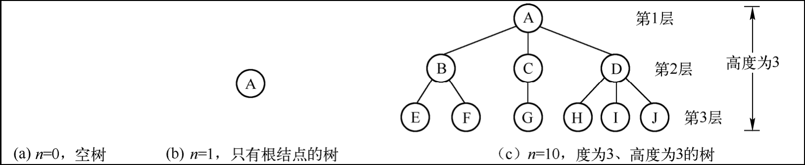
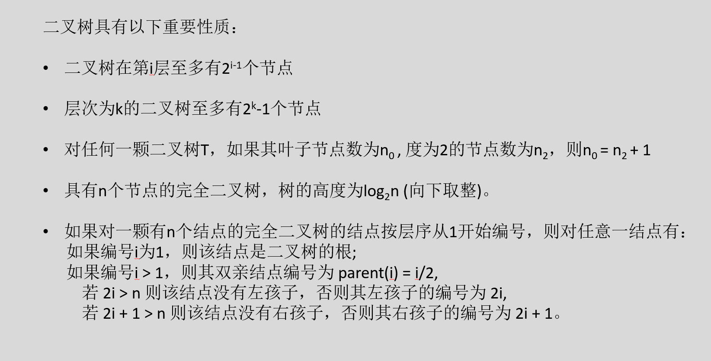
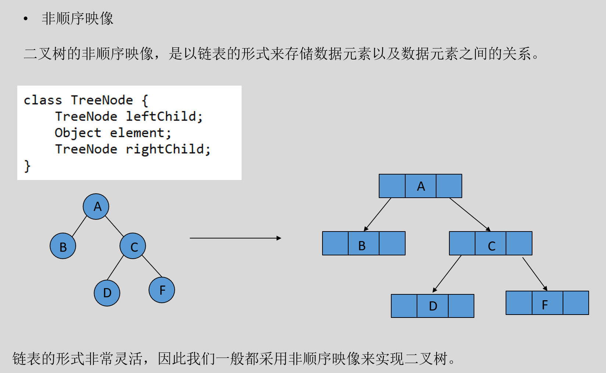
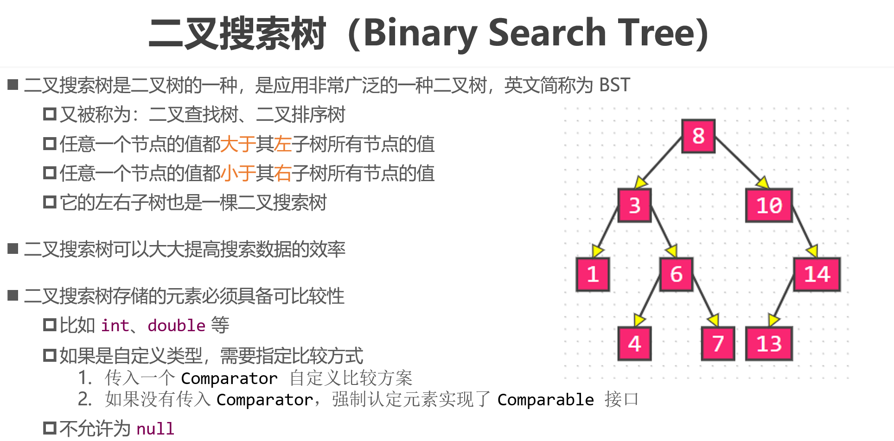
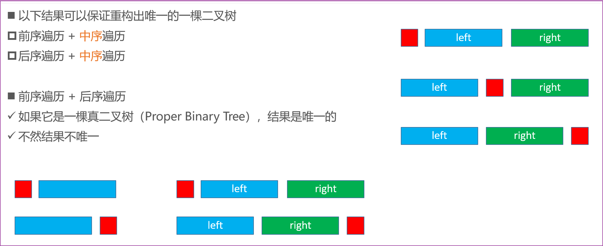
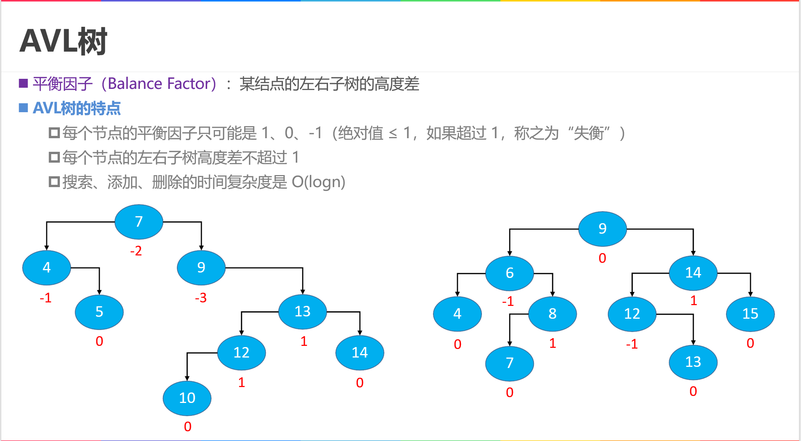
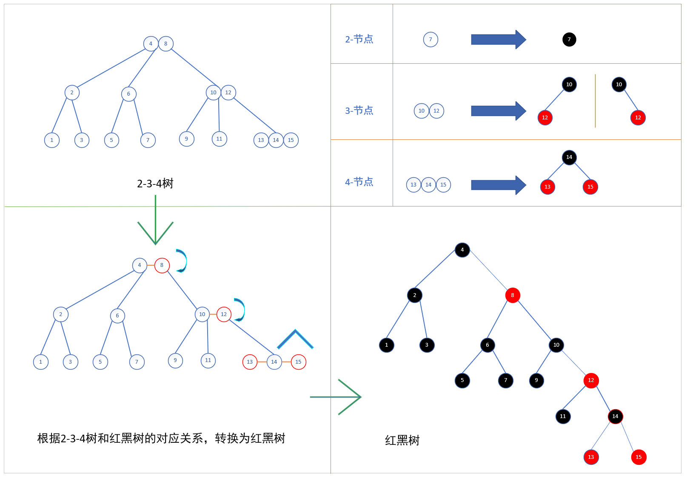
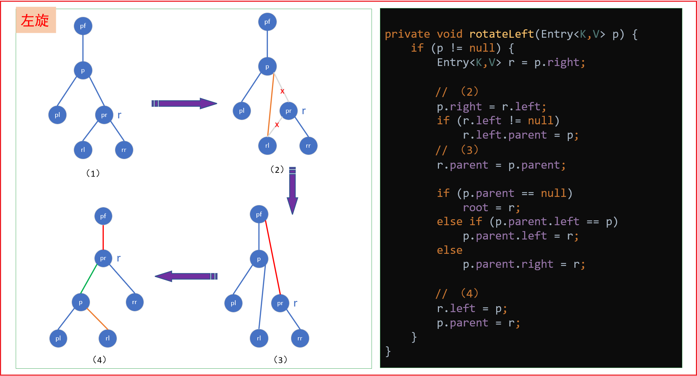
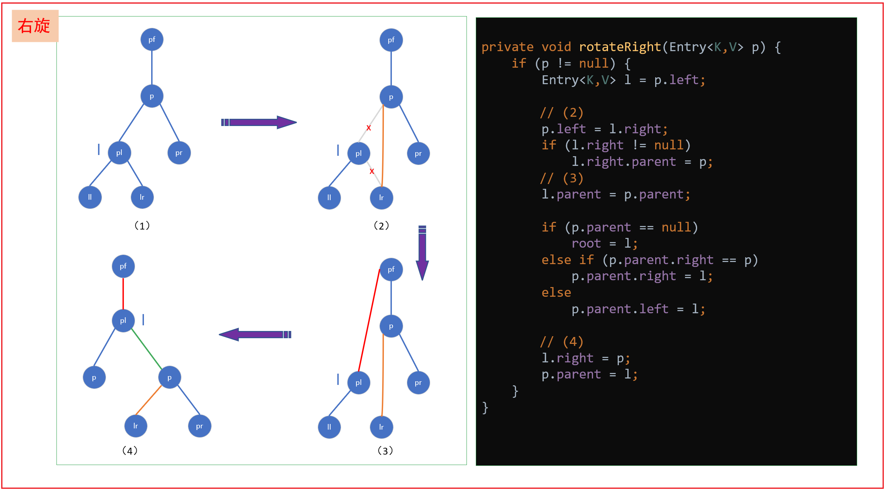

# 一 树和二叉树

树是数据元素（结点）之间具有层次关系的非线性结构。


## 1. 树的定义

树（Tree）是由n（n≥0）个结点组成的有限集合（树中元素通常称为结点）。n=0的树称为空树；n>0的树T由以下两个条件约定构成：
① 有一个特殊的结点称为根（Root）结点，它只有后继结点，没有前驱结点。
② 除根结点之外的其他结点分为m（0≤m<n）个互不相交的集合T0、T1、…、Tm-1，其中每个集合Ti（0≤i<m）也具有树结构，称为根的子树（Subtree）。

树是递归定义的。结点是树的基本单位，若干个结点组成一棵子树，若干棵互不相交的子树组成一棵树。树中每个结点都是该树中某一棵子树的根。因此，树是由结点组成的、结点之间具有层次关系的非线性结构。


空树、1个和n个结点的树如图所示（结点与其子树的根结点之间的连线表示结点之间的层次关系）：




## 2. 概念术语

树的术语，下面上图为例介绍树的术语：

- 父母、孩子与兄弟结点

  - 一棵树中，一个结点的子树的根结点称为其孩子（Child）结点；相对地，该结点是其孩子结点的父母（Parent）结点。

    只有根结点没有父母结点，其他结点有且仅有一个父母结点。

    例如，根结点A没有父母结点，A是B、C、D的父母结点，B、C、D是A的孩子结点。

  - 拥有同一个父母结点的多个结点之间称为兄弟（Sibling）结点。

    例如，B、C、D是兄弟，E、F也是兄弟，但F和G不是兄弟。

  - 结点的祖先（Ancestor）是指其父母结点，以及父母的父母结点等，直至根结点。

  - 结点的后代（Descendant，也称子孙）是指其所有孩子结点，以及孩子的孩子结点等。

    例如，E的祖先结点有B和A，E是A和B的后代。

    

- 结点的度（Degree）

  即结点所拥有子树的棵数。例如，A的度是3，E的度是0。

  度为0的结点称为叶子（Leaf）结点，又称终端结点；树中除叶子结点之外的其他结点称为分支结点，又称非叶结点或非终端结点

  例如，E和F是叶子结点，B、C是分支结点。

  树的度是指树中各结点度的最大值。例如，上图树的度为3。

  

- 结点层次、树的高度

  结点的层次（Level）属性反映结点处于树中的层次位置。

  约定根结点的层次为1，其他结点的层次是其父母结点的层次加1。

  显然，兄弟结点的层次相同。例如，A的层次为1，B的层次为2，E的层次为3。F、G不是兄弟，称为同一层上的结点。

  树的高度（Height）或深度（Depth）是树中结点的最大层次数。例如，上图树的高度为3。


- 边、路径、直径
  设树中X结点是Y结点的父母结点，有序对（X，Y）称为连接这两个结点的分支，也称为边（Edge）。

  例如，A、B结点之间的边是（A，B）。

  设（X0，X1，…，Xk）（0≤k＜n）是由树中结点组成的一个序列，且（Xi，Xi+1）（0≤i＜k）都是树中的边，则称该序列为从X0到Xk的一条路径（Path）。

  路径长度（Path Length）为路径上的边数。例如，从A到E的路径是（A，B，E），路径长度为2。

  二叉树的直径（Diameter）指从根到叶子结点一条最长路径，直径的路径长度是该二叉树的高度-1。

  

- 无序树、有序树
  在树的定义中，结点的子树T0、T1、…、Tm-1之间没有次序，可以交换位置，称为无序树，简称树。如果结点的子树T0、T1、…、Tm-1从左至右是有次序的，不能交换位置，则称该树为有序树（Ordered Tree）。


- 森林（Forest）

  森林是m（m≥0）棵互不相交的树的集合。给森林加上一个根结点就变成一棵树，将树的根结点删除就变成森林。


<br/>


为了解决普通的树不容易存储的问题, 所以我们选择对一个普通的树进行转化, 让它更容易存储

转化的依据:

```java
1, 如果一个结点有孩子, 那么选择它的第一个孩子作为这个结点的left子结点
2, 如果一个结点有右兄弟结点, 那么选择它的右兄弟作为该结点的right子结点
```

一个普通的树,经过上面两个提点转化之后得到一个二叉树:

```java
二叉树: 也是一个树, 在这个树中所有的结点最多有两个孩子, 而且孩子有严格的左右划分
```


二叉树（Binary Tree）是n（n≥0）个结点组成的有限集合，n=0时称为空二叉树；n>0的二叉树由一个根结点和两棵互不相交的、分别称为左子树和右子树的子二叉树构成。二叉树也是递归定义的。在树中定义的度、层次等术语，适用于二叉树。


<br/>


## 3. 相关性质



一些二叉树的性质:

```java
二叉树具有以下重要性质：
二叉树在第i层至多有2i-1个节点 
层次为k的二叉树至多有2k-1个节点
对任何一颗二叉树T，如果其叶子节点数为n0 , 度为2的节点数为n2，则n0 = n2 + 1
具有n个节点的完全二叉树，树的高度为log2n (向下取整)。
如果对一颗有n个结点的完全二叉树的结点按层序从1开始编号，则对任意一结点有：
      如果编号i为1，则该结点是二叉树的根;
      如果编号i > 1，则其双亲结点编号为 parent(i) = i/2,			
          若 2i > n 则该结点没有左孩子，否则其左孩子的编号为 2i,
          若 2i + 1 > n 则该结点没有右孩子，否则其右孩子的编号为 2i + 1。
```


<span style="color:red; font-size:40px">重点</span>：

```java
如果我们对一个完全二叉树按照层级进行编号(根节点编号1) , 这个完全二叉树上的所有结点, 都满足一个特点
    父结点编号 * 2 = 该结点的left结点编号
    父结点编号 * 2 + 1= 该结点的right结点编号
```


这个结论, 可以让我们用一维数组存储一个二叉树.

```java
// 先对于一个二叉树按照完全二叉树进行编号, 父子关系满足2倍和2倍加一, 根据编号我们可以把对应树中的结点存储对应的数组位置.
// 这样即使给定我们任意一个x位置, 我们都能很快找到它的父结点位置(x/2)以及子结点位置(2x, 2x+1)
```


## 4. 存储结构





```java
// 对于二叉树, 我们只需要维护一个结点类型, 既可以存储
class TreeNode{
    private T value;
    private TreeNode left;
    private TreeNode right;
}
```


## 5. 二叉搜索树

BST：二叉搜索树/二叉查找树/二叉排序树，是二叉树的一个改进。要求在二叉树的基础上, 所有的结点可以比较大小, 并且要求所有结点都满足, left孩子小, right孩子大





## 6. BST代码实现


- 查找：

  - 先取根结点，如果它等于我们要查找的数就返回；
  - 如果查找的数据比根节点小，就在左子树中递归查找；如果要查找的数据比根结点大，那么就在右子树中递归查找。

  ```java
  /**
       * 是否包含目标元素
       * @param element 目标元素
       * @author itdrizzle
       * @date 2022/3/5 14:01
       * @return {@link T}
       */
      public boolean contains(T element) {
          if (element == null) {
              throw new IllegalArgumentException("parameter is null");
          }
          // if (isEmpty()) { return false; } // 可省略
  
          // 寻找目标节点
          TreeNode current = root;
          while (current != null) {
              int comp = element.compareTo(current.value);
              if (comp > 0) {
                  current = current.right;
              } else if (comp < 0 ) {
                  current = current.left;
              } else {
                  // 找到目标节点
                  return true;
              }
          }
          return false;
      }
  ```

  

- 插入：

  - 如果要插入的数据比结点大，并且结点的右子树为空，就将新数据直接插到右孩子的位置；
  - 如果不为空，就再递归遍历右子树，查找插入位置。同理，如果要插入的数据比结点小，并且结点的左子树为空，就将新数据插入到左孩子的位置；如果不为空，就再递归遍历左子树，查找插入位置。

  ```java
  /**
       * 按照大小排序添加元素
       * @param element 添加的元素
       * @author itdrizzle
       * @date 2022/3/5 14:13
       * @return {@link boolean}
       */
      public boolean add(T element) {
          if (element == null) {
              throw new IllegalArgumentException("parameter is null");
          }
          if (isEmpty()) {
              root = new TreeNode(element);
              size++;
              return true;
          }
  
          // 寻找目标节点，并记录其父节点
          TreeNode current = root;
          TreeNode parent = null;
          int comp = 0;
          while (current != null) {
              comp = element.compareTo(current.value);
              parent = current;
              if (comp > 0) {
                  current = current.right;
              }else if (comp < 0) {
                  current = current.left;
              }else {
                  // 重复的元素不添加
                  return false;
              }
          }
  
          // 添加的值大时，作为右子节点、否则作为左子节点
          if (comp > 0) {
              parent.right = new TreeNode(element);
          }else {
              parent.left = new TreeNode(element);
          }
          size++;
          return true;
      }
  ```


- 删除：分三种情况处理

  -  如果要删除结点没有孩子，那么直接将该结点删除就行了。

  - 如果要删除结点只有一个孩子，那么需要就父亲结点对应的指针，指向孩子结点。

  - 如果要删除结点有两个孩子，那么我们可以找到这个结点的右子树中最小结点

     (或者左子树中最大结点)，把它替换到要删除的结点上，然后再删除掉这个最小结点。

  ```java
  /**
       * 删除指定元素
       * @param element 删除的元素
       * @author itdrizzle
       * @date 2022/3/5 13:40
       * @return {@link boolean}
       */
      public boolean remove(T element) {
          if (element == null) {
              throw new IllegalArgumentException("parameter is null");
          }
          if (isEmpty()) {
              return false;
          }
  
          // 寻找目标节点，并记录其父节点
          TreeNode current = root;
          TreeNode parent = null;
          while (current != null) {
              int comp = element.compareTo(current.value);
              if (comp > 0) {
                  parent = current;
                  current = current.right;
              } else if (comp < 0 ) {
                  parent = current;
                  current = current.left;
              } else {
                  // 找到目标节点
                  break;
              }
          }
          // 注意上述循环, 有两个跳出条件
          // 其一：没有找到的情形
          if (current == null) {
              return false;
          }
  
          // 其二：找到目标元素
          if (current.left != null && current.right != null) {
              // 目标元素存在双分支，需要先替换再删除
              // 此处选取right子树的最小值替换 (right子树的最left结点)
              TreeNode min = current.right;
              TreeNode parentNodeOfMin = current;
              while (min.left != null) {
                  parentNodeOfMin = min;
                  min = min.left;
              }
              // 此时 min 指向 待删除节点的 right子树 的最小值，
              // 用该节点的值替换 待删除节点的值即可
              current.value = min.value;
  
              // min 节点还有 右子节点的可能，需要将其上移覆盖 min 节点
              current = min;
              parent = parentNodeOfMin;
          }
  
          // 执行到此，current必定单分支或者叶子
  
          // 先获取current节点的子节点（由于是单分支或叶子，只有一个子节点(左、右)或者为null）
          TreeNode child = current.left != null ? current.left : current.right;
  
          // 还有一种特殊情况:
          if (parent == null) {
              // 删除的是根节点, 并且根节点是一个单分支
              root = child;
              size--;
              return true;
          }
  
          // 上移覆盖 （删除）, 注意待删除节点可能是左子节点、也可能是右子节点
          if (current == parent.left) {
              parent.left = child;
          } else {
              parent.right = child;
          }
          size--;
          return true;
      }
  ```

  


## 7. 二叉树的遍历

Binary Tree Traversal：所谓遍历(Traversal)是指沿着某条搜索路线，依次对树中每个结点均做一次且仅做一次访问。

> - 深度优先遍历（Depth-First-Search）
>
>   - 前序遍历（Preorder Traversal）
>   - 中序遍历（Inorder Traversal）
>
>   - 后序遍历（Postorder Traversal）
>
> - 广度优先遍历（Breadth-First-Search）
>   - 层序遍历（Level Order Traversal）


- 深度优先遍历（Depth-First-Search）

  - 前序遍历（Preorder Traversal）

  ```java
  /**
       * 通过栈的方式，先（根）序遍历二叉树，并保存到链表中
       * @author itdrizzle
       * @date 2022/3/5 16:17
       * @return {@link List<T>}
       */
      public List<T> preorderTraversal() {
          final LinkedList<T> list = new LinkedList<>();
          final Stack<TreeNode> stack = new Stack<>();
  
          TreeNode current = root;
          while (current != null || !stack.isEmpty()) {
              while (current != null) {
                  list.add(current.value);
                  stack.push(current);
                  current = current.left;
              }
              current = stack.pop();
              current = current.right;
          }
          return list;
      }
  
      /**
       * 通过递归的方式，先（根）序遍历二叉树，并保存到链表中
       * @author itdrizzle
       * @date 2022/3/5 16:20
       * @return {@link List<T>}
       */
      public List<T> preorderTraversalByRecursion() {
          final LinkedList<T> list = new LinkedList<>();
          preorderDfs(root, list);
          return list;
      }
      // 先（根）序遍历
      private void preorderDfs(TreeNode root, LinkedList<T> list) {
          if (root != null) {
              list.add(root.value);
              preorderDfs(root.left, list);
              preorderDfs(root.right, list);
          }
      }
  ```

  

  - 中序遍历（Inorder Traversal）

  ```java
  /**
       * 通过栈的方式，中（根）序遍历二叉树，并保存到链表中
       * @author itdrizzle
       * @date 2022/3/5 14:58
       * @return {@link List <T>}
       */
      public List<T> inorderTraversal() {
          final LinkedList<T> list = new LinkedList<>();
          final Stack<TreeNode> stack = new Stack<>();
  
          TreeNode current = root;
          while (current != null || !stack.isEmpty()) {
              while (current != null) {
                  stack.push(current);
                  current = current.left;
              }
              current = stack.pop();
              list.add(current.value);
              current = current.right;
          }
          return list;
      }
  
      /**
       * 通过递归的方式，中（根）序遍历二叉树，并保存到链表中
       * @author itdrizzle
       * @date 2022/3/5 15:32
       * @return {@link List<T>}
       */
      public List<T> inorderTraversalByRecursion() {
          final LinkedList<T> list = new LinkedList<>();
          inorderDfs(root, list);
          return list;
      }
      // 递归中序遍历
      private void inorderDfs(TreeNode root, List list) {
          if (root != null) {
              inorderDfs(root.left, list);
              list.add(root.value);
              inorderDfs(root.right, list);
          }
      }
  ```

  

  

  - 后序遍历（Postorder Traversal）

  ```java
  /**
       * 通过递归的方式，后（根）序遍历二叉树，并保存到链表中
       * @author itdrizzle
       * @date 2022/3/5 16:20
       * @return {@link List<T>}
       */
      public List<T> postorderTraversalByRecursion() {
          final LinkedList<T> list = new LinkedList<>();
          postorderDfs(root, list);
          return list;
      }
      // 后（根）序遍历
      private void postorderDfs(TreeNode root, LinkedList<T> list) {
          if (root != null) {
              postorderDfs(root.left, list);
              postorderDfs(root.right, list);
              list.add(root.value);
          }
      }
  
      /**
       * 通过栈的方式，后（根）序遍历二叉树，并保存到链表中 (尾插)
       * @author itdrizzle
       * @date 2022/3/5 16:43
       * @return {@link List<T>}
       */
      public List<T> postorderTraversal() {
          final LinkedList<T> list = new LinkedList<>();
          final Stack<TreeNode> stack = new Stack<>();
  
          TreeNode current = root;
          TreeNode prev = null;
          while (current != null || !stack.isEmpty()) {
              while (current != null) {
                  stack.push(current);
                  current = current.left;
              }
              // 保证左右节点的顺序，确保右子节点有且仅有被遍历一次
              current = stack.peek();
              if (current.right != null && current.right != prev) {
                  current = current.right;
              } else {
                  stack.pop();
                  list.add(current.value);
                  prev = current;
                  current = null;
              }
          }
          return list;
      }
  
      /**
       * 通过栈的方式，后（根）序遍历二叉树，并保存到链表中 (头插)
       * @author itdrizzle
       * @date 2022/3/7 19:12
       * @return {@link List<T>}
       */
      public List<T> postorder() {
          final LinkedList<T> list = new LinkedList<>();
          final Stack<TreeNode> stack = new Stack<>();
  
          stack.push(root);
          while (!stack.isEmpty()) {
              final TreeNode current = stack.pop();
              list.add(0, current.value);
              if (current.left != null) {
                  stack.push(current.left);
              }
              if (current.right != null) {
                  stack.push(current.right);
              }
          }
          return list;
      }
  ```

  


- 广度优先遍历（Breadth-First-Search）

  - 层序遍历（Level Order Traversal）

  ```java
  /**
       * 利用队列实现 BFS:breadth first search 广度优先搜索/ 遍历
       * @author itdrizzle
       * @date 2022/3/5 17:23
       * @return {@link List<T>}
       */
      public List<T> bfs() {
          final LinkedList<T> list = new LinkedList<>();
          Queue<TreeNode> queue = new LinkedList<>();
  
          queue.offer(root);
          while (!queue.isEmpty()) {
              TreeNode current = queue.poll();
              if (current.left != null) {
                  queue.offer(current.left);
              }
              if (current.right != null) {
                  queue.offer(current.right);
              }
              list.add(current.value);
          }
          return list;
      }
  ```


## 8. 二叉树的建树

```java
有些情况下，我们已知的是二叉树的某个或某些遍历序列。我们需要根据这些遍历序列，
构建出一棵”相等”的二叉树，这个过程就叫做二叉树的建树。


Q1: 如果我们只知道前序，中序，后序中的某一种，能否构建出一棵二叉树？(可以, 但是不唯一) 
    如果能，为什么？如果不能，试着举出反例。
    

Q2:如果我们只知道前序，中序，后序中的某两种，能否构建出一棵唯一的二叉树？
    如果能，为什么？如果不能，试着举出反例。
    
    不一定:
    前序 + 中序:  可以构建出一棵唯一的二叉树
    前序 + 后序:  不可以
    中序 + 后序:  可以构建出一棵唯一的二叉树
    为什么: 
    前序和后序都可以确定根节点
    中序, 可以根据根节点确定左右子树
         
```



```java
/**
     * 根据中序和后序建树
     * @param inorder 中序
     * @param postorder 后序
     * @author itdrizzle
     * @date 2022/3/7 19:24
     */
    public void buildTreeByInAndPost(List<T> inorder, List<T> postorder) {
        root = buildByInAndPost(inorder, postorder);
        size = inorder.size();
    }
    // 递归建树
    private TreeNode buildByInAndPost (List<T> inorder, List<T> postorder) {
        if (inorder.size() == 0) return null;
        if (inorder.size() == 1) return new TreeNode(inorder.get(0));

        // 确定根节点 (后序中的最后一个)
        T value = postorder.get(postorder.size() - 1);
        // 确定中序 中 根节点的位置，方便分离左右子树
        final int index = inorder.indexOf(value);

        final List<T> leftInorder = inorder.subList(0, index);
        final List<T> rightInorder = inorder.subList(index + 1, inorder.size());

        final List<T> leftPostOrder = postorder.subList(0, index);
        final List<T> rightPostorder = postorder.subList(index, postorder.size() - 1);

        // 递归构建子树
        final TreeNode node = new TreeNode(value);
        node.left = buildByInAndPost(leftInorder, leftPostOrder);
        node.right = buildByInAndPost(rightInorder, rightPostorder);

        return node;
    }

    /**
     * 根据中序和前序建树
     * @param inorder 中序
     * @param preorder  前序
     * @author itdrizzle
     * @date 2022/3/7 19:43
     */
    public void buildTreeByInAndPre(List<T> inorder, List<T> preorder) {
        root = buildByInAndPre(inorder, preorder);
        size = inorder.size();
    }
    // 递归建树
    private TreeNode buildByInAndPre(List<T> inorder, List<T> preorder) {
        if (inorder.size() == 0) return null;
        if (inorder.size() == 1) return new TreeNode(inorder.get(0));

        // 确定根节点 (前序中的第一个)
        T value = preorder.get(0);
        // 确定中序 中 根节点的位置，方便分离左右子树
        final int index = inorder.indexOf(value);

        final List<T> leftInorder = inorder.subList(0, index);
        final List<T> rightInorder = inorder.subList(index + 1, inorder.size());

        final List<T> leftPreorder = preorder.subList(1, index + 1);
        final List<T> rightPreorder = preorder.subList(index + 1, preorder.size());

        // 递归构建子树
        final TreeNode node = new TreeNode(value);
        node.left = buildByInAndPost(leftInorder, leftPreorder);
        node.right = buildByInAndPost(rightInorder, rightPreorder);

        return node;
    }
```


```java
// 测试代码
@Test
public void buildTreeByInAndPostTest() {
    int[] postorderArr = {3, 5, 10, 22, 30, 20, 65, 75, 70, 125, 170, 150, 100, 50};
    int[] inorderArr = {3, 5, 10, 20, 22, 30, 50, 65, 70, 75, 100, 125, 150, 170};

    final ArrayList<Integer> postorder = new ArrayList<>();
    for (int item : postorderArr) {
        postorder.add(item);
    }

    final ArrayList<Integer> inorder = new ArrayList<>();
    for (int item : inorderArr) {
        inorder.add(item);
    }

    final MyBSTree<Integer> tree = new MyBSTree<>();
    tree.buildTreeByInAndPost(inorder, postorder);

    tree.printAsList();
}
// 运行结果：{3, 5, 10, 20, 22, 30, 50, 65, 70, 75, 100, 125, 150, 170}

@Test
public void buildTreeByInAndPreTest() {
    int[] preorderArr = {50, 20, 10, 5, 3, 30, 22, 100, 70, 65, 75, 150, 125, 170};
    int[] inorderArr = {3, 5, 10, 20, 22, 30, 50, 65, 70, 75, 100, 125, 150, 170};

    final ArrayList<Integer> preorder = new ArrayList<>();
    for (int item : preorderArr) {
        preorder.add(item);
    }

    final ArrayList<Integer> inorder = new ArrayList<>();
    for (int item : inorderArr) {
        inorder.add(item);
    }

    final MyBSTree<Integer> tree = new MyBSTree<>();
    tree.buildTreeByInAndPre(inorder, preorder);

    tree.printAsList();
}
// 运行结果：{3, 5, 10, 20, 22, 30, 50, 65, 70, 75, 100, 125, 150, 170}
```


# 二 自平衡的BST

自平衡的二叉搜索树, 是对二叉搜索树的一个改进,  要求二叉搜索树上的所有结点, 都满足 **左右子树的高度相差不超过1**. 
自平衡的二叉搜索树保证平衡的核心操作: **旋转**  


```
http://520it.com/binarytrees/
http://btv.melezinek.cz/binary-search-tree.html
https://www.cs.usfca.edu/~galles/visualization/Algorithms.html
https://yangez.github.io/btree-js
https://www.codelike.in
```


<br/>


## 1. AVL树





# 三 B树和红黑树


## 1. B树和234树


234树和红黑树的对应转换关系：




## 2. 树的旋转








注意: 有些书上, 说红黑树是一个自平衡的二叉搜索树

```java
// 1, 红黑树是一个特殊的二叉搜索树
// 2, 所有的结点颜色, 要么是黑色, 要么是红色
// 3, 根节点是黑色, 叶子结点(nil)也是黑色
// 4, 没有连续的红色结点
// 5, 叶子到根的路径上, 会经过相同数目的黑色结点(黑高平衡)

// 红黑树怎么保证黑高平衡的 : 通过旋转 (在旋转的过程中可能发生颜色交换)
// 红黑树和自平衡的二叉搜索树的对比:  
      平衡性能: 自平衡的二叉搜索树(性能更好), 红黑树(稍差)
      操作起来: 自平衡的二叉搜索树(比较麻烦, 非局部操作), 红黑树(相对简单, 局部操作)
                    
```


