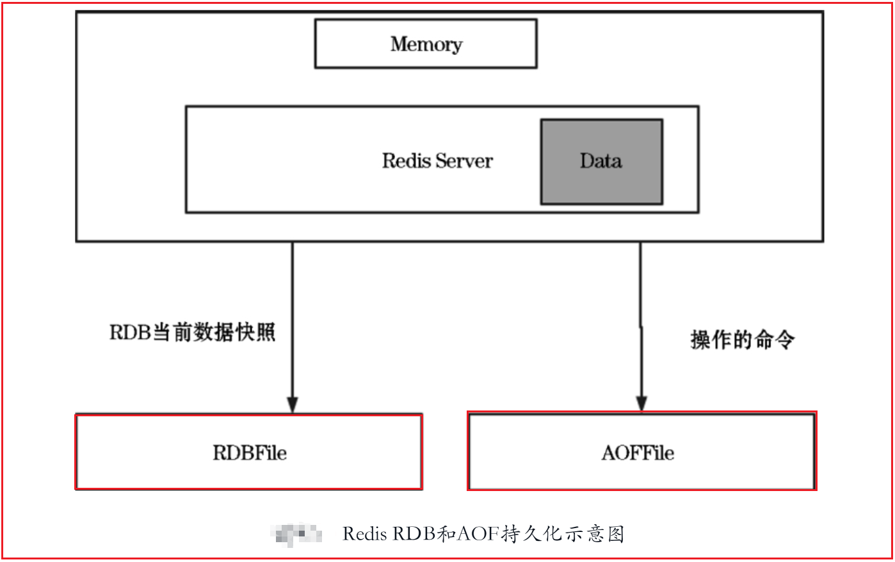
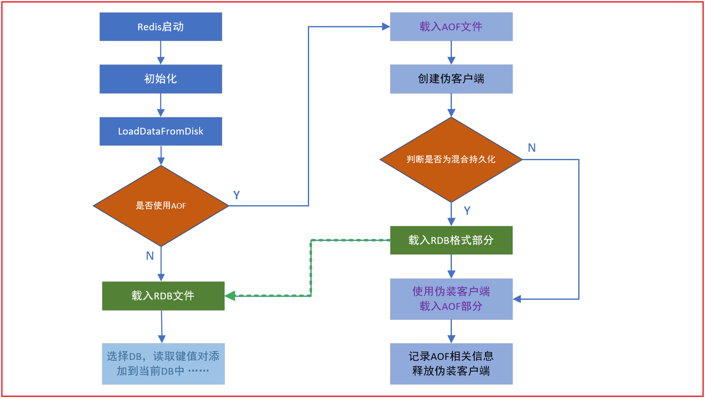

# 一 Redis安装与配置

## 1. Redis的安装

 通过[redis官网](https://redis.io/)下载上传至服务器，或通过wget直接下载

```shell

# 下载解压

wget http://download.redis.io/releases/redis-6.2.6.tar.gz

tar -zxvf redis-6.2.6.tar.gz


# 安装  （Ubuntu下最好在国外源下安装 gcc ，否则可能出错）

sudo apt-get install gcc         # 需要先安装编译环境 （ centos: yum install gcc-c++  ）

sudo chmod -R 777 redis-6.2.6/   # ubuntu可能存在权限问题，先赋予权限再安装

cd redis-6.2.6/                  # 进入redis目录进行安装

make && make install

```

<br/>


不报错的话就已经在 /usr/local/bin/ 目录下生成了 redis-server 执行文件

如果是普通 (非root用户) 应该会报下面错误:


<br/>


这时需要手动复制一些文件到指定目录

这里暂且为了多熟悉下Redis和linux，就不使用其默认的位置了，而是将执行文件和配置文件全放在了自定义的文件夹下

```shell

sudo mkdir -p /usr/local/redis/bin/      # sudo mkdir -p /usr/local/redis/bin/   

sudo mkdir -p /usr/local/redis/conf/     # 存放配置文件目录


# 然后将Redis src下的编译好的可执行文件拷贝到 /usr/local/redis/bin/
#                           配置文件拷贝到 /usr/local/redis/conf/

cd /usr/local/redis/redis-6.2.6/src

sudo cp redis-server redis-cli /usr/local/redis/bin/
sudo cp ../redis.conf /usr/local/redis/conf/


# 此时已经可以启动Redis了

cd /usr/local/redis
./bin/redis-server ./conf/redis.conf &      # ctrl+c正常会中断程序,加上&之后ctrl+c程序也不会退出

^C

```


启动客户端连接试试：


<br/>


```shell

# 这里先关闭 redis-server, 因为下面需要修改其配置文件

ps -ef|grep redis 

kill -9 pid

```


<br/>


## 2. Redis基础配置 

```shell

# 修改配置文件之前别忘了先备份 

sudo cp /usr/local/redis/conf/redis.conf /usr/local/redis/conf/redis.conf.backup


# 修改redis.conf

sudo vim /usr/local/redis/conf/redis.conf

```
redis.conf : 

```shell 

daemonize yes                       # 让redis启动后在后台运行

dir /usr/local/redis/db             # 修改redis的工作目录 (持久化文件的路径) sudo mkdir db

bind 0.0.0.0                        # 0.0.0.0 表示所有的IP地址都可以连接并访问Redis服务器

requirepass itdrizzle               # 设置密码


# 当客户端闲置多长时间后关闭连接,0表示不关闭连接
timeout 300

# 端口,一般不建议更改
port 6379

# 日志级别  DEBUG | VERBOSE | NOTICE | WARNING
loglevel DEBUG

# Redis默认有16个数据库
database 16

```


<br/>

```shell

# 此时再启动即可使用远程密码连接

./bin/redis-server ./conf/redis.conf


# 测试完后同样 kill 掉 Redis 服务，下面还要进行自启动等服务配置

```


<br/>


## 3. Redis服务启动

redis安装包的 utils 目录下有一些便捷的服务脚本，如：`redis_init_script` , `systemd-redis_server.service` 

分别为 `/etc/init.d/xxx` 脚本 , 和 systemctl 的脚本，

<br/>


 **systemd的方式** （未配置成功，待解决......）: 

> 
>
> 注：（ 个人查看Ubuntu下的目录是 `/lib/systemd/system`， 但很多资料说的是 /usr/lib/systemd/system  ）
>
> 
>
> 对于那些支持 Systemd 的软件，安装的时候，会自动在`/usr/lib/systemd/system`目录添加一个配置文件。
>
> 如果你想让该软件开机启动，就执行下面的命令（以`httpd.service`为例）。
>
> > ```bash
> > $ sudo systemctl enable httpd
> > ```
>
> 上面的命令相当于在`/etc/systemd/system` 目录添加一个符号链接，指向`/usr/lib/systemd/system` 里面的`httpd.service`文件。
>
> 这是因为开机时，`Systemd`只执行`/etc/systemd/system`目录里面的配置文件。
>
> 这也意味着，如果把修改后的配置文件放在该目录，就可以达到覆盖原始配置的效果
>
> 
>
> systemd有系统和用户区分：
>
> **系统（/user/lib/systemd/system/）**、**用户（/etc/lib/systemd/user/）** 
>
> 一般系统管理员手工创建的单元文件建议存放在/etc/systemd/system/目录下面。
>
> /usr/lib/systemd/system目录自动存放启动文件的配置位置，里面一般包含有XXXXX.service
>
> 

<br/>


下面使用 systemd 的方式创建 Redis 的开机自启服务：

```shell

# 先将安装包下的 systemd 服务文件复制到 上述所说的位置

sudo cd /usr/local/redis/redis-6.2.6/utils/

sudo cp systemd-redis_server.service /usr/lib/systemd/user/redis-server.service


#修改配置文件位置
 
sudo vim /usr/lib/systemd/user/reids-server.service

	ExecStart=/usr/local/redis/bin/redis-server /usr/local/redis/conf/redis.conf --supervised systemd --daemonize yes
   
   

# 开机自启动

sudo systemctl enable redis-server.service

sudo systemctl start redis-server.service         # 启动

```


<br/>


**init方式**：

```shell

# 复制 init 脚本到 /etc/init.d/ 下

cd /usr/local/redis/redis-6.2.6/utils/

sudo cp ./redis_init_script /etc/init.d/redis-server.service


# 修改脚本内容

sudo vim /etc/init.d/redis-server.service 

    EXEC=/usr/local/redis/bin/redis-server
    CLIEXEC=/usr/local/redis/bin/redis-cli

    CONF="/usr/local/redis/conf/redis.conf"


update-rc.d redis-server.service defaults 90       #开启自启动 


/etc/init.d/redis-server.service start             # 启动
         

ps -ef|grep redis

sudo kill -9 pid                                   # 关闭

```


<br/>


启动redis客户端： `redis-cli`

```shell

redis-cli                         # 启动

redis-cli -a 123456.. shutdown    # 关闭

redis-cli -a password ping        # 查看是否存活 PONG表示正常

```


<br/>

`redis-cli`的基本使用：

```shell

> auth 123456      # 类似登录（必须输入密码）

> set name tom     # OK          设置name的值为tom
> get name         # "tom"       获取name的值

> del name         # (integer)1  返回删除的数量
> get name         # (nil)       删除后再获取为空

> type age         # string      返回age的类型
> keys *           # 查看所有的key(不建议再生产上使用，有性能影响)

> mset             # 连续设值
> mget             # 连续取值
> msetnx           # 连续设置,如果存在则不设置

```


<br/>


# 二  Redis持久化配置

Redis持久化存储有两种持久化方案：RDB（Redis DataBase）和AOF（Append-Only File）。

RDB是将内存中数据的快照（指定的时间间隔存储数据集的时间点快照）存储到磁盘内，

AOF则是通过日志记录Redis内的所有操作。redis服务重启时通过这些操作重建原始数据集



<br/>

Redis 4之后支持AOF+RDB混合持久化的方式，结合了两者的优点，

可以通过aof-use-rdb-preamble配置项开启混合持久化功能的开关。


## 1. RDB持久化

RDB（Redis DataBase）是将Redis内存中数据的快照写⼊到⼆进制⽂件中，是Redis的默认持久化方案。

触发RDB持久化的方式分别为：正常关闭redis、根据配置文件设置的次数定时触发、save和bgsave命令

- 以一段时间内达到指定修改的次数为规则来触发快照操作（在redis.conf中配置，快照文件名为dump.rdb）

  每当Redis服务重启的时候都会从该文件中把数据加载到内存中。

- 使用save和bgsave命令手动来触发

  save会阻塞服务器进程。在执行save命令的过程中，服务器不能处理任何请求

  bgsave（background save，后台保存）命令会通过一个子进程在后台处理数据RDB持久化

  > 本质上save和bgsave调用的都是rdbSave函数，所以Redis不允许save和bgsave命令同时执行，
  >
  > 当然这也是为了避免RDB文件数据出现不一致性的问题。

<br/>

RDB持久化的配置文件：

```bash

# 默认定时持久化规则
save 900 1
save 300 10
save 60 10000

# 关闭：
#	1）注释掉所有save point 配置可以关闭 RDB 持久化。
#	2）在所有 save point 配置后增加：save ""，该配置可以删除所有之前配置的 save point。


# 默认值为yes，当启用了RDB且最后一次在后台保存数据失败，Redis是否停止接收数据：
# yes代表可以继续写入数据；no代表不会写入成功，通知用户持久化出现错误
stop-writes-on-bgsave-error yes


# 持久化的数据是否进行压缩
rdbcompression yes


# 存储的快照是否进行CRC64算法的数据校验，如果希望获取到最大的性能提升，可以关闭此功能
Rdbchecksum yes


# 设置快照的文件名，默认是dump.rdb
dbfilename dump.rdb

dir /usr/local/redis/db     # dump.rdb的存储位置

```

<br/>

RDB默认持久化策略默认有三种方式：

​	第一种：在60秒内有10000次操作即触发RDB持久化。

​	第二种：没有满足第一种条件时，在300秒内有10次操作即触发RDB持久化。

​	第三种：没有满足第二种条件时，在900秒内有1次操作即触发RDB持久化。

<br/>

Redis有一个周期性操作函数，默认每隔100ms执行一次，其中的一项工作就是检查自动触发bgsave命令的条件是否成立

<br/>

RDB全量备份总是非常耗时的，而且不能提供强一致性（Strict Consistency），即

- 如果Redis进程崩溃，那么在最近一次RDB备份之后的数据也会随之消失。

  （⼩内存机器不适合使⽤，RDB机制符合要求才会照快照，可能会丢失数据）

- 在默认情况下，RDB数据持久化实时性比较差，而配置为高时效性时，频繁操作的成本则会很高


适⽤于容灾备份 、全量复制


<br/>


## 2. AOF持久化

AOF（Append Only File）以独立日志的方式记录每次的写命令，可以很好地解决了数据持久化的实时性。

系统重启时可以重新执行AOF文件中的命令来恢复数据。AOF会先把命令追加在AOF缓冲区，然后根据对应策略写入硬盘。

<br/>

AOF持久化的相关配置：

```bash
# 开启AOF持久化
appendonly yes

# AOF文件名
appendfilename "appendonly.aof"

# AOF文件存储路径 （与rdb的一致）
dir dir /usr/local/redis/db 


# aof文件比上次重写时增长100%(配置可以大于100%)时触发重写
auto-aof-rewrite-percentage 100 

# aof文件大小超过64MB时触发重写
auto-aof-rewrite-min-size 64mb 


// aof 持久化策略，任选一个，默认是everysec
# appendfsync always
appendfsync everysec
# appendfsync no

```

<br/>

```bash 

使用AOF持久化可以根据不同的fsync策略来备份数据，因为AOF采用的是追加的日志方式，
因此即使断电也不会出现磁盘寻道或磁盘被损坏的问题。

如果由于某种原因（磁盘已满或其他原因）日志只记录了一半，那么可以使用redis-check-aof工具轻松修复。

当数据量太大时，Redis能够在后台自动重写AOF，并生成一个全新的文件，其中包含创建当前数据集所需的最少操作集，
一旦准备好新的文件，Redis就会切换新的文件并开始把日志追加到新的文件。


AOF文件包含了所有操作的日志，而且很容易看懂，当用户不小心使用了flushall命令，flushall会把所有的数据删除，
但是可以根据AOF文件找到错误的命令，把这些错误的指令删除，然后重新启动Redis，就可以恢复对应的业务数据。
但是在此期间，AOF文件不能被重写，重写之后的AOF文件不再是可以让用户理解的内容。

AOF文件会以文本格式保存所有写操作命令，且未经压缩，因此对于同一数据集，AOF文件通常大于等效的RDB文件。

```


<br/>


## 3. 混合持久化

RDB和AOF持久化的区别：

| 特性 \ 方式 | RDB（Redis DataBase）    | AOF（Append Only File） |
| ----------- | ------------------------ | ----------------------- |
| 启动优先级  | 低                       | 高                      |
| 文件体积    | 小                       | 大                      |
| 恢复性能    | 速度快                   | 速度慢                  |
| 数据安全性  | 丢失上次保存点之后的数据 | 因配置策略而不同        |

<br/>

使用RDB持久化会有数据丢失的风险，但是数据恢复的速度快；使用AOF持久化可以保证数据的完整性，但数据恢复的速度慢。

在Redis 4之后的版本新增了AOF+RDB混合模式，先使用RDB存储快照，然后使用AOF持久化记录所有的写操作，当满足重写策略或手动触发重写的时候，将最新的数据存储为新的RDB记录。

重启服务时会从RDB和AOF两部分恢复数据，既保证了数据的完整性，又提高了数据恢复的性能。


开启AOF+RDB混合模式持久化的配置命令如下：

```shell

# redis.conf

aof-use-rdb-preamble yes

```

只要在redis.conf配置文件中写入上面这行代码就可以开启AOF+RDB混合模式。(注意此模式在Redis 4及以上版本才支持)

在 redis 4 刚引入时，默认是关闭混合持久化的，但是在 redis 5 中默认已经打开了。


<br/>

混合持久化并不是一种全新的持久化方式，而是对已有方式的优化。混合持久化只发生于 AOF 重写过程。

使用了混合持久化，重写后的新 AOF 文件前半段是 RDB 格式的全量数据，后半段是 AOF 格式的增量数据。

```bash

开启混合模式后，在bgrewriteaof命令之后会在AOF文件中以RDB格式写入当前最新的数据，之后的写操作继续以AOF的追加形式追加写命令。
当Redis重启的时候，先加载RDB的部分再加载剩余的AOF部分。

混合持久化本质是通过 AOF 后台重写（bgrewriteaof 命令）完成的，不同的是当开启混合持久化时，fork 出的子进程
先将当前全量数据以 RDB 方式写入新的 AOF 文件，然后再将 AOF 重写缓冲区（aof_rewrite_buf_blocks）的
增量命令以 AOF 方式写入到文件，写入完成后通知主进程将新的含有 RDB 格式和 AOF 格式的 AOF 文件替换旧的的 AOF 文件。

```

优点：结合 RDB 和 AOF 的优点, 更快的重写和恢复。

缺点：AOF 文件里面的 RDB 部分不再是 AOF 格式，可读性差。


<br/>

## 4. 持久化选择

RDB、AOF、混合持久，我应该用哪一个？

```bash

一般来说， 如果想尽量保证数据安全性， 你应该同时使用 RDB 和 AOF 持久化功能，同时可以开启混合持久化。

如果你非常关心你的数据， 但仍然可以承受数分钟以内的数据丢失， 那么你可以只使用 RDB 持久化。

如果你的数据是可以丢失的，则可以关闭持久化功能，在这种情况下，Redis 的性能是最高的。


使用 Redis 通常都是为了提升性能，而如果为了不丢失数据而将 appendfsync  设置为 always 级别时，
对 Redis 的性能影响是很大的，在这种不能接受数据丢失的场景，其实可以考虑直接选择 MySQL 等类似的数据库。

```

<br/>


服务启动时如何加载持久化数据?


简单来说，如果同时启用了 AOF 和 RDB，Redis 重新启动时，会使用 AOF 文件来重建数据集，因为通常来说，AOF 的数据会更完整。

而在引入了混合持久化之后，使用 AOF 重建数据集时，会通过文件开头是否为“REDIS”来判断是否为混合持久化

具体流程如下图所示：




<br/>


# 三 Redis数据类型

## 1. string

```redis
> set rekey data              :设置已经存在的key ,会覆盖
> setnx rekey data            :设置已经存在的key ,不会覆盖

> set key value ex seconds    :设置带过期时间的数据
> expire key seconds          :设置过期时间
> ttl key                     :查看剩余时间, -1永不过期, -2过期

> append key value            :合并字符串,将value合并到key对应的值上
> strlen key                  :字符串长度

> incr key                    :累加1 (类似 a+=1 的效果)
> decr key                    :累减1
> incrby key num              :累加给定数值
> decrby key num              :累减给定数值

> getrange key start end      :截取数据, end=-1代表到最后
> setrange key start newdata  :从start位置开始替换数据
```


## 2. hash

类似map ,存储结构化数据结构,比如存储一个对象 (不能有嵌套对象)

```
> hset user name tom             #创建一个user对象 ,这个对象中包含name属性, name值为tom
> hget user name                 #获得用户对象中name的值
                     
> hmset user age 18 sex male     #设置对象中的多个键值对,存在则覆盖
> hset user age 17 weight 80     #设置对象中的多个键值对,存在则覆盖

> hmget user age sex             #获得对象中的多个属性
> hgetall user                   #获得整个对象的内容

> hincrby user age 2             #累加属性
> hincrbyfloat user age2.2       #累加属性

> hlen user                      #有多少个属性
> hexists user age               #判断属性是否存在
> hkeys user                     #获得所有属性
> hvals user                     #获得所有值
> hdel user field1 field2        #删除指定的对象属性
```


## 3. list

list 列表

```
lpush userList 1 2 3 4 5         #构建一个list ,从左边开始存入数据(最后存入的数据在最左面)
rpush userList 1 2 3 4 5         #构建一个list ,从右边开始存入数据(最后存入的数据在最右面)
lrange list start end            #获得数据
lpop                             #从左侧开始拿出一个数据
rpop                             #从右侧开始拿出一个数据 
llen list                        #list长度
lindex list index                #获取list下标的值
lset list index value            #把某个下标的值替换

lrem list num value              #删除num个相同的value
ltrim list start end             #截取值,并赋值给原来的list

linsert list before/after value newValue  #在value的前/后插入一个新的值

rpush list1 pig cow sheep chicken duck
```


## 4. set

set 集合

```
sadd set1 cow sheep pig duck sheep     #新建集合并向其中添加不重复的元素
srandmember set1 2                     #随机获取集合中的两个元素
smembers set1                          #查看全部集合元素
scard set1                             #统计个数
sismember set1 pig                     #判断pig是否为set1的元素

srem set1 pig                          #删除set1中的pig
spop set1 2                            #随机删除两个元素

smove set2 set1 10                     #将set2中的10转移到set1中
sdiff set1 set2                        #返回set1中存在而set2中不存在的元素
sinter set1 set2                       #求交集
sunion set1 set2                       #求并集
```

- zset 有序的set

```
zadd zset 10 value1 20 value2 30 value3            #设置member和对应的分数
zrange zset 0 -1                                   #查看所有zset中的内容
zrange zset 0 -1 withscores                        #...带有分数
zrank zset value                                   #获得对应的下标
zscore zset value                                  #获得对应的分数

zcard zset                                         #统计个数
zcount zset 分数1 分数2                             #统计个数[包含边界]

zrangebyscore zset分数1 分数2                       #查询分数之间的member(包含分数1 分数2)
zrangebyscore zset (分数1 (分数2                    #查询分数之间的member (不包含分数1和分数2 )
zrangebyscore zset 分数1 分数2 limit start end      #查询分数之间的member(包含分数1 分数2) ,获得的结果集再次根据下标区间做查询

zrem zset value                                    #删除member
```


# 六 springboot整合redis

- 引入redis依赖，完成redis相关配置（pom文件和application.yaml）

```xml
<!--  引入 redis 依赖   -->
<dependency>
    <groupId>org.springframework.boot</groupId>
    <artifactId>spring-boot-starter-data-redis</artifactId>
</dependency>
```

```yaml
spring:
  redis:
    database: 1
    host: 139.155.174.119
    port: 6379
    password: 000000
```

- redisTemplate的基本使用

```java
@Autowired
private StringRedisTemplate redisTemplate;

redisTemplate.hasKey(key)                                   //判断是否有key所对应的值
redisTemplate.opsForValue().get(key)                        //取出key值所对应的值
redisTemplate.opsForValue().multiGet(keys)                  //批量查询，对应mget

redisTemplate.opsForValue().set(key, value)                 //设置当前的key以及value值
redisTemplate.opsForValue().set(key, value, timeout, unit)  //设置当前的key以及value值并且设置过期时间

redisTemplate.delete(key)                                   //删除单个key值
redisTemplate.delete(keys)                                  //批量删除key,其中keys:Collection<K> keys

redisTemplate.dump(key)                                     //将当前传入的key值序列化为byte[]类型

redisTemplate.expire(key, timeout, unit)                    //设置过期时间
redisTemplate.getExpire(key)                                //返回剩余时间

redisTemplate.opsForValue().increment(key, increment)       //设置自增
```

```java
//批量查询，管道pipeline
List<Object> result = redisTemplate.executePipelined(new RedisCallback<String>() {
	@Override
	public String doInRedis(RedisConnection connection) throws DataAccessException {
		StringRedisConnection src = (StringRedisConnection)connection;

		for (String k : keys) {
			src.get(k);
		}
		return null;
	}
});
```

- Hash类型：是一个string类型的field和value的映射表，hash特别适合用于存储对象。

```java
redisTemplate.opsForHash().hasKey(key, field)                   //查看hash表中指定字段是否存在
redisTemplate.opsForHash().keys(key)                            //获取所有hash表中字段
redisTemplate.opsForHash().entries(key)                         //对应命令：HGETALL key，返回哈希表 key中，所有的域和值
redisTemplate.opsForHash().get(key, field)                      //获取变量key中的指定field

redisTemplate.opsForHash().put(key, field, value)               //新增hash值
redisTemplate.opsForHash().putIfAbsent(key, field, value)       //新增hash值(仅当hashKey不存在时才设置)
redisTemplate.opsForHash().putAll(key, maps)                    //map集合的形式添加键值对

redisTemplate.opsForHash().increment(key, field, increment);    //给哈希表key中的指定字段的整数值加上增量increment

redisTemplate.opsForHash().delete(key, fields)                  //删除一个或者多个hash表字段
```

- List 类型

```java
redisTemplate.opsForList().size(key)                            //获取当前key的List列表长度
redisTemplate.opsForList().index(key, index)                    //获取指定位置的值
redisTemplate.opsForList().range(key, start, end)               //获取列表指定范围内的元素(start开始位置, 0是开始位置，end 结束位置, -1返回所有)

redisTemplate.opsForList().leftPush(key, value)                 //存储在list的头部，即添加一个就把它放在最前面的索引处
redisTemplate.opsForList().leftPushAll(key, value)              //把多个值存入List中(value可以是多个值，也可以是一个Collection value)
redisTemplate.opsForList().leftPushIfPresent(key, value)        //List存在的时候再加入
redisTemplate.opsForList().leftPush(key, pivot, value)          //如果pivot存在则在pivot前面添加

redisTemplate.opsForList().set(key, index, value)               //设置指定索引处元素的值

redisTemplate.opsForList().rightPop(key)                        //移除并获取列表最后一个元素
```

- Set类型

```java
redisTemplate.opsForSet().size(key)                             //获取集合的大小
redisTemplate.opsForSet().isMember(key, value)                  //判断集合是否包含value

redisTemplate.opsForSet().add(key, values)                      //添加元素

redisTemplate.opsForSet().remove(key, values)                   //移除元素(单个值、多个值)
redisTemplate.opsForSet().pop(key)                              //删除并且返回一个随机的元素
```

- Zset类型，ZSetOperations提供了一系列方法对有序集合进行操作(有序集合是按照元素的score值由小到大进行排列)

```java
redisTemplate.opsForZSet().add(key, value, score)
redisTemplate.opsForZSet().remove(key, values)
redisTemplate.opsForZSet().incrementScore(key, value, delta)                //增加元素的score值，并返回增加后的值

redisTemplate.opsForZSet().rank(key, value)                                 //返回元素在集合的排名,有序集合是按照元素的score值由小到大排列
redisTemplate.opsForZSet().reverseRangeWithScores(key, start,end)           //获取集合中给定区间的元素(start 开始位置，end 结束位置)
redisTemplate.opsForZSet().reverseRangeByScore(key, min, max, start, end)   //获取分数在最小和最大值之间的元素,在此基础上再返回指定区间的元素
```


