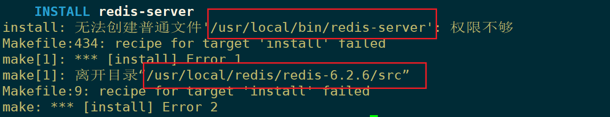
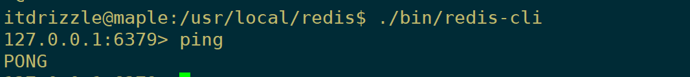

# 一 Redis安装与配置

## 1. Redis的安装

 通过[redis官网](https://redis.io/)下载上传至服务器，或通过wget直接下载

```shell

# 下载解压

wget http://download.redis.io/releases/redis-6.2.6.tar.gz

tar -zxvf redis-6.2.6.tar.gz


# 安装  （Ubuntu下最好在国外源下安装 gcc ，否则可能出错）

sudo apt-get install gcc         # 需要先安装编译环境 （ centos: yum install gcc-c++  ）

sudo chmod -R 777 redis-6.2.6/   # ubuntu可能存在权限问题，先赋予权限再安装

cd redis-6.2.6/                  # 进入redis目录进行安装

make && make install

```

<br/>


不报错的话就已经在 /usr/local/bin/ 目录下生成了 redis-server 执行文件

如果是普通 (非root用户) 应该会报下面错误:



<br/>


这时需要手动复制一些文件到指定目录

这里暂且为了多熟悉下Redis和linux，就不使用其默认的位置了，而是将执行文件和配置文件全放在了自定义的文件夹下

```shell

sudo mkdir -p /usr/local/redis/bin/      # sudo mkdir -p /usr/local/redis/bin/   

sudo mkdir -p /usr/local/redis/conf/     # 存放配置文件目录


# 然后将Redis src下的可执行文件拷贝到/usr/local/redis/bin/,配置文件拷贝到/usr/local/redis/conf/

pwd          # /usr/local/redis/redis-6.2.6/src

sudo cp redis-server redis-cli /usr/local/redis/bin/
sudo cp ../redis.conf /usr/local/redis/conf/


# 此时已经可以启动Redis了

cd /usr/local/redis
./bin/redis-server ./conf/redis.conf &      # ctrl+c正常会中断程序,加上&之后ctrl+c程序也不会退出

^C

```


启动客户端连接试试：



<br/>


```shell

# 这里先关闭 redis-server, 因为下面需要修改其配置文件

ps -ef|grep redis 

kill -9 pid

```


<br/>


## 2. Redis基础配置 

```shell

# 修改配置文件之前别忘了先备份 

sudo cp /usr/local/redis/conf/redis.conf /usr/local/redis/conf/redis.conf.backup


# 修改redis.conf

sudo vim /usr/local/redis/conf/redis.conf

```
redis.conf : 

```shell 

daemonize yes                       # 让redis启动后在后台运行

dir /usr/local/redis/db             # 修改redis的工作目录 (持久化文件的路径) sudo mkdir db

bind 0.0.0.0                        # 让远程连接不受ip限制

requirepass itdrizzle               # 设置密码

```


<br/>

```shell

# 此时再启动即可使用远程密码连接

./bin/redis-server ./conf/redis.conf

```


<br/>


## 3. Redis服务配置

redis安装包的 utils 目录下有一些方便管理Redis的脚本，如：`redis_init_script` , `systemd-redis_server.service` 


```shell

# 开机自启动
cd /home/software/redis-6.2.6/utils/
cp redis_init_script /etc/init.d/


vim /etc/init.d/redis_init_script

    #修改配置文件位置
    
    CONF="/usr/local/redis/redis.conf"

```


<br/>

启动redis服务：

```shell

chmod 777 /etc/init.d/redis_init_script

/etc/init.d/redis_init_script start          #启动

cd /etc/init.d/
chkconfig redis_init_script on               #开启自启动 

ps -ef|grep redis

```


<br/>


## 


<br/>


启动redis客户端： `redis-cli`

```shell

redis-cli                         # 启动

redis-cli -a 123456.. shutdown    # 关闭

redis-cli -a password ping        # 查看是否存活 PONG表示正常

```


<br/>

`redis-cli`的基本使用：

```shell

> auth 123456      # 类似登录（必须输入密码）

> set name tom     # OK          设置name的值为tom
> get name         # "tom"       获取name的值

> del name         # (integer)1  返回删除的数量
> get name         # (nil)       删除后再获取为空

> type age         # string      返回age的类型
> keys *           # 查看所有的key(不建议再生产上使用，有性能影响)

> mset             # 连续设值
> mget             # 连续取值
> msetnx           # 连续设置,如果存在则不设置

```


<br/>


# 二 Redis数据类型

- string 字符串 

```redis
> set rekey data              :设置已经存在的key ,会覆盖
> setnx rekey data            :设置已经存在的key ,不会覆盖

> set key value ex seconds    :设置带过期时间的数据
> expire key seconds          :设置过期时间
> ttl key                     :查看剩余时间, -1永不过期, -2过期

> append key value            :合并字符串,将value合并到key对应的值上
> strlen key                  :字符串长度

> incr key                    :累加1 (类似 a+=1 的效果)
> decr key                    :累减1
> incrby key num              :累加给定数值
> decrby key num              :累减给定数值

> getrange key start end      :截取数据, end=-1代表到最后
> setrange key start newdata  :从start位置开始替换数据
```

- hash :类似map ,存储结构化数据结构,比如存储一个对象 (不能有嵌套对象)

```
> hset user name tom             #创建一个user对象 ,这个对象中包含name属性, name值为tom
> hget user name                 #获得用户对象中name的值
                     
> hmset user age 18 sex male     #设置对象中的多个键值对,存在则覆盖
> hset user age 17 weight 80     #设置对象中的多个键值对,存在则覆盖

> hmget user age sex             #获得对象中的多个属性
> hgetall user                   #获得整个对象的内容

> hincrby user age 2             #累加属性
> hincrbyfloat user age2.2       #累加属性

> hlen user                      #有多少个属性
> hexists user age               #判断属性是否存在
> hkeys user                     #获得所有属性
> hvals user                     #获得所有值
> hdel user field1 field2        #删除指定的对象属性
```

- list 列表

```
lpush userList 1 2 3 4 5         #构建一个list ,从左边开始存入数据(最后存入的数据在最左面)
rpush userList 1 2 3 4 5         #构建一个list ,从右边开始存入数据(最后存入的数据在最右面)
lrange list start end            #获得数据
lpop                             #从左侧开始拿出一个数据
rpop                             #从右侧开始拿出一个数据 
llen list                        #list长度
lindex list index                #获取list下标的值
lset list index value            #把某个下标的值替换

lrem list num value              #删除num个相同的value
ltrim list start end             #截取值,并赋值给原来的list

linsert list before/after value newValue  #在value的前/后插入一个新的值

rpush list1 pig cow sheep chicken duck
```
- set 集合

```
sadd set1 cow sheep pig duck sheep     #新建集合并向其中添加不重复的元素
srandmember set1 2                     #随机获取集合中的两个元素
smembers set1                          #查看全部集合元素
scard set1                             #统计个数
sismember set1 pig                     #判断pig是否为set1的元素

srem set1 pig                          #删除set1中的pig
spop set1 2                            #随机删除两个元素

smove set2 set1 10                     #将set2中的10转移到set1中
sdiff set1 set2                        #返回set1中存在而set2中不存在的元素
sinter set1 set2                       #求交集
sunion set1 set2                       #求并集
```

- zset 有序的set

```
zadd zset 10 value1 20 value2 30 value3            #设置member和对应的分数
zrange zset 0 -1                                   #查看所有zset中的内容
zrange zset 0 -1 withscores                        #...带有分数
zrank zset value                                   #获得对应的下标
zscore zset value                                  #获得对应的分数

zcard zset                                         #统计个数
zcount zset 分数1 分数2                             #统计个数[包含边界]

zrangebyscore zset分数1 分数2                       #查询分数之间的member(包含分数1 分数2)
zrangebyscore zset (分数1 (分数2                    #查询分数之间的member (不包含分数1和分数2 )
zrangebyscore zset 分数1 分数2 limit start end      #查询分数之间的member(包含分数1 分数2) ,获得的结果集再次根据下标区间做查询

zrem zset value                                    #删除member
```


# 三 Redis持久化


# 六 springboot整合redis

- 引入redis依赖，完成redis相关配置（pom文件和application.yaml）

```xml
<!--  引入 redis 依赖   -->
<dependency>
    <groupId>org.springframework.boot</groupId>
    <artifactId>spring-boot-starter-data-redis</artifactId>
</dependency>
```

```yaml
spring:
  redis:
    database: 1
    host: 139.155.174.119
    port: 6379
    password: 000000
```

- redisTemplate的基本使用

```java
@Autowired
private StringRedisTemplate redisTemplate;

redisTemplate.hasKey(key)                                   //判断是否有key所对应的值
redisTemplate.opsForValue().get(key)                        //取出key值所对应的值
redisTemplate.opsForValue().multiGet(keys)                  //批量查询，对应mget

redisTemplate.opsForValue().set(key, value)                 //设置当前的key以及value值
redisTemplate.opsForValue().set(key, value, timeout, unit)  //设置当前的key以及value值并且设置过期时间

redisTemplate.delete(key)                                   //删除单个key值
redisTemplate.delete(keys)                                  //批量删除key,其中keys:Collection<K> keys

redisTemplate.dump(key)                                     //将当前传入的key值序列化为byte[]类型

redisTemplate.expire(key, timeout, unit)                    //设置过期时间
redisTemplate.getExpire(key)                                //返回剩余时间

redisTemplate.opsForValue().increment(key, increment)       //设置自增
```

```java
//批量查询，管道pipeline
List<Object> result = redisTemplate.executePipelined(new RedisCallback<String>() {
	@Override
	public String doInRedis(RedisConnection connection) throws DataAccessException {
		StringRedisConnection src = (StringRedisConnection)connection;

		for (String k : keys) {
			src.get(k);
		}
		return null;
	}
});
```

- Hash类型：是一个string类型的field和value的映射表，hash特别适合用于存储对象。

```java
redisTemplate.opsForHash().hasKey(key, field)                   //查看hash表中指定字段是否存在
redisTemplate.opsForHash().keys(key)                            //获取所有hash表中字段
redisTemplate.opsForHash().entries(key)                         //对应命令：HGETALL key，返回哈希表 key中，所有的域和值
redisTemplate.opsForHash().get(key, field)                      //获取变量key中的指定field

redisTemplate.opsForHash().put(key, field, value)               //新增hash值
redisTemplate.opsForHash().putIfAbsent(key, field, value)       //新增hash值(仅当hashKey不存在时才设置)
redisTemplate.opsForHash().putAll(key, maps)                    //map集合的形式添加键值对

redisTemplate.opsForHash().increment(key, field, increment);    //给哈希表key中的指定字段的整数值加上增量increment

redisTemplate.opsForHash().delete(key, fields)                  //删除一个或者多个hash表字段
```

- List 类型

```java
redisTemplate.opsForList().size(key)                            //获取当前key的List列表长度
redisTemplate.opsForList().index(key, index)                    //获取指定位置的值
redisTemplate.opsForList().range(key, start, end)               //获取列表指定范围内的元素(start开始位置, 0是开始位置，end 结束位置, -1返回所有)

redisTemplate.opsForList().leftPush(key, value)                 //存储在list的头部，即添加一个就把它放在最前面的索引处
redisTemplate.opsForList().leftPushAll(key, value)              //把多个值存入List中(value可以是多个值，也可以是一个Collection value)
redisTemplate.opsForList().leftPushIfPresent(key, value)        //List存在的时候再加入
redisTemplate.opsForList().leftPush(key, pivot, value)          //如果pivot存在则在pivot前面添加

redisTemplate.opsForList().set(key, index, value)               //设置指定索引处元素的值

redisTemplate.opsForList().rightPop(key)                        //移除并获取列表最后一个元素
```

- Set类型

```java
redisTemplate.opsForSet().size(key)                             //获取集合的大小
redisTemplate.opsForSet().isMember(key, value)                  //判断集合是否包含value

redisTemplate.opsForSet().add(key, values)                      //添加元素

redisTemplate.opsForSet().remove(key, values)                   //移除元素(单个值、多个值)
redisTemplate.opsForSet().pop(key)                              //删除并且返回一个随机的元素
```

- Zset类型，ZSetOperations提供了一系列方法对有序集合进行操作(有序集合是按照元素的score值由小到大进行排列)

```java
redisTemplate.opsForZSet().add(key, value, score)
redisTemplate.opsForZSet().remove(key, values)
redisTemplate.opsForZSet().incrementScore(key, value, delta)                //增加元素的score值，并返回增加后的值

redisTemplate.opsForZSet().rank(key, value)                                 //返回元素在集合的排名,有序集合是按照元素的score值由小到大排列
redisTemplate.opsForZSet().reverseRangeWithScores(key, start,end)           //获取集合中给定区间的元素(start 开始位置，end 结束位置)
redisTemplate.opsForZSet().reverseRangeByScore(key, min, max, start, end)   //获取分数在最小和最大值之间的元素,在此基础上再返回指定区间的元素
```


