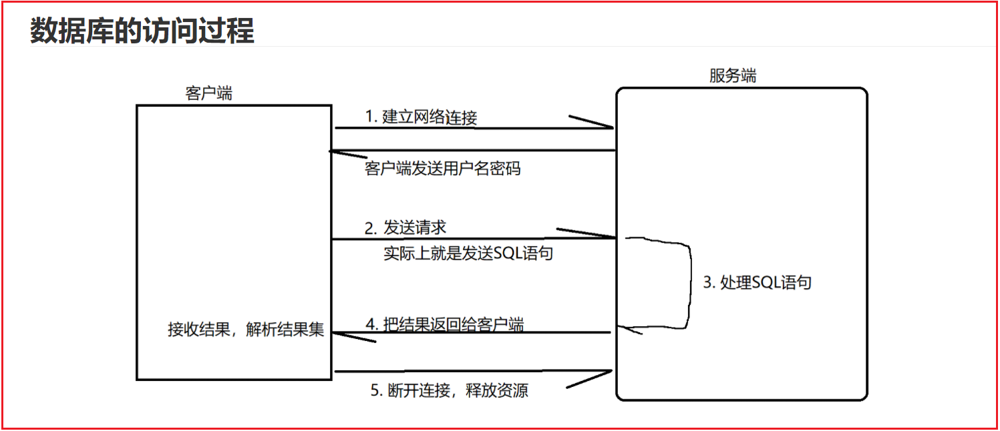
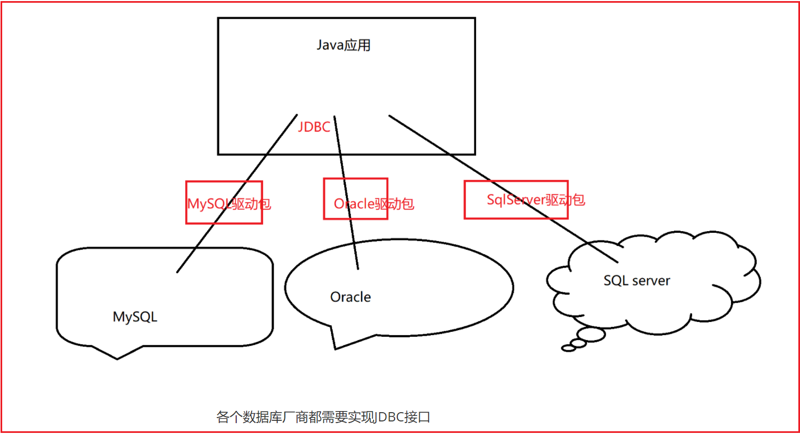
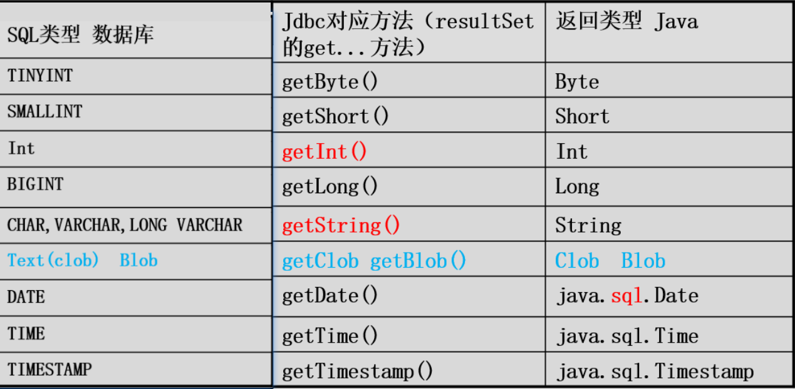
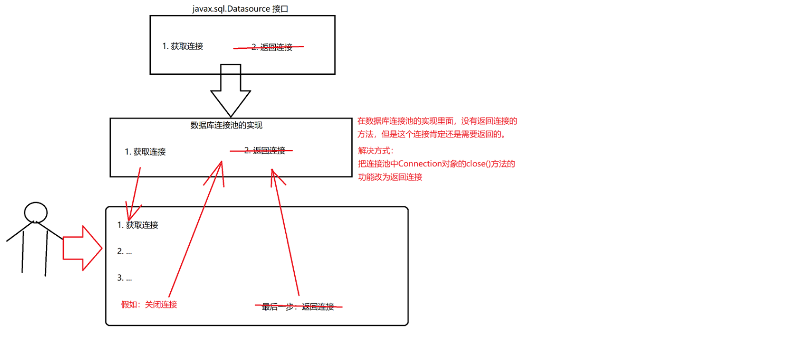
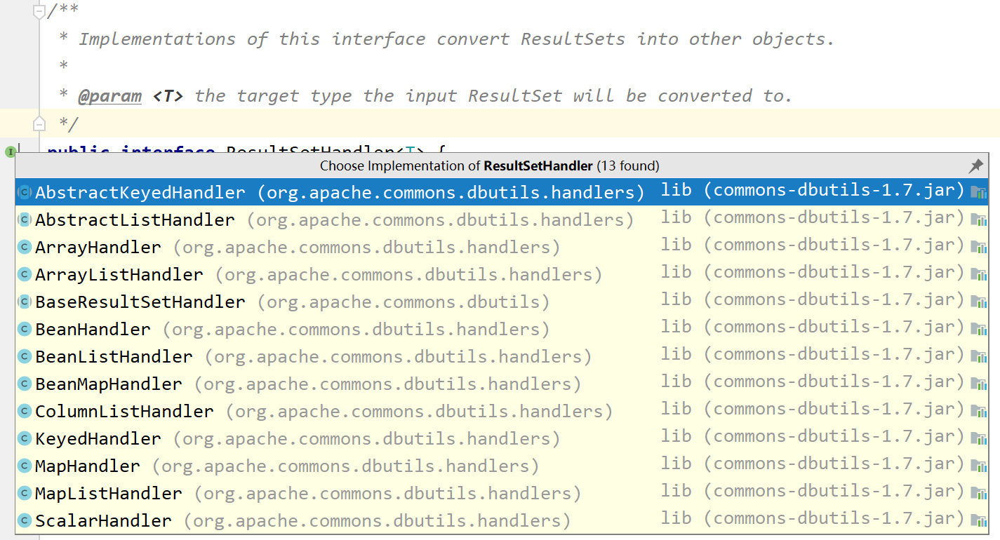

# 一 JDBC是什么

## 1. 访问过程

数据库的访问过程




<br/>


## 2. JDBC是什么

JDBC是什么呢？ JDBC：Java Database Connection。Java数据库连接。

本质上，JDBC是一套Java去操作数据库的这么一套接口。





<br/>


## 3. JDBC体系结构

JDBC（Java DataBase Connectivity, java数据库连接）是一种用于执行SQL语句的Java API

- DriverManager： 管理数据库驱动程序列表、使用通信子协议将来自java应用程序的连接请求与适当的数据库驱动程序匹配

  ```java
  // 注册驱动
  DriverManager.registerDriver(new com.mysql.jdbc.Driver());  
  
  // 获取连接
  Connection conn = DriverManager.getConnection(String url,String username,String password);
  
  ```

  <br/>

- Driver: 处理与数据库服务器的通信（使用 DriverManager对象来管理这种类型的对象）

  <br/>

- Connection：具有用于联系数据库的所有方法。连接对象表示通信上下文，与数据库的所有通信仅通过连接对象

  ```java
  Statement statement = connection.createStatement();                          // 获取statement
  
  connection.close();                                                          // 关闭连接
   
  PrepareStatemnt prePareStatement = connection.prepareStatement(String sql);  // 获取PrepareStatement
  
  ```

  <br/>

- Statement：使用 从此接口创建的对象将SQL语句提交到数据库。除了执行存储过程之外，一些派生接口还接受参数

  ```java
  // 执行增删改SQL, 返回的是影响的行数
  int affectedRows = statement.executeUpdate(String updateSQL);
  
  // 执行查询SQL，返回结果集对象
  ResultSet rs = statement.executeQuery(String querySQL);
  
  ```

  <br/>

- ResultSet：在使用Statement对象执行SQL查询后，这些对象保存从数据库检索的数据。

  它作为一 个迭代器，允许我们移动其数据 （resultSet是代表查询语句查询出来的结果集对象，包含了一个游标）

  ```java
  // 移动到下一行 当移动到下一行的时候，返回true，当没有下一行的时候，返回false
  Boolean ret = resultSet.next();
  
  // 移动游标到上一行 当移动到上一行的时候，返回true，当没有上一行的时候，返回false
  Boolean ret = resultSet.previous();
  
  resultSet.beforeFirst();            // 移动游标到第一行之前
  resultSet.afterLast();              // 移动游标到最后一行之后
  
  ```

​		

​	<br/>

- SQLException：此类处理数据库应用程序中发生的任何错误


<br/>


# 二 JDBC的使用

## 1. JDBC使用步骤

使用之前需要导入jdbc的驱动包， 普通java项目参照：[IDEA导入jar包说明](JavaSE/detail/jar包导入.md) ， maven项目导入：

```xml
<dependency>
    <groupId>mysql</groupId>
    <artifactId>mysql-connector-java</artifactId>
    <version>8.0.26</version>
</dependency>
```

<br/>

JDBC使用步骤：

**1. 导入包**：需要导入包含数据库编程所需的JDBC类的包、大多数情况下，使用 `import java.sql.*` 就足够 了

<br/>


**2. 注册JDBC驱动程序**：初始化驱动程序，以便打开与数据库的通信通道 

- 注册驱动程序最常见的方法是使用Java的`Class.forName()`方法
- 第二种方法是使用静态`DriverManager.registerDriver() `方法

```java
Class.forName("com.mysql.cj.jdbc.Driver");

DriverManager.registerDriver( new com.mysql.cj.jdbc.Driver() );
```


常用数据库驱动程序名称：

| 数据库 | JDBC驱动程序名称                | URL格式                                                    |
| ------ | ------------------------------- | ---------------------------------------------------------- |
| MYSQL8 | com.mysql.cj.jdbc.Driver        | jdbc:mysql://hostname:3306/databaseName?serverTimezone=UTC |
| MySQL  | com.mysql.jdbc.Driver           | jdbc:mysql://hostname:3306/databaseName                    |
| ORACLE | oracle.jdbc.driver.OracleDriver | jdbc:oracle:thin:@hostname:port Number：databaseName       |
| DB2    | com.ibm.db2.jdbc.net.DB2Driver  | jdbc:db2:hostname:port Number / databaseName               |
| SYBASE | com.sybase.jdbc.SybDriver       | jdbc:sybase:Tds:hostname:port Number / databaseName        |

<br/>


**3. 打开连接**：使用`DriverManager.getConnection()`方法创建一个Connection对象，该对象表示与数据库的物理连接

```java
// 三个重载的DriverManager.getConnection()方法
DriverManager.getConnection(String url);
DriverManager.getConnection(String url，Properties prop);
DriverManager.getConnection(String url，String user，String password);

// 常用
Connection connection = DriverManager.getConnection(url, username, password);

// 获取连接，connection对象是用接口接收的，但是其实实例对象是com.mysql.jdbc.JDBC4Connection

```

<br/>


**4. 执行查询**：使用类型为Statement的对象来构建和提交SQL语句到数据库

```java
// 使用Statement对象来构建和提交SQL语句
statement = connection.createStatement();
ResultSet resultSet = statement.executeQuery("select name from product");
while(resultSet.next()){
    System.out.println(resultSet.getString("name"));
}
```

创建Statement对象后，可以使用它来执行一个SQL语句，其中有三个执行方法之一：

- `boolean execute(String SQL)`：如果可以检索到ResultSet对象，则返回一个布尔值true; 否则返 回false
- `int executeUpdate(String SQL)`：INSERT，UPDATE或DELETE语句
- `ResultSet executeQuery(String SQL)`：SELECT语句、返回一个ResultSet对象

```java
// 使用PreparedStatement对象来构建和提交SQL语句
String sql = "select * from product where name=? and price=?";
preparedStatement = connection.prepareStatement(sql);
preparedStatement.setString(1, "Lemon");
preparedStatement.setInt(2, 11);
ResultSet priceSet = preparedStatement.executeQuery();
while (priceSet.next()){
    System.out.println("Lemon price: "+priceSet.getInt("price"));
}
```

<br/>


**5. 从结果集中提取数据**：使用相应的 `ResultSet.getXXX()`方法从结果集中检索数据

<br/>

**6. 释放资源**：需要明确地关闭所有数据库资源，而不依赖于jc

<br/>

```java
// 代码示例：
public class JDBCDemo {
    public static void main(String[] args) {
        String driver = "com.mysql.cj.jdbc.Driver";
        String url = "jdbc:mysql://192.168.16.122:3306/mydb?serverTimezone=UTC ";
        String username = "root";
        String password = "root";

        Connection connection =null;
        Statement statement = null;
        PreparedStatement preparedStatement = null;
        try {
            // 注册驱动程序
            Class.forName(driver);
            // 打开连接
            connection = DriverManager.getConnection(url, username, password);

            // 使用Statement来构建和提交SQL语句
            statement = connection.createStatement();
            ResultSet resultSet = statement.executeQuery("select name from product");
            while(resultSet.next()){
                System.out.println(resultSet.getString("name"));
            }
            // 使用PreparedStatement来构建和提交SQL语句
            String sql = "select * from product where name=? and price=?";
            preparedStatement = connection.prepareStatement(sql);
            preparedStatement.setString(1, "Lemon");
            preparedStatement.setInt(2, 11);
            ResultSet priceSet = preparedStatement.executeQuery();
            while (priceSet.next()){
                System.out.println("Lemon price: "+priceSet.getInt("price"));
            }
        } catch (ClassNotFoundException e) {
            e.printStackTrace();
        } catch (SQLException e) {
            e.printStackTrace();
        } finally {
            try {
                if(preparedStatement!=null) preparedStatement.close();  
                if(statement!=null) statement.close();
                if(connection!=null) connection.close();
            } catch (SQLException e) {
                e.printStackTrace();
            }
        }
    }
}
```

<br/>


## 2. JDBC工具类(1)

主要用于避免重复繁琐的获取连接、释放资源问题 （创建对象方式）

```java
public class JDBCUtils {
    private static String driver;
    private static String username;
    private static String password;
    private static String url;

    private Connection connection;
    private PreparedStatement preparedStatement;
    private ResultSet resultSet;
    private int count;

    // 1. 读取数据库配置信息、注册驱动
    static {
        try {
            // InputStream stream = JDBCUtils.class.getClassLoader().getResourceAsStream("db.properties");
            // db.properties位于项目根目录、  反射在这里读不到文件
            // 关于java项目读文件的问题参照博客：https://blog.csdn.net/drizzletowne/article/details/120887844
            FileInputStream stream = new FileInputStream("db.properties");
            Properties properties = new Properties();
            properties.load(stream);
            driver = properties.getProperty("driver");
            username = properties.getProperty("username");
            password = properties.getProperty("password");
            url = properties.getProperty("url");
            Class.forName(driver);
        } catch (FileNotFoundException e) {
            e.printStackTrace();
        } catch (ClassNotFoundException e) {
            e.printStackTrace();
        } catch (IOException e) {
            e.printStackTrace();
        }
    }

    // 2. 获得数据库连接
    public Connection getConnection(){
        try {
            connection = DriverManager.getConnection(url, username, password);
        } catch (SQLException e) {
            e.printStackTrace();
        }
        return connection;
    }

    // 3. PreparedStatement
    public PreparedStatement getPreparedStatement(String sql){
        try {
            preparedStatement = getConnection().prepareStatement(sql);
        } catch (SQLException e) {
            e.printStackTrace();
        }
        return preparedStatement;
    }

    // 4. 绑定参数
    public void setParam(List list){
        if(list!=null && list.size() > 0){
            for (int i = 0; i < list.size(); i++) {
                try {
                    preparedStatement.setObject(i+1, list.get(i));
                } catch (SQLException e) {
                    e.printStackTrace();
                }
            }
        }
    }

    // 5. 增删改
    public int update(String sql, List list){
        getPreparedStatement(sql);
        setParam(list);
        try {
            count = preparedStatement.executeUpdate();
        } catch (SQLException e) {
            e.printStackTrace();
        }
        return count;
    }

    // 6. 查询
    public ResultSet query(String sql, List list){
        getPreparedStatement(sql);
        setParam(list);
        try {
            resultSet = preparedStatement.executeQuery();
        } catch (SQLException e) {
            e.printStackTrace();
        }
        return resultSet;
    }

    // 7. 关闭资源
    public void close(){
        try {
            if(resultSet != null) resultSet.close();
            if(preparedStatement != null) preparedStatement.close();
            if(connection != null) connection.close();
        } catch (SQLException e) {
            e.printStackTrace();
        }
    }
}
```

<br/>

```java
// 自定义 JDBC 工具类的使用案例：
public class Demo {
    public static void main(String[] args) throws SQLException {
        JDBCUtils db = new JDBCUtils();

        String sql = "select * from product where name=? and price=?";
        List<Object> params = new ArrayList<>();
        params.add("Apple");
        params.add(11);
        ResultSet resultSet = db.query(sql, params);
        while (resultSet.next()){
            System.out.println(resultSet.getInt("id"));
        }
        db.close();
    }
}
```

相较于前面的例子，这样的使用方式已经简洁了很多~

<br/>

```properties
# db.properties 配置文件
driver=com.mysql.jdbc.Driver
url=jdbc:mysql://localhost:3306/academy?useSSL=false&characterEncoding=utf8&rewriteBatchedStatements=true
user=root
password=123456
```


<br/>

## 3. JDBC工具类(2)

静态方法的方式：

```java

public class JDBCUtil {
    static String driver;
    static String url;
    static String user;
    static String password;

    static {
        try {
            FileInputStream fileInputStream = new FileInputStream("db.properties");
            Properties properties = new Properties();
            properties.load(fileInputStream);

            driver = properties.getProperty("driver");
            url = properties.getProperty("url");
            user = properties.getProperty("user");
            password = properties.getProperty("password");

        } catch (IOException e) {
            e.printStackTrace();
        }
    }

    /**
     * 获取连接
     */
    public static Connection getConnection() {
        Connection connection = null;
        try {
            // DriverManager.registerDriver(new Driver());
            Class.forName(driver);
            connection = DriverManager.getConnection(url, user, password);
        } catch (SQLException | ClassNotFoundException e) {
            e.printStackTrace();
        }
        return connection;
    }

    /**
     * 释放资源
     */
    public static void close(ResultSet rs, Statement stat, Connection conn){
        try {
            if (rs != null) rs.close();
        } catch (SQLException e) {
            e.printStackTrace();
        } finally {
            try {
                if (stat != null) stat.close();
            } catch (SQLException e) {
                e.printStackTrace();
            } finally {
                if (conn != null) {
                    try {
                        conn.close();
                    } catch (SQLException e) {
                        e.printStackTrace();
                    }
                }
            }
        }
    }
}
```

<br/>

```java
// 使用示例
public static void selectByKey(){
    long start = System.currentTimeMillis();

    Connection connection = null;
    PreparedStatement pps = null;
    try {
        connection = JDBCUtil.getConnection();
        pps = connection.prepareStatement("select * from day04 where id=?");
        pps.setInt(1, 999999);
        pps.executeQuery();
    } catch (SQLException e) {
        e.printStackTrace();
    }
    JDBCUtil.close(null, pps, connection);

    long end = System.currentTimeMillis();
    System.out.println("selectByKey：" + (end - start) + "ms");
}
```


<br/>


## 4. SQL注入问题

产生数据库注入问题的原因：用户输入了一些自定义的字符串，这个字符串中可能包含了SQL语句的关键字，导入拼接之后的SQL语句改变了原来的格式，MySQL服务器错误的去解析了SQL语句，导致用户可以登录成功。

```java
// 
public static void main(String[] args) {
    try {
        // 常规的登录
        // boolean ret = login("zhangsan", "123456");

        // 非常规登录
        boolean ret = login("asdhajdh", "aefwjfwegb' or '1=1");

        if (ret) {
            System.out.println("登录成功！！！");
        }else {
            System.out.println("登录失败！！！");
        }
    } catch (SQLException e) {
        e.printStackTrace();
    }
}


// 登录的方法
public static boolean login(String username,String password) throws SQLException {
    // 获取连接
    Connection connection = JDBCUtils.getConnection();
    // 获取statement对象
    Statement statement = connection.createStatement();

    String sql = "select * from t_user where username = '" + username + "' and password = '" + password + "'";

    System.out.println(sql);

    // 执行SQL语句
    ResultSet resultSet = statement.executeQuery(sql);

    if (resultSet.next()) {
        return true;
    }
    return false;
}
```

那么如何去解决数据库的注入问题呢？使用PrepareStatement就可以解决.

PrepareStatement如何解决问题的呢？

其实就是通过预编译的方式，把SQL语句提前发送给MySQL服务器，然后再把参数发给MySQL服务器。

那么后续发送的参数就只会被MySQL服务器识别为普通的字符串或者是普通的参数，不会被当成关键字类解析了，因为已经解析过了。

这样就可以避免数据库的注入问题。


<br/>


# 三 事务与批处理

## 1. JDBC事务

JDBC驱动程序默认使用自动提交模式、要启用手动事务支持、需要使用Connection对象的 `setAutoCommit()`方法

```java
- 开启事务

  `connection.setAutoCommit(false);`

- 提交事务

  `connection.commit();`

- 回滚事务

  `connection.rollback();`
    
```


<br/>

```java
try{
    //Assume a valid connection object conn
    conn.setAutoCommit(false);
    Statement stmt = conn.createStatement();
    String SQL = "INSERT INTO Employees values (106, 20, 'Rita', 'Tez')";
    stmt.executeUpdate(SQL);
    //Submit a malformed SQL statement that breaks
    String SQL = "INSERTED IN Employees VALUES (107, 22, 'Sita', 'Singh')";
    stmt.executeUpdate(SQL);
    // If there is no error.
    conn.commit();
}catch(SQLException se){
    // If there is any error.
    conn.rollback();
}
```

<br/>


新的JDBC 3.0 Savepoint接口为您提供了额外的事务控制、可以在事务中定义逻辑回滚点：

如果通过保存点发生错误，则可以使用回滚方法 来撤消更改 

Connection对象有两种新的方法来帮助您管理保存点 

- `setSavepoint(String savepointName)`：定义新的保存点、返回一个Savepoint对象
- `releaseSavepoint(Savepoint savepointName)`：删除保存点、它需要一个Savepoint 对象作为参数

```java
try{
    //Assume a valid connection object conn
    conn.setAutoCommit(false);
    Statement stmt = conn.createStatement();
    
    Savepoint savepoint1 = conn.setSavepoint("Savepoint1");
    String SQL = "INSERT INTO Employees VALUES (106, 20, 'Rita', 'Tez')";
    stmt.executeUpdate(SQL);
    String SQL = "INSERTED IN Employees VALUES (107, 22, 'Sita', 'Tez')";
    stmt.executeUpdate(SQL);
    conn.commit();
}catch(SQLException se){
	conn.rollback(savepoint1);  // 必须是没有commit前使用的,即执行到commit之前要发生异常，这个语句才有意义
}

```

<br/>


## 2. JDBC批处理

批量处理：也就是批量的执行SQL语句。

即将相关的SQL语句分组到批处理中，并通过对数据库的一次调用提交它们。

当需要一次向数据库发送多个SQL语句时，可以减少连接数据库的开销，从而提高性能。

<br/>

```properties
# 需要给MySQL的url添加配置 rewriteBatchedStatements=true

url=jdbc:mysql://localhost:3306/academy?useSSL=false&characterEncoding=utf8&rewriteBatchedStatements=true

```

<br/>

```java
//  Statement批处理
public static void insertByStatement(){
    long start = System.currentTimeMillis();

    Connection connection = null;
    Statement statement = null;
    try {
        connection = JDBCUtil.getConnection();
        statement = connection.createStatement();

        for (int i = 0; i < 10000; i++) {
            String sql = "insert into user values (" + i +", 'zhangsan" + i + "')";
            statement.addBatch(sql);
        }
        statement.executeBatch();
    } catch (SQLException e) {
        e.printStackTrace();
    }
    JDBCUtil.close(null, statement, connection);

    long end = System.currentTimeMillis();
    System.out.println("insertByStatement：" + (end - start) + "ms");
}
// 6075ms
```

<br/>

```java
// PreparedStatement批处理
public static void insertByPreparedStatement(){
    long start = System.currentTimeMillis();

    Connection connection = null;
    PreparedStatement pps = null;
    try {
        connection = JDBCUtil.getConnection();
        pps = connection.prepareStatement("insert into user values (?,?)");

        for (int i = 0; i < 10000; i++) {
            pps.setInt(1, i);
            pps.setString(2, "zhangsan" + i);
            pps.addBatch();
        }
        pps.executeBatch();
    } catch (SQLException e) {
        e.printStackTrace();
    }
    JDBCUtil.close(null, pps, connection);

    long end = System.currentTimeMillis();
    System.out.println("insertByPreparedStatement：" + (end - start) + "ms");
}
// 241ms
```

<br/>

> 总结：我们不难发现，使用PrepareStatement进行批处理效率最高，远大于其他两种方式的执行效率。

| （假如循环n次）        | 通信次数 | 编译次数 | 执行时间 |
| ---------------------- | -------- | -------- | -------- |
| for循环                | n        | n        | 最长     |
| statement批处理        | 1        | n        | 次之     |
| PrepareStatement批处理 | 2        | 1        | 最短     |

<br/>

statement与PrepareStatement批处理对比：

- PrepareStatement批处理效率更高，因为MySQL服务器只对SQL语句编译了一次
- PrepareStatement批处理的时候，要求所有的SQL语句的格式是一样的，只有参数不一样，而statement进行批处理的时候，可以有不同格式，不同类型的SQL语句


<br/>


# 四 数据库连接池

数据连接池原理： 连接池基本的思想是在系统初始化的时候，将数据库连接作为对象存储在内存中

- 当用户需要访问数据库时，并非建立一个新的连接，而是从连接池中取出一个已建立的空闲连接对象
- 使用完毕后，用户也并非将连接关闭，而是将连接放回连接池中，以供下一个请求访问使用

而连接的建立、断开都由连接池自身来管理。同时，还可以通过设置连接池的参数来控制连接池中的初始连接数、连接的上下限数 以及每个连接的最大使用次数、最大空闲时间等等，也可以通过其自身的管理机制来监视数据库连接的 数量、使用情况等。

<br/>

市面上有很多第三方开源的数据库连接池，那么这些连接池里面的方法名可能不一样。

> 例如：
>
> A：getConnection
>
> B:  aquireConnection
>
> C:  get()

这样对于Java的使用者来说去使用第三方开源的数据库连接池就可能不太方便，那么Java开发者就在JDBC中定义了一个数据库连接池的接口（`javax.sql.Datasource`），其他的数据库连接池的实现都需要去实现这个接口，这就对我们Java开发者来说造成了极大的便利，方便我们去在Java中使用数据库连接池。

```java
// Java中定义的数据库连接池的接口
public interface DataSource  extends CommonDataSource, Wrapper {

  	Connection getConnection() throws SQLException;

  	Connection getConnection(String username, String password) throws SQLException;
    
}
```

在这个接口中，只定义了获取连接的方法，没有定义返回连接的方法。这是为什么呢？




那我们从上面可以知道：

1. 在Datasource接口中，没有定义返回连接的方法，是因为接口的制定者不能阻止用户去使用数据库连接池的实现的时候，来先调用关闭连接的方法，再调用返回连接的方法。

2. 在第三方开源的数据库连接池的使用中，不需要手动去调用返回连接的方法（返回连接通过connection.close()方法来返回）


<br/>


## 1. 自定义连接池

需要实现的基本功能：

```
1. 根据配置文件连接数据库，并可以指定连接池的最大值、最小空闲连接数和初始化大小
2. 可以获取连接、返回连接
3. 根据配置文件参数（或默认参数）在适当的时候进行扩容
```


配置文件示例：

```properties
# db.properties
driverClassName=com.mysql.jdbc.Driver
url=jdbc:mysql://localhost:3306/academy?useSSL=false&characterEncoding=utf8&rewriteBatchedStatements=true
username=root
password=123456

initialSize=10
maxActive=50
minIdle=5

```


连接池实现：

```java
// 基础的JDBC部分
public class JDBCUtil {
    static String driverClassName;
    static String url;
    static String username;
    static String password;

    static Properties prop;
    static {
        try {
            FileInputStream fileInputStream = new FileInputStream("db.properties");
            Properties properties = new Properties();
            properties.load(fileInputStream);
            prop = properties;

            driverClassName = properties.getProperty("driverClassName");
            url = properties.getProperty("url");
            username = properties.getProperty("username");
            password = properties.getProperty("password");

        } catch (IOException e) {
            e.printStackTrace();
        }
    }

    /**
     * 获取连接
     * @author itdrizzle
     * @date 2022/3/21 20:34
     * @return {@link Connection}
     */
    public static Connection getConnection() {
        Connection connection = null;
        try {
            // DriverManager.registerDriver(new Driver());
            Class.forName(driverClassName);
            connection = DriverManager.getConnection(url, username, password);
        } catch (SQLException | ClassNotFoundException e) {
            e.printStackTrace();
        }
        return connection;
    }

    /**
     * 释放资源
     * @author itdrizzle
     * @date 2022/3/21 20:33
     */
    public static void close(ResultSet rs, Statement statement, Connection conn){
        try {
            if (rs != null) rs.close();
        } catch (SQLException e) {
            e.printStackTrace();
        } finally {
            try {
                if (statement != null) statement.close();
            } catch (SQLException e) {
                e.printStackTrace();
            } finally {
                if (conn != null) {
                    try {
                        conn.close();
                    } catch (SQLException e) {
                        e.printStackTrace();
                    }
                }
            }
        }
    }

    public static Properties getProp(){
        return prop;
    }
}
```

<br/>

```java
// 连接池实现部分
public class SingleDatasource {
    // 扩容大小
    private static final int ADD_CAPACITY = 10;
    // 连接数（包含正在使用的连接）
    private static int size = 0;

    private static int initialSize = 10;
    private static int maxActive = 50;
    private static int minIdle = 5;

    private static Queue<Connection> dataSource;

    static {
        readProperties();
        addCapacity(initialSize);
    }

    /**
     * 从连接池中获取连接（Connection）
     * @author itdrizzle
     * @date 2022/3/23 15:34
     * @return {@link Connection}
     */
    public static Connection getConnection() {
        // 空闲连接数少于 minIdle时需要扩容
        if (dataSource.size() < minIdle) {
            addCapacity(ADD_CAPACITY);
        }

        // 扩容后还是没有空闲连接，直接抛出异常
        if (dataSource.size() == 0) {
            throw new RuntimeException("No Idle Connection");
        }
        return dataSource.poll();
    }

    // 返回连接
    public static void  returnConnection(Connection connection){
        dataSource.offer(connection);
    }

    /**
     * 扩容
     * @author itdrizzle
     * @date 2022/3/23 15:29
     */
    private static void addCapacity(int len) {
        // 连接数不能超过最大值
        if (size >= maxActive) {
            return;
        }
        if (size + len > maxActive) {
            len = maxActive - size;
        }

        if (dataSource == null || dataSource.size() == 0) {
            dataSource = new LinkedList<>();
        }

        for (int i = 0; i < len; i++) {
            dataSource.offer(JDBCUtil.getConnection());
        }
        SingleDatasource.size += len;
        System.out.println("after size: " + size);
    }

    /**
     * 读取配置文件，设置连接池的相关参数
     * @author itdrizzle
     * @date 2022/3/23 15:29
     */
    private static void readProperties(){
        Properties properties = JDBCUtil.getProp();
        String value = null;

        value = properties.getProperty("initialSize");
        if (value != null) {
            initialSize = Integer.parseInt(value);
        }

        value = properties.getProperty("maxActive");
        if (value != null) {
            maxActive = Integer.parseInt(value);
        }

        value = properties.getProperty("minIdle");
        if (value != null) {
            minIdle = Integer.parseInt(value);
        }
    }

}
```

<br/>

```java
// 测试示例：

public class SingleDatasourceDemo {
    public static void main(String[] args) {
        for (int i = 0; i < 51; i++) {
            Connection connection = SingleDatasource.getConnection();
        }
    }
}

/** 输出：
after size: 10
after size: 20
after size: 30
after size: 40
after size: 50
Exception in thread "main" java.lang.RuntimeException: No Idle Connection
	at cn.itdrizzle.jdbc.util.SingleDatasource.getConnection(SingleDatasource.java:45)
	at cn.itdrizzle.jdbc.day05.SingleDatasourceDemo.main(SingleDatasourceDemo.java:16)

Process finished with exit code 1

可以看到：在最大值以下可以正常扩容, 超过最大值继续获取连接则抛出异常
```


<br/>


## 2. DBCP连接池

DBCP是一个依赖`Jakarta commons-pool`对象池机制的数据库连接池. 

```
DBCP是Apache软件基金组织下面的一个开源的数据库连接池的实现。

Apache：软件基金组织，是世界上最大的开源组织。这个组织下面管理很多开源的应用。这些开源的应用大多数都来源于各个大公司捐赠。
```

DBCP可以直接的在应用程序中使用 (Tomcat的数据源使用的就是DBCP)

<br/>

导包：使用DBCP需要导入的jar包：`commons-dbcp.jar` 、`commons-pool.jar` 

```xml
<!--maven导入依赖：会自动导入其需要的jar,比如commons-pool.jar -->
<dependency>
    <groupId>commons-dbcp</groupId>
    <artifactId>commons-dbcp</artifactId>
    <version>1.4</version>
</dependency>
```

<br/>

配置文件：

```properties
# 连接设置 ( dbcp.properties )
driverClassName=com.mysql.cj.jdbc.Driver
url=jdbc:mysql://localhost:3306/m
username=root
password=root

# 初始化大小
initialSize=10

#最大连接数量
maxActive=50

# 最大闲置的数量
maxIdle=20

# 最小闲置
minIdle=5

# 等待时间  超时等待时间以毫秒为单位 6000毫秒/1000等于60秒
maxWait=60000

#JDBC驱动建立连接时附带的连接属性属性的格式必须为这样：[属性名=property;]
#注意："user" 与 "password" 两个属性会被明确地传递，因此这里不需要包含他们。
connectionProperties=useSSL=false;characterEncoding=utf8

#指定由连接池所创建的连接的自动提交（auto-commit）状态。
defaultAutoCommit=true

#driver default 指定由连接池所创建的连接的只读（read-only）状态。
#如果没有设置该值，则“setReadOnly”方法将不被调用。（某些驱动并不支持只读模式，如：Informix）
defaultReadOnly=

#driver default 指定由连接池所创建的连接的事务级别（TransactionIsolation）。
#可用值为下列之一：（详情可见javadoc。）NONE,READ_UNCOMMITTED, READ_COMMITTED, REPEATABLE_READ, SERIALIZABLE
defaultTransactionIsolation=REPEATABLE_READ

```

<br/>

使用方式一：

```java
public class DBCPUtil {
    static DataSource dataSource;

    static {
        try {
            FileInputStream fileInputStream = new FileInputStream("dbcp.properties");
            Properties properties = new Properties();
            properties.load(fileInputStream);

            dataSource = BasicDataSourceFactory.createDataSource(properties);
        } catch (Exception e) {
            e.printStackTrace();
        }
    }

    public static Connection getConnection(){
        Connection connection = null;
        try {
            connection = dataSource.getConnection();
        } catch (SQLException e) {
            e.printStackTrace();
        }
        return connection;
    }
    
    public static void close(ResultSet rs, Statement statement, Connection connection){
        // 这里调用Connection的close方法不会释放资源，而是返回给了连接池（一般连接池都会重写close方法）
    }
}
```


<br/>

使用方式二：

```java

// 1.创建dbcp的工具类对象
static BasicDataSource datasource=new BasicDataSource();

// 2.加载驱动
static {
    try {
        // 2.1. 加载属性文件
        ResourceBundle bundle = ResourceBundle.getBundle("db");
        driverClass = bundle.getString("driverclass");
        url = bundle.getString("url");
        username = bundle.getString("uname");
        password = bundle.getString("upass");
        init=bundle.getString("initsize");
        
        // 2.2.将驱动地址等信息传递给dbcp
        datasource.setDriverClassName(driverClass);
        datasource.setUrl(url);
        datasource.setUsername(username);
        datasource.setPassword(password);
        datasource.setInitialSize(Integer.parseInt(init));
    } catch (Exception e) {
        e.printStackTrace();
    }
}
// 3.获得连接
public static Connection getConn() {
    try {
    	con= datasource.getConnection();
    } catch (SQLException e) {
    	e.printStackTrace();
    }
    return con;
}

```

<br/>


## 3. C3P0连接池

c3p0与dbcp区别： 

- dbcp没有自动回收空闲连接的功能、 c3p0有自动回收空闲连接功能 
- dbcp需要手动设置配置文件、 c3p0不需要手动设置

<br/>


使用C3P0需要导入jar包：` c3p0-0.9.5.2.jar` 、 maven导入依赖：

```xml
<dependency>
    <groupId>com.mchange</groupId>
    <artifactId>c3p0</artifactId>
    <version>0.9.5.5</version>
</dependency>
```

c3p0是在外部添加配置文件,工具直接进行应用,因为直接引用,所以要求固定的命名和文件位置

- 文件位置:  普通java项目放在src目录下、maven项目放在resources目录下 

- 文件命名: `c3p0-config.xml / c3p0-config.properties`  

  官网xml配置文件示例：https://www.mchange.com/projects/c3p0/#c3p0-config.xml

<br/>


```xml
<!-- c3p0-config.xml -->
<?xml version="1.0" encoding="utf-8"?>
<c3p0-config>
    <!-- 默认配置，如果没有指定则使用这个配置 -->
    <default-config>
        <!-- 基本配置 -->
        <property name="driverClass">com.mysql.jdbc.Driver</property>
        <property name="jdbcUrl">jdbc:mysql://localhost:3306/tempdb?useSSL=false&amp;characterEncoding=utf8</property>
        <property name="user">root</property>
        <property name="password">123456</property>
        
        <!--扩展配置-->
        <!-- 连接超过30秒报错-->
        <property name="checkoutTimeout">30000</property>
        <!--30秒检查空闲连接 -->
        <property name="idleConnectionTestPeriod">30</property>
        <!-- 30秒不适用丢弃-->
        <property name="maxIdleTime">30</property>
        
        <property name="initialPoolSize">10</property>
        <property name="maxPoolSize">100</property>
        <property name="minPoolSize">10</property>
        <property name="maxStatements">200</property>
        
         <!-- 如果池中数据连接不够时、一次增长多少个 -->
        <property name="acquireIncrement">5</property>
    </default-config>
    
    <!-- 多数据源的配置（c3p0可以配置多个数据源） -->
    <named-config name="abc">
        <property name="driverClass">com.mysql.jdbc.Driver</property>
        <property name="jdbcUrl">jdbc:mysql://localhost:3306/dbname</property>
        <property name="user">root</property>
        <property name="password">111</property>
        <!-- 如果池中数据连接不够时一次增长多少个 -->
        <property name="acquireIncrement">5</property>
        <property name="initialPoolSize">20</property>
        <property name="minPoolSize">10</property>
        <property name="maxPoolSize">40</property>
        <property name="maxStatements">20</property>
        <property name="maxStatementsPerConnection">5</property>
    </named-config>
</c3p0-config>
```

注意: 

c3p0的配置文件内部可以包含命名配置文件和默认配置文件! 默认是选择默认配置! 

如果需要切换命名配置可以在创建c3p0连接池的时候填入命名即可!

```java
Connection con=null;
ComboPooledDataSource db = new ComboPooledDataSource("abc"); // 使用自命名的配置文件

public Connection getCon(){
    try {
    	con=db.getConnection();
    } catch (SQLException e) {
    	e.printStackTrace();
    }
    return con;
}
```

<br/>

```java
// C3p0Util.java   -- c3p0使用示例
public class C3p0Util {
    static DataSource dataSource;

    static {
        dataSource = new ComboPooledDataSource();
    }
    
    // 获取连接
    public static Connection getConnection() {
        Connection connection = null;
        try {
            connection = dataSource.getConnection();
        } catch (SQLException e) {
            e.printStackTrace();
        }
        return connection;
    }
}
```


<br/>


## 4. Druid连接池

Druid针对Oracle和MySql做了特别优化、提供了MySql、Oracle、Postgresql、SQL-92的SQL的完整支持，这是一个手写的高性能SQL Parser，支持Visitor模式，使得分析SQL的抽象语法树很方便。

使用Druid需要导入jar包：

```xml
<dependency>
    <groupId>com.alibaba</groupId>
    <artifactId>druid</artifactId>
    <version>1.1.28</version>
</dependency>
```

<br/>

```properties
# druid.properties
driverClassName=com.mysql.jdbc.Driver
url=jdbc:mysql://localhost:3306/dbname?characterEncoding=utf8&useSSL=false
username=root
password=123456

```

<br/>


```java
// Druid使用方式一
public class DruidUtils {
    //声明连接池对象
    private static DruidDataSource ds;
    static{
        ///实例化数据库连接池对象
        ds=new DruidDataSource();
        //实例化配置对象
        Properties properties=new Properties();
        try {
            //加载配置文件内容
            properties.load(DruidUtils.class.getResourceAsStream("config.properties"));
            //设置驱动类全称
            ds.setDriverClassName(properties.getProperty("driverClassName"));
            //设置连接的数据库
            ds.setUrl(properties.getProperty("url"));
            //设置用户名
            ds.setUsername(properties.getProperty("username"));
            //设置密码
            ds.setPassword(properties.getProperty("password"));
            //设置最大连接数量
            ds.setMaxActive(Integer.parseInt(properties.getProperty("maxActive")));
        } catch (IOException e) {
        	e.printStackTrace();
        }
    }
    //获取连接对象
    public static Connection getConnection() {
        try {
        	return ds.getConnection();
        } catch (SQLException e) {
        	e.printStackTrace();
        }
        return null;
    }
}
```

注: 在Druid连接池的配置中，driverClassName可配可不配，如果不配置会根据url自动识别dbType(数 据库类型)，然后选择相应的driverClassName。

<br/>


```java
// Druid使用方式二
public class DruidUtil {
    static DataSource dataSource;

    static {

        try {
            FileInputStream fileInputStream = new FileInputStream("druid.properties");
            Properties properties = new Properties();
            properties.load(fileInputStream);

            dataSource = DruidDataSourceFactory.createDataSource(properties);
        }catch (Exception ex){
            ex.printStackTrace();
        }
    }

    // 获取连接
    public static Connection getConnection(){

        Connection connection = null;
        try {
            connection = dataSource.getConnection();
        } catch (SQLException e) {
            e.printStackTrace();
        }
        return connection;
    }

    public static DataSource getDataSource() {
        return dataSource;
    }
}
```


<br/>

# 五 DbUtils库

DBUtils是Apache组织开源的一个关于操作JDBC的一个简单的工具类库。它对JDBC的一些操作进行了简单的封装。


```xml
<!--导包即可使用，无需配置-->
<dependency>
    <groupId>commons-dbutils</groupId>
    <artifactId>commons-dbutils</artifactId>
    <version>1.7</version>
</dependency>

```


<br/>


## 1. QueryRunner

QueryRunner是一个帮助我们去减少执行SQL语句的步骤的一个类。可以在一定程度上帮助我们简化JDBC操作的流程


QueryRunner里面有两个构造方法

```java
// 无参构造
QueryRunner queryRunner = new QueryRunner();

// 有参构造
QueryRunner queryRunnerWithDatasource = new QueryRunner(dataSource);
```

使用QueryRunner的无参构造方法，后续再执行API的时候，需要传入Connection。

```java
// 无参构造的方式
QueryRunner queryRunner = new QueryRunner();
// 使用无参构造的方式在使用时需要 Connection
Connection connection = DruidUtil.getConnection();

int affectedRows = queryRunner.update(connection, sql, "鲁智深");
System.out.println("affectedRows = " + affectedRows);


// 有参构造的方式
QueryRunner qr = new QueryRunner(dataSource);
int affectedRows = qr.update(sql, "林冲");
System.out.println("affectedRows = " + affectedRows);

```


<br/>


## 2. ResultSetHandler

ResultSetHandler是一个接口。是帮助我们去解析结果集的一个接口。我们可以自己写一个简单的实现类：

```java
// 调用
List<Account> accounts = queryRunner.query(sql, new MyResultSetHandler());

// 自己实现接口
public class MyResultSetHandler implements ResultSetHandler<List<Account>> {
    @Override
    public List<Account> handle(ResultSet rs) throws SQLException {
        List<Account> list = new ArrayList<Account>();

        while (rs.next()) {
            int id = rs.getInt("id");
            String name = rs.getString("name");
            String nickname = rs.getString("nickname");
            int money = rs.getInt("money");

            Account account = new Account();
            account.setId(id);
            account.setName(name);
            account.setMoney(money);
            account.setNickname(nickname);

            list.add(account);
        }
        return list;
    }
}
```

<br/>

此处明白原理即可，因为DBUtils已经通过反射的方式实现了一些常用的类



下面介绍几个常用的实现类：


<br/>

### 1) BeanHandler

这个接口实现类可以帮助我们把结果集转化为单个Bean（BeanHandler会把第一行转化为JavaBean）

```java
@Test
public void testBeanHandler() throws SQLException {
    String sql = "select * from user where id=?";

    QueryRunner queryRunner = new QueryRunner(dataSource);
    User user = queryRunner.query(sql, new BeanHandler<>(User.class), 5);

    System.out.println(user);
}
```

<br/>

```Java
// 上述代码引用的 dataSource 来自于数据库连接池的数据源，下面的示例中也一样
public class DbutilsDemo {
    static DataSource dataSource;

    static {
        dataSource = C3p0Util.getDataSource();
    }
    ......
}
```

<br/>

### 2) BeanListHandler

这个接口的实现类可以帮助我们把结果集转化为一个JavaBean的集合

```java
@Test
public void testBeanListHandler() throws SQLException {
    String sql = "select * from user";

    QueryRunner queryRunner = new QueryRunner(dataSource);
    List<User> users = queryRunner.query(sql, new BeanListHandler<>(User.class));

    for (User user : users) {
        System.out.println(user);
    }
}
```


<br/>

### 3) ColumnListHandler

可以将单列的结果集放到一个List中

```java
@Test
public void testColumnListHandler() throws SQLException {
    String sql = "select username from user";

    QueryRunner queryRunner = new QueryRunner(dataSource);
    List<String> names = queryRunner.query(sql, new ColumnListHandler<>());

    System.out.println("names = " + names);
}
```


<br/>

### 4) ScalarHandler

可以接受单个值的结果

```java
@Test
public void testScalarHandler() throws SQLException {
    String sql = "select username from user where id=?";

    QueryRunner queryRunner = new QueryRunner(dataSource);
    String name = queryRunner.query(sql, new ScalarHandler<>(), 5);

    System.out.println("name = " + name);
}
```

<br/>

通过以上的例子可以看出，DBUtils有一定的作用，可以帮助我们提高JDBC开发的效率，简化JDBC的流程。


<br/>

## 3. DBUtils类

DBUtils主要是提供了一个关于Connection、Statement、ResultSet操作相关的API

```java
void close(Connection conn);

void close(ResultSet rs);

void close(Statement stat);

void closeQuietly(Connection conn);

void commit(Connection conn);
```

DBUtils这个类里面封装的方法都比较简单， 所以一般来说，开发者用的很少


<br/>


