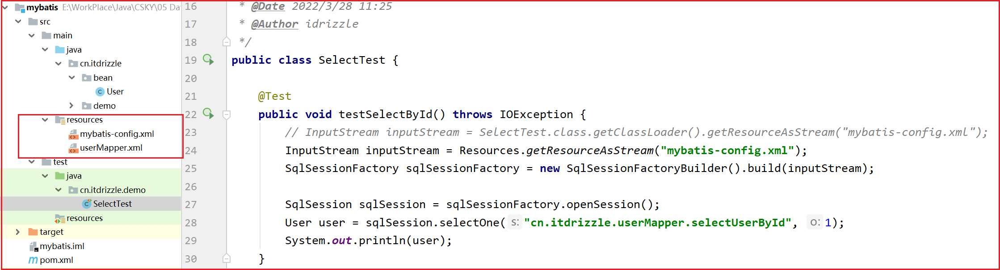
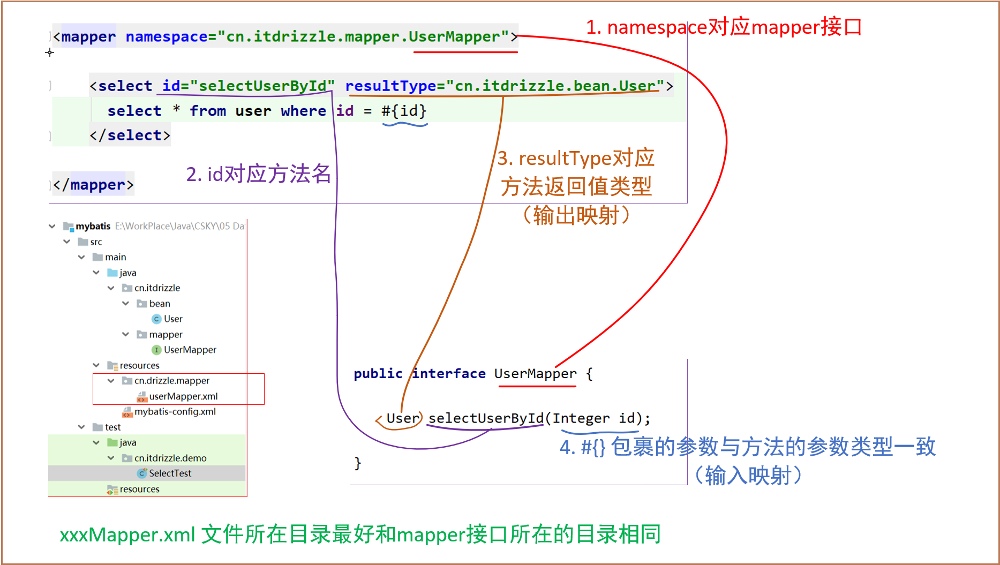
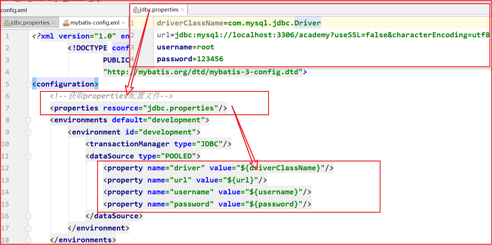

# 一 mybatis Introduction

mybatis – MyBatis 3  官方文档：https://mybatis.org/mybatis-3/index.html  

MyBatis is a first class persistence framework with support for custom SQL, stored procedures and advanced mappings. 

<br/>

Mybatis是一个优秀的持久层框架，又叫做 ORM框架 (半自动化、轻量级的ORM框架)。

ORM：Object Relationship Mapping（对象关系映射）。

```java

Mybatis其实就是一个可以帮助我们把对象映射为关系型数据库中的记录，把关系型数据库中的记录映射为对象的这么一个持久层框架。

持久层：持久层是指和数据库打交道的这一层。

Mybatis其实就是一个可以帮助我们自定义SQL语句去操作数据库，对数据库进行增删改查的这么一个框架。
简化我们对于数据库的操作，简化JDBC的流程。
    
```

<br/>

```java
/* 为什么使用Mybatis?

- 对比JDBC
  - 原生的JDBC使用流程更复杂，操作繁琐
  - SQL语句和代码严重耦合，存在硬编码
  - 结果集解析不智能，需要手动解析
  
- 对比DBUtils
  - SQL语句和代码严重耦合，存在硬编码
  - 结果集解析的时候其实还是需要我们传入不同的ResultSetHandler，不够强大
  - 对于连接查询的情况，是不太能够支持的
  
```

<br/>


## 1. Getting started

To use MyBatis you just need to include the [mybatis-x.x.x.jar](https://github.com/mybatis/mybatis-3/releases) file in the classpath.

If you are using Maven just add the following dependency to your pom.xml:

```xml
<dependency>
  <groupId>org.mybatis</groupId>
  <artifactId>mybatis</artifactId>
  <version>x.x.x</version>
</dependency>
```

<br/>


**The configuration XML file ** （ `mybatis-config.xml` ）：

```xml
<?xml version="1.0" encoding="UTF-8" ?>
        <!DOCTYPE configuration
                PUBLIC "-//mybatis.org//DTD Config 3.0//EN"
                "http://mybatis.org/dtd/mybatis-3-config.dtd">
<configuration>
    <!--获取properties配置文件-->
    <properties resource="jdbc.properties"/>
    <environments default="development">
        <environment id="development">
            <transactionManager type="JDBC"/>
            <dataSource type="POOLED">
                <property name="driver" value="${driverClassName}"/>
                <property name="url" value="${url}"/>
                <property name="username" value="${username}"/>
                <property name="password" value="${password}"/>
            </dataSource>
        </environment>
    </environments>
<mappers>
    <!--<mapper resource="org/mybatis/example/BlogMapper.xml"/>-->
    <mapper resource="cn/drizzle/mapper/userMapper.xml"/>
</mappers>
</configuration>
```

<br/>

```properties
# jdbc.properties
driverClassName=com.mysql.jdbc.Driver
url=jdbc:mysql://localhost:3306/academy?useSSL=false&characterEncoding=utf8
username=root
password=123456
```

<br/>


**Building SqlSessionFactory from XML**：

```java

// 通过反射或者mybatis提供的 Resources.getResourceAsStream() 读取 maven项目的resources目录下的配置文件

// InputStream inputStream = SelectTest.class.getClassLoader().getResourceAsStream("mybatis-config.xml");
InputStream inputStream = Resources.getResourceAsStream("mybatis-config.xml");

SqlSessionFactory sqlSessionFactory = new SqlSessionFactoryBuilder().build(inputStream);

```

<br/>


**Acquiring a SqlSession from SqlSessionFactory**：

配置mapper.xml：

```xml
<?xml version="1.0" encoding="utf-8" ?>
<!DOCTYPE mapper
    PUBLIC "-//mybatis.org//DTD Mapper 3.0//EN"
    "http://mybatis.org/dtd/mybatis-3-mapper.dtd" >
<mapper namespace="cn.itdrizzle.userMapper">
    <select id="selectUserById" resultType="cn.itdrizzle.bean.User">
      select * from user where id = #{id}
    </select>
</mapper>
```

<br/>

The SqlSession contains absolutely every method needed to execute SQL commands against the database. You can execute mapped SQL statements directly against the SqlSession instance. For example:

```java

SqlSession sqlSession = sqlSessionFactory.openSession();

// 通过SQLSession执行SQL语句
// 传入两个参数 1. SQL语句的坐标（namespace+id） 2. SQL语句的参数
User user = sqlSession.selectOne("cn.itdrizzle.userMapper.selectUserById", 1);
System.out.println(user);

```

<br/>




<br/>


## 2. Mybatis动态代理

关于使用Mybatis的动态代理，有几个规范是需要遵守的

- 接口的全限定名称和配置文件中的namespace保持一致
- 接口中的方法名和配置文件中的的id值保持一致
- 接口的返回值类型和resultType中的值保持一致 （输出映射）
- 接口的参数和标签中的参数保持一致 （输入映射）

还有几个行业默认的规范（不遵守不会报错，但是建议遵守）

- mapper.xml配置文件的名字，最好和接口保持一致

- mapper.xml配置文件和接口文件，在编译之后最好在同一级目录下

<br/>

创建mapper接口（注意接口与xml配置文件的对应关系，如下图所示：）



<br/>


```java
/**
* 使用mybatis的动态代理
* @author itdrizzle
* @date 2022/3/28 14:38
*/
@Test
public void testSelectByProxy() throws IOException {
    InputStream inputStream = Resources.getResourceAsStream("mybatis-config.xml");
    SqlSessionFactory sqlSessionFactory = new SqlSessionFactoryBuilder().build(inputStream);

    SqlSession sqlSession = sqlSessionFactory.openSession(true);

    UserMapper userMapper = sqlSession.getMapper(UserMapper.class);

    User user = userMapper.selectUserById(1);
    System.out.println(user);
}
```

<br/>


```shell

使用动态代理的流程

- 1. 声明一个接口
- 2. 写一个与接口对应的mapper.xml配置文件
- 3. 获取接口的代理对象
    // 获取代理对象(MapperProxy的实例对象)
    AccountMapper accountMapper = sqlSession.getMapper(AccountMapper.class);

- 4. 执行接口中的方法
    每一个接口都是和mapper.xml配置文件对应起来的；
    每一个接口中的方法都是和mapper.xml配置文件中的SQL语句的标签对应起来的，
    那么我们去执行接口中的方法的时候，其实就是相当于执行SQL语句，获取SQL语句的结果。

```


<br/>


## 3.mybatis常用配置

### 1) properties

- 配置一个jdbc.properties

  ```properties
  driverClassName=com.mysql.jdbc.Driver
  url=jdbc:mysql://localhost:3306/dbName?useSSL=false&characterEncoding=utf8
  username=root
  password=123456
  ```

- 在mybatis-config.xml中引入properties配置文件

  ```xml
  <!-- 加载properties 配置文件-->
  <properties resource="jdbc.properties"/>
  ```

  

<br/>


### 2) settings

这个里面是Mybatis极为重要的配置，会改变Mybatis的行为与属性值。

可以有很多配置，例如懒加载，缓存，日志等等。

```xml
<settings>
    <!-- 日志配置 -->
    <setting name="logImpl" value="STDOUT_LOGGING"/>
    <!--<setting name="" value=""/>-->
    <!--<setting name="" value=""/>-->
    <!--<setting name="" value=""/>-->
    <!--<setting name="" value=""/>-->
</settings>
```

<br/>


### 3) TypeAliases

类型别名的配置。 即可以对Mybatis配置文件中的类型去取别名。

- 配置别名

  ```xml
  <!-- 别名的配置 -->
  <typeAliases>
      <!-- 给单个java实体类取别名 -->
      <typeAlias type="cn.itdrizzle.bean.User" alias="user"/>
      
      <!-- 批量起别名（该包下的所有类的类名即为别名，且不区分大小写） -->
      <package name="cn.itdrizzle.bean"/>
  </typeAliases>
  ```

- 使用别名

  ```xml
  <select id="selectUserById" resultType="user">
      select * from t_user where id = #{id}
  </select>
  ```

<br/>


内置别名：Mybatis给我们提供了很多内置的别名

| 别名       | 映射的类型（java中的类型） |
| :--------- | :------------------------- |
| _byte      | byte                       |
| _long      | long                       |
| _short     | short                      |
| _int       | int                        |
| _integer   | int                        |
| _double    | double                     |
| _float     | float                      |
| _boolean   | boolean                    |
| string     | String                     |
| byte       | Byte                       |
| long       | Long                       |
| short      | Short                      |
| int        | Integer                    |
| integer    | Integer                    |
| double     | Double                     |
| float      | Float                      |
| boolean    | Boolean                    |
| date       | Date                       |
| decimal    | BigDecimal                 |
| bigdecimal | BigDecimal                 |
| object     | Object                     |
| map        | Map                        |
| hashmap    | HashMap                    |
| list       | List                       |
| arraylist  | ArrayList                  |
| collection | Collection                 |
| iterator   | Iterator                   |

<span style='color:red;background:yellow;font-size:文字大小;font-family:字体;'>**总结：Mybatis给Java类型中的基本类型、包装类型和集合类型起了内置的别名，基本都是名称的小写。**</span>

tips：建立JavaBean的时候，JavaBean的成员变量的属性应该尽量使用包装类型。

<br/>


### 4) typeHandlers

这个是类型处理器，主要是用来帮助我们把数据库中的数据类型转化为Java中的数据类型。

Mybatis有很多默认的类型处理器，可以帮助我们做类型的转化。

<br/>


### 5) Environment

这个是关于Mybatis的环境配置，其实也就是数据库的环境的配置。

Mybatis的环境配置主要是帮助我们去连接多个数据库。

```xml
<!-- 采用的环境的名字-->
<environments default="test">

    <!-- test环境-->
    <environment id="test">
        <!-- 事务管理器 ，表示JDBC来管理事务
            JDBC：这个是采用JDBC来管理事务，和之前事务的使用方式一样
            MANAGED：表示交给容器来管理事务，例如 Spring -->
        <transactionManager type="JDBC"/>

        <!-- 数据源
                POOLED：表示采用连接池来管理连接
                UNPOOLED：表示不采用连接池来管理连接
                JNDI：其实就是表示Mybatis使用第三方的数据源 -->
        <dataSource type="POOLED">
            <!-- 驱动，用户名，账号，密码的配置-->
            <property name="driver" value="${driverClassName}"/>
            <property name="url" value="${url}"/>
            <property name="username" value="${username}"/>
            <property name="password" value="${password}"/>
        </dataSource>
    </environment>

    <!-- dev环境-->
    <environment id="dev">
        <transactionManager type="JDBC"/>
        <dataSource type="POOLED">
            <property name="driver" value="${driverClassName}"/>
            <property name="url" value="${url}"/>
            <property name="username" value="${username}"/>
            <property name="password" value="${password}"/>
        </dataSource>
    </environment>
    
</environments>
```

<br/>


### 6) Mapper

这个是映射器的配置

```xml
<mappers>
    <!-- 指定到具体的配置文件-->
    <!--<mapper resource="it/drizzle/mapper/UserMapper.xml"/>-->
    <!--<mapper resource="it/drizzle/mapper/UserMapper2.xml"/>-->


    <!-- 配置到包下的所有的配置文件 -->
    <package name="it.drizzle.mapper"/>

</mappers>
```

以上的两种配置选择其中的一种即可


<br/>

## 4. ${}和#{}的区别


<br/>


# 二 输入输出映射

## 1. 输入映射

输入映射其实就是说Mybatis是如何传值的

### 1) 一个参数

mapper

```java
// 什么是简单参数呢？
// 在Mybatis中，基本类型+String + 包装类型 = 简单参数
User selectUserById(Integer id);
```

<br/>

mapper.xml

```xml
<select id="selectUserById" resultType="com.cskaoyan.bean.User">
    select * from user where id = #{id}
</select>
```

<span style='color:red;font-size:文字大小;font-family:字体;'>**#{任意值}**</span> 这种方式来取值。

tip：当只传一个参数的时候，假如这个参数配置了@Param注解，那么后续就不同通过 `#{任意值} ` 来取值了


<br/>


### 2) 多个参数

```java

1. 按照参数出现的顺序 （几乎不用）
    
2. 使用java对象传参 （常用）
    
3. 使用@Param注解传参 （常用）
    
4. 使用 map 传参（几乎不用）

```

<br/>

**1. 按照参数顺序**：

```java

// Mapper接口
Integer insertUser3(String username, String password, int age, String gender);

```

<br/>

mapper.xml：

```xml

<insert id="insertUser3">
    insert into user values (null, #{arg0}, #{arg1}, #{arg2}, #{arg3})
</insert>

```

可见这种方式可读性较差，当参数个数增加时，很容易出错

<br/>


**2. 使用java对象传参 **：

```java

// Mapper接口
Integer insertUser1(User user);

```

<br/>

mapper.xml：

```xml

<insert id="insertUser1" parameterType="cn.itdrizzle.bean.User">
    insert into user values (#{id}, #{username}, #{password}, #{age}, #{gender})
</insert>

```

<span style='color:red;font-size:文字大小;font-family:字体;'>**#{成员变量名}**</span> 来取值。本质上是通过JavaBean中的getter的名字来取值。一般成员变量名和getter方法是同名的。

<br/>


**3. 使用@Param注解传参   **：

```java
// Mapper接口
Integer insertUser2(@Param("user") User user);

Integer insertUser4(@Param("name") String username,
                    @Param("pw") String password,
                    @Param("age") int age,
                    @Param("gender") String gender);

```

<br/>

mapper.xml：

```xml

<insert id="insertUser2">
    insert into user values (#{user.id}, #{user.username}, #{user.password}, #{user.age}, #{user.gender})
</insert>

<insert id="insertUser4">
    insert into user values (null, #{name}, #{pw}, #{age}, #{gender})
</insert>

```

注意：当参数中的对象有@Param注解的时候，我们需要通过<span style='color:red;font-size:文字大小;font-family:字体;'> #{注解的值 . 成员变量名} </span>来取值。

<br/>


**4. 使用 map 传参 **：

```java

// Mapper接口
User selectUserByMap(Map map);

```

注意：当接口中使用了 @Param 注解时，在xml配置文件中的使用方式和对象+注解的方式类似

<br/>

mapper.xml：

```xml

<select id="selectUserByMap" resultType="cn.itdrizzle.bean.User" parameterType="java.util.Map">
    select * from user where username = #{name} and age = #{age}
</select>

```

<br/>

```java
@Test
public void testSelectByMap() {
    HashMap<String, Object> map = new HashMap<String, Object>();
    map.put("name", "zhangsan");
    map.put("age", 88);

    User user = userMapper.selectUserByMap(map);
    System.out.println(user);
}
```

由上可见，map中的key值是不可控的，可由调用者随意命名，故该方式不推荐使用

<br/>


## 2. 输出映射


# 三 mybatis动态SQL


```xml
<select id="selectUserById" resultType="cn.itdrizzle.bean.User">
    select * from user where 1=1
    <if test="id != null">
        and id = #{id}
    </if>
</select>

<select id="selectUserById" resultType="cn.itdrizzle.bean.User">
    select * from user
    <where>
        <if test="id != null">
            and id = #{id}
        </if>
    </where>
</select>
```


