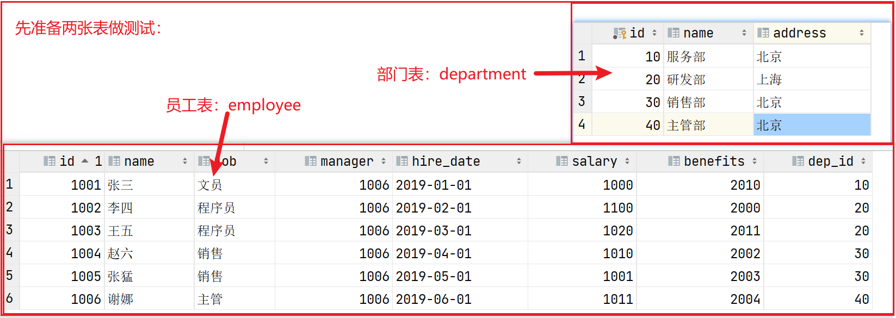

下载MySQL：https://dev.mysql.com/downloads/mysql/

安装MySQL：参照blog <a href="https://blog.csdn.net/drizzletowne/article/details/120896774">Linux下MySQL的安装</a>

MySQL5.7文档：[MySQL 5.7 Reference Manual](https://dev.mysql.com/doc/refman/5.7/en/)

MySQL8.0文档：[MySQL 8.0 Reference Manual](https://dev.mysql.com/doc/refman/8.0/en/)

# 一 SQL语言基础

**SQL概述和分类**:

SQL：Structured Query Language（结构化查询语言），是用来操作关系型数据库的一门语言。这是一个关系型数据库的通用操作语言，也成为标准SQL，也叫SQL-92。

数据库的生产厂商为了占有市场份额，都会在标准SQL的基础上扩展一些自己的东西以吸引用户。常用的关系型数据库：

| 关系型数据库 | 开发公司         | 使用语言 |
| ------------ | ---------------- | -------- |
| access       | 微软公司         | SQL      |
| SQL Server   | 微软公司         | T-SQL    |
| Oracle       | 甲骨文公司       | PL/SQL   |
| MySQL        | 被甲骨文公司收购 | MySQL    |

SQL 是一种标准化的语言，它允许你在数据库上执行操作，如创建项目，查询内容，更新内容， 并删除条目等操作 

**Create, Read, Update, and Delete 通常称为CRUD操作**


**SQL语句分类**：

| 分类                              | 说明                                               |
| --------------------------------- | -------------------------------------------------- |
| DDL（Data Definition Language）   | 数据定义语言，用来**定义数据库对象：库、表、列**   |
| DML（Data Manipulation Language） | 数据操作语言，用来定义数据库记录（数据）**增删改** |
| DQL（Data Query Language）        | 数据查询语言，用来 **查询记录（数据）**            |
| DCL（Data Control Language）      | 数据控制语言，用来定义**访问权限和安全级别**       |

​		

## 1. DCL用户权限

**创建、删除用户**: 

```SQL
# 创建用户
create user 用户名@指定ip identified by 密码;
# 例：（ % 表示任意IP均可登陆）
create user test123@localhost IDENTIFIED by '123123';
create user test456@10.4.10.18 IDENTIFIED by '123123';
create user test789@'%' IDENTIFIED by '123123';

# 删除用户
drop user 用户名@IP;
# 例：
drop user test123@localhost;
```

**用户权限设置**: 

```sql
# 用户授权：(给指定用户授予指定指定数据库指定权限)
grant 权限1,权限2,........ on 数据库名.*  to  用户名@IP; 
# 例：
grant select,insert,update,delete,create on student.* to 'user1'@'127.0.0.1';
grant all on *.* to 'user2'@'127.0.0.1';

# 用户权限查询：
show grants for 用户名@IP;
# 例：
show grants for 'root'@'%';

# 撤销用户权限：
revoke 权限1,权限2,........,权限n on 数据库名.* from 用户名@IP;
# 例：
REVOKE SELECT ON *.* FROM 'root'@'%';
```


## 2. DDL-数据库

**创建新的数据库**

```sql
create database 数据库名 set 编码方式 collate 排序规则
```

​	注：可以使用 `SHOW CHARACTER SET;` 查看所有的编码方式

```sql
# 创建名为mydb的数据库，并指定字符编码为utf8
create database mydb character set utf8;

# 创建名为mydb1的数据库，并指定字符编码为gbk, 排序规则为gbk_chinese_ci
create database mydb1 character set gbk collate gbk_chinese_ci;

# 查看所有的字符编码
show character set;
```


**查看、切换数据库**

```sql
# 查看当前数据库服务器中的所有数据库
show databases;

# 查看mydb1数据库的定义信息(字符集)
show create database mydb1;

# 查看当前使用的数据库
select database();

# 切换数据库到mydb数据库
use mydb;
```


**修改数据库（字符集）**

```sql
# 将mydb1的字符集修改为utf8mb4，排序规则改为utf8mb4_bin
alter database mydb1 character set utf8mb4 collate utf8mb4_bin;
```


**删除数据库**

```sql
drop database mydb1;
```


小结：

1、修改数据库**只能修改数据库的字符编码**

2、在MySQL中**utf字符编码之间没有横杆**： utf8


## 3. DDL-操作表

**新建、删除数据表** 

```sql
create table [if not exists] `表名`(
    `字段名` 数据类型 [null|not null] [default] [auto_increment] [primary key] [comment],
    `字段名` 数据类型 …
)[engine=存储引擎] [charset=字符编码]

drop table [if exists] 表1，表2,… 
```


```sql
# 1. 新建、删除数据表
create table if not exists stu1(
    id int auto_increment primary key comment '主键',
    name varchar(20) not null comment '姓名',
    `add` varchar(50) not null default '地址不详' comment '地址',
    score int comment '成绩'
    )engine=innodb charset=utf8mb4;

drop table if exists stu1;
```


**查看表信息** 

```sql
# 2. 查看表信息
# 2.1 显示所有表
show tables;

# 2.2 查看表结构
describe stu1;
desc stu1;

# 2.3 查看表的创建信息
show create table stu1;
```


**修改表信息** 

```sql
# 3.1 增加列： alter table 表名 add 新列名 新的数据类型
alter table stu1 add `age` int;

# 3.2 修改列
alter table stu1 modify name varchar(30);
alter table stu1 change `add` address varchar(100);

# 3.3 删除列
alter table stu1 drop `age`;

# 3.4 修改表名和字符集
alter table stu1 rename stu2;
alter table stu2 character set utf8mb4;
```


## 4. DML-增删改

**新增记录（数据）**：

```sql
insert into 表名 (字段名, 字段名,…) values (值1, 值1,…), (值1, 值1,…)  

# 如：
insert into stu values (6,'李白','男','四川'),(7,'杜甫','男','湖北');
```

- 插入字段名的顺序和数据表中字段名的顺序可以不一致， 但插入值的个数、顺序必须和插入字段名的个数、顺序一致

- 如果插入的值的顺序和个数与表字段的顺序个数一致，插入字段可以省略

- default关键字用来插入默认值，null用来插入空值.

  

**删除数据**：

```sql
delete from 表名 [where 条件]

# 例：
delete from stu where id=1;
```


 **更新数据**：

```sql
update 表名 set 字段 = 值 [where 条件]      

# 如：
update stu set sex='女' where stuname='berry';
```


## 5. MySQL运算符

**算术运算符**：MySQL 支持的算术运算符包括:

|    运算符    | 作用                          |
| :----------: | :---------------------------- |
|      +       | 加法                          |
|      -       | 减法                          |
|      *       | 乘法                          |
| /   或   DIV | 除法（如果除数为0，返回NULL） |
| %   或   MOD | 取余                          |


**比较运算符**：通过比较运算符，可以判断表中的哪些记录是符合条件的

|   比较运算符    | 描述                             |
| :-------------: | :------------------------------- |
|        =        | 等于                             |
|     <>,  !=     | 不等于                           |
|        >        | 大于                             |
|        <        | 小于                             |
|       <=        | 小于等于                         |
|       >=        | 大于等于                         |
|     BETWEEN     | 在两值之间（小于等于且大于等于） |
|   NOT BETWEEN   | 不在两值之间                     |
|       IN        | 在集合中                         |
|     NOT IN      | 不在集合中                       |
|       <=>       | 严格比较两个NULL值是否相等       |
|      LIKE       | 模糊匹配                         |
| REGEXP 或 RLIKE | 正则式匹配                       |
|     IS NULL     | 为空                             |
|   IS NOT NULL   | 不为空                           |


**逻辑运算符**：用来判断表达式的真假，真返回 1，假返回 0

| 运算符号  | 作用     |
| :-------- | :------- |
| NOT 或  ! | 逻辑非   |
| AND       | 逻辑与   |
| OR        | 逻辑或   |
| XOR       | 逻辑异或 |


## 6. DQL-数据查询

```sql
select [选项] 列名 [from 表名] [where 条件]  [group by 分组] [order by 排序][having 条件] [limit 限制];
```

**简单查询**: 

```SQL
# 查询所有列
SELECT * FROM stu;

# 查询指定列
SELECT sid, sname, age FROM stu;
```

**条件查询**: （查询时给出WHERE子句，在WHERE子句中可以使用上述运算符及关键字）

```sql
# 查询性别为女，并且年龄50以内的记录  (and)
SELECT * FROM stu WHERE gender='female' AND age<50;

# 查询学号为S_1001，或者姓名为liSi的记录 (or)
SELECT * FROM stu WHERE sid ='S_1001' OR sname='liSi';

# 查询学号为S_1001，S_1002，S_1003的记录 (in)
SELECT * FROM stu WHERE sid IN ('S_1001','S_1002','S_1003');

# 查询学号不是S_1001，S_1002，S_1003的记录 (not in)
SELECT * FROM tab_student WHERE sid NOT IN('S1001','S1002','S_1003');

# 查询年龄为null的记录 (is null)
SELECT * FROM stu WHERE age IS NULL;

# 查询年龄在20到40之间的学生记录 （and）
SELECT * FROM stu WHERE age>=20 AND age<=40;

# 查询性别非男的学生记录 （ <> 或 != 或 not）
SELECT * FROM stu WHERE gender!='male';
SELECT * FROM stu WHERE gender<>'male';
SELECT * FROM stu WHERE NOT gender='male';

#  查询姓名不为null的学生记录 （is null、is not null ）
SELECT * FROM stu WHERE NOT sname IS NULL;
SELECT * FROM stu WHERE sname IS NOT NULL;
```

**模糊查询**: 

通配符： _(下划线):  任意一个字符   &nbsp;     %：任意0~n个字符

```SQL
# 查询姓名由3个字构成的学生记录
SELECT * FROM stu WHERE sname LIKE '___';

# 查询姓名由5个字母构成，并且第5个字母为“i”的学生记录
SELECT * FROM stu WHERE sname LIKE '____i';

# 查询姓名中包含“a”字母的学生记录
SELECT * FROM stu WHERE sname LIKE '%a%';
```


**字段控制**: 

```sql
# distinct 去除重复记录
SELECT DISTINCT sal FROM emp;

# as 给列名添加别名(给列起别名时，可以省略AS关键字)
SELECT *, sal+IFNULL(comm,0) AS total FROM emp;
```


**排序** :（ asc 升序  desc 降序 默认是升序）

```SQL
# 年龄升序排序 （可以省略 asc ）
SELECT * FROM stu ORDER BY age ASC;
SELECT * FROM stu ORDER BY age;

# 多列排序：按月薪降序排序，如果月薪相同时，按编号升序排序
SELECT * FROM emp ORDER BY sal DESC, empno ASC;
```


## 7. DQL-聚合函数

- COUNT(列名)：统计指定列不为NULL的记录行数； 
- MAX(列名)：计算指定列的最大值，如果指定列是字符串类型，那么使用字符串排序运算； 
- MIN(列名)：计算指定列的最小值，如果指定列是字符串类型，那么使用字符串排序运算； 
- SUM(列名)：计算指定列的数值和，如果指定列类型不是数值类型，那么计算结果为0； 
- AVG(列名)：计算指定列的平均值，如果指定列类型不是数值类型，那么计算结果为0；

```SQL
# 查询emp表中记录数：（count）
SELECT COUNT(*) AS cnt FROM emp;
# 查询emp表中有佣金的人数：（么只统计comm列非NULL的行数），cnt为别名
SELECT COUNT(comm) cnt FROM emp;

# 统计月薪与佣金之和大于2500元的人数：
SELECT COUNT(*) AS cnt FROM emp WHERE sal+IFNULL(comm,0) > 2500;

# 查询有佣金的人数，以及有领导的人数：
SELECT COUNT(comm), COUNT(mgr)FROM emp;
```

```SQL
# 查询所有雇员月薪和：（SUM）
SELECT SUM(sal) FROM emp;
# 查询所有雇员月薪+佣金和：
SELECT SUM(sal+IFNULL(comm,0))FROM emp;

# 统计所有员工平均工资：（AVG）
SELECT AVG(sal) FROM emp;

# 查询最高工资和最低工资： （MAX和MIN）
SELECT MAX(sal), MIN(sal) FROM emp;
```


## 8. DQL-分组分页

分组查询时需要使用GROUP BY子句，**如果查询语句中有分组操作，则select后面能添加的只能是聚合函数和被分组的列名**

```sql
# 查询每个部门的部门编号和每个部门的工资和：
SELECT deptno, SUM(salary) FROM emp GROUP BY deptno;

# 查询每个部门的部门编号 以及每个部门的人数：
SELECT deptno,COUNT(*) FROM emp GROUP BY deptno;

# 查询每个部门的部门编号 以及每个部门工资大于1500的人数：
SELECT deptno,COUNT(*) FROM emp WHERE sal>1500 GROUP BY deptno;
```


**HAVING** 子句（having与where的区别）: 

- having是在分组后对数据进行过滤, where是在分组前对数据进行过滤  

  WHERE是对分组前记录的条件，如果某行记录没有满足WHERE子句的条件，那么这行记录不会参加分组；

  而HAVING是对分组后数据的约束

- having后面可以使用分组函数(统计函数)  where后面不可以使用分组函数

```SQL
# 查询工资总和大于9000的部门编号以及工资和：
SELECT deptno, SUM(sal) FROM emp
GROUP BY deptno
HAVING SUM(sal) > 9000;

# 统计出stu表中每个班级的男女生各多少人
select gradename,gender,count(*) from stu group by gradename,gender
```


**分页：LIMIT** 用来限定查询结果的起始行，以及总行数

```SQL
# 查询5行记录，起始行从0开始 （从0开始时，0可以省略）
SELECT * FROM emp LIMIT 0, 5;
SELECT * FROM emp LIMIT 5;

# 查询10行记录，起始行从5开始
SELECT* FROM emp LIMIT 5, 10;

# 分页查询通用写法：（pageIndex表示页数 pageSize表示每页显示条数）
limit (pageindex-1)*pagesize, pagesize;
```


总结：

查询语句书写顺序：`select – from- where- group by- having- order by-limit `

查询语句执行顺序：`from - where -group by -having - select - order by-limit`


## 9. 连表(多表)查询

- **合并结果集**:  `UNION（去重） 、 UNION ALL（不去重）` 

  合并结果集就是把两个select语句的查询结果（行）合并到一起，

  ```SQL
  SELECT * FROM t1 UNION SELECT * FROM t2；
  ```

- **连接查询**：求出多个表的笛卡尔积

  *笛卡尔积* ：`假设集合A={a,b}，集合B={0,1,2}，则两个集合的笛卡尔积为{(a,0),(a,1), (a,2),(b,0),(b,1),(b,2)}` 

  1. **内连接** `[INNER] JOIN ON` 

     ```SQL
     select 列名
     from 表1
     inner join 表2
     on 表1.列名=表2.列名  //外键列的关系
     where.....
     
     # 等价于：
     select 列名
     from 表1,表2
     where 表1.列名=表2.列名 and ...(其他条件)
     ```

  2. **外连接** `OUTER JOIN ON` 

     外连接的特点：查询出的结果存在不满足条件的可能 （主表和次表不能随意调换位置）

     主表数据全部显示，次表数据匹配显示，能匹配到的显示数据，匹配不成功的显示null，如：

     - **左外连接** `LEFT [OUTER] JOIN`  

       ```SQL
       select 列名 from 主表 left join 次表 on 主表.列名=次表.列名
       ```

     - **右外连接** `RIGHT [OUTER] JOIN`  

       ```SQL
       select 列名 from 次表 right join 主表 on 主表.列名=次表.列名
       ```

     - 全外连接 `FULL JOIN`（MySQL不支持） 

  3. 自然连接 `NATURAL JOIN`  ：一种特殊的等值连接

     要求两个关系表中进行连接的必须是相同的属性列（名字相同），无须添加连接条件，并且在结果中消除重复的属性列

     

- **子查询** ： 

  子查询就是嵌套查询, 一个select语句中包含另一个完整的select语句
  
  ```sql
  select * from employee where dep_id= (select id from department d where d.name='研发部');
  ```


例：（ [该案例的sql文件](detail/dep-emp.sql) ）



```SQL
# 1. 连表查询：生成笛卡尔积
select *
from department,
     employee;

# 连表查询：生成笛卡尔积，并用主外键关系做为条件来去除无用信息
select *
from employee,
     department
where department.dep_id = employee.dep_id;
```

```sql
# 上面查询结果会把两张表的所有列都查询出来，也许你不需要那么多列，这时可以指定要查询的列:
select e.name, e.job, e.salary, d.name
from employee as e,
     department as d
where d.id = e.dep_id;

# 2. 内连接: 上面的连接语句就是内连接，但它不是SQL标准中的查询方式
select e.name, e.job, e.salary, d.name
from employee as e
         inner join department as d
                    on d.id = e.dep_id;
```

```sql
# 外连接
# 左外连接，是先查询出左表（即以左表为主），然后查询右表，右表中满足条件的显示出来，不满足条件的显示NULL
select e.name, e.job, e.salary, d.name
from employee as e
         left outer join department as d
                         on d.id = e.dep_id;

# 右外连接， 先把右表中所有记录都查询出来，然后左表满足条件的显示，不满足显示NULL
select e.name, e.job, e.salary, d.name
from employee as e
         right outer join department as d
                          on d.id = e.dep_id;
```


# 二 MySQL理论

## 1. 数据完整性

- **数据库的完整性**：保证存放到数据库中的数据是有效的,

  => 在创建表时给表中添加约束

- **实体完整性**：标识每一行数据不重复

  实体：即表中的一行(一条记录)代表一个实体（entity）

  约束类型：*主键约束（primary key）*、 *唯一约束 (unique)* 、 *自动增长列 (auto_increment)* 

- **域完整性**：限制此单元格的数据正确

  域完整性约束：数据类型 、非空约束（not null）、 默认值约束(default）

- **引用完整性**：

  外键约束：FOREIGN KEY


常见约束：

| 约束            | 说明                               |
| --------------- | ---------------------------------- |
| null / not null | 字段是否可以为空                   |
| default         | 如果一个字段没有值，则使用默认值   |
| auto_increment  | 字段值从1开始，每次递增1，不会重复 |
| primary key     | 定义列为主键                       |
| unique          | 唯一键：不能重复，但可以为空       |
| comment         | 注释信息，用于                     |


语法示例：

**主键约束（primary key）**：

```SQL
# 1. 在 CREATE TABLE 语句中，通过 PRIMARY KEY 关键字来指定主键
<字段名> <数据类型> PRIMARY KEY [默认值]

# 2. 或者是在定义完所有字段之后指定主键：
[CONSTRAINT <约束名>] PRIMARY KEY [字段名]

# 3. 在创建表时设置联合主键（所谓的联合主键，就是这个主键是由一张表中多个字段组成的）
PRIMARY KEY [字段1，字段2，…,字段n]

# 4. 在修改表时添加主键约束
ALTER TABLE <数据表名> ADD PRIMARY KEY(<字段名>);

# 删除主键约束
ALTER TABLE <数据表名> DROP PRIMARY KEY;
```


**唯一约束 (unique)**：

```SQL
# 1. 在创建表时设置唯一约束
<字段名> <数据类型> UNIQUE

# 2. 在修改表时添加唯一约束
ALTER TABLE <数据表名> ADD CONSTRAINT <唯一约束名> UNIQUE(<列名>);

# 删除唯一约束
ALTER TABLE <表名> DROP INDEX <唯一约束名>;
```


**自动增长列 (auto_increment)**：

```SQL
# 1. 给字段添加 AUTO_INCREMENT 属性来实现主键自增长
字段名 数据类型 AUTO_INCREMENT

# 2. 指定自增字段初始值
CREATE TABLE tb_student2 (
    id INT NOT NULL AUTO_INCREMENT,
    name VARCHAR(20) NOT NULL,
    PRIMARY KEY(ID)
    )AUTO_INCREMENT=100;
```

- 默认情况下，AUTO_INCREMENT 的初始值是 1，每新增一条记录，字段值自动加 1。
- 一个表中只能有一个字段使用 AUTO_INCREMENT 约束，且该字段必须有唯一索引，以避免序号重复（即为主键或主键的一部分）
- AUTO_INCREMENT 约束的字段必须具备 NOT NULL 属性。
- AUTO_INCREMENT 约束的字段只能是整数类型（TINYINT、SMALLINT、INT、BIGINT 等）。
- AUTO_INCREMENT 约束字段的最大值受该字段的数据类型约束，如果达到上限，AUTO_INCREMENT 就会失效。


**外键约束（foreign key）**: 

```SQL
[CONSTRAINT <外键名>] FOREIGN KEY 字段名 [，字段名2，…] REFERENCES <主表名> 主键列1 [，主键列2，…]
#例：
constraint fk_score_sid foreign key(sid) references student(id) );

# 删除外键约束
ALTER TABLE <表名> DROP FOREIGN KEY <外键约束名>;
```


常用数据类型：

| 常用数据类型 | 大小（bytes） | 说明                                                         |
| :----------: | :-----------: | ------------------------------------------------------------ |
|     int      |       4       | 整型 （-2 147 483 648，2 147 483 647）±21亿                  |
|    double    |       8       | 浮点型，例如double(5,2)表示最多5位，其中必须有2位小数，即最大值为 999.99 |
|     char     |     0-255     | 固定长度字符串类型； `char(10)   'aaa' ` 占10个字符的位置    |
|   varchar    |    0-65535    | 可变长度字符串类型； `varchar(10)  'aaa'`占3字符             |
|     text     |    0-65535    | 字符串类型，比如小说信息                                     |
|     blob     |    0-65535    | 字节类型，保存文件信息(视频，音频，图片)                     |
|     date     |       3       | 日期类型，格式为：yyyy-MM-dd                                 |
|     time     |       3       | 时间类型，格式为：hh:mm:ss                                   |
|  timestamp   |       4       | 时间戳类型 yyyy-MM-dd hh:mm:ss 会自动赋值                    |
|   datetime   |       8       | 日期时间类型 yyyy-MM-dd hh:mm:ss                             |


## 2. Transaction

**事务（Transaction）**：是由一系列对系统中数据进⾏访问与更新的操作所组成的⼀个程序执行逻辑单元

```SQL
begin;          -- 开始，还可以使用下列语法：
start transaction; 
commit;         -- 提交：使得当前的修改确认
rollback;       -- 回滚：使得当前的修改被放弃
```

- **原⼦性（Atomicity）**：事务必须是⼀个原子的操作序列单元

  事务中包含的各项操作在⼀次执⾏过程中，只允许出现两种状态之一：（1）全部执行成功 （2）全部执行失败 

  事务开始后所有操作，要么全部做完，要么全部不做，不可能停滞在中间环节。

  事务执⾏过程中出错， 会回滚到事务开始前的状态，所有的操作就像没有发⽣一样。

  也就是说事务是⼀个不可分割的整体，就像化学中学过的原子，是物质构成的基本单位。

- **⼀致性（Consistency）** ：一个事务在执⾏之前和执行之后，数据库都必须处于⼀致性状态。

   比如：如果从A账户转账到B账户，不可能因为A账户扣了钱，⽽B账户没有加钱。 

- **隔离性（Isolation）** ：在并发环境中，并发的事务是互相隔离的。

  也就是说，不同的事务并发操作相同的数据时，每个事务都有各自完整的数据空间。 

  ⼀个事务内部的操作及使用的数据对其它并发事务是隔离的，并发执行的各个事务是不能互相干扰的。 

- **持久性（Duration）**：事务⼀旦提交后，数据库中的数据必须被永久的保存下来。

  即使服务器系统崩溃或服 务器宕机等故障。只要数据库重新启动，那么一定能够将其恢复到事务成功结束后的状态


**事务的并发问题** ：  -- 详情：[MySQL事务并发问题](https://blog.csdn.net/drizzletowne/article/details/120928779?app_version=4.17.0&code=app_1562916241&uLinkId=usr1mkqgl919blen)

- **脏读（Dirty Read）**：读取到了没有提交的数据

  事务A读取了事务B更新但未提交的数据（脏数据） 

  *脏数据*：是指事务对缓冲池中行记录的修改，并且还没有被提交（commit）

  脏读发生的条件是需要事务的隔离级别为 `READ UNCOMMITTED`

- **不可重复读**：在一个事务内两次读到的数据不一样的情况

  如：事务 A 多次读取同一数据，事务 B 在事务A 多次读取的 过程中，对数据做了更新并提交，导致事务A多次读取同一数据时，结果不一致。 

  *不可重复读和脏读的区别* 是：脏读是读到未提交的数据，而不可重复读读到的却是已经提交的数据

  一般来说，不可重复读的问题是可以接受的，因为其读到的是已经提交的数据，本身并不会带来很大的问题

- **幻读**：重复查询的过程中，数据发⽣了量的变化（行数多了或少了）如：

  1. 事务 A 里有一个条件查询的语句 `select * from student where age > 10`，假设查到了 10 行数据；
  2. 然后事务 B 往里面加入了一批数据 （或者删除了一些数据）
  3. 事务 A 再查的用条件查询语句查询的时候，发现查到了15条 （如果B执行了删除，那么将会少于10条数据）


**事务的隔离级别**：

❑ READ UNCOMMITTED （读未提交）：最低的隔离级别，也是唯一能读到脏数据的隔离级别

❑ READ COMMITTED（读已提交）：只能读取已经提交的数据、解决了脏读问题，但是还是解决不了可重复读问题

❑ REPEATABLE READ（可重复读）：保证在事务处理理过程中，多次读取同一个数据时，该数据的值是一致的

❑SERIALIZABLE （顺序读）：最严格的事务隔离级别、事务只能一个接一个地处理，不能并发


`InnoDB` offers all four transaction isolation levels described by the SQL:1992 standard: 

[`READ UNCOMMITTED`](https://dev.mysql.com/doc/refman/5.7/en/innodb-transaction-isolation-levels.html#isolevel_read-uncommitted), [`READ COMMITTED`](https://dev.mysql.com/doc/refman/5.7/en/innodb-transaction-isolation-levels.html#isolevel_read-committed), [`REPEATABLE READ`](https://dev.mysql.com/doc/refman/5.7/en/innodb-transaction-isolation-levels.html#isolevel_repeatable-read), and [`SERIALIZABLE`](https://dev.mysql.com/doc/refman/5.7/en/innodb-transaction-isolation-levels.html#isolevel_serializable). 

The default isolation level for `InnoDB` is [`REPEATABLE READ`](https://dev.mysql.com/doc/refman/5.7/en/innodb-transaction-isolation-levels.html#isolevel_repeatable-read).

InnoDB存储引擎默认支持的隔离级别是 `REPEATABLE READ`，但是与标准SQL不同的是，InnoDB存储引擎在`REPEATABLE READ`事务隔离级别下，使用 `Next-Key Lock ` 锁的算法，因此避免了幻读的产生


##  5. 三大范式

- 第一范式：无重复的列。

  当关系模式R的所有属性都不能在分解为更基本的数据单位时，称R是满足第一 范式的，简记为1NF。

  满足第一范式是关系模式规范化的最低要求，否则，将有很多基本操作在这样的 关系模式中实现不了。 

- 第二范式：属性完全依赖于主键 [ 消除部分子函数依赖 ]。

  如果关系模式R满足第一范式，并且R得所有 非主属性都完全依赖于R的每一个候选关键属性，称R满足第二范式，简记为2NF。

  第二范式（2NF）是 在第一范式（1NF）的基础上建立起来的，即满足第二范式（2NF）必须先满足第一范式（1NF）。

  第 二范式（2NF）要求数据库表中的每个实例或行必须可以被唯一地区分。

  为实现区分通常需要为表加上 一个列，以存储各个实例的唯一标识。这个唯一属性列被称为主关键字或主键、主码。 

- 第三范式：属性不依赖于其它非主属性 [ 消除传递依赖 ]。

  设R是一个满足第一范式条件的关系模式，X 是R的任意属性集，如果X非传递依赖于R的任意一个候选关键字，称R满足第三范式，简记为3NF. 满足 第三范式（3NF）必须先满足第二范式（2NF）。

  第三范式（3NF）要求一个数据库表中不包含已在其 它表中已包含的非主关键字信息。 

注：关系实质上是一张二维表，其中每一行是一个元组，每一列是一个属性 第二范式（2NF）和第三范式（3NF）的概念很容易混淆，区分它们的关键点在于，2NF：非主键列是 否完全依赖于主键，还是依赖于主键的一部分；3NF：非主键列是直接依赖于主键，还是直接依赖于非 主键列。


## 6. 数据库优化

- 对查询进行优化，要尽量避免全表扫描，首先应考虑在 where 及 order by 涉及的列上建立索引 

- 应避免在 where 子句中对字段进行 null 值判断，否则将导致引擎放弃使用索引而进行全表扫 描，

  如： select id from t where num is null 最好不要给数据库留NULL，尽可能的使用 NOT NULL填充数据库

  备注、描述、评论之类的可以设置为 NULL，其他的，最好不要使用NULL。 

- 应避免在 where 子句中使用 != 或 <> 操作符，否则引擎将放弃使用索引而进行全表扫描。 -

- 应避免在 where 子句中使用or来连接条件，如果一个字段有索引,一个字段没有索引，将导致引擎放弃使用索引而进行全表扫描

  ```SQL
  # 如：
  select id from t where num=10 or Name = 'admin'
  # 可以这样查询：
  select id from t where num = 10
  union all
  select id from t where Name = 'admin'
  ```

- in 和 not in 也要慎用，否则会导致全表扫描，如： 

  ```sql
  select id from t where num in(1,2,3) 
  ```

  对于连续的数值，能用 between 就不要用 in 了： 

  ```sql
  select id from t where num between 1 and 3 
  ```

  很多时候用 exists 代替 in 是一个好的选择

