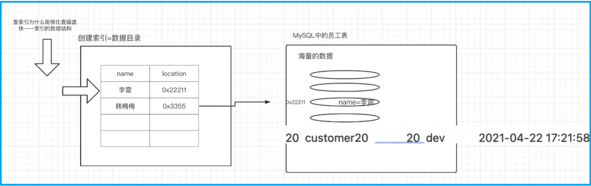

# 一 MySQL索引

在海量数据中进行查询某条记录的情景中，如何提升查询性能跟要查询的数据字段是否有索引有关系

- 没有使用索引的时候，数据的查询需要进行多次IO读写（全表扫描的过程），性能较差 

- 如果字段加了索引（相当于加了个目录），那么查询的性能就非常快!

  


数据和索引的存储位置：

对于mac系统默认在 `/usr/local/mysql` 文件夹中，对于win系统默认在：`c:/programdata/mysql` (隐藏文件夹). 

- lnnoDB存储引擎的表∶将索引和数据存放在同一个文件里。` *.ibd` 

- MyISAM存储引擎的表:索引和数据分开两个文件来存储。索引: ` *.MYI` ;  数据: `.MYD`  

  

## 1. 分类和创建

- 主键索引:主键自带索引效果，也就意味着通过主键来查询表中的记录，性能是非常好的

- 普通索引:为普通列创建的索引。创建索引的命令∶

  ```sql
  create index 索引名称 on 表名(列名) 
  create index idx_name on employees(name);
  ```

- 唯一索引∶就像是唯一列，列中的数据是唯一的。比普通索引的性能要好

  ```sql
  create unique index 索引名称 on 表名(列名)
  create unique index idx_unique_name on employees(name);
  ```

- 联合索引(组合索引)∶一次性为表中的多个字段一起创建索引。注意:一个联合索引建议不要超过5个列

  ```sql
  create index 索引名称 on 表(列1,列2,列3, ...)
  create index idx_name_age_position on employees(name, age, position);
  ```

- 全文索引：进行查询的时候，数据源可能来自于不同的字段或者不同的表。MyISAM存储引擎支持全文索引

  注意：在实际生产环境中，并不会使用MySQL提供的MyISAM存储引擎的全文索引功能来是实现全文查找。而是会使用第三方的搜索引擎中间件比如 `ElasticSearch`  (推荐) 、Solr。


## 2. 索引数据结构

使用索引查找数据性能很快，避免了全表扫描的多次磁盘O读写。但是使用索引实际上也需要在索引中查找数据，而且数据数量级是一样的，那么为什么索引就更快呢? 这就要探究索引使用的数据结构了


