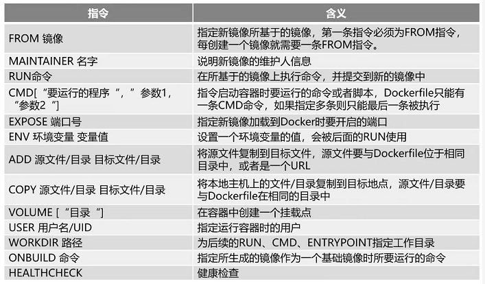

# 一 Install docker
## 1. Uninstall old versions

```shell
sudo yum remove docker \
                  docker-client \
                  docker-client-latest \
                  docker-common \
                  docker-latest \
                  docker-latest-logrotate \
                  docker-logrotate \
                  docker-engine
```

## 2.  install using the repository 
[docker 官网安装教程](https://docs.docker.com/engine/install/centos/)
```shell
#Set up the repository
sudo yum install -y yum-utils

sudo yum-config-manager \
    --add-repo \
    http://mirrors.aliyun.com/docker-ce/linux/centos/docker-ce.repo

#install
yum makecache fast && yum install -y docker-ce docker-ce-cli containerd.io && systemctl enable docker

#start
systemctl start docker     #启动
systemctl restart docker   #重启
systemctl enable docker    #自启动

docker version

sudo docker run hello-world
```

## 3. 配置阿里云镜像加速器

```shell
mkdir -p /etc/docker && tee /etc/docker/daemon.json <<-'EOF'
{
  "registry-mirrors": ["https://puqyip19.mirror.aliyuncs.com"]
}
EOF

systemctl daemon-reload && systemctl restart docker
```


# 二 Docker常用命令
[Docker官网—常用命令](https://docs.docker.com/engine/reference/commandline/docker/) —— [Docker Hub](https://hub.docker.com/)
```shell
docker version
docker info
docker xxx  --help
```

## 1. Images commands

```shell
docker images                            #查看本地主机上的所有镜像

#搜索镜像
docker search xxx                        #搜索镜像：如 mysql,redis......
docker search redis --filter=STARS=100   #过滤掉STARS小于100以下的

#下载镜像
docker pull xxx                          #下载镜像，默认为最新版本
docker pull mysql:5.7                    #也可指定docker官网可查询到的版本

#删除镜像
docker rmi -f imageID                    #根据镜像ID删除镜像
docker rmi -f $(docker images -aq)       #删除所有镜像
```


## 2. Containers commands

```shell
docker pull centos                       #要创建容器，必须先下载镜像
docker ps                                #查看运行中的容器（-a查看全部，-q只显示id）

#创建一个新的容器并运行一个命令
docker run xxx
docker run -it centos /bin/bash          #启动并进入容器（使用exit停止并退出，也可以使用Ctrl+P+Q不停止退出）
docker run -d centos                     #【问题】：发现centos停止了！？（原因：docker容器使用后天运行必须要有一个前台进程）

#启动和停止
docker start   container_id              #启动容器
docker stop    container_id              #停止正在运行的容器
docker kill    container_id              #强制停止正在运行的容器
docker restart container_id              #重启容器

#删除容器
docker rm 86fe3bcb173e                   #删除指定id的容器（不能删除正在运行的容器，如需强制删除需添加-f）
docker rm -f $(docker ps -aq)            #删除全部容器
```

## 3. Others commands

```shell
docker logs                              #日志
docker top container_id                  #查看指定容器中的进程信息
docker inspect NAME|ID                   #获取容器/镜像的元数据

docker exec -it container_id /bin/bash   #进入运行的容器中执行命令
docker attach -it container_id           #连接到正在运行中的容器
```


## 4. Docker常用镜像安装

**1. MySql**

```shell
#下载镜像(指定版本)
docker pull mysql:5.7

#创建实例并启动mysql
docker run -p 3306:3306 --name mysql --restart=always --privileged=true \
-v /data/mysql/log:/var/log/mysql \
-v /data/mysql/data:/var/lib/mysql \
-v /data/mysql/conf:/etc/mysql \
-e MYSQL_ROOT_PASSWORD=root \
-d mysql:5.7

docker run -p 3306:3306 --name mysql8 --restart=always --privileged=true \
-v /data/mysql/log:/var/log/mysql \
-v /data/mysql/data:/var/lib/mysql \
-v /data/mysql/conf:/etc/mysql \
-e MYSQL_ROOT_PASSWORD=root \
-d mysql:8.0

#创建mysql的配置文件
cat > /data/mysql/conf/mysql.conf << EOF
[client]
default-character-set=utf8
[mysql]
default-character-set=utf8
[mysqld]
init_connect='SET collation_connection=utf8_unicode_cli'
init_connect='SET NAMES utf8'
character-set-server=utf8
collation-server=utf8_unicode_ci
skip-character-set-client-handshark
skip-name-resolve
secure_file_priv=/var/lib/mysql
EOF

docker restart mysql                    #修改完要重启mysql
docker exec -it mysql /bin/bash         #进入mysql
```

```shell
#启动两个mysql
docker run -p 3307:3306 --name mysql_gmall \
-v /data/mysql_gmall/log:/var/log/mysql \
-v /data/mysql_gmall/data:/var/lib/mysql \
-v /data/mysql_gmall/conf:/etc/mysql \
-e MYSQL_ROOT_PASSWORD=root \
-d mysql:5.7
```

**2. Redis**

```shell
#下载镜像
docker pull redis

##创建实例并启动redis
mkdir -p /data/redis/conf && touch /data/redis/conf/redis.conf

docker run -p 6379:6379 --name redis --restart=always \
 -v /data/redis/conf/redis.conf:/etc/redis/redis.conf \
 -v /data/redis/data:/data \
 -d redis redis-server /etc/redis/redis.conf


#配置（持久化）
cat > /data/redis/conf/redis.conf << EOF
appendonly yes
EOF

docker restart redis                    #修改完要重启redis
```

```shell
#测试持久化配置是否生效
docker exec -it redis redis-cli
>set name alice                     # ok
>get name                           # "alice"
>exit

docker restart redis
docker exec -it redis redis-cli
>get name                           # "alice"   成功保存到硬盘，重启数据依旧存在
>exit
```

**3. nacos**
注意服务器内存不足，启动后内存溢出问题（单机standalone模式默认服务器堆大小512M）[nacos官方文档](https://nacos.io/zh-cn/docs/what-is-nacos.html)

```shell
docker pull nacos/nacos-server

# 创建本地的映射文件：custom.properties
mkdir -p /data/nacos/{init.d,logs} && touch /data/nacos/init.d/custom.properties

cat > /data/nacos/init.d/custom.properties << EOF
management.endpoints.web.exposure.include=*
EOF
```

创建数据库 `nacos_config` :  创建nacos数据库后，然后执行下面的Sql 。 [nacos官网的Sql](https://github.com/alibaba/nacos/blob/master/config/src/main/resources/META-INF/nacos-db.sql)

```shell
# 创建容器并启动(开机自启动)
docker run -d -p 8848:8848 --name nacos --restart always \
-e MODE=standalone \
-e PREFER_HOST_MODE=ip \
-e SPRING_DATASOURCE_PLATFORM=mysql \
-e MYSQL_SERVICE_HOST=192.168.16.128 \
-e MYSQL_SERVICE_PORT=3306 \
-e MYSQL_SERVICE_DB_NAME=nacos_config \
-e MYSQL_SERVICE_USER=root \
-e MYSQL_SERVICE_PASSWORD=root \
-e MYSQL_DATABASE_NUM=1 \
-v /data/nacos/init.d/custom.properties:/home/nacos/init.d/custom.properties \
-v /data/nacos/logs:/home/nacos/logs \
nacos/nacos-server

docker ps
```

**4. Zookeeper**
```shell
docker pull zookeeper:3.4.13

docker run -p 2181:2181 --name zookeeper --restart=always \
-v /mydata/zookeeper/data:/data \
-d zookeeper:3.4.13
```


# 三 Dockerfile构建镜像

 [dockerfile-instructions](https://docs.docker.com/develop/develop-images/dockerfile_best-practices/#dockerfile-instructions) &nbsp; &nbsp;  [菜鸟教程](https://www.runoob.com/docker/docker-dockerfile.html)



# 四 Docker Compose

[Get started with Docker Compose](https://docs.docker.com/compose/gettingstarted/) &nbsp; [You can use Docker Compose to easily run WordPress](https://docs.docker.com/samples/wordpress/) &nbsp;  [菜鸟教程](https://www.runoob.com/docker/docker-compose.html) &nbsp; 

[install-compose：](https://docs.docker.com/compose/install/#install-compose)

```shell
#To install a different version of Compose, substitute 1.29.2 with the version of Compose you want to use
sudo curl -L "https://github.com/docker/compose/releases/download/1.29.2/docker-compose-$(uname -s)-$(uname -m)" -o /usr/local/bin/docker-compose

sudo chmod +x /usr/local/bin/docker-compose
docker-compose --version                          #Test the installation


#To uninstall Docker Compose if you installed using curl:
sudo rm /usr/local/bin/docker-compose
```
