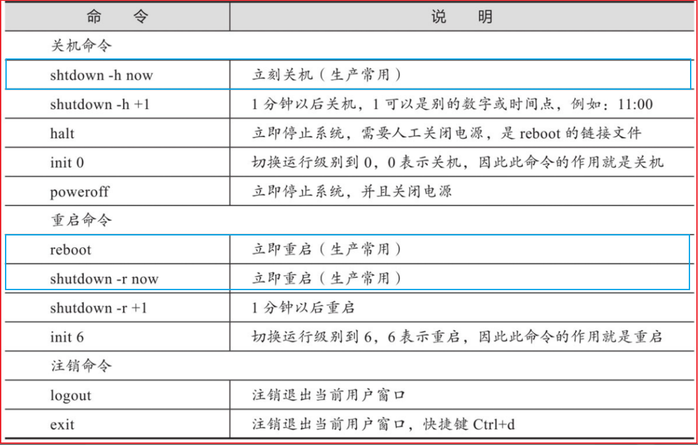

# 一 Linux基础命令

## 1. 命令行提示符

Linux命令行结尾的提示符有 “#” 和 “$” 两种不同的符号

```shell
[root@hostname ~]#        # <==这是超级管理员root用户对应的命令行。
[hostname@hostname ~]$    # <==这是普通用户oldboy对应的命令行。
```

> 命令行提示符@前面的字符代表当前登录的用户（可用whoami查询）
>
> @后面的为主机名（可用hostname查询）

<br/>

Linux命令提示符由PS1环境变量控制

```shell
set|grep PS1            # 注意PS要大写

> PS1='[\u@\h \W]\$ '   # 可以通过全局配置文件/etc/bashrc或/etc/profile进行按需配置和调整
```


<br/>


## 2. 查看命令帮助

<span style="font:normal bold 25px '宋体',sans-serif; color:blue"> 使用 man 或 --help 获取命令帮助信息</span>：

man命令是Linux系统中最核心的命令之一，因为通过它可以查看其他Linux命令的使用信息。

当然了，man命令不仅可以查看命令的使用帮助，还可以查看软件服务配置文件、系统调用、库函数等的帮助信息


```shell
man ls                        # 使用man 产看 ls 相关的信息

ls --help                     # --help 虽然有时这个输出很简单，但是相应地查看起来也会更方便
```

工作中建议结合使用，“命令--help”获取的是常用的帮助信息，“man命令”获取的是更多更复杂的帮助信息

<br/>


<span style="font:normal bold 25px '宋体',sans-serif; color:blue">使用help命令</span>：

在Linux系统里有一些特殊的命令，它们就是bash程序的内置命令，例如 `cd、history、read` 等，这些命令在系统目录里不存在真实的程序文件（存在于bash程序里），对于这部分命令，查看帮助的方法就是使用help命令

```shell
help cd            # 如果使用man cd，那么通常是查不到帮助信息的，而是会进入bash的帮助页面
```

<br/>


<span style="font:normal bold 25px '宋体',sans-serif; color:blue"> 使用info获取帮助信息</span>：

Linux系统中的info命令是一个查看程序对应文档信息的命令，可以作为man及help命令的帮助补充，不过一般在企业运维工作中，很少会有机会需要使用info去查询命令的使用帮助，因此，知道有这个命令就可以了，普通读者无需关注太多。使用info命令查看命令帮助的语法操作和man类似


<br/>


## 3. 关机重启注销

<span style="font:normal bold 25px '宋体',sans-serif; color:blue">重启或关机命令：shutdown </span>：

shutdown是一个用来安全关闭或重启Linux系统的命令，系统在关闭之前会通知所有的登录用户，系统即将关闭，此时所有的新用户都不可以登录，与shutdown功能类似的命令还有init、halt、poweroff、reboot。

1）注意shutdown命令和后面的选项之间至少要有一个空格。

2）通常情况下，我们执行的shutdown命令为 `shutdown -h now` 或 `shutdown -r now`。


> shutdown命令的工作过程就是当用户执行了对应参数并附带关机时间的命令之后，
>
> 通知所有用户即将关机的信息，并且在这个时间段内禁止新用户登录，
>
> 仅当到了指定的关机时间时，shutdown命令才会根据所接收的参数选项，发送请求给系统的init进程，请求将系统调整到对应参数的状态（例如-h参数），系统关机状态实际上对应的是Linux系统里的运行级别0。
>
> 和系统关机相关的运行级别有：0（关机运行级别）-halt，6（重启运行级别）-reboot，更多相关内容可查看/etc/inittab文件。


<br/>

<span style="font:normal bold 25px '宋体',sans-serif; color:blue">关机与重启命令：halt/poweroff/reboot</span>：

从RedHat或CentOS 6开始，你会发现halt、poweroff、reboot这三个命令对应的都是同一个man帮助文档，而halt和poweroff命令是reboot命令的链接文件，通常情况下，我们执行这三个命令时都不带任何参数。

> 为什么halt、poweroff命令是reboot命令的链接文件，但是分别执行命令后效果不一样呢？
>
> 查看一下reboot命令的man帮助，可以发现reboot命令有2个参数--halt和--power-off，作用分别和halt、poweroff命令一样。

<br/>




<br/>


# 二 Linux常用命令

linux查看cpu、内存、版本信息

```shell
# 查看CPU信息
cat /proc/cpuinfo | grep name | cut -f2 -d: | uniq -c 
cat /proc/cpuinfo | grep physical | uniq -c 


getconf LONG_BIT   
#32 (说明当前CPU运行在32bit模式下, 但不代表CPU不支持64bit) 

cat /proc/cpuinfo | grep flags | grep ' lm ' | wc -l  
# 8 (结果大于0, 说明支持64bit计算. lm指long mode, 支持lm则是64bit) 


dmidecode | grep "Product Name"    # 查看机器型号 

lsb_release -a  # 查看操作系统版本


# 查看内存信息
free
cat /proc/meminfo  # 查看详细内存信息 

```


## 1. 用户管理


## 2. 文件和目录

ls 命令是Linux下最常用的指令之一。

ls命令为英文单词 list 的缩写，正如英文单词 list 的意思，其功能是列出指定目录下的内容及其相关属性信息

**常用参数：**

| 常用参数 | 参数说明                                         |
| :------: | ------------------------------------------------ |
|    -a    | 显示所有文件及目录 (包括以“.”开头的隐藏文件)     |
|    -l    | 使用长格式列出文件及目录信息                     |
|    -r    | 将文件以相反次序显示(默认依英文字母次序)         |
|    -t    | 根据最后的修改时间排序                           |
|    -A    | 同 -a ，但不列出 “.” (当前目录) 及 “..” (父目录) |
|    -S    | 根据文件大小排序                                 |
|    -R    | 递归列出所有子目录                               |

<br/>


<span style="font:normal bold 25px '宋体',sans-serif; color:blue"> pwd：显示当前所在的位置</span> ：

```shell
pwd命令是 “print working directory” 中每个单词的首字母缩写，其功能是显示当前工作目录的绝对路径。

在实际工作中，我们在命令行操作命令时，经常会在各个目录路径之间进行切换，此时可使用pwd命令快速查看当前我们所在的目录路径。
```


<br>


<span style="font:normal bold 25px '宋体',sans-serif; color:blue">cd：切换目录</span>：

```shell
# cd命令是 “change directory” 中每个单词的首字母缩写，其功能是从当前工作目录切换到指定的工作目录。

cd -                 # 返回当前用户上一次所在的目录
cd ..                # 切换到当前目录的上一级目录
cd ~                 # 进入当前用户的家目录
```


<br/>


<span style="font:normal bold 25px '宋体',sans-serif; color:blue">mkdir：创建目录</span>：

```shell
# mkdir命令是“make directories”中每个单词的粗体字母组合而成，其功能是创建目录，
# 默认情况下，如果要创建的目录已存在，则会提示此文件已存在；而不会继续创建目录。

mkdir dir1 dir2                # mkdir命令可以同时创建多个目录


# 使用-p参数递归创建目录, 加-v参数显示创建目录的过程(其实这个-v没有什么实际用途)
mkdir -p dir/test
mkdir -pv dir/test
```

使用mkdir创建多级目录时，建议直接使用-p参数，可以避免出现“No such file or directory”这样没有文件或目录的报错了，不会影响已存在的目录。

<br/>

```shell
# 同时创建多个目录及多级子目录

mkdir -pv dir/{dir_1, dir_2}/{dir_a, dir_b}

```


<br/>


<font color=blue size=4>


<br/>


## 3. 文件权限

<br/>


<br/>

## 4. 压缩和解压

<br/>


<br/>


## 5. 网络操作

<br/><br/>


<br/>


## 6. 软件安装


<br/>


<br/>


## 7. 进程管理


<br/>


<br/>


# 三 Vim


# 四 虚拟机

## 1. vagrant

**virtualbox + vagrant 安装虚拟机**：

1. 下载安装 [Virtual box](https://www.virtualbox.org/) 的`主程序`和`拓展包`，安装后修改虚拟机存放位置（需要cpu开启虚拟化）
2. 下载安装 [Vagrant](https://www.vagrantup.com/) （ Vagrant 是没有图形界面的，安装程序会自动把安装路径加入到 PATH 环境变量 ）

```
vagrant version
```

- 配置vagrant (虚拟机镜像文件存储目录，默认为：C:\Users\用户名\.vagrant.d)  —— `VAGRANT_HOME`


3. 下载虚拟机镜像
使用 Vagrant 创建虚机时，需要指定一个镜像，也就是 box。开始这个 box 不存在，所以 Vagrant 会先从网上（[镜像网站](https://app.vagrantup.com/boxes/search)）下载，然后缓存在本地目录中。但默认下载往往会比较慢，我们可以自己下载镜像文件。常用的两个 Linux 操作系统镜像的下载地址：
- CentOS [官网下载](http://cloud.centos.org/centos/) ，[CentOS-7.box （点击下载）](http://cloud.centos.org/centos/7/vagrant/x86_64/images/CentOS-7.box) 列表中有一个 vagrant 目录，选择其中的 .box 后缀的文件下载即可。
- Ubuntu [官网下载](http://cloud-images.ubuntu.com/) ，[清华大学镜像站下载](https://mirror.tuna.tsinghua.edu.cn/ubuntu-cloud-images/) ，同样选择针对 vagrant 的 .box 文件即可。


    **添加 box**：接下来我们需要将下载后的 .box 文件添加到 vagrant 中：

```shell
#如果这是第一次运行，此时 VAGRANT_HOME 目录下会自动生成若干的文件和文件夹，其中有一个 boxes 文件夹，这就是要存放 box 文件的地方。
vagrant box list

#执行 vagrant box add 命令添加 box: (命令后面跟着的是镜像文件的路径，通过 --name centos-7 为这个 box 指定名字)
vagrant box add E:\Package\VM\VirtualBox\CentOS-7.box --name centos-7

vagrant box list        #再次查询，可以看到有了一个 box
```


4. Vagrant新建虚拟机

```shell
#先进入vagrant工作目录（Vagrantfile所在的目录）再执行命令
vagrant init centos-7
#首次执行会先安装再启动，之后就是启动的功能（注意要在Vagrantfile所在的目录执行）
vagrant up
```
```shell
# 常用命令
vagrant status         #查看虚拟机状态
vagrant ssh            #以 vagrant 用户直接登入虚拟机中，使用 exit; 退出

vagrant halt           #关闭虚拟机
vagrant suspend        #暂停虚拟机
vagrant resume         #恢复虚拟机
vagrant reload         #重载虚拟机(可能会重启失败，需要重启宿主机才能开机虚拟机)
vagrant destroy        #删除虚拟机
```

5. 配置私有网络
上述创建的虚拟机网络默认使用的是 `网络地址转换（NAT）+ 端口转发` 的方式，我们需要修改 `Vagrantfile`，为虚拟机设置指定的私有网络地址：

```shell
#取消改行的注释，根据下图宿主机的IP地址，修改前三段地址一致即可
config.vm.network "private_network", ip: "192.168.56.10"
```

```
ipconfig
```


```shell
#修改Vagrantfile文件后，需要重启虚拟机，若重启失败可删除重装，先修改Vagrantfile，再vagrant up
vagrant reload
```

6. 更改虚拟机配置（[Provider配置](https://www.vagrantup.com/docs/providers/virtualbox/configuration)）

```shell
config.vm.provider "virtualbox" do |v|
v.memory = 4096
v.cpus = 4
end
```
> 【注意】5、6 两步骤修改后可能会导致虚拟机无法启动，可在安装前先修改好Vagrantfile文件。系统用户密码均为 ：vagrant

<br/>


## 2. VMware

**（1）设置静态网络IP**：

    VMware 点击 编辑 ——> 虚拟网络编辑器 (如图：)


```shell
ip addr
vi /etc/sysconfig/network-scripts/ifcfg-ens33

service network restart 
```


<br/>

**（2）设置虚拟机自启动**：

1. 创建启动、关闭脚本

```bash
# 在系统的某个安静的盘中创建一个vm_start.bat文件，然后使用编辑器打开。写入: 
"C:\Program Files (x86)\VMware\VMware Workstation\vmrun.exe" start "D:\VirtualMachines\DevMachines\DevMachines.vmx" nogui

# 再次创建一个vm_stop.bat文件
"C:\Program Files (x86)\VMware\VMware Workstation\vmrun.exe" stop "D:\VirtualMachines\DevMachines\DevMachines.vmx"

#测试运行文件: 双击启动文件vm_start.bat，如果弹出dos窗口且虚拟机启动则无误,双击停止文件vm_stop.bat，如果弹出dos窗口且虚拟机停止则无误
```

<br/>

2. 添加到自启动任务

`Win+ R`  -> `gpedit.msc` -> 用户配置 -> windows设置 -> 鼠标双击脚本(登录/注销) -> 鼠标双击“登录”或“注销”分别添加启动、关闭脚本


【Q】主机访问不到虚拟机的服务的解决办法

```shell
firewall-cmd --query-port=9200/tcp                           #查看端口号是否开启,如果是no，就说明没有开放

firewall-cmd --zone=public --add-port=6379/tcp --permanent   #开通6379端口(redis)
firewall-cmd --zone=public --add-port=8848/tcp --permanent   #开通8848端口(nacos)
firewall-cmd --zone=public --add-port=3306/tcp --permanent   #开通3306端口(mysql)

firewall-cmd --reload                                        #重启防火墙，端口正常开启
systemctl restart docker                                     #如果是docker容器的化则要重启下docker服务 
```