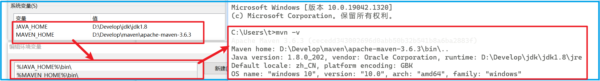
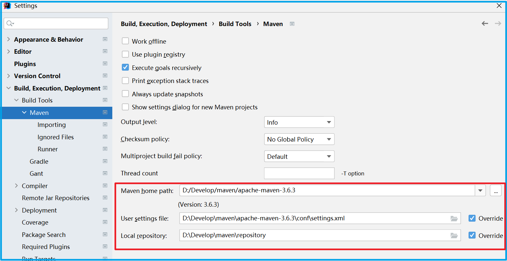

## 1. 下载安装

官网下载地址：https://maven.apache.org/download.cgi

Maven仓库地址：https://mvnrepository.com/


安装：解压到指定目录即可，注意maven需要配置 `JAVA_HOME` 和 `MAVEN_HOME` ：




## 2. 仓库配置

修改  `conf` 目录下的 `settings.xml` ：

```xml
<!-- 配置本地仓库地址 （settings.xml） -->
<localRepository>D:\Develop\maven\repository</localRepository>
```

```xml
<!-- 配置远程（中央）仓库地址 （settings.xml） -->
<mirror>
    <id>aliyunmaven</id>
    <name>aliyun maven</name>
    <url>http://maven.aliyun.com/nexus/content/groups/public/</url>
    <mirrorOf>central</mirrorOf>
</mirror>
```

阿里云云效 Maven地址：https://developer.aliyun.com/mvn/guide


IDEA中的maven配置：




## 3. 

