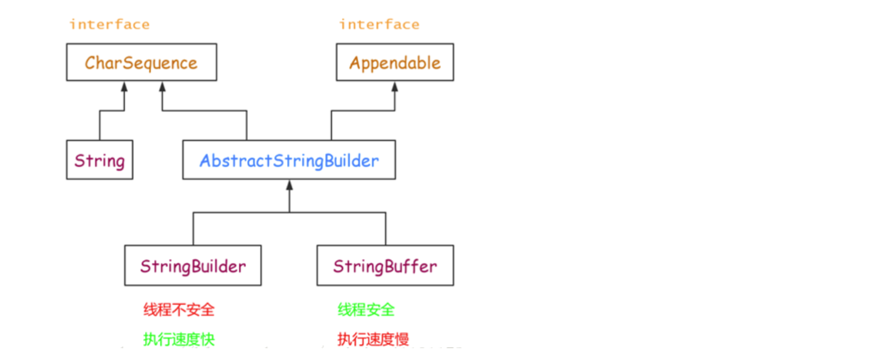
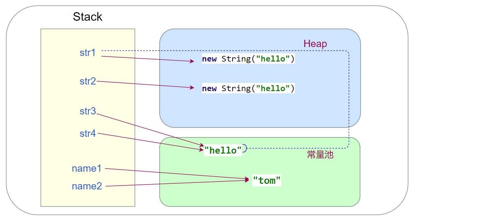
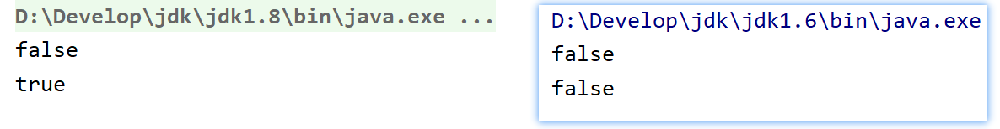
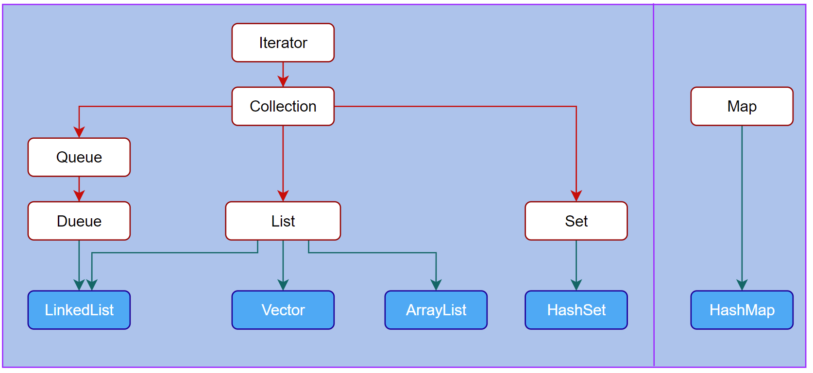
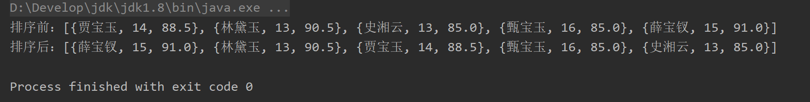

# 一 字符串

## 1. String类

 String类位于 java.lang 包中，在 Java 中每个双引号定义的字符串都是一个 String 类的对象。

**String对象不可变**：对象一旦被创建后，对象所有的状态及属性在其生命周期内不会发生任何变化，不可变的原因与本质：


1. String 类的构造方法：

   ```java
   String()                        // 初始化一个新创建的 String对象，表示一个空字符序列   
   String(String original)         // 初始化一个新创建的 String对象，新创建的字符串是该参数字符串的副本
   String(char[] value)            // 分配一个新的字符串，将参数中的字符数组元素全部复制变为字符串
   String(char[] value,int offset,int count)  //offset是数组第一个字符的索引，count指定子数组的长度
   ```

2. String和int的相互转换

   ```java
   // String 字符串转整型 int 有以下两种方式：
   Integer.parseInt(str)
   Integer.valueOf(str).intValue()
       
   // int转换为String
   String s = String.valueOf(i);
   String s = Integer.toString(i);
   String s = "" + i;
   ```

3. String常用方法

   - length() ：获取字符串的长度

   - toLowerCase() ：将字符串中的所有字符全部转换成小写，而非字母的字符不受影响

   - toUpperCase() ：将字符串中的所有字符全部转换成大写，而非字母的字符不受影响

   - trim() ：去掉字符串中的首尾空格

   - substring(int beginIndex) ：提取从索引位置开始至结尾处的字符串部分

   - substring(int beginIndex，int endIndex) ：截取  [beginIndex，endIndex) 索引的字符串

     

4. String分割字符串

   ```java
   str.split(String sign)
   str.split(String sign,int limit)
   ```

   - sign 为指定的分割符，可以是任意字符串。

   - limit 表示分割后生成的字符串的限制个数，如果不指定，则表示不限制，直到将整个目标字符串完全分割为止。

   - 如果用“.”作为分隔的话，必须写成`String.split("\\.")`，这样才能正确的分隔开，不能用`String.split(".")`。

   - 如果用“|”作为分隔的话，必须写成`String.split("\\|")`，这样才能正确的分隔开，不能用`String.split("|")`。

   - 如果在一个字符串中有多个分隔符，可以用 `|` 作为连字符，比如：`"acount=? and uu =? or n=?"`，需要把三个都分隔出来，可以用`String.split("and|or")`。

     

5. 字符串查找

   - `indexOf() `方法用于返回字符（串）在指定字符串中首次出现的索引位置，如果能找到，则返回索引值，否则返回 -1
   - `lastIndexOf() `方法用于返回字符（串）在指定字符串中最后一次出现的索引位置，如果能找到则返回索引值，否则返回 -1
   - `charAt() `方法可以在字符串内根据指定的索引查找字符（字符串本质上是字符数组，因此它也有索引，索引从零开始）


6. 字符串的替换

   ```java
   replace(String oldChar, String newChar)         // 将目标字符串中的指定字符（串）替换成新的字符（串）
   replaceFirst(String regex, String replacement)  // 将目标字符串中匹配某正则表达式的第一个子字符串替换成新的字符串
   replaceAll(String regex, String replacement)    // 将目标字符串中匹配某正则表达式的所有子字符串替换成新的字符串
   ```

   

7. 字符串比较

   - `equals()` 方法将逐个地比较两个字符串的每个字符是否相同

     如果两个字符串具有相同的字符和长度，它返回 true，否则返回 false。( 区分大小写 )

   - `equalsIgnoreCase()` 方法的作用和语法与 equals() 方法完全相同，但是**不区分大小写**

   - `equals()` 方法和 `==` 运算符：

     - `==`运算符比较两个对象引用看它们是否引用相同的实例
     - equals() 原本也是比较引用是否相同，但String类重写了该方法，故而直接比较字符串对象中的字符

   - `compareTo() `方法用于按字典顺序比较两个字符串的大小，该比较是基于字符串各个字符的 Unicode 值

   ```java
   String str1 = new String("hello");
   String str2 = new String("hello");
   
   System.out.println(str1.equals(str2));    // true
   System.out.println(str1 == str2);         // false
   
   System.out.println("a".compareTo("A"));   // 32 ( 表示a在A之后32个字符序列 )
   ```

   

8. 字符串拼接

   String 字符串虽然是不可变字符串，但也可以进行拼接只是会产生一个新的对象。String 字符串拼接可以使用“+”运算符或 String 的 concat(String str) 方法。“+”运算符优势是可以连接任何类型数据拼接成为字符串，而 concat 方法只能拼接 String 类型字符串。

   ```java
   String str = "hello ";
   System.out.println(str + 99);                // hello 99
   System.out.println(str.concat("world"));     // hello world
   ```

   String被声明为 final class，是不可变字符串。因为它的不可变性，所以拼接字符串时候会产生很多无用的中间对象，如果频繁的进行这样的操作对性能有所影响。用+的方式效率最差，concat由于是内部机制实现，比+的方式好了不少（每次调用contact()方法就是一次数组的拷贝）虽然在内存中是处理都是原子性操作，速度非常快，但是，最后的return语句会创建一个**新String对象**，限制了concat方法的速度。

   

   **需要进行大量字符串拼接时，一定要使用StringBuffer或StringBuilder的append方法**：

   StringBuffer和StringBuilder的append方法都继承自AbstractStringBuilder，整个逻辑都只做**字符数组**的加长，拷贝，到最后也不会创建新的String对象，所以速度很快，完成拼接处理后在程序中用strBuffer.toString()来得到最终的字符串


## 2. StringBuilder

Java 提供了 String 类来创建和操作字符串。String 类是不可变类，即一旦一个 String 对象被创建以后，包含在这个对象中的字符序列是不可改变的，直至这个对象被销毁。因此Java 提供了两个可变字符串类 StringBuffer 和 StringBuilder，中文翻译为“字符串缓冲区”。StringBuilder 类是 JDK 1.5 新增的类，它也代表可变字符串对象。


实际上，StringBuilder 和 StringBuffer 功能基本相似，方法也差不多。不同的是，StringBuffer 是线程安全的，而 StringBuilder 则没有实现线程安全功能，所以性能略高。因此在通常情况下，如果需要创建一个内容可变的字符串对象，则应该优先考虑使用 StringBuilder 类。



- 操作少量的数据使用 String
- 单线程操作大量数据使用 StringBuilder
- 多线程操作大量数据使用 StringBuffer

```java
// 使用 StringBuilder 拼接字符串, 反转字符串
StringBuilder stringBuilder = new StringBuilder();
stringBuilder.append("hello");
stringBuilder.append(" world");
System.out.println(stringBuilder.toString());            // hello world
System.out.println(stringBuilder.reverse().toString());  // dlrow olleh
```


## 3. 字符串常量池

由于String类型描述的字符串内容是常量不可改变，因此Java虚拟机将首次出现的字符串放入常量池中，若后续代码中出现了相同字符串内容则直接使用池中已有的字符串对象而无需申请内存及创建对象，从而提高了性能。

**String直接赋值和使用new的区别**：

- 直接赋值： 可能创建一个或者不创建对象
- 使用new： 可能创建一个或者两个对象，但一定会在heap（堆）中创建一个String对象

```java
public static void main(String[] args) {
    String name1 = "tom";
    String name2 = "tom";

    String str1 = new String("hello");
    String str2 = new String("hello");

    System.out.println(str1.equals(str2));   // true
    System.out.println(str1 == str2);        // false （String中"=="比较引用地址，equals比较具体值）

    String str3 = "hello";
    String str4 = str1.intern();
    System.out.println(str3 == str4);        // true
}
```



上例中的对象创建解释：

- name1：先检查` “tom”`在常量池中是否存在，不存在 → 创建 `“tom”`对象放入常量池，并将name1指向该地址
- name2：由于`“tom”`已存在于常量池中，name2直接指向该地址


- str1：new关键字一定会在heap中创建`"hello"`，同时会检查常量池中是否存在该对象，不存在 → 则在常量池中创建该对象

- str2：同样会在heap中创建`"hello"`，检查到常量池中是已存在该对象后结束

- str3：由于`"hello"`已存在于常量池中，str3直接指向该地址

- str4：检查常量池已存在这个对象，直接返回其引用

  

`intern()`：如果常量池中已经包含了这个String对象，那么直接返回这个对象。否则，就向常量中添加这个对象，并返回对它的引用

（注意这里从jdk1.7起，**复制的是该对象的引用**，参照）如下示例：

```java
public class Demo {
    public static void main(String[] args) {
        String s = new String("aaa");
        String s1 = s.intern();
        System.out.println(s == s1);   // false

        String str1 = new String("abc");
        String str2 = new String("ddd");
        String str3 = str1 + str2;
        System.out.println(str3 == str3.intern()); // jdk1.7起为true，之前为false
    }
}
```



注：通过new创建一个String对象时，会在创建的同时检查字符串常量池中是否存在该对象，不存在则加入该对象，此处没什么疑问，

关键在于：

- 该例中的字符串进行拼接时，并不会像new一个对象那样进行上述操作（即不会将‘abcddd’加入到常量池），此时 `str3` 指向一个堆中的对象，而当一个堆中的对象调用 `intern()` 方法时，从jdk1.7起由于方法区实现的改变，常量池转移到了堆中，成为了堆的一部分，而此处也不再是将该对象再加入常量池然后返回其引用，而是在常量池中加入其在堆中的引用， `intern()` 返回的也是该引用


**==与equals方法有什么区别**：

- == ,对于基本数据类型而言,比较的是内容,对于引用数据类型而言,比较的是引用变量,即所指向的地址
- equals方法是Object的方法,默认是比较2个对象的地址,若要比较内容,应当重写父类方法


# 二 Java泛型

Java 泛型（generics）是 JDK 5 中引入的一个新特性, 泛型提供了编译时类型安全检测机制，该机制允许开发者在编译时检测到非法的类型。泛型的本质是参数化类型，也就是说所操作的数据类型被指定为一个参数。在使用/调用时传入具体的类型（类型实参）。

Java采用类型擦除(Type erasure generics)的方式实现泛型。用大白话讲就是这个泛型只存在源码中，编译器将源码编译成字节码之时，就会把泛型『擦除』，所以字节码中并不存在泛型。注意 Java 泛型不支持基本数据类型。


## 1. 泛型类

```java
// 泛型类：（在实例化泛型类时，需要指明泛型类中的类型参数，并赋予泛型类属性相应类型的值）
public class ClassName<dataType1,dataType2,…>{
    private dataType1 propertyName1;
	private dataType2 propertyName2;
}

// 定义一个泛型类：
public class ClassName<T>{
    private T data;
    
    public T getData() {
    	return data;
    }
    public void setData(T data) {
    	this.data = data;
    }
}
```


## 2. 泛型接口

```java
// 泛型接口
public interface IntercaceName<T>{
	T getData();
}

// 实现接口时，可以选择指定泛型类型，也可以选择不指定
// 指定类型 如下：
public class Interface1 implements IntercaceName<String> {
    private String text;
    
    @Override
    public String getData() {
   	 return text;
    }
}

// 不指定类型：
public class Interface1<T> implements IntercaceName<T> {
    private T data;
    
    @Override
    public T getData() {
    	return data;
    }
}
```


## 3. 泛型方法

```java
// 泛型方法，例如: 
public static <T> List find(Class<T> cs,int userId){
    
}
```

- 是否拥有泛型方法，与其所在的类是不是泛型没有关系
- 如果 static 方法需要使用泛型能力，就必须使其成为泛型方法


## 4. 泛型限制

限制泛型可用类型

```java
class ClassName<T extends AnyClass>    // AnyClass 指某个接口或类
```

使用泛型限制后，泛型类的类型 必须实现或继承 AnyClass 这个接口或类。

或者说必须是 AnyClass类的子类 或 AnyClass接口的实现类。


```java
// 当没有使用 extends 关键字限制泛型类型时，其实是默认使用 Object 类作为泛型类型/
public class ClassName<T> {}
// 等同于：
public class ClassName<T extends Object> {}
```


## 5. 类型通配符

- ？表示不确定的 java 类型，通常用于泛型方法的调用代码和形参，不能用于定义类和泛型方法
- T (type) 表示具体的一个java类型，通常用于泛型类和泛型方法的定义
- K V (key value) 分别代表java键值中的Key Value
- E (element) 代表Element


上界通配符` < ? extends E>`：表示参数化的类型可能是所指定的类型，或者是此类型的子类。

- 如果传入的类型不是 E 或者 E 的子类，编译不成功
- 泛型中可以使用 E 的方法，否则需要强转成 E 才能使用

下界通配符 `< ? super E>`：表示参数化的类型可能是所指定的类型，或者是此类型的父类型，直至 Object


在编译之后程序会采取去泛型化的措施。也就是说Java中的泛型，只在编译阶段有效。在编译过程中，正确检验泛型结果后，会将泛型的相关信息擦出，并且在对象进入和离开方法的边界处添加类型检查和类型转换的方法。也就是说，泛型信息不会进入到运行时阶段。


# 三 Java集合

为了保存数量不确定的数据，以及保存具有映射关系的数据（也被称为关联数组），Java提供了集合类。集合类主要负责保存、盛装其他数据，因此集合类也被称为容器类。

- 集合类和数组不一样，数组元素既可以是基本类型的值，也可以是对象（实际上保存的是对象的引用变量），

- 而集合里只能保存对象（实际上只是保存对象的引用变量）

  

Java 集合类型分为 Collection 和 Map，它们是 Java 集合的根接口，下图为Collection 和 Map 的子接口及其常用实现类：



Java集合接口的作用：

| 接口名称   | 作  用                                                       |
| ---------- | ------------------------------------------------------------ |
| Iterator   | 集合的输出接口，主要用于遍历输出（即迭代访问）Collection 集合中的元素，Iterator 对象被称之为迭代器。迭代器接口是集合接口的父接口，实现类实现 Collection 时就必须实现 Iterator 接口。 |
| Collection | 是 List、Set 和 Queue 的父接口，是存放一组单值的最大接口。所谓的单值是指集合中的每个元素都是一个对象。一般很少直接使用此接口直接操作。 |
| Queue      | Queue 是 Java 提供的队列实现，有点类似于 List。              |
| Dueue      | 是 Queue 的一个子接口，为双向队列。                          |
| List       | 是最常用的接口。是有序集合，允许有相同的元素。使用 List 能够精确地控制每个元素插入的位置，用户能够使用索引（元素在 List 中的位置，类似于数组下标）来访问 List 中的元素，与数组类似。 |
| Set        | 不能包含重复的元素。                                         |
| Map        | 是存放一对值的最大接口，即接口中的每个元素都是一对，以 `key➡value` 的形式保存。 |

Collection中定义了单列集合(List和Set)通用的一些方法， 这些方法可用于操作所有的单列集合。方法如下： 

```java
public boolean add(E e)       // 把给定的对象添加到当前集合中 。 
public void clear()           // 清空集合中所有的元素。
public boolean remove(E e)    // 把给定的对象在当前集合中删除。 
public boolean contains(E e)  // 判断当前集合中是否包含给定的对象。 
public boolean isEmpty()      // 判断当前集合是否为空。 
public int size()             // 返回集合中元素的个数。 
public Object[] toArray()     // 把集合中的元素，存储到数组中。
```


Java集合实现类的作用：

| Class      | description                                                  |
| ---------- | ------------------------------------------------------------ |
| ArrayList  | 底层是数组结构实现，查询快、增删慢                           |
| LinkedList | 底层是链表结构实现，查询慢、增删快                           |
| Vector     | 相对于ArrayList来说，它是线程安全的，同时提供了指定扩容增量的构造方法 |
| HashSet    | 底层数据结构是哈希表, 无序，不包含重复元素（为优化査询速度而设计） |
| HsahMap    | 按哈希算法来存取键对象                                       |


## 1. ArrayList

ArrayList 类实现了可变数组的大小，存储在内的数据称为元素。它还提供了快速基于索引访问元素的方式，对尾部成员的增加和删除支持较好。

- ArrayList的默认构造函数会初始化一个空数组，第一次添加元素时才扩容至10（JDK8 中改为这种懒加载模式？）
- 建议开发中如果能知道数组大小，预先指定大小避免多次扩容、 复制数据


ArrayList类的常用方法：

| 方法名称                                    | 说明                                                         |
| ------------------------------------------- | ------------------------------------------------------------ |
| public boolean add(E e)                     | 添加过程中会自动扩容，返回结果一定为true                     |
| E get(int index)                            | 获取此集合中指定索引位置的元素，E 为集合中元素的数据类型     |
| int index(Object o)                         | 返回此集合中第一次出现指定元素的索引，如果此集合不包含该元 素，则返回 -1 |
| int lastIndexOf(Object o)                   | 返回此集合中最后一次出现指定元素的索引，如果此集合不包含该 元素，则返回 -1 |
| E set(int index, Eelement)                  | 将此集合中指定索引位置的元素修改为 element 参数指定的对象。 此方法返回此集合中指定索引位置的原元素 |
| List<E> subList(int fromlndex, int tolndex) | 返回一个新的集合，新集合中包含 fromlndex 和 tolndex 索引之间 的所有元素。包含 fromlndex 处的元素，不包含 tolndex 索引处的 元素 |

```java
public class ListDemo {
    public static void main(String[] args) {
        List list = new ArrayList();
        list.add("Java");
        list.add("c/c++");
        list.add("swift");

        System.out.println(list.size());                   //3
        System.out.println(list);                          //[Java, c/c++, swift]
		// 遍历列表
        for (int i = 0; i < list.size(); i++) {
            System.out.print(list.get(i)+" ");             //Java c/c++ swift
        }
        System.out.println("\n");

        System.out.println(list.remove(1));                // c/c++  移除并返回其值
        System.out.println(list.remove("Java"));           // true   返回是否执行成功的布尔值
        System.out.println(list);                          // [swift]
    }
}
```


## 2. LinkedList

LinkedList 类采用链表结构保存对象，这种结构的优点是便于向集合中插入或者删除元素。需要频繁向集合中插入和删除元素时，使用 LinkedList 类比 ArrayList 类效果高，但是 LinkedList 类随机访问元素的速度则相对较慢。这里的随机访问是指检索集合中特定索引位置的元素。


LinkedList 类除了包含 Collection 接口和 List 接口中的所有方法之外，还特别提供了下面的方法：

| 方法名称           | 说明                         |
| ------------------ | ---------------------------- |
| void addFirst(E e) | 将指定元素添加到此集合的开头 |
| void addLast(E e)  | 将指定元素添加到此集合的末尾 |
| E getFirst()       | 返回此集合的第一个元素       |
| E getLast()        | 返回此集合的最后一个元素     |
| E removeFirst()    | 删除此集合中的第一个元素     |
| E removeLast()     | 删除此集合中的最后一个元素   |


## 3. Vector

Vector 类实现了一个动态数组。和 ArrayList 很相似，但是两者是不同的：

- Vector 是同步访问的（线程安全的）
- Vector 还包含了许多传统的方法，这些方法不属于集合框架。


Vector 类的4种构造方法：

```java
Vector()                    // 默认大小为 10
Vector(int size)            // 指定大小
Vector(int size,int incr)   // 指定大小，并且增量用 incr 指定（增量表示每次增加的元素数目）
Vector(Collection c)        // 创建一个包含集合的Vector
```

当Vector容量不足以容纳全部元素时，Vector的容量会增加。**若容量增加系数 >0，则将容量的值增加“容量增加系数”；否则，将容量大小增加一倍。**


## 4. HashSet

Set 集合类似于一个罐子，程序可以依次把多个对象“丢进”Set 集合，而 Set 集合通常不能记住元素的添加顺序。也就是说 

- Set 集合中的对象不按特定的方式排序，只是简单地把对象加入集合。

- Set 集合中不能包含重复的对象，并且最多只允许包含一个 null 元素。

Set 实现了 Collection 接口，它主要有两个常用的实现类：HashSet 类和 TreeSet类。

- HashSet 是 Set 接口的典型实现，大多数时候使用 Set 集合时就是使用这个实现类。
- HashSet 是按照 Hash 算法来存储集合中的元素。因此具有很好的**存取和查找**性能。

```java
public class SetDemo {
    public static void main(String[] args) {
        Set set = new HashSet();
		// 向集合添加元素,（集合元素是无序且唯一的，插入等同于add）
        set.add("yellow");
        set.add("red");
        set.add("black");
        set.add("white");

        System.out.println(set);               //[red, white, yellow, black]
		// 使用迭代器遍历
        Iterator it = set.iterator();
        while (it.hasNext()){
            System.out.print(it.next()+" ");   //red white yellow black
        }
    }
}
```

当向 HashSet 集合中存入一个元素时：

- HashSet 会调用该对象的 hashCode() 方法来得到该对象的 hashCode 值
- 然后根据该 hashCode 值决定该对象在 HashSet 中的存储位置
- 如果有两个元素通过 equals() 方法比较返回的结果为 true，但它们的 hashCode 不相等，HashSet 将会把它们存储在不同的位置，依然可以添加成功。


## 5. TreeSet

TreeSet 类同时实现了 Set 接口和 SortedSet 接口。SortedSet 接口是 Set 接口的子接口，可以实现对集合进行自然排序，因此使用 TreeSet 类实现的 Set 接口默认情况下是自然排序的，这里的自然排序指的是升序排序。

- **TreeSet 只能对实现了 Comparable 接口的类对象进行排序**，因为 Comparable 接口中有一个 `compareTo(Object o)` 方法用于比较两个对象的大小。例如 `a.compareTo(b)`：

  - 如果 a 和 b 相等，则该方法返回 0；

  - 如果 a 大于 b，则该方法返回大于 0 的值；

  - 如果 a 小于 b，则该方法返回小于 0 的值。

- 在使用自然排序时只能向 TreeSet 集合中添加相同数据类型的对象，否则会抛出 ClassCastException 异常。

  

Comparable接口类对象的比较方式：

| 类                                                           | 比较方式                                  |
| ------------------------------------------------------------ | ----------------------------------------- |
| BigDecimal、Biglnteger、 Byte、Double、Float、Integer、Long 及 Short | 按数字大小比较                            |
| Character                                                    | 按字符的 Unicode 值的数字大小比较         |
| String                                                       | 按字符串中字符的 Unicode 值的数字大小比较 |


TreeSet 类除了实现 Collection 接口的所有方法之外，还提供了下列方法：

| 方法名称                                       | 说明                                                         |
| ---------------------------------------------- | ------------------------------------------------------------ |
| E first()                                      | 返回此集合中的第一个元素。其中，E 表示集合中元素的数据类型   |
| E last()                                       | 返回此集合中的最后一个元素                                   |
| E poolFirst()                                  | 获取并移除此集合中的第一个元素                               |
| E poolLast()                                   | 获取并移除此集合中的最后一个元素                             |
| SortedSet<E> subSet(E fromElement,E toElement) | 返回一个新的集合，新集合包含原集合中 fromElement 对象与 toElement 对象之间的所有对象。包含 fromElement 对象，不包含 toElement 对象 |
| SortedSet<E> headSet<E toElement〉             | 返回一个新的集合，新集合包含原集合中 toElement 对象之前的所有对象。 不包含 toElement 对象 |
| SortedSet<E> tailSet(E fromElement)            | 返回一个新的集合，新集合包含原集合中 fromElement 对象之后的所有对 象。包含 fromElement 对象 |


## 6. Iterator

Iterator（迭代器）是一个接口，它的作用就是遍历容器的所有元素，也是Java 集合框架的成员

- Collection 和 Map 系列集合主要用于盛装其他对象
- Iterator 则主要用于遍历（即迭代访问）Collection 集合中的元素

Iterator 接口隐藏了各种 Collection 实现类的底层细节，向应用程序提供了遍历 Collection 集合元素的统一编程接口。Iterator 接口里定义了如下 4 个方法：

```java
boolean hasNext()  // 如果被迭代的集合元素还没有被遍历完，则返回 true。
Object next()      // 返回集合里的下一个元素。
void remove()      // 删除集合里上一次 next 方法返回的元素。
void forEachRemaining(Consumer action) //这是Java8为Iterator新增的默认方法，该方法可使用Lambda表达式来遍历集合元素
```

- Iterator 仅用于遍历集合，必须通过一个可以被迭代的集合创建 Iterator 对象
- 当使用 Iterator 迭代访问 Collection 集合元素时，Collection 集合里的元素不能被改变，只能通过 Iterator 的 remove() 方法删除上一次 next() 方法返回的集合元素，否则将会引发“java.util.ConcurrentModificationException”异常。
- Iterator 迭代器采用的是快速失败（fail-fast）机制，一旦在迭代过程中检测到该集合已经被修改（通常是程序中的其他线程修改），程序立即引发 ConcurrentModificationException 异常，而不是显示修改后的结果，这样可以避免共享资源而引发的潜在问题。

```java
public class IteratorTest {
    public static void main(String[] args) {
        HashSet<String> hashSet = new HashSet<>();
        hashSet.add("hello");
        hashSet.add("hashSet");
        hashSet.add("Set");
        System.out.println(hashSet);  // [Set, hashSet, hello]

        Iterator<String> iterator = hashSet.iterator();
        while(iterator.hasNext()){
            String s = iterator.next();
            if("Set".equals(s)){
                // hashSet.remove(s);  //java.util.ConcurrentModificationException
                iterator.remove();
            }
        }
        System.out.println(hashSet);  // [hashSet, hello]
    }
}
```


## 7. foreach

除了使用 Iterator 接口迭代访问 Collection 集合里的元素，jdk1.5 还提供的 foreach 循环迭代访问集合元素，而且更加便捷。

- 与使用 Iterator 接口迭代访问集合元素类似的是，foreach 循环中的迭代变量也不是集合元素本身，系统只是依次把集合元素的值赋给迭代变量，因此在 foreach 循环中修改迭代变量的值也没有任何实际意义。
- 它的内部原理其实也是Iterator迭代器，所以在遍历的过程中，不能对集合中的元素进行增删操作，否则将引发异常。

```java
public class ForeachTest {
    public static void main(String[] args) {
        Set<String> hashSet = new HashSet<>();
        hashSet.add("hello");
        hashSet.add("hashSet");
        hashSet.add("Set");

        for (String str : hashSet) {
            System.out.println(str);
        }
    }
}
```


## 8. Comparable

实现此接口的`compareTo()`方法的对象列表（和数组）可以通过Collections.sort（和Arrays.sort）进行自动排序

```java
public class Student implements Comparable<Student> {
    private String name;
    private int age;
    private double score;
    /**
     * @DESCRIPTION 重写compareTo方法
     */
    @Override
    public int compareTo(Student obj) {
        if (this.score < obj.score){
            return 1;
        }else if(this.score > obj.score){
            return -1;
        }else{
            if(this.age < obj.age){
                return 1;
            }else if(this.age > obj.age){
                return -1;
            }else {
                return 0;
            }
        }
    }
}
```


## 9. Comparator

可以将Comparator 传递给sort方法（如Collections.sort 或 Arrays.sort），从而允许在排序顺序上实现精确控制

```java
public class SortDemo {
    public static void main(String[] args) {
        ArrayList<Student> list = new ArrayList<>();
        list.add(new Student("贾宝玉", 14, 88.5));
        list.add(new Student("林黛玉", 13, 90.5));
        list.add(new Student("史湘云", 13, 85));
        list.add(new Student("甄宝玉", 16, 85));
        list.add(new Student("薛宝钗", 15, 91));
        System.out.println("排序前：" + list);

        // 类实现类Comparable接口的排序方式
        // Collections.sort(list);

        // Comparator接口的排序方式
        Collections.sort(list, new Comparator<Student>() {
            @Override
            public int compare(Student o1, Student o2) {
                if (o1.getScore() < o2.getScore()) {
                    return 1;
                } else if (o1.getScore() > o2.getScore()) {
                    return -1;
                } else {
                    if (o1.getAge() < o2.getAge()) {
                        return 1;
                    } else if (o1.getAge() > o2.getAge()) {
                        return -1;
                    } else {
                        return 0;
                    }
                }
            }
        });
        System.out.println("排序后：" + list);
    }
}
```




## 10. HashMap

Map 是一种键-值对（key-value）集合，Map 集合中的每一个元素都包含一个键（key）对象和一个值（value）对象。用于保存具有映射关系的数据。

- key 和 value 都可以是任何引用类型的数据
- Map 接口主要有两个实现类：HashMap 类和 TreeMap 类。其中，HashMap 类按哈希算法来存取键对象，而 TreeMap 类可以对键对象进行排序。

Map接口的常用方法：

| 方法名称                                 | 说明                                                         |
| ---------------------------------------- | ------------------------------------------------------------ |
| void clear()                             | 删除该 Map 对象中的所有 key-value 对。                       |
| boolean containsKey(Object key)          | 查询 Map 中是否包含指定的 key，如果包含则返回 true。         |
| boolean containsValue(Object value)      | 查询 Map 中是否包含一个或多个 value，如果包含则返回 true。   |
| V get(Object key)                        | 返回 Map 集合中指定键对象所对应的值。V 表示值的数据类型      |
| V put(K key, V value)                    | 向 Map 集合中添加键-值对，如果当前 Map 中已有一个与该 key 相等的 key-value 对，则新的 key-value 对会覆盖原来的 key-value 对。 |
| void putAll(Map m)                       | 将指定 Map 中的 key-value 对复制到本 Map 中。                |
| V remove(Object key)                     | 从 Map 集合中删除 key 对应的键-值对，返回 key 对应的 value，如果该 key 不存在，则返回 null |
| boolean remove(Object key, Object value) | 这是 Java8 新增的方法，删除指定 key、value 所对应的 key-value 对。如果从该 Map 中成功地删除该 key-value 对，该方法返回 true，否则返回 false。 |
| Set entrySet()                           | 返回 Map 集合中所有键-值对的 Set 集合，此 Set 集合中元素的数据类型为 Map.Entry |
| Set keySet()                             | 返回 Map 集合中所有键对象的 Set 集合                         |
| boolean isEmpty()                        | 查询该 Map 是否为空（即不包含任何 key-value 对），如果为空则返回 true。 |
| int size()                               | 返回该 Map 里 key-value 对的个数                             |
| Collection values()                      | 返回该 Map 里所有 value 组成的 Collection                    |

```java
public class MapDemo {
    public static void main(String[] args) {
        Map<String, String> animal = new HashMap<String, String>();
        animal.put("cat", "小猫");
        animal.put("dog", "小狗");
        animal.put("pig", "小猪");

        // 遍历（迭代器）
		// 1. 输出 value的值
        Iterator<String> it = animal.values().iterator();
        while (it.hasNext()) {
            System.out.print(it.next() + " ");
        }
        System.out.println("\n——————————————————————————————————————————");

		// 2. 通过 entrySet 方法打印 key 和 value 的值
        Set<Map.Entry<String,String>> entrySet = animal.entrySet();
        for(Map.Entry<String,String> entry:entrySet){
            System.out.print(entry.getKey()+"-");
            System.out.println(entry.getValue());
        }
        System.out.println("\n——————————————————————————————————————————");

		// 查找（根据 key查找值）
        String search = "cat";
        Set<String> keySet = animal.keySet();
        for(String key:keySet){
            if(search.equals(key)){
                System.out.println("OK! "+key+"-"+animal.get(key));
                break;
            }
        }
    }
}
```

