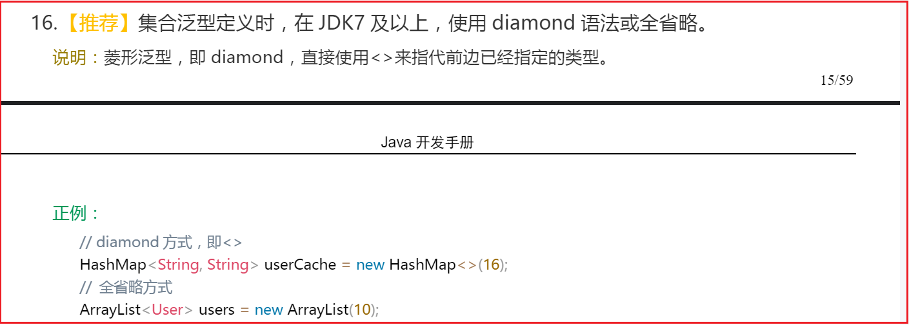
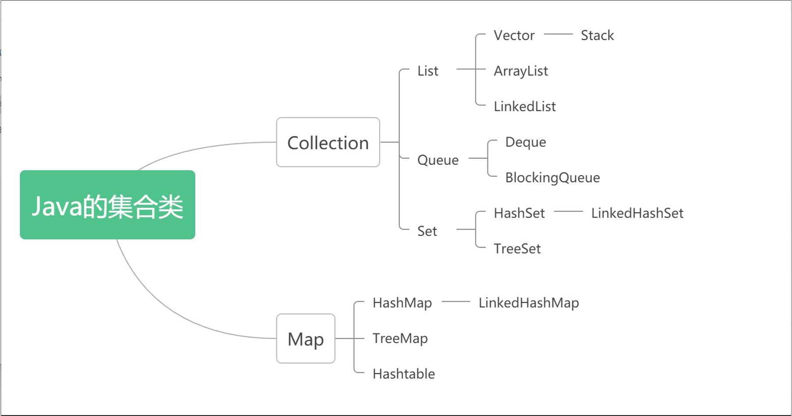
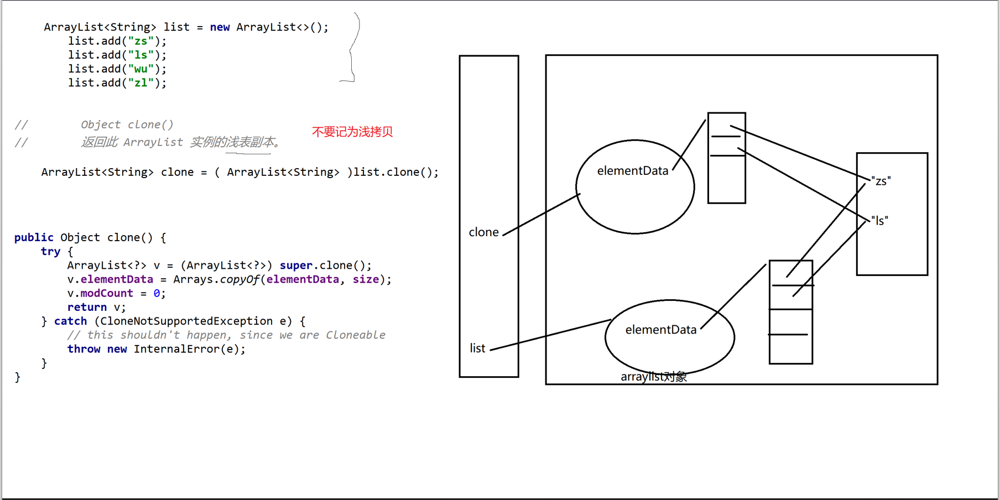
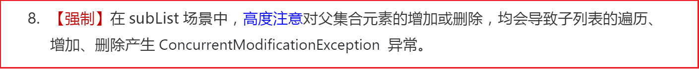
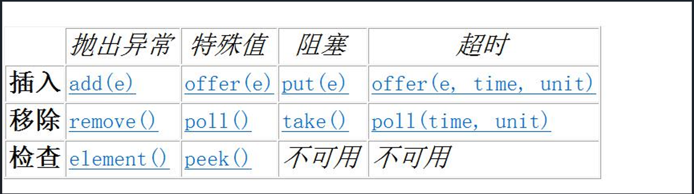
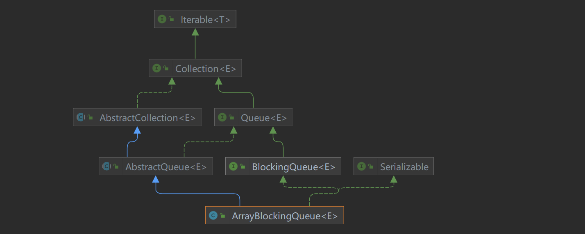
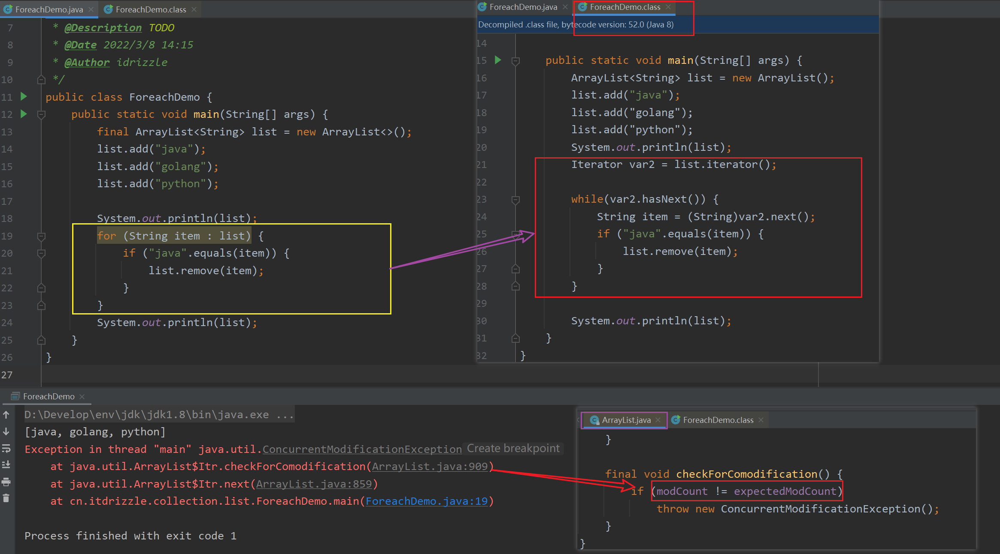
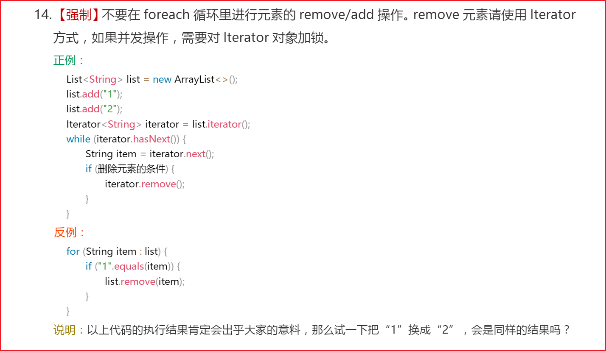
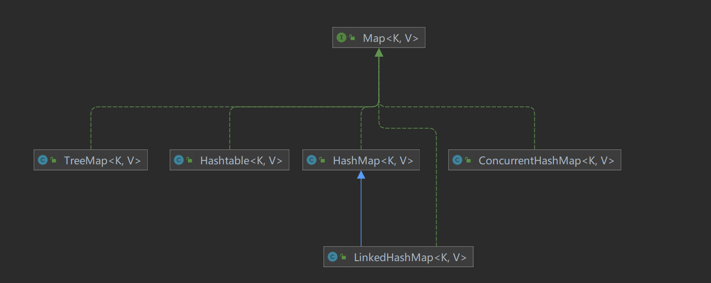
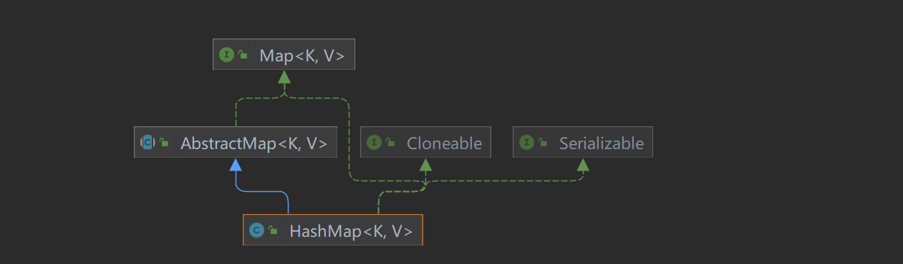

# 一 Java泛型

泛型，即“参数化类型”。顾名思义，就是将类型由原来的具体的类型'参数化'，此时类型也定义成参数形式，然后在使用/调用时传入具体的类型。事先不确定类型, 先写一个东西代指, 在使用的时候具体指定

- Java 泛型（generics）是  **JDK 5**  中引入的一个新特性, 泛型提供了编译时类型安全检测机制，该机制允许开发者在编译时检测到非法的类型。

- 泛型的本质是参数化类型，也就是说所操作的数据类型被指定为一个参数。在使用/调用时传入具体的类型（类型实参）。

- Java采用 **类型擦除(Type erasure generics)** 的方式实现泛型，即这个泛型只存在源码中。

   java中的泛型仅仅存在于编译之前, 经过编译之后全部泛型变成Object, 使用泛型变成类型强转


## 1. 注意事项

Java开发手册推荐使用：




```java
// 泛型的写法: 一般常用T E K V (语法上可以使用别的字符都可以, 但是习惯上用这些)
// T : type
// E : element
// K : key
// V : value

class User <T> {}
```

```java
// 我们可以在泛型定义的时候定义多个泛型(语法完全允许), 但是建议不要超过两个 
class User <T, E, X> {
    E name;
    T age;

    public User(E name, T age) {
        this.name = name;
        this.age = age;
    }
}
```


**泛型使用的写法**： 

```java
User<Integer> zs1 = new User<Integer>("zs", 18);  // 在引用上 和  new 类型上都指定类型:  jdk1.5时候的写法

User<Integer> zs2 = new User<>("zs", 18);         // 只写引用, 后面省略: jdk1.7时候做的写法优化

 // 如果某个地方需要传泛型, 但是我们使用的时候没有指定具体的泛型类型, 这个泛型在这次使用中默认表现为Object
User zs = new User("zs", 18);
Object age = zs.age;
```


**泛型不允许使用基本类型**：

```java
// 泛型的使用不允许使用基本类型
// 报错: User<int> zs3 = new User<>("zs", 18);
```


**泛型的好处**： 

````java
a. 提高了程序的安全性
b. 将运行期遇到的问题转移到了编译期
c. 省去了类型强转的麻烦
````


## 2. 泛型的使用


### 泛型类

```java
// 泛型类：（在实例化泛型类时，需要指明泛型类中的类型参数，并赋予泛型类属性相应类型的值）
public class ClassName<dataType1,dataType2,…>{
    private dataType1 propertyName1;
	private dataType2 propertyName2;
}

// 定义一个泛型类：
public class ClassName<T>{
    private T data;
    
    public T getData() {
    	return data;
    }
    public void setData(T data) {
    	this.data = data;
    }
}
// 注意1: 定义一个泛型类, 这个泛型作用域范围, 仅在类名之后和类体上
```


### 泛型接口

```java
// 泛型接口
public interface IntercaceName<T>{
	T getData();
}

// 实现接口时，可以选择指定泛型类型，也可以选择不指定
// 指定类型 如下：
public class Interface1 implements IntercaceName<String> {
    private String text;
    
    @Override
    public String getData() {
   	 return text;
    }
}

// 不指定类型：
public class Interface1<T> implements IntercaceName<T> {
    private T data;
    
    @Override
    public T getData() {
    	return data;
    }
}
```


### 泛型方法

```java
// 泛型方法，例如: 
public static <T> List find(Class<T> cs,int userId){
    
    // 使用了泛型的方法不一定是泛型方法, 定义了泛型的方法才是泛型方法
    
}
```

- 是否拥有泛型方法，与其所在的类是不是泛型没有关系
- 如果 static 方法需要使用泛型能力，就必须使其成为泛型方法


<br/>


## 3. 泛型通配

泛型是不允许类似数组一样协变的，但是有的时候, 我们又希望它能像数组一样, 产生类似协变的效果

泛型通配:  这个泛型通配就是为了模拟数组的协变, 又避免了数组协变的坏处(类型问题)


- `？`：任意类型，如果没有明确，那么就是Object以及任意的Java类了

  表示不确定的 java 类型，通常用于泛型方法的调用代码和形参，不能用于定义类和泛型方法

  

- `? extends E`（向下限定，E及其子类）

  上界通配符` < ? extends E>`：限制泛型可用类型, 表示参数化的类型可能是所指定的类型，或者是此类型的子类。

  - 如果传入的类型不是 E 或者 E 的子类，编译不成功
  - 泛型中可以使用 E 的方法，否则需要强转成 E 才能使用

  ```java
  // 当没有使用 extends 关键字限制泛型类型时，其实是默认使用 Object 类作为泛型类型/
  public class ClassName<T> {}
  // 等同于：
  public class ClassName<T extends Object> {}
  ```


- `? super E` （向上限定，E及其父类）

  下界通配符 `< ? super E>`：表示参数化的类型可能是所指定的类型，或者是此类型的父类型，直至 Object


<br/>


# 二 Java集合

为了保存数量不确定的数据，以及保存具有映射关系的数据（也被称为关联数组），Java提供了集合类。集合类主要负责保存、盛装其他数据，因此集合类也被称为容器类。

- 集合类和数组不一样，数组元素既可以是基本类型的值，也可以是对象（实际上保存的是对象的引用变量），

- 而集合里只能保存对象（实际上只是保存对象的引用变量）

  

Java 集合类型分为 Collection 和 Map，它们是 Java 集合的根接口，下图为Collection 和 Map 的子接口及其常用实现类：

```java
集合类的分类:

​    Collection集合体系: 存储单个数据

​    Map集合体系: 存储的都是key-value数据 (具有自我描述性 )
```




Java集合接口的作用：

| 接口名称   | 作  用                                                       |
| ---------- | ------------------------------------------------------------ |
| Iterator   | 集合的输出接口，主要用于遍历输出（即迭代访问）Collection 集合中的元素，Iterator 对象被称之为迭代器。迭代器接口是集合接口的父接口，实现类实现 Collection 时就必须实现 Iterator 接口。 |
| Collection | 是 List、Set 和 Queue 的父接口，是存放一组单值的最大接口。所谓的单值是指集合中的每个元素都是一个对象。一般很少直接使用此接口直接操作。 |
| Queue      | Queue 是 Java 提供的队列实现，有点类似于 List。              |
| Dueue      | 是 Queue 的一个子接口，为双向队列。                          |
| List       | 是最常用的接口。是有序集合，允许有相同的元素。使用 List 能够精确地控制每个元素插入的位置，用户能够使用索引（元素在 List 中的位置，类似于数组下标）来访问 List 中的元素，与数组类似。 |
| Set        | 不能包含重复的元素。                                         |
| Map        | 是存放一对值的最大接口，即接口中的每个元素都是一对，以 `key➡value` 的形式保存。 |


Java集合实现类的作用：

| Class      | description                                                  |
| ---------- | ------------------------------------------------------------ |
| ArrayList  | 底层是数组结构实现，查询快、增删慢                           |
| LinkedList | 底层是链表结构实现，查询慢、增删快                           |
| Vector     | 相对于ArrayList来说，它是线程安全的，同时提供了指定扩容增量的构造方法 |
| HashSet    | 底层数据结构是哈希表, 无序，不包含重复元素（为优化査询速度而设计） |
| HsahMap    | 按哈希算法来存取键对象                                       |


## 1. Collection

**Collection的特点: (背会)** 

```java
// 1, Collection是Collection集合体系的顶级接口
// 2, Collection定义了一个容器
// 3, Collection的一些子实现是有序的, Collection的另一些子实现是无序的
// 4, Collection的一些子实现允许存储重复元素, Collection的另一些子实现不允许存储重复元素
// 5, Collection的一些子实现允许存储null, Collection的另一些子实现不允许存储null

```


 **Collection的api: (记住)** 

Collection中定义了单列集合(List和Set)通用的一些方法， 这些方法可用于操作所有的单列集合。方法如下： 

```java
boolean add(E e)                               // 把给定的对象添加到当前集合中
boolean addAll(Collection<? extends E> c)      // 添加所有
boolean contains(Object o)                     // 查找某个元素是否存在
boolean containsAll(Collection<?> c)           // 判断集合中的元素是否都存在
boolean remove(Object o)                       // 删除某个内容
boolean removeAll(Collection<?> c)             // 删除所有匹配元素
boolean retainAll(Collection<?> c)             // 保留所有匹配元素

void clear()                                   // 数据清空
boolean equals(Object o)                       // 集合类重写了equals方法, 是按照内容进行比较是否重复
int hashCode()
boolean isEmpty()
int size()

    
Object[] toArray()                             // 把Collection中所有的数据, 存储到一个数组并返回
<T> T[] toArray(T[] a)                         // 泛型方法, 返回包含此 collection 中所有元素的数组；
/* 返回数组的运行时类型与指定数组的运行时类型相同。

注意1: toArray()无参的toArray方法返回 Object[]数组, 因为没有办法根据泛型new对应类型数组
注意2: 为什么提供一个泛型方法:  <T> T[] toArray(T[] a): 泛型方法, 就是为了弥补注意1的缺陷
注意3: 这是个泛型方法, 但是并不意味者, 我们可以传任何类型的数组(虽然编译通过, 运行报错)
注意4: 如果泛型toArray数组给定不够长, 那么返回的数组和参数数组不是同一个
       如果数组给的足够长,返回的数组和参数数组是同一个数组
       如果数组给定太长了, 假设集合类存储了n个元素, 
       数组从0-n-1就是集合元素, 下标为n位置置位null, n之后的数组位置不处理
*/
    
                                  
Iterator<E> iterator()                          // 返回在此 collection 的元素上进行迭代的迭代器。
```


## 2. List(线性表)

List特点：

> 1. List是Collection的子接口
> 2. List在Collection的基础上，定义为一个线性表
> 3. List的子实现都是有序的
> 4. List的子实现允许存储重复元素
> 5. List的子实现允许存储null


api：

```java
//        boolean add(E e): 添加方法
//        boolean addAll(Collection<? extends E> c): 添加所有
//        boolean contains(Object o): 查找某个元素是否存在
//        boolean containsAll(Collection<?> c): 查找某些元素是否都存在
//        boolean remove(Object o): 根据内容删除
//        boolean removeAll(Collection<?> c): 删除所有
//        boolean retainAll(Collection<?> c): 保留所有匹配元素

//        void clear(): 清空
//        boolean equals(Object o)
//        int hashCode()
//        boolean isEmpty()
//        int size()
```


```java
void add(int index, E element)                        // 添加到指定下标位置
boolean addAll(int index, Collection<? extends E> c)  // 把所有元素添加到指定下标位置
E get(int index)                                      // 根据下标查找对应下标存储内容:  最最重要
E remove(int index)                                   // 删除指定下标的元素
E set(int index, E element)                           // 修改指定位置的数据
int indexOf(Object o)                                 // 查找某个元素第一次出现的下标
int lastIndexOf(Object o)                             // 查找某个元素最后一次出现的下标
```


```Java
// toArray各种特点和Collection一模一样

Object[] toArray()       // 返回按适当顺序包含列表中的所有元素的数组（从第一个元素到最后一个元素）
                  
<T> T[]  toArray(T[] a)  // 返回按适当顺序（从第一个元素到最后一个元素）包含列表中所有元素的数组；
                         // 返回数组的运行时类型是指定数组的运行时类型
```


**ListIterator** : 重点提供向前遍历的方法

```Java
Iterator<E> iterator()                   // 返回按适当顺序在列表的元素上进行迭代的迭代器。
ListIterator<E> listIterator()           // 返回此列表元素的列表迭代器（按适当顺序）。
ListIterator<E> listIterator(int index)  // 返回列表中元素的列表迭代器（按适当顺序），从列表的指定位置开始   
```

<br/>

**视图方法**：

```java
List<E> subList(int fromIndex, int toIndex) // 返回 fromIndex（包括 ）和 toIndex（不包括）之间的部分'视图'
```

> 视图方法:   通过视图方法获得的数据, 并不是真的复制了数据, 而是视图方法返回一个对象, 
>                    这个返回的对象内部维护了一些指向源数据的标记  
>
>    -->           视图方法获得的数据, 还是源数据
>               
> 注意: 视图方法使用的过程中, 也可能会抛出并发修改异常
>
> 怎么避免？ 在使用完通过视图方法获得的对象之前, 不要调用原集合类修改结构的方法修改原集合数据


<br/>


### 1) ArrayList

**ArrayList的特点**：

```java
// 1, ArrayList 是 List接口的子实现
// 2, ArrayList描述的数据结构是线性表
// 3, ArrayList的底层结构是数组
// 4, ArrayList默认的初始容量：10,  扩容机制：原来的1.5倍
// 5, 存储元素有序
// 6, 允许存储重复元素
// 7, 允许存储null
// 8, 线程不安全

```


- ArrayList的默认构造函数会初始化一个空数组，第一次添加元素时才扩容至10（ JDK8 中改为这种懒加载模式？）
- 建议开发中如果能知道数组大小，预先指定大小避免多次扩容、 复制数据


ArrayList类的常用方法：

| 方法名称                                    | 说明                                                         |
| ------------------------------------------- | ------------------------------------------------------------ |
| public boolean add(E e)                     | 添加过程中会自动扩容，返回结果一定为true                     |
| E get(int index)                            | 获取此集合中指定索引位置的元素，E 为集合中元素的数据类型     |
| int index(Object o)                         | 返回此集合中第一次出现指定元素的索引，如果此集合不包含该元 素，则返回 -1 |
| int lastIndexOf(Object o)                   | 返回此集合中最后一次出现指定元素的索引，如果此集合不包含该 元素，则返回 -1 |
| E set(int index, Eelement)                  | 将此集合中指定索引位置的元素修改为 element 参数指定的对象。 此方法返回此集合中指定索引位置的原元素 |
| List<E> subList(int fromlndex, int tolndex) | 返回一个新的集合，新集合中包含 fromlndex 和 tolndex 索引之间 的所有元素。包含 fromlndex 处的元素，不包含 tolndex 索引处的 元素 |

```java
ArrayList实现了, Collection以及List定义的所有api
    
其它:
//        void ensureCapacity(int minCapacity)
//        如有必要，增加此 ArrayList 实例的容量，以确保它至少能够容纳最小容量参数所指定的元素数。

//        void trimToSize()
//        将此 ArrayList 实例的容量调整为列表的当前大小。


//        Object clone()
//        返回此 ArrayList 实例的浅表副本。

```

注意: ArrayList的clone方法, 复制两层, 一个ArrayList对象本身会复制, 另外一层是ArrayList对象的持有的elementData也会复制, 在elementData存储的数据就不会再复制了



<br/>


**subList() 在ArrayList上的表现**：

subList() 方法实际返回了一个 SubList 的内部类，SubList继承AbstractList抽象类，AbstractList实现了List接口，所以SubList说到底就是一个List的实现类，主要用于返回List的 **视图**（来源于数据库、 在口语化上又叫"虚表"  ），这个视图是原List对象中的一部分，确实是一部分，直接将原List对象引用到新的子视图的List，对子视图进行改变，原List对象也会随之改变

```java
class ArrayList{
   Object[] elementData;
    
   public List<E> subList(int fromIndex, int toIndex) {
        subListRangeCheck(fromIndex, toIndex, size);
        return new SubList(this, 0, fromIndex, toIndex);
    }
    
     private class SubList extends AbstractList<E> implements RandomAccess {
        private final AbstractList<E> parent; // 表示外层对象
        private final int parentOffset; // 起始下标
        private final int offset;
        int size; // 标记的数据个数
        
        // ......
     }
    
    // ......
 }
```

在List中使用subList要小心，因为本身SubList这个类就是原List的一个视图，改变 SubList 必定会改变原List


Java开发手册强制规定：




<br/>

补充: 可选操作

比如Collection定义了一些api,  子实现有些api可以选择不实现(在实现的方法体内直接抛出`UnsupportedOperationException` )

```java
public class MyCollection implements Collection<String> {

    @Override
    public boolean add(String s) {
       throw new UnsupportedOperationException();
    }
}
```


### 2) Vector

Vector 类实现了一个动态数组。和 ArrayList 很相似，但是两者是不同的：

- Vector 是同步访问的（线程安全的）
- Vector 还包含了许多传统的方法，这些方法不属于集合框架。


```java
// 1, 它是List的一个子实现
// 2, 描述的数据结构是一个线性表
// 3, 底层结构是一个数组
// 4, 默认初始容量 10,  扩容机制: 如果存在一个大于零的增量扩大增量个, 如果增量小于等于0, 扩为原来的2倍
// 5, 有序
// 6, 允许重复
// 7, 允许存储null
// 8, 线程安全
// 9, Vector是jdk1.0时候出现的


// 构造方法和api不需要记(有兴趣可以去研究)
```


Vector 类的4种构造方法：

```java
Vector()                    // 默认大小为 10
Vector(int size)            // 指定大小
Vector(int size,int incr)   // 指定大小，并且增量用 incr 指定（增量表示每次增加的元素数目）
Vector(Collection c)        // 创建一个包含集合的Vector
```

当Vector容量不足以容纳全部元素时，Vector的容量会增加。**若容量增加系数 >0，则将容量的值增加“容量增加系数”；否则，将容量大小增加一倍。**


### 3) LinkedList

```java
// 1, LinkedList不仅仅是List接口的一个子实现, 还是Deque接口的一个子实现
// 2, LinkedList首先可以作为一个普通的线性表, 还可以作为队列/双端队列/栈使用
// 3, 底层是一个双向链表
// 4, 有序
// 5, 允许存储重复元素
// 6, 允许存储null元素
// 7, 线程不安全
```


**构造方法** ：

```java
LinkedList()   // 构造一个空列表。 
LinkedList(Collection<? extends E> c) 
               // 构造一个包含指定 collection 中的元素的列表，这些元素按其 collection 的迭代器返回的顺序排列
```


api：

```Java
//        boolean add(E e)                                           // 添加方法
//        void add(int index, E element)                             // 根据下标的添加
//        boolean addAll(Collection<? extends E> c)                  // 添加所有
//        boolean addAll(int index, Collection<? extends E> c)       // 根据下标添加所有

//        boolean contains(Object o)    // 如果此列表包含指定元素，则返回 true。
//        E get(int index)              // 返回此列表中指定位置处的元素。
//        int indexOf(Object o)         // 返回此列表中首次出现的指定元素的索引，如果此列表中不包含该元素，则返回 -1
//        int lastIndexOf(Object o)     // 返回此列表中最后出现的指定元素的索引，如果此列表中不包含该元素，则返回 -1

//        E remove(int index)           // 移除此列表中指定位置处的元素。
//        boolean remove(Object o)      // 从此列表中移除首次出现的指定元素（如果存在）。
//        E set(int index, E element)   // 将此列表中指定位置的元素替换为指定的元素

//        int size()                    // 返回此列表的元素数。
//        void clear()                  // 从此列表中移除所有元素。
//        Object clone()                // 返回此 LinkedList 的浅表副本。

//        Object[] toArray()            // 返回以适当顺序（从第一个元素到最后一个元素）包含此列表中所有元素的数组
//        <T> T[] toArray(T[] a)        // 返回以适当顺序（从第一个元素到最后一个元素）包含此列表中所有元素的数组；
                                        // 返回数组的运行时类型为指定数组的类型。
```


LinkedList 类除了包含 Collection 接口和 List 接口中的所有方法之外，还特别提供了下面的方法：

| 方法名称                                | 说明                                                         |
| --------------------------------------- | ------------------------------------------------------------ |
| void addFirst(E e)                      | 将指定元素添加到此集合的开头                                 |
| void addLast(E e)                       | 将指定元素添加到此集合的末尾                                 |
| E getFirst()                            | 返回此集合的第一个元素                                       |
| E getLast()                             | 返回此集合的最后一个元素                                     |
| E element()                             | 获取但不移除此列表的头（第一个元素）                         |
| E remove()                              | 获取并移除此列表的头（第一个元素）                           |
| E removeFirst()                         | 删除此集合中的第一个元素                                     |
| E removeLast()                          | 删除此集合中的最后一个元素                                   |
| boolean removeFirstOccurrence(Object o) | 从此列表中移除第一次出现的指定元素（从头部到尾部遍历列表时） |
| boolean removeLastOccurrence(Object o)  | 从此列表中移除最后一次出现的指定元素（从头部到尾部遍历列表时） |

<br/>

```java
ListIterator<E> listIterator(int index)  // 返回列表迭代器（按适当顺序），从列表中指定位置开始
Iterator<E> descendingIterator()         // 返回以逆向顺序进行迭代的迭代器
```

<br/>

```java
//------------------------------ 作为队列的api
boolean offer(E e) // 将指定元素添加到此列表的末尾（最后一个元素）
E poll()           // 获取并移除此列表的头（第一个元素）
E peek()           // 获取但不移除此列表的头（第一个元素）
```

<br/>

```Java
//------------------------------ 作为双端队列的api
boolean offerFirst(E e)    // 在此列表的开头插入指定的元素。
boolean offerLast(E e)     // 在此列表末尾插入指定的元素。
E peekFirst()              // 获取但不移除此列表的第一个元素；如果此列表为空，则返回 null。
E peekLast()               // 获取但不移除此列表的最后一个元素；如果此列表为空，则返回 null。
E pollFirst()              // 获取并移除此列表的第一个元素；如果此列表为空，则返回 null。
E pollLast()               // 获取并移除此列表的最后一个元素；如果此列表为空，则返回 null。
```

<br/>

```java
//------------------------------ 作为栈的api
E pop()             // 从此列表所表示的堆栈处弹出一个元素。
void push(E e)      // 将元素推入此列表所表示的堆栈。
```


<br/>

 

## 3. 栈和队列

### 1) Stack

```java
// 1, Stack是vector一个子类
// 2, 数据结构是一个栈
// 3, 底层结构是一个数组
// 4, 默认的初始长度10, 默认扩容机制:2倍
// 5, 有序
// 6, 允许重复
// 7, 允许存储null
// 8, 线程安全
```

注意1:  Stack是Vector子类, 也就是可以从语法上使用Vector实现的 api(add, addAll....),  但是习惯上还是不要用, 因为我们创建一个Stack还是希望它作为一个栈存在(使用 push, pop, peek方法)

注意2: 文档上推荐, 如果我们需要使用栈的时候, 用Deque接口下的子实现, 而非使用Stack 


<br/>

### 2) Queue

```Java
1. Queue 是collection 的一个子接口
2. QUeue 定义为一个队列
3. 允许存储元素有序
4. 允许存储重复元素
5. Queue的子实现不允许存储 null （LinkedList除外）
  // 因为Queue提供了一个poll方法, 当队列没有元素可以出队列的时候, poll方法返回一个null标记队列没有存储元素, 
  // 所以如果Queue允许存储null, 在删除的时候, 就没办法分辨到底是存储的null, 还是没有元素了
```

<br/>

```java
boolean offer(E e)     // 将指定的元素插入此队列（如果立即可行且不会违反容量限制）
                       // 当使用有容量限制的队列时，此方法通常要优于 add(E)，后者可能无法插入元素，而只是抛出一个异常

E peek()               // 获取但不移除此队列的头；如果此队列为空，则返回 null
E poll()               // 获取并移除此队列的头，如果此队列为空，则返回 null

E element()            // 获取，但是不移除此队列的头
E remove()             // 获取并移除此队列的头
```


<br/>

### 3) Deque

```Java
// 1, Deque是Queue 接口的一个子接口
// 2, 在队列基础上, 定义了双端队列/栈(Deque从数据结构可以描述: 队列/双端队列/栈)
// 3, 存储元素有序
// 4, 允许存储重复元素
// 5, Deque的子实现不允许存储null  (LinkedList除外)
```

<br/>

```java
 boolean add(E e)    // 如果成功，则返回 true，如果当前没有可用空间，则抛出 IllegalStateException。 
 void addFirst(E e)  // 将指定元素插入此双端队列的开头（如果可以直接这样做而不违反容量限制）。 
 void addLast(E e)   // 将指定元素插入此双端队列的末尾（如果可以直接这样做而不违反容量限制）。 
     
 boolean contains(Object o)   // 如果此双端队列包含指定元素，则返回 true。 
 E element()                  // 获取，但不移除此双端队列所表示的队列的头部（此双端队列的第一个元素）
 E getFirst()                 // 获取，但不移除此双端队列的第一个元素。 
 E getLast()                  // 获取，但不移除此双端队列的最后一个元素。 
     
 int size()                   //  返回此双端队列的元素数。
     
 E remove()                   // 获取并移除此双端队列所表示的队列的头部（换句话说，此双端队列的第一个元素）。 
 boolean remove(Object o)     // 从此双端队列中移除第一次出现的指定元素。 
 E removeFirst()              // 获取并移除此双端队列第一个元素。 
 E removeLast()               // 获取并移除此双端队列的最后一个元素。 

 boolean removeFirstOccurrence(Object o)  // 从此双端队列移除第一次出现的指定元素。 
 boolean removeLastOccurrence(Object o)   // 从此双端队列移除最后一次出现的指定元素。 
     

 boolean offer(E e)                 // 将指定元素插入此双端队列所表示的队列（此双端队列的尾部）
 boolean offerFirst(E e)            // 在不违反容量限制的情况下，将指定的元素插入此双端队列的开头。 
 boolean offerLast(E e)             // 在不违反容量限制的情况下，将指定的元素插入此双端队列的末尾。 
     
 E peek()               // 获取但不移除此双端队列所表示的队列的头部, 如果此双端队列为空，则返回 null 
 E peekFirst()          // 获取，但不移除此双端队列的第一个元素；如果此双端队列为空，则返回 null。 
 E peekLast()           // 获取，但不移除此双端队列的最后一个元素；如果此双端队列为空，则返回 null。 
     
 E poll()               // 获取并移除此双端队列所表示的队列的头部；如果此双端队列为空，则返回 null。 
 E pollFirst()          // 获取并移除此双端队列的第一个元素；如果此双端队列为空，则返回 null。 
 E pollLast()           // 获取并移除此双端队列的最后一个元素；如果此双端队列为空，则返回 null。 
     
  
 Iterator<E> descendingIterator()   // 返回以逆向顺序在此双端队列的元素上进行迭代的迭代器。 
 Iterator<E> iterator()             // 返回以恰当顺序在此双端队列的元素上进行迭代的迭代器。 
     
     
     
 E pop()        // 从此双端队列所表示的堆栈中弹出一个元素。 
 void push(E e) // 将一个元素推入此双端队列所表示的堆栈（换句话说，此双端队列的头部），
                // 如果可以直接这样做而不违反容量限制的话；如果成功，则返回 true，
                // 如果当前没有可用空间，则抛出 IllegalStateException。 
     
```

<br/>


### 4) ArrayDeque

```java
// 1, ArrayDeque是Deque接口的子实现
// 2, ArrayDeque描述的数据结构: 队列/双端队列/栈
// 3, 底层结构是数组(循环数组)
// 4, 初始容量 16,  扩容机制: 扩为原来的2倍
// 5, 有序
// 6, 允许重复元素
// 7, 不允许存储null
// 8, 线程不安全
// 9, 如果我们在构造方法里指定了数组长度: 实际上底层会产生一个大于给定值最小的2的幂值作为底层数组长度
      --> ArrayDeque底层数组长度永远是2的幂值
```


ArrayDeque和LinkedList都实现了Deque接口，应该用哪一个呢？

如果只需要Deque接口，从两端进行操作，一般而言，ArrayDeque效率更高一些，应该被优先使用；

如果同时需要根据索引位置进行操作，或者经常需要在中间进行插入和删除，则应该选LinkedList。


<br/>

### 5) BlockingQueue

```Java
// 1, BlockingQueue是一个阻塞队列(是个接口)
// 2, BlockingQueue 方法(四类方法)
//    重点注意: put和take方法
```




```vb
// 什么是阻塞队列? 大小有限的队列
//   当队列添加满的时候, 添加线程等待/阻塞
//   当队列为空的时候, 删除线程等待/阻塞
```





<br/>


## 4. 遍历集合

### 1) Iterator

Iterator（迭代器）是一个接口，它的作用就是遍历容器的所有元素，也是Java 集合框架的成员

- Collection 和 Map 系列集合主要用于盛装其他对象
- Iterator 则主要用于遍历（即迭代访问）Collection 集合中的元素

Iterator 接口隐藏了各种 Collection 实现类的底层细节，向应用程序提供了遍历 Collection 集合元素的统一编程接口，

Iterator 仅用于遍历集合，必须通过 一个可以被迭代的集合 创建 Iterator 对象


```java
// 我们通过Collection的iterator方法获得了一个Iterator对象, 这个对象是用来遍历数据的, 并且这个数据的遍历
// 是依赖于源数据直接进行的(没有创建新的数据, 获得Iterator对象只是维护了一些指向源数据的标记)
```

<br/>

Iterator 接口里定义了如下 4 个方法：

```java
boolean hasNext()  // 如果被迭代的集合元素还没有被遍历完，则返回 true。
Object next()      // 返回集合里的下一个元素。
void forEachRemaining(Consumer action) //Java8为Iterator新增的默认方法，该方法可使用Lambda表达式来遍历集合元素

void remove()      // 删除集合里上一次 next 方法返回的元素。
//   remove 不能在未遍历之前删除, 也不能做连续的删除, 而且如果要删除, 删除的还是原Collection对象的数据 
//   (实际上iterator主要不是用来做删除, 主要是用来做遍历的) 
```


**Iterator和并发修改异常**: 

```java
// 在Iterator设计的时候,  担心一种情况出现: 一个线程在通过Iterator遍历源数据, 另一个线程在修改源数据, 
// 这会导致Iterator遍历的结果没有意义(遍历结果可能不对)
// 我们又不想在Collection对象加锁以保证同步(因为加锁会导致效率降低)
// 所以我们给Collection对象持有了一个modCount的参数, 用来记录Collection对象被修改的次数
// 当我们创建Iterator对象时, Iterator对象也会维护一个expModCount并且在最开始的时候和Collection对象的modCount保持一致.
// 当别的线程(非Iterator迭代线程)修改了Collection对象, 会导致Collection对象的modCount参数加一, 这样Iterator对象在遍历的时候就会发现自己的expModCount和Collection对象的modCount不一致, 从而知道源数据被别人修改, 并抛出并发修改异常
```

```java
// 但是上述情况, 也会导致单线程的情况下有并发修改异常出现:
//     那就是在Iterator遍历的过程中, 直接调用原集合类的修改方法修改了源集合类(Iterator是没有感知的)

// 所以: Iterator对象在遍历的时候还是会发现自己的expModCount和Collection对象的modCount不一致, 认为遍历的数据已经被别人修改, 并抛出并发修改异常
```


- 当使用 Iterator 迭代访问 Collection 集合元素时，Collection 集合里的元素不能被改变，

  只能通过 Iterator 的 remove() 方法删除上一次 next() 方法返回的集合元素，

  否则将会引发 `java.util.ConcurrentModificationException` 异常

<br/>


### 2) fail-fast


- Iterator 迭代器采用的是 **快速失败（fail-fast）机制**，一旦在迭代过程中检测到该集合已经被修改（通常是程序中的其他线程修改），程序立即引发 `ConcurrentModificationException` 异常，而不是显示修改后的结果，这样可以避免共享资源而引发的潜在问题。

```java
public class IteratorTest {
    public static void main(String[] args) {
        HashSet<String> hashSet = new HashSet<>();
        hashSet.add("hello");
        hashSet.add("hashSet");
        hashSet.add("Set");
        System.out.println(hashSet);  // [Set, hashSet, hello]

        Iterator<String> iterator = hashSet.iterator();
        while(iterator.hasNext()){
            String s = iterator.next();
            if("Set".equals(s)){
                // hashSet.remove(s);  //java.util.ConcurrentModificationException
                iterator.remove();
            }
        }
        System.out.println(hashSet);  // [hashSet, hello]
    }
}
```


**Java集合-快速失败** 总结：

**现象**：在用迭代器遍历一个集合对象时，如果遍历过程中对集合对象的内容进行了增加、删除、修改操作，则会抛出ConcurrentModificationException。

**原理**：迭代器在遍历时直接访问集合中的内容，并且在遍历过程中使用一个 modCount 变量。集合在被遍历期间如果内容发生变化，就会改变modCount的值。每当迭代器使用hashNext()/next()遍历下一个元素之前，都会检测modCount变量是否为expectedmodCount值，是的话就返回遍历；否则抛出ConcurrentModificationException异常，终止遍历。

**注意**：这里异常的抛出条件是检测到 modCount！=expectedmodCount 这个条件。如果集合发生变化时修改modCount值刚好又设置为了expectedmodCount值，则异常不会抛出。因此，不能依赖于这个异常是否抛出而进行并发操作的编程，这个异常只建议用于检测并发修改的bug 


<br/>


【拓展】Java集合-失败安全

**现象**：采用失败安全机制的集合容器，在遍历时不是直接在集合内容上访问的，而是先复制原有集合内容，在拷贝的集合上进行遍历。

**原理**：由于迭代时是对原集合的拷贝进行遍历，所以在遍历过程中对原集合所作的修改并不能被迭代器检测到，所以不会触发ConcurrentModificationException。

**缺点**：基于拷贝内容的优点是避免了ConcurrentModificationException，但同样地，迭代器并不能访问到修改后的内容，即：迭代器遍历的是开始遍历那一刻拿到的集合拷贝，在遍历期间原集合发生的修改迭代器是不知道的。这也就是他的缺点，同时，由于是需要拷贝的，所以比较吃内存。

**场景**：java.util.concurrent包下的容器都是安全失败，可以在多线程下并发使用，并发修改。


<br/>


### 3) foreach

除了使用 Iterator 接口迭代访问 Collection 集合里的元素，jdk1.5 还提供的 foreach 循环迭代访问集合元素，而且更加便捷。

- 与使用 Iterator 接口迭代访问集合元素类似的是，foreach 循环中的迭代变量也不是集合元素本身，系统只是依次把集合元素的值赋给迭代变量，因此在 foreach 循环中修改迭代变量的值也没有任何实际意义。
- 它的内部原理其实也是Iterator迭代器，所以在遍历的过程中，不能对集合中的元素进行增删操作，否则将引发异常。





注意：

> 我们可以使用foreach循环, 对Collection对象进行遍历,  foreach循环遍历Collection对象,  在编译的时候本质还是Iterator遍历
>  -->  推论1: 必须具有Iterator方法才可以使用foreach循环 (数组例外)
>  ---> 推论2: 不要在使用foreach循环的时候通过源数据的修改结构的方法修改源数据, 会抛出并发修改异常
>
> ​        (因为foreach循环底层会编译成Iterator迭代 )
>
> 注意：虽然数组可以使用foreach循环, 但是在真正编译的时候, 数组的增强的for循环会编译成fori循环


Java开发手册强制规定：



<br/> 

### 4) ListIterator 

 List提供了ListIterator方法, 是在Iterator的基础上增强---> 可以向前遍历 （注意这个类型是Iterator类型的子类型）

```java
public interface ListIterator<E> extends Iterator<E> {
    boolean hasNext();          // hashNext: 判断后面还有没有数据可遍历
    E next();                   // next : 向后遍历
    
    boolean hasPrevious();      // hasPrevious : 判断向前还有没有数据可遍历
    E previous();               // previous : 向前遍历
    
    int nextIndex();            // nextIndex : 如果向后遍历, 后面元素的下标
    int previousIndex();        // previousIndex : 如果向前遍历, 前面元素的下标
    
    void remove();              // remove : 删除刚刚遍历过的元素
    void set(E e);              // set : 修改刚刚遍历过的元素位置
    void add(E e);              // add : 添加到当前标记位置
}
```


<br/>


## 5. 集合的排序

**Comparable**：

实现此接口的`compareTo()`方法的对象列表（和数组）可以通过Collections.sort（和Arrays.sort）进行自动排序

```java
public class Student implements Comparable<Student> {
    private String name;
    private int age;
    private double score;
    /**
     * @DESCRIPTION 重写compareTo方法
     */
    @Override
    public int compareTo(Student obj) {
        if (this.score < obj.score){
            return 1;
        }else if(this.score > obj.score){
            return -1;
        }else{
            if(this.age < obj.age){
                return 1;
            }else if(this.age > obj.age){
                return -1;
            }else {
                return 0;
            }
        }
    }
}
```

<br/>

**Comparator**：

可以将Comparator 传递给sort方法（如Collections.sort 或 Arrays.sort），从而允许在排序顺序上实现精确控制

```java
public class SortDemo {
    public static void main(String[] args) {
        ArrayList<Student> list = new ArrayList<>();
        list.add(new Student("贾宝玉", 14, 88.5));
        list.add(new Student("林黛玉", 13, 90.5));
        list.add(new Student("史湘云", 13, 85));
        list.add(new Student("甄宝玉", 16, 85));
        list.add(new Student("薛宝钗", 15, 91));
        System.out.println("排序前：" + list);

        // 类实现类Comparable接口的排序方式
        // Collections.sort(list);

        // Comparator接口的排序方式
        Collections.sort(list, new Comparator<Student>() {
            @Override
            public int compare(Student o1, Student o2) {
                if (o1.getScore() < o2.getScore()) {
                    return 1;
                } else if (o1.getScore() > o2.getScore()) {
                    return -1;
                } else {
                    if (o1.getAge() < o2.getAge()) {
                        return 1;
                    } else if (o1.getAge() > o2.getAge()) {
                        return -1;
                    } else {
                        return 0;
                    }
                }
            }
        });
        System.out.println("排序后：" + list);
    }
}
```


<br/>


# 三 Set和Map

## 1. Map接口

Map 是一种键-值对（key-value）集合，Map 集合中的每一个元素都包含一个键（key）对象和一个值（value）对象。用于保存具有映射关系的数据。




```java
// 1, Map是Map集合体系的顶级接口
// 2, Map存储的是key-value数据(键值对)  (key-value具有自我描述性)
// 3, Map的一些子实现存储元素是有序的, 另一些子实现存储元素无序
// 4, Map都不允许存储重复元素 (什么叫重复元素)
// 5, Map的一些子实现允许存储null, 另一些子实现不允许存储null

(这些有序/重复/null问题指的都是map数据中的key,  value不在讨论范畴之内)

注意: 如果我们又给map存储了一份重复key-value数据 (重复指key重复), 那么会新的value会覆盖已经存储的key-value的value

注意: 因为map没有定义Iterator方法, 所以我们没有办法直接使用foreach循环来遍历map
```


Map接口的常用方法：

```java
V put(K key, V value)                       // 添加或替换（可选操作）
void putAll(Map<? extends K,? extends V> m) // 批量添加或替换（可选操作）
    
V remove(Object key)                        // 如果存在一个键的映射关系，则将其从此映射中移除（可选操作）
    
boolean containsKey(Object key)             // 如果此映射包含指定键的映射关系，则返回 true
boolean containsValue(Object value)         // 如果此映射将一个或多个键映射到指定值，则返回 true     
V get(Object key)                           // 返回指定键所映射的值；如果此映射不包含该键的映射关系，则返回null             

void clear()                                // 从此映射中移除所有映射关系（可选操作）。
boolean equals(Object o)                    // 比较指定的对象与此映射是否相等。
int hashCode()                              // 返回此映射的哈希码值。
boolean isEmpty()                           // 如果此映射未包含键-值映射关系，则返回 true。       
int size()                                  // 返回此映射中的键-值映射关系数。       


Set<K> keySet()                             // 返回此映射中包含的键的 Set 视图
Collection<V> values()                      // 返回此映射中包含的值的 Collection 视图   
Set<Map.Entry<K,V>> entrySet()              // 返回此映射中包含的映射关系的 Set 视图
```

注意: 为什么Map要提供三个视图方法（keySet、values、entrySet） 

- 因为map没有定义Iterator方法, 所以我们没有办法直接使用foreach循环来遍历map

  所以提供了是哪个视图方法, 把数据变成Collection类型, 就可以使用foreach循环来遍历map数据了


三个视图方法的简单使用示例代码如下：

```java
public class MapDemo {
    public static void main(String[] args) {
        Map<String, String> animal = new HashMap<String, String>();
        animal.put("cat", "小猫");
        animal.put("dog", "小狗");
        animal.put("pig", "小猪");

        // 遍历（迭代器）
		// 1. 输出 value的值
        Iterator<String> it = animal.values().iterator();
        while (it.hasNext()) {
            System.out.print(it.next() + " ");
        }
        System.out.println("\n——————————————————————————————————————————");

		// 2. 通过 entrySet 方法打印 key 和 value 的值
        Set<Map.Entry<String,String>> entrySet = animal.entrySet();
        for(Map.Entry<String,String> entry:entrySet){
            System.out.print(entry.getKey()+"-");
            System.out.println(entry.getValue());
        }
        System.out.println("\n——————————————————————————————————————————");

		// 查找（根据 key查找值）
        String search = "cat";
        Set<String> keySet = animal.keySet();
        for(String key:keySet){
            if(search.equals(key)){
                System.out.println("OK! "+key+"-"+animal.get(key));
                break;
            }
        }
    }
}
```


<br/>


### 1) HashMap




注意: HashMap的底层结构: 数组+链表+红黑树，jdk1.8之前: 只有单纯的: 数组+链表


```java
// 1, HashMap是Map接口的一个子实现
// 2, HashMap底层是: 数组 +链表+红黑树
// 3, HashMap的底层数组默认初始长度 16,   默认的扩容机制: 扩为原来2倍 , 默认的加载因子是0.75
// 4, HashMap存储元素是无序
// 5, HashMap不允许存储重复的key
// 6, HashMap允许存储null作为key
// 7, HashMap线程不安全
// 8, 如果我们在构造方法里给定长度: 底层长度会变成大于等于我们给定值的最小的2的幂值
       16 -> 16;   20 -> 32;  60 -> 64;  64 -> 64
// 9, 
```


加载因子: 

```java
// 加载因子是用来限定阈值的 , 如果在爱HashMap存储的数据(key-value份数)超过阈值, 就要底层数组扩容
 阈值(12) = 加载因子(0.75) * 数组长度(16)

// 注意: 虽然我们可以做在构造方法里修改加载因子: 但是建议不要修改, 实在要修改(建议保证在0.5-1之间)
     
```

对于HashMap讲什么是重复的key:

```java
HashMap对key的重复的定义: key的hash值相等, 并且 key直接相等或者相equals

//  if (p.hash == hash &&  ((k = p.key) == key || (key != null && key.equals(k))))
```


key是怎么计算出一个int类型的值, 以及怎么进一步用这个int值取下标

```java
int类型的值(hash值)怎么得到的
// (key == null) ? 0 : (h = key.hashCode()) ^ (h >>> 16);
// 为什么要先移位又做异或运算, 就是希望一个key的hashCode()低位能够充分混合(和高位), 再参数取模, 取模的结果就更随机

注意了解: hashCode值不一样 一定意味着hash值不一样 : 结论 
    
取下标
//     (n - 1) & hash  : hash值和数组长度取模
```


链表多长算长(多长才会转化为红黑树): 非常重要

```java
当我们在HashMap添加的过程中, 某一个下标位置添加结点(key-value数据的份数)算上刚刚添加的超过8达到9的时候, 就会由链表转化为红黑树 
    
```


当HashMap添加数据的时候, 链表长度超过8,达到9的时候, 一定会由链表转化为红黑树吗?

```java
不一定, 当底层数组长度小于64的时候, 如果链表长度超过8,达到9的时候优先扩容, 而非转化为红黑树
    
```


如果红黑树上数据量变少, 有可能转化回链表(什么时候/怎么转化)

```java
什么时候红黑树转化为链表:
1, 删除结点在红黑树上 :  如果删除的时候, 这个红黑树上根节点/根节点的左右结点/根节点的左结点的左节点,这四个结点有一个是null, 就要由红黑树转化为链表
   
  // root就是树的根节点
if (root == null || root.right == null ||(rl = root.left) == null || rl.left == null) 
         // 红黑树转化为链表
        tab[index] = first.untreeify(map);  // too small


2, 扩容的时候(扩容会把原下标位置存储的元素拆成两部分) : 6
       扩容的时候, 红黑树会拆成低位和高位两部分,  任一部分的拆的数据个数小于等于6的话, 就要由红黑树转化为链表
    
```


HashMap底层数组是个Node类型的数组: 用来存储Node类型的对象, 这个对象里面包含key-value数据

```java
class Node<K,V> implements Map.Entry<K,V> {
        final int hash;
        final K key;
        V value;
        Node<K,V> next;
}
```


注意事项: 

红黑树出现的概率高吗? 很低

如果HashMap中已经存储的key-value数据, 建议不要直接通过key的引用修改key的内容, 有可能删不掉


HashMap重写了toString遍历方式是按照下标从前向后遍历, 遇到链表或者树, 对链表或者树按照next遍历完成之后, 接着随着数组下标向后遍历


构造方法:

```java
HashMap()                                      // 构造一个具有默认初始容量 (16) 和默认加载因子 (0.75) 的空HashMap
HashMap(int initialCapacity)                   // 构造一个带指定初始容量和默认加载因子 (0.75) 的空 HashMap
HashMap(int initialCapacity, float loadFactor) // 构造一个带指定初始容量和加载因子的空 HashMap 
HashMap(Map<? extends K,? extends V> m)        // 构造一个映射关系与指定 Map 相同的新 HashMap 
```


一份key-value数据的添加流程

```java
// 1, 要存储一份key-value数据
// 2, 把key拿出, 计算hash值:   通过key的hashCode 异或上hashCode向right移动16位
//                             异或的原因:  希望hash值的高位也参与到取模运算, 充分散列
// 3, hash和数组长度取模, 的到一个下标(就是key-value数据要存储的位置)
// 4, 判断这个下标位置有没有内容, 没有直接存储, 存储一个Node类型(key, value, hash, next)
// 5, 如果这个位置已经存储了别的key-value数据 --> 先判断重复
//       重复的依据: key的hash值是否相等 以及, key是否直接相等或者相equals
// 6, 重复, 新value覆盖旧value
// 7, 不重复,  接着判断这个位置存储的是树还是单链表
//      7.1 如果是个单链表, 按照next方向比较, 重复, 新value覆盖旧value
//                    不重复, 最终添加到这个链表尾部
//            如果添加之后导致这个链表过长(超过8达到9)转化为红黑树(如果数组长度小于64, 优先扩容)
//      7.2 如果是个树, 按照hash值比较大小, 确定比较方向
//          最终是否重复: key的hash值是否相等 以及, key是否直接相等或者相equals
//                     重复: 替换
//                      不重复: 添加到红黑树上
// 8, 添加完成, 有可能超出阈值 --> 扩容
// 9, 原本在x位置元素, 扩容之后, 要么还在x位置, 要么在旧长度+x位置  (取决于高位)
// 10, 如果是个树在扩容之后, 可能被拆开, 被拆开的任何一部分数据量小于等于6的时候, 由红黑树转化为链表


```


删除一个结点: 了解

```java
// 1, 根据一个key删除一份key-value数据
// 2, 通过key计算hash值: 通过key的hashCode 异或上hashCode向right移动16位
// 3, 取模, 的下标, 
// 4, 找到对应下标, 判断是否重复: 
//       重复的依据: key的hash值是否相等 以及, key是否直接相等或者相equals
// 5, 不重复, 判断是树还是链表
// 6, 如果是链表, 遍历链表判断重复, 找到了删除, 没找到不删除
// 7, 如果是个树, 在树上查找(hash确定左右方向), 找到了删除, 删除之后判断根节点/根节点的左右结点/根节点的左节点的左节点是否是null, 如果是null, 红黑树转化为链表

```


<br/>


### 2) LinkedHashMap

```java
// 1, LinkedHashMap 是HashMap的一个子类
// 2, LinkedHashMap 底层结构基本上完全复用了HashMap的结构
// 3, LinkedHashMap 在HashMap的基础上, 额外的维护了一个双向链表, 用以保证迭代顺序
// 4, LinkedHashMap 表现是有序的
// 5, LinkedHashMap 不允许存储重复元素: 重复的定义和HashMap一样
// 6, LinkedHashMap 允许存储null作为key
// 7, LinkedHashMap 线程不安全
```


构造方法：

```java
// 构造一个带默认初始容量 (16) 和加载因子 (0.75) 的空插入顺序 LinkedHashMap 实例
LinkedHashMap() 
    
//构造一个带指定初始容量和默认加载因子 (0.75) 的空插入顺序 LinkedHashMap 实例
LinkedHashMap(int initialCapacity)  

//构造一个带指定初始容量和加载因子的空插入顺序 LinkedHashMap 实例
LinkedHashMap(int initialCapacity, float loadFactor) 
    
// 构造一个带指定初始容量、加载因子和排序模式的空 LinkedHashMap 实例
LinkedHashMap(int initialCapacity, float loadFactor, boolean accessOrder) 
    
// 构造一个映射关系与指定映射相同的插入顺序 LinkedHashMap 实例
LinkedHashMap(Map<? extends K,? extends V> m) 
```


<br/>


### 3) TreeMap


### 4) Hashtable

Hashtable工作已经不使用, jdk1.0时候出现;      面试常用来和HashMap做对比

```java
// 1, Hashtable是数组+链表   (没有红黑树;  jdk1.8之前的HashMap一样)
// 2, Hashtbale数组的初始长度11 ,    扩容机制: 扩为原来的2倍+1
// 3, Hashtable不允许存储null 作为key和value
// 4, Hashtable线程安全


```


<br/>


## 2. Set(集合)

### 1) HashSet

Set 集合类似于一个罐子，程序可以依次把多个对象“丢进”Set 集合，而 Set 集合通常不能记住元素的添加顺序。也就是说 

- Set 集合中的对象不按特定的方式排序，只是简单地把对象加入集合。

- Set 集合中不能包含重复的对象，并且最多只允许包含一个 null 元素。

Set 实现了 Collection 接口，它主要有两个常用的实现类：HashSet 类和 TreeSet类。

- HashSet 是 Set 接口的典型实现，大多数时候使用 Set 集合时就是使用这个实现类。
- HashSet 是按照 Hash 算法来存储集合中的元素。因此具有很好的**存取和查找**性能。

```java
public class SetDemo {
    public static void main(String[] args) {
        Set set = new HashSet();
		// 向集合添加元素,（集合元素是无序且唯一的，插入等同于add）
        set.add("yellow");
        set.add("red");
        set.add("black");
        set.add("white");

        System.out.println(set);               //[red, white, yellow, black]
		// 使用迭代器遍历
        Iterator it = set.iterator();
        while (it.hasNext()){
            System.out.print(it.next()+" ");   //red white yellow black
        }
    }
}
```

当向 HashSet 集合中存入一个元素时：

- HashSet 会调用该对象的 hashCode() 方法来得到该对象的 hashCode 值
- 然后根据该 hashCode 值决定该对象在 HashSet 中的存储位置
- 如果有两个元素通过 equals() 方法比较返回的结果为 true，但它们的 hashCode 不相等，HashSet 将会把它们存储在不同的位置，依然可以添加成功。


### 2) TreeSet

TreeSet 类同时实现了 Set 接口和 SortedSet 接口。SortedSet 接口是 Set 接口的子接口，可以实现对集合进行自然排序，因此使用 TreeSet 类实现的 Set 接口默认情况下是自然排序的，这里的自然排序指的是升序排序。

- **TreeSet 只能对实现了 Comparable 接口的类对象进行排序**，因为 Comparable 接口中有一个 `compareTo(Object o)` 方法用于比较两个对象的大小。例如 `a.compareTo(b)`：

  - 如果 a 和 b 相等，则该方法返回 0；

  - 如果 a 大于 b，则该方法返回大于 0 的值；

  - 如果 a 小于 b，则该方法返回小于 0 的值。

- 在使用自然排序时只能向 TreeSet 集合中添加相同数据类型的对象，否则会抛出 ClassCastException 异常。

  

Comparable接口类对象的比较方式：

| 类                                                           | 比较方式                                  |
| ------------------------------------------------------------ | ----------------------------------------- |
| BigDecimal、Biglnteger、 Byte、Double、Float、Integer、Long 及 Short | 按数字大小比较                            |
| Character                                                    | 按字符的 Unicode 值的数字大小比较         |
| String                                                       | 按字符串中字符的 Unicode 值的数字大小比较 |


TreeSet 类除了实现 Collection 接口的所有方法之外，还提供了下列方法：

| 方法名称                                       | 说明                                                         |
| ---------------------------------------------- | ------------------------------------------------------------ |
| E first()                                      | 返回此集合中的第一个元素。其中，E 表示集合中元素的数据类型   |
| E last()                                       | 返回此集合中的最后一个元素                                   |
| E poolFirst()                                  | 获取并移除此集合中的第一个元素                               |
| E poolLast()                                   | 获取并移除此集合中的最后一个元素                             |
| SortedSet<E> subSet(E fromElement,E toElement) | 返回一个新的集合，新集合包含原集合中 fromElement 对象与 toElement 对象之间的所有对象。包含 fromElement 对象，不包含 toElement 对象 |
| SortedSet<E> headSet<E toElement〉             | 返回一个新的集合，新集合包含原集合中 toElement 对象之前的所有对象。 不包含 toElement 对象 |
| SortedSet<E> tailSet(E fromElement)            | 返回一个新的集合，新集合包含原集合中 fromElement 对象之后的所有对 象。包含 fromElement 对象 |


