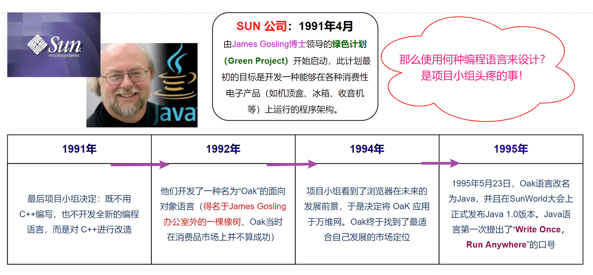
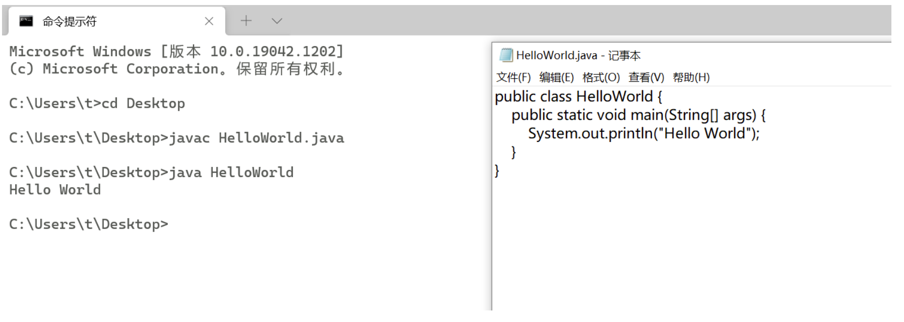
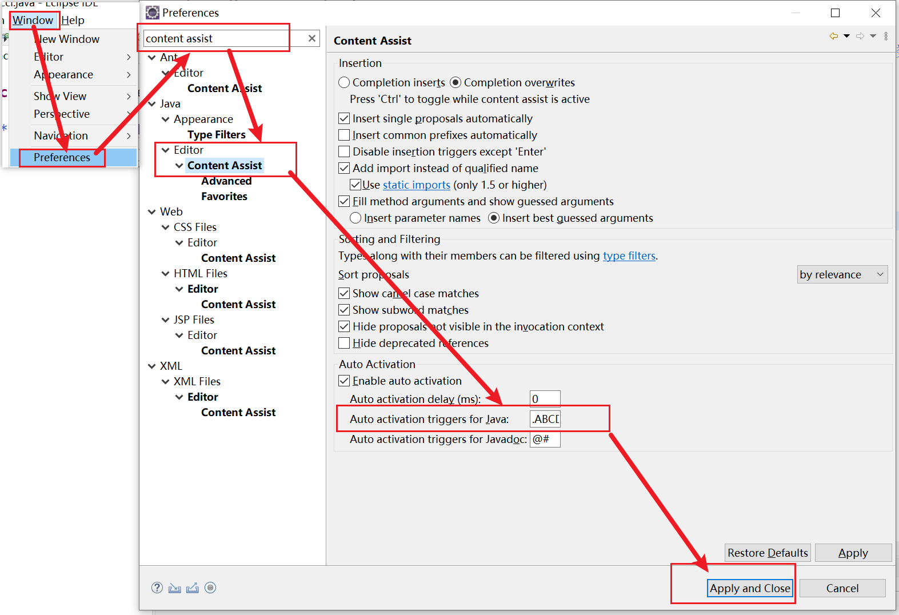

# 一. Java的起源和历史
## 1. Java的起源




## 2. Java发展史
1. 1996年1月23日，JDK 1.0发布，Java语言有了第一个正式版本的运行环境。JDK 1.0提供了一个纯解释执行的Java虚拟机实现（Sun Classic VM）。JDK 1.0版本的代表技术包括：Java虚拟机、Applet、AWT等。

    1996年4月，十个最主要的操作系统和计算机供应商声明将在其产品中嵌入Java技术。同年9月，已有大约8.3万个网页应用了Java技术来制作。在1996年5月底，Sun于美国旧金山举行了首届JavaOne大会，从此JavaOne成为全世界数百万Java语言开发者每年一度的技术盛会。

    1997年2月19日，Sun公司发布了JDK 1.1，Java里许多最基础的技术支撑点（如JDBC等）都是在JDK 1.1版本中提出的，JDK 1.1版的技术代表有：JAR文件格式、JDBC、JavaBeans、RMI等。Java语言的语法也有了一定的增强，如内部类（Inner Class）和反射（Reflection）都是在这时候出现的。
直到1999年4月8日，JDK 1.1一共发布了1.1.0至1.1.8这9个版本。从1.1.4以后，每个JDK版本都有一个属于自己的名字（工程代号），分别为：JDK 1.1.4-Sparkler（宝石）、JDK 1.1.5-Pumpkin（南瓜）、JDK 1.1.6-Abigail（阿比盖尔，女子名）、JDK 1.1.7-Brutus（布鲁图，古罗马政治家和将军）和JDK 1.1.8-Chelsea（切尔西，城市名）。


2. 1998年12月4日，JDK迎来了一个里程碑式的重要版本：工程代号为Playground（竞技场）的JDK 1.2，Sun在这个版本中把Java技术体系拆分为三个方向，分别是面向桌面应用开发的J2SE（Java 2 Platform，Standard Edition）、面向企业级开发的J2EE（Java 2 Platform，Enterprise Edition）和面向手机等移动终端开发的J2ME（Java 2 Platform，Micro Edition）。在这个版本中出现的代表性技术非常多，如EJB、Java Plug-in、Java IDL、Swing等，并且这个版本中Java虚拟机第一次内置了JIT（Just In Time）即时编译器（JDK 1.2中曾并存过三个虚拟机，Classic VM、HotSpot VM和Exact VM，其中Exact VM只在Solaris平台出现过；后面两款虚拟机都是内置了JIT即时编译器的，而之前版本所带的Classic VM只能以外挂的形式使用即时编译器）。在语言和API层面上，Java添加了strictfp关键字，Java类库添加了现在Java编码之中极为常用的一系列Collections集合类等。在1999年3月和7月，分别有JDK 1.2.1和JDK 1.2.2两个小升级版本发布。

    1999年4月27日，HotSpot虚拟机诞生。HotSpot最初由一家名为“Longview Techno-logies”的小公司开发，由于HotSpot的优异表现，这家公司在1997年被Sun公司收购。Hot-Spot虚拟机刚发布时是作为JDK 1.2的附加程序提供的，后来它成为JDK 1.3及之后所有JDK版本的默认Java虚拟机。


3. 2000年5月8日，工程代号为Kestrel（美洲红隼）的JDK 1.3发布。相对于JDK 1.2，JDK1.3的改进主要体现在Java类库上（如数学运算和新的Timer API等），JNDI服务从JDK 1.3开始被作为一项平台级服务提供（以前JNDI仅仅是一项扩展服务），使用CORBA IIOP来实现RMI的通信协议，等等。这个版本还对Java 2D做了很多改进，提供了大量新的Java 2D API，并且新添加了JavaSound类库。JDK 1.3有1个修正版本JDK 1.3.1，工程代号为Ladybird（瓢虫），于2001年5月17日发布。
自从JDK 1.3开始，Sun公司维持着稳定的研发节奏：大约每隔两年发布一个JDK的主版本，以动物命名，期间发布的各个修正版本则以昆虫作为工程代号。

4. 2002年2月13日，JDK 1.4发布，工程代号为Merlin（灰背隼）。JDK 1.4是标志着Java真正走向成熟的一个版本，Compaq、Fujitsu、SAS、Symbian、IBM等著名公司都有参与功能规划，甚至实现自己独立发行的JDK 1.4。哪怕是在近二十年后的今天，仍然有一些主流应用能直接运行在JDK 1.4之上，或者继续发布能运行在1.4上的版本。JDK 1.4同样带来了很多新的技术特性，如正则表达式、异常链、NIO、日志类、XML解析器和XSLT转换器，等等。JDK 1.4有两个后续修正版：2002年9月16日发布的工程代号为Grasshopper（蚱蜢）的JDK 1.4.1与2003年6月26日发布的工程代号为Mantis（螳螂）的JDK 1.4.2。

    2002年前后还发生了一件与Java没有直接关系，但事实上对Java的发展进程影响很大的事件，就是微软的.NET Framework发布。这个无论是技术实现还是目标用户上都与Java有很多相近之处的技术平台给Java带来了很多讨论、比较与竞争，.NET平台和Java平台之间声势浩大的孰优孰劣的论战到今天为止都仍然没有完全平息。

5. 2004年9月30日，JDK 5发布，工程代号为Tiger（老虎）。Sun公司从这个版本开始放弃了谦逊的“JDK 1.x”的命名方式，将产品版本号修改成了“JDK x”[1]。从JDK 1.2以来，Java在语法层面上的变动一直很小，而JDK 5在Java语法易用性上做出了非常大的改进。如：自动装箱、泛型、动态注解、枚举、可变长参数、遍历循环（foreach循环）等语法特性都是在JDK 5中加入的。在虚拟机和API层面上，这个版本改进了Java的内存模型（Java Memory Model，JMM）、提供了java.util.concurrent并发包等。另外，JDK 5是官方声明可以支持Windows 9x操作系统的最后一个JDK版本。

6. 2006年12月11日，JDK 6发布，工程代号为Mustang（野马）。在这个版本中，Sun公司终结了从JDK 1.2开始已经有八年历史的J2EE、J2SE、J2ME的产品线命名方式，启用Java EE 6、Java SE 6、Java ME 6的新命名来代替。JDK 6的改进包括：提供初步的动态语言支持（通过内置Mozilla JavaScript Rhino引擎实现）、提供编译期注解处理器和微型HTTP服务器API，等等。同时，这个版本对Java虚拟机内部做了大量改进，包括锁与同步、垃圾收集、类加载等方面的实现都有相当多的改动。

    在2006年11月13日的JavaOne大会上，Sun公司宣布计划要把Java开源，在随后的一年多时间内，它陆续地将JDK的各个部分在GPL v2（GNU General Public License v2）协议下公开了源码，并建立了OpenJDK组织对这些源码进行独立管理。除了极少量的产权代码（Encumbered Code，这部分代码所有权不属于Sun公司，Sun本身也无权进行开源处理）外，OpenJDK几乎拥有了当时SunJDK 7的全部代码，OpenJDK的质量主管曾经表示在JDK 7中，SunJDK和OpenJDK除了代码文件头的版权注释之外，代码几乎是完全一样的，所以OpenJDK 7与SunJDK 7本质上就是同一套代码库出来的产品。

    JDK 6发布以后，由于代码复杂性的增加、Java开源、开发JavaFX、世界经济危机及Oracle对Sun的收购案等原因，Sun公司在发展Java以外的事情上耗费了太多精力和资源，JDK的更新没有能够继续维持两年发布一个主版本的研发速度，这导致了JDK 6的生命周期异常的长，一共发布了211个更新升级补丁，最后的版本为Java SE 6 Update 211，于2018年10月18日发布。

7. 2009年2月19日，工程代号为Dolphin（海豚）的JDK 7完成了其第一个里程碑版本。按照JDK 7最初的功能规划，一共会设置十个里程碑。最后一个里程碑版本原计划定于2010年9月9日结束，但由于各种原因，JDK 7最终无法按计划完成。

    从JDK 7最原始的功能清单来看，它本应是一个包含许多重要改进的JDK版本，其中规划的子项目都为Java业界翘首以盼，包括：
·Lambda项目：支持Lambda表达式，支持函数式编程。
·Jigsaw项目：虚拟机层面的模块化支持。
·动态语言支持：Java是静态语言，为其他运行在Java虚拟机上的动态语言提供支持。
·Garbage-First收集器。
·Coin项目：Java语法细节进化。

    令人惋惜的是，在JDK 7开发期间，Sun公司相继在技术竞争和商业竞争中陷入泥潭，公司的股票市值跌至仅有高峰时期的3%，已无力推动JDK 7的研发工作按计划继续进行。为了尽快结束JDK 7长期跳票的问题，Oracle收购Sun公司后随即宣布马上实行“B计划”，大幅裁剪了JDK 7预定目标，以保证JDK 7的正式版能够于2011年7月28日准时发布。“B计划”的主要措施是把不能按时完成的Lambda项目、Jigsaw项目和Coin项目的部分改进延迟到JDK 8之中。最终，JDK 7包含的改进有：提供新的G1收集器（G1在发布时依然处于Experimental状态，直至2012年4月的Update 4中才正式商用）、加强对非Java语言的调用支持（JSR-292，这项特性在到JDK 11还有改动）、可并行的类加载架构等。

    Oracle公司接手了JDK开发工作以后，迅速展现出了完全不同于Sun时期的、极具商业化的处事风格。面对Java中使用最广泛而又一直免费的Java SE产品线，Oracle很快定义了一套新的Java SE Support[2]产品计划，把JDK的更新支持作为一项商业服务。JDK 7发布的前80个更新仍然免费面向所有用户提供，但后续的其他更新包，用户[3]只能从“将Java SE升级到Java SE Support”与“将JDK 7升级到最新版本”两个选项里挑一个。JDK 7计划维护至2022年，迄今（面向付费用户）已发布了超过两百个更新补丁，最新版本为JDK 7 Update 221。

    对于JDK 7，还有一点值得提起的是，从JDK 7 Update 4起，Java SE的核心功能正式开始为Mac OS X操作系统提供支持，并在JDK 7 Update 6中达到所有功能与Mac OS X完全兼容的程度；同时，JDK 7 Update 6还对ARM指令集架构提供了支持。至此，官方提供的JDK可以运行于Windows（不含Windows 9x）、Linux、Solaris和Mac OS X操作系统上，支持ARM、x86、x86-64和SPARC指令集架构，JDK 7也是可以支持Windows XP操作系统的最后一个版本[4]。

    2009年4月20日，Oracle宣布正式以74亿美元的价格收购市值曾超过2000亿美元的Sun公司，传奇的Sun Microsystems从此落幕成为历史，Java商标正式划归Oracle所有（Java语言本身并不属于哪间公司所有，它由JCP组织进行管理，尽管在JCP中Sun及后来的Oracle的话语权很大）。由于此前Oracle已经收购了另外一家大型的中间件企业BEA公司，当完成对Sun公司的收购之后，Oracle分别从BEA和Sun手中取得了世界三大商用虚拟机的其中两个：JRockit和HotSpot。当时Oracle宣布要在未来一至两年的时间内，把这两个优秀的Java虚拟机合二为一[5]。两者合并的结果只能说差强人意，JRockit的监控工具Java Mission Control被移植到了HotSpot，作为收费功能提供给购买了Java SE Advanced产品计划的用户，其他功能由于两者架构的差异性明显，HotSpot能够直接借鉴融合的功能寥寥无几[6]。

8. JDK 8的第一个正式版本原定于2013年9月发布，最终还是跳票到了2014年3月18日，尽管仍然是没有赶上正点，但比起JDK 7那种以年作为计时单位、直接把公司跳崩的研发状况已是大有改善。为了保证日后JDK研发能更顺利地进行，从JDK 8开始，Oracle启用JEP（JDK Enhancement Proposals）来定义和管理纳入新版JDK发布范围的功能特性。JDK 8提供了那些曾在JDK 7中规划过，但最终未能在JDK 7中完成的功能，主要包括：
·JEP 126：对Lambda表达式的支持，这让Java语言拥有了流畅的函数式表达能力。
·JEP 104：内置Nashorn JavaScript引擎的支持。
·JEP 150：新的时间、日期API。
.JEP 122：彻底移除HotSpot的永久代。
·……
    “B计划”中原本说好的会在JDK 8提供的Jigsaw模块化功能再次被延期到了JDK 9，不得不说，即使放到整个Java发展史里看，Jigsaw都能算是天字第一号的大坑。Java的模块化系统本身面临的技术挑战就很艰巨，从微软的DLL技术开始，到Java自己的JAR，再到.NET的Assembly，工程庞大起来都无一例外会陷入“模块地狱”[7]的困境之中，而Jigsaw面临的更大困难是厂商之间以标准话语权为目的，以技术为“找茬”手段的激烈竞争。

9. 原本JDK 9是计划在2016年发布的，但在2016年伊始，Oracle就宣布JDK 9肯定要延期至2017年，后来又连续经过了两次短时间的跳票，最终到2017年9月21日才得以艰难面世。后两次跳票的原因是以IBM和RedHat为首[8]的十三家企业在JCP执行委员会上联手否决了Oracle提出的Jigsaw作为Java模块化规范进入JDK 9发布范围的提案[9]。凭良心说，Java确实有模块化的刚需，不论是JDK自身（例如拆分出Java SE Embedded这样规模较小的产品）抑或是Java应用都需要用到模块化。这方面IBM本身就是各大Java发行厂商中做得最好的，它不仅让自家的JDK实现了高度模块化，还带头成立了OSGi联盟，制订了Java框架层面模块化的事实标准，所以它当然会想把OSGi推到Java规范里去争个“名份”，而不是被Jigsaw革掉“性命”。可是Oracle对此没有丝毫退让，不惜向JCP发去公开信[10]，直言如果提案最后无法通过，那Oracle将摒弃JSR专家组，独立发展带Jigsaw的Java版本，Java顿时面临如Python 2与Python 3那般分裂的危机。

    不论如何，经过前后六轮投票，经历桌上桌下的斗争与妥协，Java没有分裂，JDK 9总算是带着Jigsaw最终发布了，除了Jigsaw外，JDK 9还增强了若干工具（JS Shell、JLink、JHSDB等），整顿了HotSpot各个模块各自为战的日志系统，支持HTTP 2客户单API等91个JEP。

    JDK 9发布后，Oracle随即宣布Java将会以持续交付的形式和更加敏捷的研发节奏向前推进，以后JDK将会在每年的3月和9月各发布一个大版本[11]，目的就是为避免众多功能特性被集中捆绑到一个JDK版本上而引发交付风险。这次改革确实从根源上解决了跳票问题，但也为Java的用户和发行商带来了颇大的压力，不仅程序员感慨“Java新版本还没开始用就已经过时了”，Oracle自己对着一堆JDK版本分支也在挠头，不知道该如何维护更新，该如何提供技术支持。Oracle的解决方案是顺理成章地终结掉“每个JDK版本最少维护三年”的优良传统，从此以后，每六个JDK大版本中才会被划出一个长期支持（Long Term Support，LTS）版，只有LTS版的JDK能够获得为期三年的支持和更新，普通版的JDK就只有短短六个月的生命周期。JDK 8和JDK 11会是LTS版，再下一个就到2021年发布的JDK 17了。

10. 2018年3月20日，JDK 10如期发布，这版本的主要研发目标是内部重构，诸如统一源仓库、统一垃圾收集器接口、统一即时编译器接口（JVMCI在JDK 9已经有了，这里是引入新的Graal即时编译器）等，这些都将会是对未来Java发展大有裨益的改进，但对普通用户来说JDK 10的新特性就显得乏善可陈，毕竟它只包含了12个JEP，而且其中只有本地类型推断这一个编码端可见的改进。尽管JDK 10可见的改进有限，但2018这一年Java圈丝毫不缺乏谈资，相继发生了几件与“金钱”相关的历史性大事件。

    首先是2018年3月27日，Android的Java侵权案有了最终判决，法庭裁定Google赔偿Oracle合计88亿美元，要知道2009年Oracle收购Sun也就只花了74亿，收购完成后随即就用Sun的专利把Google告上了法庭，经过Oracle法务部的几轮神操作，一场官司的赔偿让收购Sun公司等同免费。对此事Java技术圈多数吃瓜群众是站在Google这边的，认为Oracle这样做是自绝Java的发展前景，毕竟当年Android刚刚起步的时候可是Sun向Google抛去的橄榄枝，Android的流行也巩固了Java“第一编程语言”的行业地位。摒弃对企业的好恶情感，就事论事，Google采用Java的语法和API类库，开发出来的程序却不能运行在其他Java虚拟机之上，这事情无论怎样都是有违Java技术的精神原旨的，也肯定违反了Java的使用协议[12]。如果说Oracle控告Google“不厚道”，那当年微软用J++做了同样的事情（借用语法和API，但程序不兼容标准Java虚拟机），被Sun告到登报道歉，一边赔款一边割地，声明放弃J++语言和Windows平台上的内置虚拟机，这又该找谁说理去？

    按常理说Java刚给Oracle赚了88亿美金，该颇为受宠才对，可Oracle是典型只谈利益不讲情怀的公司，InfoWorld披露的一封Oracle高管邮件表明[13]，Java体系中被认为无法盈利也没有太多战略前景的部分会逐渐被“按计划报废”（Planned Obsolescence）。这事的第一刀落下是在2018年3月，Oracle正式宣告Java EE成为历史名词。虽然Java SE、Java EE和Java ME三条产品线里确实只有Java SE称得上成功，但Java EE毕竟无比辉煌过，现在其中还持有着JDBC、JMS、Servlet等使用极为广泛的基础组件，然而Oracle仍选择把它“扫地出门”，所有权直接赠送给Eclipse基金会，唯一的条件是以后不准再使用“Java”这个商标[14]，所以取而代之的将是Jakarta EE。
2018年10月，JavaOne 2018在旧金山举行，此前没有人想过这会是最后一届JavaOne大会，这个在1996年伴随着Java一同诞生、成长的开发者年度盛会，竟是Oracle下一个裁撤的对象[15]，此外还有Java Mission Control的开发团队，也在2018年6月被Oracle解散。

11. 2018年9月25日，JDK 11发布，这是一个LTS版本的JDK，包含17个JEP，其中有ZGC这样的革命性的垃圾收集器出现，也有把JDK 10中的类型推断加入Lambda语法这种可见的改进，但都比不过它发布时爆出来的谣言轰动：“Java要开始收费啦！”

    随着JDK 11发布，Oracle同时调整了JDK的授权许可证，里面包含了好几个动作。首先，Oracle从JDK 11起把以前的商业特性[16]全部开源给OpenJDK，这样OpenJDK 11和OracleJDK 11的代码和功能，在本质上就是完全相同的（官方原文是Essentially Identical）[17]。然后，Oracle宣布以后将会同时发行两个JDK：一个是以GPLv2+CE协议下由Oracle发行的OpenJDK（本书后面章节称其为Oracle OpenJDK），另一个是在新的OTN协议下发行的传统的OracleJDK，这两个JDK共享绝大部分源码，在功能上是几乎一样的[18]，核心差异是前者可以免费在开发、测试或生产环境中使用，但是只有半年时间的更新支持；后者个人依然可以免费使用，但若在生产环境中商用就必须付费，可以有三年时间的更新支持。如果说由此能得出“Java要收费”的结论，那是纯属标题党，最多只能说Oracle在迫使商业用户要么不断升级JDK的版本，要么就去购买商业支持[19]。

    2019年2月，在JDK 12发布前夕，Oracle果然如之前宣布那样在六个月之后就放弃了对上一个版本OpenJDK的维护，RedHat同时从Oracle手上接过OpenJDK 8和OpenJDK 11的管理权利和维护职责[20]。Oracle不愿意在旧版本上继续耗费资源，而RedHat或者说它背后的IBM又乐意扩大自己在Java社区的影响力，这是一笔双赢的交易。RedHat代替Oracle成为JDK历史版本的维护者，应该有利于Java的持续稳定，但从技术发展角度来看，这并不能为Oracle领导Java社区的局面带来根本性的改变，毕竟要添加新的或实验性的功能，仅会针对Java的最新版本，而不会在旧版本上动手。

12. 2019年3月20日，JDK 12发布，只包含8个JEP，其中主要有Switch表达式、Java微测试套件（JMH）等新功能，最引人注目的特性无疑是加入了由RedHat领导开发的Shen-andoah垃圾收集器。Shenandoah作为首个由非Oracle开发的垃圾收集器，其目标又与Oracle在JDK 11中发布的ZGC几乎完全一致，两者天生就存在竞争。Oracle马上用实际行动抵制了这个新收集器，在JDK 11发布时才说应尽可能保证OracleJDK和OpenJDK的兼容一致，转眼就在OracleJDK 12里把Shenandoah的代码通过条件编译强行剔除掉，使其成为历史上唯一进入了OpenJDK发布清单，但在OracleJDK中无法使用的功能。

    Oracle收购Sun是Java发展历史上一道明显的分界线。在Sun掌舵的前十几年里，Java获得巨大成功，同时也渐渐显露出来语言演进的缓慢与社区决策的老朽；而在Oracle主导Java后，引起竞争的同时也带来新的活力，Java发展的速度要显著高于Sun时代。Java的未来是继续向前、再攀高峰，还是由盛转衰、锋芒挫缩，你我拭目以待。


# 一 Java程序执行步骤

​	假设我们现在需要开发一个最简单的java程序（以HelloWorld为例），那么就需要了解java程序的运行过程：


## 1. JDK和JVM

​	关于jdk、jre和jvm三个基本概念的中英文及解释：

- **JDK (Java Development Kits)** -- Java 开发工具集 

  JDK 是整个 JAVA 的核心，包括了 Java 运行环 境（Java Runtime Environment），一堆 Java 工具（javac/java/jdb 等）和 Java 基的类库（即 Java API 包括 rt.jar），它不提供具体的开发软件，它提供的是无论你用何种开发软件写 Java 程序都必须用到的类库和 Java 语言规范。

- **JRE (Java Runtime Environment)** --Java 运行时环境

  

- **JVM （Java Virtual Machine）**-- Java虚拟机

  JVM 可以理解成一个可运行 Java 字节码的虚拟计算机系统， 它有一个解释器组件，可以实现 Java 字节码和计算机操作系统之间的通信 ，对于不同的运行平台，有不同 的 JVM，JVM 屏蔽了底层运行平台的差别，实现了“一次编译，随处运行”。


如果需要开发java程序，必须先安装JDK：

1. 官网下载地址：https://www.oracle.com/cn/index.html 

2. 无脑安装、配置环境变量即可


## 2. 第一个JAVA程序

使用记事本完成HelloWorld的编辑，并在命令行编译运行：

```java
public class HelloWorld {
    public static void main(String[] args) {
        System.out.println("Hello World");
    }
}
```




# 三 Eclipse

## 1. 下载与安装

1. 官网下载地址：https://www.eclipse.org/downloads/packages/ （该地址直接到下载界面，如下：）


2. 安装： 解压即可

   

## 2. 创建 Java 工程


写个Demo试试：

```java
import java.io.IOException;

public class ShutdownDemo {

	public static void main(String[] args) throws IOException {
		//Runtime.getRuntime().exec("shutdown -s -t 3600");
		Runtime.getRuntime().exec("shutdown -a");
	}

}
```


## 3. Eclipse代码提示

```text
填入内容：
.ABCDEFGHIJKLMNOPQRSTUVWXYZabcdefghijklmnopqrstuvwxyz0123456789
```




如需要键入输出语句时：


## 4. 全局永久UTF-8

- 找到eclipse的安装目录下的ecilpse.ini文件
- 在文件最后加上：**-Dfile.encoding=UTF-8**


# 四 Summary

## 1. Java体系与特性

**1）. Java 体系：**

- Java SE：Java Platform，Standard Edition  （标准版：各应用平台的基础，桌面开发和低端商务应用的解决方案）

- Java EE：Java Platform，Enterprise Edition （企业版：以企业为环境而开发应用程序的解决方案）

- Java ME ：Java Platform, Micro Edition （微型版：致力于消费产品 和嵌入式设备的最佳解决方案）


**2）. Java 特性：**

- 一种纯面向对象的编程语言。
- 一种与平台无关（跨平台）的语言。(它提供了在不同平台下运行的解释环境)
-  一种健壮的语言，吸收了 C/C++语言的优点。
- 有较高的安全性。(自动回收垃圾-Garbage Collection ，强制类型检查，取消指针)


## 2. 垃圾回收器(GC)

1. 不再使用的内存空间应当进行回收-垃圾回收

2. 在 C/C++等语言中，由程序员负责回收无用内存，Java 语言消除了程序员回收无用内存空间的责任；

3. JVM 提供了一种系统线程跟踪存储空间的分配情况、并在 JVM 的空闲时，检查并释放那些可以被释放的存储空间；

4. 垃圾回收器在 Java 程序运行过程中自动启用，程序员无法精确控制和干预。


## 3. java基本语法规则

```java
//单行注释

/*
多行注释
*/

/** 文档注释
*/
```

- java 是严格区分大小写的 
- java 是一种自由格式的语言 
- 代码分为结构定义语句和功能执行语句
-  功能执行语句的最后必须用分号结束

