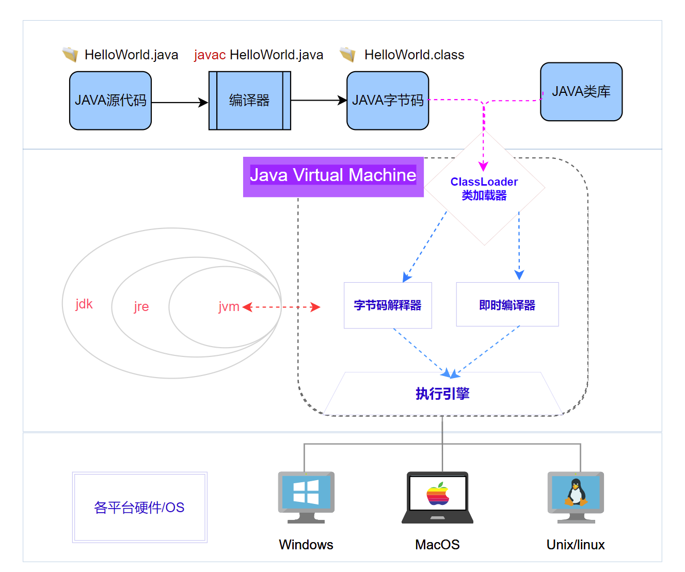
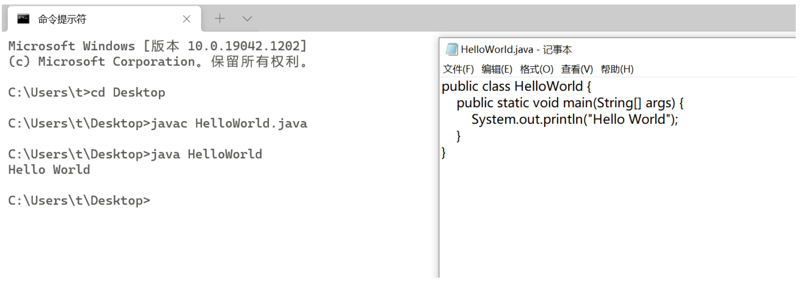
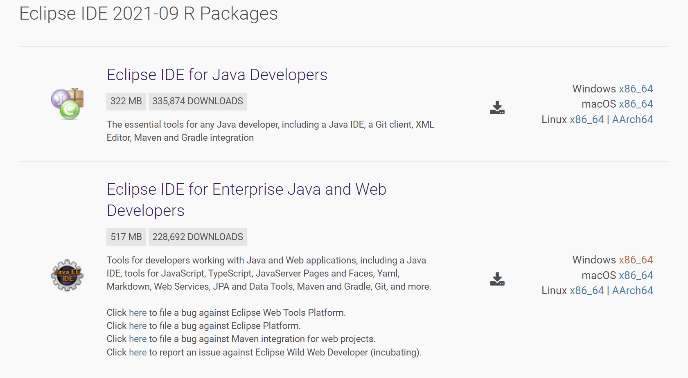
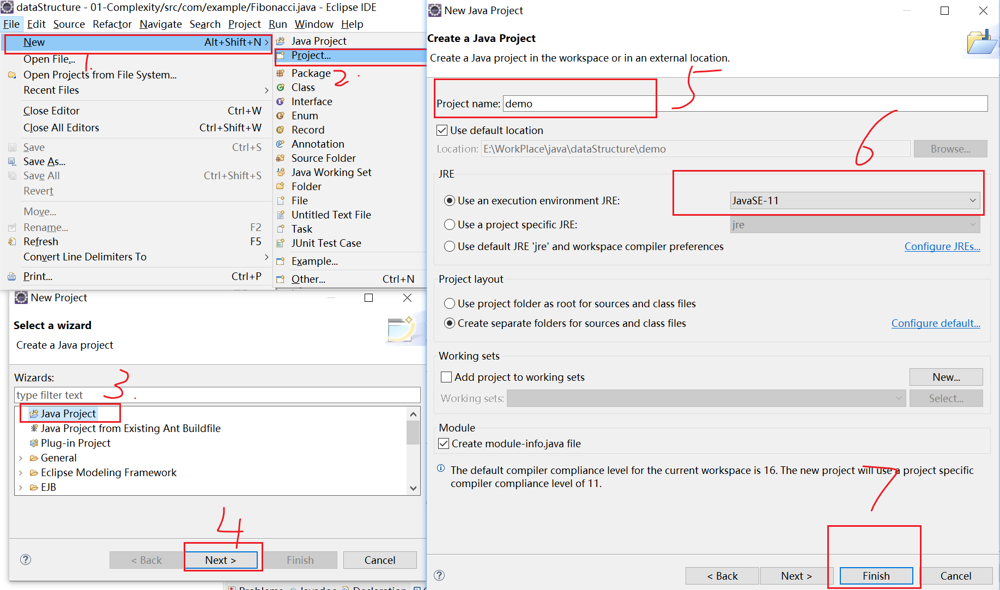
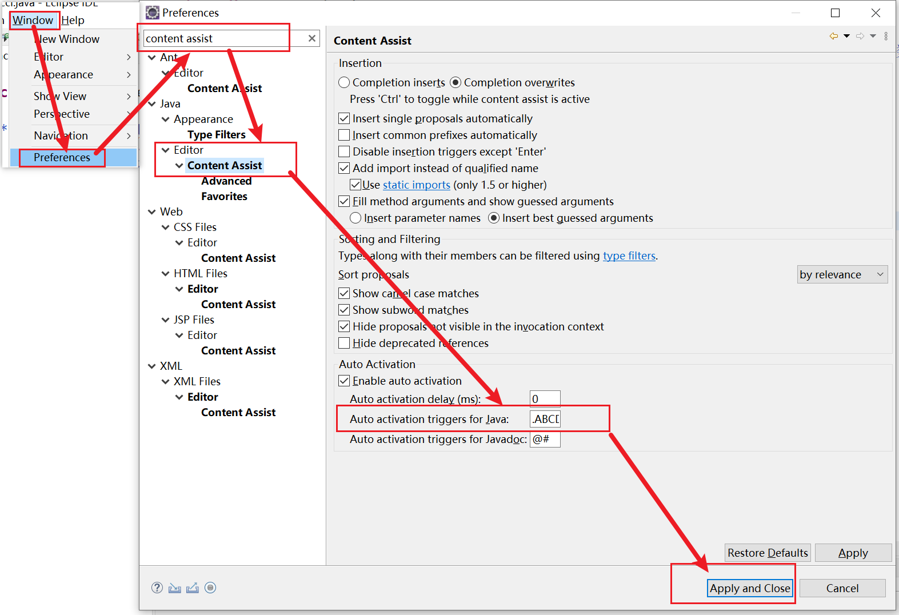
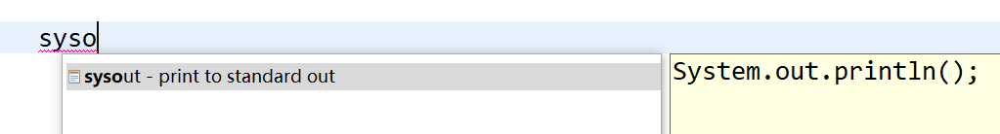

# 1. Java程序执行步骤

​	假设我们现在需要开发一个最简单的java程序（以HelloWorld为例），那么就需要了解java程序的运行过程：




# 2. JDK和JVM

​	关于jdk、jre和jvm三个基本概念的中英文及解释：

- **JDK (Java Development Kits)** -- Java 开发工具集 

  JDK 是整个 JAVA 的核心，包括了 Java 运行环 境（Java Runtime Environment），一堆 Java 工具（javac/java/jdb 等）和 Java 基的类库（即 Java API 包括 rt.jar），它不提供具体的开发软件，它提供的是无论你用何种开发软件写 Java 程序都必须用到的类库和 Java 语言规范。

- **JRE (Java Runtime Environment)** --Java 运行时环境

  

- **JVM （Java Virtual Machine）**-- Java虚拟机

  JVM 可以理解成一个可运行 Java 字节码的虚拟计算机系统， 它有一个解释器组件，可以实现 Java 字节码和计算机操作系统之间的通信 ，对于不同的运行平台，有不同 的 JVM，JVM 屏蔽了底层运行平台的差别，实现了“一次编译，随处运行”。


如果需要开发java程序，必须先安装JDK：

1. 官网下载地址：https://www.oracle.com/cn/index.html

2. 无脑安装、配置环境变量即可


# 3. 第一个JAVA程序

使用记事本完成HelloWorld的编辑，并在命令行编译运行：

```java
public class HelloWorld {
    public static void main(String[] args) {
        System.out.println("Hello World");
    }
}
```



# 4. Eclipse

1. 官网下载地址：https://www.eclipse.org/downloads/packages/ （该地址直接到下载界面，如下：）




2. 安装： 解压即可

   

3. eclipse 创建 Java 工程




写个Demo试试：

```java
import java.io.IOException;

public class ShutdownDemo {

	public static void main(String[] args) throws IOException {
		//Runtime.getRuntime().exec("shutdown -s -t 3600");
		Runtime.getRuntime().exec("shutdown -a");
	}

}
```


4. eclipse的一些实用小技巧（代码提示）

   ```text
   填入内容：
   .ABCDEFGHIJKLMNOPQRSTUVWXYZabcdefghijklmnopqrstuvwxyz0123456789
   ```

   

   

   如需要键入输出语句时：




# 5. Summary

**1. Java 体系与特点：**

- Java SE：Java Platform，Standard Edition  （标准版：各应用平台的基础，桌面开发和低端商务应用的解决方案）

- Java EE：Java Platform，Enterprise Edition （企业版：以企业为环境而开发应用程序的解决方案）

- Java ME ：Java Platform, Micro Edition （微型版：致力于消费产品 和嵌入式设备的最佳解决方案）


**2. Java 的特性：**

- 一种纯面向对象的编程语言。
- 一种与平台无关（跨平台）的语言。(它提供了在不同平台下运行的解释环境)
-  一种健壮的语言，吸收了 C/C++语言的优点。
- 有较高的安全性。(自动回收垃圾-Garbage Collection ，强制类型检查，取消指针)


​	垃圾回收器(GC)：

1. 不再使用的内存空间应当进行回收-垃圾回收

2. 在 C/C++等语言中，由程序员负责回收无用内存，Java 语言消除了程序员回收无用内存空间的责任；

3. JVM 提供了一种系统线程跟踪存储空间的分配情况、并在 JVM 的空闲时，检查并释放那些可以被释放的存储空间；

4. 垃圾回收器在 Java 程序运行过程中自动启用，程序员无法精确控制和干预。


**3. java 程序的三种注释方式**

```java
//单行注释

/*
多行注释
*/

/** 文档注释
*/
```


**4. 语法规则** 

- java 是严格区分大小写的 
- java 是一种自由格式的语言 
- 代码分为结构定义语句和功能执行语句
-  功能执行语句的最后必须用分号结束