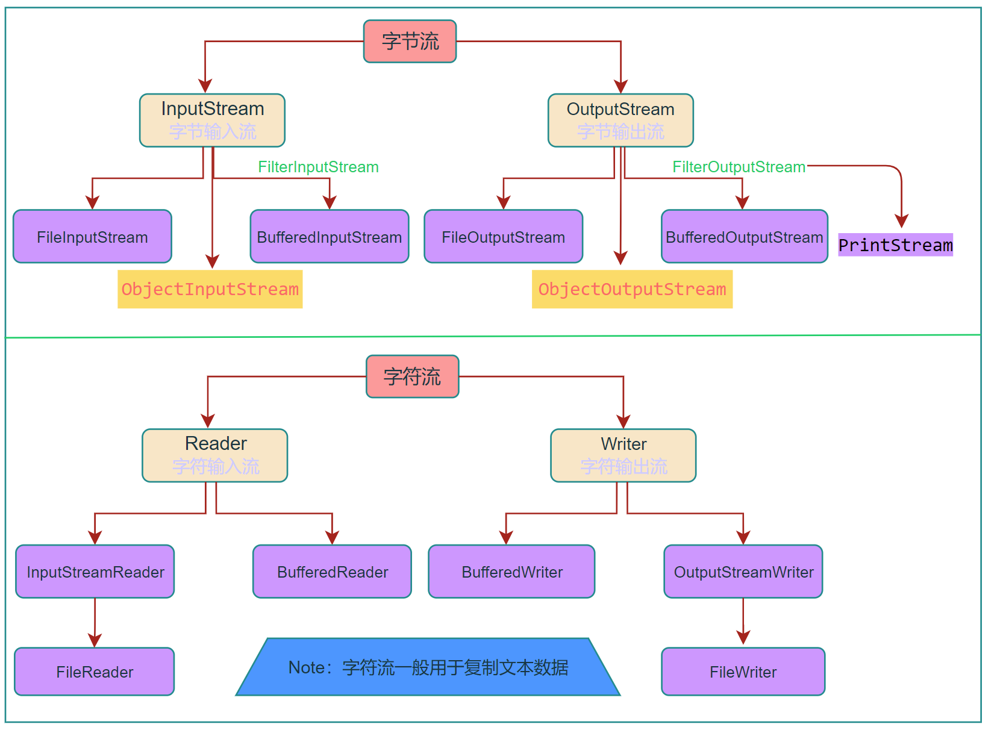

# 一 JavaIO

Java中所有数据都是使用流读写的。流是一组有序的数据序列，将数据从一个地方带到另一个地方。根据数据流向的不同，可以分为输入（Input）流和输出（Output）流两种。


## 1. File类

File类是文件和目录路径名的抽象表示，文件和目录都可以通过File封装成对象，对于File而言，其封装的并不是一个真正存在的文件，仅仅是一个路径名而已。它可以是存在的，也可以是不存在的。将来可以通过具体的操作把这个路径的内容转换为具体存在

- File 类是 java.io 包中唯一代表磁盘文件本身的对象
- File 类不能访问文件内容本身，如果需要访问文件内容本身，则需要使用输入/输出流

| 构造方法                          | 说明                                                       |
| --------------------------------- | ---------------------------------------------------------- |
| File(String pathname)             | 通过将给定的路径名字符串转换为抽象路径名来创建新的File实例 |
| File(String parent, String child) | 从父路径名字符串和子路径名字符串创建新的File实例           |
| File(File parent, String child)   | 从父抽象路径名和子路径名字符串创建新的File实例             |

```java
File dataDir = new File(".\\data");
File file1 = new File(dataDir, "a.txt");
File file2 = new File(".\\data\\b.txt");
```


**创建、删除文件/目录**：

| 方法名称                       | 说明                                                         |
| ------------------------------ | ------------------------------------------------------------ |
| public boolean createNewFile() | 当文件不存在时，创建一个空文件                               |
| boolean mkdir()                | 创建一个目录，它的路径名由当前 File 对象指定                 |
| boolean mkdirs()               | 创建一个目录，它的路径名由当前 File 对象指定                 |
| boolean delete()               | 删除当前对象指定的文件或空目录                               |
| boolean renameTo(File)         | 将当前 File 对象指定的文件更名为给定参数 File 指定的路径名（剪贴） |

- 如果被重命名的文件已存在，那么renameTo()不会成功
- renameTo()成功后，原文件会被删除

```java
if (!dataDir.exists()) dataDir.mkdir();
if(!file1.exists()) file1.createNewFile();
```


**File类相关判断方法**：

| 方法名称              | 说明                                             |
| --------------------- | ------------------------------------------------ |
| boolean exists()      | 测试当前 File 是否存在                           |
| boolean isAbsolute()  | 测试当前 File 对象表示的文件是否为一个绝对路径名 |
| boolean isDirectory() | 测试当前 File 对象表示的文件是否为一个路径       |
| boolean isFile()      | 测试当前 File 对象表示的文件是否为一个“普通”文件 |
| boolean canRead()     | 测试应用程序是否能从指定的文件中进行读取         |
| boolean canWrite()    | 测试应用程序是否能写当前文件                     |


**File类相关的获取功能**：

| 方法名称                      | 说明                                                         |
| ----------------------------- | ------------------------------------------------------------ |
| String getAbsolutePath()      | 返回由该对象表示的文件的绝对路径名                           |
| String getName()              | 返回表示当前对象的文件名或路径名（如果是路径，则返回最后一级子路径名） |
| String getParent()            | 返回当前 File 对象所对应目录（最后一级子目录）的父目录名     |
| long lastModified()           | 返回当前 File 对象表示的文件最后修改的时间                   |
| long length()                 | 返回当前 File 对象表示的文件长度                             |
| String[] list()               | 返回当前 File 对象指定的路径文件列表                         |
| String[] list(FilenameFilter) | 返回当前 File 对象指定的目录中满足指定过滤器的文件列表       |


**File 类中有以下两个常用常量**：（File 类出现较早，当时并没有对命名规范有严格的要求）

- `pathSeparator`：分隔连续多个路径字符串的分隔符
- `separator`：目录分隔符

```java
public static final String pathSeparator //Windows下指`;`
public static final String separator     //Windows下指`/`
```


## 2. 流的分类

数据流是 Java 进行 I/O 操作的对象，它按照不同的标准可以分为不同的类别。

- 按照流的方向主要分为：输入流、输出流
- 数据流按照数据单位的不同分为：字节流、字符流
- 按照功能可以划分为：节点流、处理流





## 3. 系统流和编码

每个 Java程序运行时都带有一个系统流，系统流对应的类为 java.lang.System。Sytem 类封装了 Java 程序运行时的 3 个系统流：

- `System.in`：标准输入流，默认设备是键盘
- `System.out`：标准输出流，默认设备是控制台
- `System.err`：标准错误流，默认设备是控制台


- System.in 是 InputStream 类的一个对象

- System.out 和 System.error 是 PrintStream 类的对象

```java
public final static InputStream in = null;
public final static PrintStream out = null;
public final static PrintStream err = null;
```


**Java 中常见编码说明如下**：

- `ISO8859-1`：属于单字节编码，最多只能表示 0~255 的字符范围。向下兼容ASCII
- `GBK/GB2312`：中文的国标编码，用来表示汉字，属于双字节编码。GBK 可以表示简体中文和繁体中文，而 GB2312 只能表示简体中文。GBK 兼容 GB2312。
- `Unicode`：是一种编码规范，是为解决全球字符通用编码而设计的。UTF-8 和 UTF-16 是这种规范的一种实现，此编码不兼容 ISO8859-1 编码。Java 内部采用此编码。
- `UTF`：UTF 编码兼容了 ISO8859-1 编码，同时也可以用来表示所有的语言字符，不过 UTF 编码是不定长编码，每一个字符的长度为 1~6 个字节不等。一般在中文网页中使用此编码，可以节省空间。

```java
 // 获取当前系统编码
 System.out.println("系统默认编码：" + System.getProperty("file.encoding"));
```


## 4. 字节流

**字节输出流**：（OutputStream 类的常用方法）

- `void write(int b)`：写入一个字节（参数是 int 类型），为了提高 I/O 操作的效率，建议尽量使用 write() 方法的另外两种形式
- `void write(byte[] b)`：把字节数组中的所有字节写到输出流中
- `void write(byte[] b,int off,int len)`：off 指定字节 数组中的起始下标，len 表示元素个数
- `void close()`：关闭输出流
- `void flush()`：使用 flush() 方法则可以强制将缓冲区中的数据写入输出流， 并清空缓冲区

在创建 FileOutputStream 类的对象时，如果指定的文件不存在，则创建一个新文件；如果文件已存在，则清除原文件的内容重新写入

```java
public class OutputStreamDemo {
    public static void main(String[] args) throws IOException {
        FileOutputStream fos = new FileOutputStream(".\\data\\output.txt",true); //append为true表示追加写入
        // 1. 写入指定字节
        fos.write(97);  //a
        fos.write(98);
        fos.write(99);

        // 2. 写入字节数组
        byte[] b = {',',97,98,99,100};
        byte[] b2 = ",abcde".getBytes();
        fos.write(b);
        fos.write(b2);
        //      指定写入的字节数组内容
        fos.write(b2,0,b2.length);

        // 3. 写数据时如何实现换行？ （各个操作系统的换行符不同 win: \r\n  mac: \r  linux: \n ）
        fos.write("\n\r".getBytes());
        for (int i = 0; i < 5; i++) {
            fos.write("Hello\n\r".getBytes());
        }
        fos.close();
    }
}
```


**字节输入流**：（InputStream 类的常用方法）

- `int read()`：从输入流中读取一个 8 位的字节，并把它转换为 0~255 的整数，最后返回整数

  如果返回 -1，则表示已经到了输入流的末尾。为了提高 I/O 操作的效率，建议尽量使用 read() 方法的另外两种形式

- `int read(byte[] b)`：从输入流中读取若干字节，并把它们保存到字节数组中

- `int read(byte[] b, int off, int len)`：off 指定在字节数组中开始保存数据的起始下标；len 指定读取的字节数

- `void close()`：关闭输入流

- `int available()`：返回可以从输入流中读取的字节数


- `long skip(long n)`：从输入流中跳过参数 n 指定数目的字节。该方法返回跳过的字节数
- `void mark(int readLimit)`：在输入流的当前位置开始设置标记
- `boolean markSupported()`：判断当前输入流是否允许设置标记，是则返回 true，否则返回 false
- `void reset()`：将输入流的指针返回到设置标记的起始处


## 5. 复制图片

【应用】：利用字节流复制图片

```java
// 复制图片
public class CopyPicture {
    public static void main(String[] args) {
        try {
            FileInputStream fis = new FileInputStream(".\\data\\io\\abc.png");
            FileOutputStream fos = new FileOutputStream(".\\data\\io\\abc_copy.png");
            byte[] bys = new byte[1024];
            int len;
            while ((len = fis.read(bys)) != -1){
                fos.write(bys,0,len);
            }
            fis.close();
            fos.close();
        } catch (IOException e) {
            e.printStackTrace();
        }
    }
}
```


## 6. 字节缓冲流

```java
BufferedOutputStream(QutputStream out)  // 字节缓冲输出流
BuffecedInputStream(lnputStream in)     // 字节缓冲输入流
```

为什么构造方法需要的是字节流，而不是具体的文件或者路径呢?

- 因为字节缓冲流**仅仅提供缓冲区**，而真正的读写数据还得依靠基本的字节流对象进行操作

```java
public class BufferStreamDemo {
    public static void main(String[] args) throws Exception{
        // 字节缓冲输出流：
        FileOutputStream fos = new FileOutputStream(".\\data\\buffer\\buffer.txt");
        BufferedOutputStream bos = new BufferedOutputStream(fos);
        bos.write("Hello\r\n".getBytes());
        bos.write("World\r\n".getBytes());
        bos.close();

        // 字节缓冲输入流：
        FileInputStream fis = new FileInputStream(".\\data\\buffer\\buffer.txt");
        BufferedInputStream bis = new BufferedInputStream(fis);
        bis.mark(1);  // 设置标记
        // 一次读取一个字节：
        int b;
        while ((b= bis.read())!= -1){
            System.out.print((char) b);
        }
        bis.reset();  // 将输入流的指针返回到设置标记的起始处
        // 一次读取一个字节数组：
        byte[] bys = new byte[1024];
        int len;
        while ((len= bis.read(bys)) != -1){
            System.out.println(new String(bys,0,len));
        }
        bis.close();
    }
}
```


## 7. 字符流

**InputStreamReader和OutputStreamWriter**：

```java
// 构造函数
public InputStreamReader(InputStream in)       // 字符输入流
public OutputStreamWriter(OutputStream out)    // 字符输出流
```


**Reader类中的read()方法**：

| 方法名及返回值类型                      | 说明                                                         |
| --------------------------------------- | ------------------------------------------------------------ |
| int read()                              | 从输入流中读取一个字符，并把它转换为 0~65535 的整数          |
| int read(char[] cbuf)                   | 从输入流中读取若干个字符，并把它们保存到指定的字符数组中     |
| int read(char[] cbuf, int off, int len) | off 指定在字符数组中开始保存数据的起始下标，len 指定读取的字符数 |


**Writer类中的write()方法和append()方法**：

| 方法名及返回值类型                           | 说明                                                       |
| -------------------------------------------- | ---------------------------------------------------------- |
| void write(int c)                            | 向输出流中写入一个字符                                     |
| void write(char[] cbuf)                      | 把字符数组中的所有字符写到输出流中                         |
| void write(char[] cbuf,int off,int len)      | off 指定 字符数组中的起始下标，len 表示元素个数            |
| void write(String str)                       | 向输出流中写入一个字符串                                   |
| void write(String str,  int off, int len)    | off 指定字符串中的起 始偏移量，len 表示字符个数            |
| append(char c)                               | 将参数 c 指定的字符添加到输出流中                          |
| append(charSequence esq)                     | 将参数 esq 指定的字符序列添加到输出流中                    |
| append(charSequence esq, int start, int end) | start 指第一个字符的索引，end 指最后一个字符后面的字符索引 |

```java
public class CharStreamDemo {
    public static void main(String[] args) throws Exception {
        FileInputStream fis = new FileInputStream(".\\data\\charstream\\a.txt");
        FileOutputStream fos = new FileOutputStream(".\\data\\charstream\\a.txt");
        InputStreamReader isr = new InputStreamReader(fis);
        OutputStreamWriter osw = new OutputStreamWriter(fos);

        // 多种写入方式
        osw.write(97);                        //写入一个字符 a  相当于：osw.write('a');
        osw.append('b');
        osw.write("abc");                    // 写入字符串
        osw.write("uvwxyz", 0, 3);   // off 指定字符串中的起始偏移量，len表示字符个数
        osw.flush();
        //写入字符数组：
        char[] chs = {'x', 'y', 'z'};
        osw.write(chs);                        // 把字符数组中的所有字符写到输出流中
        osw.write(chs, 0, 2);
        osw.close();

        //  一次读一个字符数据
        /*int ch;
        while ((ch = isr.read()) != -1) {
            System.out.print((char) ch);
        }*/

        // 一次读取一个字符数组数据
        char[] chsArr = new char[1024];
        int len;
        while ((len = isr.read(chsArr)) != -1) {
            System.out.println(new String(chsArr, 0, len));
        }
    }
}
```


**FileReader和FileWriter**：

```java
// 构造函数
public FileReader(String fileName) throws FileNotFoundException {
    super(new FileInputStream(fileName));
}

public FileWriter(String fileName) throws IOException {
    super(new FileOutputStream(fileName));
}
```

相较于InputStreamReader和OutputStreamWriter，FileReader和FileWriter不用再自行定义字节流了。省了一小步。。。

```java
public class FileReaderDemo {
    public static void main(String[] args) throws Exception{
        FileReader fr = new FileReader(".\\data\\charstream\\a.txt");
        FileWriter fw = new FileWriter(".\\data\\charstream\\a_copy.txt");
        // int ch;
        // while ((ch = fr.read())!= -1){
        //   fw.write(ch);
        // }

        // 按数组读写
        char[] chs = new char[1024];
        int len;
        while ((len=fr.read(chs))!=-1){
            fw.write(chs,0,len);
        }
        fr.close();
        fw.close();
    }
}
```


## 8. 字符缓冲流

**BufferedReader和BufferedWriter**：

```java
// 构造函数
public BufferedReader(Reader in)
public BufferedWriter(Writer out)
```

```java
public class BufferedReaderDemo {
    public static void main(String[] args) throws Exception{
        FileWriter fw = new FileWriter(".\\data\\charstream\\b.txt");
        BufferedWriter bw = new BufferedWriter(fw);
        for (int i = 0; i < 10; i++) {
            bw.write("Hello" + i);
            bw.newLine();   // 相当于 bw.write("\r\n");
            // bw.flush();
        }
        bw.close();

        FileReader fr = new FileReader(".\\data\\charstream\\b.txt");
        BufferedReader br = new BufferedReader(fr);
        // int ch;
        // while ((ch=br.read())!=-1){
        //    System.out.print((char) ch);
        // }

        // char[] chs = new char[1024];
        // int len;
        // while ((len=br.read(chs))!=-1){
        //    System.out.println(new String(chs, 0, len));
        // }

        // readLine() 读取一行数据（不包含换行符）
        String line;
        while ((line = br.readLine()) != null) {
            System.out.println(line);
        }
    }
}
```


## 9. 对象序列化

- Java序列化：是指把Java对象转换为字节序列的过程

- Java反序列化：是指把字节序列恢复为Java对象的过程

  

 **Serializable实现Java序列化**：

要实现Java对象的序列化，只要将类实现标识接口——Serializable接口即可，不需要重写任何方法。

```java
public class Student implements Serializable{...}
```

```java
// 对象序列化和反序列化工具类示例
public class IOUtils {
	// Java序列化（将java对象序列化并存储到硬盘）
    public static void writeFile(Object obj, String fileName) {
        try (FileOutputStream fileOutputStream = new FileOutputStream(fileName);
             ObjectOutputStream objectOutputStream = new ObjectOutputStream(fileOutputStream)) {
            objectOutputStream.writeObject(obj);
        } catch (Exception e) {
            e.printStackTrace();
        }
    }
	// Java反序列化
    public static Object readFile(String fileName) {
        try (FileInputStream fileInputStream = new FileInputStream(fileName);
             ObjectInputStream objectInputStream = new ObjectInputStream(fileInputStream)) {
            return objectInputStream.readObject();
        } catch (Exception e) {
            e.printStackTrace();
        }
        return null;
    }
}
```


## 10. Properties

Properties类主要用于读取Java的配置文件，在Java中，其配置文件常为.properties文件，格式为文本文件，文件的内容的格式是“键=值”的格式，文本注释信息可以用"#"来注释。

```java
public class Properties extends Hashtable<Object,Object> 
```

- Properties是一个Map体系的集合类 
- Properties可以保存到流中或从流中加载 
- 属性列表中的每个键及其对应的值都是一个字符串

| 方法名称                                   | 说明                                 |
| ------------------------------------------ | ------------------------------------ |
| getProperty ( String key)                  | 获取key 所对应的 value               |
| setProperty ( String key, String value)    | 调用 Hashtable 的put方法来设置键值对 |
| load ( InputStream inStream)               | 从输入流中读取属性列表（键和元素对） |
| store ( OutputStream out, String comments) | 将键值对写入到指定的文件中去         |
| clear ()                                   | 清除所有的键值对                     |

```java
// Properties类的简单使用：
Properties properties = new Properties();
properties.setProperty("username", "admin");
properties.put("password", "123");

Set<Object> keySet = properties.keySet();
for (Object key : keySet) {
    System.out.println(properties.get(key));
    System.out.println(properties.getProperty((String)key));
}
```


**Properties和IO流相结合的方法**：

| 方法名                                        | 说明                                                 |
| --------------------------------------------- | ---------------------------------------------------- |
| void load(InputStream inStream)               | 从输入字节流读取属性列表                             |
| void load(Reader reader)                      | 从输入字符流读取属性列表                             |
| void store(OutputStream out, String comments) | 适合于使用 load(InputStream)方法的格式写入输出字节流 |
| void store(Writer writer, String comments)    | 适合使用 load(Reader)方法的格式写入输出字符流        |

```java
Properties prop = new Properties();
FileReader fileReader = new FileReader(".\\data\\prop.txt");
FileWriter fileWriter = new FileWriter(".\\data\\prop.txt");

prop.setProperty("username", "admin");
prop.put("password", "123");
// 写入文件
prop.store(fileWriter, "user");
fileWriter.close();

// 从文件中读取
Properties properties = new Properties();
properties.load(fileReader);
fileReader.close();
System.out.println(properties);
```


# 二 网络编程

## 1. IP、端口和协议

- **IP地址（Internet Protocol Address）**：是网络中设备的唯一标识

  - IPv4：每个IP地址长32bit，也就是4个字节。如：11000000 10101000 00000001 01000010，十进制为：192.168.1.66
  - IPv6：128位地址长度，每16个字节一组，分成8 组十六进制数

  ```java
  // java 关于IP地址的使用：
  // InetAddress inetAddress = InetAddress.getByName("LAPTOP-TS9EH1VR");
  InetAddress inetAddress = InetAddress.getByName("192.168.0.9");
  
  System.out.println(inetAddress.getHostName());     // LAPTOP-TS9EH1VR
  System.out.println(inetAddress.getHostAddress());  // 192.168.0.9
  ```

- **端口（port）**： 设备上应用程序的唯一标识

  - 端口用两个字节表示的整数，它的取值范围是0~65535
  - 0~1023之间的端口号用于一些知名的网络服务和应用，普通的应用程序需要使用1024以上的端口号

- **协议（Protocol）**：计算机网络中，连接和通信的规则被称为网络通信协议

  - **UDP协议（User Datagram Protocol)**：用户数据报协议 （不建立逻辑连接，不会确认接收端是否存在或收到）

  - **TCP协议（Transmission Control Protocol）**：传输控制协议 （建立可靠连接，提供无差错的数据传输）

    

## 2. UDP协议及通信

UDP是无连接通信协议，即在数据传输时，数据的发送端和接收端不建立逻辑连接

- 当一台 计算机向另外一台计算机发送数据时，发送端不会确认接收端是否存在，就会发出数据，同样接收端在 收到数据时，也不会向发送端反馈是否收到数据。 

- 使用UDP协议消耗资源小，通信效率高，通常会用于音频、视频和普通数据的传输

  例如视频会议通常采用UDP协议，因为这种情况即使偶尔丢失一两个数据包，也不会对接收结果产生太大影响

- 由于UDP的面向无连接性，不能保证数据的完整性，因此在传输重要数据时不建议使用UDP协议


**DatagramPacket与DatagramSocket**：

这两个类所有构成的网络链接是基于UDP协议，是一种不可靠的协议

- DatagramPacket：用于封装、存放数据

- DatagramSocket：用于接收或发送数据报

  

1. DatagramSocket类的构造方法和常用方法：

| 构造方法                                  | 说明                               |
| ----------------------------------------- | ---------------------------------- |
| DatagramSocket()                          | 默认使用本地地址和一个随机的端口号 |
| DatagramSocket(int port)                  | 使用本地地址、并指定端口号         |
| DatagramSocket(int port, InetAddress iad) | 指定地址和端口号                   |
| DatagramSocket(SocketAddress sad)         | 使用特定的Socket地址               |

| 常用方法                    | 说明       |
| --------------------------- | ---------- |
| send(DatagramPacket dp)     | 发送数据报 |
| recevie(DatagramPacket  dp) | 接收数据报 |
| close()                     | 关闭socket |


2. DatagramPacket类的常用构造方法：

| 常用构造方法                                                 | 说明                                   |
| ------------------------------------------------------------ | -------------------------------------- |
| DatagramPacket(byte[] buf,  int length)                      | 用于接收数据 (即数据存于字节数组buf中) |
| DatagramPacket(byte[] buf, int length, InetAddress address, int port) | 用于封装数据报、发送数据               |
| DatagramPacket(byte[] buf, int length, SocketAddress address) | 同上，但地址和端口号采用SocketAddress  |


例：使用java实现使用UDP协议的发送、接收客户端

	1. 发送数据客户端：可以一直接收键盘录入并发送数据，q退出
 	2. 接收数据客户端：使用死循环，接收客户端的数据并打印到控制台

```java
public class ReceiveClient {
    public static void main(String[] args) throws IOException {
        DatagramSocket datagramSocket = new DatagramSocket(11111);

        while (true) {
            // 创建用于接收数据的数据包
            byte[] bytes = new byte[1024];
            DatagramPacket datagramPacket = new DatagramPacket(bytes, bytes.length);
            datagramSocket.receive(datagramPacket);
            // 解析数据并输出
            String content = new String(datagramPacket.getData(), 0, datagramPacket.getLength());
            System.out.println(content);
        }
    }
}
```

```java
public class SendClient {
    public static void main(String[] args) throws Exception {
        DatagramSocket datagramSocket = new DatagramSocket();

        // 自行封装键盘录入
        BufferedReader bufferedReader = new BufferedReader(new InputStreamReader(System.in));
        String content;
        while ((content = bufferedReader.readLine())!= null){
            if("q".equals(content)) break;  // 输入q退出
            // 封装待发送的数据包
            byte[] bytes = content.getBytes();
            DatagramPacket datagramPacket = new DatagramPacket(bytes, bytes.length, 
                                                InetAddress.getByName("127.0.0.1"), 11111);
            datagramSocket.send(datagramPacket);  //调用DatagramSocket对象的方法发送数据
        }
        datagramSocket.close();  //关闭发送端
    }
}
```


## 3. TCP协议及通信

TCP协议是面向连接的通信协议，即传输数据之前，在发送端和接收端建立逻辑连接，然后再传输数 据，它提供了两台计算机之间可靠无差错的数据传输。

- 在TCP连接中必须要明确客户端与服务器端，由客户端向服务端发出连接请求，每次连接的创建都需要经过“三次握手” 
- 三次握手：TCP协议中，在发送数据的准备阶段，客户端与服务器之间的三次交互，以保证连接的可靠 
  - 第一次握手，客户端向服务器端发出连接请求，等待服务器确认 
  - 第二次握手，服务器端向客户端回送一个响应，通知客户端收到了连接请求 
  - 第三次握手，客户端再次向服务器端发送确认信息，确认连接 
- 完成三次握手，连接建立后，客户端和服务器就可以开始进行数据传输了。由于这种面向连接的特性， TCP协议可以保证传输数据的安全，所以应用十分广泛。例如上传文件、下载文件、浏览网页等


**客户端—Socket类**：

| 构造方法                              | 说明             |
| ------------------------------------- | ---------------- |
| Socket(InetAddress address, int port) | 指定IP和端口号   |
| Socket(String host, int port)         | 指定主机和端口号 |

| 常用方法                       | 说明       |
| ------------------------------ | ---------- |
| InputStream getInputStream()   | 返回输入流 |
| OutputStream getOutputStream() | 返回输出流 |


**服务器端—ServerSocket类**：

| 构造方法                | 说明                             |
| ----------------------- | -------------------------------- |
| ServletSocket(int port) | 创建绑定到指定端口的服务器Socket |

| 常用方法        | 说明                             |
| --------------- | -------------------------------- |
| Socket accept() | 监听要连接到此的Socket、并接收它 |


例：使用Socket和ServerSocket实现数据的发送、接收

 	1. 发送数据（客户端）：可以一直接收键盘录入并发送数据，q退出
 	2. 接收数据（服务端）：接收客户端的数据并打印到控制台

```java
public class Server {
    public static void main(String[] args) throws IOException {
        ServerSocket serverSocket = new ServerSocket(11111);

        Socket socket = serverSocket.accept();
        BufferedReader bufferedReader = new BufferedReader(new InputStreamReader(socket.getInputStream()));
        String content;
        while ((content = bufferedReader.readLine()) != null){
            System.out.println(content);
        }
        serverSocket.close();
    }
}
```

```java
public class Client {
    public static void main(String[] args) throws IOException {
        Socket socket = new Socket("192.168.0.9", 11111);

        BufferedReader bufferedReader = new BufferedReader(new InputStreamReader(System.in));
        BufferedWriter bufferedWriter = new BufferedWriter(new OutputStreamWriter(socket.getOutputStream()));
        String content;
        while ((content = bufferedReader.readLine()) != null){
            if("q".equals(content)) break;
            bufferedWriter.write(content);
            bufferedWriter.newLine();
            bufferedWriter.flush();
        }
        socket.close();
    }
}
```


# 三 BIO和NIO


