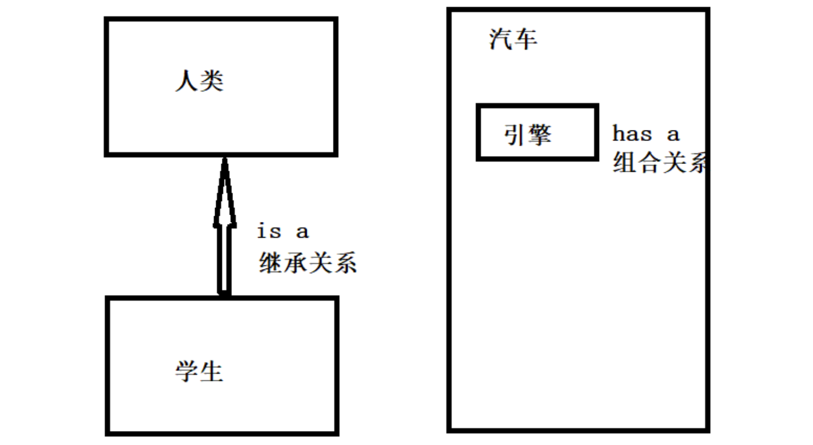

# 一 面向对象基础

面向对象简称 OO（Object Oriented）：是一种对现实世界理解和抽象的方法，是计算机编程技术发展到一定阶段后的产物。

20 世纪 80 年代以后，有了面向对象分析（OOA）、 面向对象设计（OOD）、面向对象程序设计（OOP）等新的系统开发方式模型的研究

- OOA：面向对象分析（Object Oriented Analysis）
- OOD：面向对象设计（Object Oriented Design）
- OOP：面向对象程序设计（Object Oriented Programming）


面向对象具有继承、封装和多态 3 个核心特性

- 封装：保护信息——阻止在外部定义的代码随意访问内部代码和数据
- 继承：子类拥有父类的全部特征和行为（Java 只支持单继承）
- 多态：父类中定义的属性和方法被子类继承后，可以具有不同的属性或表现方式

Java 语言的基本封装单位是类。由于类的用途是封装复杂性，所以类的内部有隐藏实现复杂性的机制。Java 提供了私有和公有的访问模式，类的公有接口代表外部的用户应该知道或可以知道的每件东西，私有的方法数据只能通过该类的成员代码来访问，这就可以确保不会发生不希望的事情


## 1. 类和对象

在面向对象中，类和对象是最基本、最重要的组成单元。类是对象的抽象，对象是类的具体。

- 类：客观世界某类群体的一些基本特征抽象

- 对象：就是表示一个个具体的东西

  

类是概念模型，定义对象的所有特性和所需的操作，对象是真实的模型，是一个具体的实体。

类是描述了一组有相同特性（属性）和相同行为（方法）的一组对象的集合。

对象或实体所拥有的特征在类中表示时称为类的属性，对象执行的操作称为类的方法。


## 2. 类的定义

```java
// class：声明类的关键字。  class_name：类的名称。
[public] [abstract|final] class <class_name> [extends<class_name>] [implements<interface_name>] {
    // 定义属性部分 property_type表示成员变量的类型， property表示成员变量名称
    <property_type> <property1>;
    <property_type> <property2>;
    <property_type> <property3>;
    …
    // 定义方法部分 function()：表示成员方法名称
    function1();
    function2();
    function3();
    …
}
```

- 中括号“[]”中的部分表示可以省略，竖线 “|” 表示 “或关系”

  例如 abstract|final，说明可以使用 abstract 或 final 关键字，但是两个关键字不能同时出现

- `public`：表示可以被其他类和程序访问，每个 Java 程序的主类都必须是 public 类。

- `abstract`：如果类被 abstract 修饰，则该类为抽象类。

  抽象类不能被实例化，但抽象类中可以有抽象方法（使用 abstract 修饰的方法）和具体方法（没有使用 abstract 修饰的方法）。

  继承该抽象类的所有子类都必须实现该抽象类中的所有抽象方法（除非子类也是抽象类）。

- `final`：如果类被 final 修饰，则不允许被继承。

- `extends`：表示继承其他类。

- `implements`：表示实现某些接口。

  

```java
// 定义一个简单的 Person 类 (首先定义了两个属性，分别为 name 和 age，然后定义了一个名称为 tell() 的方法)
public class Person {
    private String name;    // 姓名
    private int age;        // 年龄
    
    public void show() {    // 定义说话的方法
        System.out.println(name+"今年"+age+"岁！");
    }
}
```


```java
// 声明成员变量的语法
[public|protected|private] [static] [final] <type> <variable_name>
```

- public、protected、private：用于表示成员变量的访问权限。
- static：表示该成员变量为类变量，也称为静态变量。
- final：表示将该成员变量声明为常量，其值无法更改。

可以在声明成员变量的同时对其进行初始化，如果声明成员变量时没有对其初始化，则系统会使用默认值初始化成员变量


```java
// 声明成员方法(定义类的行为) 一个完整的方法通常包括方法名称、方法主体、方法参数和方法返回值类型
[public|private|protected] [static] [abstract|final] <void|return_type> <method_name>([paramList]) {
    // 方法体
}
```

- public、private、protected：表示成员方法的访问权限。

- static：表示限定该成员方法为静态方法。

- final：表示限定该成员方法不能被重写或重载。

- abstract：表示限定该成员方法为抽象方法。

  抽象方法不提供具体的实现（必须被子类重写，除非子类也是抽象类），并且所属类必须为抽象类。


## 3. 构造方法

构造方法是类的一种特殊方法，用来初始化类的一个新的对象，在创建对象（new 运算符）之后自动调用。

```java
class class_name {
    public class_name(){}               // 默认无参构造方法
    public ciass_name([paramList]){}    // 自定义构造方法
    …
    // 类主体
}
```

- 方法名必须与类名相同，可以有 0 个、1 个或多个参数

- 若不自定义构造函数，则 Java 会自动为该类生成一个默认的无参构造方法

  建议自定义无参构造方法，不要对编译器形成依赖，避免错误发生。
  当类中有非常量成员变量时，建议提供两个版本的构造方法，一个是无参构造方法，一个是全属性做参数的构造方法。
  当类中所有成员变量都是常量或者没有成员变量时，建议不提供任何版本的构造。

- 没有任何返回值，包括 void，默认返回类型就是对象类型本身

  注意：如果为构造方法定义了返回值类型或使用 void 声明构造方法没有返回值，编译时不会出错，但 Java 会把这个所谓的构造方法当成普通方法来处理。实际上，类的构造方法是有返回值的，当使用 new 关键字来调用构造方法时，构造方法返回该类的实例，可以把这个类的实例当成构造器的返回值，因此构造器的返回值类型总是当前类，无须定义返回值类型。但必须注意不要在构造方法里使用 return 来返回当前类的对象，因为构造方法的返回值是隐式的。


注意：构造方法不能被` static、final、synchronized、abstract 和 native`修饰

- 构造方法用于初始化一个新对象，所以用 static 修饰没有意义。
- 构造方法不能被子类继承，所以用 final 和 abstract 修饰没有意义。
- 多个线程不会同时创建内存地址相同的同一个对象，所以用 synchronized 修饰没有必要


**方法的重载：**

- 方法名称相同, 参数类型或参数长度不同, 可以完成方法的重载 ! 
- 方法的重载与返回值无关!
- 方法的重载 ,可以让我们在不同的需求下, 通过传递不同的参数调用方法来完成具体的功能。


## 4. 对象的使用

```java
// 一个类要想真正的进行操作，则必须依靠对象，对象的定义格式如下:
ClassName objectName = new ClassName();

// 如果要想访问类中的属性或方法（方法的定义），则可以依靠以下的语法形式：
objectName.property;    //访问类中的属性
objectName.method();    //调用类中的方法
```

```java
Car car = new Car("Rolls Royce", "grey");
car.show();

new Car("Rolls Royce", "grey").show();  // 匿名对象（匿名对象只在堆内存中开辟空间，而不存在栈内存的引用）
```


对象访问定位：Java程序需要通过栈上的引用数据来操作堆上的具体对象。

对象的访问方式取决于虚拟机实现，目前主流的访问方式有使用句柄和直接指针两种，HotSpot主要使用直接指针：


## 5. 封装和this

封装（Encapsulation）是指一种将抽象性函式接口的实现细节部分包装、隐藏起来的方法。封装可以被认为是一个保护屏障，防止该类的代码和数据被外部类定义的代码随机访问。要访问该类的代码和数据，必须通过严格的接口控制。


**实现Java封装的步骤：**

1. 修改属性的可见性来限制对属性的访问（一般限制为private）

2. 对每个值属性提供对外的公共方法访问，也就是创建一对赋取值方法，用于对私有属性的访问

```java
public class Person{
    private String name;
    private int age;
    
    public int getAge(){
      return age;
    }
    public String getName(){
      return name;
    }
    public void setAge(int age){
      this.age = age;
    }
    public void setName(String name){
      this.name = name;
    }
}
```

- 此处采用 **this** 关键字是为了解决实例变量和局部变量之间发生的同名的冲突
- 大部分时候，普通方法访问其他方法、成员变量时无须使用 this 前缀，但如果方法里有个局部变量和成员变量同名，但程序又需要在该方法里访问这个被覆盖的成员变量，则必须使用 this 前缀
- this 关键字最大的作用就是让类中一个方法，访问该类里的另一个方法或实例变量

```java
public class Student {
    String name;

    public Student() {
        this("张三");  // this( )访问构造方法(注意：在构造方法中使用时，必须是第一条语句)
    }
    public Student(String name) {
        this.name = name;
    }
}
```


## 6. 静态(static)

static表示“静态”的意思，可以简单理解为：被static关键字修饰的方法或者变量不需要依赖于对象来进行访问，只要类被加载了，就可以通过类名去进行访问，并且不会因为对象的多次创建 而在内存中建立多份数据。

在类中，使用 static 修饰符修饰的属性（成员变量）称为静态变量，也可以称为类变量，常量称为静态常量，方法称为静态方法或类方法，它们统称为静态成员，归整个类所有。（静态方法不能调用非静态成员，编译会报错）


- **静态变量**：静态变量只分配一次内存，在加载类的过程中完成静态变量的内存分配，静态变量可以被类的所有实例共享

- **静态方法**：不能使用 this 关键字，也不能直接访问所属类的实例变量和实例方法，但是可以直接访问所属类的静态变量和静态方法。

  另外，和 this 关键字一样，super 关键字也与类的特定实例相关，所以在静态方法中也不能使用 super 关键字。

- **静态代码块**：static{ } 代码块只被执行一次，主要用于初始化类，为类的静态变量赋初始值，提升程序性能

  

```java
public class Student {
    private String name;
    public static String country = "China";

    public Student(String name) {
        this.name = name;
    }
    public Student() {
    }
}
```

```java
public class StudentTest {
    public static void main(String[] args) {
        Student tom = new Student("tom");
        Student jack = new Student("jack");

        System.out.println(tom.country);
        System.out.println(jack.country);
        System.out.println(Student.country);
    }
}
```


## 7. 代码块

- 普通代码块：在执行的流程中 出现的 代码块， 我们称其为普通代码块。

- 构造代码块：在类中的成员代码块， 我们称其为构造代码块， 在每次对象创建时执行， 执行在构造方法之前。

- 静态代码块：在类中使用static修饰的成员代码块， 我们称其为静态代码块， 在类加载时执行。 每次程序启动到关闭 ，只会
  执行一次的代码块。

- 同步代码块

  构造方法 与 构造代码块 以及 静态代码块的执行顺序：静态代码块 --> 构造代码块 --> 构造方法


## 8. package

包（package）：提供了类的多层命名空间，用于解决类的命名冲突、类文件管理等问题。包的 3 个作用如下：

1. 区分相同名称的类
2. 能够较好地管理大量的类
3. 控制访问范围


**包定义**：

- package 语句应该放在源文件的第一行，在每个源文件中只能有一个包定义语句

- Java 包的命名规则如下：

  - 包名全部由小写字母（多个单词也全部小写）
  - 如果包名包含多个层次，每个层次用“.”分割
  - 包名一般由倒置的域名开头，比如 com.baidu，不要有 www
  - 自定义包不能 java 开头

- 如果在源文件中没有定义包，那么类、接口、枚举和注释类型文件将会被放进一个无名的包中，也称为默认包。

  在实际企业开发中，通常不会把类定义在默认包下


**包导入**：

- import 语句位于 package 语句之后，类定义之前
- 如果不导包，则需要使用该类的全名（包名+类名）

```java
package 包名;          // 定义包

import 包名.类名;      // 使用 import 导入单个类
import 包名.*;        // 使用 import 语句导入指定包下全部类
```


## 9. 权限修饰符


- public：只要使用 import 语句引入 public 类，就可以访问和引用这个类
- protected：允许其他包中它的子类来访问父类的特定属性和方法，否则可以使用默认访问控制符
- default：如果一个类没有访问控制符，说明它具有默认的访问控制特性，这种访问特性又称为包访问性（package private）
- private：只能被该类自身的方法访问和修改，而不能被任何其他类（包括该类的子类）访问和引用


# 二 继承和多态

## 1. 继承和super

继承就是在已经存在类的基础上进行扩展，从而产生新的类。已经存在的类称为父类、基类或超类，而新产生的类称为子类或派生类。在子类中，不仅包含父类的属性和方法，还可以增加新的属性和方法。

```java
修饰符 class class_name extends extend_class {
    // 类的主体
}

// extends 关键字直接跟在子类名之后，其后面是该类要继承的父类名称。如：
public class Student extends Person{
}
```

- Java 不支持多继承，只允许一个类直接继承另一个类，即子类只能有一个直接父类
- 子类和父类间必须存在“是一个”即“is-a”的关系，否则不能用继承


由于子类不能继承父类的构造方法，因此，如果要调用父类的构造方法，可以使用 super 关键字。

super 可以用来访问父类的构造方法、普通方法和属性，可以理解为 super 是指向自己父类对象的一个指针。

```java
public class Person {
    public Person(String name) {
    }
}
public class Student extends Person {
    public Student(String name) {
        super(name);   // 调用父类中的构造方法  ( super()必须是在子类构造方法的方法体的第一行 )
    }
}
```


## 2. 重写和重载

- `方法重写（override）`：又称为方法覆盖，即在子类中如果创建了一个与父类中相同名称、相同返回值类型、相同参数列表的方法，只是方法体中的实现不同，以实现不同于父类的功能。
- `方法重载（overload）`：同一个类中包含了两个或两个以上方法名相同的方法，但形参列表不同。方法重载的要求是两同一不同：同一个类中方法名相同，参数列表不同。至于方法的其他部分，如方法返回值类型、修饰符等，与方法重载没有任何关系。


在重写方法时，需要遵循下面的规则：

- 参数列表必须完全与被重写的方法参数列表相同。重写的方法可以使用 @Override 注解来标识。
- 声明为 final 的方法不能被重写，声明为 static 的方法不能被重写，但是能够再次声明。构造方法不能被重写。
- 返回的类型必须与被重写的方法的返回类型相同（jdk1.5 之前返回值类型必须一样，之后的 Java 版本放宽了限制，返回值类型必须小于或者等于父类方法的返回值类型）。
- 访问权限不能比父类中被重写方法的访问权限更低（public>protected>default>private）。
- 重写方法一定不能抛出新的检査异常或者比被重写方法声明更加宽泛的检査型异常。例如，父类的一个方法声明了一个检査异常 IOException，在重写这个方法时就不能抛出 Exception，只能拋出 IOException 的子类异常，可以抛出非检査异常。


## 3. final修饰符

final ：最终，表示最终形态，不可改变。final 应用于类、方法和变量时意义是不同的，但本质是一样的，都表示不可改变。

- final 用在变量的前面表示变量的值不可以改变，此时该变量可以被称为常量。

  当使用 final 修饰基本类型变量时，不能对基本类型变量重新赋值，因此基本类型变量不能被改变。 但对于引用类型变量而言，它保存的仅仅是一个引用，final 只保证这个引用类型变量所引用的地址不会改变，即一直引用同一个对象，但这个对象完全可以发生改变。

  ```java
  public static final double PI= 3.14; // 全局常量 (使用final声明变量时，要求全部的字母大写)
  ```

- final 用在方法的前面表示方法不可以被重写。

- final 用在类的前面表示该类不能有子类，即该类不可以被继承。


## 4. abstract

```java
// 抽象类
abstract class class_name {
    abstract type method_name(parameter-iist);
}
```

- 抽象类不能使用 new 关键字创建对象。但是在子类创建对象时， 抽象父类也会被JVM实例化。
- 抽象类不能使用final声明，因为final属修饰的类是不能有子类的 ， 而抽象类必须有子类实现。
- 如果一个子类继承抽象类，那么必须实现其所有的抽象方法。如果有未实现的抽象方法，那么子类也必须定义为
  abstract类


- 如果一个方法使用 abstract 来修饰，则说明该方法是抽象方法，抽象方法只有声明没有实现。需要注意的是 abstract 关键字只能用于普通方法，不能用于 static 方法或者构造方法中。
- 抽象方法没有方法体，抽象方法必须存在于抽象类中，子类重写父类时，必须重写父类所有的抽象方法。
- 在使用 abstract 关键字修饰抽象方法时不能使用 private 修饰，因为抽象方法必须被子类重写。


## 5. interface

```java
[public] interface interface_name [extends interface1_name[, interface2_name,…]] {
    // 接口体，其中可以包含定义常量和声明方法
    [public] [static] [final] type constant_name = value;          // 定义常量
    [public] [abstract] returnType method_name(parameter_list);    // 声明方法
}
```

- 接口没有构造方法，不能被实例化。一个接口可以有多个直接父接口，但接口只能继承接口，不能继承类
- 具有 public 访问控制符的接口，允许任何类使用；没有指定 public 的接口，其访问将局限于所属的包。
- 方法的声明不需要其他修饰符，在接口中声明的方法，将隐式地声明为公有的（public）和抽象的（abstract）。
- 在 Java 接口中声明的变量其实都是常量，接口中的变量声明，将隐式地声明为 public、static 和 final，即常量，所以接口中定义的变量必须初始化。


```java
<public> class <class_name> [extends superclass_name] [implements interface1_name[, interface2_name…]] {
    // 主体
}
```

- 一个类可以继承一个父类，并同时实现多个接口，implements 部分必须放在 extends 部分之后。
- 一个类实现了一个或多个接口之后，这个类必须完全实现这些接口里所定义的全部抽象方法（也就是重写这些抽象方法）；否则，该类将保留从父接口那里继承到的抽象方法，该类也必须定义成抽象类。


**接口和抽象类的区别**：

1. 抽象类要被子类继承，接口要被类实现。
2. 接口只能声明抽象方法，抽象类中可以声明抽象方法，也可以写非抽象方法。
3. 接口里定义的变量只能是公共的静态的常量，抽象类中的变量是普通变量。
4. 抽象类使用继承来使用， 无法多继承。 接口使用实现来使用， 可以多实现
5. 抽象类中可以包含static方法 ，但是接口中不允许（静态方法不能被子类重写，因此接口中不能声明静态方法）
6. 接口不能有构造方法，但是抽象类可以有


## 6. 多态和转型

多态性是面向对象编程的又一个重要特征，它是指在父类中定义的属性和方法被子类继承之后，可以具有不同的数据类型或表现出不同的行为，这使得同一个属性或方法在父类及其各个子类中具有不同的含义。

对面向对象来说，多态分为编译时多态和运行时多态。其中编译时多态是静态的，主要是指方法的重载，它是根据参数列表的不同来区分不同的方法。通过编译之后会变成两个不同的方法，在运行时谈不上多态。而运行时多态是动态的，它是通过动态绑定来实现的，也就是大家通常所说的多态性。


Java多态有 3 个必要条件：继承、重写和向上转型。只有满足这 3 个条件，才能够在同一个继承结构中使用统一的逻辑实现代码处理不同的对象，从而执行不同的行为。

- 继承：在多态中必须存在有继承关系的子类和父类。
- 重写：子类对父类中某些方法进行重新定义，在调用这些方法时就会调用子类的方法。
- 向上转型：在多态中需要将子类的引用赋给父类对象，只有这样该引用才既能可以调用父类的方法，又能调用子类的方法。


```java
// 判断某个对象是否是指定类的实例 (注意：instanceof 运算符只能用作对象的判断)
boolean result = obj instanceof Class 
```

```java
class Person {}
class Man extends Person{}

Person p1 = new Person();
Person p2 = new Man();  // 向上转型: 父类的对象引用指向子类实例
Man m1 = new Man();
System.out.println(p1 instanceof Man);//false
System.out.println(p2 instanceof Man);//true
System.out.println(m1 instanceof Man);//true
```


## 7. Object类

Object类是所有类的父类（基类），如果一个类没有明确的继承某一个具体的类，则将默认继承Object类。

```java
public class Person{
}
// 其实它被使用时 是这样的：
public class Person extends Object{
}

// Object的多态：使用Object可以接收任意的引用数据类型
Object obj = new Person();  
```


**建议重写Object中的toString和equals方法**：

- `toString`方法： 此方法的作用：返回对象的字符串表示形式。Object的toString方法， 返回对象的内存地址。
- `equals`方法：此方法的作用：指示某个其他对象是否“等于”此对象。Object的equals方法比较的是地址值，不是对象的内容


## 8. is-a & has a

面向对象的核心思想是：抽象、封装、继承、多态。在实践中用的比较多的术语就是 is a（是一个） ，和 has a（有一个）



- 继承（ is a）：主要是多态的体现。两个类之间是继承关系。

  ```java
  class Person{}
  class Student extends Person{}
  
  Person p = new Student()
  ```

  学生类继承了人类，那么我们可以说“学生是一个人类”，即 is-a是一个的关系。变量 p 声明为Person类型，但是可以给它赋值一个Student类型的对象。这就是多态的体现，是一种设计模式。

  

- 组合（has a）：has-a 也是一种设计模式。表示这个对象包含另外一个对象，也表示这个对象依赖于另一个对象。所谓的包含就是另一个对象它是这个对象的属性，仅此而已。两个类之间是组合关系。

  ```java
  //引擎类
  class Engine{} 
  
  // 汽车类：有一个引擎类的属性
  class Car{
    Engine engine;
  } 
  ```

  

# 三 Other


## 1. 内部类

在Java中，可以将一个类定义在另一个类里面或者一个方法里面，这样的类称为内部类。广泛意义上的内部类一般来说包括这四种：

1. 成员内部类
2. 局部内部类
3. 匿名内部类
4. 静态内部类

内部类的特点：

- 内部类仍然是一个独立的类，在编译之后内部类会被编译成独立的`.class`文件，但是前面冠以外部类的类名和`$`符号。
- 内部类不能用普通的方式访问。内部类是外部类的一个成员，因此内部类可以自由地访问外部类的成员变量，无论是否为 private 。
- 内部类声明成静态的，就不能随便访问外部类的成员变量，仍然是只能访问外部类的静态成员变量。


**成员内部类**：是最普通的内部类，它的定义为位于另一个类的内部，形如下面的形式：

```java
class Outer {
    private double x = 0;
    public Outer(double x) {
        this.x = x;
    }
    
	class Inner { //内部类
		public void say() {
            // 成员内部类可以无条件访问外部类的所有成员属性和成员方法（包括private成员和静态成员）。
			System.out.println("x="+x);
		}
	}
}
/*
如果要访问外部类的同名成员，需要以下面的形式进行访问：
    外部类.this.成员变量
    外部类.this.成员方法
*/
Outter outter = new Outter();
Outter.Inner inner = outter.new Inner();
```


**局部内部类**：是定义在一个方法或者一个作用域里面的类，它和成员内部类的区别在于局部内部类的访问仅限于方法内或者该作用域内。

例如：(注意:局部内部类就像是方法里面的一个局部变量一样，是不能有public、protected、private以及static修饰符的。) 

```java
class Person{
	public Person() {}
}

class Man{
	public Man(){}
    
	public People getPerson(){
		class Student extends People{ //局部内部类
			int age =0;
		}
		return new Student();
	}
}
```


**静态内部类**： 是指使用 static 修饰的内部类。示例代码如下：

```java
public class Outer {
    int a = 0;           // 实例变量a
    static int b = 0;    // 静态变量b
    
    static class Inner {
        // 静态内部类中可以定义静态成员和实例成员
        int m = 0;           // 实例变量m
        static int n = 0;    // 静态变量n
        
        // 静态内部类可以直接访问外部类的静态成员，如果要访问外部类的实例成员，则需要通过外部类的实例去访问
        Outer o = new Outer;
        int a2 = o.a;    // 访问实例变量
        int b2 = b;      // 访问静态变量
    }
}

class OtherClass {
    // 在创建静态内部类的实例时，不需要创建外部类的实例
    Outer.Inner oi = new Outer.Inner();
    
    // 外部类以外的其他类需要通过完整的类名访问静态内部类中的静态成员，
    // 如果要访问静态内部类中的实例成员，则需要通过静态内部类的实例
    int a2 = oi.m;             // 访问实例成员
    int b2 = Outer.Inner.n;    // 访问静态成员
}
```


**匿名内部类**：是指没有类名的内部类，必须在创建时使用 new 语句来声明类

有两种实现方式：

- 继承一个类，重写其方法。
- 实现一个接口（可以是多个），实现其方法。

```java
public static void main(String[] args) {
    int a = 10;
    final int b = 10;
    Out anonyInter = new Out() {
        void show() {
            // System.out.println("调用了匿名类的 show() 方法"+a);    // jdk1.8前的版本编译出错
            System.out.println("调用了匿名类的 show() 方法"+b); 
        }
    };
    anonyInter.show();
}
```

1. 使用匿名内部类时，我们必须是继承一个类或者实现一个接口，但是两者不可兼得，同时也只能继承一个类或
   者实现一个接口。
2. 匿名内部类中是不能定义构造函数的。
3. 匿名内部类中不能存在任何的静态成员变量和静态方法。
4. 匿名内部类为局部内部类，所以局部内部类的所有限制同样对匿名内部类生效。
5. 匿名内部类不能是抽象的，它必须要实现继承的类或者实现的接口的所有抽象方法。
6. 只能访问final型的局部变量。局部内部类和匿名内部类访问的局部变量必须由 final 修饰，以保证内部类和外部类的数据一致性。但从 Java 8 开始，我们可以不加 final 修饰符，由系统默认添加，当然这在 Java 8 以前的版本是不允许的。Java 将这个功能称为 `Effectively final` 功能。


## 2. 包装类

在Java中有一个设计的原则“一切皆对象”，那么这样一来Java中的一些基本的数据类型，就完全不符合于这种设计思
想，因为Java中的八种基本数据类型并不是引用数据类型，所以Java中为了解决这样的问题，引入了八种基本数据类型
的包装类。八种包装类也是分为两种大的类型的：

- Number：Integer、Short、Long、Double、Float、Byte都是Number的子类，表示是一个数字。
- Object：Character、Boolean都是Object的直接子类。


**装箱和拆箱**：

- 基本数据类型转换为包装类的过程称为装箱，例如把 int 包装成 Integer 类的对象；

- 包装类变为基本数据类型的过程称为拆箱，例如把 Integer 类的对象重新简化为 int。

```java
// 装箱操作：
// 在JDK1.4及之前 ，如果要想装箱，直接使用各个包装类的构造方法即可，例如：
int temp = 10 ;                
Integer x = new Integer(temp) ; // 将基本数据类型变为包装类

// 从JDK1.5起，Java新增了自动装箱和自动拆箱，而且可以直接通过包装类进行四则运算和自增自建操作。例如：
Float f = 10.3f ; // 自动装箱
float x = f ;     // 自动拆箱
```


**字符串与数值的转换**：

```java
public class Demo {
    public static void main(String[] args) {
        String str1 = "30";
        String str2 = "30.3";
        
        int x = Integer.parseInt(str1);    // 将字符串变为int型
        float f = Float.parseFloat(str2);  // 将字符串变为float型
        
        int num = 500;
        String s = Integer.toString(num);  // 将整数转换为字符串
    }
}
```


## 2. Java异常


