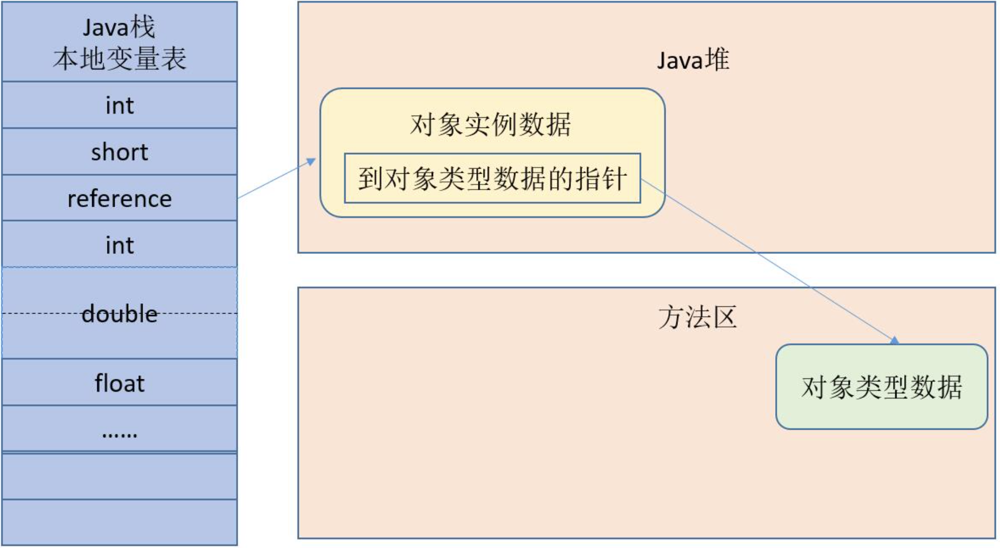
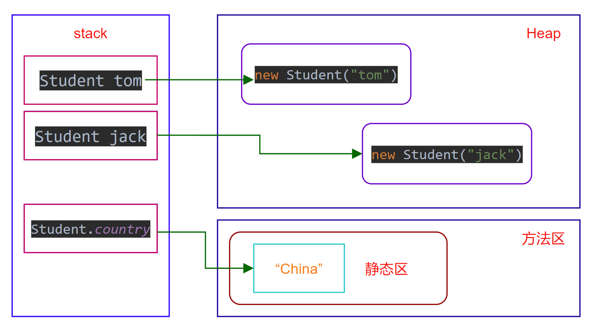
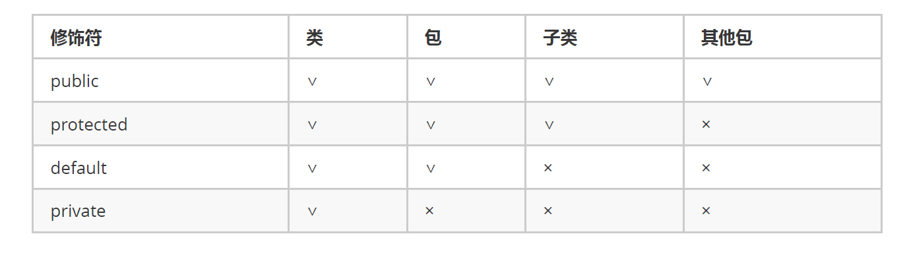

## 1. 面向对象

面向对象简称 OO（Object Oriented）：是一种对现实世界理解和抽象的方法，是计算机编程技术发展到一定阶段后的产物。

20 世纪 80 年代以后，有了面向对象分析（OOA）、 面向对象设计（OOD）、面向对象程序设计（OOP）等新的系统开发方式模型的研究

- OOA：面向对象分析（Object Oriented Analysis）
- OOD：面向对象设计（Object Oriented Design）
- OOP：面向对象程序设计（Object Oriented Programming）


面向对象具有继承、封装和多态 3 个核心特性

- 封装：保护信息——阻止在外部定义的代码随意访问内部代码和数据
- 继承：子类拥有父类的全部特征和行为（Java 只支持单继承）
- 多态：父类中定义的属性和方法被子类继承后，可以具有不同的属性或表现方式

Java 语言的基本封装单位是类。由于类的用途是封装复杂性，所以类的内部有隐藏实现复杂性的机制。Java 提供了私有和公有的访问模式，类的公有接口代表外部的用户应该知道或可以知道的每件东西，私有的方法数据只能通过该类的成员代码来访问，这就可以确保不会发生不希望的事情


## 2. 类和对象

在面向对象中，类和对象是最基本、最重要的组成单元。类是对象的抽象，对象是类的具体。

- 类：客观世界某类群体的一些基本特征抽象

- 对象：就是表示一个个具体的东西

  

类是概念模型，定义对象的所有特性和所需的操作，对象是真实的模型，是一个具体的实体。

类是描述了一组有相同特性（属性）和相同行为（方法）的一组对象的集合。

对象或实体所拥有的特征在类中表示时称为类的属性，对象执行的操作称为类的方法。


## 3. 类的定义

```java
// class：声明类的关键字。  class_name：类的名称。
[public] [abstract|final] class <class_name> [extends<class_name>] [implements<interface_name>] {
    // 定义属性部分 property_type表示成员变量的类型， property表示成员变量名称
    <property_type> <property1>;
    <property_type> <property2>;
    <property_type> <property3>;
    …
    // 定义方法部分 function()：表示成员方法名称
    function1();
    function2();
    function3();
    …
}
```

- 中括号“[]”中的部分表示可以省略，竖线 “|” 表示 “或关系”

  例如 abstract|final，说明可以使用 abstract 或 final 关键字，但是两个关键字不能同时出现

- `public`：表示可以被其他类和程序访问，每个 Java 程序的主类都必须是 public 类。

- `abstract`：如果类被 abstract 修饰，则该类为抽象类。

  抽象类不能被实例化，但抽象类中可以有抽象方法（使用 abstract 修饰的方法）和具体方法（没有使用 abstract 修饰的方法）。

  继承该抽象类的所有子类都必须实现该抽象类中的所有抽象方法（除非子类也是抽象类）。

- `final`：如果类被 final 修饰，则不允许被继承。

- `extends`：表示继承其他类。

- `implements`：表示实现某些接口。

  

```java
// 定义一个简单的 Person 类 (首先定义了两个属性，分别为 name 和 age，然后定义了一个名称为 tell() 的方法)
public class Person {
    private String name;    // 姓名
    private int age;        // 年龄
    
    public void show() {    // 定义说话的方法
        System.out.println(name+"今年"+age+"岁！");
    }
}
```


```java
// 声明成员变量的语法
[public|protected|private] [static] [final] <type> <variable_name>
```

- public、protected、private：用于表示成员变量的访问权限。
- static：表示该成员变量为类变量，也称为静态变量。
- final：表示将该成员变量声明为常量，其值无法更改。

可以在声明成员变量的同时对其进行初始化，如果声明成员变量时没有对其初始化，则系统会使用默认值初始化成员变量


```java
// 声明成员方法(定义类的行为) 一个完整的方法通常包括方法名称、方法主体、方法参数和方法返回值类型
[public|private|protected] [static] [abstract|final] <void|return_type> <method_name>([paramList]) {
    // 方法体
}
```

- public、private、protected：表示成员方法的访问权限。

- static：表示限定该成员方法为静态方法。

- final：表示限定该成员方法不能被重写或重载。

- abstract：表示限定该成员方法为抽象方法。

  抽象方法不提供具体的实现（必须被子类重写，除非子类也是抽象类），并且所属类必须为抽象类。


## 4. 构造方法

构造方法是类的一种特殊方法，用来初始化类的一个新的对象，在创建对象（new 运算符）之后自动调用。

```java
class class_name {
    public class_name(){}               // 默认无参构造方法
    public ciass_name([paramList]){}    // 自定义构造方法
    …
    // 类主体
}
```

- 方法名必须与类名相同，可以有 0 个、1 个或多个参数

- 若不自定义构造函数，则 Java 会自动为该类生成一个默认的无参构造方法

  建议自定义无参构造方法，不要对编译器形成依赖，避免错误发生。
  当类中有非常量成员变量时，建议提供两个版本的构造方法，一个是无参构造方法，一个是全属性做参数的构造方法。
  当类中所有成员变量都是常量或者没有成员变量时，建议不提供任何版本的构造。

- 没有任何返回值，包括 void，默认返回类型就是对象类型本身

  注意：如果为构造方法定义了返回值类型或使用 void 声明构造方法没有返回值，编译时不会出错，但 Java 会把这个所谓的构造方法当成普通方法来处理。实际上，类的构造方法是有返回值的，当使用 new 关键字来调用构造方法时，构造方法返回该类的实例，可以把这个类的实例当成构造器的返回值，因此构造器的返回值类型总是当前类，无须定义返回值类型。但必须注意不要在构造方法里使用 return 来返回当前类的对象，因为构造方法的返回值是隐式的。


注意：构造方法不能被` static、final、synchronized、abstract 和 native`修饰

- 构造方法用于初始化一个新对象，所以用 static 修饰没有意义。
- 构造方法不能被子类继承，所以用 final 和 abstract 修饰没有意义。
- 多个线程不会同时创建内存地址相同的同一个对象，所以用 synchronized 修饰没有必要


**方法的重载：**

- 方法名称相同, 参数类型或参数长度不同, 可以完成方法的重载 ! 
- 方法的重载与返回值无关!
- 方法的重载 ,可以让我们在不同的需求下, 通过传递不同的参数调用方法来完成具体的功能。


## 5. 对象的使用

```java
// 一个类要想真正的进行操作，则必须依靠对象，对象的定义格式如下:
ClassName objectName = new ClassName();

// 如果要想访问类中的属性或方法（方法的定义），则可以依靠以下的语法形式：
objectName.property;    //访问类中的属性
objectName.method();    //调用类中的方法
```

```java
Car car = new Car("Rolls Royce", "grey");
car.show();

new Car("Rolls Royce", "grey").show();  // 匿名对象（匿名对象只在堆内存中开辟空间，而不存在栈内存的引用）
```


对象访问定位：Java程序需要通过栈上的引用数据来操作堆上的具体对象。

对象的访问方式取决于虚拟机实现，目前主流的访问方式有使用句柄和直接指针两种，HotSpot主要使用直接指针：




## 6. 封装和this

封装（Encapsulation）是指一种将抽象性函式接口的实现细节部分包装、隐藏起来的方法。封装可以被认为是一个保护屏障，防止该类的代码和数据被外部类定义的代码随机访问。要访问该类的代码和数据，必须通过严格的接口控制。


**实现Java封装的步骤：**

1. 修改属性的可见性来限制对属性的访问（一般限制为private）

2. 对每个值属性提供对外的公共方法访问，也就是创建一对赋取值方法，用于对私有属性的访问

```java
public class Person{
    private String name;
    private int age;
    
    public int getAge(){
      return age;
    }
    public String getName(){
      return name;
    }
    public void setAge(int age){
      this.age = age;
    }
    public void setName(String name){
      this.name = name;
    }
}
```

- 此处采用 **this** 关键字是为了解决实例变量和局部变量之间发生的同名的冲突
- 大部分时候，普通方法访问其他方法、成员变量时无须使用 this 前缀，但如果方法里有个局部变量和成员变量同名，但程序又需要在该方法里访问这个被覆盖的成员变量，则必须使用 this 前缀
- this 关键字最大的作用就是让类中一个方法，访问该类里的另一个方法或实例变量

```java
public class Student {
    String name;

    public Student() {
        this("张三");  // this( )访问构造方法(注意：在构造方法中使用时，必须是第一条语句)
    }
    public Student(String name) {
        this.name = name;
    }
}
```


## 7. 静态(static)

static表示“静态”的意思，可以简单理解为：被static关键字修饰的方法或者变量不需要依赖于对象来进行访问，只要类被加载了，就可以通过类名去进行访问，并且不会因为对象的多次创建 而在内存中建立多份数据。

在类中，使用 static 修饰符修饰的属性（成员变量）称为静态变量，也可以称为类变量，常量称为静态常量，方法称为静态方法或类方法，它们统称为静态成员，归整个类所有。（静态方法不能调用非静态成员，编译会报错）


- **静态变量**：静态变量只分配一次内存，在加载类的过程中完成静态变量的内存分配，静态变量可以被类的所有实例共享

- **静态方法**：不能使用 this 关键字，也不能直接访问所属类的实例变量和实例方法，但是可以直接访问所属类的静态变量和静态方法。

  另外，和 this 关键字一样，super 关键字也与类的特定实例相关，所以在静态方法中也不能使用 super 关键字。

- **静态代码块**：static{ } 代码块只被执行一次，主要用于初始化类，为类的静态变量赋初始值，提升程序性能

  

```java
public class Student {
    private String name;
    public static String country = "China";

    public Student(String name) {
        this.name = name;
    }
    public Student() {
    }
}
```

```java
public class StudentTest {
    public static void main(String[] args) {
        Student tom = new Student("tom");
        Student jack = new Student("jack");

        System.out.println(tom.country);
        System.out.println(jack.country);
        System.out.println(Student.country);
    }
}
```



## 8. 代码块

- 普通代码块：在执行的流程中 出现的 代码块， 我们称其为普通代码块。

- 构造代码块：在类中的成员代码块， 我们称其为构造代码块， 在每次对象创建时执行， 执行在构造方法之前。

- 静态代码块：在类中使用static修饰的成员代码块， 我们称其为静态代码块， 在类加载时执行。 每次程序启动到关闭 ，只会
  执行一次的代码块。

- 同步代码块

  构造方法 与 构造代码块 以及 静态代码块的执行顺序：静态代码块 --> 构造代码块 --> 构造方法


## 9. package

包（package）：提供了类的多层命名空间，用于解决类的命名冲突、类文件管理等问题。包的 3 个作用如下：

1. 区分相同名称的类
2. 能够较好地管理大量的类
3. 控制访问范围


**包定义**：

- package 语句应该放在源文件的第一行，在每个源文件中只能有一个包定义语句

- Java 包的命名规则如下：

  - 包名全部由小写字母（多个单词也全部小写）
  - 如果包名包含多个层次，每个层次用“.”分割
  - 包名一般由倒置的域名开头，比如 com.baidu，不要有 www
  - 自定义包不能 java 开头

- 如果在源文件中没有定义包，那么类、接口、枚举和注释类型文件将会被放进一个无名的包中，也称为默认包。

  在实际企业开发中，通常不会把类定义在默认包下


**包导入**：

- import 语句位于 package 语句之后，类定义之前
- 如果不导包，则需要使用该类的全名（包名+类名）

```java
package 包名;          // 定义包

import 包名.类名;      // 使用 import 导入单个类
import 包名.*;        // 使用 import 语句导入指定包下全部类
```


## 10. 权限修饰符



- public：只要使用 import 语句引入 public 类，就可以访问和引用这个类
- protected：允许其他包中它的子类来访问父类的特定属性和方法，否则可以使用默认访问控制符
- default：如果一个类没有访问控制符，说明它具有默认的访问控制特性，这种访问特性又称为包访问性（package private）
- private：只能被该类自身的方法访问和修改，而不能被任何其他类（包括该类的子类）访问和引用


