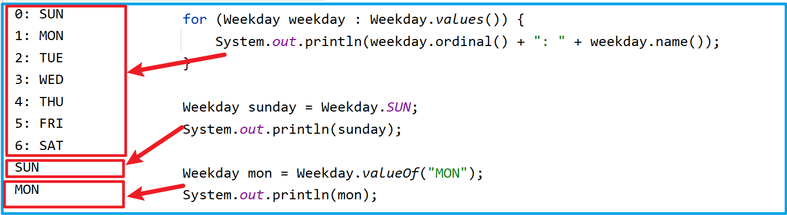
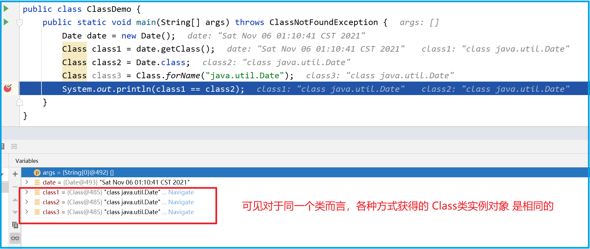
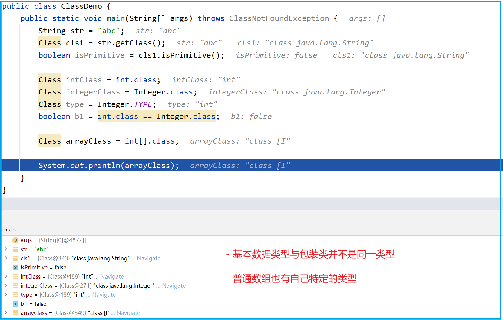
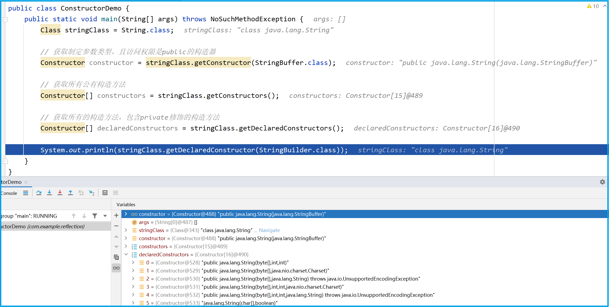
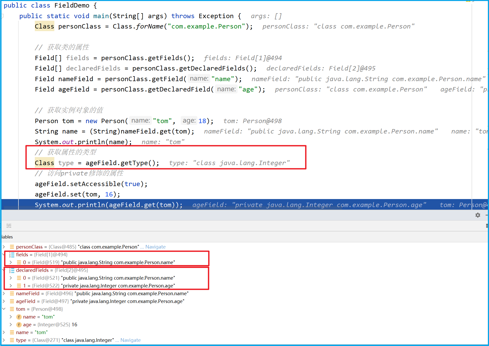
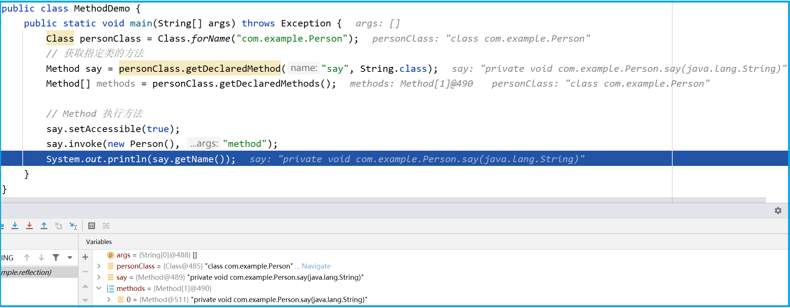

# 一 Enum枚举

Java 枚举(enum) 是一个特殊的类，一般表示一组常量、enum 定义的枚举类默认继承了 java.lang.Enum 类 。

官方文档地址：https://docs.oracle.com/javase/tutorial/java/javaOO/enum.html

## 1. 基本应用

Java 枚举类使用 enum 关键字来定义，各个常量使用逗号 ` , ` 来分割

```java
public enum Weekday {
    // 枚举 Weekday 是一个特殊的类
    // 每个枚举常量（如：SUN）都是一个Weekday的实例对象，并且都默认具备 public static final 修饰符
    SUN, MON, TUE, WED, THU, FRI, SAT
}
```

枚举常用方法：

- `values()` 以数组形式返回枚举类型的所有成员 
- `ordinal()` 方法可以找到每个枚举常量的索引，就像数组索引一样 
- `valueOf()`  方法返回指定字符串值的枚举常量、不存在的会报错 `IllegalArgumentException`  

```java
public class WeekdayEnumTest {
    public static void main(String[] args) {
        // 迭代枚举
        for (Weekday weekday : Weekday.values()) {
            System.out.println(weekday.ordinal() + ": " + weekday.name());
        }

        // 当使用枚举类型成员时，直接使用枚举名称调用成员即可
        Weekday sunday = Weekday.SUN;
        System.out.println(sunday);

        Weekday mon = Weekday.valueOf("MON");
        System.out.println(mon);
    }
}
```




## 2. Enum类

enum 关键字定义的枚举类都默认继承了Enum 类（抽象类）、该类位于 java.lang下、该类具有两个 final 常量：

- name ：枚举常量，如上例中的 ` SUN MON ` 等
- ordinal ：类似数组索引，即位置（position）的意思，默认值从0开始

下为Enum类的部分源码：

```java
public abstract class Enum<E extends Enum<E>> implements Comparable<E>, Serializable {

    // The name of this enum constant, as declared in the enum declaration.
    private final String name;

    public final String name() {
        return name;
    }
    
    public String toString() {
        return name;
    }
    
    /**
     * The ordinal of this enumeration constant (its position in the enum declaration, 
     * where the initial constant is assigned an ordinal of zero).
     */
    private final int ordinal;

    public final int ordinal() {
        return ordinal;
    }

    // Sole constructor.  Programmers cannot invoke this constructor.
    protected Enum(String name, int ordinal) {
        this.name = name;
        this.ordinal = ordinal;
    }
   
    public static <T extends Enum<T>> T valueOf(Class<T> enumType, String name) {
        T result = enumType.enumConstantDirectory().get(name);
        if (result != null)
            return result;
        if (name == null)
            throw new NullPointerException("Name is null");
        throw new IllegalArgumentException(
            "No enum constant " + enumType.getCanonicalName() + "." + name);
    }
}
```


## 3. 构造方法

实现带有构造方法的枚举（项目中常使用的方式），示例：

```java
public enum Sex {
    MALE(1, "男"),
    FEMALE(2, "女");

    public final Integer type;
    public final  String value;

    private Sex(Integer type, String value){
        this.type = type;
        this.value = value;
    }
}
```

```java
public class SexEnumTest {
    public static void main(String[] args) {
        Sex man = Sex.MALE;

        System.out.println(man);            // MALE  调用默认的toString()
        System.out.println(man.name());     // MALE
        System.out.println(man.ordinal());  // 0

        System.out.println(man.type);       // 1
        System.out.println(man.value);      // 男
    }
}
```


## 4. 抽象方法

带有抽象方法的枚举、在上例的基础上添加一个抽象方法，如下：

```java
public enum Sex {
    MALE(1, "男"){
        @Override
        public void haircut() {
            System.out.println("剃个光头吧~");
        }
    },
    FEMALE(2, "女"){
        @Override
        public void haircut() {
            System.out.println("还是留长发吧~");
        }
    };

    public final Integer type;
    public final  String value;

    private Sex(Integer type, String value){
        this.type = type;
        this.value = value;
    }

    public abstract void haircut();
}
```

```java
public class SexEnumTest {
    public static void main(String[] args) {
        Sex man = Sex.MALE;

        System.out.println(man);            // MALE  调用默认的toString()
        System.out.println(man.name());     // MALE
        System.out.println(man.ordinal());  // 0

        System.out.println(man.type);       // 1
        System.out.println(man.value);      // 男

        man.haircut();                      // 剃个光头吧~
        Sex.FEMALE.haircut();               // 还是留长发吧~
    }
}
```


# 二 Reflection

The Reflection API：https://docs.oracle.com/javase/tutorial/reflect/index.html 

Reflection is commonly used by programs which require the ability to examine or modify the runtime behavior of applications running in the Java virtual machine.

## 1. Class类

在java中，一个普通事物、如人类可以用一个Person类来表示，那么众多的java类用什么来表示呢？其实所有的java类同样属于一类事物，而描述这类事物的java类就是 Class . 

在一个普通类中，如Person代表一个类，我们通过new获得该类的对象，那Class类又如何获得其对象呢？

其实，我们不妨将Class类的实例对象理解为一个类在内存中的字节码文件（一个类被类加载器加载到内存中，占用了一定的内存空间，而这片内存空间存储的内容就是该类的字节码，而不同的类具有不同的字节码文件，这些就是一个个Class类的实例对象）


想要获得一个类的 Class类型 （即Class实例对象、或者说内存中代表该类的字节码文件），通常有以下三种方式：

- Object.getClass() 
- The .class Syntax 
- Class.forName() ： This cannot be used for primitive types

```java
public class ClassDemo {
    public static void main(String[] args) throws ClassNotFoundException {
        // 通过对象的 getClass() 方法获取
        Date date = new Date();
        Class class1 = date.getClass();
        
        // 通过类的class属性获取
        Class class2 = Date.class;
        
        // 通过Class类提供的 forName() 方法将指定的类加载到内存中
        Class class3 = Class.forName("java.util.Date");
        
        System.out.println(class1 == class2);  //true
    }
}
```

我们不妨通过debug的方式看一看这三个Class类的实例对象是否相同（指向同一内存空间）：




我们再了解一下基本数据类型、包装类、普通类和数组的Class类型有何不同：



包装类的 TYPE 属性表示其对应的基本数据类型、注意不要与class属性相混淆


注意官方文档关于类型的定义：即Java中只有基本数据类型和引用数据类型，引用数据类型包括：类、枚举、数组和接口

Every type is either a reference or a primitive. 

Classes, enums, and arrays  (which all inherit from [`java.lang.Object`](https://docs.oracle.com/javase/8/docs/api/java/lang/Object.html)) as well as interfaces are all reference types. 


## 2. 构造方法

Constructor类代表某个类中的一个构造方法、可以通过反射获取指定类的构造方法：

```java
public class ConstructorDemo {
    public static void main(String[] args) throws NoSuchMethodException {
        Class stringClass = String.class;

        // 获取指定参数类型、且访问权限是public的构造器
        Constructor constructor = stringClass.getConstructor(StringBuffer.class);

        // 获取所有公有（public）构造方法
        Constructor[] constructors = stringClass.getConstructors();

        // 获取所有的构造方法，包含private修饰的构造方法
        Constructor[] declaredConstructors = stringClass.getDeclaredConstructors();

        System.out.println(stringClass.getDeclaredConstructor(StringBuilder.class));
    }
}
```




使用反射的方式创建实例对象的两种方式：

```java
public class ConstructorDemo {
    public static void main(String[] args) throws Exception{
        Class dateClass = Date.class;
        Constructor constructor = dateClass.getConstructor(long.class);

        // 通过Constructor类的方法创建实例对象
        Date date = (Date) constructor.newInstance(3600000L);
        System.out.println(date); // Thu Jan 01 09:00:00 CST 1970  3600000毫秒为一小时

        // 通过Class类的方法创建实例对象
        Object DateInstance = Class.forName("java.util.Date").newInstance();
        System.out.println((Date) DateInstance); // Sat Nov 06 15:40:19 CST 2021
    }
}
```


## 3. 成员变量

**Field ** 提供有关类或接口的单个字段的信息，以及对它的动态访问权限。反射的字段可能是一个类（静态）字段或实例字段

`java.lang.reflect.Field` 为我们提供了获取当前对象的成员变量的类型，和重新设值的方法

```java
public class FieldDemo {
    public static void main(String[] args) throws Exception {
        Class personClass = Class.forName("com.example.Person");

        // 获取类的属性
        Field[] fields = personClass.getFields();
        Field[] declaredFields = personClass.getDeclaredFields();
        Field nameField = personClass.getField("name");
        Field ageField = personClass.getDeclaredField("age");

        // 获取实例对象的值
        Person tom = new Person("tom", 18);
        String name = (String)nameField.get(tom);
        System.out.println(name);
        // 访问private修饰的属性
        ageField.setAccessible(true);
        ageField.set(tom, 16);
        System.out.println(ageField.get(tom));
    }
}
```




## 4. 成员方法

getDeclaredMethod()获取方法，然后invoke执行实例对应的方法：

- ```java
  getDeclaredMethod(String name, Class<?>... parameterTypes)
  ```

- ```java
  MethodName.invoke(Object obj, Object... args)
  ```

```java
public class MethodDemo {
    public static void main(String[] args) throws Exception {
        Class personClass = Class.forName("com.example.Person");
        // 获取指定类的方法
        Method say = personClass.getDeclaredMethod("say", String.class);
        Method[] methods = personClass.getDeclaredMethods();

        // Method 执行方法
        say.setAccessible(true);
        say.invoke(new Person(), "method");
        System.out.println(say.getName());
    }
}

```




| Method类的方法           | 作用                                                         |
| ------------------------ | ------------------------------------------------------------ |
| `getName()`              | 获取方法名                                                   |
| `isVarArgs() `           | 如果该方法声明为采用可变数量的参数，则返回true; 否则返回false |
| `getModifiers()`         | 获取权限修饰符                                               |
| `getReturnType()`        | 获取返回类型                                                 |
| `getExceptionTypes() `   | 获取所有抛出的异常类型                                       |
| `getGenericReturnType()` | 返回Type类型                                                 |
| `getParameterTypes() `   | 获取所有参数的类型                                           |
| `getParameterCount()`    | 获取所有参数的个数                                           |
| `getAnnotations()`       | 获取方法级别的注解                                           |
| `getDeclaringClass ()`   | 获取方法所在的类信息                                         |


## 5. 反射的应用

下WEB开发中，有很多技术和框架底层都用到了反射，例如：

- JSP中的 `<jsp:useBean>` 、`<jsp:setProperty>` 、`<jsp:getProperty>` 标签的底层实现 
- 


# 三 Annotation

Java 注解（Annotation）又称 Java 标注，是 JDK5.0 引入的一种注释机制、 Java 语言中的类、方法、变量、参数和包等都可以被标注

- 和注释不同，Java 标注可以通过反射获取标 注内容
- 在编译器生成类文件时，标注可以被嵌入到字节码中、Java 虚拟机可以保留标注内容，在运行 时可以获取到标注内容 
- 当然它也支持自定义 Java 标注（注解）


## 1. 内置注解

Java中有三种常用的内置注解，这些注解用来为编译器提供指令（ java7和java8又新增了三种） 

| Java内置注解           | 说明                                                         |
| ---------------------- | ------------------------------------------------------------ |
| `@Override`            | 检查该方法是否是重写方法。如果发现其父类，或者是引用的接口中并没有该方法时，会报编译错误 |
| `@Deprecated`          | 标记过时方法。如果使用该方法，会报编译警告                   |
| `@SuppressWarnings`    | 指示编译器去忽略注解中声明的警告                             |
| `@SafeVarargs`         | 忽略任何使用参数为泛型变量的方法或构造函数调用产生的警告（ Java 7 ） |
| `@FunctionalInterface` | 标识一个匿名函数或函数式接口 （ Java 8 ）                    |
| `@Repeatable`          | 标识某注解可以在同一个声明上使用多次 （ Java 8）             |

SuppressWarnings：抑制编译时的警告信息、常用使用方式：

```java
@SuppressWarnings("unchecked")            // 抑制单类型的警告 

@SuppressWarnings("unchecked","rawtypes") // 抑制多类型的警告

@SuppressWarnings("all")                  // 抑制所有类型的警告
```

| SuppressWarnings的参数   | 用途                                               |
| :----------------------- | -------------------------------------------------- |
| all                      | 抑制所有警告                                       |
| boxing                   | 抑制装箱、拆箱操作时候的警告                       |
| cast                     | 抑制映射相关的警告                                 |
| dep-ann                  | 抑制启用注释的警告                                 |
| deprecation              | 抑制过期方法警告                                   |
| fallthrough              | 抑制确在switch中缺失breaks的警告                   |
| finally                  | 抑制finally模块没有返回的警告                      |
| hiding                   | 抑制相对于隐藏变量的局部变量的警告                 |
| incomplete-switch        | 忽略没有完整的switch语句                           |
| nls                      | 忽略非nls格式的字符                                |
| null                     | 忽略对null的操作                                   |
| rawtypes                 | 使用generics时忽略没有指定相应的类型               |
| restriction              | 抑制禁止使用劝阻或禁止引用的警告                   |
| serial                   | 忽略在serializable类中没有声明serialVersionUID变量 |
| static-access            | 抑制不正确的静态访问方式警告                       |
| synthetic-access         | 抑制子类没有按最优方法访问内部类的警告             |
| unchecked                | 抑制没有进行类型检查操作的警告                     |
| unqualified-field-access | 抑制没有权限访问的域的警告                         |
| unused                   | 抑制没被使用过的代码的警告                         |


meta-annotation（元注解）：用来对注解类型进行注解的注解

| Java元注解    | 说明                                                         |
| ------------- | ------------------------------------------------------------ |
| `@Retention`  | 标识这个注解怎么保存，是只在代码中，还是编入class文件中，或者是在运行时可以通过反射访问 |
| `@Documented` | 标记这些注解是否包含在用户文档中                             |
| `@Target `    | 标记这个注解适用于哪种 Java 成员                             |
| `@Inherited`  | 标记这个注解是继承于哪个注解类 (默认 注解并没有继承于任何子类) |


## 2. 自定义注解

先看看常用注解的定义（源码）：

```java
// @Override 注解的定义
@Target(ElementType.METHOD)
@Retention(RetentionPolicy.SOURCE)
public @interface Override {
}
```

```java
// @Deprecated 注解的定义
@Documented
@Retention(RetentionPolicy.RUNTIME)
@Target(value={CONSTRUCTOR, FIELD, LOCAL_VARIABLE, METHOD, PACKAGE, PARAMETER, TYPE})
public @interface Deprecated {
}
```

```java
// @SuppressWarnings 注解的定义
@Target({TYPE, FIELD, METHOD, PARAMETER, CONSTRUCTOR, LOCAL_VARIABLE})
@Retention(RetentionPolicy.SOURCE)
public @interface SuppressWarnings {
    String[] value();
}
```

注意事项：

- 定义 Annotation 时，@interface 是必须的、定义的注解，自动继承了java.lang.annotation.Annotation接口
- 注解中的方法，实际是声明的注解配置参数、方法的名称就是 配置参数的名称， 方法的返回值类型，就是配置参数的类型

- 配置参数的类型只能是基本类型（即：Class/String/enum）、可以通过default来声明参数的默认值
- 如果只有一个参数成员，一般参数名为value、注解元素必须要有值（常使用空字符串、0作为默认值）

```java
// 自定义注解格式
@Documented
@Target(ElementType.TYPE)
@Retention(RetentionPolicy.RUNTIME)
public @interface MyAnnotation1 {
	参数类型 参数名() default 默认值;
}
```


ElementType(注解的适用类型）：

```java
// ElementType 源码分析
    public enum ElementType {
    TYPE,             /* 类、接口（包括注释类型）或枚举声明 */
    FIELD,            /* 字段声明（包括枚举常量） */
    METHOD,           /* 方法声明 */
    PARAMETER,        /* 参数声明 */
    CONSTRUCTOR,      /* 构造方法声明 */
    LOCAL_VARIABLE,   /* 局部变量声明 */
    ANNOTATION_TYPE,  /* 注释类型声明 */
    PACKAGE           /* 包声明 */
}

```

RetentionPolicy（注解作用域策略）：

```java
// RetentionPolicy 源码分析：
public enum RetentionPolicy {
    SOURCE,  /* Annotation信息仅存在于编译器处理期间，编译器处理完之后就没有该Annotation信息了 */
    CLASS,   /* 编译器将Annotation存储于类对应的.class文件中（默认行为） */
    RUNTIME  /* 编译器将Annotation存储于class文件中，并且可由JVM读入 */
}
```


## 3. 配置原理


