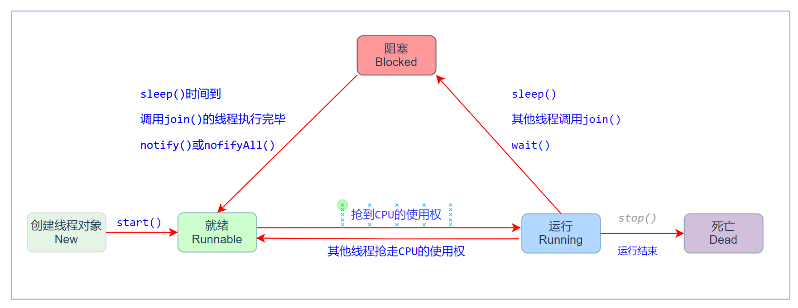
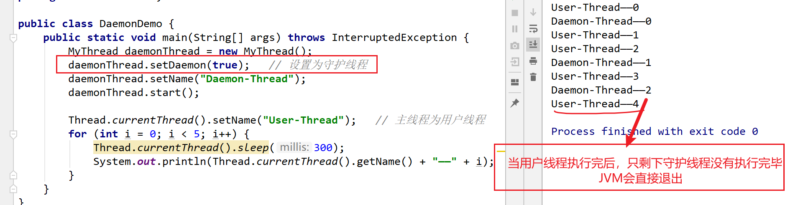
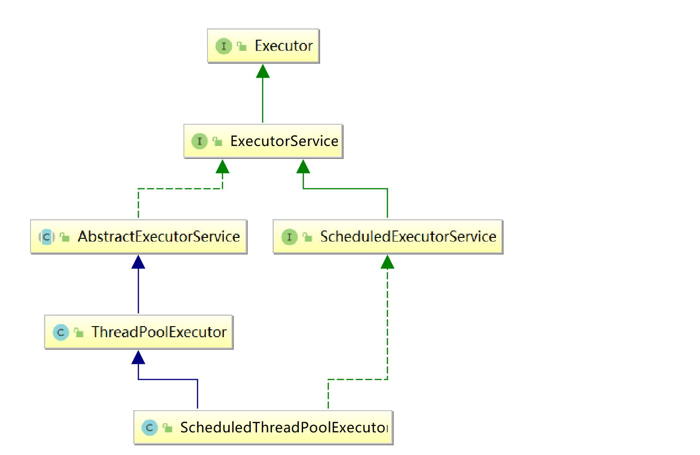

# 一 实现多线程

## 1. 基本概念

- 进程： 是指一个内存中运行的应用程序，每个进程都有一个独立的内存空间 

- 线程： 是进程中的一个执行路径，共享一个内存空间，线程之间可以自由切换，并发执行. 一个进程最少 有一个线程 

  线程实际上是在进程基础之上的进一步划分，一个进程启动之后，里面的若干执行路径又可以划分成若干个线程

  

- 同步: 排队执行 , 效率低但是安全

  **调用某个东西（IO，http请求）时，调用方得等待这个调用返回结果才能继续往后执行** 

- 异步: 同时执行 , 效率高但是数据不安全

  **和同步相反，用发出后调用者可用继续执行后续操作，被调用者通过状体来通知调用者，或者通过回掉函数来处理这个调用**  

  

- 串行：一个任务接一个任务按顺序执行

- 并发：指两个或多个事件在同一个时间段内发生

- 并行：指两个或多个事件在同一时刻发生（同时发生）


## 2. 继承Thread

继承Thread实现多线程的步骤：

- 定义一个继承Thread的类， 并重写`run()`方法 

- 创建这个类的对象， 通过`start()`方法启动线程

```java
public class MyThread extends Thread {
    @Override
    public void run() {
        for (int i = 0; i < 10; i++) {
            System.out.println(Thread.currentThread().getName() + "——" + i);
        }
    }
}
```

```java
public class ThreadDemo1 {
    public static void main(String[] args) {
        MyThread th1 = new MyThread();
        MyThread th2 = new MyThread();

        th1.start();
        th2.start();
    }
}
```

- `run()`：用来封装被线程执行的代码
- `start()`：启动线程；然后由JVM调用此线程的run()方法


## 3. 实现Runnable

通过实现Runnable接口实现多线程的步骤：

- 定义一个实现Runnable接口的类， 并在类中重写`run()`方法 
- 创建该类的对象，创建Thread类的对象，把该类的对象作为Thread类的构造方法参数
- 通过`start()` 启动线程

```java
public class MyRunnable implements Runnable {
    @Override
    public void run() {
        for (int i = 0; i < 10; i++) {
            System.out.println(Thread.currentThread().getName() + "——" + i);
        }
    }
}
```

```java
public class ThreadDemo2 {
    public static void main(String[] args) {
        MyRunnable task = new MyRunnable();
        Thread t1 = new Thread(task, "T1");
        Thread t2 = new Thread(task, "T2");

        t1.start();
        t2.start();
    }
}
```

实现Runnable相对于继承Thread有如下优势：

- 可以实现多个接口，避免单继承带来的局限性
- 通过先创建任务，然后创建线程的方式来实现，任务与线程分离，提高了程序的健壮性
- 线程池接收Runnable类型的任务，但不接收Thread类型的对象


**可以通过匿名内部类的方式实现**：

```java
public static void main(String[] args) {
    new Thread(new Runnable() {
        @Override
        public void run() {
            for (int i = 0; i < 10; i++) {
                System.out.println(Thread.currentThread().getName() + i);
            }
        }
    }).start();
}
```

**上述案例的Lambda表达式**：

```java
new Thread(()->{
    for (int i = 0; i < 10; i++) {
        System.out.println(Thread.currentThread().getName() + i);
    }
}).start();
```


## 4. 实现Callable

Thread类和Runnable接口都不允许声明检查型异常，也不能定义返回值

Runnable 与 Callable的不同点：

（1）Callable规定的方法是call()，而Runnable规定的方法是run()。

（2）Callable的任务执行后可返回值，而Runnable的任务是不能返回值的。

（3）call()方法可抛出异常，而run()方法是不能抛出异常的。

（4）运行Callable任务可拿到一个Future对象。


Callable使用步骤：

1. 编写类实现Callable接口 , 实现call方法
2. 创建FutureTask对象 , 并传入第一步编写的Callable类对象
3. 通过Thread, 启动线程

```java
public class MyCallable implements Callable {
    @Override
    public Integer call() throws Exception {
        int sum = 0;
        for (int i = 0; i < 100000; i++) {
            sum += i;
        }
        return sum;
    }
}
```

```java
public class CallableDemo {
    public static void main(String[] args) throws ExecutionException, InterruptedException {
        MyCallable myCallable = new MyCallable();
        // 执行Callable的任务，需要用FutureTask来接收运算结果
        FutureTask<Integer> futureTask = new FutureTask<Integer>(myCallable);

        new Thread(futureTask).start();

        // 接收线程运算后的结果
        Integer result = futureTask.get();
        System.out.println(result);
    }
}
```


## 5. Thread类

| 构造方法                             | 说明                                                       |
| ------------------------------------ | ---------------------------------------------------------- |
| Thread()                             | 创建一个线程对象                                           |
| Thread(String name)                  | 创建一个具有指定名称的线程对象                             |
| Thread(Runnable target)              | 创建一个基于Runnable接口实现类的线程对象                   |
| Thread(Runnable target, String name) | 创建一个基于Runnable接口实现类，并且具有指定名称的线程对象 |


**Thread类的常用方法**：

| 方法名                           | 说明                                     |
| -------------------------------- | ---------------------------------------- |
| void setName(String name)        | 将此线程的名称更改为等于参数name         |
| String getName()                 | 返回此线程的名称                         |
| Thread currentThread()           | 返回对当前正在执行的线程对象的引用       |
| public void run()                | 线程相关的代码写在该方法中，一般需要重写 |
| public void start()              | 启动线程的方法                           |
| public static void sleep(long m) | 线程休眠m毫秒的方法                      |
| public void join()               | 优先执行调用join()方法的线程             |
| void setDaemon(boolean on)       | 将此线程标记为守护线程                   |


## 6. 线程生命周期

线程一共有五种状态，线程在各种状态之间转换：




# 二 线程控制

## 1. 线程调度

线程调度：给线程分配CPU处理权的过程


线程调度分类：

- 协同式线程调度：线程的执行时间是由线程本身决定.该线程的内容执行完后,报告操作系统进行切换.

- 分时调度模型：所有线程轮流使用 CPU 的使用权，平均分配每个线程占用 CPU 的时间片 

- 抢占式调度模型：优先让优先级高的线程使用 CPU，如果线程的优先级相同，那么会随机选择一 个，优先级高的线程获取的 CPU 时间片相对多一些 

  

**Java使用的是抢占式调度模型** 

- 随机性：假如计算机只有一个 CPU，那么 CPU 在某一个时刻只能执行一条指令，线程只有得到CPU时间片，也就是使用权，才可以执行指令。即多线程程序的执行是有随机性，因为谁抢到CPU的使用权是不一 定的


## 2. 线程优先级

操作系统的优先级: （静态优先级+动态优先级）

- 静态优先级:固定值
- 动态优先级:正在的线程会随着执行时间的延长优先级会降低, 正在等待的线程的优先级会随着等待时间的延长,优先级会升高


**java中的优先级到底为什么没有用**？

java中优先级是静态优先级, 只是向操作系统建议，然而，我们在java语言中设置的线程优先级，它仅仅只能被看做是一种"建议"(对操作系统的建议)，实际上，操作系统本身，有它自己的一套线程优先级 (静态优先级 + 动态优先级)，故而即使设置了线程优先级，也不能保证执行顺序！

 **java官方说明**： 线程优先级并非完全没有用，我们Thread的优先级，它具有统计意义，总的来说，高优先级的线程占用的cpu执行时间多一点，低优先级线程，占用cpu执行时间，短一点 （也就是说，优先级高最多意味着抢到执行权的可能性高一点点而已！）


Java为线程类提供了10个优先级，优先级可以用整数1-10表示，超过范围会抛出异常，主线程默认优先级为5

**Thread类的优先级常量**：

```java
public final static int MIN_PRIORITY = 1;    // The minimum priority that a thread can have.

public final static int NORM_PRIORITY = 5;   // The default priority that is assigned to a thread.

public final static int MAX_PRIORITY = 10;   // The maximum priority that a thread can have.
```

优先级相关的方法：

| 方法                                     | 说明                 |
| ---------------------------------------- | -------------------- |
| public int getPriority()                 | 获取线程优先级的方法 |
| public void setPriority(int newPriority) | 设置线程优先级的方法 |


## 3. 线程控制API

- `sleep()` ：释放资源，自己休眠，让其他线程先执行。

- `join()`： 抢占资源，让自己占有线程， 先执行完毕后（或达到指定时间）才释放资源。( <font color=red>可以用来保证执行顺序</font> ) 

- `yield()`： 暂停当前正在执行的线程对象，并执行其他线程 （**注意该方法并不能保证执行顺序**）

  虽然当前线程放弃了CPU的执行权， 但是这个线程仍然可以参与下轮CPU的竞争，有可能刚执行yield，但马上又抢到了执行权

```java
// sleep 案例
new Thread(new Runnable() {
    @Override
    public void run() {
        for (int i = 0; i < 10; i++) {
            try {
                Thread.currentThread().sleep(500);  // 休眠半秒
            } catch (InterruptedException e) {
                e.printStackTrace();
            }
            System.out.println(Thread.currentThread().getName() + i);
        }
    }
}).start();
```


```java
// join 案例
public class JoinDemo {
    public static void main(String[] args) throws InterruptedException {
        MyThread thread0 = new MyThread();
        MyThread thread1 = new MyThread();
        MyThread thread2 = new MyThread();

        thread0.start();
        thread0.join();   //Thread-0 执行完毕后，Thread-1和Thread-2才能执行
        thread1.start();
        thread2.start();
    }
}
```


## 4. 守护线程

在Java中有两类线程：User Thread(用户线程)、Daemon Thread(守护线程) ，User和Daemon两者几乎没有区别，不同之处在于：

- 如果 User Thread已经全部退出运行了，只剩下Daemon Thread存在了，虚拟机也就退出了。 

  因为没有了被守护者，Daemon也就没有工作可做了，也就没有继续运行程序的必要了。

- Daemon的作用是为其他线程的运行提供便利服务，守护线程最典型的应用就是 GC (垃圾回收器)

示例：

```java
public class MyThread extends Thread {
    @Override
    public void run() {
        for (int i = 0; i < 5; i++) {
            try {
                Thread.currentThread().sleep(500);
            } catch (InterruptedException e) {
                e.printStackTrace();
            }
            System.out.println(Thread.currentThread().getName() + "——" + i);
        }
    }
}
```

```java
public class DaemonDemo {
    public static void main(String[] args) throws InterruptedException {
        MyThread daemonThread = new MyThread();
        daemonThread.setDaemon(true);   // 设置为守护线程
        daemonThread.setName("Daemon-Thread");
        daemonThread.start();

        Thread.currentThread().setName("User-Thread");   // 主线程为用户线程
        for (int i = 0; i < 5; i++) {
            Thread.currentThread().sleep(300);
            System.out.println(Thread.currentThread().getName() + "——" + i);
        }
    }
}
```




## 5. 线程中断

Java没有提供一种安全直接的方法来停止某个线程，但是Java提供了中断机制。那中断机制是如何工作的？

（如果对Java中断没有一个全面的了解，可能会误以为被中断的线程将立马退出运行，但事实并非如此）


**中断的原理**：Java中断机制是一种协作机制，也就是说通过中断并不能直接终止另一个线程，而需要被中断的线程自己处理中断。

（例如，当线程t1想中断线程t2，只需要在线程t1中将线程t2对象的中断标识置为true，然后线程2可以选择在合适的时候处理该中断请求，甚至可以不理会该请求，就像这个线程没有被中断一样）


| 方法                                | 方法描述                                                     |
| ----------------------------------- | ------------------------------------------------------------ |
| public static boolean interrupted() | 测试当前线程是否已经中断（第二次调用清除中断状态，并返回false） |
| public boolean isInterrupted()      | 测试线程是否已经中断。线程的中断状态不受该方法的影响         |
| public void interrupt()             | 中断线程（唯一能将中断状态设置为true的方法）                 |

`interrupted()`：这个方法的命名极不直观，很容易造成误解，需要特别注意：

- 线程的中断状态 由该方法清除。换句话说，如果连续两次调用该方法，则第二次调用将返回 false

  （在第一次调用已清除了其中断状态之后，且第二次调用检验完中断状态前，当前线程再次中断的情况除外）


# 三 线程同步问题

我们先用多线程来模拟该电影院卖票（共有100张票，分3个窗口卖票）

```java
public class SellTicket implements Runnable{
    private int tickets = 100;

    @Override
    public void run() {
        while(true){
            if(tickets > 0){
                try {
                    Thread.sleep(100);
                } catch (InterruptedException e) {
                    e.printStackTrace();
                }
                tickets--;
                System.out.println(Thread.currentThread().getName() + "卖了一张票, 剩余：" + tickets);
            }
        }
    }
}
```

```java
public class SellTicketDemo {
    public static void main(String[] args) {
        SellTicket sellTicket = new SellTicket();
        Thread thread1 = new Thread(sellTicket, "1号窗口");
        Thread thread2 = new Thread(sellTicket, "2号窗口");
        Thread thread3 = new Thread(sellTicket, "3号窗口");

        thread1.start();
        thread2.start();
        thread3.start();
    }
}
```


多线程环境下，极可能存在多条语句操作共享数据的情形，这会导致极其糟糕的后果（如上例中票数问题），即多线程数据安全问题

解决方案：synchronized 和 Lock


## 1. 同步代码块格

```java
synchronized(锁对象) {   // 注意需要的是同一个锁，切勿在此处直接new对象
	// 操作共享数据的代码
}
```

```java
// 使用同步代码块的方式改造上例代码
public class SellTicket implements Runnable {
    private int tickets = 100;
    private Object obj = new Object();

    @Override
    public void run() {
        while (true) {
            synchronized (obj) {  // 同步代码块
                if (tickets > 0) {
                    try {
                        Thread.sleep(100);
                    } catch (InterruptedException e) {
                        e.printStackTrace();
                    }
                    tickets--;
                    System.out.println(Thread.currentThread().getName() + "卖了一张票, 剩余：" + tickets);
                }
            }
        }
    }
}
```

同步代码块格虽然解决了多线程的数据安全问题，但当线程很多时，因为每个线程都会去判断同步上的锁，这是很耗费时间资源的，无形中会降低程序的运行效率。


## 2. 同步方法

同步方法就是把synchronized关键字加到方法上：

```java
修饰符 synchronized 返回值类型 方法名(方法参数) {
	// 方法体；
}
```

【注意】同步方法的锁对象是 `this`， 同步静态方法的锁对象是 `类名.class`

```java
public class SellTicket implements Runnable {
    private int tickets = 100;
    private Object obj = new Object();

    @Override
    public void run() {
        while (true) {
            sellTicket();
        }
    }

    // 同步方法
    private synchronized void sellTicket() {
        if (tickets > 0) {
            try {
                Thread.sleep(100);
            } catch (InterruptedException e) {
                e.printStackTrace();
            }
            tickets--;
            System.out.println(Thread.currentThread().getName() + "卖了一张票, 剩余：" + tickets);
        }
    }
}
```


## 3. Lock锁

-  创建ReentrantLock对象（Lock是接口不能直接实例化，这里采用它的实现类ReentrantLock来实例化）
- 在代码块中显式的调用`lock()`和`unlock()`方法

```java
public class SellTicket implements Runnable {
    private int tickets = 100;
    private Lock lock = new ReentrantLock(); 

    @Override
    public void run() {
        while (true) {
            lock.lock();  // 加锁
            if (tickets > 0) {
                try {
                    Thread.sleep(100);
                } catch (InterruptedException e) {
                    e.printStackTrace();
                }
                tickets--;
                System.out.println(Thread.currentThread().getName() + "卖了一张票, 剩余：" + tickets);
            }
            lock.unlock();  // 解锁
        }
    }
}
```


## 4. 线程间通信

Object类的等待和唤醒方法：

| 方法名           | 说明                                   |
| ---------------- | -------------------------------------- |
| void wait()      | 中断方法的执行，使线程等待             |
| void notify()    | 唤醒处于等待的某一个线程，使其结束等待 |
| void notifyAll() | 唤醒所有处于等待的线程，使它们结束等待 |


## 5. 生产者消费者

生产者消费者模式是一个十分经典的多线程协作的模式，生产者消费者问题主要是包含了两类线程：

- 生产者线程 用于生产数据
- 消费者线程 用于消费数据

为了解耦生产者和消费者的关系，通常会采用共享的数据区域，就像是一个仓库。 生产者生产数据之后直接放置在共享数据区中，并不需要关心消费者的行为。 消费者只需要从共享数据区中去获取数据，并不需要关心生产者的行为


模拟生产蛋糕：

```java
// 生产者生产蛋糕，将其打包装进箱子（box）, 消费者每次消费一个
public class Box {
    private int cake; // 箱子中的蛋糕数量

    public Box() {
        this.cake = 0;
    }

    // 生产蛋糕
    public synchronized void put(int cake) {
        // 如果蛋糕超过5个，则等待消费
        if (this.cake > 5) {
            try {
                System.out.println(Thread.currentThread().getName() + "-蛋糕太多了，等待消费...");
                wait();
            } catch (InterruptedException e) {
                e.printStackTrace();
            }
        } else {
            // 生产蛋糕
            this.cake += cake;
            System.out.println(Thread.currentThread().getName() + "-生产了" + cake + "个蛋糕, 剩余：" + this.cake);
        }
        // 唤醒其他线程
        notifyAll();
    }

    // 消费蛋糕
    public synchronized void get() {
        // 如果没有蛋糕，则等待生产
        if (this.cake <= 0) {
            try {
                System.out.println(Thread.currentThread().getName() + "-没有蛋糕了，等待生产...");
                wait();
            } catch (InterruptedException e) {
                e.printStackTrace();
            }
        } else {
            // 消费蛋糕
            this.cake--;
            System.out.println(Thread.currentThread().getName() + "-消费一个蛋糕, 剩余：" + this.cake);
        }
        // 唤醒其他线程
        notifyAll();
    }
}
```

```java
public class Producer implements Runnable {
    private Box box;

    public Producer(Box box) {
        this.box = box;
    }

    @Override
    public void run() {
        for (int i = 1; i < 10; i++) {  // 只生产10次
            try {
                // 生产蛋糕，每次耗费 3~5s
                Thread.sleep((long) Math.random() * 5000 + 3000);
            } catch (InterruptedException e) {
                e.printStackTrace();
            }
            box.put(i); // 每次生产数量
        }
        System.out.println(Thread.currentThread().getName() + "-生产结束，该放假了~\n");
    }
}
```

```java
public class Customer implements Runnable{
    private Box box;

    public Customer(Box box) {
        this.box = box;
    }

    @Override
    public void run() {
        while (true){
            try {
                // 消费蛋糕
                Thread.sleep((long) Math.random() * 3000 + 1000);
            } catch (InterruptedException e) {
                e.printStackTrace();
            }
            box.get();
        }
    }
}
```

```java
public class CakeDemo {
    public static void main(String[] args) {
        Box box = new Box();
        Producer producer = new Producer(box);
        Customer customer = new Customer(box);

        new Thread(producer, "producer").start();
        new Thread(customer, "customer").start();
    }
}
```


# 四 Java线程池

如果并发的线程数量很多，并且每个线程都是执行一个时间很短的任务就结束了，这样频繁创建线程 就会大大降低 系统的效率，因为频繁创建线程和销毁线程需要时间.  线程池就是一个容纳多个线程的容器，池中的线程可以反复使用，省去了频繁创建线程对象的操作，节省了大量的时间和资源。


线程池的好处：

- 降低资源消耗
- 提高响应速度 
- 提高线程的可管理性。


## 1. Executor

Java 5中引入了Executor框架，其内部使用了线程池机制，它在java.util.cocurrent 包下

- 通过Executor来启动线程比使用Thread的start方法更好，更易管理，效率更好（用线程池实现，节约开销）

- Executor的实现还提供了对生命周期的支持，以及统计信息收集，应用程序管理机制和性能监视等机制。

- 有助于避免this逃逸问题

  this逃逸问题——如果我们在构造器中启动一个线程，因为另一个任务可能会在构造器结束之前开始执行，此时可能会访问到初始化了一半的对象



**Executor 、 ExecutorService 、 Executors**：

ExecutorService 接口继承了 Executor 接口，是 Executor 的子接口，ExecutorService 还提供用来控制线程池的方法

- Executor 接口定义了 `execute()`方法用来接收一个`Runnable`接口的对象，而 ExecutorService 接口中的 `submit()`方法可以接受`Runnable`和`Callable`接口的对象
-  Executor 中的 `execute()` 方法不返回任何结果，而 ExecutorService 中的 `submit()`方法可以通过一个Future对象返回运算结果
- `Executors` 类提供工厂方法用来创建不同类型的线程池，以下为java中常见的四种线程池：
  - `Executors.newCachedThreadPool()` ：缓存线程池（长度无限制，自动创建线程）
  - `Executors.newFixedThreadPool()` ：定长线程池 （线程池已满时需要等待）
  - `Executors.newSingleThreadExecutor()` ：单线程线程池（效果与定长线程池 创建时传入数值1效果一致）
  - `Executors.newScheduledThreadPool()`：周期性任务定长线程池 


## 2. 缓存线程池

定义：

```java
public static ExecutorService newCachedThreadPool() {
    return new ThreadPoolExecutor(0, Integer.MAX_VALUE, 60L, TimeUnit.SECONDS,
                                  new SynchronousQueue<Runnable>() );
}
```

执行流程:

1. 判断线程池是否存在空闲线程 
2. 存在则使用 
3. 不存在则创建线程、并放入线程池, 然后使用

```java
public class CachedThreadPoolDemo {
    public static void main(String[] args) {
        ExecutorService executorService = Executors.newCachedThreadPool();
        
        executorService.execute(new Runnable() {
            @Override
            public void run() {
                System.out.println(Thread.currentThread().getName());
            }
        });
        
        executorService.execute(()-> System.out.println(Thread.currentThread().getName()));
    }
}
```


## 3. 定长线程池 

定义：

```java
public static ExecutorService newFixedThreadPool(int nThreads) {
    return new ThreadPoolExecutor(nThreads, nThreads, 0L, TimeUnit.MILLISECONDS,
                                  new LinkedBlockingQueue<Runnable>() );
}
```

执行流程:

1. 判断线程池是否存在空闲线程 
2. 存在则使用 
3. 不存在空闲线程,且线程池未满的情况下,则创建线程 并放入线程池, 然后使用
4. 不存在空闲线程,且线程池已满的情况下,则等待线程池存在空闲线程

```java
public class FixedThreadPoolDemo {
    public static void main(String[] args) {
        ExecutorService executorService = Executors.newFixedThreadPool(2);

        executorService.execute(new Runnable() {
            @Override
            public void run() {
                try {
                    Thread.sleep(1000);
                } catch (InterruptedException e) {
                    e.printStackTrace();
                }
                System.out.println(Thread.currentThread().getName());
            }
        });

        executorService.execute(new Runnable() {
            @Override
            public void run() {
                try {
                    Thread.sleep(1100);
                } catch (InterruptedException e) {
                    e.printStackTrace();
                }
                System.out.println(Thread.currentThread().getName());
            }
        });

        executorService.execute(()->{
            try {
                Thread.sleep(1200);
            } catch (InterruptedException e) {
                e.printStackTrace();
            }
            System.out.println(Thread.currentThread().getName());
        });
    }
}
```


## 4. 单线程线程池

定义：

```java
public static ExecutorService newSingleThreadExecutor() {
    return new FinalizableDelegatedExecutorService
        (new ThreadPoolExecutor(1, 1, 0L, TimeUnit.MILLISECONDS,
                                new LinkedBlockingQueue<Runnable>()) );
}
```

执行流程：

1. 判断线程池中的那个唯一的线程是否空闲
2. 空闲则使用 
3. 不空闲, 则等待池中的单个线程空闲后再使用

```java
public class SingleThreadExecutorDemo {
    public static void main(String[] args) {
        ExecutorService executorService = Executors.newSingleThreadExecutor();
        executorService.execute(new Runnable() {
            @Override
            public void run() {
                try {
                    Thread.sleep(1300);
                } catch (InterruptedException e) {
                    e.printStackTrace();
                }
                System.out.println(Thread.currentThread().getName());
            }
        });

        executorService.execute(()->{
            try {
                Thread.sleep(1400);
            } catch (InterruptedException e) {
                e.printStackTrace();
            }
            System.out.println(Thread.currentThread().getName());
        });
    }
}
```


## 5. 周期性任务定长线程池 

定义：

```java
public static ScheduledExecutorService newScheduledThreadPool(int corePoolSize) {
    return new ScheduledThreadPoolExecutor(corePoolSize);
}
public ScheduledThreadPoolExecutor(int corePoolSize) {
    // super: ThreadPoolExecutor
    super(corePoolSize, Integer.MAX_VALUE, 0, NANOSECONDS,
          new DelayedWorkQueue() );
}
```

执行流程：

1. 判断线程池是否存在空闲线程 
2. 存在则使用 
3. 不存在空闲线程,且线程池未满的情况下,则创建线程 并放入线程池, 然后使用 
4. 不存在空闲线程,且线程池已满的情况下,则等待线程池存在空闲线程

```java
public class ScheduledThreadPoolDemo {
    public static void main(String[] args) {
        ScheduledExecutorService scheduledExecutorService = Executors.newScheduledThreadPool(2);

        // 定时任务：（5秒后执行）
        scheduledExecutorService.schedule(new Runnable() {
            @Override
            public void run() {
                System.out.println(Thread.currentThread().getName());
            }
        }, 5, TimeUnit.SECONDS);

        // 周期任务 (5秒后开始执行，间隔2秒重复执行)
        scheduledExecutorService.scheduleAtFixedRate(()->{
            System.out.println(Thread.currentThread().getName());
        }, 5, 2, TimeUnit.SECONDS);
    }
}
```

方法定义：

```java
public ScheduledFuture<?> schedule(Runnable command,long delay, TimeUnit unit);
public ScheduledFuture<?> scheduleAtFixedRate(Runnable command,long initialDelay,long period,TimeUnit unit);
```

参数说明：

- `Runnable command`：runnable类型的任务 
- `long delay`：时长数字(延迟执行的时长) 
- `long period`：周期时长(每次执行的间隔时间) 
- `TimeUnit unit`：时长数字的单位


## 6. 自定义线程池

如果需要自定义线程池，可以用 `ThreadPoolExecutor ` 类创建，它有多个构造方法来创建线程池

```java
// 以此为例：
public ThreadPoolExecutor (int corePoolSize, int maximumPoolSize, long keepAliveTime, 
                           TimeUnit unit, BlockingQueue<Runnable> workQueue)
```

- `corePoolSize`：线程池中所保存的核心线程数，包括空闲线程
- `maximumPoolSize`：池中允许的最大线程数
- `keepAliveTime`：线程池中的空闲线程所能持续的最长时间
- `unit`：持续时间的单位
- `workQueue`：任务执行前保存任务的队列，仅保存由execute方法提交的Runnable任务

```java
public class ThreadPoolExecutorDemo {
    public static void main(String[] args) {
        //创建等待队列
        ArrayBlockingQueue<Runnable> queue = new ArrayBlockingQueue<Runnable>(10);
        //创建线程池，池中保存的线程数为3，允许的最大线程数为5
        ThreadPoolExecutor poolExecutor = new ThreadPoolExecutor(3, 5, 50, TimeUnit.MILLISECONDS, queue);

        poolExecutor.execute(()->{
            System.out.println(Thread.currentThread().getName());
        });

        // 关闭线程池
        poolExecutor.shutdown();
    }
}
```

