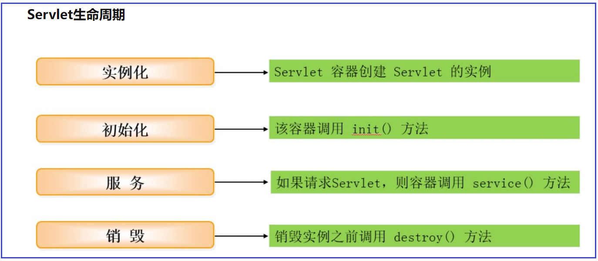
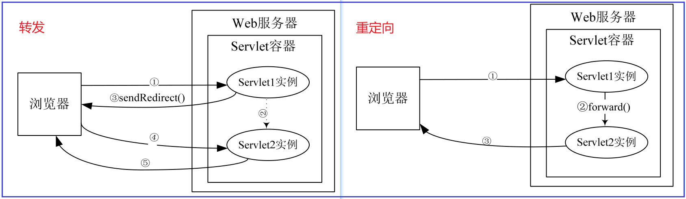
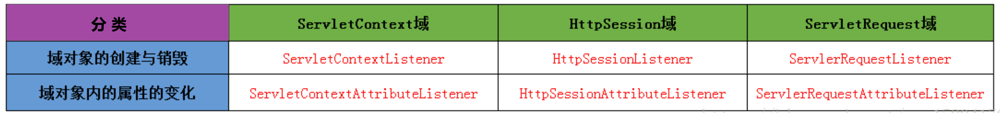
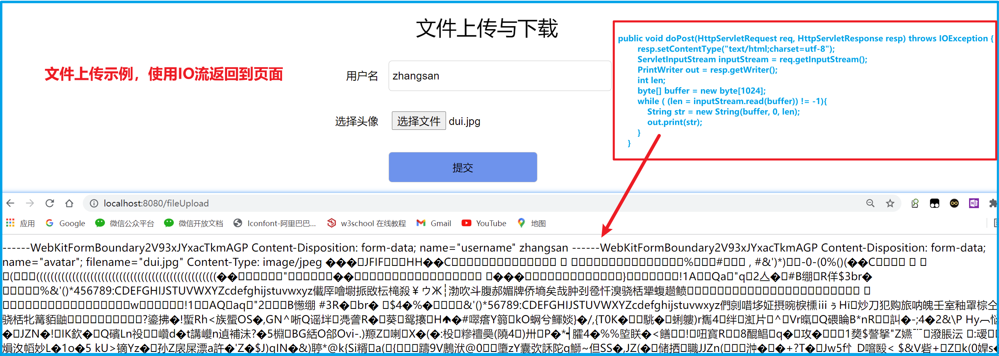
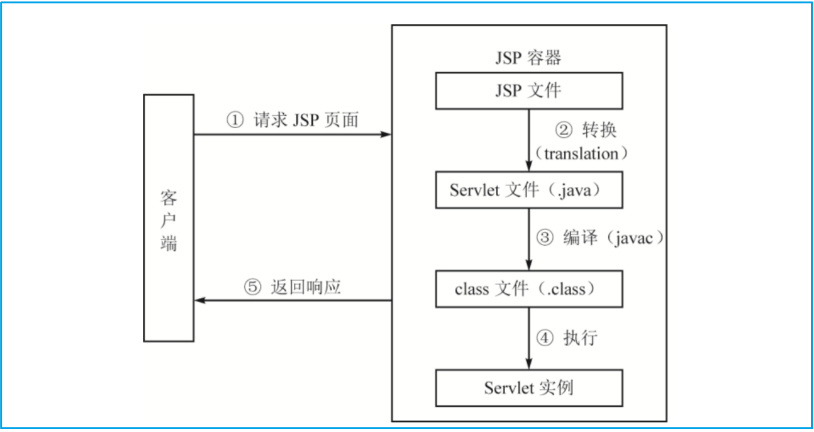

#  一 环境准备

## 1. HTTP协议

超文本传输协议（英文：HyperText Transfer Protocol，缩写：HTTP）是⼀种⽤于分布式、协作式和 超媒体信息系统的**应用层协议** 

（TCP/UDP为运输层协议）

HTTP 请求/响应的步骤：

1.  客户端（浏览器）连接到Web服务器：与Web服务器的HTTP端⼝（默认为80）建立⼀个TCP Socket连接

2.  发送HTTP请求：客户端通过socket向Web服务器发送⼀个请求报文（由请求行、请求头部、 空⾏和请求数据4部分组成）

3.  服务器接受请求并返回HTTP响应：Web服务器解析请求、同样通过socket响应数据到客户端

4.  释放TCP连接：

   在HTTP/1.0中默认使⽤短连接（每次HTTP操作均建立一次连接、任务结束就中断连接）

   从HTTP/1.1起，默认使用长连接，用以保持一段时间的连接

   HTTP协议的长连接和短连接，实质上是TCP协议的长连接和短连接 

5. 客户端浏览器解析HTML内容：客户端浏览器读取响应数据HTML，根据HTML的语法 对其进行格式化，并在浏览器窗口中显示

   客户端浏览器⾸先解析状态行，查看表明请求是否成功的状态代码

   然后解析每⼀个响应头，响应头告 知以下为若干字节的HTML文档和文档的字符集

   

| HTTP请求方法 | 描述                                                         |
| ------------ | ------------------------------------------------------------ |
| GET          | 向指定的资源发出“显示”请求、使用GET方法应该只用在读取数据    |
| HEAD         | 同上、但只获取其中“关于该资源的信息”（元信息或称元数据）     |
| POST         | 向指定资源提交数据，请求服务器进行处理（例如提交表单或者上传⽂件） |
| PUT          | 向指定资源位置上传其最新内容                                 |
| DELETE       | 请求服务器删除 Request-URI 所标识的资源                      |
| TRACE        | 回显服务器收到的请求，主要⽤于测试或诊断                     |
| OPTIONS      | 使服务器传回该资源所⽀持的所有HTTP请求⽅法                   |


## 2. Web服务器

常见的两种开发模型：

- C/S（Client/Server）客户/服务器模式：客户端 需要安装专⽤的客户端软件
- B/S（Brower/Server）：建立在广域网的基础上

Web服务器是运⾏及发布Web应⽤的容器，只有将开发的Web项⽬放置到该容器中，才能使⽹络中的所 有⽤户通过浏览器进⾏访问

开发Java Web应⽤所采⽤的服务器主要是与JSP/Servlet兼容的Web服务 器，⽐较常⽤的有Tomcat、Resin、JBoss、WebSphere 和 WebLogic 等

| Web服务器 | 简介                                                         |
| --------- | ------------------------------------------------------------ |
| Tomcat    | ⼀个⼩型、轻量级的⽀持JSP和Servlet 技术的Web服务器（最流⾏、开发JSP应⽤的⾸选） |
| Resin     | Resin是Caucho公司的产品，是⼀个⾮常流⾏的⽀持Servlet和JSP的服务器、速度⾮常快 |
| JBoss     | 纯Java的EJB服务器、不包含Servlet和JSP的 Web容器，不过它可以和Tomcat完美结合 |
| WebSphere | 是IBM公司的产品，有多个系列，其中WebSphere Application Server 是基于Java 的应⽤环境 |
| WebLogic  | WebLogic 是BEA公司的产品（现在已经被Oracle收购）、同样有多个系列。<br />WebLogic ⽀持企业级的、多层次的和完全分布式的Web应⽤，并且服务器的配置简单、界⾯友好 |


## 3. Tomcat配置

开源⼩型web服务器 ，完全免费，主要⽤于中⼩型web项⽬。常用版本：8.5 和 9.0、 官网：https://tomcat.apache.org/  

启动之前首先安装JDK并配置环境变量`JAVA_HOME`，

若希望Tomcat服务器可以在任意路径启动， 则需要配置环境变量`CATALINA_HOME` 


Tomcat的⽬录简介： （ 通过url访问服务器示例: http://localhost:8080 ）

- bin：该⽬录下存放的是⼆进制可执⾏⽂件（Windows下可通过该目录下的startup.bat启动Tomcat）

- conf：配置文件的⽬录、这个⽬录下有四个很重要的⽂件：

  - `server.xml`：配置整个服务器信息（主要的配置文件）
  - `tomcat-users.xml`：存储tomcat⽤户的⽂件
  - `web.xml`：部署描述符⽂件
  - `context.xml`：对所有应⽤的统⼀配置（通常我们不会去配置它）

- lib：Tomcat的类库（⾥⾯是⼀⼤堆jar⽂件）

- logs：⽇志⽂件目录，记录了Tomcat启动和关闭的信息

- temp：存放Tomcat的临时⽂件

- webapps：存放web项⽬的⽬录，每个⽂件夹都是⼀个项⽬

  其中ROOT是⼀个特殊的项⽬，在地址栏中没有给出项⽬⽬录时，对 应的就是ROOT项⽬

- work：运⾏时⽣成的⽂件，最终运⾏的⽂件都在这⾥（通过webapps中的项⽬⽣成）


```xml

<!-- Windows下启动信息乱码的处理方式： 在conf文件夹下的logging.properties文件修改如下语句： 
	此方法可以让其在cmd窗口中不乱码，但很可能与idea的utf8冲突，导致idea中启动Tomcat乱码...
	故而不推荐修改，使用默认的UTF-8即可
-->
java.util.logging.ConsoleHandler.encoding = GBK  （UTF-8）

```

```xml

<!-- server.xml 常用配置： 端口、协议等 -->
<Connector port="8888" protocol="HTTP/1.1" connectionTimeout="20000" redirectPort="8443" />

```

```xml

<!-- tomcat-users.xml文件用来配置管理Tomcat服务器的用户与权限 -->
<role rolename="manager-gui"/> 
<user username="admin" password="123456" roles="manager-gui"/>

```


# 二 Servlet

 Servlet（Server Applet）全称Java Servlet （ Java服务器端程序 ）、主要功能在于：交互式地浏览和修改数据，⽣成动态Web内容

- 狭义的Servlet是指Java语⾔实现的⼀个接⼝
- ⼴义的Servlet 是指任何实现了这个Servlet接⼝的类（⼀般情况下，⼈们将Servlet理解为后者）





## 1. Servlet使用步骤

- 建立一个JavaWeb Application项目并配置Tomcat服务器

- 自定义类 `实现Servlet接口` 或 `继承HttpServlet类并重写service方法`（推荐后者）

  ```java
  @WebServlet(name = "LoginServlet", value = "/LoginServlet")
  public class LoginServlet extends HttpServlet {
      @Override
      protected void doGet(HttpServletRequest request, HttpServletResponse response) 
          throws ServletException, IOException {
          doPost(request, response);
      }
  
      @Override
      protected void doPost(HttpServletRequest request, HttpServletResponse response) 
          throws ServletException, IOException {
          response.setContentType("text/html;charset=utf-8");
  
          String username = request.getParameter("username");
          String password = request.getParameter("password");
          System.out.println(username);
          System.out.println(password);
  
          List<User> users = UserDao.login(new User(username, password));
          if(users.size() > 0){
              request.getRequestDispatcher("success.html").forward(request, response);
          }else {
              request.getRequestDispatcher("fail.html").forward(request, response);
          }
      }
  }
  ```

- 配置访问路径：使用注解（如上） 或 将自定义类的信息配置到 `web.xml` 文件并启动项目，配置方式如下所示：

  ```xml
  <!--    servlet相关配置-->
  <servlet>
     <servlet-name>helloServlet</servlet-name>
     <servlet-class>com.demo.HelloServlet</servlet-class>
  </servlet>
  <!--  配置浏览器访问方式  -->
  <servlet-mapping>
     <servlet-name>helloServlet</servlet-name>
     <url-pattern>/hello</url-pattern>
  </servlet-mapping>
  ```

- 启动Tomcat、浏览器上访问的路径为：`http://localhost:8080/工程路径/url-pattern的内容`   


Request和Response的乱码问题： （ *在service中使用的编码解码方式默认为：ISO-8859-1编码* ）

```java
// Request乱码问题的解决方法
request.setCharacterEncoding("UTF-8");                             // 解决post提交方式的乱码
String name = request.getParameter("name");                        // 接收到get请求的中文字符串 
parameter = newString(name.getbytes("iso8859-1"),"utf-8");         // 将字符重新编码，默认编码为ISO-8859-1 

// Response的乱码问题(解决方式一)
response.setCharacterEncoding("utf-8");  // 设置HttpServletResponse使用 utf-8 编码
response.setHeader("Content-Type", "text/html;charset=utf-8");  // 通知浏览器使用 utf-8 解码

// Response的乱码问题(解决方式二)
response.setContentType("text/html;charset=utf-8");
```


## 2. 请求和响应

当客户请求到来时，Servlet容器创建一个ServletRequest对象，封装请求数据，同时创建一个ServletResponse对象，封装响应数据

**javax.servlet.ServletRequest** 接口主要用于：向servlet提供客户端请求信息，从中获取到请求信息 

**javax.servlet.ServletResponse**接口用于定义一个对象来帮助Servlet向客户端发送响应  

| ServletRequest接口常用方法                                   | 说明                                                  |
| ------------------------------------------------------------ | ----------------------------------------------------- |
| `String getParameter(String name)`                           | 以字符串形式返回请求参数的值                          |
| `public String[] getParameterValues(String name)`            | 返回请求中name参数所有的值                            |
| `public void setAttribute(String name,Object o)`             | 保存名字为name的属性                                  |
| `public void removeAttribute(String name)`                   | 移除请求中名字为name的属性                            |
| `public void setCharacterEncoding(String env)`               | 设置字符编码（解决post提交方式的乱码）                |
| `public RequestDispatcher getRequestDispatcher(String path)` | 返回RequestDispatcher对象，作为path所定位的资源的封装 |

| ServletResponse接口常用方法                        | 说明                                                    |
| -------------------------------------------------- | ------------------------------------------------------- |
| `public ServletOutputStream getOutputStream()`     | 返回ServletOutputStream对象，用于在响应中写入二进制数据 |
| `public PrintWriter getWriter()`                   | 返回PrintWriter对象，用于发送字符文本到客户端           |
| `public void setCharacterEncoding(String charset)` | 设置发送到客户端的响应的字符编码                        |
| `public void setContentType(String type)`          | 设置发送到客户端响应的内容类型                          |


**javax.servlet.http.HttpServletRequest**接口是ServletRequest接口的子接口，主要用于提供HTTP请求信息的功能

**javax.servlet.ServletResponse**接口用于定义一个对象来帮助Servlet向客户端发送响应 

| HttpServletRequest接口常用方法              | 说明                                                         |
| ------------------------------------------- | ------------------------------------------------------------ |
| `public Cookie[] getCookies()`              | 返回客户端在此次请求中发送的所有Cookie对象                   |
| `public voidaddCookie(Cookie cookie) `      | 添加一个Cookie到响应中                                       |
| `public HttpSession getSession()`           | 返回和此次请求相关联的Session，如果没有给客户端分配Session，<br />则创建一个新的Session |
| `public void sendRedirect(String location)` | 发送一个临时的重定向响应到客户端，让客户端访问新的URL        |


## 3. ServletConfig

Servlet容器使用ServletConfig对象在Servlet初始化期间向它传递配置信息，一个Servlet只有一个ServletConfig对象 

| ServletConfig接口方法                         | 说明                                      |
| --------------------------------------------- | ----------------------------------------- |
| `public String getInitParameter(String name)` | 返回名字为name的初始化参数的值            |
| `public Enumeration getInitParameterNames()`  | 返回Servlet所有初始化参数的名字的枚举集合 |
| `public ServletContext getServletContext()`   | 返回Servlet上下文对象的引用               |
| `public String getServletName()`              | 返回Servlet实例的名字                     |

```java
// 获取ServletConfig 对象的方法
ServletConfig config = this.getServletConfig();

// 获取初始化的参数和值 （初始化参数可以在web.xml配置文件或注解中进行配置）
String uname = config.getInitParameter("uname");
```


## 4. ServletContext

Servlet容器在Web应用程序加载时创建ServletContext对象，在Web应用程序运行时，ServletContext对象可以被Web应用程序中所有的Servlet所访问

获取ServletContext对象的方法：

- 通过ServletConfig对象的 `getServletContext()` 方法来得到ServletContext对象
- 通过GenericServlet类的 `getServletContext()` 方法得到ServletContext对象

GenericServlet类的getServletContext（）也是调用ServletConfig对象的getServletContext（）方法来得到这个对象的。

```java
// Servlet 获取ServletContext对象
protected void doPost(HttpServletRequest req, HttpServletResponse resp) 
    throws ServletException, IOException {
    // 方法一：通过GenericServlet提供的 getServletContext()
    ServletContext servletContext1 = getServletContext();
    
    // 方法二：通过ServletConfig提供的getServletContext()
    ServletContext servletContext2 = getServletConfig().getServletContext();
    
    // 方法三：通过HttpServletRequest获取
    ServletContext servletContext3 = req.getServletContext();
    
    // 方法四：通过HttpSession获取
    ServletContext servletContext = req.getSession().getServletContext();
}   
```

ServletContext属性属于共享属性（任何一个Servlet都可以设置、读取某个属性）， 读取、移除和设置共享属性的方法：

- `public Object getAttribute(String name) ` ：读取名为name的属性
- `public Enumeration getAttributeNames()` ：
- `public void removeAttribute(String name)` ：删除名为name的属性
- `public void setAttribute(String name, Object object)` ：设置共享属性

| ServletContext接口常用方法                                   | 说明                          |
| ------------------------------------------------------------ | ----------------------------- |
| `public String getInitParameter(String name)`                | 获取初始化参数                |
| `public RequestDispatcher getRequestDispatcher(String path)` | 返回一个RequestDispatcher对象 |
| `　public RequestDispatcher getNamedDispatcher(String name)` | 同上、但参数为 servlet-name   |


## 5. 转发和重定向

利用RequestDispatcher对象，可以把请求转发给其他的Servlet或JSP页面。在RequestDispatcher接口中定义了两种方法

| RequestDispatcher接口常用方法                                | 说明                                                         |
| ------------------------------------------------------------ | ------------------------------------------------------------ |
| `public void forward(ServletRequest request, ServletResponse response)` | 将请求从一个Servlet传递给服务器上的另外的Servlet、JSP页面或者是HTML文件 |
| `public void include(ServletRequest request,ServletResponse response)` | 在响应中包含其他资源（Servlet、JSP页面或HTML文件）的内容     |


有三种方法可以得到RequestDispatcher对象：

- 一是利用ServletRequest接口中的`getRequestDispatcher()`方法
- 另外两种是利用ServletContext接口中的 `getNamedDispatcher()` 和 `getRequestDispatcher()` 方法

```java
// 1. 利用ServletRequest接口中的getRequestDispatcher()方法
request.getRequestDispatcher("success.html").forward(request, response);

// 2. 利用ServletContext接口
getServletContext().getRequestDispatcher("/index.jsp").forward(request, response);	
```

注意：

- ServletRequest接口中的 `getRequestDispatcher()` 方法的参数不但可以是相对于上下文根的路径，而且可以是相对于当前Servlet的路径、例如：`/myservlet` 和 `myservlet` 都是合法的路径

- ServletContext接口中的 `getRequestDispatcher() ` 方法的参数必须以斜杠（/）开始，被解释为相对于当前上下文根（context root）的路径、例如：`/myservlet` 是合法的路径，而 `../myservlet` 是不合法的路径

  

转发和重定向的区别：



```java
protected void doPost(HttpServletRequest request, HttpServletResponse response) 
    throws ServletException, IOException {
    response.setContentType("text/html;charset=utf-8");
    // 转发
    request.getRequestDispatcher("success.html").forward(request, response);
    // 重定向
    response.sendRedirect("test.html");
}
```


## 6. Cookie和Session

Cookies是一种由服务器发送给客户的片段信息，存储在客户端浏览器的内存中或硬盘上，在客户随后对该服务器的请求中发回它

Cookie的设置和获取：

```java
// 通过HttpServletResponse.addCookie的⽅式设置Cookie
Cookie cookie = new Cookie("jieguo","true");
response.addCookie(cookie);

// 服务端获取客户端携带的cookie：通过HttpServletRequest获取 
Cookie[] cookies = request.getCookies();
if(cookies != null)
    for(Cookie c : cookies){
        String name = c.getName();          // 获取Cookie名称
        if("jieguo".equals(name)){
            String value = c.getValue();    // 获取Cookie的值
            bool = Boolean.valueOf(value);  // 将值转为Boolean类型
        }
    }

// 删除Cookie是指使浏览器不再保存Cookie，使Cookie⽴即失效
Cookie cookie = new Cookie("username", "aaa"); // 创建⼀个name为username的Cookie
cookie.setMaxAge(0);                           // 删除cookie的关键（设置Cookie的有效时间为0）
response.addCookie(cookie);                    // 将有效时间为0的cookie发送给浏览器（达到删除cookie的目的）
```


Session是另⼀种记录客户状态的机制，不同的是Cookie保存在客户端浏览器中，⽽Session保存在服务器上、Session对象是在客户端第⼀次请求服务器的时候创建的

```java
HttpSession session = request.getSession();    // 获取Session对象
session.setAttribute("loginTime", new Date()); // 设置Session中的属性
out.println("登录时间为：" +(Date)session.getAttribute("loginTime")); // 获取Session属性

getMaxInactiveInterval();     // 获取Session的超时时间maxInactiveInterval属性
setMaxInactiveInterval(longinterval);  // 修改Session的超时时间
```

| HttpSession接口方法                                 | 说明                                                |
| --------------------------------------------------- | --------------------------------------------------- |
| `public Object getAttribute(String name)`           | 获取属性                                            |
| public void setAttribute(String name, Object value) | 设置属性                                            |
| public void removeAttribute(String name)            | 删除属性                                            |
| public String getId()                               | 返回一个字符串，其中包含了分配给Session的唯一标识符 |
| public ServletContext getServletContext()           | 返回Session所属的ServletContext对象                 |
| public void invalidate()                            | 使会话失效（例如用于退出登录）                      |
| public int getMaxInactiveInterval()                 | 两次连续请求之间保持Session打开的最大时间间隔       |
| public void setMaxInactiveInterval(int interval)    | 设置Session的超时时间间隔（单位为秒）               |

注意：

- 虽然Session保存在服务器，对客户端是透明的，它的正常运行仍然需要客户端浏览器的支持。这是因为Session需要使用Cookie作为识别标志

- 为了获得更⾼的存取速度，服务器⼀般把Session放在内存⾥、每个⽤户都会 有⼀个独⽴的Session

- 如果Session内容过于复杂，当⼤量客户访问服务器时可能会导致内存溢出、因此，Session⾥的信息应该尽量精简
- 为防⽌内存溢出，服务器会把⻓时间内没有活跃的Session从内存删除、这个时间就是Session的超时时间

```xml
<!--Session的超时时间也可以在web.xml中修改(单位是分钟)-->
<session-config> 
 <session-timeout>30</session-timeout>
</session-config>
```


在Servlet规范中，用于会话跟踪的Cookie的名字必须是JSESSIONID

- HTTP协议是无状态的，Session不能依据HTTP连接来判断是否为同一客户，因此服务器向客户端浏览器发送一个名为JSESSIONID的Cookie，它的值为该Session的id（也就是HttpSession.getId()的返回值）、Session依据该Cookie来识别是否为同一用户
- 该Cookie为服务器自动生成的，它的maxAge属性一般为–1，表示仅当前浏览器内有效，各浏览器间不共享，关闭浏览器就会失效
- 如果客户端浏览器将Cookie功能禁用，或者不支持Cookie怎么办？Java Web提供了另一种解决方案：URL地址重写

```java
// URL重写就是在URL中附加标识客户的Session ID
// Servlet容器解释URL，取出Session ID，根据Session ID将请求与特定的Session关联

//当浏览器禁用Cookie时，每次访问都要手动添加jesessionid ，servlet中指定：
HttpSession session=request.getSession();
String path="sess;jsessionid="+session.getId();
String path=response.encodeURL("sess");
response.sendRedirect(path);
```

```jsp
// 页面中使用
<a href="sess;jsessionid=${requestScope.id}">点击</a>
```


## 7. 监听器和过滤器

有时候你可能想要在Web应用程序启动和关闭时来执行一些任务（如数据库连接的建立和释放），或者你想要监控Session的创建和销毁，你还希望在ServletContext、HttpSession，以及ServletRequest对象中的属性发生改变时得到通知，那么你可以通过Servlet监听器来实现你的这些目的

Servlet API中定义了8个监听器接口，可以用于监听ServletContext、HttpSession和ServletRequest对象的生命周期事件，以及这些对象的属性改变事件



```java
@WebListener
public class MyListener implements ServletContextListener, HttpSessionAttributeListener {
    public MyListener() {
    }

    @Override
    public void contextInitialized(ServletContextEvent sce) {
        /* This method is called when the servlet context is initialized
        (when the Web application is deployed). */
    }

    @Override
    public void contextDestroyed(ServletContextEvent sce) {
        /* This method is called when the servlet Context is undeployed or Application Server shuts down. */
    }

    @Override
    public void attributeAdded(HttpSessionBindingEvent sbe) {
        /* This method is called when an attribute is added to a session. */
    }

    @Override
    public void attributeRemoved(HttpSessionBindingEvent sbe) {
        /* This method is called when an attribute is removed from a session. */
    }

    @Override
    public void attributeReplaced(HttpSessionBindingEvent sbe) {
        /* This method is called when an attribute is replaced in a session. */
    }
}
```


过滤器（Filter）是从Servlet 2.3规范开始新增的功能，并在Servlet 2.4规范中得到增强。过滤器是一个驻留在服务器端的Web组件，它可以截取客户端和资源之间的请求与响应信息，并对这些信息进行过滤


在一个Web应用程序中，可以部署多个过滤器，这些过滤器组成了一个过滤器链。过滤器链中的每个过滤器负责特定的操作和任务，客户端的请求在这些过滤器之间传递，直到目标资源

```java
// 登录拦截器示例
@WebFilter(filterName = "LoginFilter", urlPatterns = "*")
public class LoginFilter implements Filter {
    @Override
    public void doFilter(ServletRequest request, ServletResponse response, FilterChain chain) 
        throws ServletException, IOException {
        HttpServletRequest req= (HttpServletRequest)request;
        HttpServletResponse resp= (HttpServletResponse) response;
        boolean isLogin = (boolean)req.getSession().getAttribute("isLogin");
        if(isLogin){
            chain.doFilter(request, response);
        }else {
           resp.sendRedirect("/login.html");
        }
    }
}
```

除了使用注解，还可以在web.xml中配置：

```xml
<filter>
    <filter-name>LoginFilter</filter-name>
    <filter-class>com.example.filter.LoginFilter</filter-class>
</filter>
<filter-mapping>
    <filter-name>LoginFilter</filter-name>
    <url-pattern>/*</url-pattern>
</filter-mapping>
```


## 8. Servlet3.0-注解

Servlet3.0的出现是servlet史上最大的变革，其中的许多新特性大大的简化了web应用的开发，主要新特性有以下几个：

- 引入注解配置
- 支持web模块化开发
- 程序异步处理
- 改进文件上传API
- 非阻塞式IO读取流
- Websocket实时通信

Servlet3.0提供的注解(annotation)，使得不再需要在web.xml文件中进行Servlet的部署描述，简化开发流程

注解配置Servlet 、`@WebServlet` 常⽤属性：

| @WebServlet注解属性 | 类型           | 说明                                                         |
| ------------------- | -------------- | ------------------------------------------------------------ |
| asyncSupported      | boolean        | 指定Servlet是否⽀持异步操作模式                              |
| displayName         | String         | 指定Servlet显示名称                                          |
| initParams          | webInitParam[] | 配置初始化参数                                               |
| loadOnStartup       | int            | 标记容器是否在应⽤启动时就加载这个 Servlet，等价于配置⽂件中的标签 |
| name                | String         | 指定Servlet名称                                              |
| urlPatterns/value   | String[]       | 这两个属性作⽤相同，指定Servlet处理的url                     |

- `loadOnStartup`属性：标记容器是否在启动应⽤时就加载Servlet、默认不配置或数值为负数时表示客户端第⼀次请求Servlet时再加载；0或正数表示启动应⽤就加载，正数情况下，数值越⼩，加载该 Servlet的优先级越⾼

- `name`属性：可以指定也可以不指定，通过getServletName()可以获取到，若不指定，则为Servlet的 完整类名

  如：`cn.edu.UserServlet `

- urlPatterns/value属性： String[]类型，可以配置多个映射、如：`urlPatterns={"/user/test", "/user/example"}`

```java
@WebServlet(name = "myUserServlet", urlPatterns = "/user/test", //斜杠必须
 			loadOnStartup = 1, 
			 initParams = {
                 @WebInitParam(name="name", value="⼩明"),
                 @WebInitParam(name="pwd", value="123456")
             }
)
public class UserServlet extends HttpServlet {
    // ......
}

// 通常只需要设置访问路径即可
@WebServlet("/user/test")
public class UserServlet extends HttpServlet {
    // ......
}
```


## 9. 文件上传和下载

上传页面示例：

```jsp
<!-- 注意:(1)form标签中要添加enctype属性 (2)提交方式必须是post -->
<form action="${pageContext.request.contextPath}/fileUpload" method="POST" enctype="multipart/form-data" >
 	<!-- input表单项 -->
    <input type="file" name="avatar"  />
</form>
```

使用IO流将文件返回

```java
@WebServlet("/fileUpload")
public class FileUploadServlet extends HttpServlet {
    @Override
    public void doPost(HttpServletRequest req, HttpServletResponse resp) throws IOException {
        resp.setContentType("text/html;charset=utf-8");
        ServletInputStream inputStream = req.getInputStream();
        PrintWriter out = resp.getWriter();
        int len;
        byte[] buffer = new byte[1024];
        while ( (len = inputStream.read(buffer)) != -1){
            String str = new String(buffer, 0, len);
            out.print(str);
        }
    }
}
```




**文件上传 SmartUpload和FileUpload**： 

- smartUpload： 是 www.jspsmart.com 一套上传的组件包，可以轻松的实现文件的上传和下载。使用简单、可以轻松的实现上传文件类型的限制、也可以轻易的取得上传文件的名称、后缀、大小等

- FileUpload 是 Apache 组织提供的免费上传组件。可以从 Apache 网站下载。相比 SmartUpload 开发、FileUpload 稍微复杂一些。但SmartUpload 已经多年没更新了， 而FileUpload 有 Apache 的加持，框架开发如 Structs2 和 SpringMVC 整合的都是 FileUpload。

  

SmartUpload上传文件步骤：

```java
try {
    // 实例化SmartUpload、并初始化
    SmartUpload smartUpload = new SmartUpload();
    PageContext pageContext = JspFactory.getDefaultFactory()
        						.getPageContext(this, req, resp, null, false, 1024, true);
    smartUpload.initialize(pageContext);
    smartUpload.setCharset("utf-8");

    // 上传文件、获取上传文件的 File 对象、及文件基本信息
    smartUpload.upload();
    File file = smartUpload.getFiles().getFile(0);
    String fileName = file.getFileName();

    // 保存文件到指定目录
    String path = "file/" + fileName;
    file.saveAs(path, SmartUpload.SAVE_VIRTUAL);

    req.setAttribute("filename", fileName);

    // 如果表单中有其他数据时，不能通过request直接获取，需要通过SmartUpload对象获取
    String username = smartUpload.getRequest().getParameter("username");
    System.out.println(username);

    req.getRequestDispatcher("success.jsp").forward(req, resp);
} catch (SmartUploadException e) {
    e.printStackTrace();
}
```

```jsp
<!-- success.jsp -->

<a href="downloadImg?filename=${filename}">下载</a>
```

```java
// 文件下载代码：
String filename = request.getParameter("filename");

// 将响应的内容设置为通用的二进制流
response.setContentType("application/octet-stream");

// attachment 告诉浏览器以附件的方式下载文件(弹出下载框)
filename = URLEncoder.encode(filename, "utf-8");
response.addHeader("Content-Disposition", "attachment;filename="+filename);

request.getRequestDispatcher("file/"+filename).forward(request,response);
response.flushBuffer();
```


FileUpload上传文件步骤：

```xml
<!--maven导入FileUpload依赖-->
<dependency>
    <groupId>commons-fileupload</groupId>
    <artifactId>commons-fileupload</artifactId>
    <version>1.4</version>
</dependency>
<dependency>
    <groupId>commons-io</groupId>
    <artifactId>commons-io</artifactId>
    <version>2.6</version>
</dependency>
```


# 三 JSP技术

JSP全名为Java Server Pages，中⽂名叫java服务器⻚⾯，其根本是⼀个简化的Servlet设计

一个JSP页面由**元素**和**模板数据**组成。元素是必须由JSP容器处理的部分，而模板数据（HTML）是JSP容器不处理的部分


注释：在JSP页面中，可以使用两种类型的注释

- 一种是HTML注释，这种注释可以在客户端看到  
- 一种是为JSP页面本身所做的注释，通常是给程序员看的，我们称之为JSP注释

```html
<!-- HTML注释 -->
```

```jsp
<%-- JSP注释 --%>
```


## 1. JSP运行机制

JSP是一种建立在Servlet规范功能之上的动态网页技术、JSP文件在用户第一次请求时，会被编译成Servlet，然后再由这个Servlet处理用户的请求，所以JSP也可以被看成是运行时的Servlet。（Web容器和JSP容器是同义的）



JSP容器管理JSP页面生命周期的两个阶段：

- 转换阶段（translation phase）：当有一个对JSP页面的客户请求到来时，JSP容器检验JSP页面的语法是否正确，将JSP页面转换为Servlet源文件，然后调用javac工具类编译Servlet源文件生成字节码文件

- 执行阶段（execution phase）：Servlet容器加载转换后的Servlet类，实例化一个对象处理客户端的请求，在请求处理完成后，响应对象被JSP容器接收，容器将HTML格式的响应信息发送到客户端

Note：

- 当第一次加载JSP页面时，因为要将JSP文件转换为Servlet类，所以响应速度较慢

- 当再次请求时，JSP容器就会直接执行第一次请求时产生的Servlet，而不会重新转换JSP文件，所以其执行速度和原始的Servlet执行速度几乎相同

- 在JSP执行期间，JSP容器会检查JSP文件，看是否有更新或修改。如果有更新或修改，则JSP容器会再次编译JSP或Servlet；如果没有更新或修改，就直接执行前面产生的Servlet，这也是JSP相对于Servlet的好处之一


## 2. JSP指令元素

指令元素（directive element）：主要用于为转换阶段提供整个JSP页面的相关信息，指令不会产生任何输出到当前的输出流中

三大指令: page指令、include指令和taglib指令 

```jsp
<%--1. page指令  (要注意的是，在page指令中只有import属性可以重复设置)--%>
<%@page import="javax.servlet.*, java.util.Vector" %>
<%@page import="java.util.Random" %>

<%-- page指令不常用的属性：
language：当前JSP编译后的语言！默认为java，当前也只能选择java
info：当前JSP的说明信息,可以通过调用Servlet接口的getServletInfo()方法来得到
isThreadSafe：当前JSP是否执行只能单线程访问，默认为false，表示支持并发访问
session：当前页面是否可以使用session，默认为false，表示在JSP页面中可以使用隐含的session对象
extends：指定JSP编译的servlet的父类！ 
--%>
```

| page指令常用属性                             | 默认值 | 作用                                                         |
| -------------------------------------------- | ------ | ------------------------------------------------------------ |
| import="importList"                          |        | 指定在脚本环境中可以使用的Java类                             |
| buffer="none\|size kb"                       | 8kb    | 指定out对象（类型为JspWriter）使用的缓冲区大小，如果设置为none，则将不使用缓冲区 |
| autoFlush="true\|false"                      | true   | 当缓冲区满的时候，缓存的输出是否应该自动刷新                 |
| errorPage="error_url"                        |        | 当JSP页面发生异常时，将转向哪一个错误处理页面。如果一个页面通过使用该属性定义了错误页面，那么在web.xml文件中定义的任何错误页面将不会被使用 |
| isErrorPage="true\|false"                    | false  | 用于指定当前的JSP页面是否是另一个JSP页面的错误处理页面       |
| pageEncoding="peinfo"                        |        | 指定JSP页面使用的字符编码。如果没有设置这个属性，则JSP页面使用contentType属性指定的字符集，如果这两个属性都没有指定，则使用字符集“ISO-8859-1” |
| contentType="ctinfo"                         |        | 用于响应的JSP页面的MIME类型和字符编码                        |
| isELIgnored="true\|false"                    | false  | 在JSP页面中是否执行或忽略EL表达式(Servlet 2.3或之前版本的格式，则默认值是true) |
| deferredSyntaxAllowedAsLiteral="true\|false" |        | JSP页面的模板文本中是否允许出现字符序列`#{`                  |
| trimDirectiveWhitespaces="true\|false"       | false  | 指示模板中的空白应该如何处理(默认值是false，即不删除空白)    |

```jsp
<%--2. include指令 --%>
<%--用于在JSP页面中静态包含一个文件，该文件可以是JSP页面、HTML网页、文本文件或一段Java代码--%>
<%@include file="demo.jsp"%>

<%-- 3. taglib指令是用来在当前jsp页面中导入第三方的标签库--%>
<%@ taglib prefix="c" uri="http://java.sun.com/jsp/jstl/core" %>
prefix：指定标签前缀，这个东西可以随意起名
uri：   指定第三方标签库的uri（唯一标识）
```


## 3. JSP脚本元素

脚本元素（scripting element）包括：声明（declaration）、脚本段（scriptlet）、表达式（expression）

JSP 2.0增加了EL表达式，作为脚本元素的另一个选择

```java
<%--脚本元素（scripting element）--%>
<%--1. 声明（declaration）：用于在JSP页面中声明合法的变量和方法。以“<%!”开始，以“%>”结束 --%>
<%!
    public String getTodaysDate() {
        return (new Date()).toString();
    }
%>

<%--2. 脚本（scripts）：合法的Java代码。以“<%”开始，以“%>”结束。--%>
<%
    for(Enumeration<String> e = request.getHeaderNames(); e.hasMoreElements();){
        String header = e.nextElement();
        out.println(header + ": " + request.getHeader(header) + "<br />");
    }
    String message = "Thank you";
%>

<%--3. 表达式（expression）：计算表达式的值，并使用隐式对象out将结果以字符串的形式输出 --%>
Today is <%=java.util.Calendar.getInstance().getTime() %>
Today is
<%
    out.println(java.util.Calendar.getInstance().getTime());
%>

```


## 4. JSP动作元素

动作元素（action element）：动作元素为请求处理阶段提供信息

- 与JSP指令元素不同的是，JSP动作元素在请求处理阶段起作用。JSP动作元素是用XML语法写成的
- 利用JSP动作可以动态地插入文件、重用JavaBean组件、把用户重定向到另外的页面、为Java插件生成HTML代码

- 动作元素基本上都是预定义的函数，JSP规范定义了一系列的标准动作，它用JSP作为前缀，可用的标准动作元素如下

| 语法            | 描述                                          |
| --------------- | --------------------------------------------- |
| jsp:include     | 在页面被请求的时候引入一个文件                |
| jsp:useBean     | 寻找或者实例化一个JavaBean                    |
| jsp:setProperty | 设置JavaBean的属性                            |
| jsp:getProperty | 输出某个JavaBean的属性                        |
| jsp:forward     | 把请求转到一个新的页面                        |
| jsp:plugin      | 根据浏览器类型为Java插件生成OBJECT或EMBED标记 |
| jsp:element     | 定义动态XML元素                               |
| jsp:attribute   | 设置动态定义的XML元素属性                     |
| jsp:body        | 设置动态定义的XML元素内容                     |
| jsp:text        | 在JSP页面和文档中使用写入文本的模板           |

```jsp
<jsp:useBean id="test" class="com.example.main.TestBean" />

<jsp:setProperty name="test" property="message" value="hehe..." />
<jsp:getProperty name="test" property="message" />
```

```java
public class TestBean {
   private String message;
 
   public String getMessage() {
      return(message);
   }
   public void setMessage(String message) {
      this.message = message;
   }
}
```


## 5. JSP隐含对象

在JSP中一共有9个隐含对象，这个9个对象我可以在JSP中直接使用

| 隐含对象    | 类型                                   | 说明                                     |
| ----------- | -------------------------------------- | ---------------------------------------- |
| request     | javax.servlet.http.HttpServletRequest  | 可以获取用户发送的请求信息               |
| response    | javax.servlet.http.HttpScrvletResponse | 向浏览器发送响应信息                     |
| pageContext | javax.scrvlet.jsp.PageContext          | 当前页面的上下文                         |
| session     | javax.scrvlet.http.HttpSession         | 域对象，用来共享数据                     |
| application | javax.servlet.ServletContext           | 代表整个WEB应用，是JavaWeb中最大的域对象 |
| out         | javax.servlet.jsp.JspWriter            | 向页面输出内容                           |
| config      | javax.servlet.ServletConfig            | 当前JSP的配置信息(初始化参数)            |
| page        | java.lang.Object                       | 代表当前JSP的对象                        |
| exception   | java.lang.Throwable                    | 页面中的异常                             |


## 6. EL表达式语言

表达式语言（Expression Language，简称EL）语法简单，使用方便。所有的EL表达式都是以 `${` 开始，以 `}` 结束 

当EL表达式作为标签的属性值时，还可以使用`#{expr}`语法，这是在JSP 2.1版本中引入的延迟表达式（Deferred Expression）的语法

| EL基础操作符 |             **描述**             |
| :----------: | :------------------------------: |
|      .       | 访问一个Bean属性或者一个映射条目 |
|      []      |    访问一个数组或者链表的元素    |
|     ( )      |   组织一个子表达式以改变优先级   |
|      +       |                加                |
|      -       |              减或负              |
|      *       |                乘                |
|   / or div   |                除                |
|   % or mod   |               取模               |
|   == or eq   |           测试是否相等           |
|   != or ne   |           测试是否不等           |
|   < or lt    |           测试是否小于           |
|   > or gt    |           测试是否大于           |
|   <= or le   |         测试是否小于等于         |
|   >= or ge   |         测试是否大于等于         |
|  && or and   |            测试逻辑与            |
|  \|\| or or  |            测试逻辑或            |
|   ! or not   |             测试取反             |
|    empty     |           测试是否空值           |

```jsp
<!--使用表达式及操作符-->
Box Perimeter is: ${2*box.width + 2*box.height}
```


| EL隐含对象       | **描述**                      |
| :--------------- | :---------------------------- |
| pageScope        | page 作用域                   |
| requestScope     | request 作用域                |
| sessionScope     | session 作用域                |
| applicationScope | application 作用域            |
| param            | Request 对象的参数，字符串    |
| paramValues      | Request对象的参数，字符串集合 |
| header           | HTTP 信息头，字符串           |
| headerValues     | HTTP 信息头，字符串集合       |
| initParam        | 上下文初始化参数              |
| cookie           | Cookie值                      |
| pageContext      | 当前页面的pageContext         |

pageScope，requestScope，sessionScope，applicationScope变量用来访问存储在各个作用域层次的变量

```jsp
<!-- 脚本元素和表达式取值对比 -->
<%=pageContext.getAttribute("address1") %>
<%=pageContext.getAttribute("address", PageContext.REQUEST_SCOPE) %>
<%=pageContext.getAttribute("address", PageContext.SESSION_SCOPE) %>
<%=pageContext.getAttribute("address", pageContext.APPLICATION_SCOPE) %>

${pageScope.address1 }
${requestScope.address }
${sessionScope.address }
${applicationScope.address }

<!-- 需求2: 通过el表达式 从不确定域中获取数据 -->
<%=pageContext.findAttribute("address") %>
```

当表达式没有指定变量或者对象的范围时， 那么容器会依次从 `pageContext—>request—>session—>application` 中查找该变量或对象

**注意：** 

1. EL表达式只可以从四大域中获取数据，但不可以存放数据

2. EL表达式中的内容会显示到浏览器上
3. 使用pageContext的getAttribute方法或者findAttribute方法从4个范围中取出数据的时候、如果指定的key不存在、会返回null，而使用el表达式取出的时候指定的key不存在，页面上什么都不会显示


## 7. JSP标准标签库

JSP标准标签库（JavaServer Pages Standard Tag Library，JSTL）是一个JSP标签集合，它封装了JSP应用的通用核心功能

JSTL 库安装：

- 官方下载地址：http://tomcat.apache.org/taglibs/ 
- 菜鸟下载地址：[jakarta-taglibs-standard-1.1.2.zip](http://static.runoob.com/download/jakarta-taglibs-standard-1.1.2.tar.gz)  

maven引入：

```xml
<dependency>
    <groupId>javax.servlet</groupId>
    <artifactId>jstl</artifactId>
    <version>1.2</version>
</dependency>
<!--  jstl-1.2之后可不再使用standard.jar-->
```


| JSTL标签分类 | 引用语法                                                     |      |
| ------------ | ------------------------------------------------------------ | ---- |
| 核心标签     | <%@ taglib prefix="c" uri="http://java.sun.com/jsp/jstl/core" %> |      |
| 格式化标签   | <%@ taglib prefix="fmt" uri="http://java.sun.com/jsp/jstl/fmt" %> |      |
| SQL标签      | <%@ taglib prefix="sql"  uri="http://java.sun.com/jsp/jstl/sql" %> |      |
| XML标签      | <%@ taglib prefix="x" uri="http://java.sun.com/jsp/jstl/xml" %> |      |
| JSTL函数     | <%@ taglib prefix="fn" uri="http://java.sun.com/jsp/jstl/functions" %> |      |


## 8. JSTL核心标签

Core标签库主要包括了`一般用途的标签`、`条件标签`、`迭代标签`和`与URL相关的标签 ` 

```jsp
<!-- 在JSP页面中使用Core标签库，要使用taglib指令，指定引用的标签库 -->
<%@taglib prefix="c" uri="http://java.sun.com/jsp/jstl/core" %>
```


一般用途的标签有：`<c:out>`、`<c:set>`、`<c:remove>`和`<c:catch>` 

```jsp
<%-- 1. <c:out>: 类似于JSP的表达式<%=expression%>，或者EL表达式${el-expression} --%>
<c:out value="hello"></c:out>

<%-- 2. <c:set>: 用于设置范围变量（即范围属性）的值或者JavaBean对象的属性 --%>
<c:set var="width" value="25" scope="page" />
<c:out value="width: ${width}" /> <br/>

<%-- 3. <c:remove>: 用于移除指定范围的某个变量 --%>
<C:remove var="width" scope="page" />

<%-- 4. <c:catch>用于捕获在其中嵌套的操作所抛出的异常对象，并将异常信息保存到变量中 --%>
<c:catch var="exception">
    <%
        int temp = 5/0;
    %>
</c:catch>
<c:out value="exception: ${exception}" />
```


条件标签包括`<c:if>`、`<c:choose>`、`<c:when>`和`<c:otherwise>` 

```jsp
<%-- 1. <c:if> 用于实现Java语言中if语句的功能 --%>
<c:if test="${3 > 0}">
    显示: 3>0为true <br/>
</c:if>

<%-- 2. <c:choose>、<c:when>和<c:otherwise>一起实现互斥条件的执行，类似于Java语言的if/else if/else语句 --%>
<c:set var="username" value="admin" scope="application" />
<c:choose>
    <c:when test="${username == 'zhangsan'}">
        ${username} 是一个普通用户！ <br/>
    </c:when>
    <c:when test="${username == 'admin'}">
        ${username} 是管理员！ <br/>
    </c:when>
    <c:otherwise>
        ${username} 是一个临时访客！ <br/>
    </c:otherwise>
</c:choose>
```


迭代标签有`<c:forEach>`和`<c:forTokens>` 

```jsp
<%-- 1. <c:forEach>用于对包含了多个对象的集合进行迭代 --%>
<c:forEach var="i" begin="1" end="5">
    Item <c:out value="${i}"/><br/>
</c:forEach>

<%
    Map<String, Object> map = new HashMap<>();
    map.put("key1", "value1");
    map.put("key2", "value2");
    map.put("key3", "value3");
    request.setAttribute("testMap", map);
%>
<c:forEach items="${requestScope.testMap}" var="entry">
    ${entry} <br/>  <%--  等同于： ${entry.key} = ${entry.value} <br/>  --%>
</c:forEach>

<%-- 2. <c:forTokens>用于迭代字符串中由分隔符分隔的各成员 --%>
<c:forTokens items="zhangsan:lisi:wangwu" delims=":" var="name">
    ${name} <br/>
</c:forTokens>
```


超链接、页面的包含和重定向是Web应用中常用的功能，在JSTL中，也提供了相应的标签来完成这些功能，

这些标签包括`<c:import>`、`<c:url>`、`<c:redirect>`和`<c:param>` 

- `<c:import>` 用于导入一个基于URL的资源
- `<c:url>` 使用正确的URL重写规则构造一个URL
- `<c:param>` 为一个URL添加请求参数
- `<c:redirect>` 将客户端的请求重定向到另一个资源

```jsp
<%-- 1. <c:import>标签类似于 <jsp:include>动作元素 --%>
<c:import url="demo.jsp"/>

<%-- 2.  <c:url>和<c:param>用于构造一个URL、<c:redirect>遵循和<c:url>同样的重写规则 --%>
<c:url value="http://localhost:8080/login" var="loginUrl">
    <c:param name="username" value="admin"/>
    <c:param name="password" value="admin"/>
</c:url>
<a href="${loginUrl}" >登录</a>
```


## 9. JSTL其他标签

格式化标签包括`<fmt:timeZone>`、`<fmt:setTimeZone>`、`<fmt:formatNumber>`、`<fmt:parseNumber>`、`<fmt:formatDate>`和`<fmt:parseDate>`  

```jsp
<%-- <fmt:formatDate>标签用于使用不同的方式格式化日期 --%>
<c:set var="now" value="<%=new Date() %>"/>
<fmt:formatDate value="${now}" type="both" dateStyle="long" timeStyle="long"/><br/>
<fmt:formatDate value="${now}" pattern="yyyy-MM-dd HH:mm:ss"/> <br/>
```


