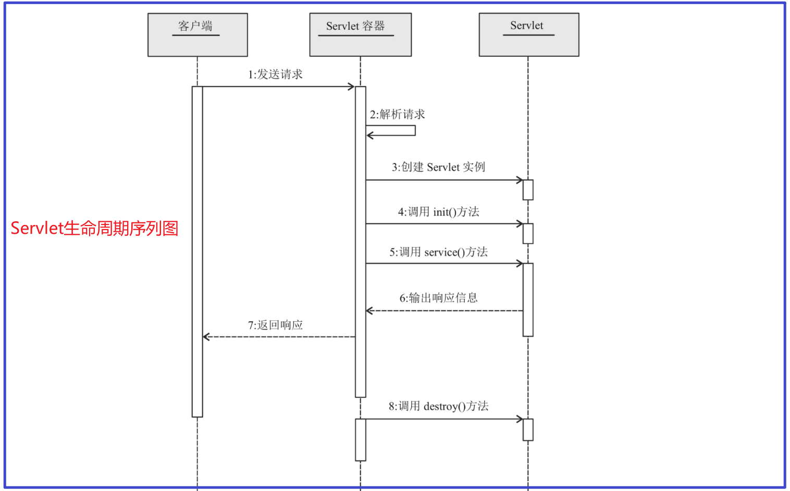

#  一 Introduction

官方文档：https://tomcat.apache.org/tomcat-8.5-doc/servletapi/

A servlet is a small Java program that runs within a Web server. 

Servlets receive and respond to requests from Web clients, usually across HTTP（the HyperText Transfer Protocol）

Servlet是运行在服务器里面的一个程序，可以对客户端的请求做出响应。Servlet主要是用来生成动态web资源的

<br>

## 1. Servlet简介

 Servlet（Server Applet）全称Java Servlet （ Java服务器端程序 ）、主要功能在于：交互式地浏览和修改数据，⽣成动态Web内容

- 狭义的Servlet是指Java语⾔实现的⼀个接⼝
- ⼴义的Servlet 是指任何实现了这个Servlet接⼝的类（⼀般情况下，⼈们将Servlet理解为后者）


<br>


## 2. Servlet使用步骤

- 建立一个JavaWeb Application项目并配置Tomcat服务器

- 自定义类： `实现Servlet接口` 或 `继承HttpServlet类并重写 doXXX 方法`（推荐后者）

  所有请求的入口都是service方法，HttpServlet 实现了 service 方法，通过继承HttpServlet的类也就有了service方法的实现，

  service根据请求方法（get / post / ... ）来调用对应的 doXXX 方法，我们只需要实现 doXXX方法即可

  如果非要自己实现 service 方法，请继承 GenericServlet 这个抽象类，或实现 Servlet 接口

  ```java
  @WebServlet(name = "LoginServlet", value = "/LoginServlet")
  public class LoginServlet extends HttpServlet {
      @Override
      protected void doGet(HttpServletRequest request, HttpServletResponse response) 
          throws ServletException, IOException {
          doPost(request, response);
      }
  
      @Override
      protected void doPost(HttpServletRequest request, HttpServletResponse response) 
          throws ServletException, IOException {
          response.setContentType("text/html;charset=utf-8");
  
          String username = request.getParameter("username");
          String password = request.getParameter("password");
          System.out.println(username);
          System.out.println(password);
  
          List<User> users = UserDao.login(new User(username, password));
          if(users.size() > 0){
              request.getRequestDispatcher("success.html").forward(request, response);
          }else {
              request.getRequestDispatcher("fail.html").forward(request, response);
          }
      }
  }
  
  ```

  <br/>

  

- 配置访问路径：使用注解（如上） 或 将自定义类的信息配置到 `web.xml` 文件并启动项目，配置方式如下所示：

  ```xml
  <!--    servlet相关配置-->
  <servlet>
     <servlet-name>helloServlet</servlet-name>
     <servlet-class>com.demo.HelloServlet</servlet-class>
  </servlet>
  <!--  配置浏览器访问方式  -->
  <servlet-mapping>
     <servlet-name>helloServlet</servlet-name>
     <url-pattern>/hello</url-pattern>
  </servlet-mapping>
  
  ```

- 启动Tomcat、浏览器上访问的路径为：`http://localhost:8080/工程路径/url-pattern的内容`   


<br>

## 3. Servlet编码问题

Request和Response的乱码问题： （ *在service中使用的编码解码方式默认为：ISO-8859-1编码* ）

```java

// Request乱码问题的解决方法
request.setCharacterEncoding("UTF-8");                             // 解决post提交方式的乱码
String name = request.getParameter("name");                        // 接收到get请求的中文字符串 
parameter = newString(name.getbytes("iso8859-1"),"utf-8");         // 将字符重新编码，默认编码为ISO-8859-1 

// Response的乱码问题(解决方式一)
response.setCharacterEncoding("utf-8");  // 设置HttpServletResponse使用 utf-8 编码
response.setHeader("Content-Type", "text/html;charset=utf-8");  // 通知浏览器使用 utf-8 解码

// Response的乱码问题(解决方式二)
response.setContentType("text/html;charset=utf-8");

```


<br>

## 4. Servlet生命周期

This interface defines methods to initialize a servlet, to service requests, and to remove a servlet from the server. These are known as life-cycle methods and are called in the following sequence:

1. The servlet is constructed, then initialized with the `init` method.
2. **Any calls from clients to the `service` method are handled.**
3. The servlet is taken out of service, then destroyed with the `destroy` method, then garbage collected and finalized.




<br/>

```java

@WebServlet("/hello")
public class HelloServlet extends HttpServlet {

    // init默认情况下会在当前servlet第一次被调用之前调用
    @Override
    public void init() throws ServletException {
        super.init();
    }

    @Override
    protected void doGet(HttpServletRequest req, HttpServletResponse resp) 
        throws ServletException, IOException {
        resp.getWriter().println("hello");
    }

    // 当前应用被卸载、服务器被关闭 时调用
    @Override
    public void destroy() {
        super.destroy();
    }
}

```

init、destroy方法有什么意义？

这两个方法分别会在当前servlet被创建以及被销毁的时候调用，

如果你的某个业务逻辑恰好也需要在该时间点去做一些操作，那么就可以把你的代码逻辑写在该方法中。

<br>

使用场景：统计每个servlet处理请求的次数，统计哪个servlet的访问量最高

方式一：每当用户访问一次，那么我将本地访问操作写入数据库，最终统计数据库里面某个地址出现的次数（频繁交互）

方式二：在servlet中定义一个成员变量，每当用户访问一次，变量值+1，destroy方法中将次数以及对应的地址写入数据库，重新上线之后，init方法中重新去读取数据库里面的值 

<br>

关于init方法，还有一个补充，默认情况下，是在**客户端第一次访问当前servlet之前被调用**，也可以设置一个参数

`load-on-startup=非负数` ，servlet的init方法就会随着应用的启动而被调用

```java

// 注解方式
@WebServlet(value = "/login",loadOnStartup = 1)

```

```xml

<!-- xml配置文件 -->
<servlet>
    <servlet-name>first</servlet-name>
    <servlet-class>com.xxxx.servlet.FirstServlet</servlet-class>
    <load-on-startup>1</load-on-startup>
</servlet>

```


<br>


## 5. JavaToJavaWeb

idea中将 javase 项目改造为 javaweb 项目：


新建一个java普通项目，并在该项目根目录下新建一个 web 目录


<br/>

### 1) WEB-INF 

将 web 目录设置为 资源目录：


此时web目录下会新增 WEB-INF 目录，且WEB-INF 目录下有一个web.xml目录

<br/>


### 2) 项目配置修改

此时还需设置 Artifacts：


<br>

配置本地Tomcat服务器：


点击Fix，使用前面设置的 Artifacts ，再设置一下 Deployment ，如下：


<br/>


### 3) 访问静态资源

这时已经可以启动项目访问静态资源了，先在 web 目录下新建一个 index.html, 再启动项目


<br/>


### 4) Servlet设置

想要实现servlet 相关的功能，必须要是用其 jar包，由于是java普通项目，这里这能借助 Tomcat 下的库来使用


<br>

然后新建一个Servlet，如下：


重新部署项目，访问：http://localhost:8080/se2ee/hello


end~~


<br/>


## 6. url-pattern详解

1、一个servlet可不可以设置多个url-pattern？ 可以

```java

@WebServlet(value = {"/hello","/helloServlet"},loadOnStartup = 1)

```

<br/>

2、多个servlet可不可以映射到同一个url-pattern？ 不可以

```java

/* 会抛出异常
Caused by: java.lang.IllegalArgumentException: 
The servlets named [com.xxxxx.servlet.servlet.HelloServlet] and 			 
                   [com.xxxxx.servlet.servlet.HelloServlet2] 
are both mapped to the url-pattern [/hello] which is not permitted

```

<br/>

3、url-pattern 的合法写法有哪些呢？

```java

/*
url-pattern的合法写法只有两种:

	/xxxxx    如 /user/login 、 /user/* 、 /* 、 /(DefaultServlet，下面会详细介绍) 等等
	
	*.xxxx    如 *.html	
	
常见错误写法：比如直接写 servletTest ( 没加 `/` )、  /hello*.do （ 中间加通配符 ）、 /user/*.do
    
Caused by: java.lang.IllegalArgumentException: Invalid <url-pattern> [servletTest] in servlet mapping

```


<br/>


### 1) 优先级问题

任何一个请求，最终都只会交给一个servlet来处理，

如果使用了通配符、有多个servlet都可以处理该请求，那么需要去选出一个优先级最高的来处理

```java

/*
1. /xxxx  优先级要高于  .xxxx    但 /(DefaultServlet，下面会详细介绍) 例外

2. 如果都是/xxxxx, 那么匹配程度越高，优先级越高 

	/user/login (精确匹配)  > /user/*  >  /*
	
总结： 精确路径 > 最长路径 > 后缀匹配 

```

<br/>

示例 （ 特殊的 /* ）：


值得注意的是 jsp 文件实际也是一个 servlet，Tomcat中有一个统一处理 jsp 的 Servlet

```xml
 
 <!--Tomcat的 conf\web.xml 文件 -->
 
<servlet>
    <servlet-name>jsp</servlet-name>
    <servlet-class>org.apache.jasper.servlet.JspServlet</servlet-class>
    <init-param>
        <param-name>fork</param-name>
        <param-value>false</param-value>
    </init-param>
    <init-param>
        <param-name>xpoweredBy</param-name>
        <param-value>false</param-value>
    </init-param>
    <load-on-startup>3</load-on-startup>
</servlet>

<!-- The mappings for the JSP servlet -->
<servlet-mapping>
    <servlet-name>jsp</servlet-name>
    <url-pattern>*.jsp</url-pattern>
    <url-pattern>*.jspx</url-pattern>
</servlet-mapping>

```

但是由于 `/*` 的优先级大于 `*.jsp`，显然这里两个以jsp结尾的请求只能由我们自定义的 myServlet 来处理


<br/>


### 2) 缺省Servlet

在上例的基础上，我们继续增加了一个 login.html 文件、和一个 MyDefaultServlet 

先看看这两个请求（毫无疑问，由于 /* 的优先级在这儿最高，结果跟上面一样）


<br/>

现在 注释掉 `/*` ，再看看结果：


a.jsp 匹配了 Tomcat 提供的 `*jsp` （如果非要比较  `*.jsp` 和 `/` 的优先级，想必结果已经不言而喻了）

```xml

<!-- 上面的请求即使我们不写 a.jsp， Tomcat的 conf/web.xml中也定义了默认的页面，所以并不会去匹配 我们定义的 / -->
<welcome-file-list>
    <welcome-file>index.html</welcome-file>
    <welcome-file>index.htm</welcome-file>
    <welcome-file>index.jsp</welcome-file>
</welcome-file-list>

```

<br>

可以得出如下结论：`/` 处理的是那些没有任何servlet可以处理的请求（一般为静态资源），故 `/` 又称为DefaultServlet（缺省Servlet）

其实、如果我们不定义缺省的Servlet，Tomcat已经定义了一个，如下：

```xml
 
 <!--Tomcat的 conf\web.xml 文件 -->
 
<servlet>
    <servlet-name>default</servlet-name>
    <servlet-class>org.apache.catalina.servlets.DefaultServlet</servlet-class>
    <init-param>
        <param-name>debug</param-name>
        <param-value>0</param-value>
    </init-param>
    <init-param>
        <param-name>listings</param-name>
        <param-value>false</param-value>
    </init-param>
    <load-on-startup>1</load-on-startup>
</servlet>

<servlet-mapping>
    <servlet-name>default</servlet-name>
    <url-pattern>/</url-pattern>
</servlet-mapping>

```

DefaultServlet 会去寻找对应的静态资源，若存在则返回对应静态资源，否则返回404

参照下图：


<br>

## 7. Servlet执行流程

```bash

Servlet的执行流程:

1. 浏览器发起请求（域名解析，TCP连接建立，发送HTTP请求）

2. 请求到达服务器主机，被监听80端口号的服务器程序接收到，实际是被Connector接收到，

    将请求报文解析成为request对象，同时提供一个response对象

3. Connector将这两个对象传给Engine，Engine进一步传给Host

4. Host根据会去挑选一个合适的Context应用，如果找到，则交给该Context去处理，

    如果没有找到，则会交给ROOT应用来处理

5. Context 根据 url-pattern 和Servlet之间的映射关系，将请求交给 对应的Servlet 

    若没有对应的Servlet，则交给 DefaultServlet 处理（返回静态资源或404）

6. 对应的Servlet运行service方法（反射），运行service方法时需要传递两个参数，

  使用一路传递过来的request、response恰好作为参数传递进去，执行方法

7. Connector通过response里面的数据， 生成响应报文，发送回客户端

```


<br/>


## 8. Servlet注解开发

Servlet3.0的出现是servlet史上最大的变革，其中的许多新特性大大的简化了web应用的开发

Servlet3.0提供的注解(annotation)，使得不再需要在web.xml文件中进行Servlet的部署描述，简化开发流程

注解配置：` @WebServlet`   常⽤属性如下：

| @WebServlet注解属性 | 类型           | 说明                                                         |
| ------------------- | -------------- | ------------------------------------------------------------ |
| asyncSupported      | boolean        | 指定Servlet是否⽀持异步操作模式                              |
| displayName         | String         | 指定Servlet显示名称                                          |
| initParams          | webInitParam[] | 配置初始化参数                                               |
| loadOnStartup       | int            | 标记容器是否在应⽤启动时就加载这个 Servlet，等价于配置⽂件中的标签 |
| name                | String         | 指定Servlet名称                                              |
| urlPatterns/value   | String[]       | 这两个属性作⽤相同，指定Servlet处理的url                     |

- `loadOnStartup`属性：

  标记容器是否在启动应⽤时就加载Servlet、默认不配置或数值为负数时表示客户端第⼀次请求Servlet时再加载；

  0或正数表示启动应⽤就加载，正数情况下，数值越⼩，加载该 Servlet的优先级越⾼

- `name`属性：

  可以指定也可以不指定，通过getServletName()可以获取到，若不指定，则为Servlet的 完整类名

  如：`cn.edu.UserServlet ` 

- `urlPatterns/value` 属性： String[]类型，可以配置多个映射、如：`urlPatterns={"/user/test", "/user/example"}` 

<br/>

```java

@WebServlet(name = "myUserServlet", urlPatterns = "/user/test",    // 必须有斜杠
 			loadOnStartup = 1, 
			initParams = {
                 @WebInitParam(name="name", value="zhangsan"),
                 @WebInitParam(name="pwd", value="123456")
             }
)
public class UserServlet extends HttpServlet {
    // ......
}


// 通常只需要设置访问路径即可
@WebServlet("/user/test")
public class UserServlet extends HttpServlet {
    // ......
}

```

<br>


# 三 Servlet

## 1. ServletConfig

Servlet容器使用ServletConfig对象在Servlet初始化期间向它传递配置信息，一个Servlet只有一个ServletConfig对象 

我们也可以通过该对象来获取一些servlet的**初始化参数**。

```xml

<!--xml中的初始化参数-->
<servlet>
    <servlet-name>default</servlet-name>
    <servlet-class>org.apache.catalina.servlets.DefaultServlet</servlet-class>
    <init-param>
        <param-name>debug</param-name>
        <param-value>0</param-value>
    </init-param>
    <init-param>
        <param-name>listings</param-name>
        <param-value>false</param-value>
    </init-param>
    <load-on-startup>1</load-on-startup>
</servlet>

```

<br/>

| ServletConfig接口方法                         | 说明                                      |
| --------------------------------------------- | ----------------------------------------- |
| `public String getInitParameter(String name)` | 返回名字为name的初始化参数的值            |
| `public Enumeration getInitParameterNames()`  | 返回Servlet所有初始化参数的名字的枚举集合 |
| `public ServletContext getServletContext()`   | 返回Servlet上下文对象的引用               |
| `public String getServletName()`              | 返回Servlet实例的名字                     |

<br>

```java

public class ConfigServlet extends GenericServlet {
    @Override
    public void service(ServletRequest servletRequest, ServletResponse servletResponse) 
        throws ServletException, IOException {
        
        //在程序运行时可以获取到该servlet初始化参数 init-param
        // 1. 拿到ServletConfig对象
        ServletConfig servletConfig = getServletConfig();
        
        // 2. 获取初始化的参数和值 （初始化参数可以在web.xml配置文件或注解中进行配置）
        String name = servletConfig.getInitParameter("name");
        System.out.println(name);
    }
}

```

关于ServletConfig：了解即可 (如果看到别人的代码这么写，知道什么意思即可)

<br>


## 2. ServletContext

对象的生命周期基本上是和应用的生命周期是一一对应的，该对象就是应用的一个抽象。

Servlet容器在Web应用程序加载时创建ServletContext对象，应用被销毁，该对象也会被销毁，

SerletContext对象中封装了非常多的应用的信息。

<br/>

该对象在一个应用中有且只有唯一的一个、在Web应用程序运行时，ServletContext对象可以被Web应用程序中所有的Servlet所访问

即SerletContext可以实现servlet之间的数据共享（数据共享还有其他方式如：数据库、序列化、Redis等）

<br/>


获取ServletContext对象的方法：

- 通过ServletConfig对象的 `getServletContext()` 方法来得到ServletContext对象
- 通过GenericServlet类的 `getServletContext()` 方法得到ServletContext对象

GenericServlet类的getServletContext（）也是调用ServletConfig对象的getServletContext（）方法来得到这个对象的。

```java
// Servlet 获取ServletContext对象
protected void doPost(HttpServletRequest req, HttpServletResponse resp) 
    throws ServletException, IOException {
    // 方法一：通过GenericServlet提供的 getServletContext()
    ServletContext servletContext1 = getServletContext();
    
    // 方法二：通过ServletConfig提供的getServletContext()
    ServletContext servletContext2 = getServletConfig().getServletContext();
    
    // 方法三：通过HttpServletRequest获取
    ServletContext servletContext3 = req.getServletContext();
    
    // 方法四：通过HttpSession获取
    ServletContext servletContext = req.getSession().getServletContext();
} 

```

<br>

ServletContext属性属于共享属性（任何一个Servlet都可以设置、读取某个属性）， 读取、移除和设置共享属性的方法：

- `public Object getAttribute(String name) ` ：读取名为name的属性
- `public Enumeration getAttributeNames()` ：
- `public void removeAttribute(String name)` ：删除名为name的属性
- `public void setAttribute(String name, Object object)` ：设置共享属性

| ServletContext接口常用方法                                   | 说明                          |
| ------------------------------------------------------------ | ----------------------------- |
| `public String getInitParameter(String name)`                | 获取初始化参数                |
| `public RequestDispatcher getRequestDispatcher(String path)` | 返回一个RequestDispatcher对象 |
| `　public RequestDispatcher getNamedDispatcher(String name)` | 同上、但参数为 servlet-name   |

<br>


**Servlet下文件的路径问题**：

```java

public class PathServlet extends HttpServlet {

    protected void doGet(HttpServletRequest request, HttpServletResponse response) 
        throws ServletException, IOException {
        
        // 普通java项目的相对路径是用户的工作目录： src 下
        // web项目（ee项目）的本质其实就是写了一些代码片段来供服务器调用
        // 故在servlet中通过下面的方式获取路径，得到的是Tomcat的 bin 目录
        File file = new File("1.txt");               
        System.out.println(file.getAbsolutePath());  // D:\apache-tomcat-8.5.37\bin\1.txt
        
        
        // 如何获取应用路径 docBase ---- 利用ServletContext可以获取应用的docBase
        // 我们通过虚拟映射等配置应用的应用名、docBase，这些配置项是会被tomcat读取的
        // 所以tomcat肯定可以知道某个应用的应用路径
        // tomcat给开发者提供了一个获取应用路径的方式，那就是利用servletrContext来获取
        ServletContext servletContext = getServletContext();
        
        //方式一：输入空字符串，返回docBase
        String realPath = servletContext.getRealPath("");
        System.out.println(realPath);
        
        //方式二：里面输入一个相对应用根目录的相对路径，可以返回文件的绝对路径
        String realPath1 = servletContext.getRealPath("1.txt");
        System.out.println(realPath1);
    }
}

```


<br/>


## 3. ServletRequest

当客户请求到来时，Servlet容器创建一个ServletRequest对象，封装请求数据，同时创建一个ServletResponse对象，封装响应数据

**javax.servlet.ServletRequest** 接口主要用于：向servlet提供客户端请求信息，从中获取到请求信息 

**javax.servlet.ServletResponse**接口用于定义一个对象来帮助Servlet向客户端发送响应  

<br>

| ServletRequest接口常用方法                                   | 说明                                                  |
| ------------------------------------------------------------ | ----------------------------------------------------- |
| `String getParameter(String name)`                           | 以字符串形式返回请求参数的值                          |
| `public String[] getParameterValues(String name)`            | 返回请求中name参数所有的值                            |
| `public void setAttribute(String name,Object o)`             | 保存名字为name的属性                                  |
| `public void removeAttribute(String name)`                   | 移除请求中名字为name的属性                            |
| `public void setCharacterEncoding(String env)`               | 设置字符编码（解决post提交方式的乱码）                |
| `public RequestDispatcher getRequestDispatcher(String path)` | 返回RequestDispatcher对象，作为path所定位的资源的封装 |

<br/>

```java

// ServletRequest 使用示例
@WebServlet("/hello")
public class HelloServlet extends HttpServlet {

    @Override
    protected void doGet(HttpServletRequest req, HttpServletResponse resp) 
        throws ServletException, IOException {

        StringBuilder result = new StringBuilder();
        
        // 请求行信息
        result.append("Method: ").append(req.getMethod()).append("\r\n");
        result.append("RequestURI: ").append(req.getRequestURI()).append("\r\n");
        result.append("RequestURL: ").append(req.getRequestURL()).append("\r\n");
        result.append("Protocol: ").append(req.getProtocol()).append("\r\n\r\n");

        // 请求头信息
        Enumeration<String> headerNames = req.getHeaderNames();
        while (headerNames.hasMoreElements()){
            StringBuilder headerLine = new StringBuilder();

            String headerName = headerNames.nextElement();
            headerLine.append(headerName).append(": ").append(req.getHeader(headerName));

            result.append(headerLine).append("\r\n");
        }

        // 用户信息
        String remoteUser = req.getRemoteUser();
        String remoteAddr = req.getRemoteAddr();
        String remoteHost = req.getRemoteHost();
        int remotePort = req.getRemotePort();

        result.append("\r\n").append("User: ").append(remoteUser).append("\r\n");
        result.append("User Addr: ").append(remoteAddr).append("\r\n");
        result.append("User Host: ").append(remoteHost).append("\r\n");
        result.append("User Port: ").append(remotePort).append("\r\n\r\n");

        // 服务器信息
        String localAddr = req.getLocalAddr();
        String localName = req.getLocalName();
        int localPort = req.getLocalPort();
        result.append("Server Addr: ").append(localAddr).append("\r\n");
        result.append("Server Name: ").append(localName).append("\r\n");
        result.append("Server Port: ").append(localPort).append("\r\n\r\n");


        // 获取表单请求参数
        Enumeration<String> parameterNames = req.getParameterNames();
        while(parameterNames.hasMoreElements()){
            String paraName = parameterNames.nextElement();
            String parameter = req.getParameter(paraName);

            result.append("Parameter-").append(paraName).append(": ").append(parameter).append("\r\n");
        }


        // 将信息保存到 应用根目录下的 request.txt
        ServletContext servletContext = getServletContext();

        // InputStream inputStream = servletContext.getResourceAsStream("request.txt");

        String path = servletContext.getRealPath("request.txt");
        // FileWriter writer = new FileWriter(path);
        // writer.write(String.valueOf(result));
        FileOutputStream fileOutputStream = new FileOutputStream(path);
        fileOutputStream.write(String.valueOf(result).getBytes());
        fileOutputStream.close();

        // 将信息响应给客户端
        resp.getWriter().println(result);
    }

    @Override
    protected void doPost(HttpServletRequest req, HttpServletResponse resp) 
        throws ServletException, IOException {
        this.doGet(req, resp);
    }

}

```

<br>


<br>


## 4. ServletResponse

| ServletResponse接口常用方法                        | 说明                                                    |
| -------------------------------------------------- | ------------------------------------------------------- |
| `public ServletOutputStream getOutputStream()`     | 返回ServletOutputStream对象，用于在响应中写入二进制数据 |
| `public PrintWriter getWriter()`                   | 返回PrintWriter对象，用于发送字符文本到客户端           |
| `public void setCharacterEncoding(String charset)` | 设置发送到客户端的响应的字符编码                        |
| `public void setContentType(String type)`          | 设置发送到客户端响应的内容类型                          |

<br>

**javax.servlet.http.HttpServletRequest**接口是ServletRequest接口的子接口，主要用于提供HTTP请求信息的功能

**javax.servlet.ServletResponse**接口用于定义一个对象来帮助Servlet向客户端发送响应 

| HttpServletRequest接口常用方法              | 说明                                                         |
| ------------------------------------------- | ------------------------------------------------------------ |
| `public Cookie[] getCookies()`              | 返回客户端在此次请求中发送的所有Cookie对象                   |
| `public voidaddCookie(Cookie cookie) `      | 添加一个Cookie到响应中                                       |
| `public HttpSession getSession()`           | 返回和此次请求相关联的Session，如果没有给客户端分配Session，<br />则创建一个新的Session |
| `public void sendRedirect(String location)` | 发送一个临时的重定向响应到客户端，让客户端访问新的URL        |

<br>


## 5. 转发和重定向

利用RequestDispatcher对象，可以把请求转发给其他的Servlet或JSP页面。在RequestDispatcher接口中定义了两种方法

| RequestDispatcher接口常用方法                                | 说明                                                         |
| ------------------------------------------------------------ | ------------------------------------------------------------ |
| `public void forward(ServletRequest request, ServletResponse response)` | 将请求从一个Servlet传递给服务器上的另外的Servlet、JSP页面或者是HTML文件 |
| `public void include(ServletRequest request,ServletResponse response)` | 在响应中包含其他资源（Servlet、JSP页面或HTML文件）的内容     |

<br>

有三种方法可以得到RequestDispatcher对象：

- 一是利用ServletRequest接口中的`getRequestDispatcher()`方法
- 另外两种是利用ServletContext接口中的 `getNamedDispatcher()` 和 `getRequestDispatcher()` 方法

```java
// 1. 利用ServletRequest接口中的getRequestDispatcher()方法
request.getRequestDispatcher("success.html").forward(request, response);

// 2. 利用ServletContext接口
getServletContext().getRequestDispatcher("/index.jsp").forward(request, response);	
```

注意：

- ServletRequest接口中的 `getRequestDispatcher()` 方法的参数不但可以是相对于上下文根的路径，而且可以是相对于当前Servlet的路径、例如：`/myservlet` 和 `myservlet` 都是合法的路径

- ServletContext接口中的 `getRequestDispatcher() ` 方法的参数必须以斜杠（/）开始，被解释为相对于当前上下文根（context root）的路径、例如：`/myservlet` 是合法的路径，而 `../myservlet` 是不合法的路径

  <br>

转发和重定向的区别：


```java
protected void doPost(HttpServletRequest request, HttpServletResponse response) 
    throws ServletException, IOException {
    response.setContentType("text/html;charset=utf-8");
    // 转发
    request.getRequestDispatcher("success.html").forward(request, response);
    // 重定向
    response.sendRedirect("test.html");
}
```


<br>

## 6. Cookie和Session

Cookies是一种由服务器发送给客户的片段信息，存储在客户端浏览器的内存中或硬盘上，在客户随后对该服务器的请求中发回它

Cookie的设置和获取：

```java
// 通过HttpServletResponse.addCookie的⽅式设置Cookie
Cookie cookie = new Cookie("jieguo","true");
response.addCookie(cookie);

// 服务端获取客户端携带的cookie：通过HttpServletRequest获取 
Cookie[] cookies = request.getCookies();
if(cookies != null)
    for(Cookie c : cookies){
        String name = c.getName();          // 获取Cookie名称
        if("jieguo".equals(name)){
            String value = c.getValue();    // 获取Cookie的值
            bool = Boolean.valueOf(value);  // 将值转为Boolean类型
        }
    }

// 删除Cookie是指使浏览器不再保存Cookie，使Cookie⽴即失效
Cookie cookie = new Cookie("username", "aaa"); // 创建⼀个name为username的Cookie
cookie.setMaxAge(0);                           // 删除cookie的关键（设置Cookie的有效时间为0）
response.addCookie(cookie);                    // 将有效时间为0的cookie发送给浏览器（达到删除cookie的目的）
```

<br>

Session是另⼀种记录客户状态的机制，不同的是Cookie保存在客户端浏览器中，⽽Session保存在服务器上、Session对象是在客户端第⼀次请求服务器的时候创建的

```java

HttpSession session = request.getSession();    // 获取Session对象
session.setAttribute("loginTime", new Date()); // 设置Session中的属性
out.println("登录时间为：" +(Date)session.getAttribute("loginTime")); // 获取Session属性

getMaxInactiveInterval();     // 获取Session的超时时间maxInactiveInterval属性
setMaxInactiveInterval(longinterval);  // 修改Session的超时时间

```

<br>

| HttpSession接口方法                                 | 说明                                                |
| --------------------------------------------------- | --------------------------------------------------- |
| `public Object getAttribute(String name)`           | 获取属性                                            |
| public void setAttribute(String name, Object value) | 设置属性                                            |
| public void removeAttribute(String name)            | 删除属性                                            |
| public String getId()                               | 返回一个字符串，其中包含了分配给Session的唯一标识符 |
| public ServletContext getServletContext()           | 返回Session所属的ServletContext对象                 |
| public void invalidate()                            | 使会话失效（例如用于退出登录）                      |
| public int getMaxInactiveInterval()                 | 两次连续请求之间保持Session打开的最大时间间隔       |
| public void setMaxInactiveInterval(int interval)    | 设置Session的超时时间间隔（单位为秒）               |

注意：

- 虽然Session保存在服务器，对客户端是透明的，它的正常运行仍然需要客户端浏览器的支持。这是因为Session需要使用Cookie作为识别标志

- 为了获得更⾼的存取速度，服务器⼀般把Session放在内存⾥、每个⽤户都会 有⼀个独⽴的Session

- 如果Session内容过于复杂，当⼤量客户访问服务器时可能会导致内存溢出、因此，Session⾥的信息应该尽量精简
- 为防⽌内存溢出，服务器会把⻓时间内没有活跃的Session从内存删除、这个时间就是Session的超时时间

```xml
<!--Session的超时时间也可以在web.xml中修改(单位是分钟)-->
<session-config> 
 <session-timeout>30</session-timeout>
</session-config>
```

<br>

在Servlet规范中，用于会话跟踪的Cookie的名字必须是JSESSIONID

- HTTP协议是无状态的，Session不能依据HTTP连接来判断是否为同一客户，因此服务器向客户端浏览器发送一个名为JSESSIONID的Cookie，它的值为该Session的id（也就是HttpSession.getId()的返回值）、Session依据该Cookie来识别是否为同一用户
- 该Cookie为服务器自动生成的，它的maxAge属性一般为–1，表示仅当前浏览器内有效，各浏览器间不共享，关闭浏览器就会失效
- 如果客户端浏览器将Cookie功能禁用，或者不支持Cookie怎么办？Java Web提供了另一种解决方案：URL地址重写

```java

// URL重写就是在URL中附加标识客户的Session ID
// Servlet容器解释URL，取出Session ID，根据Session ID将请求与特定的Session关联

//当浏览器禁用Cookie时，每次访问都要手动添加jesessionid ，servlet中指定：
HttpSession session=request.getSession();
String path="sess;jsessionid="+session.getId();
String path=response.encodeURL("sess");
response.sendRedirect(path);

```

<br>

```jsp

// 页面中使用
<a href="sess;jsessionid=${requestScope.id}">点击</a>

```

<br>

## 7. 监听器和过滤器

有时候你可能想要在Web应用程序启动和关闭时来执行一些任务（如数据库连接的建立和释放），或者你想要监控Session的创建和销毁，你还希望在ServletContext、HttpSession，以及ServletRequest对象中的属性发生改变时得到通知，那么你可以通过Servlet监听器来实现你的这些目的

Servlet API中定义了8个监听器接口，可以用于监听ServletContext、HttpSession和ServletRequest对象的生命周期事件，以及这些对象的属性改变事件


```java
@WebListener
public class MyListener implements ServletContextListener, HttpSessionAttributeListener {
    public MyListener() {
    }

    @Override
    public void contextInitialized(ServletContextEvent sce) {
        /* This method is called when the servlet context is initialized
        (when the Web application is deployed). */
    }

    @Override
    public void contextDestroyed(ServletContextEvent sce) {
        /* This method is called when the servlet Context is undeployed or Application Server shuts down. */
    }

    @Override
    public void attributeAdded(HttpSessionBindingEvent sbe) {
        /* This method is called when an attribute is added to a session. */
    }

    @Override
    public void attributeRemoved(HttpSessionBindingEvent sbe) {
        /* This method is called when an attribute is removed from a session. */
    }

    @Override
    public void attributeReplaced(HttpSessionBindingEvent sbe) {
        /* This method is called when an attribute is replaced in a session. */
    }
}
```

<br>

过滤器（Filter）是从Servlet 2.3规范开始新增的功能，并在Servlet 2.4规范中得到增强。过滤器是一个驻留在服务器端的Web组件，它可以截取客户端和资源之间的请求与响应信息，并对这些信息进行过滤


在一个Web应用程序中，可以部署多个过滤器，这些过滤器组成了一个过滤器链。过滤器链中的每个过滤器负责特定的操作和任务，客户端的请求在这些过滤器之间传递，直到目标资源

```java
// 登录拦截器示例
@WebFilter(filterName = "LoginFilter", urlPatterns = "*")
public class LoginFilter implements Filter {
    @Override
    public void doFilter(ServletRequest request, ServletResponse response, FilterChain chain) 
        throws ServletException, IOException {
        HttpServletRequest req= (HttpServletRequest)request;
        HttpServletResponse resp= (HttpServletResponse) response;
        boolean isLogin = (boolean)req.getSession().getAttribute("isLogin");
        if(isLogin){
            chain.doFilter(request, response);
        }else {
           resp.sendRedirect("/login.html");
        }
    }
}
```

除了使用注解，还可以在web.xml中配置：

```xml
<filter>
    <filter-name>LoginFilter</filter-name>
    <filter-class>com.example.filter.LoginFilter</filter-class>
</filter>
<filter-mapping>
    <filter-name>LoginFilter</filter-name>
    <url-pattern>/*</url-pattern>
</filter-mapping>
```

<br>


## 9. 文件上传和下载

上传页面示例：

```jsp
<!-- 注意:(1)form标签中要添加enctype属性 (2)提交方式必须是post -->
<form action="${pageContext.request.contextPath}/fileUpload" method="POST" enctype="multipart/form-data" >
 	<!-- input表单项 -->
    <input type="file" name="avatar"  />
</form>
```

使用IO流将文件返回

```java
@WebServlet("/fileUpload")
public class FileUploadServlet extends HttpServlet {
    @Override
    public void doPost(HttpServletRequest req, HttpServletResponse resp) throws IOException {
        resp.setContentType("text/html;charset=utf-8");
        ServletInputStream inputStream = req.getInputStream();
        PrintWriter out = resp.getWriter();
        int len;
        byte[] buffer = new byte[1024];
        while ( (len = inputStream.read(buffer)) != -1){
            String str = new String(buffer, 0, len);
            out.print(str);
        }
    }
}
```


**文件上传 SmartUpload和FileUpload**： 

- smartUpload： 是 www.jspsmart.com 一套上传的组件包，可以轻松的实现文件的上传和下载。使用简单、可以轻松的实现上传文件类型的限制、也可以轻易的取得上传文件的名称、后缀、大小等

- FileUpload 是 Apache 组织提供的免费上传组件。可以从 Apache 网站下载。相比 SmartUpload 开发、FileUpload 稍微复杂一些。但SmartUpload 已经多年没更新了， 而FileUpload 有 Apache 的加持，框架开发如 Structs2 和 SpringMVC 整合的都是 FileUpload。

  <br>

SmartUpload上传文件步骤：

```java
try {
    // 实例化SmartUpload、并初始化
    SmartUpload smartUpload = new SmartUpload();
    PageContext pageContext = JspFactory.getDefaultFactory()
        						.getPageContext(this, req, resp, null, false, 1024, true);
    smartUpload.initialize(pageContext);
    smartUpload.setCharset("utf-8");

    // 上传文件、获取上传文件的 File 对象、及文件基本信息
    smartUpload.upload();
    File file = smartUpload.getFiles().getFile(0);
    String fileName = file.getFileName();

    // 保存文件到指定目录
    String path = "file/" + fileName;
    file.saveAs(path, SmartUpload.SAVE_VIRTUAL);

    req.setAttribute("filename", fileName);

    // 如果表单中有其他数据时，不能通过request直接获取，需要通过SmartUpload对象获取
    String username = smartUpload.getRequest().getParameter("username");
    System.out.println(username);

    req.getRequestDispatcher("success.jsp").forward(req, resp);
} catch (SmartUploadException e) {
    e.printStackTrace();
}
```

```jsp
<!-- success.jsp -->

<a href="downloadImg?filename=${filename}">下载</a>
```

```java

// 文件下载代码：
String filename = request.getParameter("filename");

// 将响应的内容设置为通用的二进制流
response.setContentType("application/octet-stream");

// attachment 告诉浏览器以附件的方式下载文件(弹出下载框)
filename = URLEncoder.encode(filename, "utf-8");
response.addHeader("Content-Disposition", "attachment;filename="+filename);

request.getRequestDispatcher("file/"+filename).forward(request,response);
response.flushBuffer();

```


<br>

FileUpload上传文件步骤：

```xml
<!--maven导入FileUpload依赖-->
<dependency>
    <groupId>commons-fileupload</groupId>
    <artifactId>commons-fileupload</artifactId>
    <version>1.4</version>
</dependency>
<dependency>
    <groupId>commons-io</groupId>
    <artifactId>commons-io</artifactId>
    <version>2.6</version>
</dependency>
```


<br>


# 三 JSP技术

JSP全名为Java Server Pages，中⽂名叫java服务器⻚⾯，其根本是⼀个简化的Servlet设计

一个JSP页面由**元素**和**模板数据**组成。元素是必须由JSP容器处理的部分，而模板数据（HTML）是JSP容器不处理的部分


注释：在JSP页面中，可以使用两种类型的注释

- 一种是HTML注释，这种注释可以在客户端看到  
- 一种是为JSP页面本身所做的注释，通常是给程序员看的，我们称之为JSP注释

```html
<!-- HTML注释 -->
```

```jsp
<%-- JSP注释 --%>
```

<br>


## 1. JSP运行机制

JSP是一种建立在Servlet规范功能之上的动态网页技术、JSP文件在用户第一次请求时，会被编译成Servlet，然后再由这个Servlet处理用户的请求，所以JSP也可以被看成是运行时的Servlet。（Web容器和JSP容器是同义的）


JSP容器管理JSP页面生命周期的两个阶段：

- 转换阶段（translation phase）：当有一个对JSP页面的客户请求到来时，JSP容器检验JSP页面的语法是否正确，将JSP页面转换为Servlet源文件，然后调用javac工具类编译Servlet源文件生成字节码文件

- 执行阶段（execution phase）：Servlet容器加载转换后的Servlet类，实例化一个对象处理客户端的请求，在请求处理完成后，响应对象被JSP容器接收，容器将HTML格式的响应信息发送到客户端

Note：

- 当第一次加载JSP页面时，因为要将JSP文件转换为Servlet类，所以响应速度较慢

- 当再次请求时，JSP容器就会直接执行第一次请求时产生的Servlet，而不会重新转换JSP文件，所以其执行速度和原始的Servlet执行速度几乎相同

- 在JSP执行期间，JSP容器会检查JSP文件，看是否有更新或修改。如果有更新或修改，则JSP容器会再次编译JSP或Servlet；如果没有更新或修改，就直接执行前面产生的Servlet，这也是JSP相对于Servlet的好处之一

<br>


## 2. JSP指令元素

指令元素（directive element）：主要用于为转换阶段提供整个JSP页面的相关信息，指令不会产生任何输出到当前的输出流中

三大指令: page指令、include指令和taglib指令 

```jsp
<%--1. page指令  (要注意的是，在page指令中只有import属性可以重复设置)--%>
<%@page import="javax.servlet.*, java.util.Vector" %>
<%@page import="java.util.Random" %>

<%-- page指令不常用的属性：
language：当前JSP编译后的语言！默认为java，当前也只能选择java
info：当前JSP的说明信息,可以通过调用Servlet接口的getServletInfo()方法来得到
isThreadSafe：当前JSP是否执行只能单线程访问，默认为false，表示支持并发访问
session：当前页面是否可以使用session，默认为false，表示在JSP页面中可以使用隐含的session对象
extends：指定JSP编译的servlet的父类！ 
--%>
```

<br>

| page指令常用属性                             | 默认值 | 作用                                                         |
| -------------------------------------------- | ------ | ------------------------------------------------------------ |
| import="importList"                          |        | 指定在脚本环境中可以使用的Java类                             |
| buffer="none\|size kb"                       | 8kb    | 指定out对象（类型为JspWriter）使用的缓冲区大小，如果设置为none，则将不使用缓冲区 |
| autoFlush="true\|false"                      | true   | 当缓冲区满的时候，缓存的输出是否应该自动刷新                 |
| errorPage="error_url"                        |        | 当JSP页面发生异常时，将转向哪一个错误处理页面。如果一个页面通过使用该属性定义了错误页面，那么在web.xml文件中定义的任何错误页面将不会被使用 |
| isErrorPage="true\|false"                    | false  | 用于指定当前的JSP页面是否是另一个JSP页面的错误处理页面       |
| pageEncoding="peinfo"                        |        | 指定JSP页面使用的字符编码。如果没有设置这个属性，则JSP页面使用contentType属性指定的字符集，如果这两个属性都没有指定，则使用字符集“ISO-8859-1” |
| contentType="ctinfo"                         |        | 用于响应的JSP页面的MIME类型和字符编码                        |
| isELIgnored="true\|false"                    | false  | 在JSP页面中是否执行或忽略EL表达式(Servlet 2.3或之前版本的格式，则默认值是true) |
| deferredSyntaxAllowedAsLiteral="true\|false" |        | JSP页面的模板文本中是否允许出现字符序列`#{`                  |
| trimDirectiveWhitespaces="true\|false"       | false  | 指示模板中的空白应该如何处理(默认值是false，即不删除空白)    |

```jsp
<%--2. include指令 --%>
<%--用于在JSP页面中静态包含一个文件，该文件可以是JSP页面、HTML网页、文本文件或一段Java代码--%>
<%@include file="demo.jsp"%>

<%-- 3. taglib指令是用来在当前jsp页面中导入第三方的标签库--%>
<%@ taglib prefix="c" uri="http://java.sun.com/jsp/jstl/core" %>
prefix：指定标签前缀，这个东西可以随意起名
uri：   指定第三方标签库的uri（唯一标识）
```

<br>

## 3. JSP脚本元素

脚本元素（scripting element）包括：声明（declaration）、脚本段（scriptlet）、表达式（expression）

JSP 2.0增加了EL表达式，作为脚本元素的另一个选择

```java
<%--脚本元素（scripting element）--%>
<%--1. 声明（declaration）：用于在JSP页面中声明合法的变量和方法。以“<%!”开始，以“%>”结束 --%>
<%!
    public String getTodaysDate() {
        return (new Date()).toString();
    }
%>

<%--2. 脚本（scripts）：合法的Java代码。以“<%”开始，以“%>”结束。--%>
<%
    for(Enumeration<String> e = request.getHeaderNames(); e.hasMoreElements();){
        String header = e.nextElement();
        out.println(header + ": " + request.getHeader(header) + "<br />");
    }
    String message = "Thank you";
%>

<%--3. 表达式（expression）：计算表达式的值，并使用隐式对象out将结果以字符串的形式输出 --%>
Today is <%=java.util.Calendar.getInstance().getTime() %>
Today is
<%
    out.println(java.util.Calendar.getInstance().getTime());
%>

```

<br>

## 4. JSP动作元素

动作元素（action element）：动作元素为请求处理阶段提供信息

- 与JSP指令元素不同的是，JSP动作元素在请求处理阶段起作用。JSP动作元素是用XML语法写成的
- 利用JSP动作可以动态地插入文件、重用JavaBean组件、把用户重定向到另外的页面、为Java插件生成HTML代码

- 动作元素基本上都是预定义的函数，JSP规范定义了一系列的标准动作，它用JSP作为前缀，可用的标准动作元素如下

| 语法            | 描述                                          |
| --------------- | --------------------------------------------- |
| jsp:include     | 在页面被请求的时候引入一个文件                |
| jsp:useBean     | 寻找或者实例化一个JavaBean                    |
| jsp:setProperty | 设置JavaBean的属性                            |
| jsp:getProperty | 输出某个JavaBean的属性                        |
| jsp:forward     | 把请求转到一个新的页面                        |
| jsp:plugin      | 根据浏览器类型为Java插件生成OBJECT或EMBED标记 |
| jsp:element     | 定义动态XML元素                               |
| jsp:attribute   | 设置动态定义的XML元素属性                     |
| jsp:body        | 设置动态定义的XML元素内容                     |
| jsp:text        | 在JSP页面和文档中使用写入文本的模板           |

```jsp
<jsp:useBean id="test" class="com.example.main.TestBean" />

<jsp:setProperty name="test" property="message" value="hehe..." />
<jsp:getProperty name="test" property="message" />
```

```java
public class TestBean {
   private String message;
 
   public String getMessage() {
      return(message);
   }
   public void setMessage(String message) {
      this.message = message;
   }
}
```


<br>

## 5. JSP隐含对象

在JSP中一共有9个隐含对象，这个9个对象我可以在JSP中直接使用

| 隐含对象    | 类型                                   | 说明                                     |
| ----------- | -------------------------------------- | ---------------------------------------- |
| request     | javax.servlet.http.HttpServletRequest  | 可以获取用户发送的请求信息               |
| response    | javax.servlet.http.HttpScrvletResponse | 向浏览器发送响应信息                     |
| pageContext | javax.scrvlet.jsp.PageContext          | 当前页面的上下文                         |
| session     | javax.scrvlet.http.HttpSession         | 域对象，用来共享数据                     |
| application | javax.servlet.ServletContext           | 代表整个WEB应用，是JavaWeb中最大的域对象 |
| out         | javax.servlet.jsp.JspWriter            | 向页面输出内容                           |
| config      | javax.servlet.ServletConfig            | 当前JSP的配置信息(初始化参数)            |
| page        | java.lang.Object                       | 代表当前JSP的对象                        |
| exception   | java.lang.Throwable                    | 页面中的异常                             |

<br>

## 6. EL表达式语言

表达式语言（Expression Language，简称EL）语法简单，使用方便。所有的EL表达式都是以 `${` 开始，以 `}` 结束 

当EL表达式作为标签的属性值时，还可以使用`#{expr}`语法，这是在JSP 2.1版本中引入的延迟表达式（Deferred Expression）的语法

| EL基础操作符 |             **描述**             |
| :----------: | :------------------------------: |
|      .       | 访问一个Bean属性或者一个映射条目 |
|      []      |    访问一个数组或者链表的元素    |
|     ( )      |   组织一个子表达式以改变优先级   |
|      +       |                加                |
|      -       |              减或负              |
|      *       |                乘                |
|   / or div   |                除                |
|   % or mod   |               取模               |
|   == or eq   |           测试是否相等           |
|   != or ne   |           测试是否不等           |
|   < or lt    |           测试是否小于           |
|   > or gt    |           测试是否大于           |
|   <= or le   |         测试是否小于等于         |
|   >= or ge   |         测试是否大于等于         |
|  && or and   |            测试逻辑与            |
|  \|\| or or  |            测试逻辑或            |
|   ! or not   |             测试取反             |
|    empty     |           测试是否空值           |

```jsp
<!--使用表达式及操作符-->
Box Perimeter is: ${2*box.width + 2*box.height}
```

<br>

| EL隐含对象       | **描述**                      |
| :--------------- | :---------------------------- |
| pageScope        | page 作用域                   |
| requestScope     | request 作用域                |
| sessionScope     | session 作用域                |
| applicationScope | application 作用域            |
| param            | Request 对象的参数，字符串    |
| paramValues      | Request对象的参数，字符串集合 |
| header           | HTTP 信息头，字符串           |
| headerValues     | HTTP 信息头，字符串集合       |
| initParam        | 上下文初始化参数              |
| cookie           | Cookie值                      |
| pageContext      | 当前页面的pageContext         |

pageScope，requestScope，sessionScope，applicationScope变量用来访问存储在各个作用域层次的变量

```jsp
<!-- 脚本元素和表达式取值对比 -->
<%=pageContext.getAttribute("address1") %>
<%=pageContext.getAttribute("address", PageContext.REQUEST_SCOPE) %>
<%=pageContext.getAttribute("address", PageContext.SESSION_SCOPE) %>
<%=pageContext.getAttribute("address", pageContext.APPLICATION_SCOPE) %>

${pageScope.address1 }
${requestScope.address }
${sessionScope.address }
${applicationScope.address }

<!-- 需求2: 通过el表达式 从不确定域中获取数据 -->
<%=pageContext.findAttribute("address") %>
```

当表达式没有指定变量或者对象的范围时， 那么容器会依次从 `pageContext—>request—>session—>application` 中查找该变量或对象

**注意：** 

1. EL表达式只可以从四大域中获取数据，但不可以存放数据

2. EL表达式中的内容会显示到浏览器上
3. 使用pageContext的getAttribute方法或者findAttribute方法从4个范围中取出数据的时候、如果指定的key不存在、会返回null，而使用el表达式取出的时候指定的key不存在，页面上什么都不会显示

<br>

## 7. JSP标准标签库

JSP标准标签库（JavaServer Pages Standard Tag Library，JSTL）是一个JSP标签集合，它封装了JSP应用的通用核心功能

JSTL 库安装：

- 官方下载地址：http://tomcat.apache.org/taglibs/ 
- 菜鸟下载地址：[jakarta-taglibs-standard-1.1.2.zip](http://static.runoob.com/download/jakarta-taglibs-standard-1.1.2.tar.gz)  

maven引入：

```xml
<dependency>
    <groupId>javax.servlet</groupId>
    <artifactId>jstl</artifactId>
    <version>1.2</version>
</dependency>
<!--  jstl-1.2之后可不再使用standard.jar-->
```

<br>

| JSTL标签分类 | 引用语法                                                     |      |
| ------------ | ------------------------------------------------------------ | ---- |
| 核心标签     | <%@ taglib prefix="c" uri="http://java.sun.com/jsp/jstl/core" %> |      |
| 格式化标签   | <%@ taglib prefix="fmt" uri="http://java.sun.com/jsp/jstl/fmt" %> |      |
| SQL标签      | <%@ taglib prefix="sql"  uri="http://java.sun.com/jsp/jstl/sql" %> |      |
| XML标签      | <%@ taglib prefix="x" uri="http://java.sun.com/jsp/jstl/xml" %> |      |
| JSTL函数     | <%@ taglib prefix="fn" uri="http://java.sun.com/jsp/jstl/functions" %> |      |

<br>

## 8. JSTL核心标签

Core标签库主要包括了`一般用途的标签`、`条件标签`、`迭代标签`和`与URL相关的标签 ` 

```jsp
<!-- 在JSP页面中使用Core标签库，要使用taglib指令，指定引用的标签库 -->
<%@taglib prefix="c" uri="http://java.sun.com/jsp/jstl/core" %>
```

<br>

一般用途的标签有：`<c:out>`、`<c:set>`、`<c:remove>`和`<c:catch>` 

```jsp
<%-- 1. <c:out>: 类似于JSP的表达式<%=expression%>，或者EL表达式${el-expression} --%>
<c:out value="hello"></c:out>

<%-- 2. <c:set>: 用于设置范围变量（即范围属性）的值或者JavaBean对象的属性 --%>
<c:set var="width" value="25" scope="page" />
<c:out value="width: ${width}" /> <br/>

<%-- 3. <c:remove>: 用于移除指定范围的某个变量 --%>
<C:remove var="width" scope="page" />

<%-- 4. <c:catch>用于捕获在其中嵌套的操作所抛出的异常对象，并将异常信息保存到变量中 --%>
<c:catch var="exception">
    <%
        int temp = 5/0;
    %>
</c:catch>
<c:out value="exception: ${exception}" />
```

<br>

条件标签包括`<c:if>`、`<c:choose>`、`<c:when>`和`<c:otherwise>` 

```jsp
<%-- 1. <c:if> 用于实现Java语言中if语句的功能 --%>
<c:if test="${3 > 0}">
    显示: 3>0为true <br/>
</c:if>

<%-- 2. <c:choose>、<c:when>和<c:otherwise>一起实现互斥条件的执行，类似于Java语言的if/else if/else语句 --%>
<c:set var="username" value="admin" scope="application" />
<c:choose>
    <c:when test="${username == 'zhangsan'}">
        ${username} 是一个普通用户！ <br/>
    </c:when>
    <c:when test="${username == 'admin'}">
        ${username} 是管理员！ <br/>
    </c:when>
    <c:otherwise>
        ${username} 是一个临时访客！ <br/>
    </c:otherwise>
</c:choose>
```

<br>

迭代标签有`<c:forEach>`和`<c:forTokens>` 

```jsp
<%-- 1. <c:forEach>用于对包含了多个对象的集合进行迭代 --%>
<c:forEach var="i" begin="1" end="5">
    Item <c:out value="${i}"/><br/>
</c:forEach>

<%
    Map<String, Object> map = new HashMap<>();
    map.put("key1", "value1");
    map.put("key2", "value2");
    map.put("key3", "value3");
    request.setAttribute("testMap", map);
%>
<c:forEach items="${requestScope.testMap}" var="entry">
    ${entry} <br/>  <%--  等同于： ${entry.key} = ${entry.value} <br/>  --%>
</c:forEach>

<%-- 2. <c:forTokens>用于迭代字符串中由分隔符分隔的各成员 --%>
<c:forTokens items="zhangsan:lisi:wangwu" delims=":" var="name">
    ${name} <br/>
</c:forTokens>
```

<br>

超链接、页面的包含和重定向是Web应用中常用的功能，在JSTL中，也提供了相应的标签来完成这些功能，

这些标签包括`<c:import>`、`<c:url>`、`<c:redirect>`和`<c:param>` 

- `<c:import>` 用于导入一个基于URL的资源
- `<c:url>` 使用正确的URL重写规则构造一个URL
- `<c:param>` 为一个URL添加请求参数
- `<c:redirect>` 将客户端的请求重定向到另一个资源

```jsp
<%-- 1. <c:import>标签类似于 <jsp:include>动作元素 --%>
<c:import url="demo.jsp"/>

<%-- 2.  <c:url>和<c:param>用于构造一个URL、<c:redirect>遵循和<c:url>同样的重写规则 --%>
<c:url value="http://localhost:8080/login" var="loginUrl">
    <c:param name="username" value="admin"/>
    <c:param name="password" value="admin"/>
</c:url>
<a href="${loginUrl}" >登录</a>
```

<br>

## 9. JSTL其他标签

格式化标签包括`<fmt:timeZone>`、`<fmt:setTimeZone>`、`<fmt:formatNumber>`、`<fmt:parseNumber>`、`<fmt:formatDate>`和`<fmt:parseDate>`  

```jsp
<%-- <fmt:formatDate>标签用于使用不同的方式格式化日期 --%>
<c:set var="now" value="<%=new Date() %>"/>
<fmt:formatDate value="${now}" type="both" dateStyle="long" timeStyle="long"/><br/>
<fmt:formatDate value="${now}" pattern="yyyy-MM-dd HH:mm:ss"/> <br/>
```

<br>


