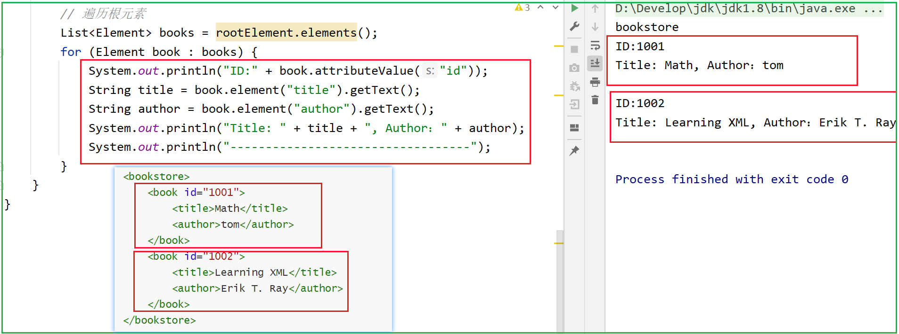

# 一 XML基础

XML（*EX*tensible *M*arkup *L*anguage） 是一种*标记语言*，是被设计用来传输和存储数据的。 [XML详细教程](https://www.w3school.com.cn/xml/xml_intro.asp)

## 1. 语法格式

- XML文档声明

  ```xml
  <?xml version="1.0" encoding="UTF-8"?>
  ```

- 标记 ( 元素 / 标签 / 节点)

  - 所有 XML 元素都须有关闭标签
  - XML 标签对大小写敏感
  - XML 必须正确地嵌套（不允许交叉）
  - XML 文档必须有唯一根元素
  - XML 的属性值须加引号

  ```xml
  <root>
    <child category="children">
      <subchild>.....</subchild>
    </child>
  </root>
  ```

- XML 中的注释

  ```xml
  <!-- This is a comment --> 
  ```

- XML注意事项

  - 在 XML 中，文档中的空格不会被删节
  - XML 以 LF 存储换行


## 2. 元素和属性

- **XML 元素** 指的是从（且包括）开始标签直到（且包括）结束标签的部分

  元素可包含其他元素、文本或者两者的混合物。元素也可以拥有属性

  ```xml
  <!-- <bookstore> 和 <book> 都拥有元素内容，因为它们包含了其他元素 -->
  <bookstore>
      <book id="1001">
          <title>Math</title> 
          <author>tom</author> 
      </book>
      <book id="1002">
          <title>Learning XML</title> 
          <author>Erik T. Ray</author> 
      </book>
  </bookstore> 
  ```

- 上例中，只有 `<book>` 元素拥有 **属性**  (`id="1001"`)  **XML 属性必须加引号**


## 3. CDATA

所有 XML 文档中的文本均会被解析器解析、**只有 CDATA 区段（CDATA section）中的文本会被解析器忽略**

- **PCDATA** 指的是 **被解析的字符数据（Parsed Character Data）**

- **转义字符**：非法的 XML 字符必须被替换为**实体引用（entity reference）**

  | 实体引用 | 符号 | 含义   |
  | -------- | ---- | ------ |
  | `&lt;`   | <    | 小于   |
  | `&gt;`   | >    | 大于   |
  | `&amp;`  | &    | 和号   |
  | `&apos;` | '    | 单引号 |
  | `&quot;` | "    | 引号   |

  在 XML 中，只有字符 "<" 和 "&" 确实是非法的。大于号是合法的，但是用实体引用来代替它是一个好习惯。

  - `"<"` 会产生错误，因为解析器会把该字符解释为新元素的开始

  - `"&"` 也会产生错误，因为解析器会把该字符解释为字符实体的开始

    

- **CDATA** 指的是不应由 XML 解析器进行解析的文本数据（Unparsed Character Data）

  CDATA 部分由 `*<![CDATA[*` 开始，由 `*]]>*` 结束：

  ```xml
  <script>
  <![CDATA[
  	function func(a, b){}
  ]]>
  </script>
  ```

  

## 4. XML验证

- **XML DTD**—— 定义 XML 文档的结构。它使用一系列合法的元素来定义文档结构。[XML DTD教程](https://www.w3school.com.cn/dtd/dtd_intro.asp)

- **XML Schema** —— 一种基于 XML 的 DTD 代替者，它名为 XML Schema。[XML Schema教程](https://www.w3school.com.cn/schema/schema_schema.asp)


## 5. 解析XML

**Java中的XML解析方式**：

| 解析方式  | 说明                                                   |
| --------- | ------------------------------------------------------ |
| SAX解析   | 解析方式是事件驱动机制，逐行读取XML文件解析            |
| DOM解析   | 加载整个文档到内存中，建立文档树模型                   |
| JDOM解析  | 简化了与XML的交互，并且比使用DOM实现更快               |
| DOM4J解析 | JDOM的一种智能分支（集成的XPath 支持、XML Schema支持） |

- **SAX解析**：每当解析到一个标签的开始/结束/内容/属性时触发事件

  - 优点: 1. 分析能够立即开始，而不是等待所有的数据被处理  2. 逐行加载,节省内存, 有助于解析大于系统内存的文档 

    ​	 	3. 有时不必解析整个文档,它可以在某个条件得到满足时停止解析. 

  - 缺点: 1. 单向解析，无法定位文档层次，无法同时访问同一文档的不同部分数据

    ​			(因为逐行解析, 当解析第n行是, 第n-1行已经被释放了, 无法在进行操作了)

    ​         2. 无法得知事件发生时元素的层次, 只能自己维护节点的父/子关系. 

    ​         3. 只读解析方式, 无法修改XML文档的内容.

- **DOM解析**：可以通过操作文档树, 来完成数据的获取、修改、删除等.
  - 优点: 文档在内存中加载, 允许对数据和结构做出更改. 访问是双向的，可以在任何时候在树中双向解析数据。 
  - 缺点: 文档全部加载在内存中 , 消耗资源大.
- **JDOM解析**：使用20%（或更少）的精力解决80%（或更多）Java/XML问题
  - 优点:  使用具体类而不是接口，简化了DOM的API。 大量使用了Java集合类，方便了Java开发人员
  - 缺点：没有较好的灵活性、性能不是那么优异。
- **DOM4J解析**：它是JDOM的一种智能分支
  - 它合并了许多超出基本XML文档表示的功能，包括集成的XPath 支持、XML Schema支持以及用于大文档或流化文档的基于事件的处理，它还提供了构建文档表示的选项
  - DOM4J是一个非常优秀的Java XML API，具有性能优异、功能强大和极端易用使用的特点，同时它也是一 个开放源代码的软件。如今你可以看到越来越多的Java软件都在使用DOM4J来读写XML。 目前许多开源项目中大量采用DOM4J , 例如:Hibernate


**XML常见的解析器**：

| 解析器 | 说明                                                         |
| ------ | ------------------------------------------------------------ |
| dom4j  | 一个开源 XML 解析包，采用了 Java 集合框架并完全支持 DOM，SAX 和 JAXP （Jaxen） |
| Jsoup  | jsoup 是一款Java 的HTML解析器，可直接解析某个URL地址、HTML文本内容 （） |
| PULL   | Android操作系统内置的解析器（sax方式）                       |
| JAXP   | sun公司提供的解析器，支持dom和sax两种思想                    |


# 二 DOM4J

DOM4J是一个开源 XML 解析包、应用于 Java 平台，采用了 Java 集合框架并完全支持 DOM，SAX 和 JAXP

要是用DOM4J首先要导入 dom4j.jar 和 jaxen.jar，maven项目导入如下：

```xml
<dependency>
    <groupId>dom4j</groupId>
    <artifactId>dom4j</artifactId>
    <version>1.6.1</version>
</dependency>
<!--jaxen: 使dom4j支持xpath操作-->
<dependency>
    <groupId>jaxen</groupId>
    <artifactId>jaxen</artifactId>
    <version>1.1</version>
</dependency>
```

普通java项目导入 jar 包 参照：[IDEA导入jar包](./jar包导入.md)


## 1. 解析XML文件

例：使用dom4j读取如下xml文档：

```xml
<!--books.xml-->
<bookstore>
    <book id="1001">
        <title>Math</title> 
        <author>tom</author> 
    </book>
    <book id="1002">
        <title>Learning XML</title> 
        <author>Erik T. Ray</author> 
    </book>
</bookstore> 
```

```java
public class XMLReadDemo {
    public static void main(String[] args) throws Exception {
        SAXReader saxReader = new SAXReader();
        InputStream inputStream = XMLReadDemo.class.getResourceAsStream("/books.xml");

        // 读取XML文档的输入流 , 并得到文档对象
        Document document = saxReader.read(inputStream);
        // 获取根元素对象
        Element rootElement = document.getRootElement();
        System.out.println(rootElement.getName());
        
        // 根据Document对象获得根节点后，就可以对Element对象进行操作了（遍历根元素）：
        List<Element> books = rootElement.elements();
        for (Element book : books) {
            System.out.println("ID:" + book.attributeValue("id"));
            String title = book.element("title").getText();
            String author = book.element("author").getText();
            System.out.println("Title: " + title + ", Author：" + author);
            System.out.println("----------------------------------");
        }
    }
}
```



read方法除了可以解析输入流外，还可以是File类的对象，URL等


## 2. 解析网络文件

```java
public class NetXMLDemo {
    public static void main(String[] args) throws Exception {
        SAXReader saxReader = new SAXReader();
        String phoneNumber = "1669752356";
        URL url = new URL("http://apis.juhe.cn/mobile/get?phone=" + phoneNumber + 
                          "&dtype=xml&key=9f3923e8f87f1ea50ed4ec8c39cc9253");
        URLConnection urlConnection = url.openConnection();
        InputStream inputStream = urlConnection.getInputStream();

        Document document = saxReader.read(inputStream);
        Element rootElement = document.getRootElement();
        String code = rootElement.elementText("resultcode");
        if("200".equals(code)){
            Element result = rootElement.element("result");
            String province = result.elementText("province");
            String city = result.elementText("city");
            String company = result.element("company").getText();
            String zip = result.element("zip").getText();
            if(province.equals(city)){
                System.out.println("归属地："+city);
            }else{
                System.out.println("归属地："+province+" "+city);
            }
            System.out.println("运营商：" + company);
            System.out.println("邮政编码：" + zip);
        }else{
            System.out.println("请输入正确的手机号码");
        }
    }
}
```


## 3. XPATH解析

XPath即为XML路径语言，它是一种用来确定XML（标准通用标记语言的子集）文档中某部分位置的语言，如：

| 路径表达式      | 结果                                                         |
| :-------------- | :----------------------------------------------------------- |
| bookstore       | 选取 bookstore 元素的所有子节点。                            |
| /bookstore      | 选取根元素 bookstore。注释：假如路径起始于正斜杠( / )，则此路径始终代表到某元素的绝对路径！ |
| bookstore/book  | 选取属于 bookstore 的子元素的所有 book 元素。                |
| //book          | 选取所有 book 子元素，而不管它们在文档中的位置。             |
| bookstore//book | 选择属于 bookstore 元素的后代的所有 book 元素，而不管它们位于 bookstore 之下的什么位置。 |
| //@lang         | 选取名为 lang 的所有属性。                                   |

想了解更多关于XPATH的信息，请参考：<a herf="https://www.w3school.com.cn/xpath/xpath_syntax.as "> XPATH教程</a> 


使用dom4j的Xpath需要导入`jaxen.jar`

```java
// 使用 xpath  Node为
// 获取所有 author 元素
List<Node> authors = document.selectNodes("//author");
for (Node author : authors) {
    System.out.println(author.getText());
}
// 获取所有 ID ：1001和1002
List<Node> nodes = document.selectNodes("//@id");
for (Node node : nodes) {
    System.out.println(node.getText());
}
```


## 4. 生成XML文件

1. 通过文档帮助器 (DocumentHelper) 创建空的文档对象 `Document doc = DocumentHelper.createDocument(); `

2. 通过文档对象, 向其中添加根节点 `Element root = doc.addElement("根节点名称"); `
3. 通过根节点对象root , 丰富我们的子节点 `Element e = root.addElement("元素名称"); `
4. 创建一个文件输出流 ,用于存储XML文件 `FileOutputStream fos = new FileOutputStream("要存储的位置"); `
5. 将文件输出流, 转换为XML文档输出流 `XMLWriter xw = new XMLWriter(fos); `
6. 写出文档 `xw.write(doc); `
7. 释放资源 `xw.close();`

```java
public class CreateXML {
    public static void main(String[] args) throws Exception {
        //1. 通过文档帮助器, 创建空的文档对象
        Document doc = DocumentHelper.createDocument();
        //2. 向文档对象中, 加入根节点对象
        Element books = doc.addElement("books");
        //3. 向根节点中 丰富子节点
        for (int i = 0; i < 1000; i++) {
            //向根节点中加入1000个book节点.
            Element book = books.addElement("book");
            //向book节点, 加入id属性
            book.addAttribute("id", 1 + i + "");
            //向book节点中加入name和info节点
            Element name = book.addElement("name");
            Element info = book.addElement("info");
            name.setText("西游记" + i);
            info.setText("取经之路" + i);
        }
        
        // 4. 创建文件的输出流
        FileOutputStream fos = new FileOutputStream("test.xml");
        //5. 将文件输出流 , 转换为XML文档输出流
        XMLWriter xw = new XMLWriter(fos);
        // 6. 写出XML文档
        xw.write(doc);
        // 7. 释放资源
        xw.close();
    }
}
```


## 5. XStream

XStream的作用：将Java中的对象, 转换为 XML字符串 （需要导入依赖）

```java
<dependency>
    <groupId>com.thoughtworks.xstream</groupId>
    <artifactId>xstream</artifactId>
    <version>1.4.10</version>
</dependency>
```

```java
public class ObjectToXML {
    public static void main(String[] args) {
        // 1. 创建XStream 对象
        XStream xStream = new XStream();
        //2. 修改类生成的节点名称 (默认节点名称为 包名.类名)
        xStream.alias("person", Person.class);
        // 3. 传入对象 , 生成XML字符串
        Person p = new Person("张三", 18, "男");
        String s = xStream.toXML(p);
        System.out.println(s);
    }
}
```

```xml
<!--运行结果-->
<person>
  <name>张三</name>
  <age>18</age>
  <sex>男</sex>
</person>
```


# 三 JSON

**JSON（JavaScript Object Notation）**： JS对象符号（或表示法） , 是一种轻量级的数据交换格式，类似 XML

但它比 XML 更小、更快，更易解析。


**JSON 语法规则**：JSON 语法是 JavaScript 对象表示语法的子集

- 数据在 名称/值对中
- 数据由逗号分隔
- 大括号 **{}** 保存对象
- 中括号 **[]** 保存数组，数组可以包含多个对象

```javascript
{
  "books": [
    {
      "name": "西游记",
      "price": 33
    },
    {
      "name": "水浒传",
      "price": 34
    }
  ]
}
```

下面将分别用Gson和FastJson解析上述json字符串


## 1. Gson

```xml
<!--导入依赖-->
<dependency>
    <groupId>com.google.code.gson</groupId>
    <artifactId>gson</artifactId>
    <version>2.8.7</version>
</dependency>
```

```java
public class GsonDemo {
    public static void main(String[] args) {
        Book book = new Book("三国演义", 66);
        // 将对象转换为JSON字符串
        Gson gson = new Gson();
        String s = gson.toJson(book);
        System.out.println(s);  // {"name":"三国演义","price":66}

        // 解析json字符串
        String jsonStr = "{\"name\": \"水浒传\",\"price\": 34}";
        Book myBook = gson.fromJson(jsonStr, Book.class);
        System.out.println(myBook);  // Book{name='水浒传', price=34}
    }
}
```


## 2. FastJson

```xml
<dependency>
    <groupId>com.alibaba</groupId>
    <artifactId>fastjson</artifactId>
    <version>1.2.76</version>
</dependency>
```

```java
public class FastJsonDemo {
    public static void main(String[] args) {
        Book book = new Book("三国演义", 66);
        // 将对象转换为JSON字符串
        String s = JSON.toJSONString(book);
        System.out.println(s);  // {"name":"三国演义","price":66}

        // 解析json字符串
        String jsonStr = "{\"name\": \"水浒传\",\"price\": 34}";
        Book myBook = JSON.parseObject(jsonStr, Book.class);
        System.out.println(myBook);  // Book{name='水浒传', price=34}
    }
}
```

