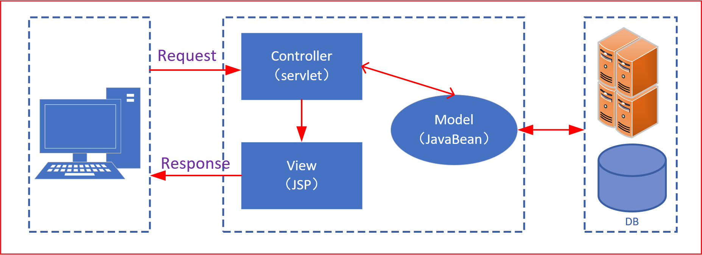
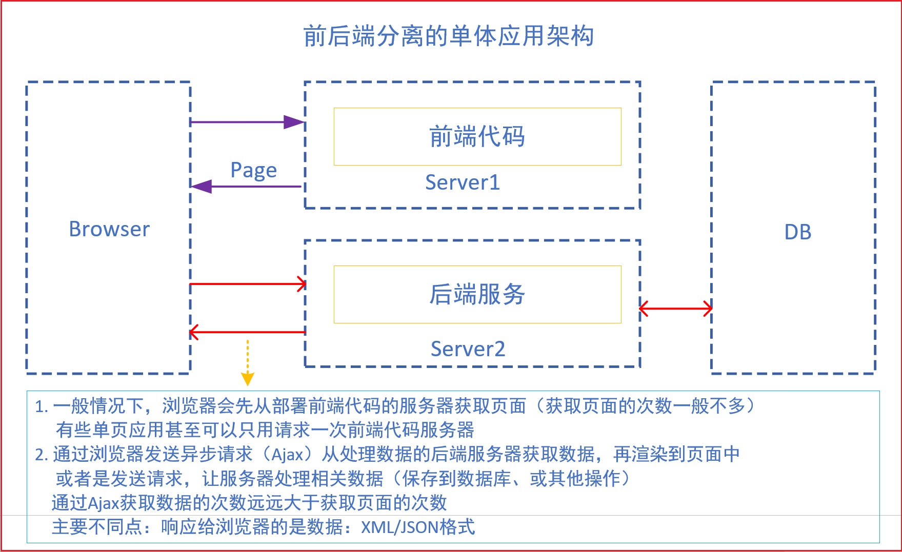

```bash

引言：
现在有挺多人学完Java，可能都没怎么使用过jsp或jsp+Servlet开发过项目，
就直接学习使用Spring、SpringMVC或者Spring Boot等框架进行开发。

但是如果没有经历一个逐步演进的过程，就很难体会到框架带给了我们什么样的好处，而且开发过程中遇到问题也难以理解，
甚至会觉得现在的开发模式繁琐复杂，更别说去学习这些框架中的源码了。

学习是一个循序渐进的过程，不能急于求成，当然我们也不可能把JavaWeb相关的知识都学一遍，但是了解其发展历史对我们理解现在的开发模式还是有一定帮助的，有了这些基础、同时弄清楚某种技术因何而生、解决了什么问题，在宏观上有一个整体认知，对于开发者来说还是有必要的

```


# 一 JavaWeb发展历程

## 1. 静态网页时期

1989 年 3 月 12 日，在瑞士的欧洲核子研究中心 (CERN) 工作的蒂姆·伯纳斯-李 (Timothy John Berners-Lee) 向他的老板递交了一篇题目为“Information Management: A Proposal”的建议书[1]。后来人们把这一天当作万维网 (WWW, World Wide Web) 诞生的日子。

提出这一想法之后，蒂姆·伯纳斯-李爵士就开始着手实现这一想法。

接下来的一两年中，他开发了 HTTP 协议，HTML 标准，第一个浏览器，第一个 web 服务器软件，第一个网页，架设了第一个 web 服务器 [http://info.cern.ch](http://info.cern.ch/)。而第一个浏览器的名字就叫做 WorldWideWeb[2]。

蒂姆·伯纳斯-李在 1990 年下半年在一台 NeXT 电脑上开始开发 WorldWideWeb，但只能在 NeXT 上运行。

WorldWideWeb 第一个版本出现的时间是 1990 年 12 月 25 日。它不仅是一个网页浏览器，也是一个 WYSIWYG 网页编辑器。

<br>

为了纪念 Web 诞生三十周年，CERN 后来重新发布了 web 版的 WorldWideWeb[3]。

因此我们现在可以在一个现代的浏览器里运行历史上第一个浏览器 WorldWideWeb 来浏览网页，体验一下原汁原味 1989 年的 web。

地址: https://worldwideweb.cern.ch/browser 

<br>

注：

1. [Tim Berners-Lee's proposal](http://info.cern.ch/Proposal.html)
2. [WorldWideWeb, the first Web client](https://www.w3.org/People/Berners-Lee/WorldWideWeb.html)
3. [CERN 2019 WorldWideWeb Rebuild](https://worldwideweb.cern.ch/)

<br>


这一阶段，Web 服务器基本上只是一个静态资源服务器，每当客户端浏览器发来访问请求，它都来者不拒的建立连接，查找URL指向的静态页面，再返回给客户端。


随着网页的飞速发展，人们发现要 **人工实现所有信息的编写** 是非常困难的，而且非常耗时。

此外，静态网站只能够根据用户的请求返回指向的网页，除了进行超链接跳转，没办法实现任何交互。

但人们想要的还有更多：

- 网页能够动态显示
- 直接使用数据库里的数据
- 网页能够进行用户交互

显然静态资源已经满足不了需求，根据用户请求的不同，动态的处理并返回资源的技术开始被迫切需求

<br>


## 2. Java的诞生


<br/>

1994 年，网景公司发布了 Navigator 浏览器，但他们急需一种网页脚本语言，以使浏览器可以与网页互动

1995年，网景公司的 Brendan Eich 迫于公司的压力，只花了十天就设计了 JS 的最初版本，并命名为 Mocha。

```bash

JS的命名：Mocha 摩卡 => LiveScript => JavaScript

浏览器一开始是同时支持Java和JS的，后来JS胜利

有人说网景公司为了蹭 Java 的热度，把语言最终改名为 JavaScript

但实际情况是，网景公司和 Sun 公司结成联盟，才更名为 JavaScript

```

**从此网页有了一些简单的用户交互**，比如表单验证；也 **有了一些 JS 为基础的动效**，如走马灯等

但是让网页真正开始进入动态网页时代的却是后端技术。

<br>

```java

/*
也正是这个时期，各个语言纷纷崭露头角

比如世界上最好的语言PHP: 1995年以Personal Home Page Tools (PHP Tools) 开始对外发表第一个版本: PHP1.0！

```


<br/>


## 3. CGI技术时代

为了满足动态处理的需求，CGI（Common Gateway Interface）就出现了

CGI的全称是通用网关接口，是一种Web应用规范，同时也是一个可执行的程序或者可运行的脚本，

C、Python、shell语言都可以写CGI。

CGI时代解决了静态页面时代最大的难题，就是动态页面的实现，那么CGI是怎么解决的动态页面的实现呢？

```

如果浏览器发送了一个CGI请求，服务器就会启动一个进程运行CGI程序或脚本，由CGI来处理数据，并把结果返回给服务器，

服务器再将结果返回给浏览器。通过CGI技术可以使Web应用程序与客户端浏览器交互。


CGI还可以访问数据库，这一点非常重要，因为几乎每一个Web程序都需要对数据进行存取，这些数据基本上都保存在数据库中。

CGI程序的诞生，开启了动态Web应用的时代，给了这种技术无限的可能性。

但CGI技术也存在很多不足之处，如实现CGI程序的难度较大，而且CGI的性能也面临考验

```


CGI 有一个明显的缺点，就是占资源，速度也会变慢

CGI每处理一个请求就会建立一个进程，大量的进程会占用大量的资源，这也就导致CGI无法同时处理很多的并发请求

即便后来所出的 **FastCGI** 也只解决了CGI重复启动进程和初始化的问题，并没有本质变化


<br>


## 4. Servlet的诞生

针对这样的需求，Microsoft有ASP标准，而Java则推出了Servlet技术

```java

/*

Microsoft公司于1996年推出一种Web应用开发技术ASP，用于取代对Web服务器进行可编程扩展的CGI标准

1998年是值得纪念的一年，在这一年里，Java家族迎来了第一个支持动态Web技术的成员，这就是Servlet

```

<br>

Servlet就是为了解决CGI的不足，最初的Servlet对每个请求都是单独启动一个线程，而不是进程

这种处理方式大幅度地降低了系统里的进程数量，提高了系统的并发处理能力 

<br>

```java

其实在当时，Java提供了applet和servlet两种方式解决方案：
	1995年，JAVA语言的第一版发布，随之发布的Java applets（JAVA小程序）首次实现了异步加载，
    浏览器通过运行嵌入网页中的Java applets与服务器交换数据，不必刷新网页
    
a. applet是纯客户端(浏览器)方案，
    applet就是浏览器中的Java插件，浏览器通过它解释执行Web服务器发来的Java代码，从而实现动态交互。
    此方法浏览器必须安装插件，同时又受浏览器限制导致Java代码不能太多太复杂；

b. servlet是服务端解决方案，在服务器运行Java代码，将运行结果返回给客户端。
    
    
    
在此期间，前端技术栈也一直在发展，
    1998年前后，Outlook Web Access小组完成了允许客户端脚本发送HTTP请求（XMLHTTP）的第一个组件
    该组件原属于微软Exchange Server，并且迅速地成为了Internet Explorer 4.0[2]的一部分
    
	有人认为，Outlook Web Access是第一个应用了Ajax技术的成功的商业应用程序，
    并成为包括Oddpost的网络邮件产品在内的许多产品的领头羊。
    
    遗憾的是，直到2005年初，发生了许多事件才使得Ajax被大众所接受

```

<br>

Servlet (Server Applet)：是运行在服务端的程序

```java

/*

由于Servlet是由Java实现的，因此，Servlet将继承Java的所有优点。Servlet的主要优势可归纳为如下几点：　

1. 由于Java是跨平台的，Servlet也就自然成了跨平台的技术。

2. 由于Java可以通过JDBC访问数据库，而且支持JDBC的数据库非常多，因此Servlet也就可以利用Java的这项特性访问更多的数据库。　

3. 除此之外，Java还具有更高级的特性，如多线程、网络等技术。Servlet自然也就可以利用这些技术增强Web程序的功能了。


实际上，Servlet程序的运行原理就相当于远程方法调用。
在服务端的Servlet程序中（一个Servlet程序就是HttpServlet类的子类）有一个service方法。

当客户端提交请求时，Web服务器接收到这个请求，就将该请求交给Servlet引擎来处理。
当Servlet引擎找到该请求指定的Servlet时，就会调用Servlet类中的service方法，并且将请求信息和响应信息传入service方法。
所有的响应和请求的服务端逻辑都要写在service方法中。

在service方法中，用可以在处理完逻辑时给客户端返回相应的信息，当然，也可以什么都不返回。
从这一点可以看出，在客户端访问Servlet，就相当于发送一个远程调用服务端组件的方法的请求。

```

本质上讲Servlet是Java为开发Web应用提供的一个接口，但是通常认为Servlet指的则是实现了Servlet接口的类。

<br>


Servlet虽然可以实现全部的动态Web应用程序的功能，但是 Servlet 必须将客户端代码使用HttpServletResponse对象发送到客户端。

如果客户端的页面非常复杂，则这样做的工作量是相当大的，而且代码不易维护。

```java

//  Servlet 初期 ，动态网页的实现可以参考如下代码：
    
public void doGet(HttpServletRequest request,HttpServletResponse)
    throws IOException,ServletException
{
    response.setContentType("text/html;charset=gb2312");
    PrintWriter out = response.getWriter();
    out.println("<html>");
    out.println("<head><title>Hello World！</title></head>");
    out.println("<body>");
    out.println("<p>Hello World！</p>");
    out.println("</body></html>");
}

```

CGI 时代的开发模式也是类似的写法，但是CGI是基于进程的，Servlet时代则是单进程多线程、而且CGI的实现更复杂

相比CGI时期，Servlet已经有了很大的进步，但是所有代码全都混在了Servlet类中，对于前端来说，是非常难以开发和修改的

（ 或许我们都应该庆幸晚生了好多年 ）


<br>


## 5. 纯JSP开发模式

Servlet诞生后，SUN公司很快发现了Servlet编程非常繁琐，这是因为：

Servlet代码中有大量冗余代码，每个Servlet都有一模一样的或基本近似的代码，比如out输出你可能就得写成百遍；

开发Servlet必须精通网页前端和美工，你得非常不直观的在Servlet中写前端代码，这使得实现各种页面效果和风格非常困难。

所以，为了使设计页面更方便、SUN公司借鉴了Microsoft的ASP，在1999年发布了JSP规范、正式推出了JSP（Servlet1.1）

```java 

JSP和ASP非常相似，它们都是在同一个页面中混合了客户端代码和服务端代码
    
在ASP页面中可以将HTML、JavaScript等客户端代码和VBScript等服务端脚本混合在一起，而JSP页面中可以使用Java代码作为服务端脚本

```

<br>

经过纯Servlet开发的噩梦之后，Sun公司又推出（或者说是倡导）了JSP技术，全称是Java Server Page

JSP中采用HTML语言直接生成界面，还可以在界面中使用 `<% %>` 脚本标识嵌入Java代码，但其本质也是最终生成一个Servlet类来编译解析。如果要开发具有大量网页内容的网站，可以先使用网页编辑工具编写网页，然后在网页中嵌入处理代码即可。

一个简单的例子：

```jsp

<%@ page language="java" contentType="text/html; charset=UTF-8"
    pageEncoding="UTF-8"%>
<%@ page import="java.io.*,java.util.*" %>
<!DOCTYPE html>
<html>
    <head>
        <meta charset="utf-8">
        <title>demo</title>
    </head>
    <body>
        <h1>使用 GET 方法读取数据</h1>
        <ul>
            <li><p><b>用户名:</b>
                <%= request.getParameter("name")%>
                </p></li>
            <li><p><b>昵称:</b>
                <%= request.getParameter("nickname")%>
                </p></li>
        </ul>
    </body>
</html>

```

<br/>

```

JSP原理：

就像其他普通的网页一样，您的浏览器发送一个HTTP请求给服务器。
Web服务器识别出这是一个对JSP网页的请求，并且将该请求传递给JSP引擎。通过使用URL或者.jsp文件来完成。

JSP引擎从磁盘中载入JSP文件，然后将它们转化为servlet。
这种转化只是简单地将所有模板文本改用println()语句，并且将所有的JSP元素转化成Java代码。

JSP引擎将servlet编译成可执行类，并且将原始请求传递给servlet引擎。
Web服务器的某组件将会调用servlet引擎，然后载入并执行servlet类。
在执行过程中，servlet产生HTML格式的输出并将其内嵌于HTTP response中上交给Web服务器。
Web服务器以静态HTML网页的形式将HTTP response返回到您的浏览器中。

最终，Web浏览器处理HTTP response中动态产生的HTML网页，就好像在处理静态网页一样。

```

用一句话来讲：**每个JSP都最终会变成对应的Servlet执行**  


<br>

虽然JSP可以实现网站的快速开发，但依然存在缺点：

网站的输入输出、处理、控制全部夹杂在一起，维护不方便，即使只需要修改该页面的一个简单按钮文本，或者一段静态的文本内容，

也不得不打开混杂的动态脚本的页面源文件进行修改。也就是说，所有的东西都耦合在一起

当网站中需要进行大量的处理代码的时候，JSP文件将很难维护，并且代码也不容易共享。

前端开发人员需要看大量他看不懂的后端代码；同样，后端开发人员也需要在复杂的前端代码中找到其能写servlet代码的地方

<br/>

所以也就有了这样一个说法：Servlet是在**Java代码中写HTML代码**。与之对应的JSP就是在**HTML代码中写Java代码**


<br>


## 6. JSP+JavaBean

因为JSP在编写网页方面具有优势，而编写处理代码存在很多问题，所以有人把JSP中的处理代码使用JavaBean来实现

于是出现了JSP+JavaBean的开发模式


<br>

这种模式其实十分简单，它使用 JSP 页面和 JavaBean 相结合的方式，由 JSP 页面来接收客户端请求，用 JavaBean 或其他服务完成业务逻辑、数据库操作和返回页面。（ JavaBean 是指能完成特定功能的 Java 类 ）

把一些业务逻辑、数据库操作的内容放到了JavaBean中，而JSP页面负责显示以及请求调度的工作。

虽然好了些，但还让JSP做了过多的工作，JSP中把视图工作和请求调度（控制器）的工作耦合在一起了，如下所示：

```jsp

<%@ page import="cn.itdrizzle.bean.UserBean" %>
<%@ page contentType="text/html;charset=UTF-8" language="java" %>
<html>
<head>
    <title>Register</title>
</head>
<body>
    <%--获取 表单提交的 javabean --%>
    <jsp:useBean id="user" type="cn.itdrizzle.bean.UserBean" scope="page">
        <jsp:setProperty name="user" property="username"/>
        <jsp:setProperty name="user" property="password"/>
    </jsp:useBean>

    <%--展示数据--%>
    <div>用户名：<jsp:getProperty name="user" property="username"/> </div>
    <div>密码：  <jsp:getProperty name="user" property="password"/> </div>

    <%--访问数据库--%>
    <%
        UserBean userBeanOp = new UserBean();
        boolean res = userBeanOp.insert(user);

        if (res) {
            // 注册成功
        } else {
            // 注册失败，转发到表单页面
            request.getRequestDispatcher("/form.jsp").forward(request, response);
        }
    %>
</body>
</html>

```

<br>

```java

// javaBean -此时的javaBean 包含了一些和数据库进行交互的方法

/**
 * @Classname UserBean
 * @Description TODO
 * @Date 2022/4/14 13:38
 * @Author idrizzle
 */
public class UserBean implements Serializable {
    private String username;
    private String password;
    
    // getter and setter ...
    
    // 数据库相关操作的方法
    public boolean insert(UserBean user){
        // database access
        return true;
    }
}

```

 jsp + JavaBean 模式技术实现了页面展示和业务逻辑分离。使用jsp技术中 HTML、css等可以非常容易地构建数据显示页面，

而对于数据处理可以交给JavaBean技术，如连接数据库代码、显示数据库代码等同时也可以达到重用的目的等

<br>

（1）优点：架构简单，比较适合小型项目开发

（2）缺点：JSP 职责不单一，职责过重，不便于维护

这种模式虽然在一定程度上实现了解耦，但 JSP 职责依旧不单一


<br>

## 7. Model2开发模式

JSP + JavaBean 的开发模式在JSP页面中嵌入了流程控制以及调用了JavaBean的方法，随着业务逻辑复杂度的增加，

使用这种模式在开发及维护上都是非常复杂的，维护成本是非常高的

<br>

Model2开发模式是在 JSP + JavaBean （Model1第二代） 开发模式的基础上改进而来，具体就是将JSP中嵌入的调用JavaBean代码

及部分流程控制程序抽取出来，放到单独的组件处理，这个组件就是控制器

这样就从Model1模式升级到了Model2模式了（Model2模式符合MVC模型）

<br>

Model2的MVC思想：

JSP(V)：将后端代码封装在标签中，通过使用大量标签避免JSP出现后台代码；（html+css+js+el+jstl）

Servlet(C)：Servlet完成Controller的功能再加上部分代码逻辑；(Servlet, Fileter, Listener)

Model(M)：Servlet将数据发送给Ｍodel，Ｍodel包括部分代码逻辑，同时代表着被组织好的用于返回的数据 ( jdbc )



此后、Model层逐渐被拆分，从JavaBean开始：即分离出以前JavaBean中的义务逻辑代码（大多是操作数据库的代码），

此后的 JavaBean 结构就更简单了，在项目中基本被作为数据的载体，不再承担多余的逻辑处理，基本等同于现在常用的pojo

而拆分出来的部分单独作为一层 （dao / mapper ）, 后来随着业务逻辑代码的增多，该层代码逐渐变得臃肿，因此又增加了一层service层，专门处理复杂的业务逻辑


<br>


## 8. 发展历程小结

第一阶段：静态网页

第二阶段：CGI时代

第三阶段：Servlet初期

第四阶段：纯JSP开发模式 （ Model1第一代 ）

第五阶段： JSP+JavaBean（ Model1第二代 )

第六阶段：Servlet + JSP + JavaBean（ Model2、MVC ）

<br>


在整个Model1模式阶段，整个Web应用几乎全部由JSP页面组成，JSP页面接受处理客户端请求，对请求处理后直接做出响应。

最多就是用少量的JavaBean来处理数据库连接、数据库访问等操作。

优点：架构简单，比较适合小型项目开发。

缺点：从工程化角度看，它的局限性非常明显；JSP的职责不单一，身兼View和Controller两种角色，将控制逻辑职和表现逻辑

​           混杂在一起，职责过重，代码的可复用性低，不便于维护。

<br>

Model2下的JSP不在承担控制器的责任，它仅仅是表现层角色，仅仅用于将结果呈现给用户。

浏览器发来的请求与Servlet(控制器)交互，而Servlet负责与后台的JavaBean通信。

在Model2模型下，模型(Model)由JavaBean充当，视图(View)有JSP页面充当，而控制器(Controller)则由Servlet充当。

项目职责清晰，各司其职，互不干扰，有利于组件的重用，适合大型的Web项目。


<br>


# 二 MVC与三层架构

## 1. MVC是什么

MVC最初并不是在如今 B/S 架构的环境下提出的，参照如下论文：

[Applications Programming in Smalltalk- 80™: How to use Model-View-Controller (MVC) - 百度学术 (baidu.com)](https://xueshu.baidu.com/usercenter/paper/show?paperid=1a010my0e01d06s0fw0j0tv08x084493) 


但它的分层解耦思想一直延续了下来：

Oracle文档中关于MVC的介绍： [Website Development with the MVC Framework and APIs (oracle.com)](https://docs.oracle.com/en/middleware/webcenter/sites/12.2.1.4/develop/website-development-mvc-framework-and-apis.html#GUID-05109BCD-2D5F-4436-84BB-A139B0DAE38E) 

```java

Server-Side MVC Framework：
    
The MVC design pattern involves the separation of model, view, and Controller. 
Model represents the data, view represents the presentation, and Controller links the model and the view. Clear separation makes the code readable and easily modifiable, and it’s easy to accommodate technological changes.

    
The model represents the data.

In WebCenter Sites, a model is a map of key-value pairs. Asset data as well as any data determined in business logic would be part of the model.

    
The view represents the presentation.

In WebCenter Sites, a view is a Template or SiteEntry object that renders to a browser. The view contains no business logic, and it renders the model data in an interface for users to view and modify the data. It also sends user actions (such as visitor clicks) to the Controller.

    
The Controller links the model and the view. Performing business logic on underlying data, the Controller puts together a model in a way that can be used in a view.

In WebCenter Sites, a Controller is a standard asset instance. A presentation asset (Template or SiteEntry asset type) can link to a Controller. This link is optional. When it is present, WebCenter Sites invokes the linked Controller before invoking the view. As with any asset type, assets of type Controller can be approved and published.

Controllers can extend and import other Controllers. A BaseController provides convenient accessors, debugging, and much more. In addition, you can use Java APIs in a Controller, as described in Server-Side Java APIs.

```

<br>

不同历史阶段，不同的软件系统中，对于mvc的描述也许存在差异，但现阶段的开发模式（尤其在Java里面）是相对固定的，

常见的Java单体服务端应用架构：


<br>


**关于JavaBean的一些说明：**

来源（Sun）：https://www.oracle.com/java/technologies/javase/javabeans-spec.html

JavaBean来源于 C/S 架构的桌面程序开发中，在Web时代初期其含义基本与以前一致，

在model 1 开发模式下，JavaBean通常包含了数据库操作的代码，

但从 JSP + JavaBean + Servlet 的model2 开发模式起，JavaBean中的义务代码被逐步分离，到现在基本与pojo等同


<br>


## 2. 三层架构模型

三层架构(3-tier architecture) 通常意义上的三层架构就是将整个业务应用划分为： 

```java

表现层（User Interface ）                        

业务逻辑层（Business Logic ）                    

数据访问层/持久层（Data access ）                  

```

<br>

简单来说这只是一种分层思想，即为了 “**高内聚低耦合**” 的思想，但在不同的场景和技术体系下表现或许不尽相同

在解决复杂的软件系统时，软件设计者用得最多的技术之一就是分层的设计思想

```java
/*

分层的特点：
	上层使用下层定义的服务
	下层不能使用上层定义的服务
	每一层对自己的上层隐藏其下层的实现细节
	
分层的优点：
	降低软件系统构件之间的耦合度，实现“低耦合，高内聚”原则
	提升系统灵活性，可以在接口相同的情况下替换某层的具体实现
	可以增强复用度，下层可以为多个上层提供服务
	
分层的缺点：
	过多的分层会影响系统性能
	分层可能会带来各层的联级修改

```

<br>

**表现层**：

表现层也称为界面层，位于最外层（最上层），离用户最近。用于显示数据和接收用户输入的数据，为用户提供一种交互式操作的界面。

<br>


**业务层（逻辑层、service层）**：

业务层（Business Logic Layer）无疑是系统架构中体现核心价值的部分。

它的关注点主要集中在业务规则的制定、业务流程的实现等与业务需求有关的系统设计，也即是说它是与系统所应对的领域（Domain）逻辑有关，很多时候，也将业务逻辑层称为领域层。

例如Martin Fowler在《Patterns of Enterprise Application Architecture》一书中，将整个架构分为三个主要的层：表示层、领域层和数据源层。作为领域驱动设计的先驱Eric Evans，对业务逻辑层作了更细致地划分，细分为应用层与领域层，通过分层进一步将领域逻辑与领域逻辑的解决方案分离。 　　

业务层在体系架构中的位置很关键，它处于数据访问层与表示层中间，起到了数据交换中承上启下的作用。

**由于层是一种弱耦合结构，层与层之间的依赖是向下的，底层对于上层而言是“无知”的，改变上层的设计对于其调用的底层而言没有任何影响**。如果在分层设计时，遵循了面向接口设计的思想，那么这种向下的依赖也应该是一种弱依赖关系。

因而在不改变接口定义的前提下，理想的分层式架构，应该是一个支持可抽取、可替换的“抽屉”式架构。

正因为如此，业务层的设计对于一个支持可扩展的架构尤为关键，因为它扮演了两个不同的角色。

对于数据访问层而言，它是调用者；对于表示层而言，它却是被调用者。

依赖与被依赖的关系都纠结在业务层上，如何实现依赖关系的解耦，则是除了实现业务逻辑之外留给设计师的任务

<br>


**持久层（DAO）**：

持久层，有时候也称为是数据访问层，其功能主要是**负责数据库的访问**，可以访问数据库系统、二进制文件、文本文档或是XML文档。

采用DAO模式，建立实体类和数据库表映射（ORM映射）。简单的说法就是实现对数据表的select、insert、update以及delete的操作。

如果要加入ORM的元素，那么就会包括对象和数据表之间的mapping，以及对象实体的持久化。

<br>


<br/>


关于三层架构及其应用介绍的一些网站：

IBM：https://www.ibm.com/cloud/learn/three-tier-architecture 

```java
/*

Presentation tier：
The presentation tier is the user interface and communication layer of the application, 
where the end user interacts with the application.

Application tier
The application tier, also known as the logic tier or middle tier, is the heart of the application. 

Data tier
The data tier, sometimes called database tier, data access tier or back-end, is where the information processed by the application is stored and managed.

三者之间的联系：
In a three-tier application, all communication goes through the application tier. 
The presentation tier and the data tier cannot communicate directly with one another.

```

<br/>

What is tier-3 architecture in DBMS?  

https://www.tutorialspoint.com/what-is-tier-3-architecture-in-dbms


AWS: [*Architectural pattern for web application*](https://docs.aws.amazon.com/whitepapers/latest/serverless-multi-tier-architectures-api-gateway-lambda/web-application.html) 


[3-Tier Web Architecture, 3 Tier Web Application Architecture – Arokia IT](https://arokiait.com/3-tier-web-architecture.htm)


<br/>


## 3. 前后端分离

在JSP参与开发的时代，由于返回给浏览器的页面都是在后端将数据处理完毕后，再写入到页面中，最后返回完整的  view，

浏览器直接显示页面即可，

```java

/*
传统的Java Web开发过程中，大型项目的JSP不是由后端开发者来独立完成的
前端会把页面先做出来，后端需要把前端页面嵌入到JSP中（或者使用其他的Thymeleaf模板也可以）把数据整合到页面中。

开发中一直存在的问题就是：如何把我们后端返回的数据添加到页面中?
如果后端在页面中遇到一些问题，需要把JSP发给前端开发，前端开发人员看不懂JSP。
此时前端也不好解决，后端也不好解决。这样沟通和开发效率非常低！前后端耦合度太高，开发起来太麻烦！

```


<br>


```java

/*
前后端分离的开发模式：
前端只需要独立编写客户端代码，后端也只需要独立编写服务端代码提供数据接口即可
前端通过AJAX请求来访问后端的数据接口，将Model展示到View中即可

前后端开发者只需要提前约定好接口文档（URL、参数、数据类型…），然后分别独立开发即可
前端可以自己造假数据进行测试，完全不需要依赖于后端，最后完成前后端集成即可
这种开发方式真正实现了前后端应用的解耦合！极大提升开发效率

```



当然、将前后端代码均部署到同一个服务器也可以，通过使用不同端口即可实现。

前后端分离可以简单理解为将一个单体应用拆分成两个独立的应用：前端应用和后端应用，通常以JSON格式进行数据交互

<br>

```javascript

/*
关于Ajax和传统HTTP请求的区别：

传统的web应用允许用户填写表单(form)，当提交表单时就向web服务器发送一个请求。
服务器接收并处理传来的表单，然后返回一个新的网页

Ajax相较于传统方式，最大的区别在于可以在不刷新页面的情况下，直接从服务器获取数据
获得的数据经过js处理（dom操作、vue的双向绑定）后再显示到网页上
这使得Web应用程序可以更为迅捷地回应用户动作，并避免了在网络上发送那些没有改变过的信息。

```

