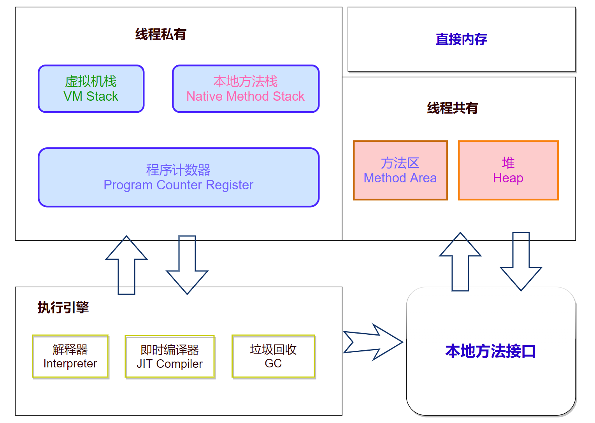

## 一 JVM简介

Java Virtual Machine，JAVA程序的**运行环境**（JAVA二进制字节码的运行环境）

- 一次编写，到处运行
- 自动内存管理，垃圾回收机制
- 数组下标越界检查

### 

关于jdk、jre和jvm三个基本概念的中英文及解释：

- **JDK (Java Development Kits)** -- Java 开发工具集

  JDK 是整个 JAVA 的核心，包括了 Java 运行环 境（Java Runtime Environment），一堆 Java 工具（javac/java/jdb 等）和 Java 基的类库（即 Java API 包括 rt.jar），它不提供具体的开发软件，它提供的是无论你用何种开发软件写 Java 程序都必须用到的类库和 Java 语言规范。

- **JRE (Java Runtime Environment)** --Java 运行时环境

- **JVM （Java Virtual Machine）**-- Java虚拟机

  JVM 可以理解成一个可运行 Java 字节码的虚拟计算机系统， 它有一个解释器组件，可以实现 Java 字节码和计算机操作系统之间的通信 ，对于不同的运行平台，有不同 的 JVM，JVM 屏蔽了底层运行平台的差别，实现了“一次编译，随处运行”。

## 二 内存结构

### 1. 程序计数器

​	用于保存JVM中下一条所要执行的指令的地址

- 线程私有

  - CPU会为每个线程分配时间片，当当前线程的时间片使用完以后，CPU就会去执行另一个线程中的代码
  - 程序计数器是**每个线程**所**私有**的，当另一个线程的时间片用完，又返回来执行当前线程的代码时，通过程序计数器可以知道应该执行哪一句指令

- 不会存在内存溢出

  

### 2. 虚拟机栈

- 每个**线程**运行需要的内存空间，称为**虚拟机栈**
- 每个栈由多个**栈帧**组成，对应着每次调用方法时所占用的内存
- 每个线程只能有**一个活动栈帧**，对应着**当前正在执行的方法**  

问题

- 垃圾回收是否涉及栈内存？
  - **不需要**。因为虚拟机栈中是由一个个栈帧组成的，在方法执行完毕后，对应的栈帧就会被弹出栈。所以无需通过垃圾回收机制去回收内存。
- 栈内存的分配越大越好吗？
  - 不是。因为**物理内存是一定的**，栈内存越大，可以支持更多的递归调用，但是可执行的线程数就会越少。
- 方法内的局部变量是否是线程安全的？
  - 如果方法内**局部变量没有逃离方法的作用范围**，则是**线程安全**的 
  - 如果 **局部变量引用了对象**，并 **逃离了方法的作用范围**，则需要考虑线程安全问题 

**Java.lang.stackOverflowError** 栈内存溢出，**发生原因**  ：

- 虚拟机栈中，**栈帧过多**（如无限递归）
- 每个栈帧**所占用过大** 

### 3. 本地方法栈

一些带有**native关键字**的方法就是需要JAVA去调用本地的C或者C++方法，因为JAVA有时候没法直接和操作系统底层交互，所以需要用到本地方法

### 4. 堆(Heap)

通过new关键字**创建的对象**都会被放在堆内存， Java堆是垃圾收集器管理的内存区域，因此一些资料中它也被称作“GC堆”（Garbage Collected Heap）

- **所有线程共享**，堆内存中的对象都需要**考虑线程安全问题**  
- 有垃圾回收机制

堆内存溢出：**java.lang.OutofMemoryError** ： java heap space. 

### 5. 方法区

用于存储已被虚拟机加载的类型信息、常量、静态变量、即时编译器编译后的代码缓存等数据。

**永久代（Permanent Generation）**： 
 永久代是 HotSpot 虚拟机对方法区的具体实现，永久代本身也存在于虚拟机堆中，在 JDK 1.7 中，移除永久代的工作就已经开始了，存储在永久代中的数据转移到了虚拟机堆或者 Native Memory 中

**元空间（Meta Space）**： 
 从 JDK 1.8 开始，HotSpot 虚拟机完全移除了永久代，改为在 Native Memory 中存放这些数据，新的空间被称为元空间

关于永久代和元空间的历史简介：

在JDK 8以前，许多Java程序员都习惯在HotSpot虚拟机上开发、部署程序，很多人都更愿意把方法区称呼为“永久代”（Permanent Generation），或将两者混为一谈。

本质上这两者并不是等价的，因为仅仅是当时的HotSpot虚拟机设计团队选择把收集器的分代设计扩展至方法区，或者说使用永久代来实现方法区而已，这样使得HotSpot的垃圾收集器能够像管理Java堆一样管理这部分内存，省去专门为方法区编写内存管理代码的工作。

但是对于其他虚拟机实现，譬如BEA JRockit、IBM J9等来说，是不存在永久代的概念的。原则上如何实现方法区属于虚拟机实现细节，不受《Java虚拟机规范》管束，并不要求统一。

但现在回头来看，当年使用永久代来实现方法区的决定并不是一个好主意，这种设计导致了Java应用更容易遇到内存溢出的问题（永久代有-XX：MaxPermSize的上限，即使不设置也有默认大小，而J9和JRockit只要没有触碰到进程可用内存的上限，例如32位系统中的4GB限制，就不会出问题），而且有极少数方法（例如String::intern()）会因永久代的原因而导致不同虚拟机下有不同的表现。

当Oracle收购BEA获得了JRockit的所有权后，准备把JRockit中的优秀功能，譬如Java MissionControl管理工具，移植到HotSpot虚拟机时，但因为两者对方法区实现的差异而面临诸多困难。考虑到HotSpot未来的发展，在JDK 6的时候HotSpot开发团队就有放弃永久代，逐步改为采用本地内存（Native Memory）来实现方法区的计划了，到了JDK 7的HotSpot，已经把原本放在永久代的字符串常量池、静态变量等移出，而到了JDK 8，终于完全废弃了永久代的概念，改用与JRockit、J9一样在本地内存中实现的**元空间（Meta-space）**来代替，把JDK 7中永久代还剩余的内容（主要是类型信息）全部移到元空间中。

**运行时常量池（Runtime Constant Pool）**是方法区的一部分。Class文件中除了有类的版本、字段、方法、接口等描述信息外，还有一项信息是常量池表（Constant Pool Table），用于存放编译期生成的各种字面量与符号引用，这部分内容将在类加载后存放到方法区的运行时常量池中。

**串池（String Table）**： 
 为避免字符串被重复创建，JVM 引入了串池的概念，当一个字符串变成字符串对象时，该字符串会在已经被创建好的串池中查找是否有同名的字符串，如果有，就将已存在的字符串的地址赋给该字符串对象，如果没有就将该字符串放入串池中，从而降低相同字符串变量对内存的消耗

- 串池的本质是一个 Hash Table，字符串是它的 KEY，每当有字符串变成字符串变量时，就会检查串池中是否存在和该字符串同名的 KEY

- String Table 不能扩容，在 JDK 1.6 中存在于常量池中，在 1.8 时存在于堆中

**String Table特性**：

- 常量池中的字符串仅是符号，第一次用到时才变为对象

- 字符串变量拼接的原理 —— StringBuilder（1.8）

  jdk1.8之后字符串拼接底层就是创建了一个StringBuilder，然后调用append方法，最后调用toString转化成String

- 字符串常量拼接的原理 —— 编译器优化

**jdk1.8和jdk1.6中intern()方法的运用**

- **1.8** 将这个字符串对象尝试放入串池，如果有则并不会放入，如果没有则**将该字符串的引用放入串池 ** 
- **1.6** 将这个字符串对象尝试放入串池，如果有则并不会放入，如果没有会**把此对象复制一份，放入串池** 

### 6. 直接内存

直接内存（Direct Memory）并不是虚拟机运行时数据区的一部分，也不是《Java虚拟机规范》中定义的内存区域。但是这部分内存也被频繁地使用，而且也可能导致OutOfMemoryError异常出现

在JDK 1.4中新加入了NIO（New Input/Output）类，引入了一种基于通道（Channel）与缓冲区（Buffer）的I/O方式，它可以使用Native函数库直接分配堆外内存，然后通过一个存储在Java堆里面的DirectByteBuffer对象作为这块内存的引用进行操作。这样能在一些场景中显著提高性能，因为避免了在Java堆和Native堆中来回复制数据。

显然，本机直接内存的分配不会受到Java堆大小的限制，但是，既然是内存，则肯定还是会受到本机总内存（包括物理内存、SWAP分区或者分页文件）大小以及处理器寻址空间的限制

一般服务器管理员配置虚拟机参数时，会根据实际内存去设置-Xmx等参数信息，但经常忽略掉直接内存，使得各个内存区域总和大于物理内存限制（包括物理的和操作系统级的限制），从而导致动态扩展时出现OutOfMemoryError异常。

