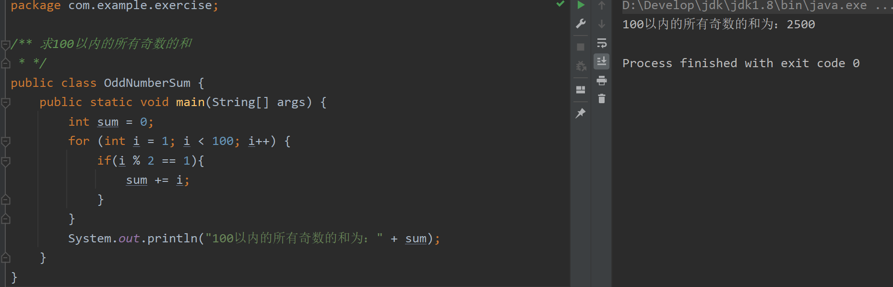

# 一 JAVA 语言基础练习题
## 1【基本概念问答】

请问 Java 语言是跨平台的吗?JVM 是跨平台的吗? 为什么？

Java 语言是跨平台的，JVM 不是跨平台的
JAVA源代码会被编译为字节码，java字节码在jvm中运行，java的跨平台正是依赖于jvm实现的。
而每一个平台都需要独立实现jvm，从而实现：一套java代码到处运行（运行在各个平台的jvm上）（如下图：）


## 2【环境变量】
需要先理解环境变量的作用，设置环境变量使 QQ 或者微信可以在任意目录下，通过命令行执行(该题目提交截图)。

环境变量指在操作系统中用来指定操作系统运行环境的变量。
在 Windows 中，当我们运行一个程序而没有告诉它程序所在的完整路径时，系统除了在当前目录下面寻找此程序外，还会到 PATH 中指定的路径去找。我们可以通过设置环境变量，来更方便的运行常用程序。

【例】设置环境变量使 QQ可以在任意目录下，通过命令行执行
先找到qq的安装目录（`C:\Program Files (x86)\Tencent\QQ\Bin`），然后设置环境变量，如图：


## 3 【Hello World 程序】
独立编写Hello World 程序。并在命令行下运行（要求记事本完成，如果遇到错误，记录错误信息，该题目提交	HelloWorld 程序的代码及运行截图）

```java
public class HelloWorld {
    public static void main(String[] args) {
        System.out.println("Hello World");
    }
}
```


## 4【进制转换】

将 67 转换为 二进制，八进制，十六进，将 0b10100101, 0345, 0xef 转换为十进制
注：该题无需用写代码，手算一下，然后把书写过程，拍照提交作业


## 5【原码补码反码
字长为 8，已知原码 0110 1010 和 1100 0110, 求它们的补码。已知补码 0110 1010 和 1100 0110, 求它们的原码（要求如题4）


> 正数的原码，补码，反码相同
负数的原码和补码转换规则如下：
原码转换为补码：符号位不变，数值位按位取反,末位再加1。
补码转换为原码：符号位不变，数值位按位取反,末位再加1，即补码的补码等于原码。

## 6【基本数据类型】

语句 byte b = 300；编译能通过吗？如果不能，怎样让它通过？转换之后其值是多少？（要求如题4，请注意后面都是代码题）


```java
//代码测试：
public class No06 {
    public static void main(String[] args) {
        byte b = (byte) 300;
        System.out.println("(byte) 300的值为: "+b);
        System.out.println("Byte的最小值为：" + Byte.MIN_VALUE);
        System.out.println("Byte的最大值为：" + Byte.MAX_VALUE);
    }
}
```


## 7【位运算】

int a = 0; a = a + 0.1和int a = 0; a += 0.1; 都能正常运行吗?两者有什么区别?

```java
public class No07 {
    public static void main(String[] args) {
        int a = 0;
        //无法通过编译、报错：不兼容的类型（因为a+0.1的返回结果为double类型）
        //a = a + 0.1;
        // 猜测复合运算符会进行强制类型转换
        a += 0.1;

        System.out.println("a += 0.1 ==> " + a);
        System.out.println("a + 0.1 = " + (a + 0.1));
        System.out.println("(int)(a + 0.1) ==> " + (int)(a + 0.1));
    }
}
```


## 8【位运算】

有三个 int 变量，a, b, c 假设三个变量中有两个变量的值相同，请问如何快速求出，那个和其他两个变量不同的第三个变量的值？提示：考虑异或位运算符的特点

```java
public class No08 {
    public static void main(String[] args) {
        //有三个 int 变量a, b, c , 假设三个变量中有两个变量的值相同
        int a = 11;
        int b = 12;
        int c = 11;

        /*根据异或位运算符的特点, 求出那个和其他两个变量不同的第三个变量的值
         * （两个相同变量的位异或结果为0，不同则为1）且异或运算满足交换律
         */

        int res = a ^ b ^ c;
        System.out.println("不同于其他两个变量的是" + res);
    }
}
```


## 9【左移右移】

任给一个 int 类型的正整数，如何判断该整数的值，是否是 2 的整数次幂？ 提示：考虑这种数的二进制表示特点

```java
 /**任给一个 int 类型的正整数，如何判断该整数的值，是否是 2 的整数次幂？
 * 提示：考虑这种数的二进制表示特点(正整数原码补码一致故无需转换, 此处为方便查看只取较小的数，且只给出8位，因为高位全是0)
 *       由下可知 2 的整数次幂 只有一个高位为1，其余全是 0
 *         原数值            原数值的补码          原数值-1 的补码     (原数值) & (原数值-1)
 *          2                 0000,0010             0000,0001               0
 *          4                 0000,0100             0000,0011               0
 *          8                 0000,1000             0000,0111               0
 *          16                0001,0000             0000,1111               0
 *          32                0010,0000             0001,1111               0
 *          100               0110,0100             0110,0011            0110,0000
 *  => 判断一个整数 n是否是 2 的整数次幂，只需要计算n&(n-1)的结果是不是0
 * */
public class No09 {
    public static void main(String[] args) {
        for (int i = 1; i < 20; i++) {
            if((i & (i - 1)) == 0){
                System.out.println(i + "是2的整数次幂");
            }else {
                System.out.println(i + "不是2的整数次幂");
            }
        }
    }
}
```


## 10【键盘录入】

根据键盘录入的数值 1，2，3，…7 输出对应的星期一，星期二，星期三…星期日要求：使用switch语句

```java
import java.util.Scanner;

/**根据键盘录入的数值 1，2，3，…7 输出对应的星期一，星期二，星期三…星期日要求：使用switch语句*/
public class No10 {
    public static void main(String[] args) {
        Scanner input = new Scanner(System.in);
        System.out.print("请输入1~7之间的正整数:");
        int week = input.nextInt();
        String info;
        switch (week){
            case 1:
                info = "星期一";
                break;
            case 2:
                info = "星期二";
                break;
            case 3:
                info = "星期三";
                break;
            case 4:
                info = "星期四";
                break;
            case 5:
                info = "星期五";
                break;
            case 6:
                info = "星期六";
                break;
            case 7:
                info = "星期日";
                break;
            default:
                info = "请输入有效的内容！";
                break;  // 最后一个break可以省略
        }
        System.out.println(info);
    }
}
```


## 11【回文数】

判断一个 5 位数是否是回文数（比如 12321）个位等于万位  ，十位等于千位

```java
import java.util.Scanner;

/**
 * 回文数（palindrome number）
 * 设n是一任意自然数。若将n的各位数字反向排列所得自然数n1与n相等，则称n为一回文数。
 * 例如，若n=1234321，则称n为一回文数；但n=1234567不是回文数。
 * */
public class Palindrome {
    public static void main(String[] args) {
        Scanner input = new Scanner(System.in);
        System.out.print("请输入一个5位的正整数:");
        int number = input.nextInt();
        if(isPalindrome(number)){
            System.out.println(number+"是一个回文数~");
        }else {
            System.out.println(number+"不是回文数~");
        }
    }

    private static boolean isPalindrome(long num){
        /** 判断一个数是否是回文数?  先将这个数做一次翻转，再判断结果是否相同
         *  如：将123翻转
         *  第一次：取末位3，将末位3丢弃，剩下12，得3
         *  第二次：3*10+2，将末位2丢弃，剩下1 ，得32
         *  第三次：32*10+1，将末位1丢弃，剩下0，得321
         * */
        long number = num;
        long num_reverse = 0;
        while (number!=0){
            num_reverse = num_reverse * 10 + number % 10;
            number = number / 10;
        }
        System.out.println(num + "———" + num_reverse);
        return num == num_reverse;

        //用字符串方法判断
//        String num_str = String.valueOf(num);
//        String num_reverse = new StringBuffer(num_str).reverse().toString();
//        return num_str.equals(num_reverse);
    }
}
```


## 12【switch 分支】

利用 switch 语句，实现对学生分数评级的功能。程序的输入是一个 int 类型的变量 score，代表学生的分数取值范围[0,100] , 提示：可合理利用 case 穿越

当分数范围为 0=< score <60  输出 不及格
当分数范围为 60=< score <70  输出 及格
当分数范围为 70=< score <80 输出 中
当分数范围为 80=< score <90 输出 良
当分数范围为 90=< score <=100 输出 优 

```java
import java.util.Scanner;

public class GradeRank {
    public static void main(String[] args) {
        Scanner sc = new Scanner(System.in);
        System.out.println("请输入分数（0~100）：");
        int score = sc.nextInt();
        System.out.println(rank(score));
    }

    public static String rank(int score){
        String result = "";
        switch (score/10){
            case 0: case 1: case 2:case 3:case 4:case 5:
                result = "不及格";
                break;
            case 6:
                result = "及格";
                break;
            case 7:
                result = "中";
                break;
            case 8:
                result = "良";
                break;
            case 9: case 10:
                result = "优";
                break;
            default:
                result = "分数错误, 请输入[0, 100] 区间内的正整数";
                break;
        }
        return result;
    }
}
```


## 13 【求水仙花数】

题目：打印出所有的"水仙花数"，所谓"水仙花数"是指一个三位数，其各位数字立方和等于该数本身。例如：  153 是一个"水仙花数"，因为 153=1 的三次方＋5 的三次方＋3 的三次方。
程序分析：利用 for 循环控制 100-999 个数，每个数分解出个位，十位，百位。

```java
/**水仙花数（Narcissistic number）也被称为
 * 超完全数字不变数（pluperfect digital invariant, PPDI）、
 * 自恋数、自幂数、阿姆斯壮数或阿姆斯特朗数（Armstrong number），
 * 水仙花数是指一个 3 位数，它的每个位上的数字的 3次幂之和等于它本身。
 * 例如：1^3 + 5^3+ 3^3 = 153
**/
public class Narcissistic {
    public static void main(String[] args) {
        //输出全部的三位水仙花数
        for (int i = 100; i <= 999; i++) {
            if(isNarcissistic(i)){
                System.out.println(i);
            }
        }
    }

    public static boolean isNarcissistic(int num){
        //先得到个位(units)，十位(tens)，百位(hundreds) 的值
        int units = num % 10;
        int tens = (num / 10 ) % 10;
        int hundreds = num / 100;
        return (int)(Math.pow(units,3) +Math.pow(tens,3) + Math.pow(hundreds,3)) == num;
    }
}
```


## 14【 输出素数】

题目：判断 101-200 之间有多少个素数，并输出所有素数。
程序分析：判断素数的方法：用一个数分别去除 2 到 这 个 数 的 平 方 根 向 下 取 整 ，如果能被整除， 则表明此数不是素数，反之是素数。

```java
/**质数又称素数。一个大于1的自然数，除了1和它自身外，不能被其他自然数整除的数叫做质数；
 * 否则称为合数（规定1既不是质数也不是合数）
 * */
public class PrimeNumber {
    public static void main(String[] args) {
        //判断 101-200 之间有多少个素数，并输出所有素数
        int count = 0;
        for (int i = 101; i <= 200; i++) {
            if(isPrime(i)){
                count++;
                System.out.println(i);
            }
        }
        System.out.println("101-200之间共有"+count+"个素数");
    }

    public static boolean isPrime(int num){
        /**判断素数的方法：用一个数分别去除2到这个数的平方根向下取整，
        * 如果能被整除，则表明此数不是素数，反之是素数
        */
        for (int i = 2; i <= Math.floor(Math.sqrt(num)); i++) {
            if(num % i == 0){
                return false;
            }
        }
        return true;
    }
}
```


## 15【浮点数精度】

题目:写代码分别计算10/3.0和10/3,并思考为啥会有这种结果

```java
public class Precision {
    public static void main(String[] args) {
        /**1. java中整数除法直接舍弃小数部分，返回整型
         * 2. 进行除法运算时只要有浮点数存在就进行浮点数除法
         *  而浮点数在计算机中的存储和计算方式决定了浮点数实际上只是个近似值
         * */
        System.out.println(10/3.0);  //浮点数除法
        System.out.println(10/3);    //整除
    }
}
```


## 16【打印三角形图案】

题目：打印出如下图案（等腰三角形）
```
   *
  ***
 *****
*******
```

```java
/* 打印等腰三角形
              *
             ***
            *****
           *******
*/
public class Triangle {
    public static void main(String[] args) {
        /** 分析：
         * 第一行：3空格 + 1 星号
         * 第二行：2空格 + 3 星号
         * 第三行：1空格 + 5 星号
         * 第四行：0空格 + 7 星号
         * */
        int n = 4;
        // i 表示空格个数，j表示星号个数
        for (int i = n-1, j = 1; i >= 0; i-- , j+=2) {
            System.out.println(strCopies(" ", i)+strCopies("*", j));
        }
    }

    /**将一个字符串str重复拼接n次*/
    public static String strCopies(String str, int n){
        String result = "";
        for (int i = 0; i < n; i++) {
            result = result + str;
        }
        return result;
    }
}
```


## 17【 打印 9x9 表】

题目：输出 9x9 口诀。
程序分析：分行与列考虑，共 9 行 9 列，i 控制行，j 控制列。

```java
public class MultiplicationTables {
    public static void main(String[] args) {
        /** 输出 9x9 乘法表
         *  i表示行数，j表示列数
         * */
        for (int i = 1; i <= 9; i++) {
            for (int j = 1; j <= i; j++) {
                System.out.print(j + "*" + i + "=" + i*j + "\t");
            }
            System.out.println();
        }
    }
}
```


## 18【 求完数】

题目：一个数如果恰好等于它的所有真因子（即除了自身外的所有因子）之和，这个数就称为"完数"。    例如 6=1＋2＋3.编程找出1000 以内的所有完数。

```java
public class PerfectNumber {
    public static void main(String[] args) {
        /** 完全数（Perfect number），又称完美数或完备数
         *  它所有的真因子（即除了自身以外的约数）的和，恰好等于它本身。
         *  例如 6=1＋2＋3
         * */
        int n = 1000;
        int count = 0; //记录完数的个数
        for (int i = 2; i <= n; i++) {
            if(isPerfect(i)){
                count++;
                System.out.println(i);
            }
        }
        System.out.println("共"+count+"个完数");
    }

    //完数：所有自身以外的约数相加等于它本身
    public static boolean isPerfect(int num){
        int sum = 0;  //记录约数的和
        for (int i = 1; i < num; i++) {
            if(num % i == 0) {
                sum += i;
            }
        }
        return sum == num;
    }
}
```


## 19【求不重复数字】

题目：有 1、2、3、4 这四个数字，能组成多少个互不相同且组成无重复数字的三位数？都是多少？ 例如：123 124 132 134 142 都是符合题意的三位数
程序分析：可填在百位、十位、个位的数字都是 1、2、3、4。组成所有的排列后再去 掉不满足条件的排列。

```java
public class NoRepeatNumber {
    public static void main(String[] args) {
        /**有 1、2、3、4 这四个数字，能组成多少个互不相同且组成无重复数字的三位数？
         * 都是多少？例如：123 124 132 134 142 都是符合题意的三位数
         * */
        int count = 0;
        //i表示百位，j表示十位，k表示个位
        for (int i = 1; i <= 4; i++) {
            for (int j = 1; j <= 4; j++) {
                for (int k = 1; k <= 4; k++) {
                    if(i!=j && i!=k && j!=k){
                        count++;
                        System.out.println(i*100+j*10+k);
                    }
                }
            }
        }
        System.out.println("共"+count+"个数字");
    }
}
```


## 20【求日期】

题目：输入某年某月某日，判断这一天是这一年的第几天？
程序分析：以 3 月 5 日为例，应该先把前两个月的加起来，然后再加上 5 天即本年的第几天，特殊情况: 闰年且输入月份大于 3 时需考虑多加一天。

```java
import java.util.Scanner;

/**输入某年某月某日，判断这一天是这一年的第几天？*/
public class WhichDay {
    public static void main(String[] args) {
        int[] arr = {31,28,31,30,31,30,31,31,30,31,30,31}; //每月对应天数
        Scanner sc = new Scanner(System.in);
        while (true){
            int sum = 0; //统计天数
            System.out.println("请输入年月日(如：2021-09-13，q退出): ");
            String content = sc.next();
            if(content.equals("q")) break;

            int year = Integer.parseInt(content.substring(0, 4));
            int month = Integer.parseInt(content.substring(5, 7));
            int day = Integer.parseInt(content.substring(8, 10));

            //如果是闰年，需要加1天
            if(isLeapYear(year)) {
                sum += 1;
            }
            //统计整月的天数
            for (int i = 0; i < month-1; i++) {
                sum += arr[i];
            }
            //加上最后一月的天数
            sum += day;
            System.out.println(year+"年的第"+sum+"天");
            //sum = 0; //重置天数
        }
    }

    //闰年：能被4整除但不能被100整除, 或能被400整除
    public static boolean isLeapYear(int year){
        return (year % 4 == 0 && year % 100 != 0) || year % 400 == 0;
    }
}
```


## 21【根据条件求数字】

题目：一个不大于10万的整数，它加上 100 后是一个完全平方数，同时加上 268 后 也 是一个完全平方数，请问该数是多少？
程序分析：在 10 万以内判断，先将该数加上 100 后再开方，再将该数加上 268 后再开方，如果开方后的结果满足如下条件，即是结果。

```java
/**题目：一个不大于10万的整数，它加上 100 后是一个完全平方数，再加上 268 后 也 是一个完全平方数，请问该数是多少？
 * 若一个数能表示成某个整数的平方的形式，则称这个数为完全平方数(perfect square number)
 * */
public class PerfectSquare {
    public static void main(String[] args) {
        for (int i = 1; i < 100000; i++) {
            if(isPerfectSquareNumber(i+100) && isPerfectSquareNumber(i+368)){
                System.out.println(i);
                break; // 只有一个数，故找到就结束
            }
        }
    }

    //判断完全平方数的办法
    public static boolean isPerfectSquareNumber(int num){
        double temp = Math.sqrt(num);
        return temp - (int)temp == 0;
    }
}
```


## 22【 根据输入求输出】

题目：给一个不多于 5 位的正整数，要求：一、求它是几位数，二、逆序打印出各位数字。

```java
import java.util.Scanner;

/**题目：给一个不多于 5 位的正整数，要求：一、求它是几位数，二、逆序打印出各位数字。
 * */
public class ReverseNumber {
    public static void main(String[] args) {
        Scanner sc = new Scanner(System.in);
        while (true){
            System.out.println("请输入一个不多于五位的正整数：（q退出）");
            String input = sc.next();
            if(input.equals("q")) break;

            int num = 0;
            try {
                num = Integer.parseInt(input);
            }catch (Exception e) {
                System.out.println("输入错误！");
                continue;
            }
            if(num <= 0 || num > 99999){
                System.out.println("输入错误！请重新输入");
                continue;
            }

            int count = 0; //统计位数
            System.out.print(num+"逆序输出结果：");
            int n = num;
            while (n > 0 ){
                System.out.print((n % 10) + "\t");
                n = n / 10;
                count++;
            }
            System.out.println("\n"+num+"是一个"+count+"位数");
        }
    }
}
```


## 23【求前 20 项之和】

题目：有一分数序列：2/1，3/2，5/3，8/5，13/8，21/13...求出这个数列的前 20 项之和。程序分析：请抓住分子与分母的变化规律。

```java
/** 求数列 2/1，3/2，5/3，8/5，13/8，21/13... 的前 20 项之和
 * 分子与分母(Numerator and Denominator)的变化规律:
 * numerator:   下一次的分子等于当前分子、分母之和
 * denominator: 下一次的分母等于其分子减当前的分母
 * */
public class FractionSum {
    public static void main(String[] args) {
        int n = 20;
        double numerator = 2;
        double denominator = 1;
        double sum = 0;

        for (int i = 1; i <= n; i++) {
            sum += (numerator / denominator);
            numerator = numerator + denominator;
            denominator = numerator - denominator;
        }
        System.out.println("前"+ n + "项的和为： " + sum);
    }
}
```


## 24【求阶乘】

题目：求 1+2!+3!+...+20!的和
程序分析：此程序只是把累加变成了累乘。

```java
/** 求 1+2!+3!+...+20!的和
 * */
public class FactorialSum {
    public static void main(String[] args) {
        long sum = 0;
//        for (int i = 1; i <= 20; i++) {
//            long temp = 1; //记录每一次的阶乘结果
//            for (int j = 1; j <= i; j++) {
//                temp *= j;
//            }
//            sum += temp;
//        } //重复计算了每一次的阶乘
        
        long factorial = 1;
        for (int i = 1; i <= 20; i++) {
            factorial *= i;
            sum += factorial;
        }

        System.out.println(sum);
    }
}
```


## 25【求奇数和】

题目：求100以内的所有奇数的和

```java
/** 求100以内的所有奇数的和
 * */
public class OddNumberSum {
    public static void main(String[] args) {
        int sum = 0;
        for (int i = 1; i < 100; i++) {
            if(i % 2 == 1){
                sum += i;
            }
        }
        System.out.println("100以内的所有奇数的和为：" + sum);
    }
}
```



## 26【求星期】

题目：请输入星期几的第一个字母来判断一下是星期几，如果第一个字母一样，则继续 判断第二个字母。
程序分析：用情况语句比较好，如果第一个字母一样，则判断用情况语句或 if 语句判断第二个字母。

```java
import java.util.Scanner;

/**请输入星期几的第一个字母来判断一下是星期几，如果第一个字母一样，则继续判断第二个字母
 * 星期一（Monday）        Mon
 * 星期二（Tuesday）       Tue
 * 星期三（Wednesday）     Wed
 * 星期四（Thursday）      Thur
 * 星期五（Friday）        Fri
 * 星期六（Saturday）      Sat
 * 星期日（Sunday）        Sun
 * */
public class WeekJudge {
    public static void main(String[] args) {
        Scanner sc = new Scanner(System.in);
        while (true) {
            System.out.println("请输入星期的大写首字母：（q退出）");
            String letter = sc.next();
            String secondLetter = "";
            if (letter.equals("q")) break;

            switch (letter){
                case "M":
                    System.out.println("星期一（Monday）");
                    break;
                case "T":
                    System.out.println("请输入第二个字母：");
                    secondLetter = sc.next();
                    if(secondLetter.equals("u")){
                        System.out.println("星期二（Tuesday）");
                    }else if (secondLetter.equals("h")){
                        System.out.println("星期四（Thursday）");
                    }else {
                        System.out.println("输入错误！");
                    }
                    break;
                case "W":
                    System.out.println("星期三（Wednesday）");
                    break;
                case "F":
                    System.out.println("星期五（Friday） ");
                    break;
                case "S":
                    System.out.println("请输入第二个字母：");
                    secondLetter = sc.next();
                    if(secondLetter.equals("a")){
                        System.out.println("星期六（Saturday）");
                    }else if (secondLetter.equals("u")){
                        System.out.println("星期日（Sunday） ");
                    }else {
                        System.out.println("输入错误！");
                    }
                    break;
                default:
                    System.out.println("输入错误！");
                    break;
            }
            System.out.println();
        }
    }
}
```


## 27【if求最大值】

题目：用if判断求三个数的最大值

```java
/**用if判断求三个数的最大值*/
public class MaxIf {
    public static void main(String[] args) {
        int a = 303, b=92, c=455;

//        int max = a;
//        if(b>max){
//            max=b;
//        }else if(c>max){
//            max = c;
//        }

        int max;
        if(a>b && a>c){
            max = a;
        }else if(b>a && b>c){
            max=b;
        }else {
            max = c;
        }
        System.out.println("最大值为：" + max);
    }
}
```


## 28【 三 目 运 算 符 】

题目：用三目运算符求三个数的最大值，和上题作比较，比较两种求最值的差异

```java
public class MaxOperator {
    public static void main(String[] args) {
        int a = 303, b=92, c=455;
        int max = (a>b) ? ((a>c)? a : c) : ((b>c)? b :c) ;
        System.out.println("最大值为：" + max);
    }
    /**用三目运算符求三个数的最大值，和if作比较，比较两种求最值的差异:
     * 1. 三目运算有返回值，if else没有返回值
     * 2. if条件语句更简单易读，可以轻松判断多个条件
     * */
}
```


## 29【自由落体】

题目：一球从100米高度自由落下，每次落地后反跳回原高度的一半；再落下，求它在第10次落地时，共经过多少米？第10次反弹多高？

```java
/**一球从100米高度自由落下，每次落地后反跳回原高度的一半；再落下，求它在第10次落地时，共经过多少米？第10次反弹多高？*/
public class FreeFall {
    public static void main(String[] args) {
        double sum = 0;      //共经过多少米
        double height = 100;

        for (int i = 1; i <= 10; i++) {
            sum += height;  //加上每次下落的高度
            //每一次落下反弹高度减半
            height = height / 2;
            sum += height;  //加上每次反弹的高度
        }
        System.out.println("小球共经过"+sum+"米，"+"第10次反弹"+height+"米");
    }
}
```


## 30【被 9 整除】

题目：判断一个数能被几个 9 整除 。如 81 可以被 2 个 9 整除。

```java
import java.util.Scanner;

/**判断一个数能被几个 9 整除 。如 81 可以被 2 个 9 整除*/
public class DivideByNine {
    public static void main(String[] args) {
        Scanner scanner = new Scanner(System.in);
        while(true){
            System.out.println("请输入一个整数：(q退出)");
            String input = scanner.next();
            if(input.equals("q")) break;
            int num = 0;
            try{
                num = Integer.parseInt(input);
            } catch (NumberFormatException e) {
                System.out.println("输入错误！");
                continue;
            }

            int count = 0;
            while (num != 0){
                if(num % 9 == 0) {
                    count++;
                    num /= 9;
                }else{
                    break;
                }
            }
            System.out.println(input+"能被"+count+"个9整除");
        }
    }
}
```


## 31【判断奇偶数】

题目：键盘录入一个int数字，输出它是奇数还是偶数。

```java
import java.util.Scanner;

/**键盘录入一个int数字，输出它是奇数还是偶数*/
public class OddOrEven {
    public static void main(String[] args) {
        Scanner scanner = new Scanner(System.in);
        while(true){
            System.out.println("请输入一个int整数：(q退出)");
            String input;
            input = scanner.next();
            if(input.equals("q")) break;
            int num;
            try{
                num = Integer.parseInt(input);
            } catch (NumberFormatException e) {
                System.out.println("输入错误！");
                continue;
            }

            if(num % 2 == 0){
                System.out.println(num+"是偶数");
            }else{
                System.out.println(num+"是奇数");
            }
        }
    }
}
```


## 32【加密】

题目：某个公司采用公用电话传递数据，数据是四位的整数，在传递过程中是加密的，加密规则如下：每位数字都加上 5,然后用和除以 10 的余数代替该数字，再将第一位和第四位交换，第二位和第三位交换。

```java
/**加密四位数的整数：每位数字都加上 5,然后用和除以 10 的余数代替该数字，再将第一位和第四位交换，第二位和第三位交换
 * */
public class Encryption {
    public static void main(String[] args) {
        int num = 1234;
        System.out.println(num+"加密后为："+encryption(num));
    }

    //加密四位数的方法
    public static int encryption(int n){
        int a1 = n / 1000;      //千位
        int a2 = n / 100 % 10;  //百位
        int a3 = n / 10 % 10;   //十位
        int a4 = n % 10;        //个位
        //每位数字都加上5, 然后用和除以10的余数代替该数字
        a1 = (a1 + 5) % 10;
        a2 = (a2 + 5) % 10;
        a3 = (a3 + 5) % 10;
        a4 = (a4 + 5) % 10;
        //计算交换后的值并返回
        return a4*1000 + a3*100 + a2*10 + a1;
    }
}
```


## 33【求同构数】

题目：正整数n若是它平方数的尾部，则称n为同构数，比如5是5 * 5=25右边的数，25是25 * 25=625右边的数。求1-99范围内的所有同构数。

```java
/**正整数n若是它平方数的尾部，则称n为同构数.
 * 比如5是5 * 5=25右边的数，25是25 * 25=625右边的数。求1-99范围内的所有同构数。
 * */
public class Isomorphism {
    public static void main(String[] args) {
        for (int i = 1; i < 100; i++) {
            if(isIsomorphism(i)){
                System.out.println(i);
            }
        }
    }

    public static boolean isIsomorphism(long n){
        long square = n * n;
        //从个位开始依次对比每个数是否相同(通过求余得到末位数)
        while(n > 0){
            if(n % 10 == square % 10){
                square /= 10;
                n /= 10;
            }else{
                return false;
            }
        }
        return true;
    }
}
```


## 34【左移右移】

题目：取一个整数 a 从右端开始的 4～7 位。如 1234567，取 1234

```java
/**取一个整数 a 从右端开始的 4～7 位。如 1234567，取 1234*/
public class No34 {
    public static void main(String[] args) {
        long num = 12345678;

        System.out.println("Result："+getNum(num));
    }

    /**@param  num 该函数接收一个7位以上的整数
     * @return 返回从右端开始的 4～7 位
     * @apiNote 整体实现思路：先去掉后面三位，然后依次取四位乘以对应的权值
     * 权值说明：以1234567为例，去掉后三位后剩1234，依次取值相加如下：
     *  4*1 + 3*10 + 2*100 + 1*1000  （1，10,100,1000即为权值）
     * */
    public static int getNum(long num){
        //从右侧第四位开始取，故先去掉后面三位
        num = num / 1000;
        //如果去掉后三位只剩下四位，直接返回即可
        if(num <= 9999) {
            return (int)num;
        }
        int res = 0;       //记录最后所得结果
        int n = 1;         //权值
        for (int i = 0; i < 4; i++) {
            res += n * (num % 10);
            num /= 10;
            n *= 10;
        }
        return res;
    }
}
```


## 35【求奇数个数】

题目：求 0—7 所能组成的奇数个数
注：0不能为首位，末位是1,3,5,7，每个数字只能用1次

```java
/**求 0—7 所能组成的奇数个数, （0不能为首位，末位是1,3,5,7，每个数字只能用1次）
 * （疑问：此处的每个数字只能用1次表示的是 组成的数不能有重复数字吗？）
 * 1位数时：4
 * 2位数时：4 * 6
 * 3位数时：4 * 6 * 6
 * 4位数时：4 * 6 * 6 * 5
 * 5位数时：4 * 6 * 6 * 5 * 4
 * ......
 * 8位数时：4 * 6 * 6 * 5 * 4 * 3 * 2 * 1
 * */
public class No35 {
    public static void main(String[] args) {
        //第一二位直接相加
        int sum = 4 + 4 * 6;

        int temp = 4 * 6;
        for (int i = 6; i >= 1; i--) {
            temp *= i;
            sum += temp;
        }
        System.out.println("组成的奇数个数：" + sum);
    }
}
```


## 36【打印星号】
题目：读取 7 个数（1—50）的整数值，每读取一个值，程序打印出该值个数的＊。

```java
import java.util.Scanner;

/**读取 7 个数（1—50）的整数值，每读取一个值，程序打印出该值个数的＊*/
public class No36 {
    public static void main(String[] args) {
        Scanner scanner = new Scanner(System.in);
        for (int i = 0; i < 7; i++) {
            int num = 0;
            //先处理输入类型不匹配和超出[1,50]的情况
            try {
                System.out.println("请输入一个1-50的整数：");
                num = scanner.nextInt();
            } catch (Exception e) {
                scanner.next();
                System.out.println("输入错误！\n");
                continue;
            }
            if(num<1 || num>50){
                System.out.println("输入错误！\n");
                continue;
            }

            for (int j = 0; j < num; j++) {
                System.out.print("*");
            }
            System.out.println("\n");
        }
    }
}
```


## 37【选择循环结构】

题目：给20块钱买饮料，每瓶饮料3块钱，喝完之后退瓶子可以换回1块钱，问最多可以喝到多少瓶饮料？

```java
/**给20块钱买饮料，每瓶饮料3块钱，喝完之后退瓶子可以换回1块钱，问最多可以喝到多少瓶饮料？
 * 分析：20/3 = 6 ...2   喝完卖掉瓶子后剩 6+2 = 8元
 *      8 /3 = 2 ...2   喝完卖掉瓶子后剩 2+2 = 4元
 *      4 /3 = 1 ...1   喝完卖掉瓶子后剩 1+1 = 2元  小于3结束
 * */
public class No37 {
    public static void main(String[] args) {
        int res = 0;
        int balance = 20;

        while(balance >= 3){
            int temp = balance / 3; //每次买的饮料瓶数（等于瓶子换回的钱）
            res += temp;
            balance = balance % 3 + temp;
        }
        System.out.println("总共可以喝到" + res + "瓶饮料，还剩下" + balance + "元");
    }
}
```


## 38【输入数字求和】

题目：输入 2 个数字，数字一记做 a, 数字二记做 b.  求 s=a+aa+aaa+aaaa+aa...a 的值，例如 a=2， b=5，则 s=2+22+222+2222+22222
程序分析：关键是计算出每一项的值。

```java
/**输入 2 个数字，数字一记做 a, 数字二记做 b. 求 s=a+aa+aaa+aaaa+aa...a 的值，
 * 例如 a=2， b=5，则 s=2+22+222+2222+22222
 * */
public class No38 {
    public static void main(String[] args) {
        Scanner scanner = new Scanner(System.in);
        System.out.println("请输入a [1, 9]：");
        int a = scanner.nextInt();
        System.out.println("请输入b [1, 18]：");
        int b = scanner.nextInt();

        //为防止溢出，进行了简单的限制
        if(a > 0 && a < 10 && b > 0 && b < 19){
            long res = a;
            long temp = a;
            System.out.print(temp);
            for (int i = 1; i < b; i++) {
                temp = temp * 10 + a;
                res += temp;
                if(temp > a)System.out.print("+" + temp);
            }
            System.out.print("=" + res);
        }else{
            System.out.println("输入错误！");
        }
    }
}
```


## 39【求最大公约数及最小公倍数】

题目：输入两个正整数 m 和 n，求其最大公约数和最小公倍数。程序分析：利用辗除法。

```java
import java.util.Scanner;

/**输入两个正整数 m 和 n，求其最大公约数和最小公倍数。程序分析：利用辗除法
 * 注：
 * 1. 最大公约数（greatest common divisor, 缩写：gcd），指两个或多个整数共有约数中最大的一个
 * 2. 几个数共有的倍数叫做公倍数，其中除了 0以外最小的一个公倍数，叫最小公倍数（least common multiple，缩写：lcm）
 * 3. 关系：两个数的乘积就等于它们最大公因数和最小公倍数的乘积，即最小公倍数为两数乘积除以最大公约数
 * 例：求 915 和 56 的最大公约数： 先取大的一个作为被除数（dividend），小的一个作为除数（divisor）求其余数（remainder）
 *     然后以除数和余数反复做除法运算：
 *      915 ÷ 56 = 16 ...19
 *      56  ÷ 19 = 2  ...18
 *      19  ÷ 18 = 1  ...1
 *      18  ÷ 1  = 18 ...0   当余数为 0 时，取当前算式除数为最大公约数 ：gcd即为 1
 * */
public class No39 {
    public static void main(String[] args) {
        Scanner scanner = new Scanner(System.in);
        System.out.println("请输入第一个正整数m：");
        long m = scanner.nextInt();
        System.out.println("请输入第二个正整数n：");
        long n = scanner.nextInt();

        long gcd = getGcd(m, n);
        long lcm = m * n / gcd;
        System.out.println(m + "和" + n + "的最大公约数为：" + gcd + "， 最小公倍数为：" + lcm);
    }

    /**@param m 正整数
     * @param n 正整数
     * @return 最大公约数（greatest common divisor）
     * @implNote 欧几里得算法又称辗转相除法(Euclidean Algorithm 或者 Euclid's algorithm)
     * */
    public static long getGcd(long m, long n){
        long dividend, divisor, remainder;
        //先确定被除数（dividend）和除数（divisor）
        if (m >= n){
            dividend = m;
            divisor = n;
        }else{
            dividend = n;
            divisor = m;
        }

        remainder = divisor;
        while (remainder > 0){
            remainder = dividend % divisor;
            dividend = divisor;  //将除数作为下一次的被除数
            divisor = remainder; //将余数作为下一次的除数
        }
        //由于已经将除数和余数分别赋值给了被除数和除数，故取dividend为gcd
        return dividend;
    }
}
```


## 40【分数累加】

题目：编写一个函数，输入 n 为偶数时，调用函数求 1/2+1/4+...+1/n,当输入n 为奇数时，调用函数 1/1+1/3+...+1/n

```java
import java.util.Scanner;

/**编写一个函数，输入 n 为偶数时，调用函数求 1/2+1/4+...+1/n,当输入n 为奇数时，调用函数 1/1+1/3+...+1/n */
public class No40 {
    public static void main(String[] args) {
        Scanner scanner = new Scanner(System.in);
        System.out.println("请输入一个整数：");
        int num = scanner.nextInt();

        System.out.println("Result: " + sum(num));
        System.out.println("Recursion：" + sumByRecursion(num));
    }

    // 普通求法
    static double sum(int n){
        int start = 1;
        if(n % 2 == 0){
            start = 2;
        }

        double result = 0;
        for (int i = start; i <= n; i+=2) {
            result += 1.0 / i;
        }
        return result;
    }

    // 递归求法：
    static double sumByRecursion(int n){
        if( n == 1){
            return 1;
        }else if( n == 2){
            return 1.0 / 2;
        }else {
            return sumByRecursion(n - 2) + 1.0 / n;
        }
    }
}
```


<br/>

# 二 附加题 10 道 选作
（题目比较有难度，有能力的同学可以尝试用代码解决。不统一要求。部分题目可能需要使用递归做法。 ）

## 41【最大最小交换】

题目：键盘录入一个int数组，最大的与第一个元素交换，最小的与最后一个元素交换，输出数组。

```java
import java.util.Arrays;
import java.util.Scanner;

/**键盘录入一个int数组，最大的与第一个元素交换，最小的与最后一个元素交换，输出数组
 * 注意事项（完成题目后的一些总结）：
 * 1. 需要注意第一个是最小值，最后一个是最大值时情况，若两次都交换结果和未交换的一样 
 * 2. 当最大值是第一个、最小值是最后一个时不需要交换
 * 3. java函数是值传递的，简单的两个数交换的函数不能交换原来的值
 * */
public class No41 {
    public static void main(String[] args) {
        Scanner scanner = new Scanner(System.in);
        System.out.println("请输入一些整数，以英文逗号隔开：");
        String input = scanner.next();
        //将输入的内容装换位数组
        String[] arrStr = input.trim().split(",");
        int[] arr = new int[arrStr.length];
        for (int i = 0; i < arr.length; i++) {
            arr[i] = Integer.parseInt(arrStr[i]);
        }

        //获取最大值和最小值索引，再进行交换
        int maxNumberIndex = getMaxNumberIndex(arr);
        int minNumberIndex = getMinNumberIndex(arr);

        //当第一个是最小值，最后一个是最大值时，只交换一次
        if(maxNumberIndex == arr.length-1 && minNumberIndex == 0){
            arrSwap(arr, 0, arr.length-1);
        }else{
            //当最大值是第一个时不进行交换
            if(arr[maxNumberIndex] != arr[0]) {
                arrSwap(arr, maxNumberIndex, 0);
            }
            //当最小值是最后一个时不进行交换
            if(arr[minNumberIndex] != arr[arr.length - 1]){
                arrSwap(arr, minNumberIndex, arr.length - 1);
            }
        }
        System.out.println("交换后的数组：" + Arrays.toString(arr));
    }

    //获取最大值和最小值的数组索引
    static int getMaxNumberIndex(int[] arr){
        int index = 0;
        for (int i = 1; i < arr.length; i++) {
            if(arr[i] > arr[index]){
                index = i;
            }
        }
        System.out.println("max: " + arr[index]);
        return index;
    }
    static int getMinNumberIndex(int[] arr){
        int index = 0;
        for (int i = 1; i < arr.length; i++) {
            if(arr[i] <  arr[index]){
                index = i;
            }
        }
        System.out.println("min: " + arr[index]);
        return index;
    }

    /**交换任意int数组的两个指定索引位置的值
     *注意：由于java函数的参数是值传递，不能使用常用的两个数交换函数，那样交换的是传递值的拷贝，原来的数并没有变化
     */
    static void arrSwap(int[] arr, int i, int j){
        int temp = arr[i];
        arr[i] = arr[j];
        arr[j] = temp;
    }
}
```


## 42【不死神兔】

题目：古典问题：有一对兔子，从出生后第 3 个月起每个月都生一对兔子，小兔子长到第三个月后每个月又生一对兔子，假如兔子都不死，问每个月的兔子对数为多少？
程序分析： 兔子的规律为数列 1,1,2,3,5,8,13,21....

```java
/**有一对兔子，从出生后第 3 个月起每个月都生一对兔子，小兔子长到第三个月后每个月又生一对兔子，假如兔子都不死，问每个月的兔子对数为多少？
 *程序分析： 兔子的规律为数列 1,1,2,3,5,8,13,21.... （从第三个月起每个月的兔子数等于前两个月的兔子数之和）
 * */
public class No42 {
    public static void main(String[] args) {
        //假设求24个月中每月的兔子数
        int month = 24;
        //声明一个数组来存储每个月的兔子数
        int[] arr = new int[24];

        arr[0] = 1;
        arr[1] = 1;
        for (int i = 2; i < month; i++) {
            arr[i] = arr[i-1] + arr[i-2];
            System.out.println("第" + (i+1) + "个月的兔子数：" + arr[i]);
        }
        
    }
}
```


## 43【猴子吃桃问题】

题目：猴子吃桃问题：猴子第一天摘下若干个桃子，当即吃了一半，还没吃饱，又多吃了一个 第二天早上又将剩下的桃子吃掉一半，又多吃了一个。以后每天早上都吃了前一天剩下的一半零一个。到第 10 天早上想再吃时，见只剩下一个桃子了。求第一天共摘了多少。
程序分析：采取逆向思维的方法，从后往前推断。

```java
/**猴子吃桃问题：猴子第一天摘下若干个桃子，当即吃了一半，还没吃饱，又多吃了一个 第二天早上又将剩下的桃子吃掉一半，又多吃了一个。
 * 以后每天早上都吃了前一天剩下的一半零一个。到第 10 天早上想再吃时，见只剩下一个桃子了。求第一天共摘了多少。
 * 程序分析：采取逆向思维的方法，从后往前推断
 *  每天早上都吃了前一天剩下的一半零一个 => 即剩下的 + 1 再乘以2即得到前一天的数目
 *  10  1
 *   9  (1 + 1) * 2 = 4
 *   8  (4 + 1) * 2 = 10
 *   ......
 * */
public class No43 {
    public static void main(String[] args) {
        int num = 1;  //num表示每天的桃子数目，初始为第十天的
        for (int i = 9; i >= 1; i--) {
            num = (num + 1) * 2;
        }
        System.out.println("猴子第一天摘下的桃子为：" + num);
    }
}
```


## 44【乒乓球赛】

题目：两个乒乓球队进行比赛，各出三人。甲队为 a,b,c 三人，乙队为 x,y,z 三人。然后用抽签来决定比赛名单。有人向队员打听比赛的名单。a 说他不和x 比，c 说他不和 x,z 比，请编程序找出三队赛手的名单

```java
/**两个乒乓球队进行比赛，各出三人。甲队为 a,b,c 三人，乙队为 x,y,z 三人。然后用抽签来决定比赛名单。有人向队员打听比赛的名单。
 * a 说他不和x 比，c 说他不和 x,z 比，请编程序找出三队赛手的名单*/
public class No44 {
    public static void main(String[] args) {
        char a = 0, b = 0, c = 0;

        //根据条件先找到c的对手
        for (char s = 'x'; s <= 'z'; s++){
            if(s != 'x' && s != 'z'){  //c 说他不和 x,z 比
                c = s;
            }
        }
        //根据a的条件和排除c的对手可找到a的对手
        for (char s = 'x'; s <= 'z'; s++){
            if(s != 'x' && s != c){  //a 说他不和x 比
                a = s;
            }
        }
        //排除a,c的对手可确定b的对手
        for (char s = 'x'; s <= 'z'; s++){
            if(s != a && s != c){  //a 说他不和x 比
                b = s;
            }
        }
        System.out.println("a <——> " + a);
        System.out.println("b <——> " + b);
        System.out.println("c <——> " + c);
    }
}
```


## 45【 递归求阶乘】

题目：利用递归方法求 5!。

程序分析：递归公式：fn=fn * fn-1

```java
/**利用递归方法求 5!  递归公式：fn=fn * fn-1  */
public class No45 {
    public static void main(String[] args) {
        System.out.println("5! = " + factorial(5));
    }

    private static long factorial(int n) {
        if(n == 1){
            return 1;
        }
        return n * factorial(n-1);
    }
}
```


## 46【 求岁数】

题目：有 5 个人坐在一起，问第五个人多少岁？他说比第 4 个人大 2 岁。问第 4 个人岁数，他说比第 3 个人大 2 岁。
问第三个人，又说比第 2 人大两岁。问第 2 个人，说比第一个人大两岁。最后问第一个人，他说是 10 岁。请问第五个人多大？
程序分析：利用递归的方法，递归分为回推和递推两个阶段。要想知道第五个人岁数，需知道第四人的岁数，依次类推，推到第一人（10 岁），再往回推。

```java
public class No46 {
    public static void main(String[] args) {
        int age = getAge(5);
        System.out.println("第五个人岁数为：" + age);
    }

    /**@param n 需要求第几个人的岁数
     * @return 第n个人的岁数
     * */
    private static int getAge(int n) {
        if(n == 1){
            return 10;
        }
        return getAge(--n) + 2;
    }
}
```


## 47【插入数字】

题目：有一个已经排好序的数组。现输入一个数，要求按原来的规律将它插入数组中。
程序分析：首先判断此数是否大于最后一个数，然后再考虑插入中间的数的情况，插入后此元素之后的数， 依次后移一个位置。

```java
import java.util.Arrays;
import java.util.Scanner;

/**有一个已经排好序的数组。现输入一个数，要求按原来的规律将它插入数组中
 *程序分析：首先判断此数是否大于最后一个数，然后再考虑插入中间的数的情况，插入后此元素之后的数， 依次后移一个位置
 * java中在一个已有的数组中插入值需要改变数组大小，可用ArrayList或创建新数组，该例选择创建新数组
 * */
public class No47 {
    public static void main(String[] args) {
        //创建一个排好序的数组（以从小到大为例）
        int[] arr = {2, 8, 11, 21, 35, 54, 62, 77, 82};
        Scanner scanner = new Scanner(System.in);
        System.out.println("请输入需要插入数组的整数：");
        int num = scanner.nextInt();

        System.out.println("原来的有序数组：" + Arrays.toString(arr));
        System.out.println("插入" + num + "后的数组：" + Arrays.toString(insertNum(arr, num)));
    }

    private static int[] insertNum(int[] arr, int num) {
        int[] resultArr = new int[arr.length + 1];
        //如果此数大于最后一个数, 直接添加到末尾即可
        if(num > arr[arr.length - 1]){
            for (int i = 0; i < arr.length; i++) {
                resultArr[i] = arr[i];
            }
            resultArr[resultArr.length - 1] = num;
        }else{
            for (int i = 0; i < arr.length; i++) {
                if(num < arr[i]){
                    //先将插入值的前面一部分数组复制赋值
                    for (int j = 0; j < i; j++) {
                        resultArr[j] = arr[j];
                    }
                    //插入值
                    resultArr[i] = num;
                    //再将插入值的后面一部分数组复制赋值
                    for (int j = i + 1; j < resultArr.length; j++) {
                        resultArr[j] = arr[j - 1];
                    }
                    break;
                }
            }
        }
        return resultArr;
    }
}
```


## 48【移动位置】

题目：有 n 个整数，使其前面各数顺序向后移 m 个位置，最后 m 个数变成最前面的 m 个数,比如输入数字为 1 2 3 4 5 6 7 8 9 0，m=4，则结果为 7 8 9 0 1 2 3 4 5 6

```java
import java.util.Arrays;

/**有 n 个整数，使其前面各数顺序向后移 m 个位置，最后 m 个数变成最前面的 m 个数,
 * 比如输入数字为 1 2 3 4 5 6 7 8 9 0，m=4，则结果为 7 8 9 0 1 2 3 4 5 6
 * */
public class No48 {
    public static void main(String[] args) {
        //生成随机数组作为输入数字
        int n = 12, m=4;
        int[] arr = getRandomArr(n);
        System.out.println("原数组：" + Arrays.toString(arr));
        System.out.println("方法一：" + Arrays.toString(method1(arr, m)));
        System.out.println("方法二：" + Arrays.toString(method2(arr, m)));
    }

    //生成一个num个元素的随机数组（每个元素均为一位数）
    private static int[] getRandomArr(int num){
        int[] resultArr = new int[num];
        for (int i = 0; i < num; i++) {
            resultArr[i] = (int)(Math.random() * 10);
        }
        return resultArr;
    }

    //简单的将n-m位到结尾的数据移动到开头即可
    private static int[] method1(int[] arr, int m){
        int[] resultArr = new int[arr.length];
        //先将 n-m 到 结尾 的数据复制到新数组
        for (int i = arr.length-m, j=0; i < arr.length; i++, j++) {
            resultArr[j] = arr[i];
        }
        //再将 n-m 前面的数据复制到新数组
        for (int i = 0, j=m; i < arr.length-m; i++, j++) {
            resultArr[j] = arr[i];
        }
        return resultArr;
    }

    //从n-m的前一位开始，将前面的数据依次后移m位（此处的移动表示与后一位交换）
    private static int[] method2(int[] arr, int m){
        int n = arr.length;
        // i 表示需要后移的元素索引 (从 n-m-1 位开始移动)
        for (int i = n-m-1; i >=0; i--) {
            // 每个数均后移 m 位
            int index = i;
            for (int j = 0; j < m; j++) {
                int temp = arr[index];
                arr[index] = arr[index + 1];
                arr[index + 1] = temp;
                index++;
            }
        }
        return arr;
    }
}
```


## 49【报数】

题目：有 n 个人围成一圈，顺序排号。从第一个人开始报数（从 1 到 3 报数），凡报到 3 的人退出圈子， 问最后留下的是原来第几号的那位。

```java
/**有 n 个人围成一圈，顺序排号。从第一个人开始报数（从 1 到 3 报数），凡报到 3 的人退出圈子， 问最后留下的是原来第几号的那位。*/
public class No49 {
    public static void main(String[] args) {
        //打印3-30人参加的情形
        for (int i = 3; i <= 30; i++) {
            System.out.println(i + "人围成一圈报数，最后留下的是第" + countOff(i) + "号");
        }
    }

    private static int countOff(int num){
        //定义一个Boolean数组代表这 n 个人，true表示留下，false表示退出圈子
        boolean[] isExist = new boolean[num];
        for (int i = 0; i < num; i++) {
            isExist[i] = true;
        }

        int existNum = num; //未出圈的人数
        int n = 0;          //报数的数字（1, 2, 3）
        int i = 0;          //索引值
        while (existNum > 1){
            // 跳过已出圈的人从1到3报数（报到3时该人出圈，existNum - 1, 重置n)
            if(isExist[i]){
                n++;  //报数
                if(n == 3){
                    isExist[i] = false;
                    existNum--;
                    n = 0;
                }
            }
            // 下一个接着报数，超出数组索引时重置 i （模拟围成一圈）
            i++;
            if(i == num){
                i = 0;
            }
        }
        return i + 1;
    }
}
```


## 50【位运算】

用位运算符求一个int数值的绝对值

```java
/**用位运算符求一个int数值的绝对值，分析：
 * 1. 首先数据运算都是以补码形式进行的，正整数的原码补码都相同，绝对值也相同
 * 2. 负数的原码和补码相互转换规则：除符号位取反再加一，此时如果再将符号位取反（1变为0）就得到了负数的绝对值！
 *    即负数的绝对值 = 补码全部的位都取反 + 1
 * 3. 用位运算符判断正负：向右位移31位，正数为 0x00000000 = 0，负数为 0xffffffff = -1
 * 4. 位异或：1 ^ 0 = 1, 1 ^ 1 = 0, 0 ^ 0 = 0 (两者不同才为 1 )
 * */
public class No50 {
    public static void main(String[] args) {
        //为减少控制台输入输出的时间浪费，此处用含有正负数的数组检验结果
        int[] arr = {12, 55, 0, -9, -88};
        for (int i = 0; i < arr.length; i++) {
            System.out.println("abs1："+ arr[i] + "的绝对值为：" + abs1(arr[i]));
            System.out.println("abs2："+ arr[i] + "的绝对值为：" + abs2(arr[i]) + "\n");
        }
    }

    //常规思路：先判断正负再分别求绝对值
    private static int abs1(int num){
        return num >> 31 == 0 ? num : ~num + 1;
    }

    /**求解该问题还有一个比较巧妙的地方在于 位取反 和 位异或 的规律：
     * 1. 任意整数与0异或，结果还是其本身
     * 2. 与 0Xffffffff 异或，则是连同符号位在内取反
    */
    private static int abs2(int num){
        int temp = num >> 31;        //正数为0，负数为-1
        //此处的 减去temp的意义，正数时：-0 等于原来的num值，负数时：-(-1) = +1，用此解法巧妙的避开了判断正负的步骤
        return (num ^ temp) - temp;
    }
}
```


