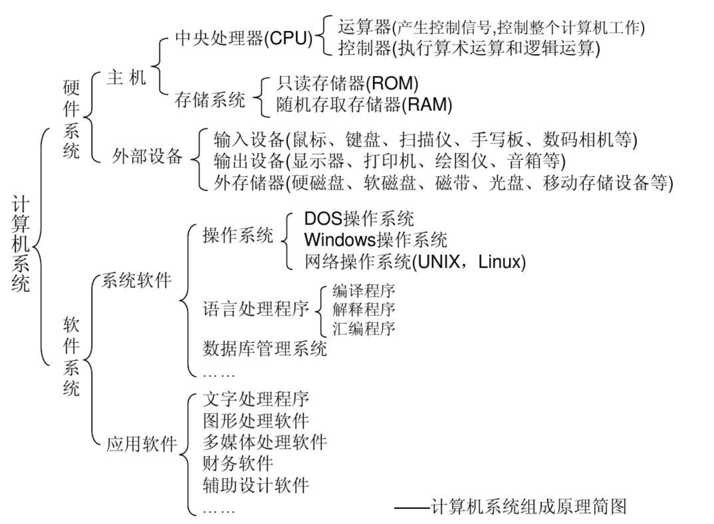
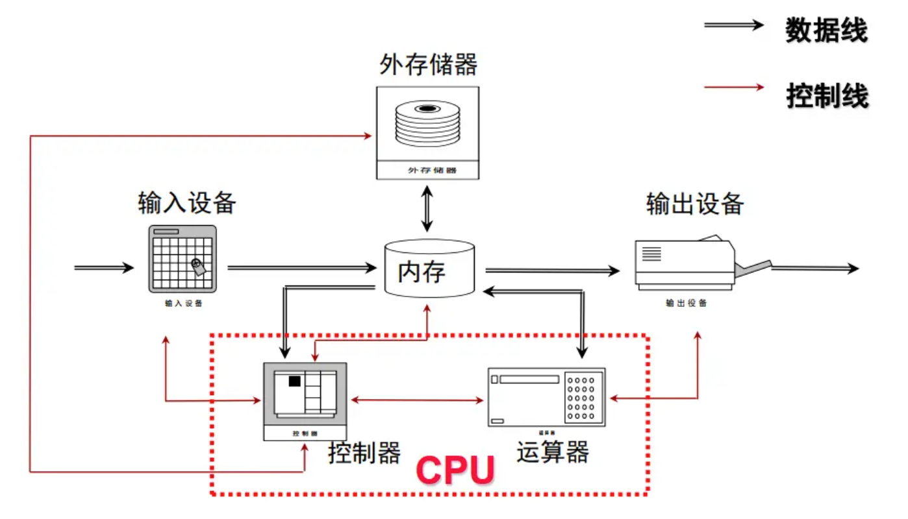
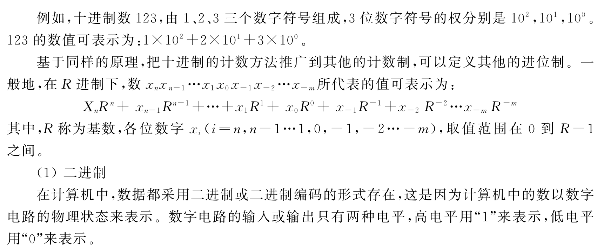
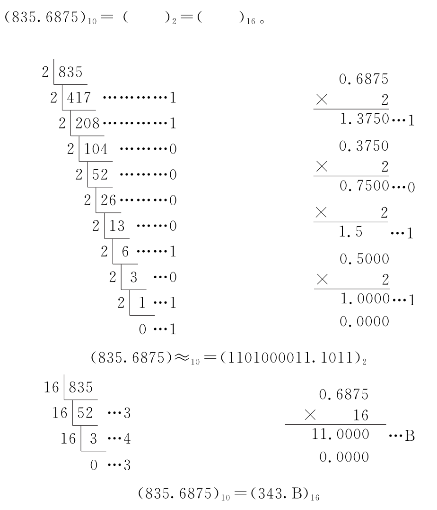
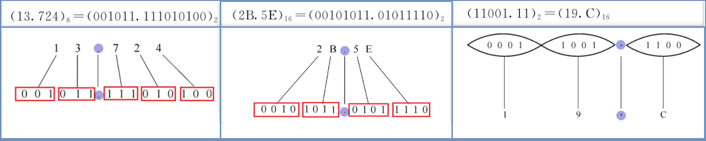

## 一 计算机体系结构及组成原理
1. 了解计算机的基本体系结构。计算机的组成部分及各个部分的作用。
2. 掌握二进制表示数。给出一个任意的十进制数，会算它的二进制数。
3. 掌握八进制数，十六进制数，掌握他们和2二进制的转换关系。
4. 了解程序编译运行的基本流程。如何从源代码变为机器码，最终在计算机上执行。

### 1 计算机基本体系

计算机由**存储器、 运算器、 控制器、 输入设备、 输出设备**五部分组成

### 2 数制及数制转换

1. R进制转换为十进制（位权相加法）

   |   R进制数值   |              转换过程              |  十进制数   |
   | :-----------: | :--------------------------------: | :---------: |
   | (10101.01)~2~ | (1x2^4^+1x2^2^+1x2^0^+1x2^-2^)~10~ | (21.25)~10~ |
   |   (37.6)~8~   |    (3x8^1^+7x8^0^+6x8^-1^)~10~     | (31.75)~10~ |
   |  (3A.C)~16~   |  (3x16^1^+10x16^0^+12x16^-1^)~10~  | (58.75)~10~ |

   

2. 十进制转换为R进制（除基取余-倒序法、乘基取整-顺序法）

3. 二进制、八进制、十六进制相互转换（位段转换法）

| 1    | 2    | 3    | 4    | 5    | 6    | 7    | 8    | 9    | A    | B    | C    | D    | E    | F    |
| ---- | ---- | ---- | ---- | ---- | ---- | ---- | ---- | ---- | ---- | ---- | ---- | ---- | ---- | ---- |
| 001  | 010  | 011  | 100  | 101  | 110  | 111  |      |      |      |      |      |      |      |      |
| 0001 | 0010 | 0011 | 0100 | 0101 | 0110 | 0111 | 1000 | 1001 | 1010 | 1011 | 1100 | 1101 | 1110 | 1111 |

## 二 操作系统部分

1. 理解计算机操作系统的概念。操作系统的作用，设计目标和具体功能。
2. 了解进程和线程的概念。
3. 了解计算机操作系统内存管理的概念。要明白为什么要有内存管理。（有兴趣的同学请研究内存管理算法）
4. 了解计算机文件系统的概念。了解磁盘存储介质。
5. 了解计算机IO管理主要的工作。了解缓存及缓冲区的概念。

### 1 操作系统概念

操作系统（Operating System，OS）：是管理计算机硬件与软件资源的`系统软件`。操作系统需要处理如管理与配置内存、决定系统资源供需的优先次序、控制输入与输出设备、操作网络与管理文件系统等基本事务。操作系统也提供一个让用户与系统交互的操作界面。

**三个作用：** （1）资源的管理者 （2）向用户提供各种服务 （3）对硬件机器的扩展

**设计目标：** （1）充分利用硬件 （2）提供更好的服务。

**五大基本功能：**

1. 进程和线程的管理 ——进程线程的状态、控制、同步互斥、通信调度等

2. 存储管理——分配/回收、地址转换、存储保护等

3. 文件管理——文件目录、文件操作、磁盘空间、文件存取控制

4. 设备管理——设备驱动、分配回收、缓冲技术等

5. 用户接口——系统命令、编程接口

### 2 进程和线程

**进程（process）：**进程就是运行中的程序 ——资源分配的最小单位

**线程（thread）：**系统分配处理器时间资源的基本单元，或者说进程之内独立执行的一个单元执行流 ——程序执行的最小单位 

**进程的3种状态：**

- 运行（running）：在运行状态下，进程正在处理器上运行。这意味着它正在执行指令。

- 就绪（ready）：在就绪状态下，进程已准备好运行，但由于某种原因，操作系统选择不在此时运行。

- 阻塞（blocked）：在阻塞状态下，一个进程执行了某种操作，直到发生其他事件时才会准备运行。一个常见的例子是，当进程向磁盘发起I/O请求时，它会被阻塞，因此其他进程可以使用处理器

### 3 内存管理及算法

### 4 文件系统、磁盘存储介质

 文件系统是操作系统中管理持久性数据的子系统，为用户提供了在计算机系统中对数据信息进行长期、大量存储和访问的功能

 实现磁盘存储空间管理（存到哪）及按名访问（怎么取出）的问题。

存储介质主要包括磁盘（包括固态硬盘SSD）、磁带、U盘、光盘等

### 6 IO管理、缓存及缓冲区

**常见设备接口类型：**

1. 字符设备：键盘鼠标、串口

      a.以字节为单位顺序访问
      b.I/O命令通常使用文件访问接口和语义

2. 块设备：磁盘、磁带、光驱

      a.均匀的数据块访问
      b.I/O命令通常使用文件系统接口，也可以使用内存映射访问

3. 网络设备：以太网、无线、蓝牙

      a.格式化的报文交换
      b.I/O网络报文，通过网络接口支持多种网络协议。

**同步与异步I/O：**

1. 阻塞I/O：发出请求后等待数据读出或写入完毕

2. 非阻塞I/O：发出请求后不等待立即返回，返回值为成功传输的字节数

3. 异步I/O：读数据时，使用指针标记好用户缓冲区，立即返回，稍后内核将填充缓冲区并通知用户；写数据内核写入完毕后通知用户

**缓存及缓冲区：**

1. **Buffer**（缓冲区）是系统两端处理**速度平衡**（从长时间尺度上看）时使用的。它的引入是为了减小短期内突发I/O的影响，起到**流量整形**的作用。比如生产者——消费者问题，他们产生和消耗资源的速度大体接近，加一个buffer可以抵消掉资源刚产生/消耗时的突然变化。
2. **Cache**（缓存）则是系统两端处理**速度不匹配**时的一种**折衷策略**。因为CPU和memory之间的速度差异越来越大（或内存和磁盘之间的速度差异），所以人们充分利用数据的局部性（locality）特征，通过使用存储系统分级（memory hierarchy）的策略来减小这种差异带来的影响。

## 三 Java语言部分
了解Java语言的基本信息，八一八发展历程等感兴趣的资料。

1. 学会配置Java开发环境（SDK+eclipse）。掌握Java SDK配置环境变量的意义。
2. 会使用命令行编译运行java程序。
3. 会使用eclipse编译运行java程序。
4. 掌握Java的基本数据类型，掌握每种类型的表示的数据及其范围。
5. 掌握Java的基本运算符的意义及用法。如说出&和&&的区别等。
6. 掌握Java最基本的流程控制语句用法。包括条件语句和循环语句。
7. 掌握一维数组的创建及使用。
8. 理解类和对象的基本概念。

## 四 数据结构部分
1. 线性表的概念

2. 掌握线性表的两种实现，顺序实现及链式实现。
3. 理解栈和队列的基本概念（深刻理解）
4. 理解栈和队列的顺序存储实现和链式存储实现。
5. 理解数组和矩阵的概念。
6. 掌握常见的内部排序方法（插入排序，，冒泡排序，选择排序，快速排序，堆排序，希尔排序，归并排序，基数排序等）。
7. 了解算法时间复杂度的概念。了解每种排序算法的时间复杂度。

### 1. Algorithm

**时间复杂度（Time Complexity）**

算法的时间效率是指算法的执行时间随问题规模的增长而增长的趋势，通常采用时间复杂度（Time Complexity）来度量：

O（1）＜O（log~2~n）＜O（n）＜O（n × log~2~n）＜O（n^2^）＜O（n^3^）＜ O（2^n^）

**空间复杂度（Space Complexity）**

当问题的规模以某种单位从1增大到n时，解决这个问题的算法在执行时所占用的存储空间也以某种单位从1增大到S（n），则称此算法的空间复杂度（Space Complexity）为S（n）

### 2. LinearList

长度（Length）、前驱（Predecessor）和后继（Successor）

