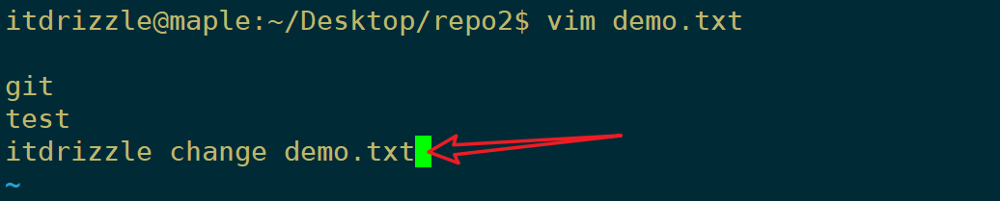
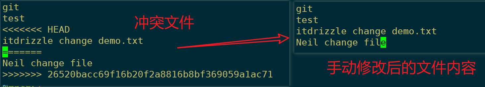
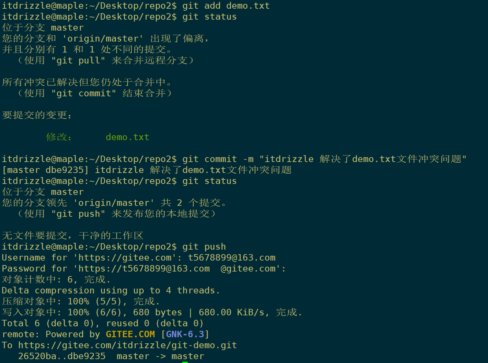

# 一 本地代码仓库
Git教程-GitHub：https://github.com/geeeeeeeeek/git-recipes 


## 1. 下载与安装

Git官网：https://git-scm.com 

Windows下载地址：https://git-scm.com/download/win

Linux 下载安装：https://git-scm.com/download/linux


```bash

Linux 用户：`sudo apt-get install git`


- 对于 Windows 用户，安装后如果希望在全局的 cmd 中使用 Git，
  需要把 git.exe 加入 PATH 环境变量中，或在 Git Bash 中使用 Git
  
  
Mac 用户：Xcode Command Line Tools 自带 Git（`xcode-select --install`）

```


<br/>


## 2. Git基础配置

**【Git配置】**: 在使用 git 前，需要告诉 git 你是谁，在向 git 仓库中提交时需要用到。

全局配置：

```bash

1. 配置提交人姓名：`git config --global user.name 提交人姓名`
2. 配置提交人姓名：`git config --global user.email 提交人邮箱` 
3. 查看git配置信息：`git config --list`   

如果要对配置信息进行修改，重复上述命令即可。配置只需要执行一次。


git config --global core.editor vim     # 选择你喜欢的文本编辑器

git config --global --edit              # 用文本编辑器打开全局配置文件，手动编辑

```


<br/>

所有配置项都储存在纯文本文件中， `git config` 命令其实只是一个提供便捷的命令行接口。

Git 将配置项保存在三个单独的文件中，允许你分别对单个仓库、用户和整个系统设置。

- /.git/config – 特定仓库的设置。`git config --local user.name 提交人姓名`
- ~/.gitconfig – 特定用户的设置。这也是 `--global` 标记的设置项存放的位置。
- $(prefix)/etc/gitconfig – 系统层面的设置。

当这些文件中的配置项冲突时，本地仓库设置覆盖用户设置，用户设置覆盖系统设置。

<br/>


# 二 本地代码仓库

## 1. init&clone

`git init` 命令创建一个新的 Git 仓库。它用来将已存在但还没有版本控制的项目转换成一个 Git 仓库，或者创建一个空的新仓库

```bash

### git init 用法

# 将当前的目录转换成一个 Git 仓库。当前的目录下会增加一个 `.git` 目录，记录项目版本相关信息
git init 


# 在指定目录创建一个空的 Git 仓库。运行这个命令会创建一个名为 `directory`、只包含 `.git` 子目录的空目录
git init <directory>


# 初始化一个裸的 Git 仓库，但是忽略工作目录。共享的仓库应该总是用 `--bare` 标记创建
git init --bare <directory>

# 一般来说，用 `--bare` 标记初始化的仓库以 `.git` 结尾。
# 比如，一个叫`my-project`的仓库，它的空版本应该保存在 `my-project.git` 目录下。
# 裸库的目录下没有.git目录，也就是说我们并不能在这个目录下执行我们一般使用的 Git 命令
# 一般将其作为远端备份或公共版本库

```

<br/>

因为 `git clone` 创建项目的本地拷贝更为方便，`git init` 最常见的使用情景就是用于创建中央仓库

例如：

```bash

# 首先，你用SSH连入存放中央仓库的服务器。然后，来到任何你想存放项目的地方，
# 最后，使用 `--bare` 标记来创建一个中央存储仓库`my-project.git` 、其余开发者会将其克隆到本地的开发环境中进行开发

ssh <user>@<host>

cd path/above/repo

git init --bare my-project.git

```


<br/>


**git clone**：

注意 远程仓库的 `.git` 拓展名克隆到本地时会被去除。它表明了本地仓库的非裸状态

```bash

# 将位于 `<repo>` 的仓库克隆到本地机器。原仓库可以在本地文件系统中，或是通过 HTTP 或 SSH 连接的远程机器
git clone <repo>


# 将位于 `<repo>` 的仓库克隆到本地机器上的 `<directory>` 目录
git clone <repo> <directory>

```


<br/>


## 2. git status

`git status` 命令显示工作目录和缓存区的状态。你可以看到哪些更改被缓存了，哪些还没有，以及哪些还未被 Git 追踪

`git status` 是一个相对简单的命令。 它告诉你 `git add` 和 `git commit` 的进展

```bash 

# 忽略文件

未追踪的文件通常有两类:
	它们要么是项目新增但还未提交的文件，
	要么是像 `.pyc`、`.obj`、`.exe` 等编译后的二进制文件。
显然前者应该出现在 `git status` 的输出中，而后者一般没什么用

因此，Git 允许你完全忽略这些文件，只需要将路径放在一个特定的 `.gitignore` 文件中。
所有想要忽略的文件应该分别写在单独一行，`*` 字符用作通配符。

```

在提交更改前检查仓库状态是一个良好的实践，这样你就不会不小心提交什么奇怪的东西。


<br/>


## 3. git add

`git add` 命令将工作目录中的变化添加到暂存区。它告诉 Git 你想要在下一次提交时包含这个文件的更新。

但是，`git add` 不会实质上地影响你的仓库——在你运行 `git commit` 前更改都还没有真正被记录。

使用这些命令的同时，需要使用 `git status` 来查看工作目录和暂存区的状态

```bash

# 将 `<file>` 中的更改加入下次提交的缓存
git add <file>


# 将 `<directory>` 下的更改加入下次提交的缓存
git add <directory>


# 
git add .


git add -i
# 开始交互式的缓存，你可以选择文件的一部分加入到下次提交缓存。它会向你展示一堆更改，等待你输入一个命令。
    `y` 将这块更改加入缓存，
    `n` 忽略这块更改，
    `s` 将它分割成更小的块，
    `e` 手动编辑这块更改，
    `q` 退出

```


<br/>


## 4. git commit

`git commit`命令将缓存的快照提交到本地仓库。提交的快照可以认为是项目安全的版本，Git 永远不会改变它们，除非你这么要求。

```bash

# 提交已经缓存的快照。但将 `<message>` 作为提交信息，而不是运行文本编辑器
git commit -m "<message>"


# 提交一份包含工作目录所有更改的快照。它只包含跟踪过的文件的更改（那些之前已经通过 `git add` 添加过的文件）
git commit -a


# 提交已经缓存的快照。它会运行文本编辑器，等待你输入提交信息。当你输入信息之后，保存文件，关闭编辑器，创建实际的提交
git commit

```

记录快照，而不是记录差异：

SVN 和 Git 除了使用上存在巨大差异，它们底层的实现同样遵循截然不同的设计哲学。

SVN 追踪文件的 *变化* ，而 Git 的版本控制模型基于 *快照* 。

比如说，一个 SVN 提交由仓库中原文件相比的差异（diff）组成。而 Git 在每次提交中记录文件的 *完整内容* 。


这让很多 Git 操作比 SVN 来的快得多，因为文件的某个版本不需要通过版本间的差异组装得到 ——

每个文件完整的修改能立刻从 Git 的内部数据库中得到。

Git 的快照模型对它版本控制模型的方方面面都有着深远的影响，从分支到合并工具，再到协作工作流，以至于影响了所有特性


<br/>


## 5. git log

`git log` 命令显示已提交的快照。你可以列出项目历史，筛选，以及搜索特定更改。

`git status` 允许你查看工作目录和缓存区，而 `git log` 只作用于提交的项目历史。

```bash

# 使用默认格式显示完整地项目历史。如果输出超过一屏，你可以用 `空格键` 来滚动，按 `q` 退出
git log


# 用 `<limit>` 限制提交的数量。比如 `git log -n 3` 只会显示 3 个提交
git log -n <limit>


# 将每个提交压缩到一行。当你需要查看项目历史的上层情况时这会很有用。
git log --oneline

# 除了 `git log` 信息之外，包含哪些文件被更改了，以及每个文件相对的增删行数
git log --stat

# 显示代表每个提交的一堆信息。显示每个提交全部的差异（diff），这也是项目历史中最详细的视图
git log -p


# 只显示包含特定文件的提交。查找特定文件的历史这样做会很方便
git log <file>

# 搜索特定作者的提交。`<pattern>` 可以是字符串或正则表达式
git log --author="<pattern>"

# 搜索提交信息匹配特定 `<pattern>` 的提交。`<pattern>` 可以是字符串或正则表达式
git log --grep="<pattern>"

# 只显示发生在 `<since>` 和 `<until>` 之间的提交。两个参数可以是提交 ID、分支名、`HEAD` 或是任何一种引用
git log <since>..<until>


# 还有一些有用的选项
git log --graph --decorate --oneline
`--graph` 标记会绘制一幅字符组成的图形，左边是提交，右边是提交信息
`--decorate` 标记会加上提交所在的分支名称和标签
`--oneline` 标记将提交信息显示在同一行，一目了然


# 可以将很多选项用在同一个命令中
git log --author="John Smith" -p hello.py

```


<br/>


# 二 远程代码仓库

## 1. git remote

`git remote` 命令允许你创建、查看和删除和其它仓库之间的连接。远程连接更像是书签，而不是直接跳转到其他仓库的链接。

它用方便记住的别名引用不那么方便记住的 URL，而不是提供其他仓库的实时连接。

```shell

git remote -v                            #列出你和其他远程仓库之间的连接（-v 同时显示每个连接的 URL）
git remote add <name> <url>              #创建一个新的远程仓库连接。在添加之后，你可以将 <name> 作为 <url> 便捷的别名在其他 Git 命令中使用

git remote rm <name>                     #删除名为<name>的远程仓库连接
git remote rename <old-name> <new-name>  #将远程连接从 <old-name> 重命名为 <new-name>

#需要将代码同时推送到多个远程仓库的情形：
git remote add origin https://gitee.com/drizzletowne/develop.git
git remote set-url --add origin https://github.com/drizzletowne/Develop.git

```


<br/>

## 2. git fetch

`git fetch` 命令将提交从远程仓库导入到你的本地仓库。

拉取下来的提交储存为远程分支，而不是我们一直使用的普通的本地分支。因此可以在整合进本地仓库之前查看更改

```bash

# 拉取仓库中所有的分支。同时会从另一个仓库中下载所有需要的提交和文件 (它会显示被下载的分支)
git fetch <remote>


# 和上一个命令相同，但只拉取指定的分支
git fetch <remote> <branch>


# 查看远程分支
git branch -r
# origin/master
# origin/develop
# origin/some-feature


# 查看添加到上游 master 上的提交，用 `origin/master` 过滤：
git log --oneline master..origin/master

# 用下面这些命令接受更改并并入本地 `master` 分支
git checkout master
git log origin/master

git merge origin/master  # origin/master 和 master 分支现在指向了同一个提交，你已经和上游的更新保持了同步

```

远程分支拥有 remote 的前缀，所以你不会将它们和本地分支混起来。

可以用寻常的 `git checkout` 和 `git log` 命令来查看这些分支。

如果你接受远程分支包含的更改，你可以使用 `git merge` 将它并入本地分支。

同步你的本地仓库和远程仓库事实上是一个分两步的操作：先 fetch，然后 merge。`git pull` 命令是这个过程的快捷方式。


<br/>


## 3. git pull

上面使用 `git fetch` 拉去远程仓库的代码，然后使用 `git merge` 合并到本地仓库， `git pull` 则是将将这两个命令合二为一

```bash

# 拉取当前分支对应的远程副本中的更改，并立即并入本地副本。效果和 `git fetch` 后接 `git merge origin/.` 一致
git pull <remote>


# 和上一个命令相同，但使用 `git rebase` 合并远程分支和本地分支，而不是使用 `git merge`
git pull --rebase <remote>

```


<br/>


## 4. git push

```shell

git push <远程主机名> <本地分支名>:<远程分支名>   #将本地分支的更新，推送到远程主机(这里的:前后是必须没有空格)

#将本地的master分支推送到origin主机的master分支,如果后者不存在，则会被新建
git push -u origin master      #-u选项指定一个默认主机，这样后面就可以不加任何参数使用git push

git push origin                #如果当前分支与远程分支之间存在追踪关系，则本地分支和远程分支都可以省略
git push                       #如果当前分支只有一个追踪分支，那么主机名都可以省略

```

<br/>

```shell

#慎用！删除远程仓库的分支
git push origin :master          #推送一个空的本地分支到远程分支,等同于:
git push origin --delete master

git push -f origin master        #强制用本地的代码去覆盖掉远程仓库的代码 (-f为force，意为：强行、强制)

```

<br/>


## 5. 解决冲突

示例：

现有这样一个项目（共有两次提交）：


共有两个项目成员（Neil 和 itdrizzle）进行开发：


Neil 先对 demo.txt 文件进行了修改：

```bash

git
test
Neil change file  # 新增的内容

```


然后进行了提交，并push到了 远程仓库


现在 itdrizzle 还不知道有人 进行了提交，他也想对 demo.txt 文件进行一些修改：




同样，他也进行了 提交 并push 到远程仓库：


显然，结果不尽人意，冲突已经发生，需要解决

itdrizzle 这时先将远程仓库的代码拉取到本地，而且使用了 git pull ，希望能自动合并


结果显然不行，需要 itdrizzle 手动解决冲突再进行提交：




解决冲突后，itdrizzle 再次进行了提交：




此时 Neil 再去 git pull 即可获取最新的项目信息：


<br>

# 三 撤销与删除


- `git checkout <commit>` —— 更新工作目录中的所有文件，使得和某个特定提交中的文件一致。
- `git checkout <commit> <file>` —— 它将工作目录中的 `<file>`文件变成` <commit> `中那个文件的拷贝，**并将它加入缓存区**。 [更多](https://github.com/geeeeeeeeek/git-recipes/wiki/2.5-检出之前的提交)


- 将文件从暂存区中删除： `git rm --cached 文件`
- 将 git 仓库中指定的更新记录恢复出来，并且覆盖暂存区和工作目录：`git rest --hard commitID` 

<br/>


# 四 Git问题汇总

## 1.  ssh免登陆

生成秘钥：`ssh-keygen` 

秘钥存储目录：C:\Users\用户\\.ssh

公钥名称：id_rsa.pub

私钥名称：id_rsa

```bash
ssh-keygen -t rsa -C "msdrizzle@outlook.com"    #进入gitbash , 使用如下命令，连续三次回车
cat ~/.ssh/id_rsa.pub                           #查看公钥 (然后登录Gitee,在设置中找到SSHKEY将id_rsa.pub文件的内容复制进去即可)
ssh -T git@gitee.com -y                         #测试是否成功
```

<br/>


## 2. 中文乱码问题
```bash
git config --global core.quotepath false             #git status 乱码解决方法
git config --global i18n.commitencoding utf-8        #git commit 乱码解决方法
git config --global i18n.logoutputencoding utf-8     #git status 乱码解决方法

#注意：如果是Linux系统，需要设置环境变量 export LESSCHARSET=utf-8
```