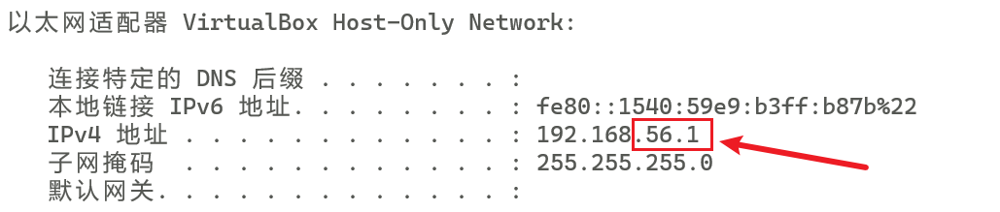

# 一 VMware相关

## 1. 设置静态网络IP

    VMware 点击 编辑 ——> 虚拟网络编辑器 (如图：)


```shell
ip addr
vi /etc/sysconfig/network-scripts/ifcfg-ens33

service network restart 
```


<br/>

## 2. 虚拟机自启动

1. 创建启动、关闭脚本

```bash
# 在系统的某个安静的盘中创建一个vm_start.bat文件，然后使用编辑器打开。写入: 
"C:\Program Files (x86)\VMware\VMware Workstation\vmrun.exe" start "D:\VirtualMachines\DevMachines\DevMachines.vmx" nogui

# 再次创建一个vm_stop.bat文件
"C:\Program Files (x86)\VMware\VMware Workstation\vmrun.exe" stop "D:\VirtualMachines\DevMachines\DevMachines.vmx"

#测试运行文件: 双击启动文件vm_start.bat，如果弹出dos窗口且虚拟机启动则无误,双击停止文件vm_stop.bat，如果弹出dos窗口且虚拟机停止则无误
```

<br/>

2. 添加到自启动任务

`Win+ R`  -> `gpedit.msc` -> 用户配置 -> windows设置 -> 鼠标双击脚本(登录/注销) -> 鼠标双击“登录”或“注销”分别添加启动、关闭脚本

【Q】主机访问不到虚拟机的服务的解决办法

```shell
firewall-cmd --query-port=9200/tcp                           #查看端口号是否开启,如果是no，就说明没有开放

firewall-cmd --zone=public --add-port=6379/tcp --permanent   #开通6379端口(redis)
firewall-cmd --zone=public --add-port=8848/tcp --permanent   #开通8848端口(nacos)
firewall-cmd --zone=public --add-port=3306/tcp --permanent   #开通3306端口(mysql)

firewall-cmd --reload                                        #重启防火墙，端口正常开启
systemctl restart docker                                     #如果是docker容器的化则要重启下docker服务 
```

<br/>


# 二 vagrant安装

## 1. 安装准备

**virtualbox + vagrant 安装**：

1. 下载安装 [Virtual box](https://www.virtualbox.org/) 的`主程序`和`拓展包`，安装后修改虚拟机存放位置（需要cpu开启虚拟化）

   <br/>

2. 下载安装 [Vagrant](https://www.vagrantup.com/) （ Vagrant 是没有图形界面的，安装程序会自动把安装路径加入到 PATH 环境变量 ）

```
vagrant version
```

- 配置vagrant (虚拟机镜像文件存储目录，默认为：C:\Users\用户名\.vagrant.d)  —— `VAGRANT_HOME`


<br/>


3. 下载虚拟机镜像
   使用 Vagrant 创建虚机时，需要指定一个镜像，也就是 box。开始这个 box 不存在，所以 Vagrant 会先从网上（[镜像网站](https://app.vagrantup.com/boxes/search)）下载，然后缓存在本地目录中。但默认下载往往会比较慢，我们可以自己下载镜像文件。常用的两个 Linux 操作系统镜像的下载地址：

- CentOS [官网下载](http://cloud.centos.org/centos/) ，[CentOS-7.box （点击下载）](http://cloud.centos.org/centos/7/vagrant/x86_64/images/CentOS-7.box) 列表中有一个 vagrant 目录，选择其中的 .box 后缀的文件下载即可。

- Ubuntu [官网下载](http://cloud-images.ubuntu.com/) ，[清华大学镜像站下载](https://mirror.tuna.tsinghua.edu.cn/ubuntu-cloud-images/) ，同样选择针对 vagrant 的 .box 文件即可。

  <br/>


```shell

添加 box ：接下来我们需要将下载后的 .box 文件添加到 vagrant 中：

```

<br/>

```shell

# 如果这是第一次运行，此时 VAGRANT_HOME 目录下会自动生成若干的文件和文件夹，其中有一个 boxes 文件夹，
# 这就是要存放 box 文件的地方。

vagrant box list

#执行 vagrant box add 命令添加 box: (命令后面跟着的是镜像文件的路径，通过 --name centos-7 为这个 box 指定名字)
vagrant box add E:\Package\VM\VirtualBox\CentOS-7.box --name centos-7

vagrant box list        #再次查询，可以看到有了一个 box

```

<br/>


## 2. 安装虚拟机

Vagrant新建虚拟机

```shell

#先进入vagrant工作目录（Vagrantfile所在的目录）再执行命令
vagrant init centos-7

#首次执行会先安装再启动，之后就是启动的功能（注意要在Vagrantfile所在的目录执行）
vagrant up

```

<br/>

```shell
# 常用命令
vagrant status         #查看虚拟机状态
vagrant ssh            #以 vagrant 用户直接登入虚拟机中，使用 exit; 退出

vagrant halt           #关闭虚拟机
vagrant suspend        #暂停虚拟机
vagrant resume         #恢复虚拟机
vagrant reload         #重载虚拟机(可能会重启失败，需要重启宿主机才能开机虚拟机)
vagrant destroy        #删除虚拟机
```

<br/>

配置私有网络：

上述创建的虚拟机网络默认使用的是 `网络地址转换（NAT）+ 端口转发` 的方式，

我们需要修改 `Vagrantfile`，为虚拟机设置指定的私有网络地址：

```shell

# 取消改行的注释，根据下图宿主机的IP地址，修改前三段地址一致即可
config.vm.network "private_network", ip: "192.168.56.10"

```

<br/>

```
ipconfig
```



```shell

# 修改Vagrantfile文件后，需要重启虚拟机，若重启失败可删除重装，先修改Vagrantfile，再vagrant up
vagrant reload

```

<br/>


更改虚拟机配置（[Provider配置](https://www.vagrantup.com/docs/providers/virtualbox/configuration)）

```shell
config.vm.provider "virtualbox" do |v|
v.memory = 4096
v.cpus = 4
end
```

> 【注意】修改Vagrantfile可能会导致虚拟机无法启动，可在安装前先修改好Vagrantfile文件。系统用户密码均为 ：vagrant

<br/>


# 三 Ubuntu

官网：https://ubuntu.com/

## 1. vm tools
[安装 Open VM Tools](https://docs.vmware.com/cn/VMware-Tools/11.3.0/com.vmware.vsphere.vmwaretools.doc/GUID-C48E1F14-240D-4DD1-8D4C-25B6EBE4BB0F.html) 

```bash

请确保已更新软件包索引：
sudo apt-get update

如果虚拟机具有 GUI（X11 等），请安装或升级 open-vm-tools-desktop：
sudo apt-get install open-vm-tools-desktop

否则，请使用以下命令安装 open-vm-tools：
sudo apt-get install open-vm-tools

```


<br/>

## 2. 语言和输入法


<br/>


## 3. 


<br/>


# 四 开发环境


## 1. jdk

[jdk 8u202之前的版本下载地址](https://www.oracle.com/java/technologies/javase/javase8-archive-downloads.html)   &nbsp;  [jdk全版本下载地址](https://www.oracle.com/java/technologies/oracle-java-archive-downloads.html)

- 先检查是否已经安装jdk

```shell
java -version

rpm -qa|grep openjdk -i   # 检查系统安装的openjdk

rpm -e --nodeps XXX(需要删除的软件名) #如果存在openjdk,就用这个命令逐一删除
```

- 创建jdk安装目录和软件包存储目录，并上传jdk文件。将文件解压剪贴到jdk安装目录后配置环境变量即可。

```shell
mkdir /usr/java
mkdir /home/software

tar -zxvf jdk-8u191-linux-x64.tar.gz
mv jdk1.8.0_191/ /usr/java/
```

- 配置环境变量，（修改profile文件）

```shell
vim /etc/profile  #配置环境变量，加入如下信息：(按esc退出插入模式后 :wq 保存退出)
```

```
export JAVA_HOME=/usr/java/jdk1.8.0_191
export CLASSPATH=.:$JAVA_HOME/lib/dt.jar:$JAVA_HOME/lib/tools.jar
export PATH=$JAVA_HOME/bin:$PATH
```

- 刷新profile，使其生效

```shell
source /etc/profile
```
<br>

##  2. mysql

## 3. redis


## n. 桌面软件


<br/>