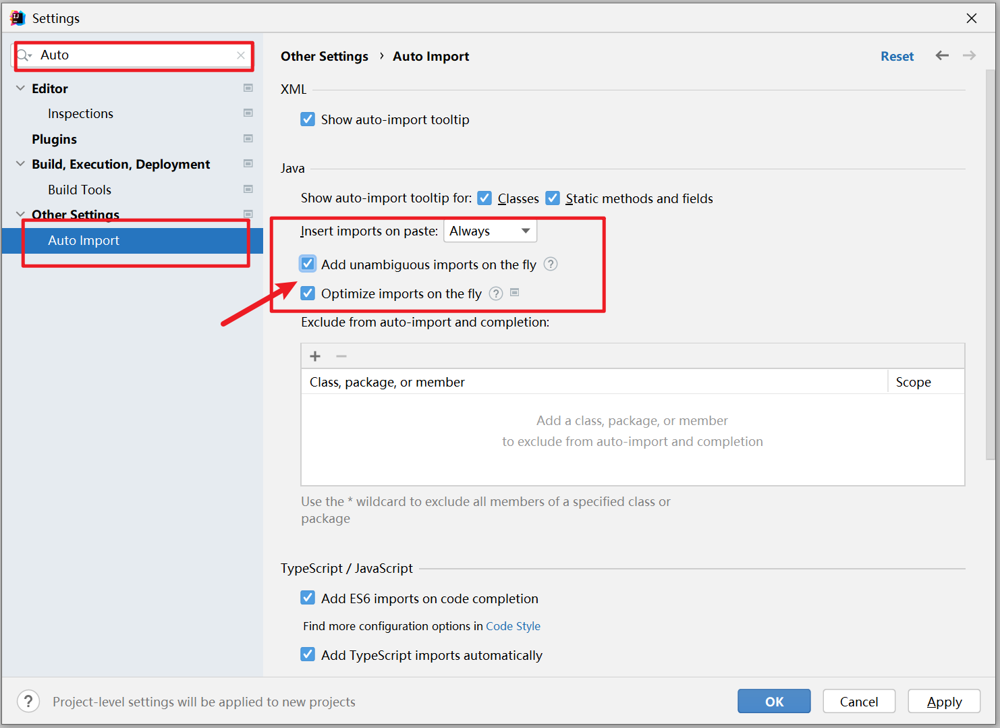
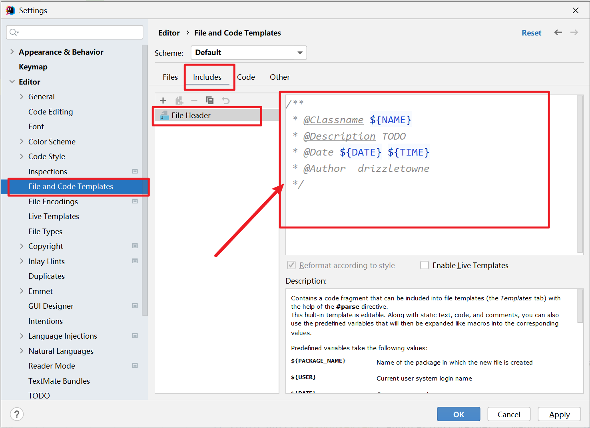
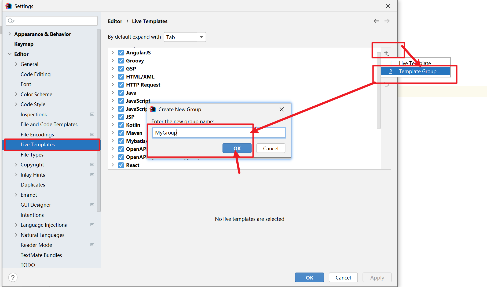
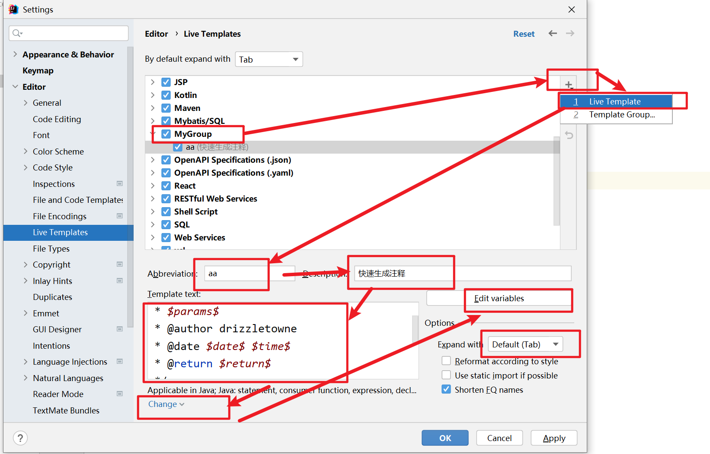
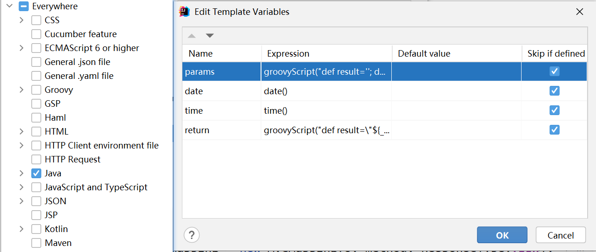
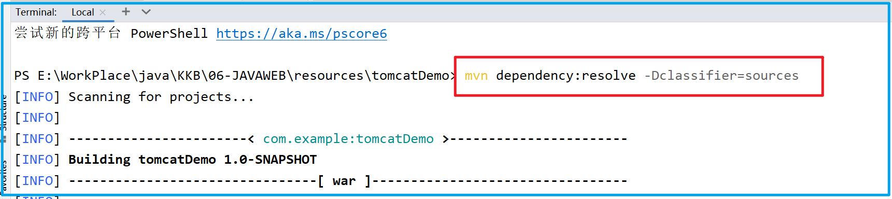

# 一 IDEA设置

一个神奇的网站：https://zhile.io/

ja-netfilter：https://zhile.io/2021/11/29/ja-netfilter-javaagent-lib.html


<br>

## 1. 常用插件

- Lombok

- Maven Helper

- 


<br>

## 2. 自动导包

自动导包、自动删除不需要的import语句




<br>

## 3. 注释模板

创建类时自动生成注释的模板、示例：

```java
/**
 * @Classname ${NAME}
 * @Description TODO
 * @Date ${DATE} ${TIME}
 * @Author  idrizzle
 */
```




创建方法模板：

**File–>Settings–>Editor–>Live Templates、点击右边的 + 号, 选择 Template Group** 、创建自己的组名




选择自己的组名，点击”+”号，选择Live Template、填写Abbreviation，Description，Template text

```java
**
$params$ 
 * @author itdrizzle
 * @date $date$ $time$ 
 * @return $return$
 */
```




点击 Define 选择java，也可以选择everywhere 、设置Edit variables 



```groovy
groovyScript("def result=''; def params=\"${_1}\".replaceAll('[\\\\[|\\\\]|\\\\s]', '').split(',').toList(); for(i = 0; i < params.size(); i++) {result+=' * @param ' + params[i] + ((i < params.size() - 1) ? '\\r\\n' : '')}; return result", methodParameters())
```

```groovy
groovyScript("def result=\"${_1}\"; if(result == \"void\"){return \"\";}else{return \"{@link \"+result+\"}\";}", methodReturnType())
```

【注】使用方式：先键入 /*aa 再按tab健即可

<br>


# 二 常用快捷键

## 1. 编辑快捷键

| idea快捷键      | 功能或作用                        | eclipse对应快捷键                         |
| --------------- | --------------------------------- | ----------------------------------------- |
| Alt+insert      | 生成get，set方法                  | Shift+Alt+S                               |
| Ctrl+Alt+L      | 格式化代码                        | 先选择代码 然后 Ctrl+I格式化代码          |
| Ctrl+Alt+T      | 把代码包在一个块内，如：try/catch |                                           |
| Ctrl+Shift+U    | 切换代码大小写                    | Ctrl+Shift+X（大写） Ctrl+Shift+Y（小写） |
| Ctrl+F4         | 关闭当前代码窗                    | Ctrl+W                                    |
| Ctrl+Alt+左右键 | 快速定位到上一次编辑的位置        | Ctrl+Q                                    |

【注】Ctrl+Alt+L 常和其他快捷键冲突、改用Ctrl+Shift+Alt+L

<br>


## 2. 其他快捷键


<br>


# 三 常见问题


## 1. Cannot Download Sources

利用idea自动下载源码时，提示Cannot Download Sources、IDEA 出现Cannot Download Sources 的解决办法：

点击terminal，在其中命令台中 输入 ：

```
mvn dependency:resolve -Dclassifier=sources
```

如图：



<br>