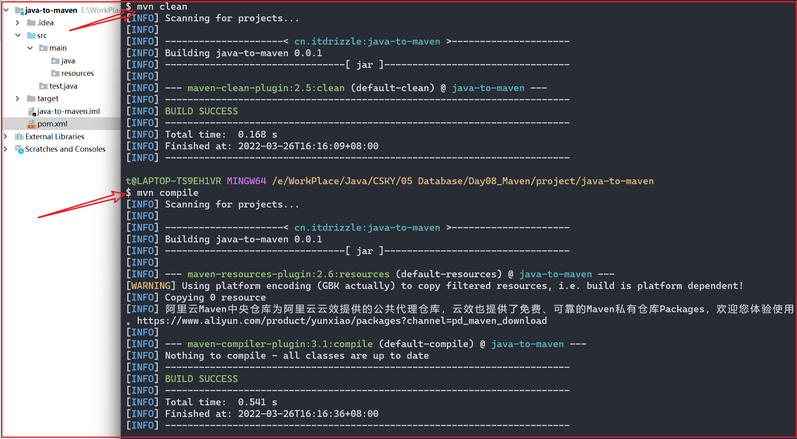

# 一 Maven简介

Maven 翻译为"专家"、"内行"，是 Apache 下的一个纯 Java 开发的开源 项目。

Maven 是一个项目管理工具，可以对 Java 项目进行构建、依赖管理。

<br/>


## 1. Maven的安装

官网下载地址：https://maven.apache.org/download.cgi

Maven仓库地址：https://mvnrepository.com/

<br/>

安装：解压到指定目录即可，注意maven需要配置 `JAVA_HOME` 和 `MAVEN_HOME` ：


<br/>

```shell

# Linux下的环境变量配置：

sudo vim /etc/profile

export MAVEN_HOME=/usr/maven/apache-maven-3.8.5
export PATH=$MAVEN_HOME/bin:$PATH

source /etc/profile

# 测试是否安装成功

mvn -v
mvn -version

```


<br/>


## 2. Maven仓库配置

修改  `conf` 目录下的 `settings.xml` ：

```xml
<!-- 配置本地仓库地址 （settings.xml） -->
<localRepository>D:\Develop\env\maven\repository</localRepository>
```

<br/>

```xml
<!-- 配置远程（中央）仓库地址 （settings.xml） -->
<mirror>
    <id>aliyunmaven</id>
    <name>aliyun maven</name>
    <url>http://maven.aliyun.com/nexus/content/groups/public/</url>
    <mirrorOf>central</mirrorOf>
</mirror>
```

阿里云云效 Maven地址：https://developer.aliyun.com/mvn/guide 

<br/>


## 3. IDEA设置Maven

IDEA中的maven配置：


<br/>


## 4. 创建Maven项目

IDEA可以便捷的创建一个maven项目，但一个普通的java项目也可以升级为maven项目：

<br/>

操作步骤：

先创建一个java普通项目、再创建maven项目所需的目录结构和 pom.xml 文件


<br/>

完善pom.xml文件：

```xml
<?xml version="1.0" encoding="UTF-8"?>
<project xmlns="http://maven.apache.org/POM/4.0.0"
         xmlns:xsi="http://www.w3.org/2001/XMLSchema-instance"
         xsi:schemaLocation="http://maven.apache.org/POM/4.0.0 http://maven.apache.org/xsd/maven-4.0.0.xsd">
    <modelVersion>4.0.0</modelVersion>

    <groupId>cn.itdrizzle</groupId>
    <artifactId>java-to-maven</artifactId>
    <version>0.0.1</version>

</project>
```

<br/>

此时，maven项目已经创建完成了，可以执行maven命令试试：



<br/>

但此时IDEA还不能识别为maven项目，需要标记以下：


end~


<br/>


# 二 Maven生命周期

Maven Core – Lifecycles Reference：https://maven.apache.org/ref/3.8.5/maven-core/lifecycles.html

## 1. 生命周期与插件

Maven defines 3 lifecycles in `META-INF/plexus/components.xml`:

- [clean Lifecycle](https://maven.apache.org/ref/3.8.5/maven-core/lifecycles.html#clean_Lifecycle) ：Clean 生命周期

  当我们执行 `mvn post-clean` 命令时，Maven 调用 clean 生命周期，它包含以下阶段：

  - pre-clean：执行一些需要在clean之前完成的工作
  - clean：移除所有上一次构建生成的文件
  - post-clean：执行一些需要在clean之后立刻完成的工作

  `mvn clean` 中的 clean 就是上面的 clean，在一个生命周期中，运行某个阶段的时候，它之前的所有阶段都会被运行

  <br/>

- [default Lifecycle](https://maven.apache.org/ref/3.8.5/maven-core/lifecycles.html#default_Lifecycle) ： Default (Build) 生命周期

  这是 Maven 的主要生命周期，被用于构建应用，包括下面的 23 个阶段：

  | 生命周期阶段                                | 描述                                                         |
  | :------------------------------------------ | :----------------------------------------------------------- |
  | validate（校验）                            | 校验项目是否正确并且所有必要的信息可以完成项目的构建过程。   |
  | initialize（初始化）                        | 初始化构建状态，比如设置属性值。                             |
  | generate-sources（生成源代码）              | 生成包含在编译阶段中的任何源代码。                           |
  | process-sources（处理源代码）               | 处理源代码，比如说，过滤任意值。                             |
  | generate-resources（生成资源文件）          | 生成将会包含在项目包中的资源文件。                           |
  | process-resources （处理资源文件）          | 复制和处理资源到目标目录，为打包阶段最好准备。               |
  | compile（编译）                             | 编译项目的源代码。                                           |
  | process-classes（处理类文件）               | 处理编译生成的文件，比如说对Java class文件做字节码改善优化。 |
  | generate-test-sources（生成测试源代码）     | 生成包含在编译阶段中的任何测试源代码。                       |
  | process-test-sources（处理测试源代码）      | 处理测试源代码，比如说，过滤任意值。                         |
  | generate-test-resources（生成测试资源文件） | 为测试创建资源文件。                                         |
  | process-test-resources（处理测试资源文件）  | 复制和处理测试资源到目标目录。                               |
  | test-compile（编译测试源码）                | 编译测试源代码到测试目标目录.                                |
  | process-test-classes（处理测试类文件）      | 处理测试源码编译生成的文件。                                 |
  | test（测试）                                | 使用合适的单元测试框架运行测试（Juint是其中之一）。          |
  | prepare-package（准备打包）                 | 在实际打包之前，执行任何的必要的操作为打包做准备。           |
  | package（打包）                             | 将编译后的代码打包成可分发格式的文件，比如JAR、WAR或者EAR文件。 |
  | pre-integration-test（集成测试前）          | 在执行集成测试前进行必要的动作。比如说，搭建需要的环境。     |
  | integration-test（集成测试）                | 处理和部署项目到可以运行集成测试环境中。                     |
  | post-integration-test（集成测试后）         | 在执行集成测试完成后进行必要的动作。比如说，清理集成测试环境。 |
  | verify （验证）                             | 运行任意的检查来验证项目包有效且达到质量标准。               |
  | install（安装）                             | 安装项目包到本地仓库，这样项目包可以用作其他本地项目的依赖。 |
  | deploy（部署）                              | 将最终的项目包复制到远程仓库中与其他开发者和项目共享。       |

​		<br/>

- [site Lifecycle](https://maven.apache.org/ref/3.8.5/maven-core/lifecycles.html#site_Lifecycle) ：Site 生命周期

  Maven Site 插件一般用来创建新的报告文档、部署站点等

  - pre-site：执行一些需要在生成站点文档之前完成的工作

  - site：生成项目的站点文档

  - post-site： 执行一些需要在生成站点文档之后完成的工作，并且为部署做准备

  - site-deploy：将生成的站点文档部署到特定的服务器上


<br/>


## 2. Maven常用命令

每个命令都对应一个插件，执行命令实际是调用对应的插件来完成。

```sql
# 执行命令的方式：

-- 第一种: 找到项目对应的文件夹，然后打开cmd，输入指令，例如 mvn clean

-- 第二种：打开idea的侧边栏，点开maven，找到lifecycle,双击指令

-- 第三种：找到idea中下面的terimal控制栏，输入指令（要求idea使用管理员权限打开）


在cmd下就可以管理项目，先切换到项目的根文件夹：

```

<br/>

**Maven常用命令**：

- <span style='color:red;font-size:文字大小;font-family:字体;'>**clean：可以帮助我们清除编译生成的target文件夹**</span>

  ```
  mvn clean
  ```

  <br/>

- validate：不常用。验证的意思，作用是帮助我们检查项目中的文件是否有错。

  ```
  mvn validate
  ```

  <br/>

- <span style='color:red;font-size:文字大小;font-family:字体;'>**compile：编译的意思。可以帮助我们去编译项目，这个很常用。**</span> 

  ```
  mvn compile
  ```

  <br/>

- test：其实就是测试的意思，可以帮助我们去运行项目中的测试类和测试方法。（src/test/java）

  ```
  mvn test
  ```

  <br/>

- <span style='color:red;font-size:文字大小;font-family:字体;'>**package：打包的意思，可以帮助我们把项目进行打包。打成（.jar 和.war）**</span>

  ```xml
  <!-- 在pom.xml文件中，可以修改这个配置 -->
  <!-- 打包格式 默认为jar-->
  <packaging>jar</packaging>
  ```

​		<br/>

- verify：验证 的意思。其实就是去验证我们的jar包有没有问题

  ```
  mvn verify
  ```

  <br/>

- <span style='color:red;font-size:文字大小;font-family:字体;'>**install：安装的意思，其实就是把我们的jar包复制到本地仓库中去，根据坐标放置jar包。**</span> 

  ```
  mvn install
  ```

  <br/>

- site：部署站点、 deploy：部署项目的意思。

  ```shell
  mvn site
  mvn deploy
  ```

  site和deploy都是和项目部署相关的指令，可以帮助我们把本地仓库中的项目（jar包）推送到远程服务器，并且部署启动。

  我们一般不使用maven来做项目的部署。在企业中，有专门的项目部署（运维）工具：jenkins和k8s（docker）


<br/>

有一些与 Maven 生命周期相关的重要概念需要说明：

当一个阶段通过 Maven 命令调用时，例如 mvn compile，只有该阶段之前以及包括该阶段在内的所有阶段会被执行。

这就是maven的对项目的自动构建。你执行deploy，编译、测试、打包、安装、部署都给你弄了。


<br/>


# 三 Maven核心概念

## 1. Maven坐标

在 Maven 中，确定唯一的一个 jar 包也需要三个坐标， groupId、artifactId、version 三个信息。

```xml
 groupId：    当前的组织名称 (一般为公司域名的反转)
 artifactId： 当前项目的名称 
 version：    当前项目的当前版本
```


<br/>


## 2. Scope依赖范围

scope：是指jar包的作用域

```xml
<dependency>
    <groupId>junit</groupId>
    <artifactId>junit</artifactId>
    <version>4.11</version>
    <scope>test</scope>
</dependency>
```

`<scope>` 常用的值：

```java
- compile：默认的作用域，默认可以省略。
  对于编译（src/main/java），测试(src/test/java)，运行(运行时，target/classes)三种classpath都有效。

- test：只对测试的classpath有效。
  什么叫做只对测试的classpath有效呢？  典型：junit
  意思就是只有在 src/test/java 路径下，才能找到这个作用域修饰的jar包下面的类和方法。

- provided
  对于编译，测试的classpath有效，但是对于运行的classpath无效。
  典型：servlet-api

- runtime
  对于编译、测试的classpath无效，但是对于运行的classpath有效。
  典型：mysql-connector-java
  
```


<br/>


## 3. 依赖传递与冲突

依赖具有传递性：

例如 ` a->b（表示a依赖b），b->c`，根据依赖的传递性，就相当于a的依赖里面有c这个jar包

<br/>


依赖冲突指的是当在同一个项目中，导入了同一个jar包的不同的版本，就会存在依赖冲突的问题

如何去解决依赖冲突的问题呢？

<br/>

maven默认就有 声明有限原则 和 就近原则，如下：

**1. 声明优先原则** 


如上图所示，spring-beans和spring-core两个包生效的是声明在前面的一个版本

<br/>


**2. 就近原则** 

就近原则是指，谁依赖传递的次数越少，以谁为准


<br/>


以上的声明优先原则和就近原则都是maven给我们提供的去解决依赖冲突的方式。这两种方式都是不太可靠的。

<br/>

**3. 使用exclusion排除** 

```xml
<dependency>
    <groupId>org.springframework</groupId>
    <artifactId>spring-context</artifactId>
    <version>5.3.16</version>
    <!-- 手动排除依赖  -->
    <exclusions>
        <exclusion>
            <groupId>org.springframework</groupId>
            <artifactId>spring-beans</artifactId>
        </exclusion>
    </exclusions>
</dependency>
```

<br/>


**4. 提取常量** 

提取常量其实就是可以帮助我们把版本提取出来，方便我们管理jar包版本 ( 推荐使用 )

```xml
<properties>
    <spring.version>5.3.4</spring.version>
    <mysql.version>5.1.47</mysql.version>
</properties>

<dependencies>
    <dependency>
        <groupId>org.springframework</groupId>
        <artifactId>spring-context</artifactId>
        <version>${spring.version}</version>
    </dependency>
    <dependency>
        <groupId>org.springframework</groupId>
        <artifactId>spring-jdbc</artifactId>
        <version>${spring.version}</version>
    </dependency>

    <dependency>
        <groupId>mysql</groupId>
        <artifactId>mysql-connector-java</artifactId>
        <version>${mysql.version}</version>
    </dependency>
</dependencies>
```


<br/>


# 四 Junit的使用

```xml
<dependency>
    <groupId>junit</groupId>
    <artifactId>junit</artifactId>
    <version>4.12</version>
    <scope>test</scope>
</dependency>
```

<br/>

## 1. 类名和方法规范

```java
// 类名规范

测试类的类名 必须是 XXXTest (如：UserTest、EmployeeTest)
    
```

<br/>

```java
// 方法相关规范

方法名必须叫做 testXxx(), 例如 testSelectUserById();

方法不能有参数，返回值必须是void、方法必须是public修饰的

```

<br/>

```java
// 使用示例
public class UserTest {
    @Test
    public void testSelectUsername(){
		// ...
    }
}
```


<br/>

## 2. Junit常用注解

```java

@Test         // 修饰测试方法。

@Before       // 在测试方法运行之前运行。

@After        // 在测试方法运行之后运行。

@BeforeClass  // 方法必须是静态的。在类加载的时候运行。

@AfterClass   // 方法必须是静态的。在类被销毁的时候运行。

```


<br/>


```java
// 注解示例：
public class AnnotationTest {
    @BeforeClass
    public static void beforeClass(){
        System.out.println("@BeforeClass");
    }

    @Before
    public void before(){
        System.out.println("@Before");
    }

    @Test
    public void testMethod1(){
        System.out.println("testMethod1");
    }
    @Test
    public void testMethod2(){
        System.out.println("testMethod2");
    }

    @After
    public void after(){
        System.out.println("@After");
    }

    @AfterClass
    public static void afterClass(){
        System.out.println("@AfterClass");
    }
}


/** 输出:
@BeforeClass
@Before
testMethod1
@After
@Before
testMethod2
@After
@AfterClass

```


<br/>


