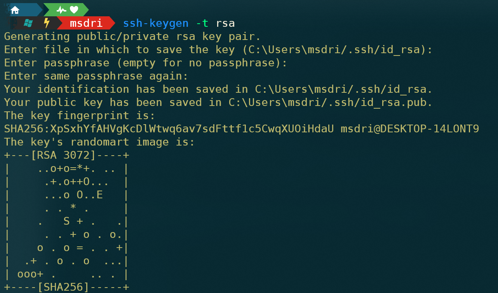

# 一 CMD命令


##  1. 目录和文件

```bash

cd directory            # 切换目录

d:                      # 切换到 d 盘

```


code 


explore


<br/>


<br/>


# 二 Terminal

Windows 终端概述 ：https://docs.microsoft.com/zh-cn/windows/terminal/


```shell

schemes 数组是用来定义配色方案的。

name ：        这个配色方案的 ID 。
background ：  背景颜色。
foreground ：  输出显示字体颜色，ssh 输入命令颜色。
black ：       箭头左边三角，git 目录的 .git 目录下提示箭头背景提示文字。
red ：         ssh 后 vim 打开文本文件已输入行普通字符显示文字。
green ：       git 目录的 .git 目录下提示箭头背景提示。
yellow ：      git 目录的分支箭头背景提示。
blue ：        目录箭头本体。
purple ：      ssh 后 vim 等工具打开文件后的 { 和 }等符号本体，git 更新完后显示的分支箭头背景提示。
cyan ：        引号及内部字符。
white ：       未知。
brightBlack ： cd 等 命令后面的 .. 和 * 等特殊符号，以及命令参数字符颜色。
brightRed ：   系统提示字符颜色：错误的命令，git status 显示。
brightGreen ： ssh 用户权限显示。
brightYellow ：输入的命令字符。
brightBlue ：  ssh 文件夹等高亮显示，ssh 目录，vim 打开文本文件未输入行 ~ 字符显示。
brightPurple ：未知。
brightCyan ：  ssh vim 等工具打开文件后的 { 和 } 等符号背景。
brightWhite ： 目录箭头左边和中间的提示文字。

"cursorColor": 光标颜色

```


<br/>


## 1. 安装gsudo

gsudo：管理员打开工具

GitHub：https://github.com/gerardog/gsudo

<br/>

```shell
# 安装方式：

1. Github下载msi格式，安装即可，或下载zip格式，解压配置环境变量即可

https://github.com/gerardog/gsudo/releases/tag/v1.2.0


2. 通过 PowerShell 命令安装

winget install gsudo

```


Windows terminal默认是非管理员打开的，安装 gsudo 后 在powershell 或cmd设置项下将命令行改为

```shell
gsudo.exe powershell.exe -nologo  #或

gsudo.exe cmd.exe 
```

`-nologo`  参数作用是去掉启动时前面那一串版权声明等信息, 可以不加

如果不想要默认管理员打开, 上面命令行处可以不改, 在需要管理员权限的命令前加上sudo再运行就可以, 跟Linux一样


<br/>


## 2. 添加GitBash

从设置  `打开JSON文件` ，在 ` "profiles" --> "defaults"  -->  "list"` 中添加新的配置：

```JSON
"profiles": 
{
    "defaults": {},
    "list": 
    [
        {
            "guid": "{b453ae62-4e3d-5e58-b989-0a998ec441b7}",
            "hidden": false,
            "name": "Git Bash",
            "commandline": "gsudo \"C:\\Program Files\\Git\\bin\\bash.exe\"",
            "colorScheme":"One Half Dark",
            "icon": "C:\\Program Files\\Git\\mingw64\\share\\git\\git-for-windows.ico"
        }

    ]
}
```

 

注意： commandline 中 需要的是git安装目录下的  bin 下的 bash.exe，而不是 Git-Bash.exe


<br/>


## 3. 毛玻璃特效

下载字体：https://github.com/microsoft/cascadia-code/releases

解压后安装所有 ttf 字体 （为所有用户安装）


修改 JSON 文件：

```JSON
{
    "commandline": "gsudo.exe powershell.exe -nologo",
    // "commandline": "powershell.exe",
    "guid": "{61c54bbd-c2c6-5271-96e7-009a87ff44bf}",
    "hidden": false,
    "name": "Windows PowerShell",
    // 添加如下内容
    "acrylicOpacity": 0.7,
    "colorScheme" : "Frost",
    "cursorColor" : "#000000",
    "fontFace" : "Cascadia Code PL",
    "useAcrylic": true
}
```


<br/>


## 4. Oh-My-Posh

官方文档和介绍：

https://ohmyposh.dev/docs/windows

https://www.powershellgallery.com/packages/oh-my-posh

<br/>


**安装字体**：

自定义命令提示符通常使用字形（图形符号）来设置提示符的样式。若要在终端中查看所有字形，

建议安装 [Nerd Font](https://www.nerdfonts.com/font-downloads)，进入网站，点击 Downloads 进入下载页面，随便下载一款字体，

推荐使用 **DejaVuSansMono Nerd Font** 或者 **Cousine Nerd Font**，这两款字体比较全，适配也还不错。

下载后解压安装字体即可

<br/>


**安装 oh-my-posh** ： 

以管理员方式打开 PowerShell  （注意网络不好可能会安装失败）

```shell
winget install JanDeDobbeleer.OhMyPosh
```


<br/>

```shell

# 初始化 （只对当前打开的终端生效）

oh-my-posh init pwsh --config "E:\Package\Other\Terminal\oh-my-posh\themes\jandedobbeleer.omp.json" | Invoke-Expression

```

<br/>

```shell
# 配置永久生效 

code $profile   

# 该命令会使用VScode打开文件，将上述初始化命令加入其中即可 （配置后每次打开Powershell都会执行脚本文件中的命令）

```

<br/>

```shell

# 命令行自动补全和提示

Set-PSReadlineKeyHandler -Key Tab -Function MenuComplete

```

<br/ >

最后设置一下字体和配色即可（修改JSON或在terminal界面中直接设置）：

```json 
"fontFace" : "DejaVuSansMono Nerd Font",
```

<br/>


```shell

# 常用提示符主题

honukai.omp.json

iterm2.omp.json

bubbles.omp.json

bubblesline.omp.json

capr4n.omp.json

cloud-native-azure.omp.json

di4am0nd.omp.json

grandpa-style.omp.json

hunk.omp.json

microverse-power.omp.json

# COOL

free-ukraine.omp.json

jv_sitecorian.omp.json

```

更多选择参照：https://ohmyposh.dev/docs/themes


<br/>


# 三 PowerShell

官网下载： https://docs.microsoft.com/zh-cn/powershell/scripting/install/installing-powershell-on-windows

GitHub：https://github.com/PowerShell/PowerShell/releases/


<br>


## 1. SSH

使用SSH连接到远程服务器，前提是服务器已安装并启用SSH服务

```shell

# 命令格式：ssh username@hostip 如：

ssh root@192.168.5.150          # 输入密码即可

```

<br>

**利用WindowsTerminal实现ssh免密自动登陆**：


```bash

# 一、在本地生成SSH密钥对
#  powershell中输入以下命令，根据提示设置密钥保存路径、密钥密码（默认为空），
#    建议按默认设置，一直按回车成功生成密钥文件，生成的密钥文件共有两个，
#    ssh_key对应私钥可存储在本地，ssh_key.pub对应公钥需要放在到远程服务器

ssh-keygen -t rsa

```


<br/>

```bash

# 二、在远程主机安装公钥
# 1.在本地上传公钥文件

sftp username@ip # 回车输入密码
sftp> put 本地公钥文件 远程路径(默认为用户家目录)


sftp itdrizzle@192.168.5.150                                                        pwsh
itdrizzle@192.168.5.150's password:
Connected to 192.168.5.150.
sftp> put C:\Users\msdri\.ssh\id_rsa.pub /home/itdrizzle/.ssh/
Uploading C:/Users/msdri/.ssh/id_rsa.pub to /home/itdrizzle/.ssh/id_rsa.pub
C:/Users/msdri/.ssh/id_rsa.pub                                   100%  576   562.5KB/s   00:00


```


<br>


```bash

# 2.连接到远程主机，修改密钥及所在文件夹权限

mkdir -m 700 ~/.ssh        #如此文件夹已存在，也要确保权限为700

chmod 600 id_rsa.pub       #cd 密钥.pub所在目录，然后设置其权限

sudo mv ~/.ssh/id_rsa.pub ~/.ssh/authorized_key_from_mywindows


# 三、在远程主机打开密钥登陆功能 (编辑sshd配置文件)

sudo vim /etc/ssh/sshd_config


RSAAuthentication yes
PubkeyAuthentication yes
AuthorizedKeysFile .ssh/authorized_key_from_mywindows
PermitRootLogin yes
PasswordAuthentication no #此行会关闭密码登录功能，请确认密钥登陆功能设置好后再添加

# 以上内容在配置文件里都有对应行，但被注释了起来，可通过删除注释符号设置，也可直接追加到文件末尾


# 3.重启sshd

systemctl restart sshd


# 四、设置WindowsTerminal SSH快捷键
# 在WindowsTerminal配置文件里增加内容，复制完之后更改配置如下，主要必须更改如下参数，其余按需修改

ssh -i D:\WorkPlace\IOS\kali-linux-2021.1-vmware-amd64.vmwarevm\ssh_key root@192.168.110.120

# 重启窗口打开即可使用（无需输入密码）

```


<br/>

##  2. new-guid


