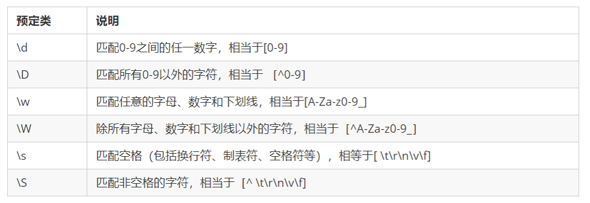

**【注】此处ES6泛指ES6（ES5）之后所有版本的新特性**   

# 一 ES6基础语法
[ECMAScript2015~2020语法全解析](http://es.xiecheng.live/)
## 1. 变量及解构赋值

|关键字| 类型 | 定义 | 可变性 | 作用域
| :---: | :---:| :---: | :---: | :---:|
|var| 变量（旧） | 可以重复定义 | 不能限制修改 | 函数级作用域|
|let| 变量|不能重复定义|可以修改|块级作用域|
|const|常量|不能重复定义|不可修改|块级作用域|

```javascript
// 解构赋值:
// 两边结构必须一样 
let [a,b,c]=[33,21,45];        //数组
let {a,b,c]={a:12,b:33,c:22};  //json

```
**【小结】**

- 解构赋值就是把数据结构分解，然后给变量进行赋值
- 如果结构不成功，变量跟数值个数不匹配的时候，变量的值为undefined
- 数组解构用中括号包裹，多个变量用逗号隔开，对象解构用花括号包裹，多个变量用逗号隔开
- 利用解构赋值能够让我们方便的去取对象中的属性跟方法

**剩余参数**

剩余参数语法允许我们将一个不定数量的参数表示为一个数组，不定参数定义方式，这种方式很方便的去声明不知道参数情况下的一个函数

```javascript
function sum (first, ...args) {
     console.log(first); // 10
     console.log(args); // [20, 30] 
 }
 sum(10, 20, 30)

```

**剩余参数和解构配合使用**

```javascript
let students = ['wangwu', 'zhangsan', 'lisi'];
let [s1, ...s2] = students; 
console.log(s1);  // 'wangwu' 
console.log(s2);  // ['zhangsan', 'lisi']

```


## 2. 函数及参数展开
**（1）箭头函数** （简化，修正this）
```javascript
function() { }  //常规写法
() => { }       //箭头函数

//箭头函数：
// 表达式在右侧
let sum = (a, b) => a + b;  //省略return

// 或带 {...} 的多行语法，此处需要 return：
let sum = (a, b) => {
  // ...
  return a + b;
}

// 没有参数
let sayHi = () => alert("Hello");

// 有一个参数
let double = n => n * 2;  //省略括号和return
```


**（2）参数展开**
```javascript
//作为函数形参时：
function show(a, b , ...args){
    console.log(a, b, args)      
}
show(11,2,3,43,22,41,6,8,44,66,33) // 11 2 [3, 43, 22, 41, 6, 8, 44, 66, 33]

//作为函数实参时：
let arr1 = [12, 33, 21]
function print(a, b, c){
    console.log(a, b, c)
}
print(...arr1)              // 12 33 21

// 数组替换场景
let arr2 = [2, 4, 61]
let arr = [...arr1, ...arr2] // 本质上就是简单的替换
console.log(arr)             //[12, 33, 21, 2, 4, 61]

//对象中同样可以应用
let json1 = {a: 11, b: 33, c: 66}
let json2 = {...json1, d: 88}
console.log(json2)      //{a: 11, b: 33, c: 66, d: 88}
```

## 3. 迭代（ES5）

|  运算符  |                                         描述                                         |
| :-----: | ------------------------------------------------------------------------------------ |
|   map   | 映射：一 一对应，如：[56, 45, 76, 88, 99, 38] => [不及格，不及格，及格，及格，及格，不及格] |
| reduce  | n => 1, 如：sum(1, 2, 3) => 6                                                         |
| filter  | 过滤                                                                                 |
| forEach | 遍历                                                                                 |

**（1）map**
```javascript
let arr = [56, 45, 76, 88, 99, 38] 
let arr1 = arr.map(function(item){
    if (item >= 60){
        return "及格"
    }else{
        return "不及格"
    }
})
console.log(arr)
console.log(arr1)  // ["不及格", "不及格", "及格", "及格", "及格", "不及格"]
```

**（2）reduce**

```javascript
let average = arr.reduce((tmp, item, index)=>{
    if (index == arr.length - 1){  //数组共6个数，执行5次
        return (tmp + item) / arr.length
    }else{
        return tmp + item
    }
})
console.log(average)  //67
```
**（3）filter**
```javascript
//filter
arr = [56, 45, 76, 88, 99, 38] 
let arr2 = arr.filter((item)=>{  //过滤掉奇数
    return (item % 2 == 1) ? false : true    //可简写为 return item % 2 == 0
})
console.log(arr2)  //[56, 76, 88, 38]
```
**（4）forEach**
```javascript
let arr = [56, 45, 76, 88, 99, 38] 
arr.forEach((item, index)=>{
    console.log(`第${index}个：值为：${item}`)  // 第0个：值为：56   第1个：值为：45   ......
})  //使用了模板字符串，反单引号 ` `
```

## 4. JSON和数组
**（1）json和字符串的相互转换**
```javascript
// JSON 序列化（JSON->string） 和 解序列化(string->JSON)
let json = {name: "Bob", age: 16, sex: "male"}
console.log(json)                      //{ name: 'Bob', age: 16, sex: 'male' }
console.log(JSON.stringify(json))      //{"name":"Bob","age":16,"sex":"male"}

let str = '{"name":"Bob","age":16,"sex":"male"}'
console.log(JSON.parse(str))           // 等于 json
```

**（2）伪数组转换为数组**

```javascript
let oDivs = document.getElementsByTagName('div'); 
oDivs = [...oDivs];
```
Array.from() 将伪数组或可遍历对象转换为真正的数组

```javascript
//定义一个集合
let arrayLike = {
    '0': 'a',
    '1': 'b',
    '2': 'c',
    length: 3
}; 
//转成数组
let arr2 = Array.from(arrayLike); // ['a', 'b', 'c']
```

方法还可以接受第二个参数，作用类似于数组的map方法，用来对每个元素进行处理，将处理后的值放入返回的数组

```javascript
 let arrayLike = { 
     "0": 1,
     "1": 2,
     "length": 2
 }
 let newAry = Array.from(arrayLike, item => item *2)//[2,4]

```

**（3）其他数组方法**
find() 用于找出第一个符合条件的数组成员，如果没有找到返回undefined

```javascript
let ary = [{
     id: 1,
     name: '张三'
 }, { 
     id: 2,
     name: '李四'
 }]; 
 let target = ary.find((item, index) => item.id == 2);//找数组里面符合条件的值，当数组中元素id等于2的查找出来，注意，只会匹配第一个

```

findIndex() 用于找出第一个符合条件的数组成员的位置，如果没有找到返回-1

```javascript
let ary = [1, 5, 10, 15];
let index = ary.findIndex((value, index) => value > 9); 
console.log(index); // 2
```

includes()  判断某个数组是否包含给定的值，返回布尔值。

```javascript
[1, 2, 3].includes(2) // true 
[1, 2, 3].includes(4) // false

```


## 5. 类和对象
```js
//以下代码是对对象的复习，es6之前的对象
//字面量创建对象
var ldh = {
    name: '刘德华',
    age: 18
}
console.log(ldh);

//构造函数创建对象
  function Star(name, age) {
    this.name = name;
    this.age = age;
 }
var ldh = new Star('刘德华', 18)//实例化对象
console.log(ldh);	
```

- 在 ES6 中新增加了类的概念，可以使用 class 关键字声明一个类，之后以这个类来实例化对象。


1. 语法:

```js
//步骤1 使用class关键字
class name {
  // class body
}     
//步骤2使用定义的类创建实例  注意new关键字
var xx = new name();     
```

2. 示例

```js
 // 1. 创建类 class  创建一个 明星类
 class Star {
   // 类的共有属性放到 constructor 里面
   constructor(name, age) {
   this.name = name;
   this.age = age;
   }
 }
   // 2. 利用类创建对象 new
   var ldh = new Star('刘德华', 18);
   console.log(ldh);
```

**类创建添加属性和方法**

```js
 // 1. 创建类 class  创建一个类
class Star {
    // 类的共有属性放到 constructor 里面 constructor是 构造器或者构造函数
    constructor(uname, age) {
      this.uname = uname;
      this.age = age;
    }//------------------------------------------->注意,方法与方法之间不需要添加逗号
    sing(song) {
      console.log(this.uname + '唱' + song);
    }
}
// 2. 利用类创建对象 new
var ldh = new Star('刘德华', 18);
console.log(ldh); // Star {uname: "刘德华", age: 18}
ldh.sing('冰雨'); // 刘德华唱冰雨
```

**注意:**

1. 通过class 关键字创建类, 类名我们还是习惯性定义首字母大写
2. 类里面有个constructor 函数,可以接受传递过来的参数,同时返回实例对象
3. constructor 函数 只要 new 生成实例时,就会自动调用这个函数, 如果我们不写这个函数,类也会自动生成这个函数
4. 多个函数方法之间不需要添加逗号分隔
5. 生成实例 new 不能省略
6. 语法规范, 创建类 类名后面不要加小括号,生成实例 类名后面加小括号, 构造函数不需要加function


**类的继承**

1. 语法

```js
// 父类
class Father{   
} 

// 子类继承父类
class  Son  extends Father {  
}       
```

2. 示例

```js
class Father {
      constructor(surname) {
        this.surname= surname;
      }
      say() {
        console.log('你的姓是' + this.surname);
       }
}

class Son extends Father{  // 这样子类就继承了父类的属性和方法
}
var damao= new Son('刘');
damao.say();      //结果为 你的姓是刘
```

- 子类使用super关键字访问父类的方法

```js
  //定义了父类
  class Father {
     constructor(x, y) {
     this.x = x;
     this.y = y;
     }
     sum() {
     console.log(this.x + this.y);
  	}
   }
  //子元素继承父类
      class Son extends Father {
     		 constructor(x, y) {
      		super(x, y); //使用super调用了父类中的构造函数
      	}
      }
      var son = new Son(1, 2);
      son.sum(); //结果为3
```

  **注意:** 

  1. 继承中,如果实例化子类输出一个方法,先看子类有没有这个方法,如果有就先执行子类的

  2. 继承中,如果子类里面没有,就去查找父类有没有这个方法,如果有,就执行父类的这个方法(就近原则)

  3. 如果子类想要继承父类的方法,同时在自己内部扩展自己的方法,利用super 调用父类的构造函数,super 必须在子类this之前调用

```js
      // 父类有加法方法
      class Father {
        constructor(x, y) {
        this.x = x;
        this.y = y;
        }
        sum() {
        console.log(this.x + this.y);
        }
      }
      // 子类继承父类加法方法 同时 扩展减法方法
      class Son extends Father {
        constructor(x, y) {
        // 利用super 调用父类的构造函数 super 必须在子类this之前调用,放到this之后会报错
        super(x, y);
        this.x = x;
        this.y = y;

       }
       subtract() {
       console.log(this.x - this.y);
       }
     }
     var son = new Son(5, 3);
     son.subtract(); //2
     son.sum();//8
```


# 二 正则表达式
## 1. 创建及使用
在 JavaScript 中，可以通过两种方式创建一个正则表达式。

方式一：通过调用RegExp对象的构造函数创建 

```js
var regexp = new RegExp(/123/);
console.log(regexp);
```

方式二：利用字面量创建 正则表达式

```js
 var rg = /123/;
```


test() 正则对象方法，用于检测字符串是否符合该规则，该对象会返回 true 或 false，其参数是测试字符串。

```js
var rg = /123/;
console.log(rg.test(123));//匹配字符中是否出现123  出现结果为true
console.log(rg.test('abc'));//匹配字符中是否出现123 未出现结果为false
```


## 2. 特殊字符

- 特殊字符也被称为**元字符**，在正则表达式中是具有特殊意义的专用符号，如 ^ 、$ 、+ 等。

参考： [MDN](https://developer.mozilla.org/zh-CN/docs/Web/JavaScript/Guide/Regular_Expressions)

jQuery 手册：正则表达式部分

[正则测试工具]( http://tool.oschina.net/regex)


1. 大括号  量词符.  里面表示重复次数
2. 中括号 字符集合。匹配方括号中的任意字符. 
3. 小括号表示优先级


**（1）边界符**

正则表达式中的边界符（位置符）用来提示字符所处的位置，主要有两个字符

| 边界符  | 说明              |
| ---- | --------------- |
| ^    | 表示匹配行首的文本（以谁开始） |
| $    | 表示匹配行尾的文本（以谁结束） |

如果 ^和 $ 在一起，表示必须是精确匹配。

```js
var rg = /abc/; // 正则表达式里面不需要加引号 不管是数字型还是字符串型
// /abc/ 只要包含有abc这个字符串返回的都是true
console.log(rg.test('abc'));
console.log(rg.test('abcd'));
console.log(rg.test('aabcd'));
console.log('---------------------------');
var reg = /^abc/;
console.log(reg.test('abc')); // true
console.log(reg.test('abcd')); // true
console.log(reg.test('aabcd')); // false
console.log('---------------------------');
var reg1 = /^abc$/; // 精确匹配 要求必须是 abc字符串才符合规范
console.log(reg1.test('abc')); // true
console.log(reg1.test('abcd')); // false
console.log(reg1.test('aabcd')); // false
console.log(reg1.test('abcabc')); // false
```


**（2）字符类**
字符类表示有一系列字符可供选择，只要匹配其中一个就可以了。所有可供选择的字符都放在方括号内。

**2.1 方括号
**
表示有一系列字符可供选择，只要匹配其中一个就可以了

```js
var rg = /[abc]/; // 只要包含有a 或者 包含有b 或者包含有c 都返回为true
console.log(rg.test('andy'));//true
console.log(rg.test('baby'));//true
console.log(rg.test('color'));//true
console.log(rg.test('red'));//false
var rg1 = /^[abc]$/; // 三选一 只有是a 或者是 b  或者是c 这三个字母才返回 true
console.log(rg1.test('aa'));//false
console.log(rg1.test('a'));//true
console.log(rg1.test('b'));//true
console.log(rg1.test('c'));//true
console.log(rg1.test('abc'));//true
----------------------------------------------------------------------------------
var reg = /^[a-z]$/ //26个英文字母任何一个字母返回 true  - 表示的是a 到z 的范围  
console.log(reg.test('a'));//true
console.log(reg.test('z'));//true
console.log(reg.test('A'));//false
-----------------------------------------------------------------------------------
//字符组合
var reg1 = /^[a-zA-Z0-9]$/; // 26个英文字母(大写和小写都可以)任何一个字母返回 true  
------------------------------------------------------------------------------------
//取反 方括号内部加上 ^ 表示取反，只要包含方括号内的字符，都返回 false 。
var reg2 = /^[^a-zA-Z0-9]$/;
console.log(reg2.test('a'));//false
console.log(reg2.test('B'));//false
console.log(reg2.test(8));//false
console.log(reg2.test('!'));//true
```

 **2.2 量词符**

量词符用来设定某个模式出现的次数。

| 量词  |      说明      |
| ----- | ------------- |
| *     | 重复0次或更多次 |
| +     | 重复1次或更多次 |
| ?     | 重复0次或1次    |
| {n}   | 重复n次        |
| {n,}  | 重复n次或更多次 |
| {n,m} | 重复n到m次     |


**（3）预定义类**
预定义类指的是某些常见模式的简写方式.


**验证座机号码**

```js
var reg = /^\d{3}-\d{8}|\d{4}-\d{7}$/;
var reg = /^\d{3,4}-\d{7,8}$/;
```


## 3. 正则替换

replace() 方法可以实现替换字符串操作，用来替换的参数可以是一个字符串或是一个正则表达式。

```js
var str = 'andy和red';
var newStr = str.replace('andy', 'baby');
console.log(newStr)//baby和red
//等同于 此处的andy可以写在正则表达式内
var newStr2 = str.replace(/andy/, 'baby');
console.log(newStr2)//baby和red
//全部替换
var str = 'abcabc'
var nStr = str.replace(/a/,'哈哈')
console.log(nStr) //哈哈bcabc
//全部替换g
var nStr = str.replace(/a/a,'哈哈')
console.log(nStr) //哈哈bc哈哈bc
//忽略大小写i
var str = 'aAbcAba';
var newStr = str.replace(/a/gi,'哈哈')//"哈哈哈哈bc哈哈b哈哈"
```

**案例:过滤敏感词汇**

```js
<textarea name="" id="message"></textarea> <button>提交</button>
<div></div>
<script>
    var text = document.querySelector('textarea');
    var btn = document.querySelector('button');
    var div = document.querySelector('div');
    btn.onclick = function() {
    	div.innerHTML = text.value.replace(/激情|gay/g, '**');
    }
</script>
```


# 三 异步编程

## 1. 回调函数

```javascript
const fs = require('fs');

fs.readFile('./1.txt', 'utf8', (err, result1) => {
	console.log(result1)
	fs.readFile('./2.txt', 'utf8', (err, result2) => {
		console.log(result2)
		fs.readFile('./3.txt', 'utf8', (err, result3) => {
			console.log(result3)
		})
	})
});
```


## 2. promise


```javascript
const fs = require('fs');

function p1 () {
	return new Promise ((resolve, reject) => {
		fs.readFile('./1.txt', 'utf8', (err, result) => {
			resolve(result)
		})
	});
}

function p2 () {
	return new Promise ((resolve, reject) => {
		fs.readFile('./2.txt', 'utf8', (err, result) => {
			resolve(result)
		})
	});
}

function p3 () {
	return new Promise ((resolve, reject) => {
		fs.readFile('./3.txt', 'utf8', (err, result) => {
			resolve(result)
		})
	});
}

p1().then((r1)=> {
	console.log(r1);
	return p2();
})
.then((r2)=> {
	console.log(r2);
	return p3();
})
.then((r3) => {
	console.log(r3)
})

```


## 3. async/await


```javascript
const fs = require('fs');
// 改造现有异步函数api 让其返回promise对象 从而支持异步函数语法
const promisify = require('util').promisify;
// 调用promisify方法改造现有异步API 让其返回promise对象
const readFile = promisify(fs.readFile);

async function run () {
	let r1 = await readFile('./1.txt', 'utf8')
	let r2 = await readFile('./2.txt', 'utf8')
	let r3 = await readFile('./3.txt', 'utf8')
	console.log(r1)
	console.log(r2)
	console.log(r3)
}

run();

```


