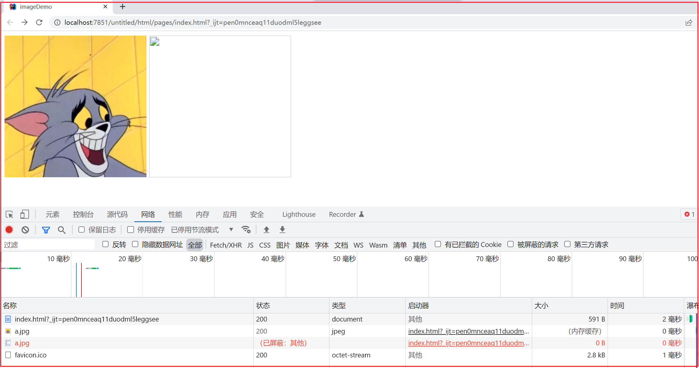
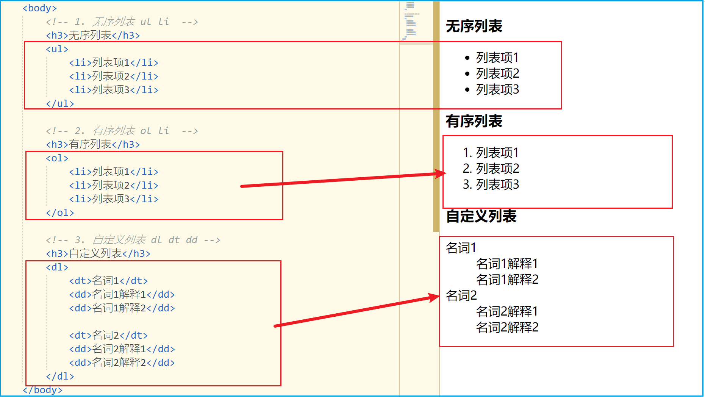
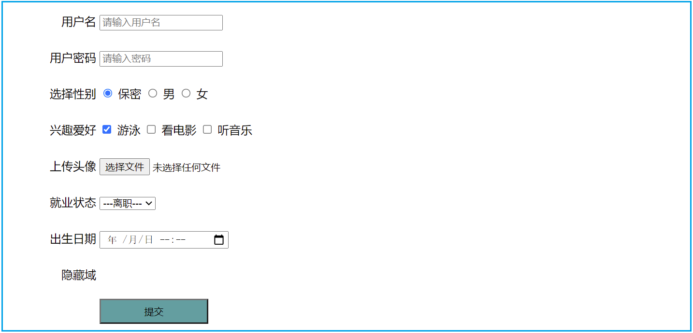
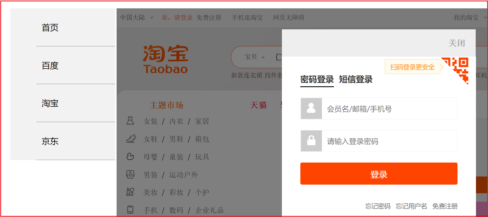

# 一 WEB和HTML

```HTML
互联网三要素:
      http :  用来表示资源在网络上传输的方式
      url :(统一资源定位符)  在网络上找到某个资源
      HTML : 资源的格式
```

<br/>

## 1. 网页和浏览器

```
网页主要由文字、图像和超链接等元素构成。当然，除了这些元素，网页中还可以包含音频、视频以及Flash等。
```

```
浏览器是网页显示、运行的平台，常用的浏览器有IE、火狐（Firefox）、谷歌（Chrome）、Safari和Opera等。我们平时称为五大浏览器。
```
浏览器占有的市场份额、查看网站： <a href="http://tongji.baidu.com/data/browser" target="_blank">http://tongji.baidu.com/data/browser </a>

常见浏览器内核（了解）：**内核（Rendering Engine）**也叫排版引擎、解释引擎、渲染引擎，现在流行称为浏览器内核.
```
负责读取网页内容，整理讯息，计算网页的显示方式并显示页面.
```
<br/>

现在主要流行的浏览器及其内核就是下面几个：

| 浏览器  |      内核      | 备注                                                         |
| :------ | :------------: | :----------------------------------------------------------- |
| IE      |    Trident     | IE、猎豹安全、360极速浏览器、百度浏览器                      |
| firefox |     Gecko      | 可惜这几年已经没落了，打开速度慢、升级频繁、猪一样的队友flash、神一样的对手chrome。 |
| Safari  |     webkit     | 现在很多人错误地把 webkit 叫做 chrome内核（即使 chrome内核已经是 blink 了）。苹果哭晕在厕所...... |
| chrome  | Chromium/Blink | 在 Chromium 项目中研发 Blink 渲染引擎（即浏览器核心），内置于 Chrome 浏览器之中。Blink 其实是 WebKit 的分支。大部分国产浏览器最新版都采用Blink内核进行二次开发 |
| Opera   |     Presto     | Presto（已经废弃） 是挪威产浏览器 opera 的 "前任" 内核，为何说是 "前任"，因为最新的 opera 浏览器早已将之抛弃从而投入到了谷歌怀抱了。  现在用blink内核。 |

**拓展：** 

- 移动端的浏览器内核主要说的是系统内置浏览器的内核
- Android手机而言，使用率最高的就是Webkit内核，大部分国产浏览器宣称的自己的内核，基本上也是属于webkit二次开发
- iOS以及WP7平台上，由于系统原因，系统大部分自带浏览器内核，一般是Safari或者IE内核Trident

<br/>


## 2. Web标准

**为什么要遵循WEB标准呢？**  因为浏览器的内核不同，他们渲染或者排版的模式就有些许差异，显示就会有差别。

**Web 标准的好处**：
*1*、让Web的发展前景更广阔 
*2*、内容能被更广泛的设备访问
*3*、更容易被搜寻引擎搜索
*4*、降低网站流量费用
*5*、使网站更易于维护
*6*、提高页面浏览速度

**Web 标准构成**： 主要包括结构（Structure）、表现（Presentation）和行为（Behavior）三个方面。

* 结构标准（HTML）：对网页元素进行整理和分类

* 表现标准（CSS）：设置网页元素的版式、颜色、大小等外观样式

* 行为标准（JavaScript）：网页模型的定义及交互的编写

  

**拓展：** [五大主流浏览器内核的源起以及国内各大浏览器内核总结](http://blog.csdn.net/summer_15/article/details/71249203)  

<br/>


## 3. HTML初识

- HTML 指的是超文本标记语言 (**H**yper **T**ext **M**arkup **L**anguage)是用来描述网页的一种语言。
- HTML 不是一种编程语言，而是一种标记语言 (markup language)
- 标记语言是一套标记标签 (markup tag)

**所谓超文本，有2层含义：** 

1. 因为它可以加入图片、声音、动画、多媒体等内容（**超越文本限制 **）
2. 不仅如此，它还可以从一个文件跳转到另一个文件，与世界各地主机的文件连接（**超级链接文本 **）。

<br/>

**HTML元素标签分类**： 1. 常规元素（双标签） 2. 空元素（单标签）

```html
<!-- 常规元素（双标签）：
1. <标签名> 表示该标签的作用开始，一般称为 开始标签（start tag）
2. </标签名> 表示该标签的作用结束，一般称为“结束标签（end tag）
3. 和开始标签相比，结束标签只是在前面加了一个关闭符 “/”、我们以后接触的基本都是双标签  比如 ：--> 
<body>something...</body>

<!-- 空元素： 用单标签来表示，简单点说，就是里面不需要包含内容  如：-->
<br />
```

<br/>

**html骨架标签**：

| 标签名              |   定义   | 说明                             |
| ---------------- | :----: | :----------------------------- |
| html    | HTML标签 | 页面中最大的标签，我们成为  根标签             |
| head | 文档的头部  | 注意在head标签中我们必须要设置的标签是title     |
| titile | 文档的标题  | 让页面拥有一个属于自己的网页标题               |
| body    | 文档的主体  | 元素包含文档的所有内容，页面内容 基本都是放到body里面的 |

<br/>

 **HTML的基本结构**： 

```HTML
<!DOCTYPE html>
<html>
	<head>
		<!-- head头元素：用于于指定HTML中的一些元数据、引入外部的资源文件等-->
		<meta charset="utf-8" />
		<title>hello</title>
	</head>
	<body>
		<!-- 主体：浏览器显示的内容 -->
        <!-- 标签属性：由键值对组成，值需要用双引号引起来，多个属性用空格隔开 如： -->
		<p id="p1" name="p1">段落</p> 
		hello html
	</body>
</html>
```

<br/>


# 二 HTML常用标签

## 1. div和span

div和span标签 是没有语义的， 但确是网页布局主要使用的2个盒子，两个都是盒子，用来 '装' 网页元素， 但他们也有区别：

- div （division） ：即分割， 分区的意思 、div标签通常用来布局，一行只能放一个div
- span： 跨度，跨距；范围、span标签也用来布局，但一行上可以放好多个span

这两个标签主要配合CSS使用，单独使用并没有太大意义。

<br/>


## 2. 文本标签

- 标题标签 h1- h6  （Header ）

- 段落标签 p （paragraph ）

- 换行标签 br （break）

- 水平线标签 hr （Horizontal Rule）

- 文本格式化标签 `<strong> , <sup> , <sub> , <i>` 等 

  


<br/>


## 3. 图片和链接

- 图片标签 img（image）：
- 超链接和锚链接  a （anchor ）：

```html
<body>
    <!-- src:本地文件一般使用相对路径 , 绝对路径用（如：`D:\web\img\logo.gif`）的较少，
				但要注意，它的写法 特别是符号 \ , 并不是 相对路径的 /, 
		而且这里包含盘符的绝对路径的html文件只在本地能加载这张图片，一旦将网页部署到服务器，再访问时就不能加载这张图片了，
		详细过程见下面的说明
	-->

	<!--  title：鼠标放在图片上的提示信息 -->
    
    <hr />
    
    <!-- 超链接 -->
    <a href="https://www.baidu.com" target="_blank">百度一下</a>
    <br />
    <a href="../index.html">回到首页</a>

    <!-- 锚链接: 
        1. 先在name.html文件自定义一个锚点：<a name="test">目标处</a> 标签
        2. 定义以下跳转链接 : -->
    <a href="name.html#test" target="_self">去test锚点处</a>
</body>
```

- href	指定链接目标的url地址，（必须属性）当为标签应用href属性时，它就具有了超链接的功能
- target	指定链接页面的打开方式，其取值有 `_self` 和` _blank`两种，其中`_self`为默认值，`_blank`为在新窗口中打开方式
- 当没有确定链接目标时，通常将链接标签的href属性值定义为`#`(即`href="#"`)，表示该链接暂时为一个空链接

<br/>


**【路径问题说明】**: 

```java
/*
java中的路径:
       相对路径: 相对于文件的位置 (./   ../   ../../  )
       绝对路径: 以盘符开头(C:\index.html)
           
前端的路径:
       相对路径:  相对于文件的位置 (./   ../   ../../  )
       绝对路径:  是一个url （带盘符的那种意味着要加载客户端文件，这是极不安全的行为，浏览器不会允许）
       	并且, 即使我们写的是相对路径, 这个相对路径的代码被浏览器解析的时候(前端代码都是给用户的浏览器解析的), 
       	也会拼接变成一个url(变成绝对路径)
```

<br/>

从 IDEA 打开下列html文件，到浏览器查看效果，模拟将网页部署到服务器的情形：

```html
<!DOCTYPE html>
<html lang="en">
<head>
    <meta charset="UTF-8">
    <title>imageDemo</title>
</head>
    <body>
        
        
    </body>
</html>
```

<br/>



<br/>

看看两个文件的请求：


<br/>


## 4. 列表标签

**1. 无序列表 **： ul（Unordered List）无序列表、 li（List Item）列表项目

```html
<ul>
  <li>列表项1</li>
  <li>列表项2</li>
  <li>列表项3</li>
  ......
</ul>
```

<br/>

**2. 有序列表**： ol（Ordered List）有序列表、  li（List Item）列表项目

```html
<ol>
  <li>列表项1</li>
  <li>列表项2</li>
  <li>列表项3</li>
  ......
</ol>
```

<br/>

**3. 自定义列表**：dl（Definition List ）定义列表、 dt（Definition Term）定义术语、 dd（Definition Description）定义描述 

```html
<dl>
  <dt>名词1</dt>
  <dd>名词1解释1</dd>
  <dd>名词1解释2</dd>
  ...
  <dt>名词2</dt>
  <dd>名词2解释1</dd>
  <dd>名词2解释2</dd>
  ...
</dl>
```



<br/>


## 5. 表格标签

| 标签名             | 定义           | 说明                                         |
| ------------------ | :------------- | :------------------------------------------- |
| table              | 表格标签       | 就是一个四方的盒子                           |
| tr（table row）    | 表格行标签     | 行标签要再table标签内部才有意义              |
| td（table data）   | 单元格标签     | 单元格标签是个容器级元素，可以放任何东西     |
| th（table header） | 表头单元格标签 | 它还是一个单元格，但是里面的文字会居中且加粗 |
| caption            | 表格标题标签   | 表格的标题，跟着表格一起走，和表格居中对齐   |
| clospan 和 rowspan | 合并属性       | 用来合并单元格的                             |

- 表格中由行中的单元格组成
- 表格中没有列元素，列的个数取决于行的单元格个数

**表格属性**： 

| 属性名      | 含义                                       | 常用属性值或单位      |
| ----------- | ------------------------------------------ | --------------------- |
| border      | 表格的边框（默认 `border="0"` 、即无边框） | 像素值                |
| cellspacing | 单元格与单元格之间的空白间距               | 像素值（默认为2像素） |
| cellpadding | 单元格与单元格内容之间的空白间距           | 像素值（默认为1像素） |
| width       | 表格的整体宽度（非单元格属性）             | 像素值                |
| height      | 表格的整体高度（非单元格属性）             | 像素值                |
| align       | 表格在网页中的对齐方式                     | left、center、right   |

**表格划分结构** ：

对于比较复杂的表格，可以将表格分割成三个部分：题头（thead）、正文（tbody）和脚注（tfoot）

- thead：用于定义表格的头部。用来放标题之类的东西。`<thead>`内部必须拥有 `<tr>` 标签
- tbody：用于定义表格的主体。放数据本体 
- tfoot：放表格的脚注之类

需要注意的是，表格的这种逻辑分区方式在没有样式的时候是看不出什么变化的


```HTML
<table border="1" cellspacing="0" cellpadding="20" align="center" width="600" >
    <caption>我是表格标题</caption>
    <thead>
        <tr>  <th>姓名</th>  <th>性别</th> <th>年龄</th>  </tr>
    </thead>
    <tbody>
        <tr>  <td>郭靖</td>   <td>男</td> <td>26</td>  </tr>
        <tr>  <td>黄药师</td> <td>男</td> <td>52</td>  </tr>
        <tr>  <td>黄蓉</td>   <td>女</td> <td>25</td>  </tr>
        <tr>  <td>欧阳锋</td> <td>男</td> <td>56</td>  </tr>
        <tr>  <td>梅超风</td> <td>女</td> <td>32</td>  </tr>
    </tbody>
    <tfoot>
        <!-- <tr>  <td>梅超风</td> <td>女</td> <td>32</td>  </tr> -->
    </tfoot>
</table>
```


注：

- 我们经常有个说法：`三参为0`， 即 `border  cellpadding  cellspacing ` 为 0，由css控制样式
- 表格有部分属性我们不常用，重点记住 cellspacing 、 cellpadding （上述案例在没用css的情形下只将cellspacing 设置为0）
- 表格标题caption：标题必须紧随 table 标签之后，它会被居中且显示于表格之上，这个标签只存在 表格里面才有意义
- 表头单元格标签th：th 也是一个单元格   只不过和普通的 td单元格不一样，它会让自己里面的文字居中且加粗

<br/>

**合并单元格**：

* 跨行合并：rowspan="合并单元格的个数"      
* 跨列合并：colspan="合并单元格的个数"
* 合并的顺序：从上到下、  从左到右 
* 合并单元格步骤：
  * 先确定是跨行还是跨列合并
  * 根据从上到下、  从左到右的顺序找到目标单元格    然后写上合并方式以及要合并的单元格数量 
  * 删除多余的单元格 

```HTML
<table border="1" cellspacing="0" cellpadding="20" align="center" width="600" >
    <tr>  <th>T1</th>             <th>T2</th>              <th>T3</th>  </tr>
    <tr>  <td>11</td>             <td colspan="2">12</td>               </tr>
    <tr>  <td rowspan="2">21</td> <td>22</td>              <td>23</td>  </tr>
    <tr>                          <td>32</td>              <td>33</td>  </tr>
</table>
```


<br/>


## 6. 表单标签

```java
< form >: 用来向后端发起请求提交数据
      
form属性:
   action:  用来标记要生成的url除了参数那一部分
        	form表单可以根据用户输入点击提交产生一个url交给浏览器, 发起一个请求
  
   method: 请求方式: get  post 区别
       1, get请求, 一般把参数拼接到url之后
          post请求, 一般把参数放到'请求正文'里
       2, get请求不安全
          post请求相对更安全
       3, 语义化区别
             get: 请求一般用来获取数据 （分享链接时，别人可以直接访问到那个页面，post请求的方式则不能）
             post: 一般用来提交数据
       4, url之后参数最多1kb（意味着get请求所能传输的数据是有限的，虽然这种情形几乎不可能发生）
                 
```

<br/>

表单用于采集用户输入的数据、并和服务器进行交互，主要有 form、input、label 等

| form标签的属性 | 属性值   | 作用                                             |
| -------------- | :------- | ------------------------------------------------ |
| action         | url地址  | 用于指定接收并处理表单数据的服务器程序的url地址  |
| method         | get/post | 用于设置表单数据的提交方式，其取值为get或post    |
| name           | 表单名称 | 用于指定表单的名称，以区分同一个页面中的多个表单 |

```html
<form action="url地址" method="提交方式" name="表单名称">
   <!--各种表单控件 如: input -->
</form>
```

| input标签的属性 | 说明     | 作用                                                   |
| --------------- | :------- | ------------------------------------------------------ |
| type            | 表单类型 | 用来指定不同的控件类型（默认 `type="text"`）           |
| value           | 表单值   | 表单里面默认显示的文本                                 |
| name            | 表单名字 | 页面中的表单很多，name主要作用就是用于区别不同的表单。 |
| checked         | 默认选中 | 表示某个单选或者复选按钮一开始就被选中了               |
| placeholder     | 提示文字 | 文本框中显示的文字，用户输入时消失                     |

<br/>

**label 标签**： 为 input 定义标注（标签）、用于绑定一个表单元素, 当点击label标签的时候, 被绑定的表单元素就会获得输入焦点

```html
<!-- 第一种用法就是用label直接包括input表单 -->
<label> 用户名： <input type="text" name="usename" value="root"> </label>

<!-- 第二种用法 for 属性规定 label 与哪个表单元素绑定 -->
<label for="sex">男</label>
<input type="radio" name="sex"  id="sex">
```

<br/>


表单示例：


```html
<form action="#" method="post" name="demo" enctype="multipart/form-data">
	<!-- 1. 文本框 -->
	<div class="item">
		<label for="username">用户名</label>
		<input type="text" id="username" name="username" placeholder="请输入用户名"/>
	</div>

	<!-- 2. 密码框 -->
	<div class="item">
		<label for="password">用户密码</label>
		<input type="text" id="password" name="password" placeholder="请输入密码"/>
	</div>
	
	<!-- 3. 单选按钮 -->
	<div class="item">
		<label>选择性别</label>
		<input type="radio" name="gender" value="保密" checked/> 保密 
		<input type="radio" name="gender" value="男" /> 男
		<input type="radio" name="gender" value="女" /> 女
	</div>
	
	<!-- 4. 复选框 -->
	<div class="item">
		<label>兴趣爱好</label>
		<input type="checkbox" name="hobby" value="swim" checked/> 游泳 
		<input type="checkbox" name="hobby" value="movie" /> 看电影
		<input type="checkbox" name="hobby" value="music" /> 听音乐
	</div>
	
	<!-- 5. 上传文件 (form表单中最好添加属性 enctype="multipart/form-data" )-->
	<div class="item">
		<label>上传头像</label>
		<input type="file" name="avatar" multiple/>
	</div> 
	
	<!-- 6. 下拉列表 select -->
	<div class="item">
		<label>就业状态</label>
		<select name="statue">
			<option value="0"> ---离职--- </option>
			<option value="1"> ---在职--- </option>
			<option value="2"> ---其他--- </option>
		</select>
	</div>
	
	<!-- 日期（H5新特性） -->
	<div class="item">
		<label for="birthday">出生日期</label>
		<input type="datetime-local" id="birthday" name="birthday" />
	</div>
	
	<!-- 隐藏域 -->
	<div class="item">
		<label for="userid">隐藏域</label>
		<input type="hidden" id="userid" name="userid" value="1001"/>
	</div>

	<!-- 提交按钮 -->
	<div class="item submit">
		<label></label>
		<input type="submit" value="提交" class="submit_btn">
	</div>
</form>
```



<br/>


**按钮**： `<input type="按钮类型" value="按钮上的文字" /> `    

- `type="submit"`: 提交按钮，提交到form的action的指定路径

- `type="image"`: 等价于提交按钮，只是没有value属性，多了一个src="按钮的图片
- `type="reset"`: 清空表单中的所有用户输入，回到默认原始状态，相当于刷新了页面
- `type="button"`: 普通按钮，没有任何功能，只是有按钮的长相而已

```HTML
<input type="button" value="普通按钮" /> 
<input type="submit" value="提交按钮" />
<input type="reset" value="重置按钮" />
<input type="image" src="../img/a.png" />
```


<br/>

按钮除了指定 input 标签的type外，还有一个专用的标签 button ：

```HTML
<button type="button">普通按钮</button>
<button type="submit">提交按钮</button>
<button type="reset">重置按钮</button>
```

<br/>


**文本域： textarea**： 

```html
<!-- rows: 行数  cols: 列数  readonly: 只读（不能输入） disabled：不可用（颜色呈灰色） -->
<textarea rows="12" cols="60" readonly disabled>
    1. abcd......
    2. abcd......
</textarea>
```

<br/>


## 7. HTML框架

通过使用框架，你可以在同一个浏览器窗口中显示不止一个页面（每份HTML文档称为一个框架）

```html
<iframe name="content" src="../index.html" width="500" height="600"></iframe>
```

<br/>

例：使用 a 标签的 target 属性和 iframe 的name属性实现下图效果：



<br/>

```html
<!DOCTYPE html>
<html lang="en">
<head>
    <meta charset="UTF-8">
    <title>page3</title>
    <style>
        .container {
            width: 1200px;
            height: 700px;
            /*background: blueviolet;*/
            margin: 0 auto;
            padding-top: 30px;
        }
        .left {
            float: left;
            margin-top: 1px;
            width: 200px;
            background-color: #f2f2f2;
        }
        .right {
            float: right;
            width: 998px;
            height: 700px;
            padding-left: 2px;
            /*background-color: blue;*/
        }

        a {
            text-decoration: none;
            display: block;
            border-bottom: 1px solid gray;
            margin-left: 50px;
            padding: 25px 10px;
            color: black;
        }

        a:hover {
            color: blueviolet;
        }

        iframe {
            border: 1px solid #f2f2f2;
        }

    </style>
</head>
<body>

<div class="container">
    <div class="left">
        <a href="page1.html" target="homepage">首页</a>
        <a href="https:www.baidu.com" target="homepage" >百度</a>
        <a href="https:www.taobao.com" target="homepage">淘宝</a>
        <a href="https:www.jd.com" target="homepage">京东</a>
    </div>

    <div class="right">
        <iframe height="700px" width="1000px" name="homepage" frameborder="0"></iframe>
    </div>

</div>

</body>
</html>
```


<br/>


## 8. 转义字符

 HTML 中不能使用 `小于号 < 和 大于号 > `，浏览器会将它们作为标签解析，还有一些其他特殊符号，在html 里面很难或者不方便直接使用， 但可以使用下面的替代代码：

| 转义符号  |              描述               |
| :------: | ------------------------------ |
| `&nbsp;` | 空格                            |
|  `&lt;`  | 小于符号 <                      |
|  `&le;`  | 小于等于 ≤，<= 可以用`&lt;=`表示 |
|  `&gt;`  | 大于符号 >                      |
|  `&ge;`  | 大于等于 ≥，>= 可以用`&gt;=`表示 |
| `&copy;` | 版权符号 ©                      |

<br/>


# 三 HTML5标签

## 1. 语义化标签
新增语义化标签
```HTML
< header>:   头部标签
<nav>:       导航标签
< article>:  内容标签
< section>:  块级标签
< aside>:    侧边栏标签
< footer>:   尾部标签
```

**注意：**
- 这种语义化标准主要针对搜索引的
- 这些新标签页面中可以使用多次的
- 在E9中,需要把这些元素转换为块级元素
- 移动端更喜欢使用这些标签

<br/>


## 2. 多媒体标签
**① 音频 audio**
```HTML
<audio controls="controls">
  <source src="song.ogg" type="audio/ogg">
  <source src="song.mp3" type="audio/mpeg">
Your browser does not support the audio tag.
</audio>
```
<table class="dataintable"> 
  <tbody><tr>
    <th style="width:20%;">属性</th>
    <th style="width:16%;">值</th>
    <th>描述</th>
  </tr>
  <tr>
    <td class="html5_new"><a href="/tags/att_audio_autoplay.asp" title="HTML5 <audio> autoplay 属性">autoplay</a></td>
    <td>autoplay</td>
    <td>如果出现该属性，则音频在就绪后马上播放。</td>
  </tr>
  <tr>
    <td class="html5_new"><a href="/tags/att_audio_controls.asp" title="HTML5 <audio> controls 属性">controls</a></td>
    <td>controls</td>
    <td>如果出现该属性，则向用户显示控件，比如播放按钮。</td>
  </tr>
    <tr>
    <td class="html5_new"><a href="/tags/att_audio_loop.asp" title="HTML5 <audio> loop 属性">loop</a></td>
    <td>loop</td>
    <td>如果出现该属性，则每当音频结束时重新开始播放。</td>
  </tr>
  <tr>
    <td class="html5_new"><a href="/tags/att_audio_preload.asp" title="HTML5 <audio> preload 属性">preload</a></td>
    <td>preload</td>
    <td>如果出现该属性，则音频在页面加载时进行加载，并预备播放如果使用 "autoplay"，则忽略该属性。</td>
  </tr>
  <tr>
    <td class="html5_new"><a href="/tags/att_audio_src.asp" title="HTML5 <audio> src 属性">src</a></td>
    <td><i>url</i></td>
    <td>要播放的音频的 URL。</td>
  </tr>
</tbody></table>

**② 视频**
```HTML
<video src="movie.ogg" controls="controls"></video>

<video width="320" height="240" autoplay="autoplay" muted="muted" loop="loop"> <!-- 静音播放 -->
  <source src="movie.ogg" type="video/ogg">
  <source src="movie.mp4" type="video/mp4">
Your browser does not support the video tag.
</video>
```

<br/>


# 四 标签英文全称

常用HTML标签的英文全称及简单描述：

| HTML标签  | 英文全称                  | 中文释义                       |
| --------- | ------------------------- | ------------------------------ |
| a         | Anchor                    | 锚                             |
| alt       | alter                     | 替用(一般是图片显示不出的提示) |
| b         | Bold                      | 粗体（文本）                   |
| bdo       | Direction of Text Display | 文本显示方向                   |
| br        | Break                     | 换行                           |
| center    | Centered                  | 居中（文本）                   |
| cite      | Citation                  | 引用                           |
| code      | Code                      | 源代码（文本）                 |
| dd        | Definition Description    | 定义描述                       |
| del       | Deleted                   | 删除（的文本）                 |
| dfn       | Defines a Definition Term | 定义定义条目                   |
| div       | Division                  | 分隔                           |
| dl        | Definition List           | 定义列表                       |
| dt        | Definition Term           | 定义术语                       |
| em        | Emphasized                | 加重（文本）                   |
| font      | Font                      | 字体                           |
| h1~h6     | Header 1 to Header 6      | 标题1到标题6                   |
| hr        | Horizontal Rule           | 水平尺                         |
| href      | hypertext reference       | 超文本引用                     |
| i         | Italic                    | 斜体（文本）                   |
| iframe    | Inline frame              | 定义内联框架                   |
| ins       | Inserted                  | 插入（的文本）                 |
| kbd       | Keyboard                  | 键盘（文本）                   |
| li        | List Item                 | 列表项目                       |
| nl        | navigation lists          | 导航列表                       |
| ol        | Ordered List              | 排序列表                       |
| optgroup  | Option group              | 定义选项组                     |
| p         | Paragraph                 | 段落                           |
| pre       | Preformatted              | 预定义格式（文本 ）            |
| q         | Quotation                 | 引用语                         |
| rel       | Reload                    | 加载                           |
| s/ strike | Strikethrough             | 删除线                         |
| samp      | Sample                    | 示例（文本                     |
| small     | Small                     | 变小（文本）                   |
| span      | Span                      | 范围                           |
| src       | Source                    | 源文件链接                     |
| strong    | Strong                    | 加重（文本）                   |
| sub       | Subscripted               | 下标（文本）                   |
| sup       | Superscripted             | 上标（文本）                   |
| td        | table data cell           | 表格中的一个单元格             |
| th        | table header cell         | 表格中的表头                   |
| tr        | table row                 | 表格中的一行                   |
| tt        | Teletype                  | 打印机（文本）                 |
| u         | Underlined                | 下划线（文本）                 |
| ul        | Unordered List            | 不排序列表                     |
| var       | Variable                  | 变量（文本）                   |

