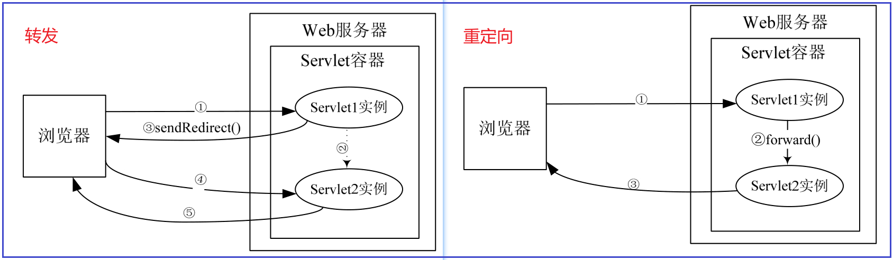

# 一 环境准备

## 1. HTTP协议

超文本传输协议（英文：HyperText Transfer Protocol，缩写：HTTP）是⼀种⽤于分布式、协作式和 超媒体信息系统的**应用层协议** 

（TCP/UDP为运输层协议）

HTTP 请求/响应的步骤：

1.  客户端（浏览器）连接到Web服务器：与Web服务器的HTTP端⼝（默认为80）建立⼀个TCP Socket连接

2.  发送HTTP请求：客户端通过socket向Web服务器发送⼀个请求报文（由请求行、请求头部、 空⾏和请求数据4部分组成）

3.  服务器接受请求并返回HTTP响应：Web服务器解析请求、同样通过socket响应数据到客户端

4.  释放TCP连接：

   在HTTP/1.0中默认使⽤短连接（每次HTTP操作均建立一次连接、任务结束就中断连接）

   从HTTP/1.1起，默认使用长连接，用以保持一段时间的连接

   HTTP协议的长连接和短连接，实质上是TCP协议的长连接和短连接 

5. 客户端浏览器解析HTML内容：客户端浏览器读取响应数据HTML，根据HTML的语法 对其进行格式化，并在浏览器窗口中显示

   客户端浏览器⾸先解析状态行，查看表明请求是否成功的状态代码

   然后解析每⼀个响应头，响应头告 知以下为若干字节的HTML文档和文档的字符集

   

| HTTP请求方法 | 描述                                                         |
| ------------ | ------------------------------------------------------------ |
| GET          | 向指定的资源发出“显示”请求、使用GET方法应该只用在读取数据    |
| HEAD         | 同上、但只获取其中“关于该资源的信息”（元信息或称元数据）     |
| POST         | 向指定资源提交数据，请求服务器进行处理（例如提交表单或者上传⽂件） |
| PUT          | 向指定资源位置上传其最新内容                                 |
| DELETE       | 请求服务器删除 Request-URI 所标识的资源                      |
| TRACE        | 回显服务器收到的请求，主要⽤于测试或诊断                     |
| OPTIONS      | 使服务器传回该资源所⽀持的所有HTTP请求⽅法                   |


## 2. Web服务器

常见的两种开发模型：

- C/S（Client/Server）客户/服务器模式：客户端 需要安装专⽤的客户端软件
- B/S（Brower/Server）：建立在广域网的基础上

Web服务器是运⾏及发布Web应⽤的容器，只有将开发的Web项⽬放置到该容器中，才能使⽹络中的所 有⽤户通过浏览器进⾏访问

开发Java Web应⽤所采⽤的服务器主要是与JSP/Servlet兼容的Web服务 器，⽐较常⽤的有Tomcat、Resin、JBoss、WebSphere 和 WebLogic 等

| Web服务器 | 简介                                                         |
| --------- | ------------------------------------------------------------ |
| Tomcat    | ⼀个⼩型、轻量级的⽀持JSP和Servlet 技术的Web服务器（最流⾏、开发JSP应⽤的⾸选） |
| Resin     | Resin是Caucho公司的产品，是⼀个⾮常流⾏的⽀持Servlet和JSP的服务器、速度⾮常快 |
| JBoss     | 纯Java的EJB服务器、不包含Servlet和JSP的 Web容器，不过它可以和Tomcat完美结合 |
| WebSphere | 是IBM公司的产品，有多个系列，其中WebSphere Application Server 是基于Java 的应⽤环境 |
| WebLogic  | WebLogic 是BEA公司的产品（现在已经被Oracle收购）、同样有多个系列。<br />WebLogic ⽀持企业级的、多层次的和完全分布式的Web应⽤，并且服务器的配置简单、界⾯友好 |


## 3. Tomcat配置

开源⼩型web服务器 ，完全免费，主要⽤于中⼩型web项⽬。常用版本：8.5 和 9.0、 官网：https://tomcat.apache.org/  

启动之前首先安装JDK并配置环境变量`JAVA_HOME`，

若希望Tomcat服务器可以在任意路径启动， 则需要配置环境变量`CATALINA_HOME` 


Tomcat的⽬录简介： （ 通过url访问服务器示例: http://localhost:8080 ）

- bin：该⽬录下存放的是⼆进制可执⾏⽂件（Windows下可通过该目录下的startup.bat启动Tomcat）

- conf：配置文件的⽬录、这个⽬录下有四个很重要的⽂件：

  - `server.xml`：配置整个服务器信息（主要的配置文件）
  - `tomcat-users.xml`：存储tomcat⽤户的⽂件
  - `web.xml`：部署描述符⽂件
  - `context.xml`：对所有应⽤的统⼀配置（通常我们不会去配置它）

- lib：Tomcat的类库（⾥⾯是⼀⼤堆jar⽂件）

- logs：⽇志⽂件目录，记录了Tomcat启动和关闭的信息

- temp：存放Tomcat的临时⽂件

- webapps：存放web项⽬的⽬录，每个⽂件夹都是⼀个项⽬

  其中ROOT是⼀个特殊的项⽬，在地址栏中没有给出项⽬⽬录时，对 应的就是ROOT项⽬

- work：运⾏时⽣成的⽂件，最终运⾏的⽂件都在这⾥（通过webapps中的项⽬⽣成）


```xml
<!-- Windows下启动信息乱码的处理方式： 在conf文件夹下的logging.properties文件修改如下语句： 
	此方法可以让其在cmd窗口中不乱码，但很可能与idea的utf8冲突，导致idea中启动Tomcat乱码...
	故而不推荐修改，使用默认的UTF-8即可
-->
java.util.logging.ConsoleHandler.encoding = GBK  （UTF-8）
```

```xml
<!-- server.xml 常用配置： 端口、协议等 -->
<Connector port="8888" protocol="HTTP/1.1" connectionTimeout="20000" redirectPort="8443" />
```

```xml
<!-- tomcat-users.xml文件用来配置管理Tomcat服务器的用户与权限 -->
<role rolename="manager-gui"/> 
<user username="admin" password="123456" roles="manager-gui"/>
```


# 二 Servlet

## 1. Servlet简介

 Servlet（Server Applet）全称Java Servlet （ Java服务器端程序 ）、主要功能在于：交互式地浏览和修改数据，⽣成动态Web内容

- 狭义的Servlet是指Java语⾔实现的⼀个接⼝
- ⼴义的Servlet 是指任何实现了这个Servlet接⼝的类（⼀般情况下，⼈们将Servlet理解为后者）


## 2. Servlet使用步骤

- 建立一个JavaWeb Application项目并配置Tomcat服务器

- 自定义类 `实现Servlet接口` 或 `继承HttpServlet类并重写service方法`（推荐后者）

  ```java
  @WebServlet(name = "LoginServlet", value = "/LoginServlet")
  public class LoginServlet extends HttpServlet {
      @Override
      protected void doGet(HttpServletRequest request, HttpServletResponse response) 
          throws ServletException, IOException {
          doPost(request, response);
      }
  
      @Override
      protected void doPost(HttpServletRequest request, HttpServletResponse response) 
          throws ServletException, IOException {
          response.setContentType("text/html;charset=utf-8");
  
          String username = request.getParameter("username");
          String password = request.getParameter("password");
          System.out.println(username);
          System.out.println(password);
  
          List<User> users = UserDao.login(new User(username, password));
          if(users.size() > 0){
              request.getRequestDispatcher("success.html").forward(request, response);
          }else {
              request.getRequestDispatcher("fail.html").forward(request, response);
          }
      }
  }
  ```

- 配置访问路径：使用注解（如上） 或 将自定义类的信息配置到 `web.xml` 文件并启动项目，配置方式如下所示：

  ```xml
  <!--    servlet相关配置-->
  <servlet>
     <servlet-name>helloServlet</servlet-name>
     <servlet-class>com.demo.HelloServlet</servlet-class>
  </servlet>
  <!--  配置浏览器访问方式  -->
  <servlet-mapping>
     <servlet-name>helloServlet</servlet-name>
     <url-pattern>/hello</url-pattern>
  </servlet-mapping>
  ```

- 启动Tomcat、浏览器上访问的路径为：`http://localhost:8080/工程路径/url-pattern的内容`   


Request和Response的乱码问题： （ *在service中使用的编码解码方式默认为：ISO-8859-1编码* ）

```java
// Request乱码问题的解决方法
request.setCharacterEncoding("UTF-8");                             // 解决post提交方式的乱码
String name = request.getParameter("name");                        // 接收到get请求的中文字符串 
parameter = newString(name.getbytes("iso8859-1"),"utf-8");         // 将字符重新编码，默认编码为ISO-8859-1 

// Response的乱码问题(解决方式一)
response.setCharacterEncoding("utf-8");  // 设置HttpServletResponse使用 utf-8 编码
response.setHeader("Content-Type", "text/html;charset=utf-8");  // 通知浏览器使用 utf-8 解码

// Response的乱码问题(解决方式二)
response.setContentType("text/html;charset=utf-8");
```


## 3. 请求和响应

当客户请求到来时，Servlet容器创建一个ServletRequest对象，封装请求数据，同时创建一个ServletResponse对象，封装响应数据

**javax.servlet.ServletRequest** 接口主要用于：向servlet提供客户端请求信息，从中获取到请求信息 

**javax.servlet.ServletResponse**接口用于定义一个对象来帮助Servlet向客户端发送响应  

| ServletRequest接口常用方法                                   | 说明                                                  |
| ------------------------------------------------------------ | ----------------------------------------------------- |
| `String getParameter(String name)`                           | 以字符串形式返回请求参数的值                          |
| `public String[] getParameterValues(String name)`            | 返回请求中name参数所有的值                            |
| `public void setAttribute(String name,Object o)`             | 保存名字为name的属性                                  |
| `public void removeAttribute(String name)`                   | 移除请求中名字为name的属性                            |
| `public void setCharacterEncoding(String env)`               | 设置字符编码（解决post提交方式的乱码）                |
| `public RequestDispatcher getRequestDispatcher(String path)` | 返回RequestDispatcher对象，作为path所定位的资源的封装 |

| ServletResponse接口常用方法                        | 说明                                                    |
| -------------------------------------------------- | ------------------------------------------------------- |
| `public ServletOutputStream getOutputStream()`     | 返回ServletOutputStream对象，用于在响应中写入二进制数据 |
| `public PrintWriter getWriter()`                   | 返回PrintWriter对象，用于发送字符文本到客户端           |
| `public void setCharacterEncoding(String charset)` | 设置发送到客户端的响应的字符编码                        |
| `public void setContentType(String type)`          | 设置发送到客户端响应的内容类型                          |


**javax.servlet.http.HttpServletRequest**接口是ServletRequest接口的子接口，主要用于提供HTTP请求信息的功能

**javax.servlet.ServletResponse**接口用于定义一个对象来帮助Servlet向客户端发送响应 

| HttpServletRequest接口常用方法              | 说明                                                         |
| ------------------------------------------- | ------------------------------------------------------------ |
| `public Cookie[] getCookies()`              | 返回客户端在此次请求中发送的所有Cookie对象                   |
| `public voidaddCookie(Cookie cookie) `      | 添加一个Cookie到响应中                                       |
| `public HttpSession getSession()`           | 返回和此次请求相关联的Session，如果没有给客户端分配Session，<br />则创建一个新的Session |
| `public void sendRedirect(String location)` | 发送一个临时的重定向响应到客户端，让客户端访问新的URL        |


## 4. ServletConfig

Servlet容器使用ServletConfig对象在Servlet初始化期间向它传递配置信息，一个Servlet只有一个ServletConfig对象 

| ServletConfig接口方法                         | 说明                                      |
| --------------------------------------------- | ----------------------------------------- |
| `public String getInitParameter(String name)` | 返回名字为name的初始化参数的值            |
| `public Enumeration getInitParameterNames()`  | 返回Servlet所有初始化参数的名字的枚举集合 |
| `public ServletContext getServletContext()`   | 返回Servlet上下文对象的引用               |
| `public String getServletName()`              | 返回Servlet实例的名字                     |

初始化参数可以在web.xml配置文件或注解中进行配置


## 5. ServletContext

Servlet容器在Web应用程序加载时创建ServletContext对象，在Web应用程序运行时，ServletContext对象可以被Web应用程序中所有的Servlet所访问

获取ServletContext对象的方法：

- 通过ServletConfig对象的 `getServletContext()` 方法来得到ServletContext对象
- 通过GenericServlet类的 `getServletContext()` 方法得到ServletContext对象

GenericServlet类的getServletContext（）也是调用ServletConfig对象的getServletContext（）方法来得到这个对象的。

```java
// Servlet 获取ServletContext对象
protected void doPost(HttpServletRequest req, HttpServletResponse resp) 
    throws ServletException, IOException {
    // 方法一：通过GenericServlet提供的 getServletContext()
    ServletContext servletContext1 = getServletContext();
    
    // 方法二：通过ServletConfig提供的getServletContext()
    ServletContext servletContext2 = getServletConfig().getServletContext();
    
    // 方法三：通过HttpServletRequest获取
    ServletContext servletContext3 = req.getServletContext();
    
    // 方法四：通过HttpSession获取
    ServletContext servletContext = req.getSession().getServletContext();
}   
```

ServletContext属性属于共享属性（任何一个Servlet都可以设置、读取某个属性）， 读取、移除和设置共享属性的方法：

- `public Object getAttribute(String name) ` ：读取名为name的属性
- `public Enumeration getAttributeNames()` ：
- `public voidre moveAttribute(String name)` ：删除名为name的属性
- `public void setAttribute(String name, Object object)` ：设置共享属性

| ServletContext接口常用方法                                   | 说明                          |
| ------------------------------------------------------------ | ----------------------------- |
| `public String getInitParameter(String name)`                | 获取初始化参数                |
| `public RequestDispatcher getRequestDispatcher(String path)` | 返回一个RequestDispatcher对象 |
| `　public RequestDispatcher getNamedDispatcher(String name)` | 同上、但参数为 servlet-name   |


## 6. 转发和重定向

利用RequestDispatcher对象，可以把请求转发给其他的Servlet或JSP页面。在RequestDispatcher接口中定义了两种方法

| RequestDispatcher接口常用方法                                | 说明                                                         |
| ------------------------------------------------------------ | ------------------------------------------------------------ |
| `public void forward(ServletRequest request, ServletResponse response)` | 将请求从一个Servlet传递给服务器上的另外的Servlet、JSP页面或者是HTML文件 |
| `public void include(ServletRequest request,ServletResponse response)` | 在响应中包含其他资源（Servlet、JSP页面或HTML文件）的内容     |


有三种方法可以得到RequestDispatcher对象：

- 一是利用ServletRequest接口中的`getRequestDispatcher()`方法
- 另外两种是利用ServletContext接口中的 `getNamedDispatcher()` 和 `getRequestDispatcher()` 方法

```java
// 1. 利用ServletRequest接口中的getRequestDispatcher()方法
request.getRequestDispatcher("success.html").forward(request, response);

// 2. 利用ServletContext接口
getServletContext().getRequestDispatcher("/index.jsp").forward(request, response);	
```

注意：

- ServletRequest接口中的 `getRequestDispatcher()` 方法的参数不但可以是相对于上下文根的路径，而且可以是相对于当前Servlet的路径、例如：`/myservlet` 和 `myservlet` 都是合法的路径

- ServletContext接口中的 `getRequestDispatcher() ` 方法的参数必须以斜杠（/）开始，被解释为相对于当前上下文根（context root）的路径、例如：`/myservlet` 是合法的路径，而 `../myservlet` 是不合法的路径

  

转发和重定向的区别：



```java
protected void doPost(HttpServletRequest request, HttpServletResponse response) 
    throws ServletException, IOException {
    response.setContentType("text/html;charset=utf-8");
    // 转发
    request.getRequestDispatcher("success.html").forward(request, response);
    // 重定向
    response.sendRedirect("test.html");
}
```


## 7. Cookie和Session

Cookies是一种由服务器发送给客户的片段信息，存储在客户端浏览器的内存中或硬盘上，在客户随后对该服务器的请求中发回它

Cookie的设置和获取：

```java
// 通过HttpServletResponse.addCookie的⽅式设置Cookie
Cookie cookie = new Cookie("jieguo","true");
response.addCookie(cookie);

// 服务端获取客户端携带的cookie：通过HttpServletRequest获取 
Cookie[] cookies = request.getCookies();
if(cookies != null)
    for(Cookie c : cookies){
        String name = c.getName();          // 获取Cookie名称
        if("jieguo".equals(name)){
            String value = c.getValue();    // 获取Cookie的值
            bool = Boolean.valueOf(value);  // 将值转为Boolean类型
        }
    }

// 删除Cookie是指使浏览器不再保存Cookie，使Cookie⽴即失效
Cookie cookie = new Cookie("username", "aaa"); // 创建⼀个name为username的Cookie
cookie.setMaxAge(0);                           // 删除cookie的关键（设置Cookie的有效时间为0）
response.addCookie(cookie);                    // 将有效时间为0的cookie发送给浏览器（达到删除cookie的目的）
```


Session是另⼀种记录客户状态的机制，不同的是Cookie保存在客户端浏览器中，⽽Session保存在服务器上、Session对象是在客户端第⼀次请求服务器的时候创建的

```java
HttpSession session = request.getSession();    // 获取Session对象
session.setAttribute("loginTime", new Date()); // 设置Session中的属性
out.println("登录时间为：" +(Date)session.getAttribute("loginTime")); // 获取Session属性

getMaxInactiveInterval();     // 获取Session的超时时间maxInactiveInterval属性
setMaxInactiveInterval(longinterval);  // 修改Session的超时时间
```

注意：

- 为了获得更⾼的存取速度，服务器⼀般把Session放在内存⾥、每个⽤户都会 有⼀个独⽴的Session

- 如果Session内容过于复杂，当⼤量客户访问服务器时可能会导致内存溢出、因此，Session⾥的信息应该尽量精简
- 为防⽌内存溢出，服务器会把⻓时间内没有活跃的Session从内存删除、这个时间就是Session的超时时间

```xml
<!--Session的超时时间也可以在web.xml中修改(单位是分钟)-->
<session-config> 
 <session-timeout>30</session-timeout>
</session-config>
```


在Servlet规范中，用于会话跟踪的Cookie的名字必须是JSESSIONID


## 8. 监听器和过滤器


## 9. Servlet3.0-注解

Servlet3.0的出现是servlet史上最大的变革，其中的许多新特性大大的简化了web应用的开发，主要新特性有以下几个：

- 引入注解配置
- 支持web模块化开发
- 程序异步处理
- 改进文件上传API
- 非阻塞式IO读取流
- Websocket实时通信

Servlet3.0提供的注解(annotation)，使得不再需要在web.xml文件中进行Servlet的部署描述，简化开发流程

注解配置Servlet 、`@WebServlet` 常⽤属性：

| @WebServlet注解属性 | 类型           | 说明                                                         |
| ------------------- | -------------- | ------------------------------------------------------------ |
| asyncSupported      | boolean        | 指定Servlet是否⽀持异步操作模式                              |
| displayName         | String         | 指定Servlet显示名称                                          |
| initParams          | webInitParam[] | 配置初始化参数                                               |
| loadOnStartup       | int            | 标记容器是否在应⽤启动时就加载这个 Servlet，等价于配置⽂件中的标签 |
| name                | String         | 指定Servlet名称                                              |
| urlPatterns/value   | String[]       | 这两个属性作⽤相同，指定Servlet处理的url                     |

- `loadOnStartup`属性：标记容器是否在启动应⽤时就加载Servlet、默认不配置或数值为负数时表示客户端第⼀次请求Servlet时再加载；0或正数表示启动应⽤就加载，正数情况下，数值越⼩，加载该 Servlet的优先级越⾼

- `name`属性：可以指定也可以不指定，通过getServletName()可以获取到，若不指定，则为Servlet的 完整类名

  如：`cn.edu.UserServlet `

- urlPatterns/value属性： String[]类型，可以配置多个映射、如：`urlPatterns={"/user/test", "/user/example"}`

```java
@WebServlet(name = "myUserServlet", urlPatterns = "/user/test", //斜杠必须
 			loadOnStartup = 1, 
			 initParams = {
                 @WebInitParam(name="name", value="⼩明"),
                 @WebInitParam(name="pwd", value="123456")
             }
)
public class UserServlet extends HttpServlet {
    // ......
}

// 通常只需要设置访问路径即可
@WebServlet("/user/test")
public class UserServlet extends HttpServlet {
    // ......
}
```


# 三 JSP

## 1. JSP简介


## 2. EL标签


## 3. 


# 四 MVC架构

## 1. 


## 2. 


## 3. 


