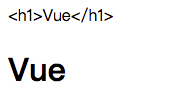

# 一 Vue简介
**MVVM模式**
- Model:模型层，在这里表示JavaScript对象
- View: 视图层，在这里表示DOM (HTML操作的元素)
- ViewModel:连接视图和数据的中间件，Vue.js就是MVVM中的ViewModel层的实现者

`
在MVVM架构中，是不允许数据和视图直接通信的，只能通过ViewModel来通信,而ViewModel就是定义了一个Observer观察者
`

- ViewModel能够观察到数据的变化，并对视图对应的内容进行更新
- ViewModel能够监听到视图的变化，并能够通知数据发生改变
- Vue.js 就是一个MVVM的实现者，他的核心就是实现了DOM监听与数据绑定

<br/>


## 1. 引入Vue

直接下载引入：https://cn.vuejs.org/v2/guide/installation.html 

CDN 引入：

```js
<script src="https://cdn.jsdelivr.net/npm/vue@2.6.14/dist/vue.js"></script>
```

CDN 加速： https://www.bootcdn.cn/

```html
<body>
    <div id="div">
        {{user_name}}
    </div>
</body>

// 两种引入方式，任意选择
<script src="https://cdn.jsdelivr.net/npm/vue@2.5.16/dist/vue.js"></script>
<script src="./vue.js"></script>

<script>
    var app = new Vue({
        el:'#div',  // 设置要操作的元素
        // 要替换的额数据
        data:{
            user_name:'我是一个div' 
        }
    })
</script>
```


<br/>


## 2. Vue实例对象

每个 Vue 应用都是通过用 `Vue` 函数创建一个新的 **Vue 实例** 开始的，其中 el 被Vue 放入了公有属性中，而data 则被放入了 私有属性中，而 data 中的数据，需要被外部使用，于是 Vue 直接将data 中的属性及属性值，直接挂载到 Vue 实例中，也就是说，data中的数据，我们可以直接使用 `app.user_name`  直接调用；
```js
var app = new Vue({
    el:'#div',  // 设置要操作的元素
    // 要替换的额数据
    data:{
        user_name:'我是一个div',
        user:222222
    }
})

console.log(app.user_name);
```

<br/>


## 3. 插值表达式

使用 `{{}}`  获取值的方式，叫做  ***插值***  或  ***插值表达式*** 

数据绑定最常见的形式就是使用“Mustache”语法 (双大括号) 的文本插值：

```html
<span>Message: {{ msg }}</span>
```
```html
<body>
    <div id="div" >
       {{ un > 3 ? '大' : '小'}}
       {{ fun() }}
    </div>
</body>
<script>
    var app = new Vue({
        el:'#div',
        data:{
            un:2,
            fun:()=> {return 1+2}
        }
    })
</script>
```

<br/>


# 二 模板语法-指令

## 1. v-bind 属性绑定

https://cn.vuejs.org/v2/api/#v-bind

可以绑定标签上的任何属性。

**动态绑定图片的路径**

```html

        <!-- 简写形式 -->
<script>
    var vm = new Vue({
        el: '#app',
        data: {
            src: '1.jpg'
        }
    });
</script>
```

<br/>


**绑定a标签上的id**

```html
<a id="app" v-bind:href="'del.php?id=' + id">删除</a>
<script>
	var vm = new Vue({
        el: '#app',
        data: {
            id: 11
        }
    });
</script>
```

<br/>


**绑定class**

对象语法和数组语法

- 对象语法

  如果isActive为true，则返回的结果为 `<div id="app" class="active"></div>`

  ```html
  <div id="app" v-bind:class="{active: isActive}">
      hei
  </div>
  <script>
      var vm = new Vue({
          el: '#app',
          data: {
              isActive: true
          }
      });
  </script>
  ```

- 数组语法

  渲染的结果： `<div id="app" class="active text-danger"></div>`

  ```html
  <div id="app" v-bind:class="[activeClass, dangerClass]">
      hei
  </div>
  <script>
      var vm = new Vue({
          el: '#app',
          data: {
              activeClass: 'active',
              dangerClass: 'text-danger'
          }
      });
  </script>
  ```

<br/>


**绑定style**

对象语法和数组语法

- 对象语法

  渲染的结果： `<div id="app" style="color: red; font-size: 40px;">hei</div>`

  ```html
  <div id="app" v-bind:style="{color: redColor, fontSize: font + 'px'}">
      hei
  </div>
  <script>
      var vm = new Vue({
          el: '#app',
          data: {
              redColor: 'red',
              font: 40
          }
      });
  </script>
  ```

- 数组语法 

  渲染结果：`<div id="app" style="color: red; font-size: 18px;">abc</div>`


  ```html
  <div id="app" v-bind:style="[color, fontSize]">abc</div>
  <script>
      var vm = new Vue({
          el: '#app',
          data: {
              color: {
                  color: 'red'
              },
              fontSize: {
                  'font-size': '18px'
              }
          }
      });
  </script>
  ```

<br/>


**v-bind 简化语法**

```html
<div id="app">
    
    <!-- 缩写 --> 
    
</div>

<script>
    var vm = new Vue({
        el: '#app',
        data: {
            imageSrc: '1.jpg',
        }
    });
</script>
```


<br/>


## 2. v-model 双向数据绑定
**单向数据绑定：**

```html
<div id="div">
    <input type="text" :value="input_val">
</div>

<script>
    var app = new Vue({
        el: '#div',
        data: {
            input_val: 'hello world '
        }
    })
</script>
```

浏览器渲染结果： `<div id="div"><input type="text" value="hello world"></div>`


通过浏览器 REPL 环境可以进行修改 `app.input_val = 'Vue'`  

浏览器渲染结果： `<div id="div"><input type="text" value="Vue"></div>`

<br/>


我们通过 vue 对象修改数据可以直接影响到 DOM 元素，但是，如果直接修改 DOM 元素，却不会影响到 vue 对象的数据；我们把这种现象称为 ***单向数据绑定***  ；


**双向数据绑定 v-model：**

https://cn.vuejs.org/v2/api/#v-model

```html
<div id="div">
    <input type="text" v-model="input_val" >
</div>

<script>
    var app = new Vue({
        el: '#div',
        data: {
            input_val: 'hello world '
        }
    })
</script>
```

通过 v-model 指令展示表单数据，此时就完成了 ***双向数据绑定***  ；

不管 DOM 元素还是 vue 对象，数据的改变都会影响到另一个；


> 注意：数据绑定是目前所有MVVM前端框架的核心特性；甚至可以说，没有数据绑定就不能算是框架；

<br/>


**双向数据绑定的应用范围：**

**文本框 & 文本域**

```html
<div id="div">
    <textarea v-model="inp_val"></textarea>
    <div>{{ inp_val }}</div>
</div>

<script>
    var app = new Vue({
        el: '#div',
        data: {
            inp_val: ''
        }
    })
</script>
```

<br/>


**绑定复选框**

```html
<div id="div">
    吃饭：<input type="checkbox" value="eat" v-model="checklist"><br>
    睡觉：<input type="checkbox" value="sleep" v-model="checklist"><br>
    打豆豆：<input type="checkbox" value="ddd" v-model="checklist"><br>
    {{ checklist }}
</div>

<script>
    var vm = new Vue({
       el: '#div',
        data: {
            checklist: ''
            // checklist: []
        }
    });
</script>
```

<br/>


**绑定单选框**

```html
<div id="app">
    男<input type="radio" name="sex" value="男" v-model="sex">
    女<input type="radio" name="sex" value="女" v-model="sex"> 
    <br>
    {{sex}}
</div>

<script>
    var vm = new Vue({
        el: '#app',
        data: {
            sex: ''
        }
    });
</script>
```

<br/>


**修饰符**

[`.lazy`](https://cn.vuejs.org/v2/guide/forms.html#lazy) - 取代 `input` 监听 `change` 事件

[`.number`](https://cn.vuejs.org/v2/guide/forms.html#number) - 输入字符串转为有效的数字

[`.trim`](https://cn.vuejs.org/v2/guide/forms.html#trim) - 输入首尾空格过滤

```html
<div id="div">
    <input type="text" v-model.lazy="input_val">
    {{input_val}}
</div>

<script>
    var app = new Vue({
        el: '#div',
        data: {
            input_val: 'hello world '
        }
    })
</script>
```

<br/>


## 3. v-on 绑定事件监听

https://cn.vuejs.org/v2/api/#v-on

https://cn.vuejs.org/v2/guide/events.html


**基本使用：**
```html
<div id="app">
    <input type="button" value="按钮" v-on:click="cli">
</div>
<script>
    var vm = new Vue({
        el: '#app',
        data: {
            cli:function(){
                alert('123');
            }
        }
    });
</script>
```

上面的代码运行是没有问题的，但是，我们不建议这样做，因为 data 是专门提供数据的对象，事件触发需要执行的是一段代码，需要的是一个方法 (事件处理程序) ；

修改代码如下：

```html
<div id="app">
    <!-- 使用事件绑定的简写形式 -->
    <input type="button" value="按钮" @click="cli">
</div>
<script>
    var vm = new Vue({
        el: '#app',
        data: {},
        // 将事件处理程序写入methods对象
        methods: {
            cli: function () {
                alert('123');
            }
        }
    });
</script>
```

<br/>


**向事件处理器中传参**

```html
<div id="app">
    <!-- 直接调用传参即可 -->
    <input type="button" value="按钮" @click="cli(1,3)">
</div>
<script>
    var vm = new Vue({
        el: '#app',
        data: {},
        methods: {
            // 接受参数
            cli: function (a,b) {
                alert(a+b);
            }
        }
    });
</script>
```

而此时，如果在处理器中需要使用事件对象，则无法获取，我们可以用特殊变量 `$event` 把它传入方法

`<input type="button" value="按钮" @click="cli(1,3,$event)">`

```js
methods: {
    // 接受参数
    cli: function (a,b,ev) {
        alert(a+b);
        console.log(ev);
    }
}
```

<br/>


**事件修饰符**

原生 JS 代码，想要阻止浏览器的默认行为(a标签跳转、submit提交)，我们要使用事件对象的  `preventDefault()` 方法

```html
<div id="app">
    <a href="http://www.qq.com" id="a">腾百万</a>
</div>
<script>
    document.getElementById('a').onclick = (ev)=>{
        // 组织浏览器的默认行为
        ev.preventDefault();
    }
</script>
```

<br/>


**使用修饰符 阻止浏览器的默认行为**

```html
<div id="app">
    <a href="http://www.qq.com" @click.prevent="cli">腾百万</a>
</div>
<script>
    var vm = new Vue({
        el: '#app',
        data: {},
        // 将事件处理程序写入methods对象
        methods: {
            cli: function () {
                alert('123');
            }
        }
    });
</script>
```

<br/>


**使用修饰符绑定一次性事件**

```html
<div id="app">
    <a href="http://www.qq.com" @click.once="cli($event)">腾百万</a>
</div>
<script>
    var vm = new Vue({
        el: '#app',
        data: {},
        // 将事件处理程序写入methods对象
        methods: {
            cli: function (ev) {
                ev.preventDefault();
                alert('123');
            }
        }
    });
</script>
```

<br/>


**按键修饰符**

绑定键盘抬起事件，但是只有`enter` 键能触发此事件

```html
<div id="app">
    <input type="text"  @keyup.enter="keyup">
</div>
<script>
    var vm = new Vue({
        el: '#app',
        data: {},
        methods: {
            keyup:()=>{
                console.log('111')
            }
        }
    });
</script>
```

<br/>


**系统修饰符**

按住 `shift` 后才能触发点击事件

```html
<div id="app">
    <input type="button" value="按钮" @click.shift="cli">
</div>
<script>
    var vm = new Vue({
        el: '#app',
        data: {},
        methods: {
            cli:()=>{
                console.log('111')
            }
        }
    });
</script>
```

<br/>


**鼠标修饰符**

鼠标中键触发事件

```html
<div id="app">
    <input type="button" value="按钮" @click.middle="cli">
</div>
<script>
    var vm = new Vue({
        el: '#app',
        data: {},
        methods: {
            cli:()=>{
                console.log('111')
            }
        }
    });
</script>
```

<br/>


## 4. v-if 条件判断

https://cn.vuejs.org/v2/api/#v-if

```html
<div id="app">
    <div v-if="type === 'A'">
        A
    </div>
    <div v-else-if="type === 'B'">
        B
    </div>
    <div v-else-if="type === 'C'">
        C
    </div>
    <div v-else>
        Not A/B/C
    </div>
</div>
<script>
    var vm = new Vue({
        el: '#app',
        data: {
            type: 'F'
        },
    })
</script>
```

<br/>


## 5. v-for 循环

https://cn.vuejs.org/v2/api/#v-for

```html
<div id="app">
    <ul>
        <li v-for="(val,key) in arr">{{val}}---{{key}}</li>
    </ul>
    <ul>
        <li v-for="(val,key) in obj">{{val}}---{{key}}</li>
    </ul>
</div>
<script>
    var vm = new Vue({
        el: '#app',
        data: {
            arr: ['a', 'b', 'c'],
            obj: { id: 1, name: '李四' }
        },
    })
</script>
```


<br/>


## 6. v-show 显示隐藏

https://cn.vuejs.org/v2/api/#v-show

根据表达式之真假值，切换元素的 `display` CSS 属性。

```html
<div id="app">
    <p v-show="is_show">Vue</p>
</div>
<script>
    var vm = new Vue({
        el:'#app',
        data:{
            is_show:false
        },
        methods:{},
    })
</script>
```


案例：点击按钮切换隐藏显示

```html
<div id="app">
    <input type="button" value="按钮" @click="isshow">
    <p v-show="is_show">Vue</p>
</div>
<script>
    var vm = new Vue({
        el:'#app',
        data:{
            is_show:false
        },
        methods:{
            isshow:function(){
                this.is_show = !this.is_show;
            }
        },
    })
</script>
```

<br/>


## 7. v-cloak / v-once

https://cn.vuejs.org/v2/api/#v-cloak

和 CSS 规则如 `[v-cloak] { display: none }` 一起用时，这个指令可以隐藏未编译的 Mustache 标签直到实例准备完毕。


```html
<div id="app">
    <p>{{obj.id}}</p>
</div>
<script src="./vue.js"></script>
<script>
    setTimeout(() => {
        var vm = new Vue({
            el: '#app',
            data: {
                arr: ['a', 'b', 'c'],
                obj: { id: 1, name: '李四' }
            },
        })
    }, 2000);
</script>
```

当我们的网络受阻时，或者页面加载完毕而没有初始化得到 vue 实例时，DOM中的 `{{}}` 则会展示出来；

为了防止现象，我们可以使用 CSS 配合 v-cloak 实现获取 VUE 实例前的隐藏；

```html
<style>
    [v-cloak] {
        display: none;
    }
</style>
<div id="app">
    <p v-cloak>{{obj.id}}</p>
</div>
<script src="./vue.js"></script>
<script>
    setTimeout(() => {
        var vm = new Vue({
            el: '#app',
            data: {
                obj: { id: 1, name: '李四' }
            },
        })
    }, 2000);
</script>
```

<br/>


**v-once：**

https://cn.vuejs.org/v2/api/#v-once

只渲染元素和组件**一次**。随后的重新渲染，元素/组件及其所有的子节点将被视为静态内容并跳过

```html
<div id="app">
    <p v-once>{{msg}}</p>
</div>
<script>
    var vm = new Vue({
        el: '#app',
        data: {
            msg:'kkk'
        },
    })
</script>
```

<br/>


## 8. v-text / v-html 文本

https://cn.vuejs.org/v2/api/#v-text

https://cn.vuejs.org/v2/api/#v-html


```html
<body>
    <div id="div" {{class}}>
        <p v-text="seen"></p>
        <p v-html="str_html"></p>
    </div>
</body>
<script>
    var app = new Vue({
        el:'#div',
        data:{
            seen:'<h1>Vue</h1>',
            str_html:'<h1>Vue</h1>',
            class:'dd',
        }
    })
</script>
```



> 注意：
>
> - v-text
>   - v-text和差值表达式的区别
>     - v-text 标签的指令更新整个标签中的内容(替换整个标签包括标签自身)
>     - 差值表达式，可以更新标签中局部的内容
> - v-html
>   - 可以渲染内容中的HTML标签
>   - 尽量避免使用，否则会带来危险(XSS攻击 跨站脚本攻击)

**HTML 属性不能用 `{{}}` 语法**

<br/>


## 9. 自定义指令
**全局自定义指令：**

```html
<div id="app">
    <p v-setcolor>自定义指令的使用</p>
</div>
<script>
    // 注册一个全局自定义指令
    Vue.directive('setcolor', {
        // 当被绑定的元素插入到 DOM 中时……
        inserted: function (el) {
            // 聚焦元素
            el.style.color = 'red';
        }
    })
    var app = new Vue({
        el: '#app',
    })
</script>
```

<br/>


**私有(局部)自定义指令**

```html
<div id="app">
    <p v-setcolor>自定义指令的使用</p>
</div>
<script>
    var app = new Vue({
        el: '#app',
        // 注册 局部(私有)指令
        directives: {
            // 定义指令名称
            setcolor: {
                // 当被绑定的元素插入到 DOM 中时……
                inserted: function (el) {
                    // 聚焦元素
                    el.style.color = 'red';
                }
            }
        }
    })
</script>
```

<br/>


**为自定义指令传值：**

```html
<div id="app">
    <p v-setcolor='colors'>自定义指令的使用</p>
</div>
<script>
    var app = new Vue({
        el: '#app',
        data:{
            colors:'yellow'
        },
        // 注册 局部(私有)指令
        directives: {
            // 定义指令名称
            setcolor: {
                // 自定义指令可以接受第二个参数
                inserted: function (el,val) {
                    // 第二个参数中包含了指令名称、挂载名称及数据键值
                    console.log(val);
                    // 聚焦元素
                    el.style.color = val.value;
                }
            }
        }
    })
</script>
```

<br/>


# 三 Vue其他语法
## 1. computed/watch
**计算属性和侦听器：** https://cn.vuejs.org/v2/guide/computed.html

对于任何复杂逻辑，你都应当使用计算属性。

**计算属性是基于它们的响应式依赖进行缓存的**。只在相关响应式依赖发生改变时它们才会重新求值

```javascript
var vm = new Vue({
  data: { a: 1 },
  computed: {
    // 仅读取
    aDouble: function () {
      return this.a * 2
    },
    // 读取和设置 计算属性默认只有 getter，不过在需要时你也可以提供一个 setter：
    aPlus: {
      get: function () {       //gettter
        return this.a + 1
      },
      set: function (v) {      //setter
        this.a = v - 1
      }
    }
  }
})
vm.aPlus   // => 2
vm.aPlus = 3
vm.a       // => 2
vm.aDouble // => 4
```

**侦听器 watch：**
虽然计算属性在大多数情况下更合适，但有时也需要一个自定义的侦听器。这就是为什么 Vue 通过 watch 选项提供了一个更通用的方法，来响应数据的变化。

**当需要在数据变化时执行异步或开销较大的操作时**，这个方式是最有用的。
使用 watch 选项允许我们执行异步操作 (访问一个 API)，限制我们执行该操作的频率，并在我们得到最终结果前，设置中间状态。这些都是计算属性无法做到的。

<br/>


## 2. 使用ref操作DOM

在Vue中，我们的编程理念发生了变化，变为了数据驱动dom；但有时我们因为某些情况不得不脱离数据操作dom,因此vue为我们提供了 ref 属性获取dom节点；

```html
<div id="app">
    <input type="button" @click='click' value="按钮"> <br>
    <p ref="pv">123</p>
</div>
<script>
    var app = new Vue({
        el: '#app',
        methods: {
            click: function () {
                // 使用原生JS获取dom数据
                // var p = document.getElementsByTagName('p')[0].innerHTML;
                // console.log(p);

                // 使用vue ref 属性获取dom数据
                var d = this.$refs.pv.innerHTML;
                console.log(d);
            }
        }
    })
    console.log(app.$refs);
</script>
```

但是在项目开发中，尽可能不要这样做，因为从一定程度上，ref 违背的mvvm设计原则；

<br/>


## 3. filters-过滤器

**私有(局部)过滤器：**

**定义过滤器**

```js
var app = new Vue({
    el: '#app',
    data:{msg:'UP'},
    //定义过滤器
    filters:{
        // 过滤器的名称及方法
        myFilters:function(val){
            return val.toLowerCase();
        }
    }
})
```

过滤器的使用：

Vue.js 允许你自定义过滤器，可被用于一些常见的文本格式化转义等操作。过滤器可以用在两个地方：**双花括号插值和 v-bind 表达式** (后者从 2.1.0+ 开始支持)。
过滤器要被添加到操作值得后面，使用 管道符 `|` 分割；vue会自动将操作值，以实参的形式传入过滤器的方法中；

`{{msg|myFilters}}`

<br/>


**过滤敏感词汇**

```html
<div id="app">
    <input type="text" v-model="msg"> <br>
    {{msg|myFilters|get3}}
</div>
<script>
    var app = new Vue({
        el: '#app',
        data:{
            msg:''
        },
        //定义过滤器
        filters:{
            // 过滤器的名称及方法
            myFilters:function(val){
                return val.toLowerCase();
            },
            get3:function(val){
                // 遇到数字替换为 0 
                // var reg = /\d/g;
                // return val.replace(reg,0);

                return val.replace('苍井空','***');
            }
        }
    })
</script>
```

<br/>


**全局过滤器：**

上面的代码中，`myFilters` 及 `get3` 两个过滤器，仅在当前 vue 实例中可用；如果在代码 再次 `var app2 = new Vue()`  得到变量为 `app2`  的 vue 实例，则两个过滤器在 app2中都不可用；
如果需要过滤器在所有实例对象中可用，我们需要声明 **全局过滤器**  

` Vue.filter(名称,处理器)`

```html
<div id="app">
    <input type="text" v-model="msg"> <br>
    {{msg|myFilters}}
</div>
<!-- 定义两个DOM节点 -->
<div id="app2">
    <input type="text" v-model="msg"> <br>
    {{msg|myFilters|get3}}
</div>
<script>
    Vue.filter('myFilters', function (val) {
        return val.toLowerCase();
    })
    // 定义两个全局过滤器
    Vue.filter('get3', function (val) {
        return val.replace('苍井空','***');
    })


    // 两个Vue 实例
    var app = new Vue({
        el: '#app',
        data: {
            msg: ''
        }
    })
    var app2 = new Vue({
        el: '#app2',
        data: {
            msg: ''
        }
    })
</script>
```

<br/>


## 4. 异步请求axios

**axios：** 我们在构建应用时需要访问一个 API 并展示其数据。

做这件事的方法有好几种，而使用基于 [**Promise**](https://developer.mozilla.org/zh-CN/docs/Web/JavaScript/Reference/Global_Objects/Promise) 的 HTTP 客户端 [axios](http://www.axios-js.com/zh-cn/docs/) 则是其中非常流行的一种。

```html
<!-- 普通导入方式 -->
<script src="./axios.js"></script>
<script>
    // 获取全部数据
    axios.get('http://localhost:3000/list_data')
    .then((data)=>{console.log(data); });

    // 获取一条数据
    axios.get('http://localhost:3000/list_data/2')
    .then((data)=>{console.log(data);})
    
    // 添加一条数据
    axios.post('http://localhost:3000/list_data',{stat:false,title:'喝水'})
    .then((d)=>{console.log(d);})
    .catch(error => console.log(error))

     // 删除一条数据
     axios.delete('http://localhost:3000/list_data/4')
    .then((d)=>{console.log(d);})
    .catch(error => console.log(error))

     // 修改一条数据
     axios.put('http://localhost:3000/list_data/6',{title:'hhhhhh'})
    .then((d)=>{console.log(d);})
    .catch(error => console.log(error))
</script>
```

<br/>


**Vue项目中使用axios**：

1, 导包或者导入配置文件

```shell
cnpm install axios  --save
```


2, 在mian.js配置

```js
import axios from 'axios'

Vue.prototype.$axios = axios
```


3, 使用

```js
this.$axios.get("http://192.168.2.100:8084/api/mall/getGoodsByType?typeId=1")
    .then(res => {
    // console.log(res.data.data)
    this.list = res.data.data
})

this.$axios.post("http://192.168.2.100:8084/api/mall/addOrder", obj)
    .then(res => {

})
```


<br/>


## 5. 过渡和动画效果
我们可以使用v-if或者v-show控制dom元素的显示和隐藏，在显示和隐藏的过程中，可以加入一些动画效果：

```html
<div id="app">
    <button @click="go">显示/隐藏</button>
    <p v-show="is">pppppp1111</p>
</div>
<script>
    var app = new Vue({
        el: '#app',
        data: {
            isShow: true,
        },
        methods: {
            go() {
                this.isShow = !this.isShow;
            }
        }
    })
</script>
```

在进入/离开的过渡中，会有 6 个 class 切换。

1. `v-enter`：定义进入过渡的开始状态。在元素被插入之前生效，在元素被插入之后的下一帧移除。
2. `v-enter-active`：定义进入过渡生效时的状态。在整个进入过渡的阶段中应用，在元素被插入之前生效，在过渡/动画完成之后移除。这个类可以被用来定义进入过渡的过程时间，延迟和曲线函数。
3. `v-enter-to`: **2.1.8版及以上** 定义进入过渡的结束状态。在元素被插入之后下一帧生效 (与此同时 `v-enter` 被移除)，在过渡/动画完成之后移除。
4. `v-leave`:  定义离开过渡的开始状态。在离开过渡被触发时立刻生效，下一帧被移除。
5. `v-leave-active`：定义离开过渡生效时的状态。在整个离开过渡的阶段中应用，在离开过渡被触发时立刻生效，在过渡/动画完成之后移除。这个类可以被用来定义离开过渡的过程时间，延迟和曲线函数。
6. `v-leave-to`: **2.1.8版及以上** 定义离开过渡的结束状态。在离开过渡被触发之后下一帧生效 (与此同时 `v-leave` 被删除)，在过渡/动画完成之后移除。

对于这些在过渡中切换的类名来说，如果你使用一个没有名字的 `<transition>`，则 `v-` 是这些类名的默认前缀。如果你使用了 `<transition name="my-transition">`，那么 `v-enter` 会替换为 `my-transition-enter`。

<br/>

```html
<style>
    .fade-enter-active,
    .fade-leave-active {
        transition: opacity 1s;
    }

    .fade-enter,
    .fade-leave-to {
        opacity: 0;
    }

    .man-enter-active,
    .man-leave-active {
        transition: opacity 4s;
    }

    .man-enter,
    .man-leave-to {
        opacity: 0;
    }
</style>

<div id="app">
    <button @click="go">显示/隐藏</button>
    <transition name="fade">
        <p v-show="isShow">pppppp1111</p>
    </transition>

    <transition name="man">
        <p v-show="isShow">pppppp222</p>
    </transition>
</div>
<script>
    var app = new Vue({
        el: '#app',
        data: {
            isShow: true,
        },
        methods: {
            go() {
                this.isShow = !this.isShow;
            }
        }
    })
</script>
```

<br/>

这就是Vue中动画及过渡的基本使用方式，因为这些动画效果都需要我们自己写CSS样式，相对比较麻烦，
在项目中，可以借助第三方 CSS 动画库来实现，如：Animate.css 


<br/>


# 四 组件化开发
组件是可复用的 Vue 实例，且带有一个名字。把这个组件作为自定义元素来使用。组件的好处是写一次可以进行任意次数的复用。

<br/>

## 1. 定义和使用

在Vue中所谓组件, 就是Vue对象, 我们可以通过把一个页面拆分成多个Vue对象实现, 拆成多个组件

```html
<div id="app">
    <!-- 使用组件 -->
    <!-- 将组件名直接当做标签名在html代码中使用即可 -->
    <mytemp></mytemp>
    <!-- 组件可以进行任意次数的复用 -->
    <mytemp></mytemp>
</div>
<script>
    // 定义一个名为 mytemp 的新组件
    Vue.component('mytemp',{
        // template属性的值，作为组件的内容
        // vue 会把这个值替换到html中并会被浏览器渲染
        template:"<h2>我是一个组件</h2>"
    })
    var app = new Vue({
        el: '#app',
    })
</script>
```

上面代码中我们直接使用 `Vue.component()` 方法定义了组件，而这个 `mytemp` 组件可以用在所有 vue 实例中，

这种组件被称为 ***全局组件***

<br/>

在具体的某个vue实例中，也可以定义组件，但是组件仅会在具体的 vue 实例中起作用，这种组件被称为 ***局部(私有)组件***

```html
<div id="app">
    <!-- 使用组件 -->
    <!-- 将组件名直接当做标签名在html代码中使用即可 -->
    <my-temp></my-temp>
</div>
<div id="app2">
    <!-- 不可用 -->
    <mytemp></mytemp>
</div>
<script>
    var app = new Vue({
        el: '#app',
        // app 的私有组件，其他实例对象不可用
        components: {
            myTemp: {
                template: "<div><h2>我是一个组件</h2><h3>df</h3></div>",
                data: function () {return {count: 0 } }
            }
        }
    })
    
    var app2 = new Vue({
        el: '#app2',
    })
</script>
```
> 组件名如果是驼峰法命名，使用组件时要将大写字母改为小写，并且在前面加上 `-` （js变量区分大小写、但HTML标签不区分大小写）
> 组件中的tamplate属性必须有一个唯一的根元素，否则会报错
> 一个组件的 data 选项必须是一个函数，因此每个实例可以维护一份被返回对象的独立的拷贝：

<br/>


## 2. 使用Vue-cli

我们创建一个Vue项目, 大致需要下面的几个流程：

```shell
    1, 安装node , node是js的运行环境(node的本质是个浏览器)、这一步等价于java安装jvm

​    2, 安装cnpm, (node自带npm工具, 但是我们没法快速访问国外内容, 所以需要安装中国镜像访问工具)

​		(npm 或者cnpm 类似java的包管理工具Maven )

​    3, 安装vue-cli , 这是一个Vue项目构建工具、这一步等价于java安装idea软件
    
    	在计算机命令行执行如下命令(总共需要两个命令)、判断安装成功的标志:检查版本号 vue -V

    	cnpm install -g @vue/cli
		cnpm install -g @vue/cli-init


​    4, 安装webpack, 这是一个包管理工具、这一步等价于写java代码时, 在idea里安装一些插件
    
    	cnpm install -g webpack

​    5, 创建Vue项目、这一步等价于我们写java代码时, 用idea创建项目
    
    	vue init webpack 项目名
    	
    	接下来会出现各种选项，默认回车, 让选择的y或者n 统一选n(输入n 回车)
		注意最后一步: 选最后一个,回车 -> 项目目录构建完成
		
		最后一步, 在项目文件夹下安装包  注意使用 cnpm install


	启动这个前端vue项目、命令 npm run dev

    
```


<br/>


## 3. Vue项目中的组件

```js
// TODO
```


<br/>


## 4. 组件之间的通信
- 通过 `props` 向子组件传递数据
- 子组件可以通过调用内建的 `$emit` 方法并传入事件名称来触发一个事件，父级组件可以接收该事件
- 预留slot，可以和 HTML 元素一样，在中间包裹其他标签和组件

```html
<div id="app">
    <myblog v-bind:blog="blog1" v-on:raise="add">
        <p>slot的位置</p>
    </myblog>
    <!--父组件监听子组件抛出的事件-->
</div>


<script>
    var app = new Vue({
        el: '#app',
        data: {
            blog1: {
                title: 'myTitle',
                count: 0,
            }
        },
        components: {
            myblog: {
                props: ["blog"], //接收父组件传递的数据
                template: `
                    <div>
                        <p>Title:{{blog.title}}——Count:{{blog.count}}</p>
                        <slot></slot>
                        <input type="button" value="  点我  " @click="$emit('raise', 2)"></button>
                    </div>`, //子组件抛出事件
            }
        },
        methods: {
            add: (step) => {
                    //this.app._data.blog1.count += step
                    app.blog1.count += step
                }
                // add: function(step) {
                //     this.blog1.count += step
                // }
        }
    })
</script>
```

<br/>


【总结】：

**父组件向子组件传值**：

1, 父组件传递

```html
<top1 v-bind:topuser="all.user"></top1>	
```

2, 子组件接收

```js
props: ['topuser']
```

 在一个vue对象中props属性专门用来接收父组件传值,  可以当做data来看待 (但是props语法要求不可修改)

<br/>


**子组件向父组件传值**：

1, 子组件抛出方法

```js
this.$emit("changelist")
```

2, 父组件接收方法

```html
<top1 v-on:changelist = "changeapplist"></top1>
```

<br/>


**任意组件间的组件传值: bus**：

1, 创建配置文件

```java
import Vue from 'vue'
var bus = new Vue()
export default bus

```


2, main.js配置

```js
import bus from './bus/bus'

// 这里的作用就是：每个Vue对象上都挂载了 $bus 这个对象
Vue.prototype.$bus = bus
```


3, 使用

````java
// 抛出方法
  this.$bus.$emit("addage2", this.inputstr)
      
// 监听方法
 this.$bus.$on("addage2", res => {
     this.age = parseInt(this.age) + parseInt(res)
 })
````


<br/>


## 5. SPA/vue-router
**单页应用：**

- 什么是单页应用

  **单页应用**(single page web application，**SPA**)，是在一个页面完成所有的业务功能，浏览器一开始会加载必需的HTML、CSS和JavaScript，之后所有的操作都在这张页面完成，这一切都由JavaScript来控制。

- 单页应用优缺点

  - 优点
    - **操作体验流畅**
    - **完全的前端组件化**
  - 缺点
    - **首次加载大量资源**(可以只加载所需部分)
    - **对搜索引擎不友好**
    - **开发难度相对较高**

<br/>

**vue路由插件 —— vue-router**

https://cn.vuejs.org/v2/guide/routing.html

https://router.vuejs.org/zh/


```html
<!-- 引入路由 -->
<script src="./vue.js"></script>
<script src="./vue-router.js"></script>

<div id="app">
    <ul>
        <li><a href="#/login">登录</a></li>
        <li><a href="#/register">注册</a></li>
    </ul>
    <!-- 路由中设置的组件会替换router-view标签 -->
    <router-view></router-view>
</div>
<script>
    // 1:定义路由组件
    var login = {
        template: '<h2>我是登录页面</h2>'
    }
    var register = {
        template: '<h2>注册有好礼</h2>'
    }

    // 2:获取路由对象
    var router = new VueRouter({
        // 定义路由规则
        routes: [
            // {请求的路径,componet是模板}
            { path: "/register", component: register },
            { path: "/login", component: login },
        ]
    })

    var app = new Vue({
        el: '#app',
        // ES6 属性简写
        // 3:将router对象传入Vue
        router
    })

</script>
```

<br/>

上例中，在HTML中我们直接使用了 a 标签，但是这样并不好，因为官方为我们提供了 `router-link` 标签

```html
<div id="app">
    <ul>
        <li><router-link to="/login">登录</router-link></li>
        <li><router-link to="/register">注册</router-link></li>

        <!-- <li><a href="#/login">登录</a></li>
        <li><a href="#/register">注册</a></li> -->

        <!-- router-link 会被解析为a标签 -->
        <!-- 
            不同的是，router-link在解析为a标签后，
            会自动为点击的 a 标签添加class属性
         -->
    </ul>
    <!-- 路由中设置的组件会替换router-view标签 -->
    <router-view></router-view>
</div>
```

<br/>

使用 router-link 的一大好处就是，每当我们点击时，在标签内就会自动帮我们添加 class 属性，而此时，我们就可以利用 class 属性，来定义样式：

```html
<style>
    .router-link-active {
        color: red;
    }
</style>
```

<br/>


**动态路由匹配：**

假设有一个用户列表，想要删除某一个用户，需要获取用户的id传入组件内，如何实现呢？

此时可以通过路由传参来实现，具体步骤如下：

1. 通过 <router-link> 传参，在路径上传入具体的值

   ```html
   <router-link to="/users/120">用户管理</router-link>
   ```

2. 路由规则中增加参数，在path最后增加 **:id**

   ```js
   { name: 'users', path: '/users/:id', component: Users },
   ```

3. 在组件内部可以使用，**this.$route** 获取当前路由对象

   ```js
   var Users = {
       template: '<div>这是用户管理内容 {{ $route.params.id }}</div>',
       mounted() {
           console.log(this.$route.params.id);
       }
   };
   ```


<br/>


## 6. 第三方组件

```js
// 引入第三方插件/自己创建一个第三方插件

1, 导包或者导入配置文件

2, 在mian.js配置

3, 使用
```


<br/>


**element**:

网址：https://element.eleme.cn/#/zh-CN/component/installation

```shell
1. 在我们的项目路径下安装element

   cnpm install element-ui --save


2. 配置main.js文件

    import ElementUI from 'element-ui';
    import 'element-ui/lib/theme-chalk/index.css';

    Vue.use(ElementUI);


3. 复制组件代码、配置数据
```


<br/>


**echarts**：

网站：https://echarts.apache.org/zh/index.html

```js
1. 在创建好的vue路径下安装echarts: 比如如下, 在vue项目vue1中安装echarts
   ( 新版本的echarts 略有问题, 可以选择4.9版本, 安装方式指定版本号)

   cnpm install echarts --save
 
   cnpm install echarts@4.9.0 --save

   
2. 在main.js配置echarts

    import echarts from 'echarts'
    Vue.prototype.$echarts = echarts


3. 使用echarts


```


<br/>


**iconfont**：

iconfont官网: https://www.iconfont.cn/ 

```js
1. 搜索你所需要的图标

2. 把选中的图标加入购物车

3. 把购物车的图标添加致项目

4. 
```


<br/>


**Google Fonts**：

网站:  https://fonts.google.com/ 

```js
1. 选择一个想使用的语言、打开这种语言

2. 使用方式一：

    1). 下载解压

    2). 创建一个CSS文件, 并引入配置

    3). 在html导入CSS文件, 并使用

3. 使用方式二：
	
    1). 点击 Embed ， 

    2). 复制链接

    3). 粘贴到Html和css中引入和使用
```


<br/>


# 五 Vuex 


```js
// TODO
```


