# 一 jQuery库

jQuery是一个JavaScript函数库（是一个轻量级的 "写的少，做的多" 的库）

jQuery的官网地址： https://jquery.com/  

各版本介绍：

- 1.x：兼容ie678,使用最为广泛，官方只做BUG维护，功能不再新增 （推荐使用1.9~1.11的版本）
- 2.x：不兼容ie678，存在的周期短（2.0.0版本开始 至 2.2.4结束）、3.x版本已发布，2.x版本存在的意义不大
- 3.x：不兼容ie678，只支持较新的浏览器（目前官方主要更新维护的版本）、移动端推荐使用 3.x 版本


官网下载方式：

[Downloading jQuery](http://jquery.com/download/)  该网址打开下载的是最新版，如果需要选择其他版本，参考如下：

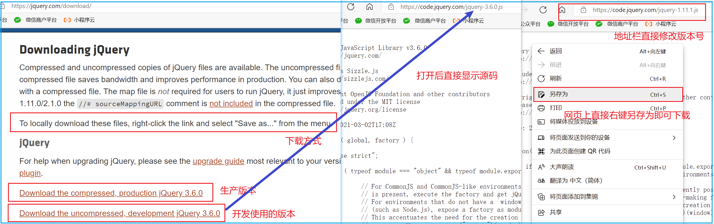


## 1. jQuery简介

[How jQuery Works | jQuery Learning Center](https://learn.jquery.com/about-jquery/how-jquery-works/)  

**jQuery的引入及文档就绪事件**： 

```html
<body>
    <!-- 引入jQuery 也可使用cdn等方式引入-->
    <script src="js/jquery-1.11.1.js"></script>
    <script>
        // 入口函数(第一种): 简单易用（推荐使用）
        $(function () {   
            ...  // 此处是页面 DOM 加载完成的入口
        }); 

        // 入口函数(第二种): 繁琐，但是也可以实现
        $(document).ready(function(){
            ...  // 此处是页面DOM加载完成的入口
        });
    </script>
</body>
```

​	总结：

1. DOM 结构渲染完毕即可执行内部代码，不必等到所有外部资源加载完成，相当于原生 js 中的 DOMContentLoaded
2. 不同于原生 js 中的 load 事件是等页面文档、外部的 js 文件、css文件、图片加载完毕才执行内部代码

| 文档就绪事件        | 执行次数                                            | 执行时机                                                     |
| ------------------- | --------------------------------------------------- | ------------------------------------------------------------ |
| window.onload       | 只能执行一次，如果执行第二次，第一次的 执行会被覆盖 | 必须等待网页全部加载完毕（包括图片 等），然后再执行包裹的代码 |
| $(document).ready() | 可执行多次，不会覆盖之前的执行                      | 只需要网页中的DOM结构加载完毕就可以执行                      |


注意：只有 jQuery 对象才能使用 jQuery 方法，DOM 对象则使用原生的 JavaScirpt 方法

**DOM对象和jQuery对象的相互转换**：


```javascript
// 1.DOM对象转换成jQuery对象，方法只有一种
var box = document.getElementById('box');  // 获取DOM对象
var jQueryObject = $(box);                 // 把DOM对象转换为 jQuery 对象

// 2.jQuery 对象转换为 DOM 对象有两种方法：
var domObject1 = $('div')[0];             // 2.1 jQuery对象[索引值]
var domObject2 = $('div').get(0)          // 2.2 jQuery对象.get(索引值)
```

总结：实际开发比较常用的是把DOM对象转换为jQuery对象，这样能够调用功能更加强大的jQuery中的方法


## 2. 常用选择器

jQuery 选择器支持已经存在的 CSS 选择器，除此之外它还有一些自定义的选择器、 jQuery 中所有选择器都以美元符号开头：`$()` 

jQuery supports most CSS3 selectors, as well as some non-standard selectors.   [查看官网文档](https://learn.jquery.com/using-jquery-core/selecting-elements/)  

| 常用jQuery选择器 | 语法              | 描述                                     |
| ---------------- | ----------------- | ---------------------------------------- |
| 标签选择器       | `$("div")`        | 获取同一类标签的所有元素                 |
| 类选择器         | `$(".className")` | 获取指定类名的元素                       |
| ID选择器         | `$("#id")`        | 获取指定id的元素                         |
| 并集选择器       | `$("div,#id,li")` | 将每一个选择器匹配到的元素合并后一起返回 |
| 全局选择器       | `$("*")`          | 获取所有元素                             |

| jQuery选择器 | 语法               | 描述                                       |
| ------------ | ------------------ | ------------------------------------------ |
| 交集选择器   | `$("div.box")`     | 获取类名为box的div标签（中间没有符号）     |
| 子代选择器   | `$("ul>li")`       | 获取亲儿子层级的元素                       |
| 后代选择器   | `$("ul li")`       | 获取所有后代元素（这里指ul下的所有li元素） |
| 相邻选择器   | `$("label+input")` | 获取前面有一个label标签的input元素         |
| 同辈选择器   | `$("form~input")`  | 获取与form同层级的input元素                |


匹配包含给定属性的元素

```javascript
$("div[id]");                  //获取所有有id属性的div的元素集合
$("div[class]");               //获取所有有class属性的div的元素集合

$("input[name='userName']");   //获取所有input标签中name属性是userName元素的集合

$("input[name^='user']");      //获取所有input标签中name属性是user开头的元素的集合
$("input[name$='user']");      //获取所有input标签中name属性是user结尾的元素的集合
$("input[name*='user']");      //获取所有input标签中name属性包含了user的元素的集合

$("input[id][name^='user']");  //获取所有input标签中既有id属性又有name属性（以user开头）的元素的集合
```


| 选择器             | 语法示例                         | 说明                                                   |
| ------------------ | -------------------------------- | ------------------------------------------------------ |
| parent()           | `$("li"). parent()`              | 查找父级                                               |
| children(selector) | `$("u1").children("1i")`         | 相当于$(ul>li")，最近一级(亲儿子)                      |
| find(selector)     | `$("u1").find("1i")`             | 相当于$("ul li""), 后代选择器                          |
| siblings(selector) | `$(".first").siblings("1i")`     | 查找兄弟节点，不包括自己本身                           |
| nextAll([expr])    | `$(".first").nextAll()`          | 查找当前元素之后所有的同辈元素                         |
| prevtAl1([expr])   | `$(".last").prevAll()`           | 查找当前元素之前所有的同辈元素                         |
| hasClass(class)    | `$('div').hasClass("protected")` | 检查当前的元素是否含有某个特定的类，如果有，则返回true |
| eq(index)          | `$("li").eq(2)`                  | 相当于$("li:eq(2)"), index从o开始                      |


## 3. 伪类选择器

常用的伪类选择器（Pseudo-Selectors）

| 伪类选择器 | 语法示例            | 描述                                      |
| ---------- | ------------------- | ----------------------------------------- |
| :first     | `$('li:first')`     | 获取第一个li元素                          |
| :last      | `$("li:last")`      | 获取最后一个li元素                        |
| :eq(index) | `$("li:eq(2)")`     | 获取索引号为2的li元素，索引号index从0开始 |
| :odd       | `$("li:odd")`       | 获取索引号为奇数的li元素                  |
| :even      | `$("li:even")`      | 获取索引号为偶数的li元素                  |
| :animated  | `$("div:animated")` | 所有正在执行动画的div元素                 |
| :visible   | `$("div:visible")`  | 获取所有真实可见的元素                    |
| :hidden    | `$("div:hidden")`   | 获取隐藏的元素                            |

**Note:**  这里显示和隐藏是根据它是否真实显示或不显示来判定，并非根据其`visibility` 或 `display` 的值，见文档解释：

When using the `:visible` and `:hidden` pseudo-selectors,  jQuery tests the actual visibility of the element, not its CSS `visibility` or `display` properties.  jQuery looks to see if the element's physical height and width on the page are both greater than zero.


常用的表单选择器

| Selecting Form Elements | 语法示例              | 描述                                                         |
| ----------------------- | --------------------- | ------------------------------------------------------------ |
| :checked                | `$("input:checked")`  | 获取选中的项（checkboxes, radio, selects 均可）              |
| :disabled               | `$("input:disabled")` | any `<input>` elements with the `disabled` attribute         |
| :enabled                | `$("input:enabled")`  | any elements that *do not* have a `disabled` attribute       |
| :input                  | `$("form :input")`    | all `<input>`, `<textarea>`, `<select>`, and `<button>` elements |
| :selected               | `$("form :selected")` | any selected items in `<option>` elements                    |

**Note:**  In order to get the best performance using `:selected`,  first select elements with a standard jQuery selector, then use `.filter( ":selected" )`, or precede the pseudo-selector with a tag name or some other selector.


**Selecting by type**： jQuery provides pseudo selectors to select form-specific elements according to their type

- [`:password`](http://api.jquery.com/password-selector/) ：*Selects all elements of type password.* （use `[type="password"]` instead）

- [`:reset`](http://api.jquery.com/reset-selector/) ：*Selects all elements of type reset* （use `[type="reset"]` instead）

- [`:radio`](http://api.jquery.com/radio-selector/) ：*Selects all elements of type radio* （use `[type="radio"]` instead）

- [`:text`](http://api.jquery.com/text-selector/) ：*Selects all input elements of type text.* （use `[type="text"]` instead）

- [`:submit`](http://api.jquery.com/submit-selector/) ：*Selects all elements of type submit.* （use `input[type="submit"], button[type="submit"]` instead）

- [`:checkbox`](http://api.jquery.com/checkbox-selector/) ：*Selects all elements of type checkbox.* （use `[type="checkbox"]` instead）

- [`:button`](http://api.jquery.com/button-selector/) ：*Selects all button elements and elements of type button.* 

  （first select the elements using a pure CSS selector, then use [`.filter(":button")`](https://api.jquery.com/filter/)）

- [`:image`](http://api.jquery.com/image-selector/) ：*Selects all elements of type image.* （use `[type="image"]` instead）

- [`:file`](http://api.jquery.com/file-selector/) ：*Selects all elements of type file.* （use `[type="file"]` instead）


## 4. 属性和样式

`.attr() `– Get or set the value of the provided attribute

```javascript
var img=$("img");

img.attr("src","img/cat.jpg");      //设置属性
var src=img.attr("src");            //获取属性
img.removeAttr("title");            //移除属性

// Manipulating multiple attributes.
$( "#myDiv a:first" ).attr({
    href: "newDestination.html",
    rel: "nofollow"
});
```

CSS, Styling, & Dimensions ：

jQuery中常用的样式操作有两种：css() 和 设置类样式方法 （注意：css() 多用于样式少时操作，多了则不太方便）

jQuery 可以使用 css 方法来修改简单元素样式； 也可以操作类，修改多个样式

```javascript
// 获取CSS样式属性
$( "h1" ).css( "fontSize" );            // Returns a string such as "19px".

// 设置CSS样式属性
$( "h1" ).css( "fontSize", "100px" );  // Setting an individual property.
 
// 设置多个CSS样式属性
$( "h1" ).css({
    fontSize: "100px",
    color: "red"
});

// Using CSS Classes for Styling
$("div").addClass("redBg");
$("div").addClass("redBg fontColor");
$("div").removeClass("fontColor");
$("div").removeClass();            //没有参数的时候直接移除所有的样式
$("div").toggleClass("fontColor"); //匹配元素如果有当前的样式就删除，如果没有就添加

// Basic dimensions methods.
$( "h1" ).width( "50px" );        // Sets the width of all <h1> elements.
$( "h1" ).width();                // Gets the width of the first <h1> element.
$( "h1" ).height( "50px" );       // Sets the height of all <h1> elements.
$( "h1" ).height();               // Gets the height of the first <h1> element.        
```


## 5. 文本属性值

jQuery的文本属性值常见操作有三种：`html() 、 text() 、 val()   `、分别对应JS中的 innerHTML 、innerText 和 value 属性

```javascript
$("div").html();               // 获取元素内容 (包括嵌套在内部的标签)
$("div").html("123");          // 设置元素内容 

$("div").text();               // 获取元素文本内容 (不包含标签)
$("div").text("123");          // 设置元素文本内容 

$("input").val();              // 获取表单值 
$("input").val("123");         // 设置表单值 
```


## 6. 元素的操作

​	jQuery 元素主要操作方法：遍历、创建、添加和删除，克隆和移动

- 遍历： `each()` 方法

  each()方法遍历匹配的每一个元素、里面的回调函数有2个参数：索引号和DOM元素对象（不是jquery对象）

  要想使用jquery方法，需要给这个dom元素转换为jquery对象

  ```javascript
  // 1. each() 方法遍历元素 
  $("div").each(function(i, domEle) {
      console.log(i);                    // 回调函数第一个参数一定是索引号
      console.log(domEle);               // dom元素对象、使用jQuery方法需要转换 $(domEle)
      $(domEle).css("color", "red");
  });
  
  // 2. $.each() 方法遍历元素 主要用于遍历数据，处理数据
  $.each(arr, function(i, ele) {
      console.log(i);
      console.log(ele);
  });
  ```

- 创建、添加、删除元素：

  ```JavaScript
  // 创建元素
  $("<li><fli>");          // 动态的创建了一个li元素
  $("<a/>", {
      html: "This is a <strong>new</strong> link",
      "class": "new",
      href: "foo.html"
  });                      // Creating a new element with an attribute object.
  
  // 添加元素 
  element.append("内容");   // 把内容添加到匹配元素内部最后面，类似原生appendChild
  element.prepend("内容")   // 把内容放入匹配元素内部最前面
  
  element.after("内容");    // 把内容放入目标元素后面
  element.before("内容");   // 把内容放入目标元素前面
  
  // 删除元素
  element.remove();         // 删除元素本身
  element.empty();          // 删除匹配的元素集合中所有的子节点
  element.html("");         // 清空匹配的元素内容
  ```

  内部添加元素，生成之后它们是父子关系。外部添加元素，生成之后他们是兄弟关系

   	`empty()`和`html("")`作用等价，都可以删除元素里面的内容，只不过html还可以设置内容


- 克隆和移动元素：

  ```javascript
  var li=$("#myList li:first").appendTo("#myList");  // 将第一个li移动到最后
  $("#myList").append($( "#myList li:first"));       // 同上
  
  $("#myList li:first").clone().appendTo("#myList"); // 将第一个li复制一份添加到最后
  ```

  


## 7. jQuery事件

jQuery offers convenience methods for most native browser events.  [参照官网关于事件的文档](https://learn.jquery.com/events/event-basics/) 

These methods — including `.click()`, `.focus()`, `.blur()`, `.change()`, etc

```JavaScript
// Event setup using a convenience method
$( "p" ).click(function() {
    console.log( "You clicked a paragraph!" );
});

```

2011年11月，jQuery 1.7版发布。该版本新增了新的事件API：`on()`和`off()`、统一了jQuery中所有对文档绑定事件的操作

```JavaScript
// Equivalent event setup using the `.on()` method
$( "p" ).on( "click", function() {
    console.log( "click" );
});

// Multiple events, same handler （多个事件、同一个处理函数）
$( "input" ).on(
    "click change", 	// Bind handlers for multiple events
    function() {
        console.log( "An input was clicked or changed!" );
    }
);

// Binding multiple events with different handlers （不同的事件，不同的处理函数）
$( "p" ).on({
    "click": function() { console.log( "clicked!" ); },
    "mouseover": function() { console.log( "hovered!" ); }
});
```


- `on()`: 用于事件绑定，目前最好用的事件绑定方法
- `off()`: 事件解绑

```JavaScript
//  on可以实现事件委托（委派）
// click 是绑定在ul 身上的，但是触发的对象是 ul 里面的小li 、相当于： $("ul li").click();
$("ul").on("click", "li", function() {
    alert(11);
});

// on可以给未来动态创建的元素绑定事件
$("ol").on("click", "li", function() {
    alert(11);
})
var li = $("<li>我是后来创建的</li>");
$("ol").append(li);
```

off()方法可以移除通过on()方法添加的事件处理程序

```javascript
$("p").off();                 // 解绑p元素所有事件处理程序
$("p").off( "click");         // 解绑p元素上面的点击事件
$("ul").off( "click", "li");  // 解绑事件委托
```

如果有的事件只想触发—次，可以使用`one()`来绑定事件

```javascript
$("p").one("click", function() {
    alert(11);
});
```


`trigger() / triggerHandler()`: 事件触发

```javascript
// 1. 元素.事件()、会触发元素的默认行为
$("div").click();

// 2. 元素.trigger("事件")、会触发元素的默认行为
$("input").trigger("focus");  

// 3. 元素.triggerHandler("事件") 但是不会触发元素的默认行为
$("input").triggerHandler("focus");

// 绑定事件
$("div").on("click", function() { alert(11);});
$("input").on("focus", function() { $(this).val("你好吗");});
```


`event.stopPropagation();` 阻止事件冒泡：

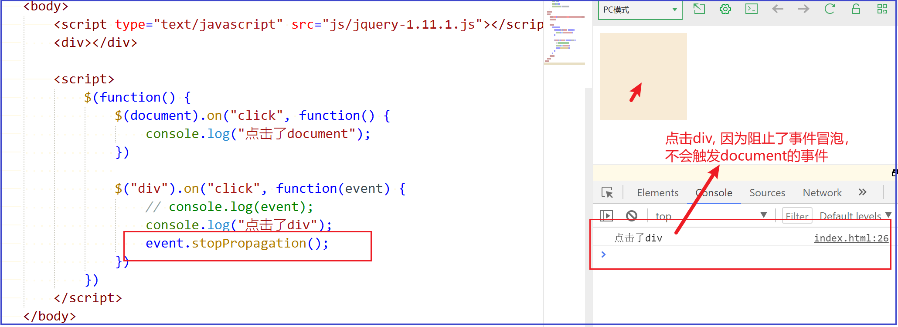


## 8. jQuery动画

​	jQuery 给我们封装了很多动画效果，最为常见的如下：

- 显示隐藏：show() 、 hide() 、 toggle() ;
- 划入画出：slideDown() 、 slideUp() 、 slideToggle() ; 
- 淡入淡出：fadeIn() 、 fadeOut() 、fadeToggle() 、 fadeTo() ; 
- 自定义动画：animate() ;

> 注意：
>
> 动画或者效果一旦触发就会执行，如果多次触发，就造成多个动画或者效果排队执行。
>
> jQuery为我们提供另一个方法，可以停止动画排队：stop() ;


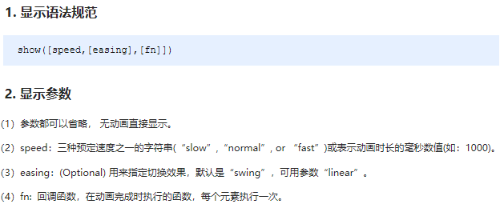
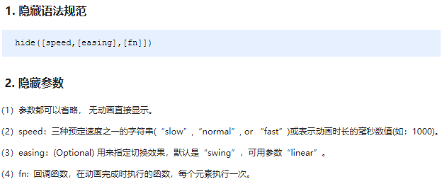

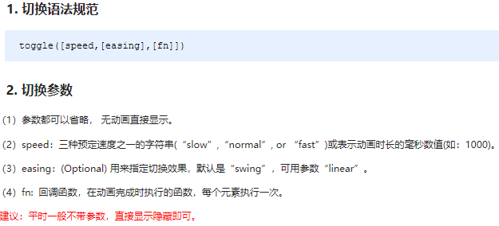

```javascript
<body>
    <button>显示</button>
    <button>隐藏</button>
    <button>切换</button>
    <div></div>
    <script>
        $(function() {
            $("button").eq(0).click(function() {
                $("div").show(1000, function() {
                    alert(1);
                });
            })
            $("button").eq(1).click(function() {
                $("div").hide(1000, function() {
                    alert(1);
                });
            })
            $("button").eq(2).click(function() {
              $("div").toggle(1000);
            })
            // 一般情况下，我们都不加参数直接显示隐藏就可以了
        });
    </script>
</body>
```

​	滑入滑出动画，常见有三个方法：slideDown() / slideUp() / slideToggle() ; 
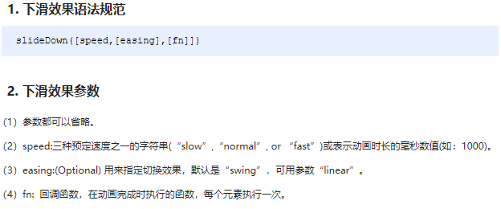
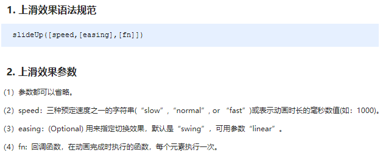
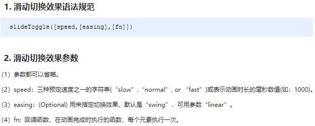

```javascript
<body>
    <button>下拉滑动</button>
    <button>上拉滑动</button>
    <button>切换滑动</button>
    <div></div>
    <script>
        $(function() {
            $("button").eq(0).click(function() {
                // 下滑动 slideDown()
                $("div").slideDown();
            })
            $("button").eq(1).click(function() {
                // 上滑动 slideUp()
                $("div").slideUp(500);
            })
            $("button").eq(2).click(function() {
                // 滑动切换 slideToggle()
                $("div").slideToggle(500);
            });
        });
    </script>
</body>
```


	淡入淡出动画，常见有四个方法：fadeIn() / fadeOut() / fadeToggle() / fadeTo() ; 

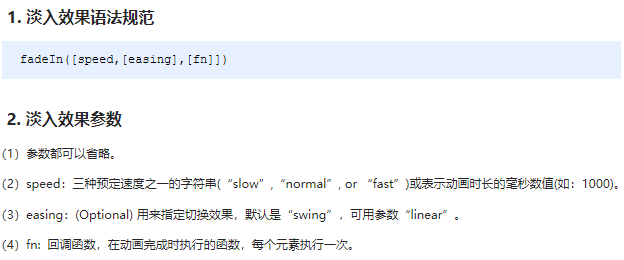
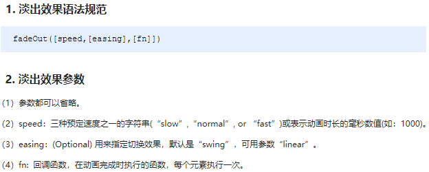
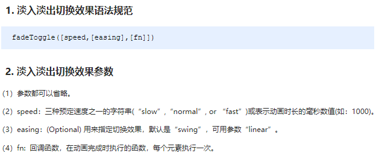

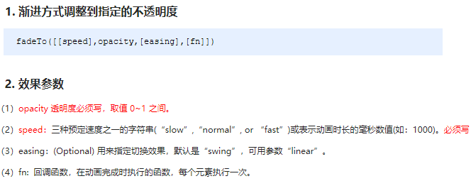

```javascript
<body>
    <button>淡入效果</button>
    <button>淡出效果</button>
    <button>淡入淡出切换</button>
    <button>修改透明度</button>
    <div></div>
    <script>
        $(function() {
            $("button").eq(0).click(function() {
                // 淡入 fadeIn()
                $("div").fadeIn(1000);
            })
            $("button").eq(1).click(function() {
                // 淡出 fadeOut()
                $("div").fadeOut(1000);
            })
            $("button").eq(2).click(function() {
                // 淡入淡出切换 fadeToggle()
                $("div").fadeToggle(1000);
            });
            $("button").eq(3).click(function() {
                //  修改透明度 fadeTo() 这个速度和透明度要必须写
                $("div").fadeTo(1000, 0.5);
            });
        });
    </script>
</body>
```


	自定义动画非常强大，通过参数的传递可以模拟以上所有动画，方法为：animate() ;

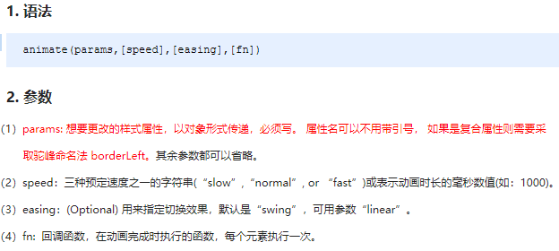

```javascript
<body>
    <button>动起来</button>
    <div></div>
    <script>
        $(function() {
            $("button").click(function() {
                $("div").animate({
                    left: 500,
                    top: 300,
                    opacity: .4,
                    width: 500
                }, 500);
            })
        })
    </script>
</body>
```

​	动画或者效果一旦触发就会执行，如果多次触发，就造成多个动画或者效果排队执行。

​	停止动画排队的方法为：stop() ; 

- stop() 方法用于停止动画或效果。
- stop() 写到动画或者效果的前面， 相当于停止结束上一次的动画。

​        总结: 每次使用动画之前，先调用 stop() ,在调用动画。

​	jQuery中为我们添加了一个新事件 hover() ; 功能类似 css 中的伪类 :hover 。介绍如下

**语法**

```javascript
hover([over,]out)     // 其中over和out为两个函数
```

- over:鼠标移到元素上要触发的函数（相当于mouseenter）
- out:鼠标移出元素要触发的函数（相当于mouseleave）
- 如果只写一个函数，则鼠标经过和离开都会触发它


```html
<body>
    <a href="http://www.itcast.cn" title="都挺好">都挺好</a>
    <input type="checkbox" name="" id="" checked>
    <div index="1" data-index="2">我是div</div>
    <span>123</span>
    <script>
        $(function() {
            //1. element.prop("属性名") 获取元素固有的属性值
            console.log($("a").prop("href"));
            $("a").prop("title", "我们都挺好");
            $("input").change(function() {
                console.log($(this).prop("checked"));
            });
            // console.log($("div").prop("index"));
            
            // 2. 元素的自定义属性 我们通过 attr()
            console.log($("div").attr("index"));
            $("div").attr("index", 4);
            console.log($("div").attr("data-index"));
            
            // 3. 数据缓存 data() 这个里面的数据是存放在元素的内存里面
            $("span").data("uname", "andy");
            console.log($("span").data("uname"));
            // 这个方法获取data-index h5自定义属性 第一个 不用写data-  而且返回的是数字型
            console.log($("div").data("index"));
        })
    </script>
</body>
```


# 二 Bootstrap

## 1. Bootstrap简介

中文官网: http://www.bootcss.com/     官网: http://getbootstrap.com/       

教程手册：https://www.shouce.ren/api/view/a/772 


Bootstrap 是由 *Twitter* 在 2011 年8月在 GitHub 上发布的开源产品

- **移动设备优先**：自 Bootstrap 3 起，框架包含了贯穿于整个库的移动设备优先的样式
- **响应式设计**：Bootstrap 的响应式 CSS 能够自适应于台式机、平板电脑和手机


## 2. Bootstrap引入

下载及引入：https://www.shouce.ren/api/view/a/773


# 三 AJAX技术

AJAX = > Asynchronous JavaScript and XML（异步的 JavaScript 和 XML）

AJAX 的核⼼是 XMLHttpRequest 对象、不同的浏览器创建 XMLHttpRequest 对象的⽅法是有差异的

IE 浏览器使⽤ ActiveXObject，⽽其他的浏览器使⽤名为 XMLHttpRequest 的 JavaScript 内建对象


## 1. Ajax编程步骤

原生 JS 发送 Ajax 请求的步骤：

```javascript
$(function () {
    $("#username").on("blur", function () {
        // 第⼀步：创建XMLHttpRequest对象
        let xmlHttp;
        if (window.XMLHttpRequest) {
            xmlHttp = new XMLHttpRequest();  //⾮IE
        } else if (window.ActiveXObject) {
            xmlHttp = new ActiveXObject("Microsoft.XMLTYPE");  //IE
        }

        //第⼆步：设置和服务器端交互的相应参数和路径
        let url = "http://localhost:8080/user/isExist";
        xmlHttp.open("POST", url, true);

        //第三步：注册回调函数
        xmlHttp.onreadystatechange = function() {
            if (xmlHttp.readyState === 4) {
                if (xmlHttp.status === 200) {
                    let obj = document.getElementById("username_msg");
                    obj.innerText = xmlHttp.responseText;
                } else {
                    alert("AJAX服务器返回错误！");
                }
            }
        }

        //第四步：设置发送请求的内容和发送报送。然后发送请求
        let uname= document.getElementsByName("username")[0].value;
        // 增加 time 随机参数，防⽌读取缓存
        let params = "username=" + uname +"&time=" + Math.random();
        // 向请求添加 HTTP 头，POST如果有数据⼀定要加！！！！
        xmlHttp.setRequestHeader("Content-type", "application/x-www-form-urlencoded;charset=UTF-8");

        xmlHttp.send(params);
    })
})
```

原生JS的方式步骤繁琐， ⽅法、属性、常⽤值较多 不好记忆


## 2. jquery的ajax

ajax() ⽅法 是 jQuery 最底层的 Ajax 实现，具有较⾼灵活性

```JavaScript
$.ajax({
    url: 请求地址
    type: "get | post | put | delete " 默认是get,
    data: 请求参数 {"id":"123","pwd":"123456"},
    dataType: 请求数据类型"html | text | json | xml | script | jsonp ",
    success: function(data, dataTextStatus, jqxhr){ }, //请求成功时 
    error: function(jqxhr, textStatus, error) //请求失败时
})
```


get() 和 post() ⽅法分别通过远程 HTTP GET和POST 请求载⼊信息 （url:请求的路径 、data:发送的数据）

```JavaScript
$.get(url, data, function(result) {
	 //省略将服务器返回的数据显示到⻚⾯的代码
});

$.post(url, data, function(result) {
 	//省略将服务器返回的数据显示到⻚⾯的代码
});
```

