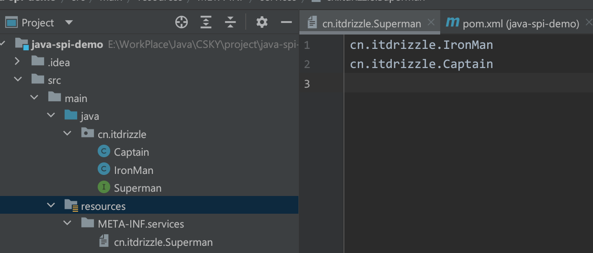
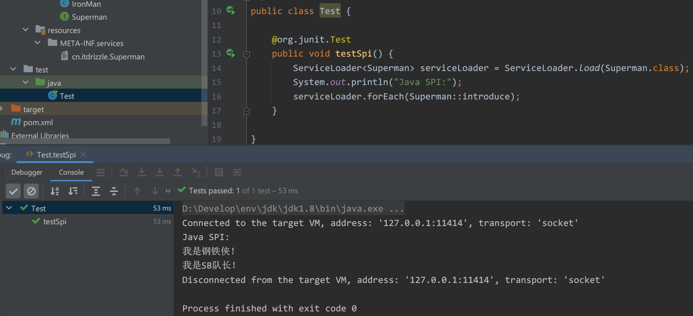

# 一 Java SPI机制

SPI 机制应用在项目中的很多地方，在很多框架中也有普遍应用，只不过很多人并没有感知。举个例子，为什么我们在项目中引入 mysql-connector 的 jar 包，就可以直接连接 MySQL 数据库了？

**SPI** （ *Service Provider Interface*），是一种服务发现机制。

**SPI** **的本质是将接口的实现类的全限定名配置在文件中，并由服务加载器读取配置文件，加载对应接口的实现类。这样就可以在运行时，获取接口的实现类。通过这一特性，我们可以给很容易的通过 SPI机制为程序提供拓展功能**。

<br>

**Java SPI** 是基于接口的编程＋策略模式＋配置文件 组合实现的动态加载机制。

```bash

`设计一个接口`，将接口的实现类写在配置文件中，服务通过读取配置文件来发现实现类，进行加载实例化然后使用

    `配置文件路径`：classpath下的META-INF/services/

    `配置文件名`：接口的全限定名
    `配置文件内容`：接口的实现类的全限定名

```

<br>


## 1. 简单的SPI应用举例

自定义接口和实现类：

```java

// 接口
 public interface Superman {
   void introduce();
 }
 
 // 实现类1
 public class IronMan implements Superman{
   @Override
   public void introduce() {
     System.out.println("我是钢铁侠！");
   }
 }
 // 实现类2
 public class Captain implements Superman {
   @Override
   public void introduce() {
     System.out.println("我是SB队长！");
   }
 }

```


**配置文件：** 

文件名：`cn.itdrizzle.Superman` （maven项目：文件位于resources目录下`META-INF/services/`目录）

文件内容：（实现类的全限定名）

```

cn.itdrizzle.IronMan
cn.itdrizzle.Captain

```




**测试：**  

```java

public class Test {

    @org.junit.Test
    public void testSpi() {
        ServiceLoader<Superman> serviceLoader = ServiceLoader.load(Superman.class);
        System.out.println("Java SPI:");
        serviceLoader.forEach(Superman::introduce);
    }
}

```

 运行结果：



<br>


## 2. java.sql.Driver接口


<br>


# 二 Spring SPI


<br>


# 三 dubbo SPI


<br>


