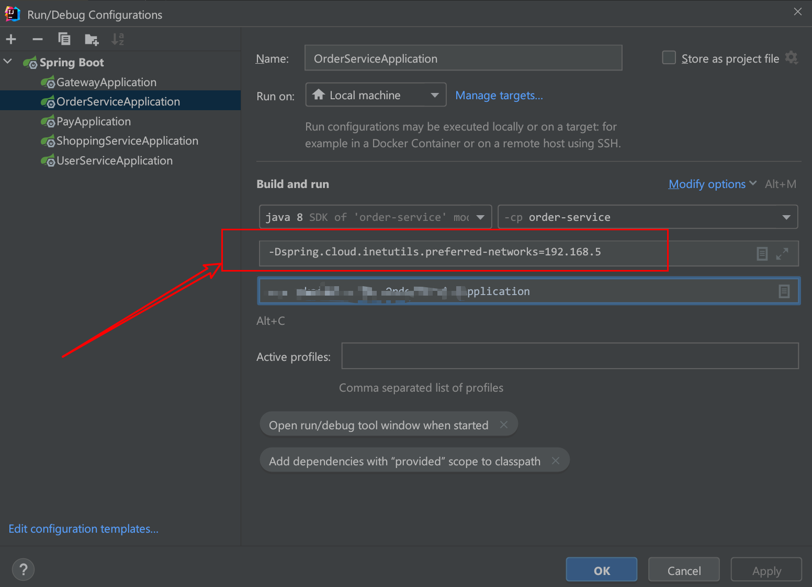
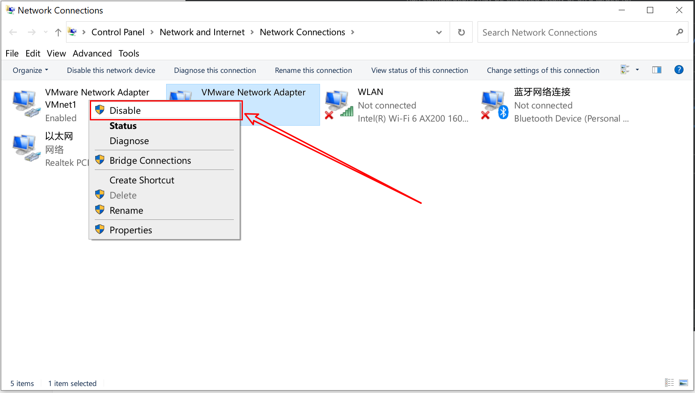

服务注册/发现：Service Registration/Discovery


# 一 Eureka注册中心

Eureka是SpringCloud Netflix中包含的注册中心的组件，它扮演注册中心的角色，实现服务的注册与自动发现。

Eureka采用了C-S的架构设计，其中

- EurekaServer作为服务器端，它具体就实现了服务注册中心的功能

- EurekaClient作为客户端，服务提供者可通过它实现和EurekaServer的通信完成服务的注册，

  服务消费者可通过它与EurekaServer通信完成服务的自动发现

<br>


## 1. EurekaServer


<br>


## 2. EurekaClient


<br>


# 二 Nacos注册中心

## 1. nacos服务器


<br>


## 2. nacos服务注册


<br>


# 三 常见问题及注意事项

## 1. IP网段不一致

多网卡环境下，注册到 nacos 的服务使用了 虚拟机 或 这无线网卡的IP，导致服务路由失败

**解决方案**：

- 修改配置文件，在 application.yaml 里添加优先匹配网络

  ```yaml
  spring:
    cloud:
      inetutils:
        preferred-networks: 192.168.5 
        //ip可以写全，如192.168.5.144
  ```

- 在idea的 VM options添加：
  `-Dspring.cloud.inetutils.preferred-networks=192.168.5` 

  

- 直接禁用虚拟机或其他有影响的网网络

  


