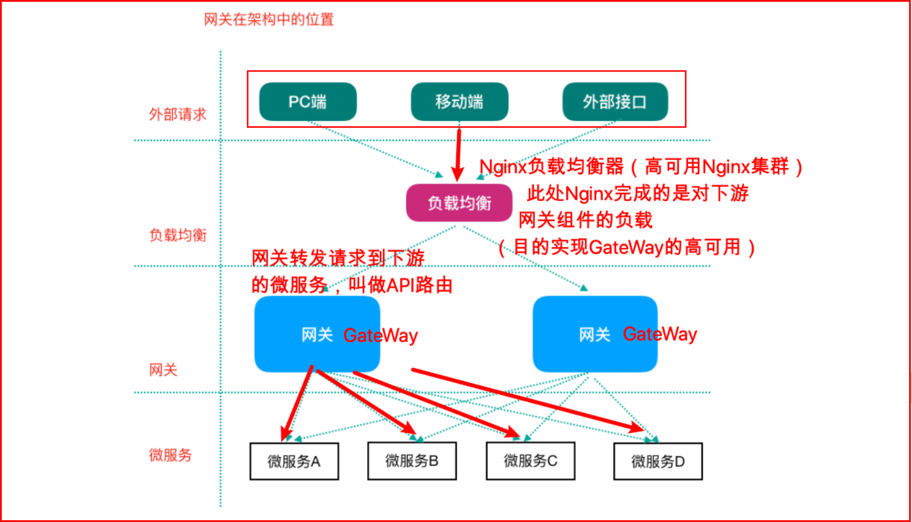

# 一 服务网关组件

⽹关（翻译过来就叫做GateWay）：微服务架构中的重要组成部分

局域⽹中就有⽹关这个概念，局域⽹接收或者发送数据出去通过这个⽹关，⽐如⽤Vmware虚拟机软件搭建虚拟机集群的时候，往往我们需要选择IP段中的⼀个IP作为⽹关地址。

Spring Cloud GateWay只是众多⽹关解决⽅案中的⼀种

## 1. 网关在架构中的位置

 

## 2. 

 

# 二 Netflix Zuul

Zuul 1.x 阻塞式IO 、2.x 基于Netty

 

# 三 Spring Cloud GateWay

Spring Cloud Gateway：https://spring.io/projects/spring-cloud-gateway

Spring Cloud GateWay是Spring Cloud的⼀个全新项⽬，⽬标是取代Netflix Zuul，它基于Spring5.0+SpringBoot2.0+WebFlux（基于⾼性能的Reactor模式响应式通信框架Netty，异步⾮阻塞模型）等技术开发，性能⾼于Zuul，官⽅测试，GateWay是
Zuul的1.6倍，旨在为微服务架构提供⼀种简单有效的统⼀的API路由管理⽅式。

Spring Cloud GateWay不仅提供统⼀的路由⽅式（反向代理）并且基于 Filter(定义过滤器对请求过滤，完成⼀些功能) 链的⽅式提供了⽹关基本的功能，例如：鉴权、流量控制、熔断、路径重写、⽇志监控等。

## 1. GateWay核⼼概念

Spring Cloud GateWay天⽣就是异步⾮阻塞的，基于Reactor模型
⼀个请求—>⽹关根据⼀定的条件匹配—匹配成功之后可以将请求转发到指定的服务地址；

⽽在这个过程中，我们可以进⾏⼀些⽐较具体的控制（限流、⽇志、⿊⽩名单）

- 路由（route）： ⽹关最基础的部分，也是⽹关⽐较基础的⼯作单元。路由由⼀个ID、⼀个⽬标URL（最终路由到的地址）、⼀系列的断⾔（匹配条件判断）和Filter过滤器（精细化控制）组成。如果断⾔为true，则匹配该路由。
- 断⾔（predicates）：参考了Java8中的断⾔java.util.function.Predicate，开发⼈员可以匹配Http请求中的所有内容（包括请求头、请求参数等）（类似于nginx中的location匹配⼀样），如果断⾔与请求相匹配则路
- 过滤器（filter）：⼀个标准的Spring webFilter，使⽤过滤器，可以在请求之前或者之后执⾏业务逻辑。

predicates断⾔就是我们的匹配条件，⽽Filter就可以理解为⼀个⽆所不能的拦截器，有了这两个元素，结合⽬标URL，就可以实现⼀个具体的路由转发。

 

GateWay⼯作过程（How It Works）

客户端向Spring Cloud GateWay发出请求，然后在GateWay Handler Mapping中找到与请求相匹配的路由，将其发送到GateWay Web Handler；Handler再通过指定的过滤器链来将请求发送到我们实际的服务执⾏业务逻辑，然后返回。

来⾃官⽹的⼀张图：

过滤器之间⽤虚线分开是因为过滤器可能会在发送代理请求之前（pre）或者之后（post）执⾏业务逻辑。Filter在“pre”类型过滤器中可以做参数校验、权限校验、流量监控、⽇志输出、协议转换等，在“post”类型的过滤器中可以做响应内容、响应头的修改、⽇志的输出、流量监控等。

--> **GateWay核⼼逻辑：路由转发+执⾏过滤器链** . 

 

## 2. GateWay使用示例

使⽤网关对⾃动投递微服务进⾏代理（添加在它的上游，相当于隐藏了具体微服务的信息，对外暴露的是⽹关）

 

## 3. GateWay路由规则

 

## 4. GateWay动态路由

 

## 5. GateWay过滤器

 

## 6. GateWay高可用

 
