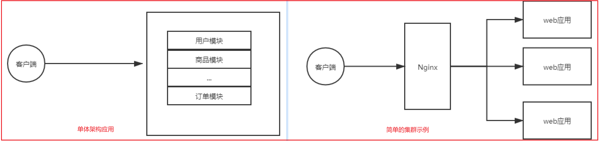
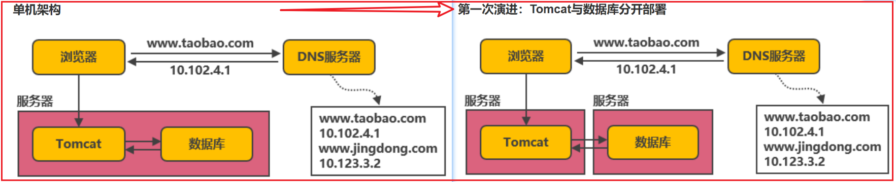
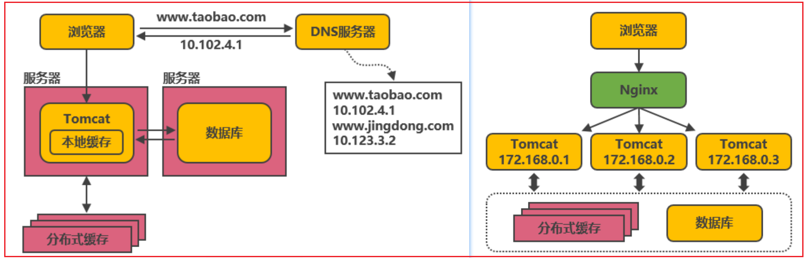
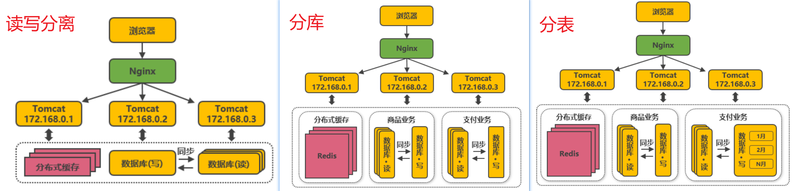
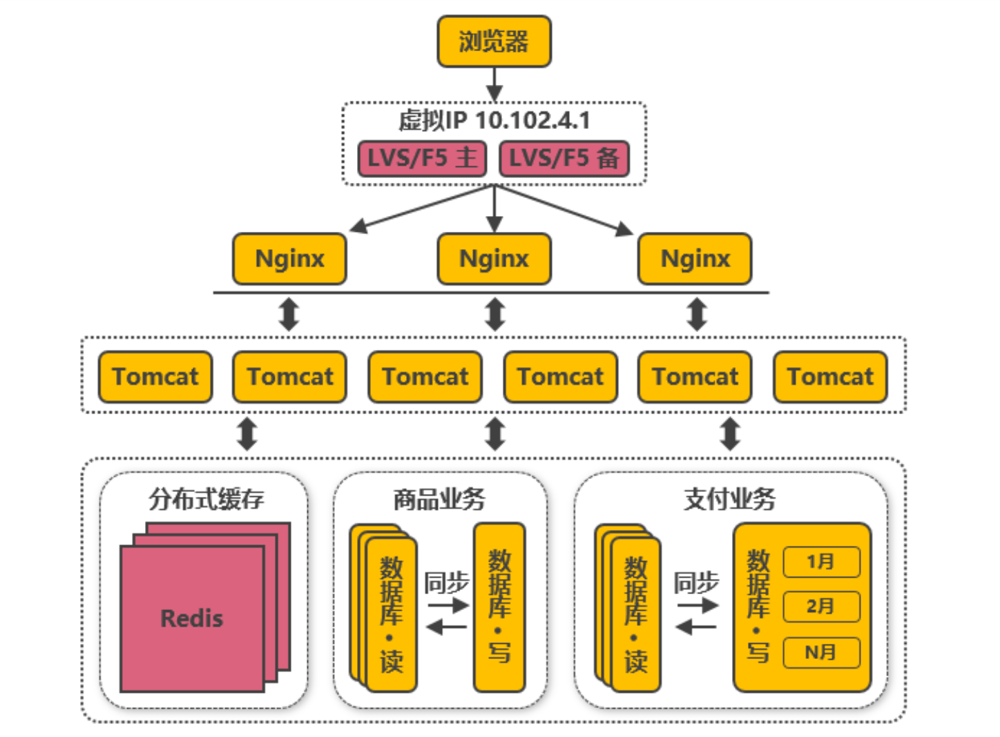
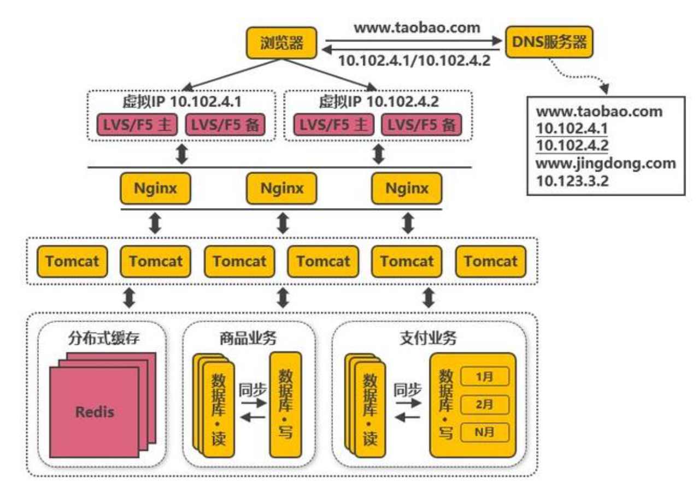
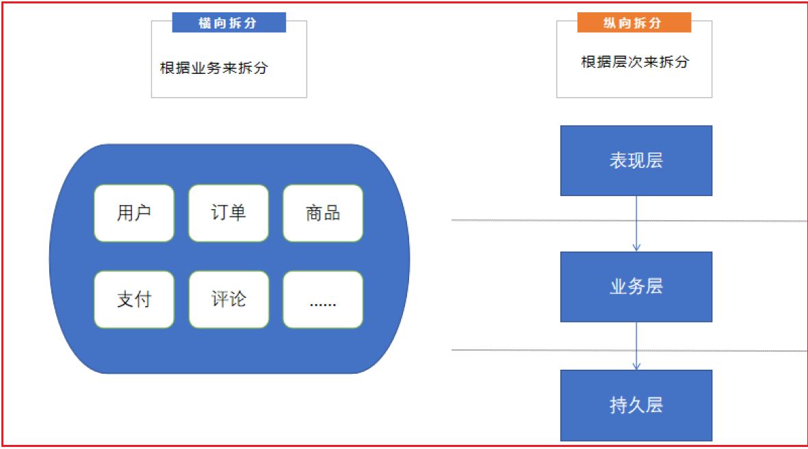

# 一 从单体应用到微服务

## 1. 单体架构应用的优劣

到目前为止，我们所实现的web应用都有一个共同的特点，所有的代码最终打包成一个或多个文件，整个系统的所有功能单元整体部署到同一个进程，这种软件架构的风格，即所谓的"单体架构"

```bash 

在单体应用的早期，应用程序相对较小，单体架构的好处：
- 应用的开发很简单
- 易于对应用程序进行大规模的更改
- 测试相对直观简单
- 部署简单明了
- 横向扩容不费吹灰之力

```

<br>

一个单体应用在运行时，会部署在一台服务器上，但是随着用户体量的增长，单体应用已经无法承载日益增长的请求量，怎么办呢？我们可以对单体应用实现扩容，即使用单体应用集群




随着时间的推移，单体应用中包含的功能越来越多，应用的"体积"越来越大，单体应用的弊端就会逐渐体现出来。

- 代**码过度复杂且严重耦合，导致难以维护** 

  由于系统本身过于庞大和复杂，以至于任何一个开发者都很难理解它的全部，因此，修复软件中的问题和正确实现新功能就变得困难且耗时。更糟糕的是，这种极度的复杂性，可能会形成一个恶性循环: 由于代码难以理解，因此开发者在更改时更容易出错，每一次更改都会让代码库变得更复杂，更难懂

- **从代码提交到实际部署的周期很长** 

  从代码完成到运行在生产环境，是一个漫长且费力的过程。

  众多开发人员都向同一个代码库提交代码，常常使得代码库的构建结构处于无法交付的状态。当采用了分支来解决这个问题，又必须忍受漫长且痛苦的合并过程。因为代码库中的代码十分复杂，以至于任何一个更改可能引起的影响是未知的，为了避免牵一发而动全身的后果，即使是一个微小的更改，也必须执行全部的测试

- **扩展性受限** 

  如果单体应用中的某一个功能点存在性能问题，那么就需要多部署几个单体应用的实例，再加上负载均衡的设备(比如nginx)，才能保证整个应用的性能能够支撑用户的使用。在某些情况下，应用的不同模块对资源的需求是相互冲突的，比如某些模块需要高效的IO，某些模块需要高性能的CPU, 而这些模块都在一个单体应用之内，因此其所部署的 服务器必须满足所有的需求

- **开发慢，启动慢，严重影响开发效率** 

- **交付可靠的单体应用困难** 

  单体应用体积庞大，难以进行全面和彻底的测试，而缺乏可靠的测试意味着代码中的错误会进入生产环境。缺乏故障隔离，因为所有的模块都在同一个进程中运行，每隔一段时间，在一个模块中的代码错误，将会导致整个应用程序的崩溃

<br>


## 2. 微服务架构的演进

### 架构设计中的基本概念

最基础的概念介绍：

- 分布式，系统中的多个模块在不同服务器上部署，即可称为分布式系统

  如Tomcat和数据库分别部署在不同的服务器上，或两个相同功能的Tomcat分别部署在不同服务器上。

- 高可用，系统中部分节点失效时，其他节点能够接替它继续提供服务，则可认为系统具有高可用性。

- 集群，一个特定领域的软件部署在多台服务器上并作为一个整体提供一类服务，这个整体称为集群。

  如Zookeeper中的Master和Slave分别部署在多台服务器上，共同组成一个整体提供集中配置服务。在常见的集群中，客户端往往能够连接任意一个节点获得服务，并且当集群中一个节点掉线时，其他节点往往能够自动的接替它继续提供服务，这时候说明集群具有高可用性。

- 负载均衡，请求发送到系统时，通过某些方式把请求均匀分发到多个节点上，使系统中每个节点能够均匀的处理请求负载，则可认为系统是负载均衡的。

- 正向代理和反向代理：简单来说，正向代理是代理服务器代替`系统内部`(发起请求的一方)来访问外部网络的过程，反向代理是外部请求访问系统时通过代理服务器转发到内部服务器的过程。

  系统内部要访问外部网络时，统一通过一个代理服务器把请求转发出去，在外部网络看来就是代理服务器发起的访问，此时代理服务器实现的是正向代理；

  当外部请求进入系统时，代理服务器把该请求转发到系统中的某台服务器上，对外部请求来说，与之交互的只有代理服务器，此时代理服务器实现的是反向代理。

<br>


### 软件架构的演进之路

**第一次演进：  **Tomcat与数据库分开部署 



Tomcat和数据库分别独占服务器资源，显著提高两者各自性能。但随着用户数的增长，并发读写数据库成为瓶颈。

<br>


**第二次演进：**引入本地缓存和分布式缓存

在Tomcat同服务器上或同JVM中增加本地缓存，并在外部增加分布式缓存，缓存热门商品信息或热门商品的html页面等。

通过缓存能把绝大多数请求在读写数据库前拦截掉，大大降低数据库压力。

其中涉及的技术包括：使用memcached作为本地缓存，使用Redis作为分布式缓存，还会涉及缓存一致性、缓存穿透/击穿、缓存雪崩、热点数据集中失效等问题。

缓存抗住了大部分的访问请求，随着用户数的增长，并发压力主要落在单机的Tomcat上，响应逐渐变慢。

<br>



<br>

**第三次演进：**引入反向代理实现负载均衡

在多台服务器上分别部署Tomcat，使用反向代理软件（Nginx）把请求均匀分发到每个Tomcat中。

此处假设Tomcat最多支持100个并发，Nginx最多支持50000个并发，那么理论上Nginx把请求分发到500个Tomcat上，就能抗住50000个并发。其中涉及的技术包括：Nginx、HAProxy，两者都是工作在网络第七层的反向代理软件，主要支持http协议，还会涉及session共享、文件上传下载的问题。

反向代理使应用服务器可支持的并发量大大增加，但并发量的增长也意味着更多请求穿透到数据库，单机的数据库最终成为瓶颈。

<br>


**第四次演进：**数据库读写分离、数据库按业务分库、把大表拆分为小表



**数据库读写分离**: 

把数据库划分为读库和写库，读库可以有多个，通过同步机制把写库的数据同步到读库，对于需要查询最新写入数据场景，可通过在缓存中多写一份，通过缓存获得最新数据。其中涉及的技术包括：MyCAT，它是数据库中间件，可通过它来组织数据库的分离读写和分库分表，客户端通过它来访问下层数据库，还会涉及数据同步，数据一致性的问题。

业务逐渐变多，不同业务之间的访问量差距较大，不同业务直接竞争数据库，相互影响性能。

<br>

**按业务分库**：

把不同业务的数据保存到不同的数据库中，使业务之间的资源竞争降低，对于访问量大的业务，可以部署更多的服务器来支撑。

这样同时导致跨业务的表无法直接做关联分析，需要通过其他途径来解决.

随着用户数的增长，单机的写库会逐渐会达到性能瓶颈。

<br>

**把大表拆分为小表**：

比如针对评论数据，可按照商品ID进行hash，路由到对应的表中存储；针对支付记录，可按照小时创建表，每个小时表继续拆分为小表，使用用户ID或记录编号来路由数据。只要实时操作的表数据量足够小，请求能够足够均匀的分发到多台服务器上的小表，那数据库就能通过水平扩展的方式来提高性能。其中前面提到的Mycat也支持在大表拆分为小表情况下的访问控制。

这种做法显著的增加了数据库运维的难度，对DBA的要求较高。数据库设计到这种结构时，已经可以称为分布式数据库，但是这只是一个逻辑的数据库整体，数据库里不同的组成部分是由不同的组件单独来实现的，如分库分表的管理和请求分发，由MyCAT实现，SQL的解析由单机的数据库实现，读写分离可能由网关和消息队列来实现，查询结果的汇总可能由数据库接口层来实现等等，这种架构其实是MPP（大规模并行处理）架构的一类实现。

目前开源和商用都已经有不少MPP数据库，开源中比较流行的有Greenplum、TiDB、Postgresql XC、HAWQ等，商用的如南大通用的GBase、睿帆科技的雪球DB、华为的LibrA等等，不同的MPP数据库的侧重点也不一样，如TiDB更侧重于分布式OLTP场景，Greenplum更侧重于分布式OLAP场景，这些MPP数据库基本都提供了类似Postgresql、Oracle、MySQL那样的SQL标准支持能力，能把一个查询解析为分布式的执行计划分发到每台机器上并行执行，最终由数据库本身汇总数据进行返回，也提供了诸如权限管理、分库分表、事务、数据副本等能力，并且大多能够支持100个节点以上的集群，大大降低了数据库运维的成本，并且使数据库也能够实现水平扩展。

数据库和Tomcat都能够水平扩展，可支撑的并发大幅提高，随着用户数的增长，最终单机的Nginx会成为瓶颈。

<br>


**第五次演进：**使用LVS或F5来负载均衡

由于瓶颈在Nginx，因此无法通过两层的Nginx来实现多个Nginx的负载均衡



图中的LVS和F5是工作在网络第四层的负载均衡解决方案，其中LVS是软件，运行在操作系统内核态，可对TCP请求或更高层级的网络协议进行转发，因此支持的协议更丰富，并且性能也远高于Nginx，可假设单机的LVS可支持几十万个并发的请求转发；F5是一种负载均衡硬件，与LVS提供的能力类似，性能比LVS更高，但价格昂贵。由于LVS是单机版的软件，若LVS所在服务器宕机则会导致整个后端系统都无法访问，因此需要有备用节点。可使用keepalived软件模拟出虚拟IP，然后把虚拟IP绑定到多台LVS服务器上，浏览器访问虚拟IP时，会被路由器重定向到真实的LVS服务器，当主LVS服务器宕机时，keepalived软件会自动更新路由器中的路由表，把虚拟IP重定向到另外一台正常的LVS服务器，从而达到LVS服务器高可用的效果。

此处需要注意的是，上图中从Nginx层到Tomcat层这样画并不代表全部Nginx都转发请求到全部的Tomcat，在实际使用时，可能会是几个Nginx下面接一部分的Tomcat，这些Nginx之间通过keepalived实现高可用，其他的Nginx接另外的Tomcat，这样可接入的Tomcat数量就能成倍的增加。

由于LVS也是单机的，随着并发数增长到几十万时，LVS服务器最终会达到瓶颈，此时用户数达到千万甚至上亿级别，用户分布在不同的地区，与服务器机房距离不同，导致了访问的延迟会明显不同。

<br>


**第六次演进：**通过DNS轮询实现机房之间的负载均衡

在DNS服务器中可配置一个域名对应多个IP地址，每个IP地址对应到不同的机房里的虚拟IP



例如：当用户访问www.taobao.com时，DNS服务器会使用轮询策略或其他策略，来选择某个IP供用户访问。此方式能实现机房间的负载均衡，至此，系统可做到机房级别的水平扩展，千万级到亿级的并发量都可通过增加机房来解决，系统入口处的请求并发量不再是问题。

随着数据的丰富程度和业务的发展，检索、分析等需求越来越丰富，单单依靠数据库无法解决如此丰富的需求。

<br>


**第七次演进：**引入NoSQL数据库和搜索引擎等技术

当数据库中的数据多到一定规模时，数据库就不适用于复杂的查询了，往往只能满足普通查询的场景


对于统计报表场景，在数据量大时不一定能跑出结果，而且在跑复杂查询时会导致其他查询变慢，对于全文检索、可变数据结构等场景，数据库天生不适用。因此需要针对特定的场景，引入合适的解决方案。如对于海量文件存储，可通过分布式文件系统HDFS解决，对于key value类型的数据，可通过HBase和Redis等方案解决，对于全文检索场景，可通过搜索引擎如ElasticSearch解决，对于多维分析场景，可通过Kylin或Druid等方案解决。

当然，引入更多组件同时会提高系统的复杂度，不同的组件保存的数据需要同步，需要考虑一致性的问题，需要有更多的运维手段来管理这些组件等。

引入更多组件解决了丰富的需求，业务维度能够极大扩充，随之而来的是一个应用中包含了太多的业务代码，业务的升级迭代变得困难。

<br>


**第八次演进：**大应用拆分为小应用

按照业务板块来划分应用代码，使单个应用的职责更清晰，相互之间可以做到独立升级迭代。

这时候应用之间可能会涉及到一些公共配置，可以通过分布式配置中心ZooKeeper来解决。


不同应用之间存在共用的模块，由应用单独管理会导致相同代码存在多份，导致公共功能升级时全部应用代码都要跟着升级

<br>


**第九次演进：**复用的功能抽离成微服务


如用户管理、订单、支付、鉴权等功能在多个应用中都存在，那么可以把这些功能的代码单独抽取出来形成一个单独的服务来管理，这样的服务就是所谓的微服务，应用和服务之间通过HTTP、TCP或RPC请求等多种方式来访问公共服务，每个单独的服务都可以由单独的团队来管理。此外，可以通过Dubbo、Spring Cloud等框架实现服务治理、限流、熔断、降级等功能，提高服务的稳定性和可用性。

不同服务的接口访问方式不同，应用代码需要适配多种访问方式才能使用服务，此外，应用访问服务，服务之间也可能相互访问，调用链将会变得非常复杂，逻辑变得混乱。

<br>


**第十次演进：**引入企业服务总线ESB屏蔽服务接口的访问差异


通过ESB统一进行访问协议转换，应用统一通过ESB来访问后端服务，服务与服务之间也通过ESB来相互调用，以此降低系统的耦合程度。这种单个应用拆分为多个应用，公共服务单独抽取出来来管理，并使用企业消息总线来解除服务之间耦合问题的架构，就是所谓的SOA（面向服务）架构，这种架构与微服务架构容易混淆，因为表现形式十分相似。个人理解，微服务架构更多是指把系统里的公共服务抽取出来单独运维管理的思想，而SOA架构则是指一种拆分服务并使服务接口访问变得统一的架构思想，SOA架构中包含了微服务的思想。

业务不断发展，应用和服务都会不断变多，应用和服务的部署变得复杂，同一台服务器上部署多个服务还要解决运行环境冲突的问题，此外，对于如大促这类需要动态扩缩容的场景，需要水平扩展服务的性能，就需要在新增的服务上准备运行环境，部署服务等，运维将变得十分困难。

<br>


**第十一次演进：**引入容器化技术实现运行环境隔离与动态服务管理

目前最流行的容器化技术是Docker，最流行的容器管理服务是Kubernetes（K8S），应用/服务可以打包为Docker镜像，通过Kubernetes来动态分发和部署镜像。


在大促的之前，可以在现有的机器集群上划分出服务器来启动Docker镜像，增强服务的性能，大促过后就可以关闭镜像，对机器上的其他服务不造成影响（在之前，服务运行在新增机器上需要修改系统配置来适配服务，这会导致机器上其他服务需要的运行环境被破坏）。

使用容器化技术后服务动态扩缩容问题得以解决，但是机器还是需要公司自身来管理，在非大促的时候，还是需要闲置着大量的机器资源来应对大促，机器自身成本和运维成本都极高，资源利用率低。

<br>


**第十二次演进：**以云平台承载系统

系统可部署到公有云上，利用公有云的海量机器资源，解决动态硬件资源的问题，在大促的时间段里，在云平台中临时申请更多的资源，结合Docker和K8S来快速部署服务，在大促结束后释放资源，真正做到按需付费，资源利用率大大提高，同时大大降低了运维成本。


至此，以上所提到的从高并发访问问题，到服务的架构和系统实施的层面都有了各自的解决方案，但同时也应该意识到，在上面的介绍中，其实是有意忽略了诸如跨机房数据同步、分布式事务实现等等的实际问题

<br>


### 架构设计常见问题

**架构的调整是否必须按照上述演变路径进行？ ** 

不是的，以上所说的架构演变顺序只是针对某个侧面进行单独的改进，在实际场景中，可能同一时间会有几个问题需要解决，或者可能先达到瓶颈的是另外的方面，这时候就应该按照实际问题实际解决。如在政府类的并发量可能不大，但业务可能很丰富的场景，高并发就不是重点解决的问题，此时优先需要的可能会是丰富需求的解决方案。

<br>

**对于将要实施的系统，架构应该设计到什么程度？**  

对于单次实施并且性能指标明确的系统，架构设计到能够支持系统的性能指标要求就足够了，但要留有扩展架构的接口以便不备之需。对于不断发展的系统，如电商平台，应设计到能满足下一阶段用户量和性能指标要求的程度，并根据业务的增长不断的迭代升级架构，以支持更高的并发和更丰富的业务。

<br>

**服务端架构和大数据架构有什么区别？ ** 

所谓的“大数据”其实是海量数据采集清洗转换、数据存储、数据分析、数据服务等场景解决方案的一个统称，在每一个场景都包含了多种可选的技术，如数据采集有Flume、Sqoop、Kettle等，数据存储有分布式文件系统HDFS、FastDFS，NoSQL数据库HBase、MongoDB等，数据分析有Spark技术栈、机器学习算法等。总的来说大数据架构就是根据业务的需求，整合各种大数据组件组合而成的架构，一般会提供分布式存储、分布式计算、多维分析、数据仓库、机器学习算法等能力。而服务端架构更多指的是应用组织层面的架构，底层能力往往是由大数据架构来提供。

<br>

**有没有一些架构设计的原则？** 

N+1设计。系统中的每个组件都应做到没有单点故障；

回滚设计。确保系统可以向前兼容，在系统升级时应能有办法回滚版本；

禁用设计。应该提供控制具体功能是否可用的配置，在系统出现故障时能够快速下线功能；

监控设计。在设计阶段就要考虑监控的手段；

多活数据中心设计。若系统需要极高的高可用，应考虑在多地实施数据中心进行多活，至少在一个机房断电的情况下系统依然可用；

采用成熟的技术。刚开发的或开源的技术往往存在很多隐藏的bug，出了问题没有商业支持可能会是一个灾难；

资源隔离设计。应避免单一业务占用全部资源；架构应能水平扩展。系统只有做到能水平扩展，才能有效避免瓶颈问题；

非核心则购买。非核心功能若需要占用大量的研发资源才能解决，则考虑购买成熟的产品；

使用商用硬件。商用硬件能有效降低硬件故障的机率；快速迭代。系统应该快速开发小功能模块，尽快上线进行验证，早日发现问题大大降低系统交付的风险；

无状态设计。服务接口应该做成无状态的，当前接口的访问不依赖于接口上次访问的状态。


<br>


### 微服务和微服务架构

微服务的本质就是一个麻雀虽小但五脏俱全的应用程序，它按照单一职责原则实现了特定的一组功能。
因为每个微服务的本质都可以是一个应用程序，这就要求，微服务可以独立部署，独立运行，独立对外提供服务(运行在一个独立的进程中)，每个微服务，根据单一职责原则，实现一组相关功能

<br>

什么是微服务架构呢？简单理解，就是把应用程序功分解为一组服务的架构风格。实际上，微服务架构是模块化开发的一种形式。
模块化是开发大型，复杂应用程序的基础。当一个单体应用程序的规模太大的时候，是很难作为一个整体开发，也很难让一个人完全理解的。为了让不同的人开发和理解(不同的部分)，大型应用需要拆分模块。

- 在单体应用中，模块通常由一组编程语言所提供的的结构(例如Java中的包，或者jar文件)来定义，但是通过这种方式得到的模块，不同模块的代码还是可以相互引用，导致模块中对象依赖关系的混乱。

- 而微服务架构，使用微服务作为模块化的单元，要访问服务，只能通过服务对外提供的API，于是服务的API为它自身构筑了一个不可逾越的边界，你无法越过API去访问服务内部的类。

<br>


### 微服务的优势和弊端

使用微服务架构，可以解决庞大的单体应用的痛点，带来很多好处：

- 每个服务都相对较小，容易维护

- 使得大型的应用程序实现快速的持续交付和持续部署

  1. 每一个服务相对较小，编写全面的测试代码和执行自动化测试都变得相对容易
  2. 每个服务都独立于其他服务部署，如果负责服务的开发人员，需要部署对该服务的更改，不需要与其他开
  发人员协商，因此将更改频繁部署到生产中要容易的多
  3. 每个小团队，就可以全权负责一个或多个服务的开发，每个团队独立于所有其他团队，开发，部署和扩
  展，实现了团队自治，减少了团队之间的沟通成本

- 应用扩展灵活

  1. 应用被拆分为不同的微服务，而微服务可以独立部署，因此，扩容就不在针对整个应用了，哪里出现性能
     瓶颈，对哪个服务扩容即可

  2. 即使不同的的服务需要资源存在冲突，也没有关系，把它们分别部署到具有拥有各自所需要资源的机器上
  即可

- 更好的容错

  相比于单体架构中，一个故障拖垮整个系统的情况，一个服务的故障，并不会影响想到其他服务的正常运行。

<br>

当然，使用微服务也会带来一些弊端

- 分布式系统可能复杂难以管理
- 分布式部署追踪问题难
- 分布式事务比较难处理
- 服务数量增加，管理复杂性增加


<br>


## 3. 微服务的拆分与实现

服务的拆分：




想要将微服务架构在项目中落地，还需要解决一些其他问题，服务之间的调用，服务的治理，比如服务的注册与自动
发现，服务调用的负载均衡等等

当然这些问题，都已经有相应的服务框架帮助我们实现了，所以我们在实现微服务架构的项目，都需要基于某个微服务的框架，目前比较流行的有SpringCloud和Dubbo，目前主流几乎都是基于SpringCloud。

SpringCloud 是基于SpringBoot提供的一套微服务架构实现解决方案，包括服务的注册与自动发现，面向接口的服务调用，服务调用的负载均衡，服务网关，服务熔断等等组件，它利用SpringBoot开发的便利性，巧妙的简化了分布式系统的基础设施搭建，使开发者可以基于SpringBoot的开发风格做到快速启动和部署。


<br>


# 二 微服务架构及解决方案

## 1. 微服务通用组件介绍

### 服务注册中心

用来管理微服务架构中每一个服务健康状态以及服务元数据存储。技术栈介绍：

- **Eureka**：所属 Netflix ，包括EurekaServer和EurekaClient. （建议使用以下几种代替）

  

- **Zookeeper**：所属Apache，JAVA语言实现 

  经典的服务注册中心，ZooKeeper是一个分布式的，开放源码的分布式应用程序协调服务。

  它是一个为分布式应用提供一致性服务的软件，提供的功能包括：配置维护、域名服务、分布式同步、组服务等。

  

- **Consul**：所属SpringCloud，GO语言实现

  Consul是一个服务网格（微服务间的 TCP/IP，负责服务之间的网络调用、限流、熔断和监控）解决方案

  它是一个一个分布式的，高度可用的系统，而且开发使用都很简便。

  它提供了一个功能齐全的控制平面，主要特点是：服务发现、健康检查、键值存储、安全服务通信、多数据中心。

  

- **Nacos：** 所属Alibaba，JAVA语言实现

  **Nacos 支持基于 DNS 和基于 RPC 的服务发现（可以作为springcloud的注册中心）、动态配置服务（可以做配置中心）、动态 DNS 服务** 。

<br>


### 服务配置中心

用来将微服务的配置文件进行远端仓库统一管理。技术栈：

- **Spring Cloud Config**：提供统一配置的功能，

  ConfigServer 用来获取远端仓库配置,并存入本地仓库、ConfigClient根据ConfigServer 读取自身配置.

- **Spring Cloud Bus**（消息总线）：提供了配置实时更新的功能

  通过MQ将微服务的所有节点连接到一起通过消息总线实现自动配置刷新。

- **Nacos**：所属Alibaba，兼顾配置注册中心和配置中心。

  Nacos 支持基于 DNS 和基于 RPC 的服务发现、动态配置服务、动态 DNS 服务。

<br>


### 服务间通信组件

两种主要的实现方式：

- **Dubbo的RPC方式**（底层基于Netty实现，而Netty底层基于Java NIO，基于TCP建立的长连接）

- **SpringCloud的HTTP Restful方式**，短连接的方式。

  HTTP Restful方式性能不如RPC，但可跨异构系统，不要求各系统使用同一种语言。

  HTTP Restful方式有两种实现方案：

  - `RestTemplate`（路径写死、没有负载均衡）+ Ribbon（所属Netflix ，实现负载均衡）

    默认情况下，RestTemplate默认依赖jdk的HTTP连接工具

  - `OpenFeign`（所属SpringCloud，封装了Netflix 的Feign，自带负载均衡）

```bash

一般情况下我们所说的负载均衡通常都是指服务端负载均衡，负载均衡器会维护一个可用的后端服务器清单，然后通过心跳机制来删除故障的服务端节点以保证清单中都是可以正常访问的服务端节点，此时当客户端的请求到达负载均衡服务器时，负载均衡器按照某种配置好的规则从可用服务端清单中选出一台服务器去处理客户端的请求。

客户端负载均衡和服务端负载均衡最大的区别在于服务清单所存储的位置。在客户端负载均衡中，所有的客户端节点都有一份自己要访问的服务端清单，这些清单统统都是从Eureka服务注册中心获取的。在Spring Cloud中我们如果想要使用客户端负载均衡，方法很简单，开启@LoadBalanced注解即可，这样客户端在发起请求的时候会先自行选择一个服务端，向该服务端发起请求，从而实现负载均衡。

```

- Ribbon：Spring Cloud Ribbon是一个基于HTTP和TCP的客户端负载均衡工具，它基于Netflix Ribbon实现。

  通过Spring Cloud的封装，可以让我们轻松地将面向服务的REST模版请求自动转换成客户端负载均衡的服务调用。

- LoadBalancer：LoadBalancer 可以将来自客户端的请求分发到不同的服务器

  通过将一系列的请求转发到不同的服务器可以提高服务器的性能，并可以自动地寻找最优的服务器转发请求，这样不仅提高了系统性能，同时达到了负载均衡的目的

<br>


### 服务熔断组件

采用服务熔断或服务降级的方式解决服务雪崩问题，技术栈：

- Hystrix (所属Netflix)

- Resilience4j： Resilience4j是受Netflix的Hysrix项目启发，专门为Java 8 和函数式编程设计的轻量级容错框架

- Sentinel（所属Alibaba）

  Sentinel支持的熔断降级维度更多，可对多种指标进行流控、熔断，且提供了实时监控和控制面板，功能更为强大

<br>


### 服务网关组件

用来统一服务总入口，实现路由转发和过滤，技术栈：

- Zuul：Zuul1.x、Zuul2.x (所属Netflix)
- Gateway（所属SpringCloud）

Spring Cloud Gateway是Spring官方基于Spring 5.0，Spring Boot 2.0和Project Reactor等技术开发的网关，

Spring Cloud Gateway旨在为微服务架构提供一种简单而有效的统一的API路由管理方式。

Spring Cloud Gateway作为Spring Cloud生态系中的网关，目标是替代ZUUL，其不仅提供统一的路由方式，并且基于Filter链的方式提供了网关基本的功能，例如：安全，监控/埋点，和限流等

<br>


## 2. 微服务架构解决方案

### Dubbo+Zookeeper

第一套解决方案：Apache Dubbo Zookeeper

技术架构：

- Zookeeper（服务注册中心）
- Dubbo-monitor（服务监控）

备注：Dubbo相当不完善，需要借助很多第三方组件


<br>


### Spring Cloud Netflix

第二套解决方案：Spring Cloud Netflix 【已停止开发，进入维护阶段】

技术架构：

- Eureka (服务注册与发现)

- Feign（整合了ribbon和Hystrix，负载均衡和熔断限流等）

- Ribbon（负载均衡）

- Hystrix （熔断限流，合并请求等）

  - Hystrix Dashboard 

    提供了服务监控的功能，提供了数据监控和友好的图形化界面

  - Hystrix Turbine 

    Hystrix Turbine将每个服务的Hystrix Dashboard数据进行了整合。也是监控系统的功能

- Zuul （智能路由和过滤）

五大神兽（Eureka、Ribbon、Hystrix 、Zuul 、Config ） 备注：2018年年底，Netflix宣布停止开发，进入维护模式。

<br>

以上两种方案对比：

最大区别：SpringCloud抛弃了Dubbo的RPC通信，采用的是基于HTTP的REST方式。 严格来说，这两种方式各有优劣。

虽然从一定程度上来说，后者牺牲了服务调用的性能，但避免了原生RPC带来的问题。而且REST相比RPC更为灵活，服务提供方和调用方的依赖只依靠一纸契约，不存在代码级别的强依赖，这在强调快速演化的微服务环境下，显得更加合适。

产品定位不同：Dubbo的定位是一款RPC框架，Spring Cloud的目标是微服务架构下的一站式解决方案


<br>


### Spring Cloud Alibaba

第三套解决方案：Spring Cloud Alibaba

技术架构：

- Nacos：一个更易于构建云原生应用的动态服务发现、配置管理和服务管理平台。兼顾注册中心与配置中心。
- Sentinel：把流量作为切入点，从流量控制、熔断降级、系统负载保护等多个维度保护服务的稳定性。
- RocketMQ：开源的分布式消息系统，基于高可用分布式集群技术，提供低延时的、高可靠的消息发布与订阅服务。
- Dubbo：国内应用非常广泛的一款高性能 Java RPC 框架。
- Seata：阿里巴巴开源产品，一个易于使用的高性能微服务分布式事务解决方案。
- Arthas：开源的Java动态追踪工具，基于字节码增强技术，功能非常强大。

<br>


### 目前常用的解决方案

对微服务的通俗理解：高内聚、低耦合

对SpringCloud的通俗理解：微服务工具集

<br>

三种解决方案的总结：

- Dubbo在一开始的定位是RPC框架，近几年随着微服务的兴起，才开始向着微服务解决方案更新迭代。

  但目前为止，Dubbo还相当不完善，需要借助很多第三方组件。

- Spring Cloud Netflix是一站式微服务解决方案，但已停止开发，进入维护阶段。

- Spring Cloud Alibaba是在Spring cloud netflix基础上封装了阿里巴巴的微服务解决方案，是目前最完善的微服务解决方案

<br>


综上，目前最佳方案是：

- 服务注册中心 Nacos
- 服务配置中心 Nacos
- 服务熔断组件 Sentinel
- 服务间通信组件 OpenFeign
- 服务网关组件 Gateway


<br>


# 三 SpringCloud Introduction


版本对照信息：https://start.spring.io/actuator/info


